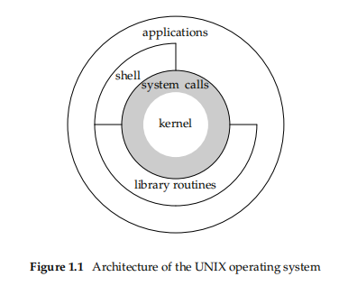
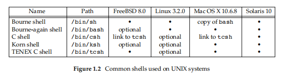
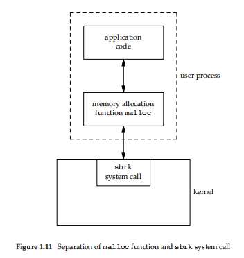
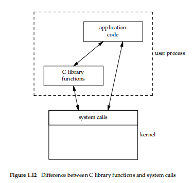

- [UNIX System Overview](#unix-system-overview)
  - [1.1 Introduction](#11-introduction)
  - [1.2 UNIX Architecture](#12-unix-architecture)
  - [1.3 Logging in](#13-logging-in)
    - [Login Name](#login-name)
    - [Shells](#shells)
  - [1.4 Files \* Directories](#14-files--directories)
    - [File System](#file-system)
    - [Filename](#filename)
    - [Pathname](#pathname)
    - [Example](#example)
    - [Working Directory](#working-directory)
    - [Home Directory](#home-directory)
  - [1.5 Input and Output](#15-input-and-output)
    - [File Descriptors](#file-descriptors)
    - [Standard Input, Standard Output, and Standard Error](#standard-input-standard-output-and-standard-error)
    - [Unbuffered I/O](#unbuffered-io)
    - [Example](#example-1)
    - [Standard I/O](#standard-io)
  - [1.6 Programs and Processes](#16-programs-and-processes)
    - [Program](#program)
    - [Processes and Process ID](#processes-and-process-id)
    - [PID 가져오는 예제](#pid-가져오는-예제)
    - [Process Control](#process-control)
    - [Example](#example-2)
    - [참고 exec](#참고-exec)
    - [Threads and Thread IDs](#threads-and-thread-ids)
  - [1.7 Error Handling](#17-error-handling)
    - [Example](#example-3)
    - [Error Recovery](#error-recovery)
  - [1.8 User Identification](#18-user-identification)
    - [User ID](#user-id)
    - [Group ID](#group-id)
    - [Example](#example-4)
    - [Supplementary Group IDs](#supplementary-group-ids)
  - [1.9 Signals](#19-signals)
    - [Example](#example-5)
  - [1.10 Time Values](#110-time-values)
  - [1.11 System Calls and Library Functions](#111-system-calls-and-library-functions)


# UNIX System Overview
## 1.1 Introduction

모든 OS는 OS상에서 실행되는 모든 프로그램들에 대해 아래의 서비스들을 제공한다.

 * 프로그램 실행
 * 파일 열기
 * 파일 읽기
 * 메모리 할당
 * 시스템 시간 가져오기

본 책의 목적은 이 OS에서 제공되는 여러 서비스 들에 대해 기술하는 것이다.

UNIX 시스템에서 아무런 참고 없이 순차적으로 알아간다는 것은 사실 불가능에 가깝다.

따라서 본 챕터에서는 UNIX 시스템 전반에 대해 프로그래머 관점에서 먼저 훑어본다.

## 1.2 UNIX Architecture

OS는 하드웨어 자원을 관리하는 소프트웨어이며, 프로그램들이 운영될 수 있는 환경을 제공한다.

이 소프트웨어는 **커널** 이라고 불리며, 이 커널은 OS의 가장 핵심적인 곳에 위치한다.

아래 그림은 UNIX 시스템 아키텍쳐의 다이어그램이다.



**커널**의 인터페이스는 **시스템콜** 이다. (보통 시스템콜 API로도 부른다.)

이 시스템콜 API를 가지고 있는 라이브러리들은 시스템콜 위에 존재하게 된다.

아래의 에시를 보자.

```c
// 1_2

#include <stdio.h>

int main(void) {
  printf("Hello world\n");
}
```

간단한 ```printf``` 함수인데 이를 빌드하고 ```ldd``` 를 수행하면 아래와 같은 결과를 볼 수있다.
 윈도우-git-bash 에서 실행한 결과라 dll 이 나오고, 일반적으로 리눅스에서 실행하면 ```glibc``` 라는 라이브러리가 나온다.
```bash
ckjin@DESKTOP-HN9P9L8 MINGW64 ~/Desktop/study/GraphicsStudy/APUE/1/code (main)
$ ldd 1_2.exe
        ntdll.dll => /c/Windows/SYSTEM32/ntdll.dll (0x7ffc0a750000)
        KERNEL32.DLL => /c/Windows/System32/KERNEL32.DLL (0x7ffc09ac0000)
        KERNELBASE.dll => /c/Windows/System32/KERNELBASE.dll (0x7ffc081c0000)
        msvcrt.dll => /c/Windows/System32/msvcrt.dll (0x7ffc0a670000)
```

이 라이브러리가 위에서 말하는 커널 - 시스템콜 API 에 대한 구현체를 담고있는 라이브러리이다.

```stdio.h```는 보통 ```/usr/include``` 에 이미 저장되어있어서 이 헤더를 읽어온다.

```Shell``` 은 보통 다른 어플리케이션을 실행시켜주기위한 ```Commaind-Line-Interface```로 대부분의 OS에 내장된다.

## 1.3 Logging in

### Login Name

유닉스 상에 로그인을 할 때, 이름과 비밀번호를 입력한다.

비밀번호는 ```/etc/passwd``` 파일에서 로그인 할 때 사용한 이름을 통해 검색된다.

비밀번호 파일은 7개의 ```:``` 로 구분되는 필드로 구성된다.

```bash
# 필드는 아래와 같다
user_name:
passwd(encrypted):
user_id:
user_group:
주석필드:
home_directory:
Shell_binary(/bin/ksh)

# 실제 /etc/passwd 파일의 저장은 아래와 같다. 비밀번호는 x로 표시한다.
root:x:0:0:root:/root:/bin/bash
daemon:x:1:1:daemon:/usr/sbin:/usr/sbin/nologin
bin:x:2:2:bin:/bin:/usr/sbin/nologin
sys:x:3:3:sys:/dev:/usr/sbin/nologin
sync:x:4:65534:sync:/bin:/bin/sync
...
uuidd:x:106:112::/run/uuidd:/usr/sbin/nologin
tcpdump:x:107:113::/nonexistent:/usr/sbin/nologin
gj:x:1000:1000:,,,:/home/gj:/bin/bash
```

암호 관련된 최신 시스템들은 6장에서 알아본다.

### Shells

일단 로그인을 하면 ```Shell```이 켜진다. 앞서 언급했듯이 ```Shell``` 은 ```Command Line Interface```로
 사용자의 입력을 읽고 파일을 열거나 프로그램을 실행하는 등의 일을 한다.

아래 그림은 일반적인 셸 목록이다. 맥북은 ```zsh``` 였던 것 같다.



어떤 ```Shell``` 이 실행되는 지는 앞서 언급한 ```/etc/passwd``` 에 작성된 마지막 필드를 보고 결정된다.

각 셸에 대한 개발 배경을 막 설명하는데, 그냥 유닉스상에선 보통 ```ksh```은 기본적으로 깔려있고,
 ```Ubuntu, CentOS``` 등의 요즘 많이쓰는 OS에선 ```bash```가 기본적으로 깔려있다.
 ```Shell``` 마다 문법이 조금씩 차이가 있는데, 헷갈리면 보통 ```ksh``` 문법으로 찾으면 모든 ```shell```에서 실행이 된다.

```
참고: WSL2
윈도우 사용 시, WSL2 를 설치하면 편하다.
옛날에 백서 도입부만 대충 봤던 기억이 있는데
Ubuntu 상의 Kernal에 대한 System call api 사용 시
Window 상의 Kernal System Call로 치환해 주는 프로그램이다.
도커나 VM을 안써도 우분투를 손쉽게 쓸 수 있다.
```

## 1.4 Files * Directories

### File System

유닉스 파일시스템은 디렉터리와 파일을 계층적으로 나열한다.

절대 경로 기준 모두 ```root``` 디렉토리부터 시작하며 ```/``` 구분자로 시작된다.

파일은 ```일반파일```과 ```디렉터리```로 구분된다.

파일의 속성은 대략 아래와 같다.
* 파일 형식 (일반파일 / 디렉터리)
* 파일 소유자
* 파일에 대한 사용 권한
* 파일을 마지막으로 수정한 시간

파일 속성 조회는 보통 ```ls -al``` 명령어를 사용한다.
ls는 ```/bin``` 에 기본적으로 포함된 바이너리이며, OS 설치 시 ```Shell```에서 사용하라고 기본제공된다.

```bash
# 권한 : 링크된 파일 수 : 유저 : 그룹 : 크기 : 시간 : 이름
gj@DESKTOP-HN9P9L8:~/dev/my_markdown$ ls -al
total 72
drwxr-xr-x 7 gj gj 4096 Jan 20 01:27 .
drwxr-xr-x 4 gj gj 4096 Jan 20 01:27 ..
drwxr-xr-x 8 gj gj 4096 Nov 19 17:48 .git
drwxr-xr-x 4 gj gj 4096 Nov 16 04:07 GIS
-rw-r--r-- 1 gj gj  180 Nov 19 17:48 LoadMap.md
drwxr-xr-x 9 gj gj 4096 Nov 19 17:48 ProSync
-rw-r--r-- 1 gj gj   51 Nov 16 04:07 README.md
-rw-r--r-- 1 gj gj  261 Nov 16 04:07 amgn.md
drwxr-xr-x 4 gj gj 4096 Nov 16 04:07 cpp_study
```

더욱 세부적인 내용은 ```stat``` 이라는 ```System call API```로 가져올 수 있다. (상세한 내용은 4장에서)

```c
#include <stdio.h>
#include <sys/stat.h>

int main(int argc, char *argv[]) {
  struct stat st;

  if (stat(argv[1], &st) == -1) {
    perror("stat");
    return 1;
  }

  printf("st.st_size: %d\n", st.st_size);

  return 0;
}
```

```bash
ckjin@DESKTOP-HN9P9L8 MINGW64 ~/Desktop/study/GraphicsStudy/APUE/1/code (main)
$ 1_4.exe 1_4.c
st.st_size: 243
```

간단히 사이즈를 가져오는 함수이다. st구조체에는 더욱 많은 내용이 들어있다.

### Filename

위에서 본 ```파일이름``` 속성에는 ```/``` 과 ```Null``` 빼곤 다 올 수 있다. 구분자랑 널데이터는 이름의 대상이 될 수 없다.

하지만 일반 인쇄문자 (Ascii 같은) 로 표현하는게 좋다. ```Shell```에 설정한 ```Character Set```이 다르면 마구마구깨진다.

```.```은 현재 디렉토리 ```..``` 는 상위 디렉토리를 의미한다. 루트에선 ```..```가 ```.```랑 같다.

### Pathname

```/```로 시작하면 절대경로, 그렇지 않으면 상대경로이다.

### Example
c코드가 git 상에서 제공되는데, 실행하면 아래와 같다.

실행 환경은 WSL이다.

```c
#include "apue.h"
#include <dirent.h>

int
main(int argc, char *argv[])
{
        DIR                             *dp;
        struct dirent   *dirp;

        if (argc != 2)
                err_quit("usage: ls directory_name");

        if ((dp = opendir(argv[1])) == NULL)
                err_sys("can't open %s", argv[1]);
        while ((dirp = readdir(dp)) != NULL)
                printf("%s\n", dirp->d_name);

        closedir(dp);
        exit(0);
}
```
결과는 아래와 같다. 옵션을 안준 ```ls```와 거의 동일하다. 파일명만 나온다.

```bash
gj@DESKTOP-HN9P9L8:~/dev/tmp/apue.3e/intro$ ./ls1 ..
Make.defines.solaris
sockets
include
intro
# 중략
printer
environ
..
README
.
```

```ls``` 같은 명령어들이나 ```시스템콜 API``` 스펙을 보는 방법도 ```UNIX``` 에선 모두 규격화 되어있는데,
 ```man```이 그 명령어이다.

```bash
man ls
```
```bash
LS(1)                                              User Commands                                             LS(1)

NAME
       ls - list directory contents

SYNOPSIS
       ls [OPTION]... [FILE]...

DESCRIPTION
       List  information  about the FILEs (the current directory by default).  Sort entries alphabetically if none
       of -cftuvSUX nor --sort is specified.

       Mandatory arguments to long options are mandatory for short options too.

       -a, --all
              do not ignore entries starting with .
# 생략

```

위 코드에 대한 설명이 쭉 나열되는데, 대부분 시스템콜이거나, 유닉스에서 제공되는 구조체에 대한 설명이다.
 따라서 스킵하겠다.

### Working Directory

모든 프로세스는 작업 디렉토리가 존재한다.

여기서 경로 ```doc/memo/joe```를 보자.

상대경로라는걸 알 수 있는데, 상대경로는 작업 디렉토리 기준으로 탐색이 된다.

```chdir```를 통해 작업 디렉토리를 바꿀 수 있는데, 바꾸지 않았다면 프로세스가 실행된 디렉토리가 작업디렉토리가 된다.

그래서 위 ```ls1 ..``` 명령의 ```..```이 ls1 기준 상대경로로 해석이 되고, 상위 디렉토리에서 ```ls1``` 을 수행한 결과가 나온 것이다.

### Home Directory

유닉스에 로그인하면 자동으로 이동되는 디렉토리이다. ```$HOME``` 환경변수에 저장되어있어서, 쉽게 확인이 가능하다.

```bash
ckjin@DESKTOP-HN9P9L8 MINGW64 ~/Desktop/study/GraphicsStudy/APUE/1/code (main)
$ echo $HOME
/c/Users/ckjin

ckjin@DESKTOP-HN9P9L8 MINGW64 ~/Desktop/study/GraphicsStudy/APUE/1/code (main)
$ echo ~
/c/Users/ckjin
```

## 1.5 Input and Output

### File Descriptors

파일 디스크립터는 음이 아닌 정수로 표현되어, 커널에서 사용된다.

커널은 파일 디스크립터를 통해 파일에 접근한다.

우리가 시스템콜을 통해 파일을 열면, 파일 디스크립터를 리턴받아 해당 디스크립터를 통해 ```read/write```이 가능하다.

```c
// 간단한 예
// fopen / popen 같은 API도 내부에선 모두 open을 수행한다.
// fd를 가져오냐, fd가 저장된 구조체를 가져오냐의 차이.
#include <stdio.h>
#include <stdlib.h>
#include <fcntl.h>
#include <unistd.h>

int main(void) {

  int fd = open("out", O_WRONLY | O_CREAT | O_TRUNC);
  write(fd, "asdfasdf", 8);
  close(fd);

  return 0;
}
```

### Standard Input, Standard Output, and Standard Error
```stdin(0) / stdout(1) / stderr(2)``` 는 프로그램 시작때마다 무조건 생성된다. 만약 쓰기 싫으면 close로 닫아줘야 한다.
 예를 들어 로그를 남기는 프로그램의 경우 실행된 터미널에서 아무런 메세지를 남기기 싫다면 stdout을 close 해준다.

또한 리다이렉션이 가능한데,
```<, >```를 쓰면 된다.

### Unbuffered I/O
버퍼를 쓰지 않는 I/O는 ```open/read/write/lseek/close``` 로 제공된다고 한다. 위에서 봤다시피 fd로 동작한다.
버퍼링이 안되기 때문에 버퍼 크기를 사용자가 정해줘야 해서 Unbuffered라는 내용이다.

[참고](http://www.ktword.co.kr/test/view/view.php?no=2335)

Chapter 3에서 상세히 본다.

### Example

```c
// mycat.c
#include "apue.h"
#define BUFFSIZE 4096
int
main(void)
{
        int n;
        char buf[BUFFSIZE];
        while ((n = read(STDIN_FILENO, buf, BUFFSIZE)) > 0)
                if (write(STDOUT_FILENO, buf, n) != n)
                        err_sys("write error");
        if (n < 0)
                err_sys("read error");
        exit(0);
}
```

입력이 들어올 때마다 버퍼에 써주는 함수이다. 리다이렉션을 포함한 사용은 아래와 같다.

종료시키려면 ctrl D를 누르라는데, 사실 ctrl 명령어는 대부분 시그널을 날리는 명령들이라 종료 관련 시그널을 날리면
 알아서 죽는다. ```(ctrl c, ctrl \ etc..)```

```bash
gj@DESKTOP-HN9P9L8:~/dev/tmp/apue.3e/intro$ ./mycat  < mycat.c > out
gj@DESKTOP-HN9P9L8:~/dev/tmp/apue.3e/intro$ cat out
#include "apue.h"

#define BUFFSIZE        4096

int
main(void)
{
        int             n;
        char    buf[BUFFSIZE];

        while ((n = read(STDIN_FILENO, buf, BUFFSIZE)) > 0)
                if (write(STDOUT_FILENO, buf, n) != n)
                        err_sys("write error");

        if (n < 0)
                err_sys("read error");

        exit(0);
}
```
### Standard I/O

Unbuffered i/o 함수들에 대해 버퍼에 대한 인터페이스를 제공한다는걸 확인했다.

하지만 버퍼를 아예 신경쓰지 않고도 쓸 수 있다. 이런걸 표준 입출력 함수에서 제공한다. (getc / putc 를 쓰는 것 뿐)

stdio 함수들은 라인단위로 읽고 쓰는 기능도 제공한다. 상세한 내용은 생략한다.

버퍼를 아예 안쓰는 내용은 아래와 같다.

```c
#include "apue.h"

int
main(void)
{
        int             c;

        while ((c = getc(stdin)) != EOF)
                if (putc(c, stdout) == EOF)
                        err_sys("output error");

        if (ferror(stdin))
                err_sys("input error");

        exit(0);
}
```

## 1.6 Programs and Processes

### Program

프로그램이란 실행 가능한 ```파일```이다.
 프로그램을 실행한다는건 파일의 내용을 메모리로 올린 뒤, ```exec``` 라는 시스템콜을 통한 커널의 결과를 보는 것과 같다.

상세한 내용은 8장을 본다.

### Processes and Process ID

프로그램을 실행하는 인스턴스를 프로세스라고 한다. 앞으로 계속 나올 단어이다.

일부 OS는 task 라고도 한다.

UNIX System은 프로세스에 대해 고유 ID를 발급하는데, 이걸 Process ID라고 한다.

```bash
# ps -ef 예
ckjin@DESKTOP-HN9P9L8 MINGW64 ~/Desktop/study/GraphicsStudy/APUE/1/code (main)
$ ps -ef
     UID     PID    PPID  TTY        STIME COMMAND
   ckjin    2125    1308 cons0    05:27:46 /usr/bin/ps
   ckjin    1308       1 cons0    02:31:37 /usr/bin/bash
```

### PID 가져오는 예제

```c
// hello.c
#include "apue.h"

int
main(void)
{
        printf("hello world from process ID %ld\n", (long)getpid());
        exit(0);
}
```
실행 결과는 아래와 같다.
```bash
gj@DESKTOP-HN9P9L8:~/dev/tmp/apue.3e/intro$ ./hello
hello world from process ID 779
```

유닉스 상에서 ```getpid``` 는 ```pid_t``` 타입으로 리턴되지만, 이 크기를 알 순 없다. (OS마다 다를 수 있으므로)
 따라서 적당히 큰 정수로 표현한다. 실제로 내 회사컴은 65532보다 큰 값은 안나오더라.

### Process Control
프로세스는 ```fork, exec, waitpid``` 로 컨트롤할 수 있다.

* ```fork```
  * 자식 프로세스 생성 시스템콜 API
  * 쉘은 기본적으로 동작하므로, 따로 설정을 빼지 않는이상 대부분 터미널이 부모 프로세스가 된다.
* ```exec```
  * 프로세스가 실행가능한 파일을 메모리로 올리는 동작의 시스템콜 API
* ```waitpid```
  * 부모가 자식프로세스의 종료를 기다리는 시스템콜 API

```bash
ckjin@DESKTOP-HN9P9L8 MINGW64 ~/Desktop/study/GraphicsStudy/APUE/1/code (main)
$ ps -ef
     UID     PID    PPID  TTY        STIME COMMAND
   ckjin    2157       1 cons1    05:35:06 /usr/bin/bash
   ckjin    2336    2157 cons1    05:37:47 /usr/bin/ps
```

### Example

stdin에서 명령을 읽고 실행하는 간단한 프로그램이다.

```c
// shell1.c
#include "apue.h"
#include <sys/wait.h>

int
main(void)
{
        char    buf[MAXLINE];   /* from apue.h */
        pid_t   pid;
        int             status;

        printf("%% ");  /* print prompt (printf requires %% to print %) */
        while (fgets(buf, MAXLINE, stdin) != NULL) {
                if (buf[strlen(buf) - 1] == '\n')
                        buf[strlen(buf) - 1] = 0; /* replace newline with null */

                if ((pid = fork()) < 0) {
                  // * 참고 *
                  // 이 시점부터 프로세스는 2개가 된다.
                  // 새 프로세스는 기존 프로세스의 메모리 내용을 모두 카피한채로 동작한다.
                        err_sys("fork error");
                } else if (pid == 0) {          /* child */
                        execlp(buf, buf, (char *)0);
                        // * 참고 *
                        // exec는 실행가능파일을 메모리로 올리는 동작을 한다.
                        // 따라서 기존에 카피했던 메모리 내용은 모두 닦이고 새 메모리로 내용이 채워진다.
                        err_ret("couldn't execute: %s", buf);
                        exit(127); // command not found
                }

                /* parent */
                if ((pid = waitpid(pid, &status, 0)) < 0)
                        err_sys("waitpid error");
                printf("%% ");
        }
        exit(0);
}
```

코드 설명은 아래와 같다.

* stdin 으로 부터 1줄 데이터를 받아온다.
  * CTRL-D면 (EOF면 or Signal 나면) 프로세스가 종료된다.
* ```fork``` 의 리턴은 자식의 ```pid``` 이다.
  * 자식 프로세스를 생성한다.
  * 자식은 0을 리턴받는다.
  * 리턴을 2번 받는다고도 표현하는데, 부모가 1번 자식이 1번 받기 때문이다.
* 자식프로세스는 ```execlp```를 사용한다.
  * ```exec``` 관련 시스템콜은 그 종류가 다양하다.
  * ```execlp``` 는 ```파일 경로``` 를 받고, argument를 준다. ```(argc, argv)```
  * 마지막 ```argv```는 ```NULL```을 주어야 해서 ```(char *)0``` 이다.
* ```waitpid```는 부모 프로세스에서 호출되는데, 여기서는 종료 대기만 한다. 상세 스펙은 아래 링크를 참고한다.
  * [링크](https://codetravel.tistory.com/42)
  * 비정상 상황에서 논블락으로 상태체크를 하는 등의 여러 옵션이 포함된다.
* 한계
  * fgets로 넘어가서 개행에 대한 파싱이 안되기 때문에 argv를 사실 제대로 줄 수가 없는 구조다.


```bash
gj@DESKTOP-HN9P9L8:~/dev/tmp/apue.3e/intro$ ./shell1
% ls
Makefile  getcputc.c  hello.c  ls1.c  mycat.c  shell1    shell2    testerror    tmp.c   uidgid.c
getcputc  hello       ls1      mycat  out      shell1.c  shell2.c  testerror.c  uidgid
% ls -a
couldn't execute: ls -a: No such file or directory
```

### 참고 exec
```c
int execl(const char *path, const char *arg, ...);
int execlp(const char *file, const char *arg, ...);
int execle(const char *path, const char *arg, ..., char * const envp[]);
int execv(const char *path, char *const argv[]);
int execvp(const char *file, char *const argv[]);
int execvpe(const char *file, char *const argv[], char *const envp[]);
```
exec를 보면 어떤 놈은 path이고 어떤 놈은 file이다.

path 는 시스템 환경변수 $PATH 상에 visible한 실행 가능한 파일을 탐색하는거고

file 은 절대/상대 경로로 들어오는 놈을 찾는 것이다.

예를 들어 우리가 터미널에서 'ls' 라고 쳐도 프로그램이 동작하는 이유는 PATH 상에 ls가 있기 때문이다.
```bash
gj@DESKTOP-HN9P9L8:~/dev/tmp/apue.3e/intro$ which a.out

gj@DESKTOP-HN9P9L8:~/dev/tmp/apue.3e/intro$ ls
Makefile  getcputc.c  hello.c  ls1.c  mycat.c  shell1    shell2    testerror    tmp.c   uidgid.c
getcputc  hello       ls1      mycat  out      shell1.c  shell2.c  testerror.c  uidgid

gj@DESKTOP-HN9P9L8:~/dev/tmp/apue.3e/intro$ which shell1

gj@DESKTOP-HN9P9L8:~/dev/tmp/apue.3e/intro$ which ls
/usr/bin/ls

gj@DESKTOP-HN9P9L8:~/dev/tmp/apue.3e/intro$ echo $PATH | tr ':' '\n'
/usr/local/sbin
/usr/local/bin
/usr/sbin
/usr/bin
/sbin
/bin
# 중략
/mnt/c/Program Files/Java/jdk-11.0.13/bin
/mnt/c/Program Files/mingw-w64/x86_64-8.1.0-posix-seh-rt_v6-rev0/mingw64/bin
/mnt/c/Program Files (x86)/GnuWin32/bin
/snap/bin
```

### Threads and Thread IDs
한 프로세스엔 일반적으로 한 ```Thread```만 동작한다.

다만 가끔은 멀티 ```Thread```가 효율적일 수 있다.

```Thread```가 여럿인 경우, 이들은 FD, 파일 설명자(Working Directory), 스택이나 프로세스 관련 속성을 모두 공유한다.

```Thread```는 자체 스택에서 실행되긴 하지만 다른 ```Thread```의 스택에 접근하는 것도 가능하다.

따라서 ```Thread```는 공유할 데이터에 대한 액세스를 동기화 해야하는 문제가 있다.

프로세스와 마찬가지로 ```Thread```도 고유 ID로 관리된다. 이 ID는 프로세스의 로컬변수로, 다른 프로세스의 ```Thread```랑은 아무 관계가 없다.

12장에서 상세한 내용을 설명한다.

## 1.7 Error Handling

```System Call API``` 는 오류가 발생하면 대부분 음수를 반환한다.

여기서 ```errno``` 라는 변수는 보통 그 이유를 설명해주는 값으로 설정된다.

파일이 없거나 권한이 없는 등의 경우 모두 ```open``` 실패로 이루어지며,

```open```에 대한 값이 음수가 오면 ```errno``` 를 확인하면 된다.

음수가 아닌 경우는 포인터를 반환하고, 포인터 반환의 경우 ```NULL``` 이 리턴된다.

```errno```는 ```E``` 로 시작하는 에러를 가지고 있으며, 메뉴얼을 찾아보면 여러 에러를 알 수 있다.

```EACCES``` 도 대표적인 에러인데, 액세스 권한 관련 에러이다.
아래 예시는 ```ENOENT``` 예시이다.


```c
#include <stdio.h>
#include <stdlib.h>
#include <fcntl.h>
#include <unistd.h>

int main(void) {

  int fd = open("xxxxx", O_RDONLY);
  printf("fd:%d\n", fd);
  printf("errno: %d[%s]\n", errno, strerror(errno));
  close(fd);

  return 0;
}
```

```bash
ckjin@DESKTOP-HN9P9L8 MINGW64 ~/Desktop/study/GraphicsStudy/APUE/1/code (main)
$ ./1_7.exe
fd:-1
errno: 2[No such file or directory]
```

POSIX에서 ```errno``` 는 수정가능한 l-value로 정의된다. 따라서 에러 번호를 포함하는 정수일 수도 있고,
 오류 번호로 포인터를 반환하는 함수일 수도 있다.

또한 멀티 쓰레드 환경을 고려하면, 각 쓰레드별로 고유한 errno 공간이 필요하다.

리눅스는 아래와 같이 다중 쓰레드 액세스를 지원한다.

```c
extern int *_ _errno_location(void);
#define errno (*_ _errno_location())
```

인터넷을 찾아보니 ```errno```에 대해 TLS(Thread Local Storage) 태그 ```__thread``` 를 붙여서 정의를 한다는걸 알 수 있었다.

```c
__thread int errno;
```
위 태그는 같은 .c파일에 작성해도 각 쓰레드 별도 공간에 저장하도록 해주는 태그이다.


errno 관련 주의사항은
* 에러가 발생했을 때만 확인해야 한다는 것과 (값을 안닦아줌)
* 값으로 0을 가지지 않는다는 것이다. (errno==0 이면 정상으로 처리해선 안된다는 뜻)

### Example

위랑 비슷한데, ```perror``` 관련 예시라 보면 좋다.

```c
// testerror.c
#include "apue.h"
#include <errno.h>

int
main(int argc, char *argv[])
{
        fprintf(stderr, "EACCES: %s\n", strerror(EACCES));
        errno = ENOENT;
        perror(argv[0]);
        exit(0);
}
```

```bash
gj@DESKTOP-HN9P9L8:~/dev/tmp/apue.3e/intro$ ./testerror
EACCES: Permission denied
./testerror: No such file or directory
```

바이너리 명까지 같이 에러로 찍히는걸 알 수 있다. 이는 파이프를 통해 여러 프로세스로 실행되는 상황에서 어떤 바이너리에서 에러가 발생했는 지 알기 쉽다.

```bash
ckjin@DESKTOP-HN9P9L8 MINGW64 ~/Desktop/study/GraphicsStudy/APUE/1/code (main)
$ cat < 1_7.cc  | grep a
bash: 1_7.cc: No such file or directory
```

### Error Recovery
에러들은 모두 치명적인 에러인건 아니다.

예를들어 ```connect``` 라는 클라이언트의 ```System call api```는 서버에 연결을 하는 함수인데

```EAGAIN``` 이 발생할 경우 서버에 남는 자원이 없어서 연결을 못받아 주거나 하는 등의 문제로 발생한다.

이 때는 다시 ```connect```를 반복하여 연결이 될 때까지 동작하는게 옳다.

따라서 개발자가 알아서 적절한 에러처리를 핸들해야한다.

## 1.8 User Identification

### User ID
유저의 ID는 앞서 로그인에서 본 ```passwd``` 파일에 기술되어있는데, OS는 이 ID를 보고 특정 작업에 대한 권한을 확인한다.

ID가 0이면 ```root/superuser``` 를 의미한다. ```root``` 계정은 일반적으로 ```root``` 이름 그대로 존재하며 이 녀석의 권한을 ```superuser``` 권한이라 한다. 이 권한은 OS 상의 모든 행동에 제약이 없다.

흔히 ```sudo apt-get install gcc``` 같은 명령어로 레파지토리에서 로컬시스템으로 여러 라이브러리/바이너리를 다운받는데, 이 때 ```sudo``` 가 ```super user do``` 이다.

### Group ID

유저를 그룹단위로 묶어서 동일한 액세스 권한을 줄 때 사용한다.

한 그룹 내에서 가지는 액세스 권한은 다른 그룹의 유저가 접근할 수 없다.

마찬가지로 정수로 저장된다.

```ls -al``` 등의 명령어로 나오는 유저와 그룹의 이름은 ID를 가지고 ```ls``` 바이너리 내에서 이름으로 치환한 것이다.

### Example

```c
// uidgid.c
#include "apue.h"

int
main(void)
{
        printf("uid = %d, gid = %d\n", getuid(), getgid());
        exit(0);
}
```

```bash
gj@DESKTOP-HN9P9L8:~/dev/tmp/apue.3e/intro$ ./uidgid
uid = 1000, gid = 1000

gj@DESKTOP-HN9P9L8:~/dev/tmp/apue.3e/intro$ sudo su
[sudo] password for gj:
root@DESKTOP-HN9P9L8:/home/gj/dev/tmp/apue.3e/intro# ./uidgid
uid = 0, gid = 0
```

### Supplementary Group IDs
유저에 대해 그룹이 1개만 있지 않고 대부분 UNIX에선 16개까지 지원한다.

다음 장에서 알아본다.

## 1.9 Signals

프로세스에서 어떤 상태가 발생할 경우, 운영체제에서 해당 프로세스로 신호를 보내주는데 이게 시그널이다.

```c
#include <stdio.h>
#include <stdlib.h>

int main(void) {

  char *null_str = NULL;
  char *null_str2 = NULL;

  memcpy(null_str, null_str2, 10);

  return 0;
}
```

```bash
ckjin@DESKTOP-HN9P9L8 MINGW64 ~/Desktop/study/GraphicsStudy/APUE/1/code (main)
$ 1_9.exe
Segmentation fault
```

Segmentation fault는 대표적인 Signal (11) 로 접근 불가능한 메모리 세그먼트에 대해 접근했으므로 에러를 뱉어주는 것이다.

시그널의 이름과 번호는 ```kill -l``` 를 통해 확인이 가능하다.
```bash
ckjin@DESKTOP-HN9P9L8 MINGW64 ~/Desktop/study/GraphicsStudy/APUE/1/code (main)
$ kill -l
 1) SIGHUP       2) SIGINT       3) SIGQUIT      4) SIGILL       5) SIGTRAP
 6) SIGABRT      7) SIGEMT       8) SIGFPE       9) SIGKILL     10) SIGBUS
11) SIGSEGV     12) SIGSYS      13) SIGPIPE     14) SIGALRM     15) SIGTERM
16) SIGURG      17) SIGSTOP     18) SIGTSTP     19) SIGCONT     20) SIGCHLD
21) SIGTTIN     22) SIGTTOU     23) SIGIO       24) SIGXCPU     25) SIGXFSZ
26) SIGVTALRM   27) SIGPROF     28) SIGWINCH    29) SIGPWR      30) SIGUSR1
31) SIGUSR2     32) SIGRTMIN    33) SIGRTMIN+1  34) SIGRTMIN+2  35) SIGRTMIN+3
36) SIGRTMIN+4  37) SIGRTMIN+5  38) SIGRTMIN+6  39) SIGRTMIN+7  40) SIGRTMIN+8
41) SIGRTMIN+9  42) SIGRTMIN+10 43) SIGRTMIN+11 44) SIGRTMIN+12 45) SIGRTMIN+13
46) SIGRTMIN+14 47) SIGRTMIN+15 48) SIGRTMIN+16 49) SIGRTMAX-15 50) SIGRTMAX-14
51) SIGRTMAX-13 52) SIGRTMAX-12 53) SIGRTMAX-11 54) SIGRTMAX-10 55) SIGRTMAX-9
56) SIGRTMAX-8  57) SIGRTMAX-7  58) SIGRTMAX-6  59) SIGRTMAX-5  60) SIGRTMAX-4
61) SIGRTMAX-3  62) SIGRTMAX-2  63) SIGRTMAX-1  64) SIGRTMAX
```
kill인 이유는 옛날엔 시그널이 대부분 프로세스 죽일 때 사용되어서 그렇다 카더라.

프로세스를 죽일 때 kill -9를 사용하는 이유를 알 수 있다.

시그널을 받을 때 3가지 행동을 할 수 있다.

1. 시그널을 무시한다. (시그널에 대한 핸들러를 SIG_IGN로 설정)
2. default 동작이 나도록 한다. (죽어야 하는 시그널의 경우 죽게된다. (sig segv))
3. 시그널 별로 콜백함수를 설정한다 (시그널에 대해 'catch' 한다)

시그널은 권한이 있을 때만 보낼 수 있다. 없으면 ```sudo```를 써야한다.

```bash
ckjin@DESKTOP-HN9P9L8 MINGW64 ~/Desktop/study/GraphicsStudy/APUE/1/code (main)
$ sleep 10 &
[1] 2507

ckjin@DESKTOP-HN9P9L8 MINGW64 ~/Desktop/study/GraphicsStudy/APUE/1/code (main)
$ kill -9 2507
[1]+  Killed                  sleep 10
```

### Example

프로세스를 죽일 때 보통 SIGINT(2) (Ctrl + c)를 보낸다.

코딩테스트를 풀 때 프로세스가 무한루프에 빠지면 사용할 때 아주 용이하다.

이 부분에 콜백함수를 달아 동작하지 않도록 만드는 예시이다.

코드는 아까 본거랑 동일한데 SIGINT에 대한 시그널 핸들러를 달아주느 걸 알 수 있다.

```c
#include "apue.h"
#include <sys/wait.h>

static void     sig_int(int);           /* our signal-catching function */

int
main(void)
{
        char    buf[MAXLINE];   /* from apue.h */
        pid_t   pid;
        int             status;

        if (signal(SIGINT, sig_int) == SIG_ERR)
                err_sys("signal error");

        printf("%% ");  /* print prompt (printf requires %% to print %) */
        while (fgets(buf, MAXLINE, stdin) != NULL) {
                if (buf[strlen(buf) - 1] == '\n')
                        buf[strlen(buf) - 1] = 0; /* replace newline with null */

                if ((pid = fork()) < 0) {
                        err_sys("fork error");
                } else if (pid == 0) {          /* child */
                        execlp(buf, buf, (char *)0);
                        err_ret("couldn't execute: %s", buf);
                        exit(127);
                }

                /* parent */
                if ((pid = waitpid(pid, &status, 0)) < 0)
                        err_sys("waitpid error");
                printf("%% ");
        }
        exit(0);
}

void
sig_int(int signo)
{
        printf("interrupt\n%% ");
}
```

```bash
gj@DESKTOP-HN9P9L8:~/dev/tmp/apue.3e/intro$ ./shell2
% ls
Makefile  getcputc.c  hello.c  ls1.c  mycat.c  shell1    shell2    testerror    tmp.c   uidgid.c
getcputc  hello       ls1      mycat  out      shell1.c  shell2.c  testerror.c  uidgid
% ^Cinterrupt # SIGINT (2), printf만 한다.
^\Quit        # SIGQUIT(3), 핸들러가 없으므로 종료된다.
```

핸들러 무시 예제이다.
```c
        if (signal(SIGINT, sig_int) == SIG_ERR)
                err_sys("signal error");
        if (signal(SIGQUIT, SIG_IGN) == SIG_ERR)
                err_sys("signal error");
```
```bash
gj@DESKTOP-HN9P9L8:~/dev/tmp/apue.3e/intro$ ./shell2
% ls
Makefile  getcputc.c  hello.c  ls1.c  mycat.c  shell1    shell2    testerror    tmp.c   uidgid.c
getcputc  hello       ls1      mycat  out      shell1.c  shell2.c  testerror.c  uidgid
% ^Cinterrupt
^\^\^\^\^\^\^\^\^\^\^\^\
```

## 1.10 Time Values
UNIX는 역사적으로 두 가지 다른 타입의 시간 데이터를 관리한다.

1. Calendar time
* 1970 1월 1일 00:00:00 UTC(Universal Time) 부터 현재까지 흐른 초
* time_t 타입으로 UNIX 상에서 저장된다.

2. 프로세스 시간
* CPU Time이랑 동일하다.
* clock_t 타입으로 UNIX 상에서 저장된다.

프로세스의 실행시간을 측정할 땐 UNIX가 프로세스에 대해 아래 3개의 값을 유지하고 있는 것을 알면 좋다.
* Clock time
  * Clock Time은 ```wall clock time```라고도 불리며, 프로세스가 실행되는 동안 흘렀던 시간의 총량이다.
  * 당연히 다른 프로세스가 CPU를 점유한 시간만큼 영향을 받는다.
* User CPU time
  * 유저의 명령 (산술연산 등) 으로 인해 CPU가 점유된 시간을 의미한다.
* System CPU time
  * 이 프로세스로 인해 커널의 System call을 통해 흐른 시간을 의미한다.

아래와 같은 바이너리가 UNIX에 기본적으로 제공된다. (OS마다 측정방식의 차이는 있을 수 있다.)

```bash
gj@DESKTOP-HN9P9L8:~/dev/tmp/apue.3e/intro$ time -p grep _POSIX_SOURCE /usr/include/*/*.h > /dev/null
real 0.16
user 0.00
sys 0.05
```

## 1.11 System Calls and Library Functions

모든 운영체제는 커널에 서비스를 요청할 수 있는 서비스 포인트 (```System call API```) 를 제공한다.

그림 1.1을 다시 보자.


버전마다 제공되는 ```System call API``` 의 갯수는 다르고, 그 종류도 다양하다.

생각보다 차이가 좀 있는게, JVM을 리눅스에서 돌리면 ```open/write/close```가 잘 불리지만 AIX라는 IBM에서 개발한 상용 OS에서 돌리면 ```open32``` 같은 자체 ```System call API```를 호출해버린다.

```System call API```는 시스템이나 어플리케이션이 무슨 언어로 쓰였던 c언어로 정의되어있다.

위에서 Java예시를 들었는데 Java도 결국 JVM이라는 가상머신이 바이트코드를 읽는 java 실행파일이다.

파이썬도 마찬가지로 스크립트를 읽는 바이너리가 읽는거고, 이 바이너리는 결국 ```System call API```가 포함된 라이브러리를 참조한다.

```bash
gj@DESKTOP-HN9P9L8:~/dev/tmp/apue.3e/intro$ which python3
/usr/bin/python3
gj@DESKTOP-HN9P9L8:~/dev/tmp/apue.3e/intro$ ldd /usr/bin/python3
        linux-vdso.so.1 (0x00007ffeffb95000)
        libm.so.6 => /lib/x86_64-linux-gnu/libm.so.6 (0x00007f5009160000)
        libexpat.so.1 => /lib/x86_64-linux-gnu/libexpat.so.1 (0x00007f500912f000)
        libz.so.1 => /lib/x86_64-linux-gnu/libz.so.1 (0x00007f5009113000)
        libc.so.6 => /lib/x86_64-linux-gnu/libc.so.6 (0x00007f5008eeb000)
        /lib64/ld-linux-x86-64.so.2 (0x00007f5009838000)
```

UNIX에서 사용하는 ```System call API``` 기술 중 하나는 모든 OS에서 동일한 이름의 함수를 가지도록 만드는 것이다.

Java의 바이트코드가 모든 JVM에서 동일하듯, ```open/write/close``` 같은 ```System call API```들은 맥북이던, 우분투던, AIX던, Solrais던 모든 UNIX 기반 운영체제에서 동일한 형태의 ```API```를 제공한다.

또한 이런 ```API```들을 그 자체(C-Calling-Sequence)로 사용되거나 C 표준 라이브러리에서 기능으로 묶어 c형태의 함수로 간주해 사용하도록 되어있다. 사용자는 내부 구현을 몰라도 모든 환경에서 편하게 사용할 수 있다. (printf, fgetc, etc..)

또한 모든 C 함수라고 커널의 ```System call API```을 호출하진 않는다. ```memcpy```나 ```strcpy``` 등은 CPU와 메모리 사이에서 일어나는 일이지, 파일을 접근한다거나 운영체제의 리소스를 사용하는 작업이 아니다. ```printf``` 같은건 stdout이라는 파일 디스크립터로의 출력이 필요하기 때문에 ```System call API``` 이 호출된다.

```c
// 아무것도 include 안해도 빌드가 된다.
int main(void) {

  int a = 3;
  int b = 4;

  return a + b;
}
```
대부분의 경우 표준 라이브러리 함수 (printf 등)만 알아도 사용할 수 있지만 경우에 따라 없는 함수가 있다면 ```System call API``` 그 자체로 구현할 줄도 알아야 한다. (혹은 대체될 수 있음을 알아야 한다.)

예를 들어 ```malloc``` 의 경우, C 표준 라이브러리 안에 있는 함수이다.

메모리 할당과 해제를 하는 여러 방법이 있지만 ```malloc```함수는 ```sbrk``` 라는 ```System call API``` 를 통해 한 가지 특수한 경우에 대한 할당만 처리한다.

따라서 많은 메모리 관련 라이브러리들은 이 할당방법이 마음에 들지 않아 자신들만의 방법으로 ```System call API``` 인 ```sbrk```를 사용하여 메모리 할당을 구현한다.

> ```sbrk```는 바이트 단위로 메모리의 주소공간을 늘리거나 감소시킨다.



위 그림은 ```malloc``` 과 ```sbrk``` 와의 관계에 대해 설명한다.

* ```sbrk``` 는 커널에서 호출된 ```System call```로 프로세스의 추가적인 메모리를 할당하는 역할을 한다.
* ```malloc```은 받은 공간을 유저레벨에서 관리하는 것에 책임이 있다.

```System Call```과 ```C 표준 라이브러리 함수``` 간의 차이는 시간측정 함수에서도 나타난다.

일부 운영체제 에서는 시간(s)을 반환하는 ```System Call```을 제공하고, 시간에 대해 날짜를 반환받는 ```System Call```을 추가로 제공한다.

유닉스 시스템은 시간(s)을 반환하는 ```System Call```만 호출하고, 이후는 유저레벨에서 바이너리가 처리한다.



따라서 응용 프로그램은 ```System Call``` 을 호출할 수도, ```C 표준 라이브러리 함수``` 를 호출할 수도 있다.

위 그림을 보면 알 수 있듯, 대부분의 프로그램은 위와 같이 구성된다.

```System Call``` 은 아주 기본적인 기능만 제공하는 한편, ```C 표준 라이브러리 함수```는 조금 더 정교한 기능을 제공한다. (```malloc```과 ```sbrk```)

3장에선 ```System Call```를 통한 unbuffered i/o를 살펴볼거고, 5장에선 표준 I/O 함수들을 살펴보게 된다.

또한 일부 프로세스 제어 ```System Call``` 또한 ```C 표준 라이브러리 함수```로 감싸지기도 한다.

```popen / pread / pclose``` 를 통해 바이너리를 실행하는 게 그 예시이다. 8 / 10장에서 더 본다.

이렇듯 구분은 되지만 이걸 일일히 구분하면서 설명하긴 어려워 이후부턴 모두 함수라는 용어로 통일하겠다.


