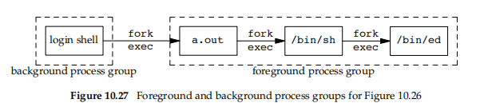

## 10.12 ```sigprocmask``` Function

```c
#include <signal.h>
int sigprocmask(int how, const sigset_t *restrict set, sigset_t *restrict oset);
      // Returns: 0 if OK, −1 on error
```

특정 시그널을 블록하거나 블록 해제하는데에 사용.
또한 블록된 시그널 목록을 가져오는 등의 작업에 사용될 수 있음.

* Argument 설명
  *  how
    * SIG_BLOCK: 새로운 시그널 집합을 블록 리스트에 추가.
    * SIG_UNBLOCK: 특정 시그널을 블록 리스트에서 제거.
    * SIG_SETMASK: 기존의 블록 리스트를 새로운 시그널 집합으로 완전히 대체.
  * set
    * 새로 설정할 시그널 집합의 포인터
  * oldset
    * 기존 시그널 집합의 목록을 저장할 포인터.
    * 따로 필요 없으면 ```NULL```로 설정

* 코드 예

```c
#include "apue.h"
#include <errno.h>

void pr_mask(const char *str) {
    sigset_t sigset;
    int errno_save;

    errno_save = errno; /* 시그널 핸들러에서 호출될 수 있으므로 errno 저장 */

    if (sigprocmask(0, NULL, &sigset) < 0) {
        err_ret("sigprocmask error");
    } else {
        printf("%s", str);

        if (sigismember(&sigset, SIGINT))
            printf(" SIGINT");
        if (sigismember(&sigset, SIGQUIT))
            printf(" SIGQUIT");
        if (sigismember(&sigset, SIGUSR1))
            printf(" SIGUSR1");
        if (sigismember(&sigset, SIGALRM))
            printf(" SIGALRM");

        /* 추가적인 시그널을 여기에 추가할 수 있습니다 */
        printf("\n");
    }

    errno = errno_save; /* errno 복원 */
}
```

## 10.13 sigpending Function

```c
int sigpending(sigset_t *set);
      // Returns: 0 if OK, −1 on error
```
블록된 시그널 중에서 실제로 대기하고 있는 시그널의 목록을 받아오는 함수.

* set
  * 대기 중인 시그널 목록을 받아올 포인터

```c
#include "apue.h"
static void sig_quit(int);

int main(void) {
    sigset_t newmask, oldmask, pendmask;

    if (signal(SIGQUIT, sig_quit) == SIG_ERR)
        err_sys("can’t catch SIGQUIT");

    /* SIGQUIT 시그널을 블록하고, 현재 시그널 마스크 저장 */
    sigemptyset(&newmask);
    sigaddset(&newmask, SIGQUIT);
    if (sigprocmask(SIG_BLOCK, &newmask, &oldmask) < 0)
        err_sys("SIG_BLOCK error");

    sleep(5); /* 이때 SIGQUIT 시그널이 발생하면 대기(pending) 상태가 됨 */

    if (sigpending(&pendmask) < 0)
        err_sys("sigpending error");

    if (sigismember(&pendmask, SIGQUIT))
        printf("\nSIGQUIT pending\n");

    /* 기존 시그널 마스크를 복원하여 SIGQUIT 시그널 블록 해제 */
    if (sigprocmask(SIG_SETMASK, &oldmask, NULL) < 0)
        err_sys("SIG_SETMASK error");

    printf("SIGQUIT unblocked\n");
    sleep(5); /* 이때 SIGQUIT 시그널이 발생하면 프로세스가 종료됨 (코어 덤프 발생) */

    exit(0);
}

static void sig_quit(int signo) {
    printf("caught SIGQUIT\n");

    if (signal(SIGQUIT, SIG_DFL) == SIG_ERR)
        err_sys("can’t reset SIGQUIT");
}
```

* 코드 설명은 아래와 같음
  * ```sigquit``` 핸들러 설정
  * ```empty set``` 생성 이후 ```sigquit```을 해당 set에 추가함
  * ```sigprocmask``` 로 실제 block을 수행
  * sleep(5) => 내가 시그널 발생 시켜아함
  * 시그널 발생 이후 pending을 통해 확인

주의할 점은, 시그널을 내가 N번 발생시켜도 블록은 1번만되고, 핸들러 또한 1번만 불린다는 것.


## 10.14 sigaction Function

sigaction은 POSIX 표준함수로, ```signal``` 에 비해 훨씬 안정적인 기능들을 제공.

```c
#include <signal.h>
int sigaction(int signo, const struct sigaction *restrict act, struct sigaction *restrict oact);
      // Returns: 0 if OK, −1 on error
```

* signo
  * 처리할 대상이 될 시그널 번호
* act
  * 새로운 동작을 정의할 포인터
* oact
  * 예전 동작을 리턴받을 포인터

구조체는 아래와 같이 생겼다.

```c
struct sigaction {
    void (*sa_handler)(int);  // 시그널 핸들러 또는 SIG_IGN, SIG_DFL
    sigset_t sa_mask;         // 추가로 블록할 시그널 집합
    int sa_flags;             // 시그널 처리 옵션
    void (*sa_sigaction)(int, siginfo_t *, void *);  // 대체 시그널 핸들러
};
```

* sa_handler
  * 실제 시그널 핸들러 대상 함수
* sa_mask
  * 시그널 집합
* sa_flags (몇 개만 봄)
  * SA_SIGINFO: 시그널핸들러에 추가 정보를 줄 수 있음. 시그널과 관련된 정보 (```siginfo_t```)
    * ```siginfo_t``` 구조체 ?
      * 시그널 번호(si_signo),
      * 발생 원인 코드(si_code),
      * 등이 포함됨
    * 이게 설정되면, ```sigaction``` 내에서 ```sa_sigaction``` 가 호출된다고 함 (상세 정보가 추가로 들어가므로)
  * SA_RESTART: 시그널에 의해 중단된 시스템 호출을 자동으로 재시작.
  * etc..
* sa_sigaction
  * 앞서 말한 대체함수
  * int, siginfo는 앞서 말한 시그널 번호와 대상 함수가 될 것임
  * 세 번째 인자는 void* 로, sa_flags 로 설정한 내용에 따라 다양한 리턴을 받음
  * ```uc_stack``` 같은 값을 통해 현재 스텍프레임의 레지스터값? 들도 받을 수 있음
    * void *ss_sp: 스택의 베이스 주소 또는 포인터
    * size_t ss_size: 스택의 크기


```siginfo``` 는 아래와 같다.
```c
struct siginfo {
    int si_signo;  /* 시그널 번호 */
    int si_errno;  /* 에러가 발생한 경우, errno 값 */
    int si_code;   /* 추가 정보(시그널에 따라 다름) */
    pid_t si_pid;  /* 시그널을 보낸 프로세스 ID */
    uid_t si_uid;  /* 시그널을 보낸 사용자의 실제 ID */
    void *si_addr; /* 오류를 일으킨 메모리 주소 */
    int si_status; /* 종료 상태 또는 시그널 번호 */
    union sigval si_value; /* 애플리케이션 전용 값 */
};
```

```si_value```는 어플리케이션에 따라 보낼 수 있다는데, 세부적인 내용은 없음

나머진 보이는대로고, ```si_code``` 는 책에 표가 있음. 시그널만 가지고 판단하기 어려울 때 사용

예를 들면,

```SIGSEGV``` (잘못된 메모리 참조) 에 대해서
* ```SEGV_MAPERR```: address not mapped to object
* ```SEGV_ACCERR```: invalid permissions for mapped object

와 같이 si_code를 받을 수 있고, 정확히 어떤 행위의 참조로 인해 발생한건지 확인이 가능함.

### ```signal``` 구현 예
```c
#include "apue.h"
/* Reliable version of signal(), using POSIX sigaction(). */
Sigfunc *signal(int signo, Sigfunc *func)
{
    struct sigaction act, oact;
    act.sa_handler = func;
    sigemptyset(&act.sa_mask);  // sa_mask 필드를 빈 시그널 집합으로 초기화
    act.sa_flags = 0;  // 기본 플래그 설정

    // SIGALRM에 대해 특별 처리
    // SIGALRM만 종료처리, 나머진 재시작
    if (signo == SIGALRM) {
#ifdef SA_INTERRUPT
        act.sa_flags |= SA_INTERRUPT;  // SA_INTERRUPT 플래그 설정
#endif
    } else {
        act.sa_flags |= SA_RESTART;  // 다른 시그널에 대해 시스템 호출 자동 재시작 플래그 설정
    }

    // sigaction 함수로 시그널 핸들러 설정
    if (sigaction(signo, &act, &oact) < 0)
        return(SIG_ERR);

    // 이전 시그널 핸들러 반환
    return(oact.sa_handler);
}
```

### ```signal``` 재시작 없는 버전. => 난 이걸씀
```c
#include "apue.h"
Sigfunc *signal_intr(int signo, Sigfunc *func)
{
    struct sigaction act, oact;
    act.sa_handler = func;
    sigemptyset(&act.sa_mask);
    act.sa_flags = 0;

    // 시스템에 SA_INTERRUPT가 정의되어 있는 경우 플래그를 설정
    #ifdef SA_INTERRUPT
    act.sa_flags |= SA_INTERRUPT;
    #endif

    if (sigaction(signo, &act, &oact) < 0)
        return(SIG_ERR);

    return(oact.sa_handler);
}

```

## 10.15 ```sigsetjmp``` and ```siglongjmp``` Functions

```longjmp``` 함수는 시그널 핸들러 내에서 호출될 떄, 현재 시그널 마스크가 제대로 복원이 안되는 문제가 있다고 언급했었음.

이로 인해 ```signal```로 재등록 하거나, 시그널 핸들러 내에서 시그널이 발생하는 등의 동작에서 방어가 안됨

```sigsetjmp``` / ```siglongjmp``` 로 이런 부분 개선이 가능

```c
#include <setjmp.h>
int sigsetjmp(sigjmp_buf env, int savemask);
      // Returns: 0 if called directly, nonzero if returning from a call to siglongjmp
void siglongjmp(sigjmp_buf env, int val);
```

* 차이 점
  * ```sigsetjmp``` 관점
    * ```savemask``` 가 0이 아니면, ```env``` 내에 현재 시그널 마스크 정보를 저장한다.
  * ```siglongjmp``` 관점
    * ```val``` 이 ```savemask``` 와 같은 값이면, ```sigsetjmp``` 호출 시 저장해놨던 시그널 마스크 정보를 그대로 들고온다.

```c
#include "apue.h"
#include <setjmp.h>
#include <time.h>

static void sig_usr1(int);
static void sig_alrm(int);
static sigjmp_buf jmpbuf;
static volatile sig_atomic_t canjump; // 핸들러랑 메인프로그램 간에 atomic 연산 지원해주는 놈인가봄.
                                      // C에 atomic int 같이 Thread끼리도 이런 동작을 보장해주는 애들이 있음 (CAS Operation)

int main(void) {
    if (signal(SIGUSR1, sig_usr1) == SIG_ERR)
        err_sys("signal(SIGUSR1) error");
    if (signal(SIGALRM, sig_alrm) == SIG_ERR)
        err_sys("signal(SIGALRM) error");

    pr_mask("starting main: "); // 시그널 마스크 출력

    if (sigsetjmp(jmpbuf, 1)) {
        pr_mask("ending main: ");
        exit(0);
    }

    canjump = 1; // sigsetjmp 이후 점프 가능
    for (;;)
        pause(); // 시그널 대기
}

static void sig_usr1(int signo) {
    time_t starttime;

    if (canjump == 0)
        return; // 예상치 못한 시그널은 무시

    pr_mask("starting sig_usr1: ");
    alarm(3); // 3초 후 SIGALRM 발생

    starttime = time(NULL);
    for (;;) {
        if (time(NULL) > starttime + 5)
            break; // 5초 대기
    }

    pr_mask("finishing sig_usr1: ");
    canjump = 0;
    siglongjmp(jmpbuf, 1); // main으로 점프
}

static void sig_alrm(int signo) {
    pr_mask("in sig_alrm: ");
}

```

```bash
$ ./a.out & start process in background
starting main:
[1] 531 the job-control shell prints its process ID

$ kill -USR1 531 send the process SIGUSR1
starting sig_usr1: SIGUSR1

$ in sig_alrm: SIGUSR1 SIGALRM
finishing sig_usr1: SIGUSR1
ending main:
just press RETURN
[1] + Done ./a.out &
```

## 10.16 sigsuspend Function

```c
sigset_t newmask, oldmask;
sigemptyset(&newmask);
sigaddset(&newmask, SIGINT);

/* SIGINT 시그널을 블록하고 현재 시그널 마스크를 저장 */
if (sigprocmask(SIG_BLOCK, &newmask, &oldmask) < 0)
    err_sys("SIG_BLOCK error");

/* 중요한 코드 실행 (critical region) */

/* 시그널 마스크를 복원하여 SIGINT 시그널을 언블록 */
if (sigprocmask(SIG_SETMASK, &oldmask, NULL) < 0)
    err_sys("SIG_SETMASK error");

/* SIGINT 시그널을 기다림 */
pause();
```
에서

```c
sigprocmask(SIG_SETMASK, &oldmask, NULL);

pause();
```

사이에 ```SIGINT``` 발생 시 pause()에서 무한대기에 빠질 가능성이 있다고 함.

블록은 해제가 되었고, 시그널을 대기하러 가기 직전에 발생하면 무시 (근데, 기본 동작이 종료라 특수 처리한게 아니면 안될듯?)

따라서 블록 해제=>대기까지 atomic하게 처리할 수 있는 함수가 필요

```c
int sigsuspend(const sigset_t *mask);
```

특정 mask에 대한 unblock 과 동시에 pause를 발생시킨다.

```c
sigset_t newmask, oldmask, waitmask;

sigemptyset(&newmask);
sigaddset(&newmask, SIGINT);  // SIGINT 블록

/* SIGINT 블록 */
if (sigprocmask(SIG_BLOCK, &newmask, &oldmask) < 0)
    err_sys("SIG_BLOCK error");

/* 대기할 시그널 마스크 설정 */
sigemptyset(&waitmask);

/* 시그널을 대기하며, SIGINT 언블록 */
sigsuspend(&waitmask);

/* SIGINT가 발생하면 여기로 돌아옴 */
```


### 코드 예 1

```c
#include "apue.h"
static void sig_int(int);  // 시그널 핸들러 선언

int main(void)
{
    sigset_t newmask, oldmask, waitmask;

    // 프로그램이 시작될 때 시그널 마스크를 출력
    pr_mask("program start: ");

    // SIGINT 시그널 핸들러 설정
    if (signal(SIGINT, sig_int) == SIG_ERR)
        err_sys("signal(SIGINT) error");

    // 대기할 시그널 마스크 초기화 (SIGUSR1만 허용)
    sigemptyset(&waitmask);
    sigaddset(&waitmask, SIGUSR1);

    // 블록할 시그널 마스크 설정 (SIGINT 블록)
    sigemptyset(&newmask);
    sigaddset(&newmask, SIGINT);

    /*
    * SIGINT 시그널을 블록하고, 현재 시그널 마스크를 oldmask에 저장
    */
    if (sigprocmask(SIG_BLOCK, &newmask, &oldmask) < 0)
        err_sys("SIG_BLOCK error");

    /*
    * 중요한 코드 영역 (Critical region)
    * 이 영역에서는 SIGINT 시그널이 블록되어 처리되지 않음.
    */
    pr_mask("in critical region: ");

    /*
    * SIGUSR1을 제외한 모든 시그널을 허용한 상태로 대기
    */
    if (sigsuspend(&waitmask) != -1)
        err_sys("sigsuspend error");

    // 시그널 핸들러 호출 후, sigsuspend 반환 후 시그널 마스크 출력
    pr_mask("after return from sigsuspend: ");

    /*
    * 이전 시그널 마스크를 복원하여 SIGINT 블록 해제
    */
    if (sigprocmask(SIG_SETMASK, &oldmask, NULL) < 0)
        err_sys("SIG_SETMASK error");

    // 프로그램 종료 전 시그널 마스크 출력
    pr_mask("program exit: ");

    exit(0);
}

static void sig_int(int signo) {
    pr_mask("\nin sig_int: ");  // SIGINT 시그널 처리 시 마스크 상태 출력
}
```

```bash
$ ./a.out
program start:
in critical region: SIGINT
^C  # SIGINT 입력 (Ctrl + C)
in sig_int: SIGINT SIGUSR1
after return from sigsuspend: SIGINT
program exit:

```


### 코드 예 2

```c
#include "apue.h"
volatile sig_atomic_t quitflag; /* 시그널 핸들러에서 설정할 전역 변수 */

/* SIGINT와 SIGQUIT를 처리하는 시그널 핸들러 */
static void sig_int(int signo)
{
    if (signo == SIGINT)
        printf("\ninterrupt\n");  /* SIGINT 발생 시 출력 */
    else if (signo == SIGQUIT)
        quitflag = 1;  /* SIGQUIT 발생 시 quitflag를 1로 설정 */
}

int main(void)
{
    sigset_t newmask, oldmask, zeromask;

    /* SIGINT와 SIGQUIT에 대한 시그널 핸들러 등록 */
    if (signal(SIGINT, sig_int) == SIG_ERR)
        err_sys("signal(SIGINT) error");
    if (signal(SIGQUIT, sig_int) == SIG_ERR)
        err_sys("signal(SIGQUIT) error");

    sigemptyset(&zeromask);  /* 빈 시그널 집합으로 초기화 */
    sigemptyset(&newmask);   /* 블록할 시그널 집합 초기화 */
    sigaddset(&newmask, SIGQUIT);  /* SIGQUIT을 블록할 시그널 집합에 추가 */

    /* SIGQUIT 시그널을 블록하고, 현재 시그널 마스크를 oldmask에 저장 */
    if (sigprocmask(SIG_BLOCK, &newmask, &oldmask) < 0)
        err_sys("SIG_BLOCK error");

    /* quitflag가 0인 동안 sigsuspend를 사용해 SIGQUIT을 기다림 */
    while (quitflag == 0)
        sigsuspend(&zeromask);  /* 시그널 대기 중 시그널 마스크를 일시적으로 해제 */

    /* SIGQUIT가 발생하여 quitflag가 설정되었음, 이후 처리 */
    quitflag = 0;

    /* 시그널 마스크를 복원하여 SIGQUIT 블록 해제 */
    if (sigprocmask(SIG_SETMASK, &oldmask, NULL) < 0)
        err_sys("SIG_SETMASK error");

    exit(0);
}

```

```bash
$ ./a.out
^C  # Ctrl + C 입력
interrupt
^C  # Ctrl + C 입력
interrupt
^C  # Ctrl + C 입력
interrupt
^\  # Ctrl + \ 입력 (프로그램 종료)
```


## 10.17 abort Function

```c
#include <stdlib.h>
void abort(void);
        // 리턴 없음. 자살
```

리턴이 없고, 스스로에게 SIGABRT를 발생시킨다.

```c
raise(SIGABRT);
```
를 통해 현재 프로세스에 비정상 종료를 시키기 위해 사용된다.

```bash
# man raise 의 Description

The raise() function sends a signal to the calling process or thread.

# raise는 C89부터 있던 시스템콜이고,
# abort는 POSIX에서 만든거지만 비교적 최근에 편입되었다고 한다.
```

핸들러로 잡을 수 있긴 한데, 종료 자체는 막을 수 없다. 리소스 정리용도라고 보면 된다.

```exit```, ```_exit```, ```_Exit```, ```longjmp```, ```siglongjmp``` 로 회피는 가능한데, POSIX에서 추천하는 방법은 아님

핸들러가 처리되지 않도록 무시하거나 블락해도 종료는 이루어진다고 함.

리소스 정리를 예로 들면,
* ```tmp```(5장인가에 나왔던 /tmp 내의 임시 파일들) 파일 삭제나,
* ```fclose```를 통한 ```flush``` 작업 수행 등이 있다.

### POSIX에서의 abort 구현

```c
#include <signal.h>
#include <stdio.h>
#include <stdlib.h>
#include <unistd.h>

void abort(void) /* POSIX-style abort() function */
{
    sigset_t mask;
    struct sigaction action;

    /* SIGABRT를 무시하는지 확인하고, 무시하면 기본 동작으로 설정 */
    sigaction(SIGABRT, NULL, &action);
    if (action.sa_handler == SIG_IGN) {
        action.sa_handler = SIG_DFL;
        sigaction(SIGABRT, &action, NULL);
    }

    /* 기본 동작이면 표준 스트림을 플러시 */
    if (action.sa_handler == SIG_DFL)
        fflush(NULL);  /* 열린 모든 표준 I/O 스트림을 플러시 */

    /* SIGABRT가 블록되지 않도록 설정 */
    sigfillset(&mask);
    sigdelset(&mask, SIGABRT);  /* SIGABRT만 블록 해제된 상태로 설정 */
    sigprocmask(SIG_SETMASK, &mask, NULL);

    /* SIGABRT 시그널을 프로세스에 보냄 */
    kill(getpid(), SIGABRT);  /* 시그널 발생 */

    /* 시그널 핸들러가 호출되었지만 프로세스가 종료되지 않은 경우 */
    fflush(NULL);  /* 다시 표준 스트림 플러시 */

    /* SIGABRT 시그널을 기본 동작으로 설정 */
    action.sa_handler = SIG_DFL;
    sigaction(SIGABRT, &action, NULL);
    sigprocmask(SIG_SETMASK, &mask, NULL);

    /* 다시 SIGABRT 시그널을 보내 프로세스를 종료 */
    kill(getpid(), SIGABRT);

    exit(1);  /* 이 코드는 절대 실행되지 않음 */
}
```

## 10.18 System 함수

이전에 ```fork``` / ```exec``` 를 통해 ```system``` 구현을 봤는데 (8장) 여기선 signal 처리가 없었다.

```c
#include "apue.h"

static void sig_int(int signo) {
    printf("caught SIGINT\n");
}

static void sig_chld(int signo) {
    printf("caught SIGCHLD\n");
}

int main(void) {
    if (signal(SIGINT, sig_int) == SIG_ERR)
        err_sys("signal(SIGINT) error");

    if (signal(SIGCHLD, sig_chld) == SIG_ERR)
        err_sys("signal(SIGCHLD) error");

    if (system("/bin/ed") < 0)
        err_sys("system() error");

    exit(0);
}
```

```bash
gj@DESKTOP-HN9P9L8:~/dev$ ./a.out
a
asdfsadf
waasdqqq
z
.
1,$p
asdfsadf
waasdqqq
z
20
q # signal 발생
caught SIGCHLD
```

```bash
gj@DESKTOP-HN9P9L8:~/dev$ ./a.out
^C
?
^C
?
q
caught SIGCHLD
```

Posix의 ```system```의 동작은 자식 프로세스의 종료를 기다려야 하므로, 다른 시그널들에 대해선 블록을 한다.

```SIGQUIT```이나 반드시 종료해야 하는 시그널 이외엔 모두 블록한다고 생각하면 된다.



근데 ed만 켜도 SIGINT는 무시함.

POSIX의 ```system``` 구현은 아래와 같다고 생각하면 된다.

```c
#include <sys/wait.h>
#include <errno.h>
#include <signal.h>
#include <unistd.h>

int system(const char *cmdstring) /* 적절한 시그널 처리를 포함한 system 함수 구현 */
{
    pid_t pid;
    int status;
    struct sigaction ignore, saveintr, savequit;
    sigset_t chldmask, savemask;

    if (cmdstring == NULL)
        return(1); /* UNIX 시스템에서 항상 명령어 처리기 존재 */

    ignore.sa_handler = SIG_IGN;  /* SIGINT 및 SIGQUIT 무시 */
    sigemptyset(&ignore.sa_mask);
    ignore.sa_flags = 0;

    if (sigaction(SIGINT, &ignore, &saveintr) < 0)
        return(-1);
    if (sigaction(SIGQUIT, &ignore, &savequit) < 0)
        return(-1);

    sigemptyset(&chldmask); /* SIGCHLD 블록 */
    sigaddset(&chldmask, SIGCHLD);
    if (sigprocmask(SIG_BLOCK, &chldmask, &savemask) < 0)
        return(-1);

    if ((pid = fork()) < 0) {
        status = -1; /* 자식 프로세스 생성 불가 */
    } else if (pid == 0) { /* 자식 프로세스 */
        /* 이전 시그널 처리 복원 및 시그널 마스크 재설정 */
        sigaction(SIGINT, &saveintr, NULL);
        sigaction(SIGQUIT, &savequit, NULL);
        sigprocmask(SIG_SETMASK, &savemask, NULL);
        execl("/bin/sh", "sh", "-c", cmdstring, (char *)0);
        _exit(127); /* exec 오류 */
    } else { /* 부모 프로세스 */
        while (waitpid(pid, &status, 0) < 0) {
            if (errno != EINTR) {
                status = -1; /* waitpid 오류, EINTR 제외 */
                break;
            }
        }
    }

    /* 이전 시그널 처리 복원 및 시그널 마스크 재설정 */
    if (sigaction(SIGINT, &saveintr, NULL) < 0)
        return(-1);
    if (sigaction(SIGQUIT, &savequit, NULL) < 0)
        return(-1);
    if (sigprocmask(SIG_SETMASK, &savemask, NULL) < 0)
        return(-1);

    return(status);
}

```

bash 는 ```128 + 시그널 번호```를 exit status로 리턴해준다고 한다.

```bash
$ sh  # bash 실행, /bin/sh -> /bin/bash 라고 가정.
$ sh -c "sleep 30"
^C  # 인터럽트 키를 누름
$ echo $?  # 마지막 명령어의 종료 상태 출력
130
```

```bash
$ sh -c "sleep 30"
^\ sh: 962 Quit - core dumped  # 종료 키를 누름
$ echo $?  # 종료 상태 출력
131
$ exit  # bash 종료
```

bash는 비정상일때만 숫자리턴이고 나머진 0이라고 함. 중요한진 모르겠다.

## 10.19 sleep, nanosleep, and clock_nanosleep Functions

```c
#include <unistd.h>
unsigned int sleep(unsigned int seconds);
            // Returns: 0 or number of unslept seconds
```

```sleep```은 아래의 두 가지 동작에 대해서만 탈출 가능함
* 시간이 지났을 떄
* ```Signal```이 발생했고, 핸들러 반환이 되었을 때
  * 반환 값은 ```설정시간 - 경과시간``` 라고 한다.

sleep의 구현은 아래와 같다.

```c
#include "apue.h"

/* SIGALRM 핸들러 */
static void sig_alrm(int signo) {
    /* 아무 작업도 하지 않음, 단지 sigsuspend()를 깨움 */
}

/* POSIX.1 sleep 함수 */
unsigned int sleep(unsigned int seconds) {
    struct sigaction newact, oldact;
    sigset_t newmask, oldmask, suspmask;
    unsigned int unslept;

    /* SIGALRM 핸들러 설정 및 이전 정보 저장 */
    newact.sa_handler = sig_alrm;
    sigemptyset(&newact.sa_mask);
    newact.sa_flags = 0;
    sigaction(SIGALRM, &newact, &oldact);

    /* SIGALRM 시그널을 블록하고 현재 시그널 마스크 저장 */
    sigemptyset(&newmask);
    sigaddset(&newmask, SIGALRM);
    sigprocmask(SIG_BLOCK, &newmask, &oldmask);

    /* 알람 설정 */
    alarm(seconds);

    /* SIGALRM이 블록되지 않도록 기존 마스크에서 삭제 */
    suspmask = oldmask;
    sigdelset(&suspmask, SIGALRM);

    /* 시그널이 잡힐 때까지 대기 */
    sigsuspend(&suspmask);

    /* 시그널이 잡혔고, SIGALRM은 이제 블록됨 */
    unslept = alarm(0);  /* 남은 시간을 가져옴 */

    /* 이전 SIGALRM 핸들러 복원 */
    sigaction(SIGALRM, &oldact, NULL);

    /* 시그널 마스크 복원, SIGALRM 언블록 */
    sigprocmask(SIG_SETMASK, &oldmask, NULL);

    return unslept;  /* 남은 시간을 반환 */
}
```
```nanosleep``` 도 이와 유사한 방식으로 구현이 된다고 한다.

다만 사용되는 구조체가 ```const timespec_t``` 이 쓰임

```c
#include <time.h>
int nanosleep(const struct timespec *reqtp, struct timespec *remtp);

```

```remtp``` 에 남은시간이 리턴된다는 점만 다름. 나노초라 구조체가 따로.

```clock_nanosleep```은 현재로부터 상대시간이 아닌 절대시간 단위로 멈출 수 있는 기능이라 생각하면 된다.

스케줄링에 쓰일 수 있다.

예를 들면, 반드시 10시 30분에 특정 동작을 수행하기 위해서 프로세스를 재워놔야 하는 경우에,
* 현재시간 측정
* 상대시간 계산
* ```nanosleep```

하면 각 스텝별로 실제 시간 차이가 발생하니까 정확하지가 않음.


## 10.20 sigqueue Function

```c
#include <signal.h>
int sigqueue(pid_t pid, int signo, const union sigval value);
```

앞서 언급했듯이 시그널은 여러번 발생시켜도 1번만 처리됨

얘를 쓰면 큐잉이 되어 여러번 처리가 가능하다고 한다.

시그널 발생 시 사용자 정보를 넘기려면 아래와 같은 유니온값이 사용된다.

```c
struct siginfo {
    int si_signo;  /* 시그널 번호 */
    int si_errno;  /* 에러가 발생한 경우, errno 값 */
    int si_code;   /* 추가 정보(시그널에 따라 다름) */
    pid_t si_pid;  /* 시그널을 보낸 프로세스 ID */
    uid_t si_uid;  /* 시그널을 보낸 사용자의 실제 ID */
    void *si_addr; /* 오류를 일으킨 메모리 주소 */
    int si_status; /* 종료 상태 또는 시그널 번호 */
    union sigval si_value; /* 애플리케이션 전용 값 */
};
```

```c
union sigval {
    int sival_int;   // 정수형 데이터를 전달할 때 사용
    void *sival_ptr; // 포인터형 데이터를 전달할 때 사용
};
```

즉 ```sigqueue``` 를 쓰면 같은 시그널도 큐잉시킬 수 있고, 각 시그널마다 다른 처리를 수행할 수 있다. (사용자가 잘 처리했다는 가정 하에)

## 10.21 Job-Control Signals

POSIX에서 정의한 작업 제어 관련 시그널은 아래와 같음
* ```SIGCHLD```: 자식 프로세스가 중단되거나 종료됨.
* ```SIGCONT```: 중단된 프로세스를 재개.
* ```SIGSTOP```: 프로세스 중단 시그널 (잡거나 무시할 수 없음).
* ```SIGTSTP```: 대화형 중단 시그널.
* ```SIGTTIN```: 백그라운드 프로세스 그룹 멤버가 제어 터미널에서 읽기를 시도함.
* ```SIGTTOU```: 백그라운드 프로세스 그룹 멤버가 제어 터미널에 쓰기를 시도함.

다만 대부분의 프로그램은 ```SIGCHLD```빼곤 잘 관리하지 않음

```vi``` 처럼 터미널화면을 그리거나 터미널과 상호작용? 하는 프로그램들만 예외임.

왜냐면 ```vi``` 로 뭔갈 수행하다가 작업을 중지하고 재개하려면 현재 터미널 상태를 저장하고 있어야해서, 이런 부분들에 대한 핸들링이 들어갈 수 밖에 없음.

```SIGTSTP```, ```SIGSTOP```, ```SIGTTIN```, ```SIGTTOU``` 발생 시 ```SIGCONT``` 시그널은 제거되고,

반대로 ```SIGCONT```가 발생하면 대기 중이던 중단과 관련된 시그널은 폐기된다

```c
#include "apue.h"
#define BUFFSIZE 1024

/* SIGTSTP 시그널 핸들러 */
static void sig_tstp(int signo) {
    sigset_t mask;

    /* ... 커서를 왼쪽 하단으로 이동하고, 터미널 모드 리셋 ... */

    /* SIGTSTP가 처리되는 동안 자동으로 블록되므로 언블록 */
    sigemptyset(&mask);
    sigaddset(&mask, SIGTSTP);
    sigprocmask(SIG_UNBLOCK, &mask, NULL);

    /* 시그널 디스포지션을 기본값으로 재설정하고, SIGTSTP를 전송 */
    signal(SIGTSTP, SIG_DFL);
    kill(getpid(), SIGTSTP);

    /* 프로세스가 계속 실행될 때까지 이 부분은 실행되지 않음 */
    signal(SIGTSTP, sig_tstp); /* 시그널 핸들러 재설정 */

    /* ... 터미널 모드 복원, 화면 다시 그리기 ... */
}

int main(void) {
    int n;
    char buf[BUFFSIZE];

    /* 잡 제어 셸에서만 SIGTSTP 시그널 처리 */
    if (signal(SIGTSTP, SIG_IGN) == SIG_DFL)
        signal(SIGTSTP, sig_tstp);

    while ((n = read(STDIN_FILENO, buf, BUFFSIZE)) > 0) {
        if (write(STDOUT_FILENO, buf, n) != n)
            err_sys("write error");
    }

    if (n < 0)
        err_sys("read error");

    exit(0);
}
```

## 10.22 Signal Names and Numbers

대부분의 UNIX 기반 운영체제는 아래와 같은 배열을 재공하여 시그널 번호와 그에 매핑되는 시그널 이름을 배열로 제공한다.

```c
extern char *sys_siglist[];
// 솔라리스만 _sys_siglist
```

솔라리스 때문에라도 이는 이식성이 떨어지는 방식이다. 따라서 아래와 같은 방식이 권장된다.

```c
#include <signal.h>
void psignal(int signo, const char *msg);
```

```perror``` 같은 놈이라 보면 된다.
* ```perror```: 현재 에러 번호, 에러메시지와 사용자 msg를 출력
* ```psignal```: 시그널 번호를 주면 이에 대한 시그널 이름과 사용자 msg를 출력

```c
#include <string.h>
char *strsignal(int signo);
```
문자열만 받으려면 위에껄 써라

다만 이마저도 운영체제 마다 차이는 있음.

솔라리스는 없는 시그널 번호를 주면 ```NULL``` 리턴이고

다른 운영체제는 지원하지 않는 시그널이라는 문자를 리턴준다.

솔라리스는 추가로 아래 두 함수를 제공함

```c
#include <signal.h>
int sig2str(int signo, char *str);
int str2sig(const char *str, int *signop);
```