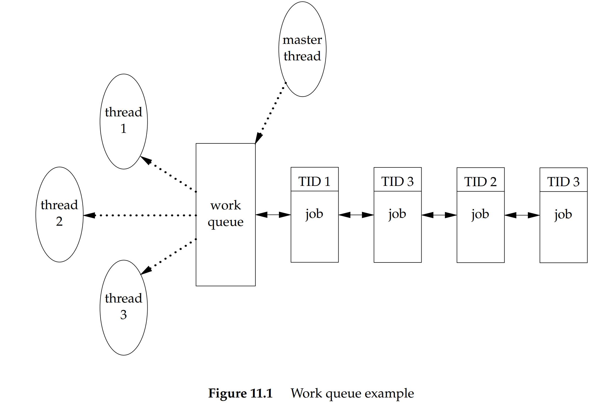
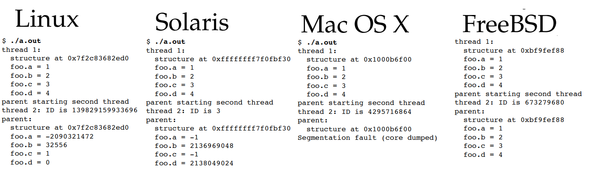
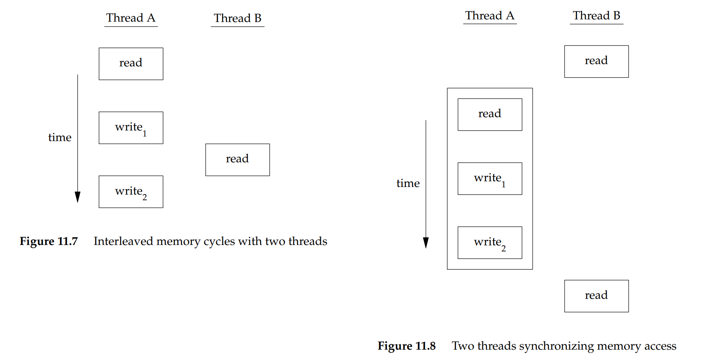
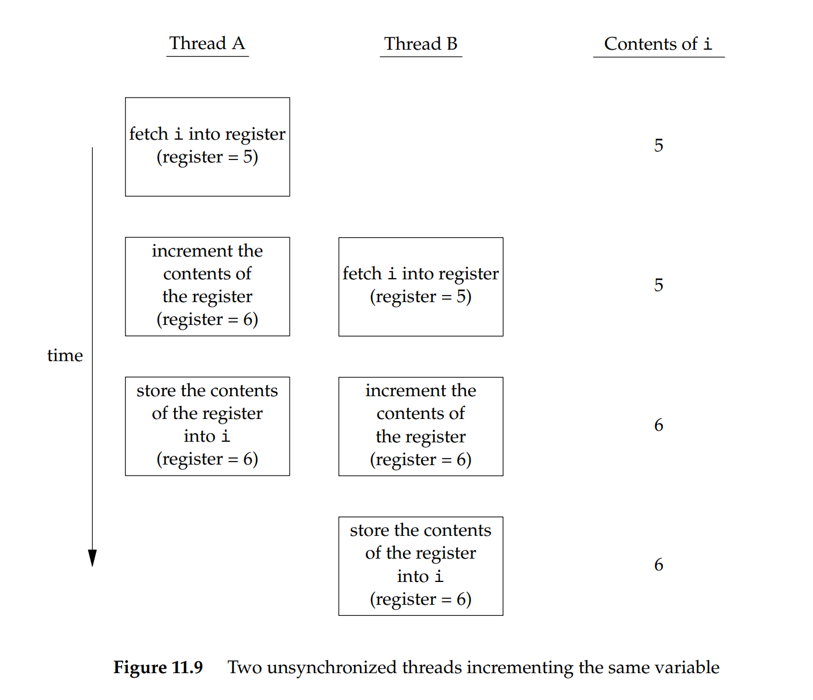



# 11. 스레드

## 11.1 소개

11장에서는 하나의 프로세스의 환경 안에서 여러 개의 스레드를 수행하는 방법을 알아보고, 일괄성을 보장할 방법도 알아본다.

## 11.2 스레드의 개념

전형적인 UNIX 프로세스는 하나의 스레드로 구성된다고 할 수 있다. 즉, 각 프로세스는 한 번에 하나의 일만 수행한다.
스레드를 여러 개를 두면 하나의 프로세스에서 한 번에 여러 개의 일을 하도록 프로그램을 설계할 수 있다. 스레드를 사용하면 다음과 같은 장점이 있다.

- 비동기적인 사건을 다루는 코드의 단순화
- 한 프로세스의 스레드들은 동일한 메모리 주소공간과 파일 서술자들에 자동으로 접근 가능
- 문제를 여러 조각으로 분할해서 처리하면 프로그램의 전체적인 처리량이 개선 및 프로그램 반응 시간 개선

하나의 스레드는 프로세스 안에서의 실행 문맥(execution context)을 나타내기에 충분한 정보로 구성된다.
- 스레드를 식별해주는 스레드 ID, 레지스터 값들, 스택, 스케줄링 우선순위와 방침, 신호마스크, errno 변수, 스레드 고유 자료가 포함

한 프로세스의 모든 스레드는 다음을 공유한다.
- 실행 가능 프로그램의 텍스트 구역, 프로그램의 전역 메모리와 힙 메모리, 스택, 파일 서술자 등


## 11.3 스레드 식별

프로세스마다 프로세스 ID 가 있듯이 스레드마다 스레드 ID 가 있다. 하지만 스레드 ID 는 스레드가 속한 프로세스의 문맥 안에서만 의미가 있다.

pthread_t 자료 형식은 스레드 ID 를 위한 것이다. 표준은 구현이 이 pthread_t 자료형식을 구조체로 표현하는 것을 허용한다. 따라서 이식성 있는 프로그램이라면 이 형식을 하나의 정수로 간주해서는 안 된다. 이 때문에,  두 스레드 ID 를 비교할 때는 다음과 같은 함수를 사용해야 한다.

```c++
#include <pthread.h>
int pthread_equal(pthread_t tid1, pthread_t tid2);
// 반환값 : 둘이 상등이면 0이 아닌 값, 상등이 아니면 0

pthread_t pthread_self(void);
// 반환값 호출한 스레드의 스레드 ID
```
pthread_self 함수는 스레드 자신의 ID 를 돌려준다. 이는 스레드가 자신의 스레드 ID 를 알아낸 후 pthread_equal 함수를 이용해서 어떤 구조체가 자신의 위한 구조체인지 확인하는 용도이다. 




## 11.4 스레드의 생성

프로그램이 처음 실행될 때에는 스레드가 하나인 프로세스로 시작한다. 프로세스가 새로운 스레드를 생성하는 함수는 다음과 같다.

```c++
#include<pthread.h>
int pthread_create(
	pthread_t *restrict tidp, 
	const pthread_attr_t *restrict attr, 
	void *(*start_rtn)(void *), 
	void *restrict arg);
// 반환값 : 성공 시 0, 실패 시 오류 번호
```

- `tidp` 가 가리키는 메모리 장소에 새로 생성된 스레드의 스레드 ID 를 저장한다. 
- `attr` 인수는 스레드의 여러 특성을 - 설정하는데 사용된다. 일단은 NULL 로 지정하면 기본 특성으로 생성된다.
- `start_rtn` 인수는 지정된 함수의 주소에서 새로 생성된 스레드가 실행을 시작한다.  

스레드를 생성했을 때 새 스레드가 먼저 실행될지 아니면 함수를 호출한 스레드가 먼저 실행될지는 예측불가능하다. 새로 생성된 스레드는 프로세스 주소 공간에 접근할 수 있으며 호출 스레드의 부동소수점 환경과 신호 마스크를 물려받는다. 


#### 예제 

다음 프로그램은 스레드 하나를 생성하고, 새 스레드와 기존 스레드의 프로세스 ID 와 스레드 ID 를 출력한다.

```c++
#include<apue.h>
#include<pthread.h>

pthread_t ntid;

void printids(const char *s)
{
	pid_t pid;
	pthread_t tid;
	pid = getpid();
	tid = pthread_self();
	printf("%s pid %lu tid %lu (0x%lx)\n", s, (unsigned long)pid, (unsigned long)tid, (unsigned long)tid);
}

void *thr_fn(void *arg)
{
	printids("new thread: ");
	return ((void*)0);
}

int main(void)
{
	int err;
	err = pthread_create(&ntid, NULL, thr_fn, NULL);
	if(err != 0)
		err_exit(err, "can't create thread");
	printids("main thread");
	sleep(1);
	exit(0);
}
```

위 프로그램에서 주 스레드와 새 스레드 사이의 경쟁 조건을 피하기 위해 주 스레드를 재워야 한다. 
그리고 새 스레드가 공유 메모리를 읽거나 자신의 스레드 시동 루틴의 인수로 스레드 ID 를 받는 대신 pthread_self 를 호출하여 자신의 스레드 ID 를 얻는다. create 함수로 새로 생성된 스레드의 ID 를 ntid 에 저장하나, create 함수의 호출이 반환되기 전에 새 스레드가 실행된다면, ntid 에는 아직 초기화되지 않을 것이기 때문이다.

프로그램 실행 결과는 다음과 같다.
두 스레드의 프로세스 ID 는 동일하나 스레드 ID 는 서로 다르다. 
이때 FreeBSD / Mac / Linux 에서 실행 시 스레드 자료를 담은 구조체를 가리키는 포인터를 스레드 ID 로 사용한다.
```
// Solaris
$ ./a.out
main thread: pid 20075 tid 1 (0x1)
new thread:  pid 20075 tid 2 (0x2)

// FreeBSD
$ ./a.out
main thread: pid 37396 tid 673190208 (0x28201140)
new thread:  pid 37396 tid 673280320 (0x28217140)

// Mac OS
$ ./a.out
main thread: pid 31807 tid 140735073889440 (0x7fff70162ca0)
new thread:  pid 31807 tid 4295716864 (0x1000b7000)

// Linux
$ ./a.out
main thread: pid 17874 tid 140693894424320 (0x7ff5d9996700)
new thread:  pid 17874 tid 140693886129920 (0x7ff5d91ad700)
```


## 11.5 스레드의 종료

프로세스 안의 스레드가 exit / _Exit / _exit 를 호출하면 프로세스 전체가 종료된다. 마찬가지로, 기본 동작이 프로세스 종료인 신호가 한 스레드에 전달되면 프로세스 전체가 종료된다. 

프로세스 전체가 종료되는 일 없이 하나의 스레드가 종료되는 경우는 다음 세 가지이다.
- 스레드 시동 루틴이 정상적으로 반환된 경우
- 스레드가 같은 프로세스의 다른 스레드에 의해 취소(cancel) 된 경우
- 스레드 자신이 pthread_exit 를 호출한 경우

```c++
#include<pthread.h>
void pthread_exit(void *rval_ptr);

int pthread_join(pthread_t thread, void **rval_ptr);
// 반환값 : 성공 시 0, 실패 시 오류번호
```

`rval_ptr` 인수는 시동 루틴에 전달되는 인수처럼 무형식 포인터이다. 

pthread_join() 호출 스레드는 thread 인수로 지정된 스레드가 pthread_exit 를 호출하거나, 시동 루틴에서 반환되거나, 취소될 때까지 차단된다. 
두 번째 인자(`rval_ptr`)는 pthread_exit()에서 넘겨주는 인자와 같은 값이다. 만약 스레드가 정상적으로 종료되었다면 `rval_ptr`가 가리키는 장소는 그 반환값으로 설정되고, 스레드가 취소되면 rval_ptr이 가리키는 곳이 PTHREAD_CANCELED가 설정된다.

pthread_join 을 호출하면 지정된 스레드는 소위 탈착된 상태(detached state) 가 되며, 그 스레드의 자원을 수거할 수 있다. 이미 탈착된 상태라면 호출에 실패해 EINVAL 이 반환될 수 있다.

#### 예제

종료된 스레드의 종료 코드를 회수하는 프로그램이다. 

```c++
#include "apue.h"
#include <pthread.h>

void *thr_fn1(void *arg)
{
	printf("thread 1 returning\n");
	return ((void*)1);
}
void thr_fn2(void *arg)
{
	printf("thread 1 returning\n");
	return ((void*)2);
}

int main(void)
{
	int err;
	pthread_t tid1, tid2;
	void *tret;
	
	err = pthread_create(&tid1, NULL, thr_fn1, NULL);
	if(err!=0)
		err_exit(err, "can't create thread 1");
	err = pthread_create(&tid2, NULL, thr_fn2, NULL);
	if(err!=0)
		err_exit(err, "can't create thread 2");

	err = pthread_join(tid1, &tret);
	if(err!=0)
		err_exit(err, "can't join with thread 1");
	printf("thread 1 exit code %ld\n", (long)tret);
	
	err = pthread_join(tid2, &tret);
	if(err!=0)
		err_exit(err, "can't join with thread 2");
	printf("thread 2 exit code %ld\n", (long)tret);	
	exit(0);
}
```
스레드가 pthread_exit 호출에 의해 또는 시동 루틴의 반환에 의해 종료되면 다른 스레드에서 그 종료 상태를 알 수 있다. 
```
$ ./a.out
thread 1 returning
thread 2 exiting
thread 1 exit code 1
thread 2 exit code 2
```


#### 예제2

pthread_create 와 pthread_exit 에 지정하는 무형식 포인터를 활용하면 스레드 시동 루틴에 여러 개의 값을 전달가능하다. 단, 구조체가 차지하는 메모리가 해당 함수의 호출 이후에도 여전히 유효해야 한다. 
다음 프로그램은 자동 변수(스택) 를 pthread_exit 의 인수로 사용할 때으의 문제를 보여준다.

```c++
#include "apue.h"
#include <pthread.h>
struct foo {
	int a, b, c, d;
};

void printfoo(const char *s, const struct foo *fp)
{
	printf("%s", s);
	printf(" structure at 0x%lx\n", (unsigned long)fp);
	printf(" foo.a = %d\n", fp->a);
	printf(" foo.b = %d\n", fp->b);
	printf(" foo.c = %d\n", fp->c);
	printf(" foo.d = %d\n", fp->d);
}
void *thr_fn1(void *arg)
{
	struct foo foo = {1, 2, 3, 4};
	printfoo("thread 1:\n", &foo);
	pthread_exit((void *)&foo);
}
void *thr_fn2(void *arg)
{
	printf("thread 2: ID is %lu\n", (unsigned long)pthread_self());
	pthread_exit((void *)0);
}

int main(void)
{
	int err;
	pthread_t tid1, tid2;
	struct foo *fp;
	err = pthread_create(&tid1, NULL, thr_fn1, NULL);
	if (err != 0)
		err_exit(err, "can’t create thread 1");
	err = pthread_join(tid1, (void *)&fp);
	if (err != 0)
		err_exit(err, "can’t join with thread 1");
	sleep(1);
	printf("parent starting second thread\n");
	err = pthread_create(&tid2, NULL, thr_fn2, NULL);
	if (err != 0)
		err_exit(err, "can’t create thread 2");
	sleep(1);
	printfoo("parent:\n", fp);
	exit(0);
}
```



각각의 환경에서 실행한 결과이다. 
`Linux`와 `Solaris` 의 결과를 보면, 스레드 tid1 의 스택에 할당된 구조체에 주 스레드가 접근할 수 있게 된 시점에서는 이미 그 구조체의 내용이 바뀌었음을 알 수 있다. 스레드 tid2 의 스택이 첫 스레드의 스택을 덮어 썼음을 알 수 있다. 이는 전역 구조체를 사용하거나 구조체를 malloc 을 이용해서 할당하면 문제를 피할 수 있다.

`Mac OS` 의 경우 첫 스레드에 넘겨준 구조체에 주 스레드가 접근하려 하는 시점에서 첫 스레드는 이미 종료되었으며, 해당 구조체의 메모리는 더이상 유효하지 않았다. 

`FreeBSD` 의 경우 주 스레드가 접근할 때까지도 메모리가 덮여 쓰이지 않았다. 하지만 항상 이럴 것이라는 보장은 없다.

##

한 스레드가 자신이 속한 프로세스의 다른 스레드의 실행을 취소하려 할 때에는 pthread_cancel 함수를 호출한다.
```c++
#include <pthread.h>
int pthread_cancel(pthread_t tid);
// 반환값 : 성공 시 0, 실패 시 오류 번호
```

기본적으로 pthread_cancel 은 tid 로 지정된 스레드가 마치 PTHREAD_CANCELED 를 인수로 해서 스스로 pthread_exit 를 호출한 것처럼 행동하게 만든다. 그러나 대상 스레드가 이를 무시하거나 다른 식으로 행동하는 것도 가능하다.

pthread_cancel 는 단지 취소를 요청할 뿐 스레드의 종료를 기다리진 않는다.

스레드는 자신이 종료될 때 호출될 함수들을 등록할 수 있다. 이를 `스레드 정리 처리부` 라고 부른다.

```c++
#include <pthread.h>
void pthread_cleanup_push(void (*rtn)(void *), void *arg);
void pthread_cleanup_pop(int execute);
```

pthread_cleanup_push 함수는 정리 처리부 rtn 을 등록한다. 정리 처리부가 호출되는 상황은 다음과 같다.

- 스레드가 pthread_exit 를 호출
- 스레드가 취소 요청에 반응함
- 스레드가 0이 아닌 execute 인수로 pthread_cleanup_pop 을 호출

execute 인수를 0으로 해서 pthread_cleanup_pop 을 초훌하면 정리 처리부 함수가 호출되지 않는다. 어떤 경우든, pthread_cleanup_pop 함수는 마지막 pthread_cleanup_push 호출로 등록된 정리 처리부를 제거한다. 이 함수들은 반드시 한 스레드의 같은 범위 안에서 짝을 맞춰 사용해야 한다.

#### 예제
스레드 정리 처리부의 사용법을 보여주는 프로그램이다.

```c++
#include "apue.h"
#include <pthread.h>
void cleanup(void *arg)
{
	printf("cleanup: %s\n", (char *)arg);
}
void *thr_fn1(void *arg)
{
	printf("thread 1 start\n");
	pthread_cleanup_push(cleanup, "thread 1 first handler");
	pthread_cleanup_push(cleanup, "thread 1 second handler");
	printf("thread 1 push complete\n");
	if (arg) return((void *)1);
	pthread_cleanup_pop(0);
	pthread_cleanup_pop(0);
	return((void *)1);
}
void *thr_fn2(void *arg)
{
	printf("thread 2 start\n");
	pthread_cleanup_push(cleanup, "thread 2 first handler");
	pthread_cleanup_push(cleanup, "thread 2 second handler");
	printf("thread 2 push complete\n");
	if (arg) pthread_exit((void *)2);
	pthread_cleanup_pop(0);
	pthread_cleanup_pop(0);
	pthread_exit((void *)2);
}
int main(void)
{
	int err;
	pthread_t tid1, tid2;
	void *tret;
	err = pthread_create(&tid1, NULL, thr_fn1, (void *)1);
	if (err != 0)
		err_exit(err, "can’t create thread 1");
	err = pthread_create(&tid2, NULL, thr_fn2, (void *)1);
	if (err != 0)
		err_exit(err, "can’t create thread 2");
	err = pthread_join(tid1, &tret);
	if (err != 0)
		err_exit(err, "can’t join with thread 1");
	printf("thread 1 exit code %ld\n", (long)tret);
	err = pthread_join(tid2, &tret);
	if (err != 0)
		err_exit(err, "can’t join with thread 2");
	printf("thread 2 exit code %ld\n", (long)tret);
	exit(0);
}
```
Linux 와 Solaris 에서 프로그램을 실행하면 다음과 같은 결과가 나온다.
```
$ ./a.out
thread 1 start
thread 1 push complete
thread 2 start
thread 2 push complete
cleanup: thread 2 second handler
cleanup: thread 2 first handler
thread 1 exit code 1
thread 2 exit code 2
```

두 스레드가 제대로 실행되고 종료되었으나 정리처리부는 둘째 스레드의 것만 호출되었다. 이는 스레드가 자신의 시동 루틴에서 정상 반환되어서 종료된 경우에는 해당 처리부들이 호출되지 않음을 말해준다. 

같은 프로그램을 FreeBSD 나 Mac OS 에서 실행하면 프로그램이 구역 위반으로 종료된다. 


기본적으로, 스레드의 종지 상태는 그 스레드에 대해 pthread_join 을 호출할 때까지 유지된다. 스레드가 프로세스에서 detached 되면 그 즉시 시스템은 스레드의 내부 저장소를 다른 용도로 재확보할 수 있다. 이때 pthread_join을 호출할 수는 없다. 스레드를 detached 할 때는 다음 함수를 호출한다.
```c++
#include <pthread.h>
int pthread_detach(pthread_t tid);
// 반환값 : 성공 시 0, 실패 시 오류 번호
```


## 11.6 스레드 동기화

여러 개의 스레드들이 같은 메모리를 공유할 때에는 각 스레드가 자신의 자료를 일관되게 볼 수 있게 만들어야 한다. 어떤 스레드가 읽거나 수정하는 변수를 다른 스레드가 수정할 수 있다면, 각 스레드가 변수의 메모리 내용에 접근할 때 유효하지 않은 값을 사용하게 되는 일이 없도록 동기화가 필요하다.



위의 그림은 두 스레드가 같은 변수를 읽고 쓰는 가상의 예이다. 스레드 A 가 변수를 읽고 새 값을 변수에 기록하는데, 그 쓰기 연산은 메모리 주기 둘을 소비한다. 만일 쓰레드 B 가 두 쓰기 주기 사이에 같은 변수를 읽으면 일관되지 않은 값을 본다. 이를 해결하려면 한 번에 하나의 스레드만 변수에 접근할 수 있게 lock 을 사용해야 한다. 



위의 그림은 둘 이상의 스레드가 같은 변수를 동시에 수정하려 할 때에도 동기화가 필요하다는 예시이다.
하나의 증가 연산은 다음 세 단계로 이뤄진다.

1. 메모리 장소의 내용을 레지스터로 읽어 들인다.
2. 레지스터의 값을 증가한다.
3. 새 값을 메모리 장소에 기록한다.

만일 동기화 없이 두 스레드가 거의 동시에 같은 변수를 증가하려 하면 결과의 일관성이 깨질 수 있다. 


### 11.6.1 뮤텍스

한 번에 하나의 스레드만 접근하도록 강제해서 공유 자료를 보호하는 한 가지 방법은 pthread 의 뮤텍스 인터페이스를 사용하는 것이다. `뮤텍스(mutex)` 는 공유 자원에 접근하기 전에 잠그고 공유 자원을 다 쓴 후에는 푸는 하나의 자물쇠이다. 한 스레드가 뮤텍스를 설정하면, 그 뮤텍스를 설정하고자 하는 다른 모든 스레드는 원래의 스레드가 뮤텍스를 해제할 때까지 차단된다. 따라서 오직 한 번에 하나의 스레드만 실행을 진행할 수 있다.

이러한 상호 배제 메커니즘은 모든 스레드가 동일한 자료 접근 규칙을 따르도록 프로그램을 설계할 때만 제대로 작동한다. 

뮤텍스를 설정하기 위한 함수는 다음과 같다.
뮤텍스를 초기화하는 함수와 뮤텍스를 동적으로 할당하는 경우, 메모리 해제 전 호출해야하는 destroy 함수가 있다. 
그리고 뮤텍스를 잠글 때 lock 함수를 호출하고, 풀 때는 unlock 함수를 호출한다.
trylock 함수의 경우 잠기지 않는 뮤텍스라면 잠기고, 잠긴 뮤텍스라면 EBUSY 를 리턴한다.

```c++
#include <pthread.h>
int pthread_mutex_init(pthread_mutex_t *restrict mutex, const pthread_mutexattr_t *restrict attr);
int pthread_mutex_destroy(pthread_mutex_t *mutex);

int pthread_mutex_lock(pthread_mutex_t *mutex);
int pthread_mutex_trylock(pthread_mutex_t *mutex);
int pthread_mutex_unlock(pthread_mutex_t *mutex);
// 반환값 : 성공 시 0, 실패 시 오류 번호
```

#### 예제

뮤텍스를 이용해서 자료구조를 보호하는 방법을 보여주는 프로그램이다.
각 스레드는 객체를 사용하기 전에 반드시 foo_hold 를 호출해야 한다. 객체를 다 사용하고 난 후에는 foo_rele 를 호출해서 참조를  해제해야 하고, 마지막 참조가 해제되면 foo_rele 는 객체의 메모리를 해제한다. 

```c++
#include <stdlib.h>
#include <pthread.h>
struct foo {
	int f_count;
	pthread_mutex_t f_lock;
	int f_id;
	/* ... 그 외의 여러 자료 필드들... */
};
struct foo *foo_alloc(int id) /* allocate the object */
{
	struct foo *fp;
	if ((fp = malloc(sizeof(struct foo))) != NULL) {
		fp->f_count = 1;
		fp->f_id = id;
		if (pthread_mutex_init(&fp->f_lock, NULL) != 0) {
			free(fp);
			return(NULL);
		}
		/* ... 나머지 초기화 작업 ... */
	}
	return(fp);
}
void foo_hold(struct foo *fp) /* 객체에 대한 참조를 추가 */
{
	pthread_mutex_lock(&fp->f_lock);
	fp->f_count++;
	pthread_mutex_unlock(&fp->f_lock);
}
void foo_rele(struct foo *fp) /* 객체에 대한 참조를 해제 */
{
	pthread_mutex_lock(&fp->f_lock);
	if (--fp->f_count == 0) { /* 마지막 참조인 경우 */
		pthread_mutex_unlock(&fp->f_lock);
		pthread_mutex_destroy(&fp->f_lock);
		free(fp);
	} 
	else {
		pthread_mutex_unlock(&fp->f_lock);
	}
}
```


### 11.6.2 교착 방지

하나의 스레드가 같은 뮤텍스를 두 번 잠그려 하면 교착상태에 빠진다. 또는 한 스레드가 뮤텍스 1을 획득한 상태에서 뮤텍스 2를 잠그려 하고, 그와 동시에 다른 스레드가 뮤텍스 2를 획득한 상태에서 뮤텍스 1을 잠그려 하면 영원히 실행이 차단되는 교착이 발생한다.
이를 막기 위해선 뮤텍스가 잠기는 순서를 세심하게 제어해야 한다. 

#### 예제

다음은 앞서 본 뮤텍스 두 개를 사용하는 프로그램이다.

```c++
#include <stdlib.h>
#include <pthread.h>
#define NHASH 29
#define HASH(id) (((unsigned long)id)%NHASH)
struct foo *fh[NHASH];
pthread_mutex_t hashlock = PTHREAD_MUTEX_INITIALIZER;
struct foo {
	int f_count;
	pthread_mutex_t f_lock;
	int f_id;
	struct foo *f_next; /* hashlock 이 보호함 */
	/* ... 나머지 필드들 ... */
};
struct foo *foo_alloc(int id) /* 객체 할당 */
{
	struct foo *fp;
	int idx;
	if ((fp = malloc(sizeof(struct foo))) != NULL) {
		fp->f_count = 1;
		fp->f_id = id;
		if (pthread_mutex_init(&fp->f_lock, NULL) != 0) {
			free(fp);
			return(NULL);
		}
		idx = HASH(id);
		pthread_mutex_lock(&hashlock);
		fp->f_next = fh[idx];
		fh[idx] = fp;
		pthread_mutex_lock(&fp->f_lock);
		pthread_mutex_unlock(&hashlock);
		/* ... 초기화 계속 ... */
		pthread_mutex_unlock(&fp->f_lock);
	}
	return(fp);
}
void foo_hold(struct foo *fp) /* 객체에 대한 참조 추가 */
{
	pthread_mutex_lock(&fp->f_lock);
	fp->f_count++;
	pthread_mutex_unlock(&fp->f_lock);
}
struct foo *foo_find(int id) /* 기존 객체 찾음 */
{
	struct foo *fp;
	pthread_mutex_lock(&hashlock);
	for (fp = fh[HASH(id)]; fp != NULL; fp = fp->f_next) {
		if (fp->f_id == id) {
			foo_hold(fp);
			break;
		}
	}
	pthread_mutex_unlock(&hashlock);
	return(fp);
}
void foo_rele(struct foo *fp) /* 객체에 대한 참조 해제 */
{
	struct foo *tfp;
	int idx;
	pthread_mutex_lock(&fp->f_lock);
	if (fp->f_count == 1) { /* 마지막 참조 */
		pthread_mutex_unlock(&fp->f_lock);
		pthread_mutex_lock(&hashlock);
		pthread_mutex_lock(&fp->f_lock);
		/* 조건을 다시 점검 */
		if (fp->f_count != 1) {
			fp->f_count--;
			pthread_mutex_unlock(&fp->f_lock);
			pthread_mutex_unlock(&hashlock);
			return;
		}
		/* 리스트에서 제거 */
		idx = HASH(fp->f_id);
		tfp = fh[idx];
		if (tfp == fp) {
			fh[idx] = fp->f_next;
		} else {
			while (tfp->f_next != fp)
			tfp = tfp->f_next;
			tfp->f_next = fp->f_next;
		}
		pthread_mutex_unlock(&hashlock);
		pthread_mutex_unlock(&fp->f_lock);
		pthread_mutex_destroy(&fp->f_lock);
		free(fp);
	} else {
		fp->f_count--;
		pthread_mutex_unlock(&fp->f_lock);
	}
}
```

위 프로그램은 foo_alloc 함수는 해시 목록 자물쇠를 잠그거, 새 구조체를 해시 목록에 추가하고, 해시 목록 자물쇠를 풀기 전에 새 구조체의 뮤텍스를 잠근다. 새 구조체를 전역 리스트에 넣기에 다른 스레드도 그 구조체를 찾을 수 잇기에 작업이 마칠 때까지 다른 스레드들이 접근하지 못하게 해야한다.
foo_find 함수는 해시 목록 자물쇠를  잠근 후에 foo 구조체의 f_lock 뮤텍스를 잠근다.
foo_rele 함수는 마지막 참조가 해제되는 상황이면 그 객체를 제거한다. 이를 위해 해시 목록 자물쇠를 해제해야 하며, 그 전에 구조체의 뮤텍스를 해제해야 한다. 따라서 해시 목록 자물쇠를 획득 후에 구조체의 뮤텍스를 다시 획득이 필요하고, 그 사이 뮤텍스의 상태가 변할 수 있으므로 다시 점검이 필요하다. 

다음은 위의 프로그램의 잠금 방식의 설계를 수정한 버전이다.

```c++
#include <stdlib.h>
#include <pthread.h>
#define NHASH 29
#define HASH(id) (((unsigned long)id)%NHASH)
struct foo *fh[NHASH];
pthread_mutex_t hashlock = PTHREAD_MUTEX_INITIALIZER;
struct foo {
	int f_count; /* hashlock 으로 보호 */
	pthread_mutex_t f_lock;
	int f_id;
	struct foo *f_next; /* hashlock 으로 보호 */
	/* ... 나머지 필드들 ... */
};
struct foo *foo_alloc(int id)
{
	struct foo *fp;
	int idx;
	if ((fp = malloc(sizeof(struct foo))) != NULL) {
		fp->f_count = 1;
		fp->f_id = id;
		if (pthread_mutex_init(&fp->f_lock, NULL) != 0) {
			free(fp);
			return(NULL);
		}
		idx = HASH(id);
		pthread_mutex_lock(&hashlock);
		fp->f_next = fh[idx];
		fh[idx] = fp;
		pthread_mutex_lock(&fp->f_lock);
		pthread_mutex_unlock(&hashlock);
		/* ... 초기화 계속 ... */
		pthread_mutex_unlock(&fp->f_lock);
	}
	return(fp);
}
void foo_hold(struct foo *fp)
{
	pthread_mutex_lock(&hashlock);
	fp->f_count++;
	pthread_mutex_unlock(&hashlock);
}
struct foo *foo_find(int id)
{
	struct foo *fp;
	pthread_mutex_lock(&hashlock);
	for (fp = fh[HASH(id)]; fp != NULL; fp = fp->f_next) {
		if (fp->f_id == id) {
			fp->f_count++;
			break;
		}
	}
	pthread_mutex_unlock(&hashlock);
	return(fp);
}
void foo_rele(struct foo *fp)
{
	struct foo *tfp;
	int idx;
	pthread_mutex_lock(&hashlock);
	if (--fp->f_count == 0) { 
		idx = HASH(fp->f_id);
		tfp = fh[idx];
		if (tfp == fp) {
			fh[idx] = fp->f_next;
		} else {
			while (tfp->f_next != fp)
				tfp = tfp->f_next;
			tfp->f_next = fp->f_next;
		}
		pthread_mutex_unlock(&hashlock);
		pthread_mutex_destroy(&fp->f_lock);
		free(fp);
	} else {
		pthread_mutex_unlock(&hashlock);
	}
}
```

위의 프로그램은 앞선 프로그램보다 간단해졌다. 이는 해시 목록과 참소 횟수를 같은 잠물쇠로 보호하기 때문에 그 둘을 둘러싼 잠금 순서 문제가 사라졌다.


## 11.6.3 pthread_mutex_timedlock 함수

 이미 잠긴 뮤텍스를 획득하려는 스레드가 무한정 차단되는 일이 없도록하는 뮤텍스가 존재한다. 
pthread_mutex_timedlock  함수는 지정된 시간이 만료되면 뮤텍스를 잠그지 않고 오류 번호 ETIMEOUT 을 돌려준다.
이때 지정하는 만료 시간은 상대 시간이 아니라 차단이 만료되는 절대 시간을 의미한다. 

```c++
#include <pthread.h>
#include <time.h>
int pthread_mutex_timedlock(pthread_mutex_t *restrict mutex, const struct timespec *restrict tsptr);
// 반환값 : 성공시 0, 실패 시 오류 번호
```

#### 예제
다음 프로그램은 pthread_mutex_timedlock 의 작동방식을 보여주기 위해 일부러 이미 획득된 뮤텍스를 다시 잠그려고 한다. 실제에선 교착 상태가 발생할 수 있다.
```c++
#include "apue.h"
#include <pthread.h>

int main(void)
{
	int err;
	struct timespec tout;
	struct tm *tmp;
	char buf[64];
	pthread_mutex_t lock = PTHREAD_MUTEX_INITIALIZER;
	pthread_mutex_lock(&lock);
	printf("mutex is locked\n");
	clock_gettime(CLOCK_REALTIME, &tout);
	tmp = localtime(&tout.tv_sec);
	strftime(buf, sizeof(buf), "%r", tmp);
	printf("current time is %s\n", buf);
	tout.tv_sec += 10; /* 10초 뒤 시간 */
	/* 주의 : 교착이 발생할 수 있음 */
	err = pthread_mutex_timedlock(&lock, &tout);
	clock_gettime(CLOCK_REALTIME, &tout);
	tmp = localtime(&tout.tv_sec);
	strftime(buf, sizeof(buf), "%r", tmp);
	printf("the time is now %s\n", buf);
	if (err == 0)
		printf("mutex locked again!\n");
	else
		printf("can’t lock mutex again: %s\n", strerror(err));
	exit(0);
}
```
```
$ ./a.out
mutex is locked
current time is 11:41:58 AM
the time is now 11:42:08 AM
can’t lock mutex again: Connection timed out
```

## 11.6.4 판독자-기록자 자물쇠

판독자-기록자 자물쇠(reader-writer lock) 는 세 가지 상태를 가진다. 읽기 모드로 잠기거나, 쓰기 모드로 잠기거나 잠기지 않는 경우이다. 쓰기 모드 잠금은 한 시점에 단 하나의 스레드만 가능하지만, 읽기 모드 잠금의 경우에는 하나의 자물쇠를 여러 스레드가 동시에 잠그는 것이 가능하다.

```c++
#include <pthread.h>
int pthread_rwlock_init(pthread_rwlock_t *restrict rwlock, const pthread_rwlockattr_t *restrict attr);
int pthread_rwlock_destroy(pthread_rwlock_t *rwlock);

int pthread_rwlock_rdlock(pthread_rwlock_t *rwlock);
int pthread_rwlock_wrlock(pthread_rwlock_t *rwlock);
int pthread_rwlock_unlock(pthread_rwlock_t *rwlock);

int pthread_rwlock_tryrdlock(pthread_rwlock_t *rwlock);
int pthread_rwlock_trywrlock(pthread_rwlock_t *rwlock);
// 반환값 : 성공 시 0, 실패 시 오류 번호
```
- pthread_rwlock_init : 초기화하는 함수
- pthread_rwlock_destroy : 자물쇠가 사용하던 메모리를 해제하기 전에 이 함수를 호출해 메모리 정리 필요
- pthread_rwlock_rdlock : 읽기 모드로 잠글 때 호출
- pthread_rwlock_wrlock : 쓰기 모드로 잠글 때 호출
- pthread_rwlock_unlock : 어떤 모드로 잠겨 있든, 풀 때 호출
- pthread_rwlock_tryrdlock : pthread_rwlock_rdlock 의 조건부 잠금 버전
- pthread_rwlock_trywrlock: pthread_rwlock_wrlock 의 조건부 잠금 버전

#### 예제

다음은 reader-writer lock 을 사용하는 벙법을 보여주는 프로그램이다.
대기열에 작업을 추가하거나 대기열에서 작업을 제거할 때 마다 reader-writer lock를 쓰기 모드로 잠근다. 대기열을 검색할 때에는 읽기 모드로만 잠근다. 따라서 여러 개의 일꾼 스레드들이 동시에 대기열을 검색할 수 있다. 

```c++
#include <stdlib.h>
#include <pthread.h>
struct job {
	struct job *j_next;
	struct job *j_prev;
	pthread_t j_id; /* 이 작업을 처리할 스레드 ID */
	/* ... 기타 필드들 ... */
};
struct queue {
	struct job *q_head;
	struct job *q_tail;
	pthread_rwlock_t q_lock;
};

int queue_init(struct queue *qp) // 대기열 초기화
{
	int err;
	qp->q_head = NULL;
	qp->q_tail = NULL;
	err = pthread_rwlock_init(&qp->q_lock, NULL);
	if (err != 0)
		return(err);
	/* ... 초기화 계속 ... */
	return(0);
}
void job_insert(struct queue *qp, struct job *jp) // 작업 하나를 대기열 머리에 삽입
{
	pthread_rwlock_wrlock(&qp->q_lock);
	jp->j_next = qp->q_head;
	jp->j_prev = NULL;
	if (qp->q_head != NULL)
		qp->q_head->j_prev = jp;
	else
		qp->q_tail = jp;
	qp->q_head = jp;
	pthread_rwlock_unlock(&qp->q_lock);
}
void job_append(struct queue *qp, struct job *jp) // 작업 하나를 대기열 꼬리에 추가
{
	pthread_rwlock_wrlock(&qp->q_lock);
	jp->j_next = NULL;
	jp->j_prev = qp->q_tail;
	if (qp->q_tail != NULL)
		qp->q_tail->j_next = jp;
	else
		qp->q_head = jp;
	qp->q_tail = jp;
	pthread_rwlock_unlock(&qp->q_lock);
}
void job_remove(struct queue *qp, struct job *jp) // 작업을 대기열에서 제거
{
	pthread_rwlock_wrlock(&qp->q_lock);
	if (jp == qp->q_head) {
		qp->q_head = jp->j_next;
		if (qp->q_tail == jp)
			qp->q_tail = NULL;
		else
			jp->j_next->j_prev = jp->j_prev;
	} 
	else if (jp == qp->q_tail) {
		qp->q_tail = jp->j_prev;
		jp->j_prev->j_next = jp->j_next;
	} 
	else {
		jp->j_prev->j_next = jp->j_next;
		jp->j_next->j_prev = jp->j_prev;
	}
	pthread_rwlock_unlock(&qp->q_lock);
}
struct job *job_find(struct queue *qp, pthread_t id) // 스레드 ID 에 해당하는 작업 탐색
{
	struct job *jp;
	if (pthread_rwlock_rdlock(&qp->q_lock) != 0)
		return(NULL);
	for (jp = qp->q_head; jp != NULL; jp = jp->j_next)
		if (pthread_equal(jp->j_id, id))
			break;
	pthread_rwlock_unlock(&qp->q_lock);
	return(jp);
}
```

## 11.6.5 만료 시간이 있는 판독자-기록자 자물쇠

뮤텍스에서처럼, reader-writer lock 을 획득하려는 스레드가 무한정 기다리는 일이 없도록 하는 함수들을 제공한다. 

```c++
#include <pthread.h>
#include <time.h>
int pthread_rwlock_timedrdlock(pthread_rwlock_t *restrict rwlock, const struct timespec *restrict tsptr);
int pthread_rwlock_timedwrlock(pthread_rwlock_t *restrict rwlock, const struct timespec *restrict tsptr);
```


## 11.6.6 조건 변수

스레드들에서 사용할 수 있는 또 다른 동기화 메커니즘으로 `조건 변수(condition variable)` 이 있다. 이 동기화 객체는 스레드들이 한 가닥으로 합류하는 지점을 제공한다. 뮤텍스와 함께 조건 변수를 사용하면 스레드들이 임의의 조건이 발생할 때까지 경쟁 없이 기다리게 만드는 것이 가능하다.
이러한 방법에서는 조건 변수 자체가 뮤텍스로 보호된다. 스레드가 조건 변수의 상태를 변경할 때에는 반드시 뮤텍스로 잠가야 한다. 

조건 변수를 사용하기 위해 필요한 함수는 다음과 같다.

```c++
#include <pthread.h>
int pthread_cond_init(pthread_cond_t *restrict cond, const pthread_condattr_t *restrict attr);
int pthread_cond_destroy(pthread_cond_t *cond);

int pthread_cond_wait(pthread_cond_t *restrict cond, pthread_mutex_t *restrict mutex);
int pthread_cond_timedwait(
	pthread_cond_t *restrict cond, 
	pthread_mutex_t *restrict mutex,
	const struct timespec *restrict tsptr);

// 반환값 : 성공 시 0, 실패 시 오류 번호
```

- pthread_cond_init : 초기화하는 함수
- pthread_cond_destroy : 조건 변수가 사용하던 메모리를 해제하기 전 조건 변수를 정리할 함수
- pthread_cond_wait : 조건이 참이 될 때까지 기다릴 때 호출하는 함수
	- 두번째 인수는 조건 변수를 보호하기 위한 뮤텍스
	- 뮤텍스를 잠근 후에 넘겨주어야 하고, 함수는 자동으로 호출 스레드를 조건이 만족되길 기다리는 스레드 목록에 추가한 후 뮤텍스를 푼다.
	- 주어진 뮤텍스는 pthread_cond_wait 가 반환될 때 다시 잠긴다. 
- pthread_cond_timedwait : pthread_cond_wait 에서 만료시간을 추가한 함수
	- 조건이 만족되지 않은 채로 시간이 만료되면, 뮤텍스를 다시 획득한 후 ETIMEOUT 오류를 돌려준다.
- pthread_cond_wait / pthread_cond_timedwait  의 호출이 성공적으로 반환되어도 스레드는 조건을 다시 평가할 필요는 있다. 이는 기다리는 동안 다른 스레드가 실행되어서 조건이 변했을 수도 있기 때문이다.

조건이 만족되었을 때 다른 스레드들에게 알려주기 위해 사용하는 함수는 다음과 같다.
```c++
#include <pthread.h>
int pthread_cond_signal(pthread_cond_t *cond);
int pthread_cond_broadcast(pthread_cond_t *cond);
// 반환값 : 성공 시 0, 실패 시 오류 번호
```

- pthread_cond_signal : 조건을 기다리는 스레드들 중 적어도 하나를 깨움
- pthread_cond_broadcast : 조건을 기다리는 모든 스레드들을 깨움


#### 예제

다음은 조건 변수와 뮤텍스를 함께 사용해서 스레드들을 동기화하는 방법을 보여준다. 
이 예제의 조건은 작업 대기열의 상태이다. 뮤텍스로 조건을 보호하고, while 루프에서 조건을 평가한다. 작업 대기열에 메시지를 넣을 때에는 먼저 뮤텍스를 획득해야 하지만, 대기 중인 스레드들에게 신호를 줄 때에는 뮤텍스를 획득할 필요가 없다. 
```c++
#include <pthread.h>
struct msg {
	struct msg *m_next;
	/* ... 그 외의 필드 ... */
};
struct msg *workq;
pthread_cond_t qready = PTHREAD_COND_INITIALIZER;
pthread_mutex_t qlock = PTHREAD_MUTEX_INITIALIZER;

void process_msg(void)
{
	struct msg *mp;
	for (;;) {
		pthread_mutex_lock(&qlock);
		while (workq == NULL)
			pthread_cond_wait(&qready, &qlock);
		mp = workq;
		workq = mp->m_next;
		pthread_mutex_unlock(&qlock);
		/* 이제 메시지(mp)를 처리 */
	}
}
void enqueue_msg(struct msg *mp)
{
	pthread_mutex_lock(&qlock);
	mp->m_next = workq;
	workq = mp;
	pthread_mutex_unlock(&qlock);
	pthread_cond_signal(&qready);
}
```


## 11.6.7 회전 자물쇠

`회전 자물쇠(spin lock)`는 뮤텍스와 비슷하나, 자물쇠를 획득할 수 있을 때까지 스레드가 잠을 자면서 기다리는 것이 아니라 바쁘게 돌면서(spin) 기다리게 된다. 이는 자물쇠들이 짧은 기간 동안만 잠기는, 그리고 ㅁ스레드 문맥 전환에 따른 비용이 생기지 않는 것이 바람직한 상황에 유용하다. 

회전 자물쇠를 위한 인터페이스는 다음과 같다.

```c++
#include <pthread.h>
int pthread_spin_init(pthread_spinlock_t *lock, int pshared);
int pthread_spin_destroy(pthread_spinlock_t *lock);

int pthread_spin_lock(pthread_spinlock_t *lock);
int pthread_spin_trylock(pthread_spinlock_t *lock);
int pthread_spin_unlock(pthread_spinlock_t *lock);
// 반환값 : 성공 시 0, 실패 시 오류 번호
```

- pthread_spin_init : 초기화하는 함수
	- pshared : 프로세스 공유 옵션을 나타내고 이를 지원해야 사용가능하다.
		- PTHREAD_PROCESS_SHARED : 회전 자물쇠가 사용하는 메모리에 접근할 수 있는 스레드들이 회전 자물쇠를 획득할 수 있다. 다른 프로세스의 스레드라도 그 메모리에 접근할 수 있으면 회전 자물쇠를 획득할 수 있다.
		- PTHREAD_PROCESS_PRIVATE : 오직 그 회전 자물쇠를 초기화한 프로세스의 스레드들만 자물쇠 획득할 수 있다.
- pthread_spin_destroy : 파괴할 때 호출하는 함수
- pthread_spin_lock / pthread_spin_trylock : 회전 자물쇠를 잠글 때 호출하는 함수
- pthread_spin_unlock : 회전 자물쇠를 풀 때에 호출하는 함수


## 11.6.8 장벽

`장벽(barrier)` 은 병렬적으로 작동하는 여러 스레드들의 실행을 조율하는 데 사용할 수 있는 동기화 메커니즘이다. 장벽을 사용하면 다른 모든 스레드가 동일한 지점에 도달할 때까지 스레드를 기다리게 할 수 있다. 

장벽을 사용하기 위한 함수들은 다음과 같다.

```c++
#include <pthread.h>
int pthread_barrier_init(
	pthread_barrier_t *restrict barrier,
	const pthread_barrierattr_t *restrict attr,
	unsigned int count);
int pthread_barrier_destroy(pthread_barrier_t *barrier);
// 반환값 : 성공 시 0, 실패 시 오류 번호

int pthread_barrier_wait(pthread_barrier_t *barrier);
// 반환값 : 성공 시 0 또는 PTHREAD_BARRIER_SERIAL_THREAD, 실패 시 오류 번호
```

- pthread_barrier_init : 장벽을 초기화할 때 호출하는 함수
	- count 는 장벽에 도달해야 하는 스레드들의 최소 갯수
- pthread_barrier_destroy : 다 사용한 장벽을 파괴할 때 호출하는 함수
- pthread_barrier_wait : 스레드가 작업을 마쳤으며 다른 모든 스레드가 이 장벽에 도달하길 기다릴 준비가 되었음을 알리고자 할 때에 호출하는 함수
	- 아직 장벽 도달 횟수( pthread_barrier_init 의 count ) 가 만족되지 않았으면 수면에 빠진다.
	- 만족되었으면, 모든 스레드가 깨어난다. 

#### 예제
다음 예제는 8백만 개의 수들을 정렬하는 작업을 스레드 8개가 나눠 처리한다. 
이때 장벽 도달 횟수는 일꾼 스레드 개수보다 하나 더 많게 지정되어 있는데, 이는 주 스레드도 장벽에 도달해야 하는 스레드이기 때문이다. 

```c++
#include "apue.h"
#include <pthread.h>
#include <limits.h>
#include <sys/time.h>
#define NTHR 8 /* 스레드 수 */
#define NUMNUM 8000000L /* 정렬할 수치 수 */
#define TNUM (NUMNUM/NTHR) /* 스레드당 정렬할 수치 수 */
long nums[NUMNUM];
long snums[NUMNUM];
pthread_barrier_t b;
#ifdef SOLARIS
#define heapsort qsort
#else
extern int heapsort(void *, size_t, size_t, int (*)(const void *, const void *));
#endif

int complong(const void *arg1, const void *arg2) // 정수를 비교 ( heapsort 함수의 보조 함수 )
{
	long l1 = *(long *)arg1;
	long l2 = *(long *)arg2;
	if (l1 == l2) return 0;
	else if (l1 < l2) return -1;
	else return 1;
}

void *thr_fn(void *arg) // 수들의 일부를 정렬하는 일꾼 스레드
{
	long idx = (long)arg;
	heapsort(&nums[idx], TNUM, sizeof(long), complong);
	pthread_barrier_wait(&b);
	// 나머지 필요한 작업 수행
	return((void *)0);
}
void merge() // 부분적인 정렬 결과들을 병합
{
	long idx[NTHR];
	long i, minidx, sidx, num;
	for (i = 0; i < NTHR; i++)
		idx[i] = i * TNUM;
	for (sidx = 0; sidx < NUMNUM; sidx++) {
		num = LONG_MAX;
		for (i = 0; i < NTHR; i++) {
			if ((idx[i] < (i+1)*TNUM) && (nums[idx[i]] < num)) {
				num = nums[idx[i]];
				minidx = i;
			}
		}
		snums[sidx] = nums[idx[minidx]];
		idx[minidx]++;
	}
}
int main()
{
	unsigned long i;
	struct timeval start, end;
	long long startusec, endusec;
	double elapsed;
	int err;
	pthread_t tid;

	// 정렬할 수치를 생성
	srandom(1);
	for (i = 0; i < NUMNUM; i++)
		nums[i] = random();

	// 스레드 8개를 생성해서 수치들을 정렬
	gettimeofday(&start, NULL);
	pthread_barrier_init(&b, NULL, NTHR+1);
	for (i = 0; i < NTHR; i++) {
		err = pthread_create(&tid, NULL, thr_fn, (void *)(i * TNUM));
		if (err != 0)
			err_exit(err, "can’t create thread");
	}
	pthread_barrier_wait(&b);
	merge();
	gettimeofday(&end, NULL);

	// 정렬된 목록을 출력
	startusec = start.tv_sec * 1000000 + start.tv_usec;
	endusec = end.tv_sec * 1000000 + end.tv_usec;
	elapsed = (double)(endusec - startusec) / 1000000.0;
	printf("sort took %.4f seconds\n", elapsed);
	for (i = 0; i < NUMNUM; i++)
		printf("%ld\n", snums[i]);
	exit(0);
}

```

