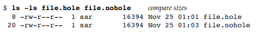

# 3. 파일 입출력

## 3.1 소개

이번 챕터에서는 UNIX 시스템에서의 파일 입출력 함수에 대해 설명한다.
- open / read / write / lseek / close

또한 여러 프로세스들이 파일을 공유하는 방식과 연관된 자료구조를 설명하고, 다음과 같은 함수를 설명한다.
- dup / fcntl, sync, fsync, ioctl


## 3.2 파일 서술자 ( file descriptor )

- 커널에서는 열린 파일들을 항상 파일 서술자를 통해서 지정한다.
- 파일 서술자는 음이 아닌 정수로 표현된다.
- 기존 파일을 열거나 새 파일을 생성할 때 커널은 해당 파일에 대한 파일 서술자를 프로세스에게 돌려준다. 
- 파일을 `read/write` 시 파일 서술자를 인수로 넘겨주어야 한다.
- Standard Input, Standard Output, and Standard Error
	- 0 / STDIN_FILENO : 표준 입력
	- 1 / STDOUT_FILENO : 표준 출력
	- 2 / STDERR_FILENO : 표준 오류

### 3.3 open 함수와 openat 함수

```c++
#include <fcntl.h>

int open(const char *path, int oflag, ... /* mode_t mode */ );
int openat(int fd, const char *path, int oflag, ... /* mode_t mode */ );
// 리턴값 : 성공 시 파일 서술자, 오류 시 -1
```
- 마지막 인수 `...` 는 나머지 인수들의 개수와 형식들이 가변적임을 명시, 
- 마지막 인수는 새 파일을 생성할 때에만 사용 
- `oflag` : 옵션 지정 플래그
- 다음은 5가지 플래그 중 하나를 반드시 지정해야 하며, 단 하나만 지정해야 함.
	- `O_RDONLY` : 읽기 전용
	- `O_WRONLY` : 쓰기 전용
	- `O_RDWR` : 읽기 및 쓰기
		- 앞의 3개 옵션은 구형 프로그램들과의 호환을 위해 0 / 1 / 2 
	- `O_EXEC` : 실행 전용
	- `O_SEARCH` : 검색 전용 ( 디렉터리에 해당 ) / 책에서 다루는 운영체제는 지원 X
- 다음은 선택적 플래그
	- `O_APPEND` : 파일 쓰기 시 자료를 파일 끝에 추가
	- `O_CLOEXEC` : `FD_CLOEXEC` 파일 서술자 플래그 설정
	- `O_CREAT` : 파일이 존재하지 않으면 새로 생성 / 이 옵션 지정 시 파일 접근 권한 비트 mode 지정
	- `O_DIRECTORY` : `path` 가 디렉터리를 가리키지 않으면 오류
	- `O_EXCL` : `O_CREAT`  지정했는데, 해당 파일이 이미 존재할 시 오류
	- `O_SYNC` : 각각의 `write` 호출이 물리적 입출력 연산의 완료를 기다림
	- `O_TRUNC` : 이미 존재하는 파일을 쓰기 전용 / 읽기 쓰기 용도로 열었을 때, 그 파일의 길이를 0 으로 설정
	- `O_DSYNC` : 각 `write` 연산이 물리적 입출력의 완료를 기다리게 하되, 파일 특성들이 방금 기록한 자료를 읽는 능력에 영향을 미치지 않는다면 파일 특성들의 갱신을 기다리지 않는다. 
	- `O_RSYNC` : 파일 서술자에 대한 각 `read`연산이 파일의 동일한 부분에 대해 진행 중인 쓰기 연산들이 모두 끝날 때까지 기다리게 한다.
	
- 다음은 선택적이지만 이후에 알아볼 플래그들
	- `O_NOCTTY` : `path` 가 터미널 장치를 가리키는 경우 그 장치를 이 프로세스의 제어 터미널로 할당 X
	- `O_NOFOLLOW` : `path` 가 기호 링크를 가리키면 오류
	- `O_NONBLOCK` : `path` 가 FIFO 나 블록 특수 파일, 문자 특수 파일을 가리키는 경우, 파일 열기와 이후의 입출력 연산 모두에 대해 비차단 모드 설정
	- `O_TTY_INIT` : 이미 열려 있지 않은 터미널 장치를 열었을 때 비표준 `termios` 매개변수를 장치가 단일 UNIX 규격을 준수하는 방식으로 작동하게 만드는 값으로 설정


- `open` 과 `openat` 의 리턴값으로 돌려주는 파일 서술자들은 아직 쓰이지 않은 가장 작은 번호임이 보장된다. 이와 같은 사실을 이용하여 하면 표준 입력/출력/오류에 대해 새 파일을 여는데 사용 가능하다.

- `open` 과 `openat` 의 차이점은 `fd` 매개변수의 존재이다.
	- `path`에 절대 경로 이름을 지정하면, `fd` 는 무시된다. 이 경우 `openat`과 `open` 동일하게 작동한다. 
	- `path`에 상대 경로 이름을 지정하면, `fd`는 파일 시스템에서 그 상대 경로 이름을 평가하는 기준이 되는 시작 위치를 의미한다. 따라서 상대 경로 이름을 평가할 기준 디렉터리를 열어서 얻은 파일 서술자를 `fd` 인수로 지정해야한다.
	- `path` 에 상대 경로 이름을 지정하고, `fd` 에 `AT_FDCWD` 값을 지정할 수 있다. 그러면 지정된 상대 경로 이름은 현재 작업 디렉터리를 기준으로 평가되며, `openat` 과 `open`과 동일하게 작동한다.


- `openat` 함수는 다음 두 가지 문제를 해결하기 위해 추가된 함수이다.
	- 스레드들이 현재 작업 디렉터리 이외의 디렉터리를 기준으로 상대 경로 이름을 지정하여 파일을 열 수 있게 한다.
	- 점검 시간 대 사용 시간 (time-of-check-to-time-of-use, TOCTTOU ) 오류를 피하는 수단을 제공한다.
		- TOCTTOU : 응용 프로그램이 파일 기반 함수를 두 번 호출하는데, 둘째 호출이 첫째 호출의 결과에 의존하는 경우 발생하는 프로그램 취약점을 뜻한다. 두 호출이 원자적이지 않기 때문에 두 호출 사이에 파일이 변할 수 있으며, 그러면 첫째 호출의 결과가 무효가 되어서 프로그램이 오작동할 수 있다. 

## 3.4 creat 함수

```c++
#include<fcntl.h>

int creat(const char *path, mode_t mode);
// 리턴값 : 성공 시 쓰기 전용으로 열린 파일 서술자, 오류 시 -1

open(path, O_WRONLY | O_CREAT | O_TRUNC, mode); // 위와 동일
```

- 새 파일을 `creat` 함수를 호출해서 생성한다.
- 이 함수는 오직 쓰기 전용으로만 열 수 있어, 임시 파일을 생성해서 기록하고 다시 읽으려면 `creat`와 `close` 호출 후 `open` 을 호출해야 하는 문제가 있다. 
	- `open(path, O_RDWR |  O_CREAT | O_TRUNC, mode);`


## 3.5 close 함수

```c++
#include<fcntl.h>

int close(int fd);
// 리턴값 : 성공 시 0, 오류 시 -1
```

- 열린 파일을 닫을 때 `close` 호출한다.
- 프로세스가 종료되면 프로세스에 열려 있던 모든 파일을 커널이 자동으로 닫아 명시적으로 열린 파일을 닫지 않는 프로그램도 많다.

## 3.6 lseek 함수

```c++
#include<unistd.h>

off_t lseek(int fd, off_t offset, int whence);
// 리턴값 : 성공 시 새 파일 오프셋, 오류 시 -1
```

-  모든 열린 파일에는 현재 파일 오프셋이 존재한다. 보통의 경우 파일 오프셋은 파일 시작에서부터 센 바이트 수를 의미하는 음이 아닌 정수이다.
- `lseek` 함수는 명시적으로 열린 파일의 오프셋을 설정할 때 사용한다
- `lseek` 의 offset 인수 해석 방식은 `whence` 값에 따라 달라진다.
	- `SEEK_SET` : 파일 시작에서부터 바이트 offset 개만큼 나아간 위치
	- `SEEK_CUR` : 현재 오프셋 위치 더하기 offset 에 해당하는 위치로 설정
	- `SEEK_END` : 파일 크기 더하기 offset 으로 설정

- `lseek` 호출 성공 시 새 파일 오프셋이 리턴되므로, 이를 이용해 현재 오프셋을 알 수 있다. 이 기법은 파일이 탐색(seeking) 을 지원하는지의 여부를 파악하는 용도로 쓰인다. 파이프나 FIFO, 소켓을 가리키는 파일 서술자에 대해서는 `lseek`가 `errno` 를 `ESPIPE` 로 설정하고 -1을 리턴한다.
```c++
off_t currpos;
currpos = lseek(fd, 0, SEEK_CUR);
```

### 예제 3.1
```c++
#include "apue.h"

int main(void)
{
	if(lseek(STDIN_FILENO, 0, SEEK_CUR) == -1)
		printf("cannot seek\n");
	else
		printf("seek OK\n");
	exit(0);
}
```

```
사진
```

- 보통의 파일의 경우 파일의 현재 오프셋은 반드시 음이 아닌 정수이다. 특정 장치에서는 현재 오프셋이 음의 정수일 수 있지만, 정규 파일에서는 오프셋이 반드시 음이 아닌 정수이다. 음의 오프셋이 가능하므로 `lseek`의 리턴값을 점검할 때 0 보다 작은지 비교하지말고 -1 과 같은지 비교해야 한다.

- `lseek`은 커널 안에서 현재 파일 오프셋만 기록한다.
- 파일의 오프셋이 파일의 현재 크기보다 클 수 있다. 그런 파일에 대해 `write`를 호출하면 파일이 적절히 확장된다. 그러면 소위 "파일에 구멍이 생기는" 결과가 생기는 데, UNIX 파일 시스템은 이를 허용한다. 이 구멍의 바이트들, 즉 명시적으로 기록된 것이 아닌 바이트들은 모두 0으로 읽힌다.
이 구멍들이 실제로 디스크상의 공간을 차지하는 것은 아니다. 파일 끝을 지나친 위치로 오프셋을 옮겨서 새 자료를 기록한 경우 새 자료를 저장하기 위해 새 디스크 블록을 할당해야 할 수 있지만, 기존의 파일 끝에 있는 자료와 새로 기록된 자료 사이의 자료를 위해 디스크 블록을 할당할 필요는 없다.

### 예제 3.2
```c++
#include "apue.h"
#include <fcntl.h>

char buf1[] = "abcdefghij";
char buf2[] = "ABCDEFGHIJ";

int main(void)
{
	int fd;
	
	if ((df = creat("file.hole", FILE_MODE)) < 0) err_sys("creat error");
	if (write(df, buf1, 10) != 10) err_sys("buf1 write error");
	// 오프셋 10
	if (lseek(fd, 16384, SEEK_SET) == -1) err_sys("lseek error");
	// 오프셋 16384
	if (write(df, buf2, 10) != 10) err_sys("buf2 write error");
	// 오프셋 16394
	exit(0);
}
```




위의 두 파일의 크기는 같지만, 구멍이 없는 파일은 디스크 블록을 20개 차지하고 구멍이 있는 파일은 8개만 차지한다.


- `lseek` 가 사용하는 오프셋 주소는 `off_t` 형식으로 표현되므로, 구현은 이 형식을 자신의 특정한 플랫폼에 적합한 크기로 설정할 수 있다. 이를 위해 플랫폼들은 32비트 파일 오프셋와 64비트 파일 오프셋들을 사용하는 인터페이스 모두 제공한다. 자신이 실행되는 환경이 어떤 것인지 `sysconf` 함수를 통해서 파악할 수 있게 하는 옵션을 제공한다.


## 3.7 read 함수

```c++
#include <unistd.h>

ssize_t read(int fd, void *buf, size_t nbytes);
// 리턴값 : 읽은 파이트 수, 파일 끝이면 0, 오류 시 -1
```

- `read` 는 열린 파일로부터 자료를 읽어 들을 때 사용한다.
- 파일의 현재 오프셋에서 읽기 연산이 시작된다. 읽기가 성공한 경우 리턴되기 전 오프셋이 실제로 읽은 바이트만큼 증가한다.
- 다음과 같은 경우 실제로 읽어 들인 바이트 수가 셋째 인수로 요청한 바이트 수보다 적을 수 있다.
	- 요청된 수의 바이트들을 모두 읽기 전에 파일 끝에 도달한 경우
	30 바이트 남았는데 100바이트 읽을 경우 30이 리턴된다.
	- 터미널 장치를 읽는 경우. 보통 한 번에 한 줄 끝까지 읽게 된다.
	- 네트워크 안의 버퍼링 때문에 요청된 개수보다 적은 값이 리턴될 수 있다.
	- 파이프나 FIFO 를 읽을 때, 파이트에 담긴 바이트들이 요청된 것보다 적으면 파이트에 담긴 바이트만 읽는다.
	- 레코드 지향적 장치를 읽을 때, 읽기 연산이 한 번에 레코드 하나 만큼만 이뤄질 수 있다.
	- 요청된 크기의 일부만 읽은 상태에서 신호에 의해 연산이 가로채였을 때.
	

## 3.8 write 함수

```c++
#include <unistd.h>

ssize_t write(int fd, const void *buf, size_t nbytes);
// 리턴값 : 성공 시 기록된 바이트 수, 오류 시 -1
```
- `write` 연산은 열린 파일에 자료를 기록할 때 사용한다.
- 파일의 현재 오프셋에서 쓰기 연산이 시작된다. 지정된 파일을 열 때 `O_APPEND` 옵션을 지정했다면, 각 호출마다 먼저 파일 오프셋이 파일의 현재 끝으로 설정된 후에 쓰기 연산이 진행된다.


## 3.9 입출력 효율성

### 예제 3.5
```c++
#include "apue.h"
#define BUFFSIZE 4096

int main(void)
{	
	int n;
	char buf[BUFFSIZE];

	while((n = read(STDIN_FILENO, buf, BUFFSIZE)) > 0)
		if(write(STDOUT_FILENO, buf, n) != n)
			err_sys("write error");

	if(n < 0)
		err_sys("read error");

	exit(0);
}
```

- 위의 코드는 `read / write` 함수만 사용해서 파일 하나를 복사하는 프로그램이다
이때 `BUFFSIZE` 값을 어떻게 해야할 지 선택해야 한다.


- 위 실험에 쓰인 파일 시스템의 블록 크기는 4096 바이트이다. 따라서 `BUFFSIZE` 가 4096 부근일 때 시스템 시작이 가장 작은 이유이다. 버퍼 크기를 그보다 크게 해도 큰 이득이 없다.
- 그리고 대부분의 파일 시스템은 성능 향상을 위해 일종의 `미리 읽기(read-ahead)` 기법을 지원한다. 그런 파일 시스템은 순차적인 읽기 연산들을 검출한 경우 응용 프로그램이 요청한 것보다 더 많은 자료를 미리 읽어 들인다. 
- `미리 읽기`로 실험에서 버퍼 크기가 32바이트밖에 되지 않는 경우의 총 소비 시간이 큰 버퍼에 대한 총 소비 시간만큼이나 좋다.


## 3.10 파일 공유

UNIX 시스템에서 여러 프로세스들이 열린 파일들을 공유하는 것이 가능하다. 커널이 모든 입출력 연산에 사용하는 자료구조들은 다음과 같다.
커널은 열린 파일 하나를 세 가지 자료구조의 조합으로 관리한다.
1. 커널의 프로세스 테이블에는 시스템의 모든 프로세스마다 각각 하나씩의 항목이 있다. 프로세스 테이블의 한 항목에는 열린 파일 서술자들의 테이블이 있고, 이는 서술자 당 하나의 항목으로 이뤄진 벡터이다. 각 파일 서술자에는 다음과 같은 정보가 연관된다.
	- 파일 서술자 플래그들
	- 파일 테이블 항목을 가리키는 포인터

2. 커널은 모든 열린 파일에 대한 파일 테이블 하나를 관리한다.
	- 파일에 대한 파일 상태 플래그들 ( 읽기, 쓰기, 추가, 동기화, 비차단 등)
	- 현재 파일 오프셋
	- 파일에 대한 v-노드 테이블을 가리키는 포인터

3. 각각의 열린 파일마다 하나씩의 v-노드 자료구조가 존재한다. v-노드에는 파일의 종류에 관한 정보 및 그 파일에 대해 작동하는 함수들을 가리키는 포인터들이 담겨 있다. 대부분의 파일의 경우 해당 v-노드는 또한 파일에 대한 i-노드도 담는다. 커널은 이러한 정보를 파일을 열 때 디스크에서 읽어 온다.
i-노드는 파일 소유자, 파일 크기, 파일의 실제 자료 블록들이 디스크에 할당되어 있는 위치를 가리키는 포인터 등의 정보가 있다.

### 예제 3.7
- 다음은 하나의 프로세스에 대한 이 세 테이블을 도식화한 것이다.


- 서로 독립적인 두 프로세스가 같은 파일을 열어 둔 경우 이 테이블들은 아래와 같은 형태로 배치될 것이다.
- 첫 프로세스가 파일을 파일 서술자 3으로 열고 둘째 프로세스가 같은 파일을 파일 서술자 4로 열었다고 가정한다.
	파일을 연 프로세스들마다 각각 개별적인 파일 테이블 항목이 만들어지나, v-노드 테이블 항목은 파일당 하나만 만들어진다.


이러한 자료 구조들이 있다고 할 때, 앞에서 설명한 파일 입출력 연산들이 실행될 때 이 자료구조들에 어떤 일이 발생하는지는 다음과 같다.
- 하나의  `write` 연산이 완료될 때마다 파일 테이블 항목의 현재 파일 오프셋이 기록된 바이트 개수만큼 증가한다. 만일 이에 의해 현재 파일 오프셋이 현재 파일 크기를 넘으면 i-노드 테이블 항목의 현재 파일 크기가 현재 파일 오프셋으로 설정된다.
- `O_APPEND` 플래그를 지정해서 파일을 연 경우 그 플래그는 파일 테이블 항목의 파일 상태 플래그에 설정된다. 이 플래그 설정되면 `write` 가 실행될 때마다 파일 테이블 항목의 현재 파일 오프셋이 i-노드 테이블 항목의 현재 파일 크기로 설정된다. 이에 의해 모든 `write` 연산은 현재 파일 끝에 자료를 추가한다.
- `lseek`를 이용해서 현재  파일 오프셋을 현재 파일 끝으로 옮기면 파일 테이블 항목의 현재 파일 오프셋이 i-노드 테이블 항목의 현재 파일 크기로 설정되기만 한다. (`O_APPEND`와 다름)
- `lseek` 함수는 오직 파일 테이블 항목의 현재 파일 오프셋을 수정하기만 한다.


또한 여러 개의 파일 서술자 항목들이 동일한 파일 테이블 항목을 가리킬 수도 있다. (fork 시 부모 자식)
파일 서술자 플래그는 오직 한 프로세스의 한 서술자에만 적용된다. 파일 상태 플래그들은 주어진 파일 테이블 항목을 가리키는 모든 프로세스의 모든 서술자에 적용된다. 
이처럼 여러 프로세스들이 같은 파일에 자료를 `write` 시 문제가 발생할 수 있어 원자적 연산을 이해해야 한다.

## 3.11 원자적 연산

### 파일 끝에 추가

```c++
if(lseek(fd, 0L, 2) < 0) // 오프셋 EOF 로 옮김
	err_sys("lseek error");
if(write(fd, buf, 100) != 100) // 기록
	err_sys("write error");
```

하나의 프로세스에서는 위의 `O_APPEND` 플래그없이 파일 끝에 자료를 추가하는 프로그램이 문제없다. 하지만 여러 프로세스가 위의 기법을 이용해서 같은 파일에 자료를 추가하면 문제가 발생한다.
- A와 B 두 프로세스가 같은 파일에 자료를 추가하고 위의 코드를 사용한다고 하자. 즉 v-노드 테이블 항목은 공유한다. 
- 프로세스 A 가 `lseek` 호출 후 파일 의 끝으로 현재 파일 오프셋 1500으로 설정되었다고 가정하자. 이후 커널이 프로세스 B 로 전환해서 `lseek` 으로 현재 파일 오프셋이 1500으로 설정되고,  `write` 하여 현재 파일 오프셋을 1600 으로 설정되었다고 하면 로 인해 v-노드의 현재 파일 크기도 증가한다. 이때 프로세스 A 가 `write`를 하면 현재 파일 오프셋인 1500에서 기록이 시작되어 B 가 기록한 자료들을 덮어쓰게 된다.
- 따라서 현재 파일의 끝으로 가서 자료를 기록하는 연산을 하나의 원자적인 연산으로 만드는 것이 필요하다. 이는 `O_APPEND` 플래그를 지정하는 것이다.

### pread 함수와 pwrite 함수

```c++
#include <unistd.h>

ssize_t pread(int fd, void *buf, size_t nbytes, off_t offset);
// 리턴값 : 읽은 바이트 수, 파일 끝이면 0, 오류 시 -1
ssize_t pwrite(int fd, const void *buf, size_t nbytes, off_t offset);
// 리턴값 : 성공 시 기록된 바이트 수, 오류 시 -1
```

- `pread` 와 `pwrite` 는 파일 탐색과 읽기 또는 쓰기 연산을 원자적으로 수행할 수 있는 함수이다. 
- `pread` 를 호출하는 것은 먼저 `lseek` 를 호출한 후 `read`를 호출하는 것과 동등하지만 다음이 다르다.
	- `pread` 의 경우 두 연산 사이에 가로채기가 일어날 여지가 없다
	- 현재 파일 오프셋이 갱신되지 않는다.

### 파일 생성

앞에서 `open` 함수의 `O_CREAT` 와 `O_EXCL` 옵션이 원자적 연산의 예이다. 두 옵션을 모두 지정한 경우 `open` 호출은 오직 파일이 이미 존재하는 경우에만 실패한다.
```c++
if((fd = open(path, O_WRONLY)) < 0) {
	if(errno == ENOENT) {
		if((fd = creat(path, mode)) < 0)
			err_sys("creat error");
	} else {
		err_sys("open error");
	}
}	
```

- 위의 코드처럼 파일을 열고 없으면 생성할 수 있다. 하지만 두 호출 사이에 다른 프로세스가 파일을 생성한다면 문제가 생길 수 있다. 

일반적으로 `원자적 연산` 이라는 용어는 여러 단계로 나뉘어 실행될 수 있는, 그리고 모든 단계가 수행되거나(성공 시) 아니면 그 어떤 단계도 수행되지 않는다는(실패 시) 조건을 만족하는 연산이다.


## 3.12 dup 함수와 dup2 함수

```c++
#include <unistd.h>

int dup(int fd);
int dup2(int fd, int fd2);
// 리턴값 : 성공 시 새 파일 서술자, 오류시 -1
```

- `dup`과 `dup2` 함수는 기존 파일 서술자를 복제할 때 사용한다. 리턴받은 파일 서술자는 가장 낮은 번호의 서술자임이 보장된다.
- `dup2` 호출 시 새 서술자 값은 `fd2` 인수로 지정한다. `fd2` 가 이미 열려 있으면 먼저 닫힌 후 복제가 일어난다. 
	- 만일 `fd` 가 `fd2` 와 같으면, `fd2` 를 닫지 않고 돌려준다.
	- 같지 않으면, `fd2` 에 대한 `FD_CLOEXEC` 파일 서술자 플래그가 해제되며, 따라서 프로세스가 exec 를 호출해도 `fd2` 는 열린 채로 남는다.
	


- 위는 프로세스가 다음을 실행했다고 가정한 것이다.
	- `newfd = dup(1);`
- 또한 그 다음 가용 서술자가 3이라고 가정한다. 두 파일 서술자는 같은 파일 테이블을 가리키므로, 동일한 파일 상태 플래그들과 동일한 현재 파일 오프셋을 공유한다.
- 각 서술자는 자신만의 파일 서술자 플래그 집합을 가진다. `dup` 함수는 항상 새 서술자에 대한 exec-시-닫기 파일 서술자 플래그를 해제한다.
- 아래의 코드는 동등한 호출을 나타낸 것이다.
```c++
dup(fd);
fcntl(fd, F_DUPFD, 0);

dup2(fd, fd2); // 원자적 연산이다.

close(fd2);
fcntl(fd, F_DUPFD, fd2);
```

## 3.13 sync 함수, fsync 함수, fdatasync 함수

대부분의 디스크 입출력은 버퍼 캐시를 거쳐 간다. 파일에 어떤 자료를 기록할 때 일반적으로 커널은 그 자료를 자신의 버퍼들 중 하나에 복사해 두고, 나중에 적당한 때가 되면 디스크에 기록한다. 이를 `지연된 쓰기` 라고 한다.
결국에는 커널이 지연된 쓰기 블록들을 디스크에 기록하는데, 보통 그 시점은 다른 어떤 디스크 블록을 위해 버퍼를 재사용해야 할 때이다. 디스크 상의 파일 시스템과 버퍼 캐시의 내용 사이의 일관성을 보장하기 위해 다음 함수를 제공한다. 

```c++
#include <unistd.h>

int fsync(int fd);
int fdatasync(int fd);
// 리턴값 : 성공 시 0, 오류 시 -1
void sync(void);
```

- `sync` 함수는 모든 수정된 블록 버퍼들을 쓰기를 위한 대기열에 등록한 다음 바로 리턴된다. 실제 디스크 쓰기 연산이 실행될 때까지 기다리지 않는다. 일반적으로 `sync` 함수는 시스템 데몬에 의해 주기적으로 호출된다. 이에 의해 커널의 블록 버퍼들이 주기적으로 방출(flush) 된다.
- `fsync` 함수는 fd 인수로 주어진 파일 서술자에 해당하는 파일 하나에만 적용된다. 파일에 대한 디스크 쓰기가 완료될 때까지 기다렸다가 리턴된다. 따라서 실제 디스크에 기록되었음이 보장된다.
- `fdatasync` 함수는 `fsync` 와 비슷하되 파일의 자료(내용)에만 영향을 미친다.  `fsync` 는 파일의 특성(메타데이터)도 동기화된다.


## 3.14 fcntl 함수

```c++
#include <fcntl.h>

int fcntl(int fd, int cmd, ... /* int arg */ );
// 리턴값 : 성공 시 cmd 에 따라 다름, 오류 시 -1
```

- `fcntl` 함수는 이미 열린 파일의 속성들을 변경할 수 있다.
- `fcntl` 함수는 다음과 같은 용도로 사용된다.
	- 기존 서술자를 복제 ( `cmd = F_DUPFD or F_DUPFD_CLOEXEC` )
	- 파일 서술자 플래그들을 조회 또는 셋팅 ( `cmd = F_GETFD or F_SETFD` )
	- 파일 상태 플래그들을 조회 또는 셋팅 ( `cmd = F_GETFL or F_SETFL` )
	- 비동기 입출력 소유권을 조회 또는 설정 ( `cmd = F_GETOWN or F_SETOWN` )
	- 레코드 자물쇠를 조회 또는 설정 ( `cmd = F_GETLK or F_SETLK or F_SETLKW` )

- `cmd` 값들은 다음과 같다.
	- `F_DUPFD` - 파일 서술자 fd 를 복제한다. 새 서술자는 fd 와 동일한 파일 테이블 항목을 공유하지만 자신만의 파일 서술자 플래그 집합을 가지며 `FD_CLOEXEC` 는 해제된다.
	- `F_DUPFD_CLOEXEC` - 파일 서술자를 복제하고, 새 파일 서술자에 연관된 `FD_CLOEXEC` 파일 서술자 플래그를 설정한다.
	- `F_GETFD` / `F_SETFD` - fd 에 대한 파일 서술자 플래그들은 리턴받고, 설정한다.
	- `F_GETFL` / `F_SETFL` - fd 에 대한 파일 상태 플래그들을 리턴받고, 설정한다.
	- `F_GETOWN` / `F_SETOWN` - 현재 `SIGIO` 신호와 `SIGURG` 신호를 받도록 설정된 프로세스 ID / 그룹 ID 를 리턴받는다. 그리고 지정된 프로세스 ID 나 그룹 ID 가 `SIGIO` 신호와 `SIGURG` 신호를 받도록 설정한다.


```c++
#include "apue.h"
#include <fcntl.h>

int main(int argc, char *argv[]) 
{
	int val;
	if(argc != 2)
		err_quit("usage: a.out <descriptor#>");
	if((val = fcntl(atoi(argv[1]), F_GETFL, 0)) < 0)
		err_sys("fcntl error for fd %d", atoi(argv[1]));

	switch(val & O_ACCMODE) {
	case O_RDONLY:
		printf("read only");
		break;
	case O_WRONLY:
		printf("write only");
		break;
	case O_RDWR:
		printf("read write");
		break;
	default:
		err_dump("unknown access mode");
	}
	
	if(val & O_APPEND)
		printf(", append");
	if(val & O_NONBLOCK)
		printf(", nonblocking");
	if(val & O_SYNC)
		printf(", synchronous writes");
#if !defined(_POSIX_C_SOURCE) && defined(O_FSYNC) && (O_FSYNC != O_SYNC)
	if(val & O_FSYNC)
		printf(", synchronous writes");
#endif

	putchar('\n');
	exit(0);
}
```


### 예제 3.12

```c++
#include "apue.h"
#include <fcntl.h>

void set_fl(int fd, int flags) /* flags 인수는 켜고자 하는 파일 상태 플래그들 */
{
	int val;
	if((val = fcntl(fd, F_GETFL, 0)) < 0)
		err_sys("fcntl F_GETFL error");

	val |= flags; // 플래그 설정
	if((val = fcntl(fd, F_SETFL, 0)) < 0)
		err_sys("fcntl F_SETFL error");
}
```

- 파일 서술자 플래그나 파일 상태 플래그를 수정할 때에는 반드시 먼저 플래그의 기존 값을 얻어서 그것을 원하는 대로 수정한 후에 새 값으로 설정해야 한다.
- `sel_fl(STDOUT_FILENO, O_SYNC)` 로 작성하면 `동기적 쓰기(synchronous-write)` 플래그가 켜진다. 그러면 각 write 호출은 자료가 디스크에 기록될 때까지 기다린 후 반환된다. 


- 위의 테스트 결과 동기적 쓰기가 지연된 쓰기보다 시간이 훨씬 더 걸리고, 동기적 쓰기에서는 fsync 호출이 별 영향을 주지 못한다. 또한 지연된 쓰기들의 끝에 fsync 를 추가해도 차이가 생기지 않는다. 이는 아마도 운영체제가 새 자료를 파일에 기록할 때 이전에 기록된 자료를 디스크에 방출하며, 따라서 fsync 호출하는 시점에서는 할 일이 남아 있지 않기 때문일 것이다.


## 3.15 ioctl 함수

```c++
#include <unistd.h> // System V
#include <sys/ioctl.h> // BSD, Linux

int ioctl(int fd, int request, ... );
// 리턴값 : 오류 시 -1, 성공 시 그 외의 값
```

- `ioctl` 함수는 어떤 입출력 연산도 수행할 수 있다. 앞서 설명한 함수들로는 표현할 수 없는 것들도  `ioctl` 함수로 가능하다. 이 함수의 가장 큰 용도는 터미널 입출력이다.
- `ioctl` 함수는 하드웨어의 제어와 상태 정보를 얻기 위해 제공되는 함수이다. `read, write` 를 이용해서 데이터를 읽고 쓰는 등의 기능은 가능하지만 하드웨어를 제어하거나 상태 정보를 확인하려면 `ioctl`를 이용해야 한다.


## 3.16 /dev/fd

최근 시스템들은 `/dev/fd` 라는 이름의 디렉터리를 제공한다. 이 디렉터리에는 이름이 0, 1, 2 등인 파일들이 존재한다. 파일 서술자 n 이 이미 열려 있다고 가정할 때, /dev/fd/n 이라는 파일을 여는 것은 서술자 n 을 복제하는 것과 동등하다.

- `fd = open("/dev/fd/0", mode);` 는 `fd = dup(0);` 과 동등하다. 서술자 0과 fd 는 동일한 파일 테이블 항목을 공유한다. 따라서 서술자 0 을 읽기 전용으로 열었다면 fd 에 대해서도 읽기만 가능하다. `fd = open("/dev/fd/0", O_RDWR);` 을 하더라도 fd 에 자료를 기록할 수 없다.
- /dev/stdin, /dev/stdout, /dev/stderr 같은 경로 이름을 제공하는 시스템도 있다. /dev/fd/0, /dev/fd/1, /dev/fd/2 와 동등하다.

