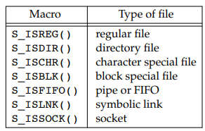
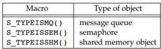
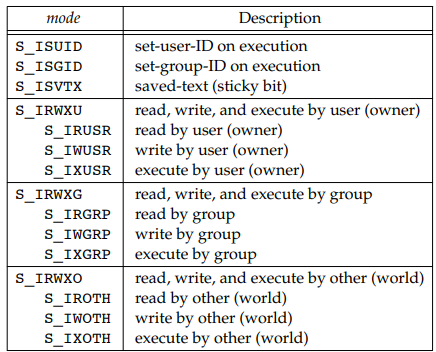
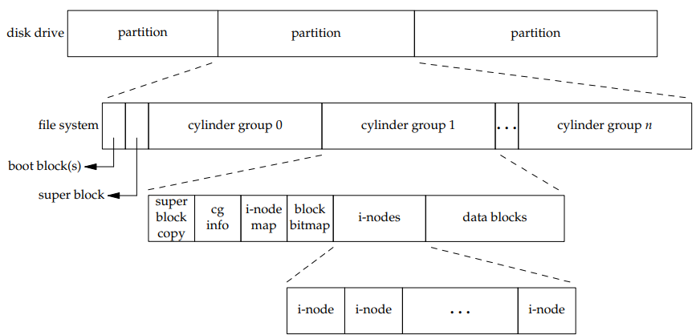
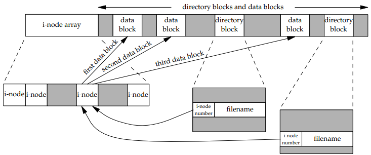
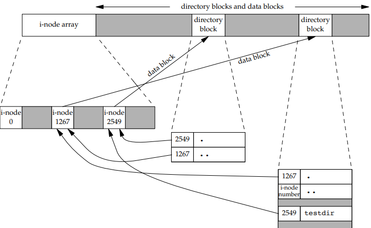
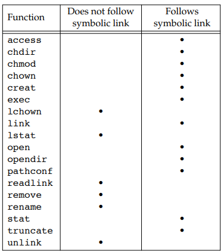
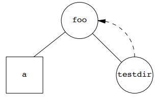
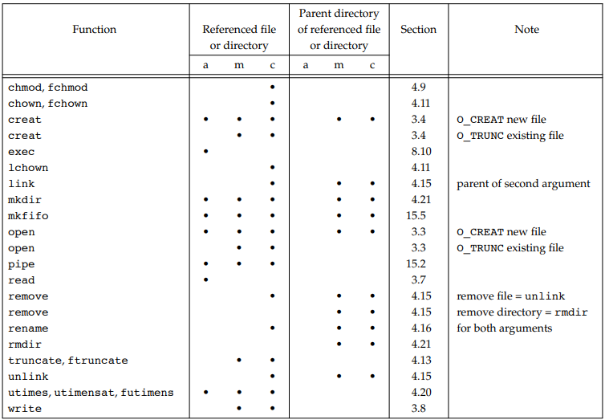


# 4. 파일과 디렉터리

## 3.1 소개

이번 챕터에서는 파일 시스템의 기능들과 파일의 속성을 살펴본다.

우선 stat 함수를 소개한 이후 stat 구조체의 멤버들을 훑으면서 속성들을 살펴본다.

## stat, fstat, fstatat, lstat

```c++
#include <sys/stat.h>
int stat(const char *restrict pathname, struct stat *restrict buf );
int fstat(int fd, struct stat *buf );
int lstat(const char *restrict pathname, struct stat *restrict buf );
int fstatat(int fd, const char *restrict pathname,
struct stat *restrict buf, int flag);
```

 - stat 함수는 파일 경로를 인수로 지정된 파일에 대한 정보를 한 구조체에 담아 돌려준다.
 - lstat 함수는 stat 과 비슷하되 기호 링크에 대한 정보를 돌려준다.
 - `buf` 인수는 결과가 저장될 구조체를 나타내는 포인터로, 호출 전에 미리 메모리를 할당 해두어야 한다.

```c++
struct stat {
	mode_t st_mode; 			/* file type & mode (permissions) */
	ino_t st_ino;				/* i-node number (serial number) */
	dev_t st_dev; 				/* device number (file system) */
	dev_t st_rdev; 				/* device number for special files */
	nlink_t st_nlink; 			/* number of links */
	uid_t st_uid; 				/* user ID of owner */
	gid_t st_gid; 				/* group ID of owner */
	off_t st_size; 				/* size in bytes, for regular files */
	struct timespec st_atim; 	/* time of last access */
	struct timespec st_mtim; 	/* time of last modification */
	struct timespec st_ctim; 	/* time of last file status change */
	blksize_t st_blksize; 		/* best I/O block size */
	blkcnt_t st_blocks; 		/* number of disk blocks allocated */
};
```

## 파일 종류
1. 정규 파일은 가장 흔한 종류의 파일로, 어떤 형태이든 자료를 담는다. 텍스트 자료와 이진 자료를 구분하지 않음
2. 디럭테러 파일은 다른 파일들의 이름과 그 파일들에 대한 정보로의 포인터들을 담은 파일이다. 디렉터리 파일에 직접 쓸 수 있는 것은 커널뿐이다.
3. 블록 특수 파일(block special file), 장치에 대해 고정 크기 단위의 버퍼링 있는 입출력 접근을 제공하는 파일이다.
4. 문자 특수 파일(character special file), 장치에 대해 가변 크기 단위의 버퍼링 없는 입출력 접근을 제공하는 파일이다.
5. FIFO. 프로세스들 사이의 통신에 쓰이는 파일이다.
6. 소켓. 프로세스들 사이의 네트워크 통신에 쓰이는 파일이다.
7. 기호 링크. 다른파일을 가리키는 파일이다.

파일 종류는 stat 구조체의 `st_mode` 멤버에 부호화된다.




### 예제 

```c++
#include "apue.h"
int
main(int argc, char *argv[])
{
	int i;
	struct stat buf;
	char *ptr;
	for (i = 1; i < argc; i++) {
		printf("%s: ", argv[i]);
		if (lstat(argv[i], &buf) < 0) {
			err_ret("lstat error");
			continue;
		}
		if (S_ISREG(buf.st_mode))
			ptr = "regular";
		else if (S_ISDIR(buf.st_mode))
			ptr = "directory";
		else if (S_ISCHR(buf.st_mode))
			ptr = "character special";
		else if (S_ISBLK(buf.st_mode))
			ptr = "block special";
		else if (S_ISFIFO(buf.st_mode))
			ptr = "fifo";
		else if (S_ISLNK(buf.st_mode))
			ptr = "symbolic link";
		else if (S_ISSOCK(buf.st_mode))
			ptr = "socket";
		else
			ptr = "** unknown mode **";
		printf("%s\n", ptr);
	}
	exit(0);
}
```
명렬줄 인수로 주어진 각 파일의 종류를 출력한다. 여기서 일부러 stat 함수 대신 lstat 함수를 사용하는데, 이는 기호 링크를 검출하기 위함이다.

```shell
$ ./a.out /etc/passwd /etc /dev/log /dev/tty \
> /var/lib/oprofile/opd_pipe /dev/sr0 /dev/cdrom
/etc/passwd: regular
/etc: directory
/dev/log: socket
/dev/tty: character special
/var/lib/oprofile/opd_pipe: fifo
/dev/sr0: block special
/dev/cdrom: symbolic link
```

## 사용자-ID-설정 (SUID) 비트와 그룹-ID-설정(SGID) 비트

모든 프로세스에는 각각 여섯개 이상의 ID들이 연관된다.
|구분|설명|
|:---|:---|
|실제 사용자 ID, 실제 그룹 ID| 사용자나 그룹이 실제로 누구인지 알려주는 ID|
|유효 사용자 ID, 유효 그룹 ID| 파일 접근 권한 점검에 쓰임|
|저장된 사용자 ID, 저장된 그룹 ID| exec류 함수들이 저장함|

 -  실제 ID는 해당 사용자나 그룹이 실제로 누구인지를 알려준다.
 -  유효 ID는 파일 접근 권한을 결정한다.
 -  저장된 ID는 프로그램이 실행될 때 저장해 둔 유효 ID의 복사본을 담고 있다.
 -  보통 프로그램 파일을 실행할 때 프로세스의 유효 ID와 실제 ID는 같다.
 -  그러나 파일의 모드 워드 `st_mode`에 특별한 플래그를 설정하면 실행될 때 프로세스의 유효 ID가 파일의 소유자`st_uid`로 설정되게 할 수 있다.
 -  이 두비트를 각각 SUID, SGID 라 부른다.
    -  만약 소유자가 슈퍼 사용자인 프로그램 파일의 SUID 가 설정되었다면, 프로그램 실행시 프로세스는 슈퍼사용자 특권을 가지게 된다. 실제 사용자 ID와는 무관
 -  두 빝츠 판정시 `S_ISUID` 혹은 `S_ISGID`사용
 
## 파일 접근 권한
`st_mode`값에는 파일에 대한 접근 권한 비트들도 부호화되어 있다. 보통 이 아홉 권한 비트를 수정할 때 `chmod`명령을 사용한다.
|`st_mode` 마스크|의미|
|:---:|:---:|
|S_IRUSR|사용자 읽기|
|S_IWUSR|사용자 쓰기|
|S_IXUSR|사용자 실행|
|S_IRGRP|그룹 읽기|
|S_IWGRP|그룹 쓰기|
|S_IXGRP|그룹 실행|
|S_IROTH|기타 읽기|
|S_IWOTH|기타 쓰기|
|S_IXOTH|기타 실행|

 - 그 어떤 종류의 파일이든 이름으로 파일을 열 때에는 반드시 그 이름에 언급된 각 디렉터리에 대한 실행 권한이 필요하다. PATH 환경변수 동일
 - 파일에 대한 읽기 권한은 기존 파일을 읽기를 위해 열 수 있는지의 여부를 결정
 - 파일에 대한 쓰기 권한은 기존 파일을 쓰기를 위해 열 수 있는지의 여부를 결정
 - `open`함수에 `O_TRUNC`플래그를 지정하기 위해서는 쓰기 권한 필요
 - 디렉터리에 쓰기 권한과 실행 권한이 없으면 해당 디렉터리에 새파일을 만들수 없고, 파일 삭제도 안된다.
 - 어떤 파일을 여러 exec류 함수들 중 하나로 실행하려면 파일 실행 권한이 필요하다.
 - 프로세스가 파일을 열거나 생성, 삭제할 때 커널이 수행하는 파일 접근 권한 판정은 파일 소유자 Id, 유효 ID, 추가 그룹 Id 에 의존한다.
 - 커널이 접근 권한을 판정하는 순서는 다음과 같다.

1. 슈퍼사용자는 파일 시스템 전체에 접근이 가능
2. 프로세스의 유효 사용자 ID가 파일의 소유자 ID와 같은 경우 접근이 가능
3. 프로세스의 유효 그룹 ID나 추가 그룹 Id가 파일의 그룹 ID와 같으면 적절한 접근 권한 비트에 맞춰 접근 가능
4. 적절한 기타 접근 허융 비트가 설정되어 있으면 접근 가능

## 새 파일과 디렉터리의 소유권
새 파일의 사용자 ID는 프로세스의 유효 사용자 ID로 설정된다. 그룹 ID의 설정 방식은 다음 두 방식중 하나를 선택한다.
1. 프로세스의 유효 그룹 ID를 새 파일의 그룹 ID로 사용
2. 파일이 생성된 디렉터리의 그룹 ID를 새 파일의 그룹 ID로 사용

## access 함수와 faccessat 함수

 - 접근 허용 판정이 실제 사용자 ID와 실제 그룹 ID에 근거해서 수행되길 프로세스가 원할 수 있다.
 - 프로세스가 SUID 기능이나 GUID 설정 기능을 통해서 다른 누군가의 신원으로 실행될 때 그런 방식이 유용하다.
 - `access`함수와 `faccessat`함수는 실제 사용자 ID와 실제 그룹 ID에 근거해서 그러한 판정을 수행한다.
 - `mode`에는 파일의 존재 여부를 알고 싶으면 `F_OK`를 지정하고 그외의 경우에는 플래그들을 임의로 결합해서 지정한다.

```c++
#include <unistd.h>
int access(const char *pathname, int mode);
int faccessat(int fd, const char *pathname, int mode, int flag);
```

|`mode`|설명|
|:---:|:---:|
|`R_OK`|읽기 권한 판정|
|`W_OK`|쓰기 권한 판정|
|`X_OK`|실행 권한 판정|

```c++
#include "apue.h"
#include <fcntl.h>
int
main(int argc, char *argv[])
{
	if (argc != 2)
		err_quit("usage: a.out <pathname>");
	if (access(argv[1], R_OK) < 0)
		err_ret("access error for %s", argv[1]);
	else
		printf("read access OK\n");
	if (open(argv[1], O_RDONLY) < 0)
		err_ret("open error for %s", argv[1]);
	else
		printf("open for reading OK\n");
	exit(0);
}
```

```shell
$ ls -l a.out
-rwxrwxr-x 1 sar 15945 Nov 30 12:10 a.out
$ ./a.out a.out
read access OK
open for reading OK
$ ls -l /etc/shadow
-r-------- 1 root 1315 Jul 17 2002 /etc/shadow
$ ./a.out /etc/shadow
access error for /etc/shadow: Permission denied
open error for /etc/shadow: Permission denied
$ su # become superuser
Password: # enter superuser password
$ chown root a.out # change file’s user ID to root
$ chmod u+s a.out # and turn on set-user-ID bit
$ ls -l a.out # check owner and SUID bit
-rwsrwxr-x 1 root 15945 Nov 30 12:10 a.out
$ exit # go back to normal user
$ ./a.out /etc/shadow
access error for /etc/shadow: Permission denied
open for reading OK
```

## `umask`함수

```c++
#include <sys/stat.h>
mode_t umask(mode_t cmask);
```
|마스크 비트|의미|
|:---:|:---:|
|0400|사용자 읽기|
|0200|사용자 쓰기|
|0100|사용자 실행|
|0040|그룹 읽기|
|0020|그룹 쓰기|
|0010|그룹 실행|
|0004|기타 읽기|
|0002|기타 쓰기|
|0001|기타 실행|

 - `umask` 함수는 현재 프로세스에 대한 파일 모드 생성 마스크를 설정하고 마스크의 이전 값을 돌려준다.
 - `cmask` 인수에는 아홉 상수들 중 임의의 것들을 OR 로 결합한 겻을 지정한다.
 - 파일 모드 생성 마스크에 켜져 있는 비트들을 파일 생성 시 `mode`인수의 해당 비트들을 끄는 역할을 한다.

```c++
#include "apue.h"
#include <fcntl.h>
#define RWRWRW (S_IRUSR|S_IWUSR|S_IRGRP|S_IWGRP|S_IROTH|S_IWOTH)
int
main(void)
{
	umask(0);
	if (creat("foo", RWRWRW) < 0)
		err_sys("creat error for foo");
	umask(S_IRGRP | S_IWGRP | S_IROTH | S_IWOTH);
	if (creat("bar", RWRWRW) < 0)
		err_sys("creat error for bar");
	exit(0);
}
```

```shell
$ umask # first print the current file mode creation mask
002
$ ./a.out
$ ls -l foo bar
-rw------- 1 sar 0 Dec 7 21:20 bar
-rw-rw-rw- 1 sar 0 Dec 7 21:20 foo
$ umask # see if the file mode creation mask changed
002
```

 - 새 파일을 생성하는 프로그램을 작성할 때 특정 접근 권한 비트들이 반드시 활성화되게 하고 싶다면 반드시 프로스세가 실행되는 도중에 `umask`값을 변경해야 한다.
 - 모든 셸에는 현재 파일 모드 생성 마스크를 설정하거나 출력하는 데 사용할 수 있는 내장 `umask`명령이 있다.

## `chmod`, `fchmod`, `fchmodat`함수

```c++
#include <sys/stat.h>
int chmod(const char *pathname, mode_t mode);
int fchmod(int fd, mode_t mode);
int fchmodat(int fd, const char *pathname, mode_t mode, int flag);
```


 - 기존 파일에 대한 파일 접근 권한을 변경할 수 있다.
 - 파일의 권한 비트들을 변경하려면 프로세스의 유효 사용자 ID가 파일의 소유자 ID와 같거나 프로세스가 슈퍼 사용자 특권을 가지고 있어야 한다.
 - `mode`인수에는 위 도표의 상수들을 논리합으로 결합한 값을 지정한다.

```c++
#include "apue.h"
int
main(void)
{
	struct stat statbuf;
	/* turn on set-group-ID and turn off group-execute */
	if (stat("foo", &statbuf) < 0)
		err_sys("stat error for foo");
	if (chmod("foo", (statbuf.st_mode & ˜S_IXGRP) | S_ISGID) < 0)
		err_sys("chmod error for foo");
	/* set absolute mode to "rw-r--r--" */
	if (chmod("bar", S_IRUSR | S_IWUSR | S_IRGRP | S_IROTH) < 0)
		err_sys("chmod error for bar");
	exit(0);
}
```

```shell
$ ls -l foo bar
-rw------- 1 sar 0 Dec 7 21:20 bar
-rw-rw-rw- 1 sar 0 Dec 7 21:20 foo
$ a.out
$ ls -l foo bar
-rw-r--r-- 1 sar 0 Dec 7 21:20 bar
-rw-rwSrw- 1 sar 0 Dec 7 21:20 foo
```

 - `bar`파일의 접근 권한 모드를 절대적인 값 `rw-r--r--` 로 지정
 - `foo`파일에 대해서는 현재 상태에 상대적인 값을 설정.
 - `stat`호출 이후 GUID 비트를 켜고 `S_ISGID`비트를 끈다.
  
## 끈적이 비트
 - `S_ISVTX` 비트가 프로그램 파일에 지정됐고 처음 실행하면 프로그램 종료이후 프로그램 텍스트의 복사본이 교환 영역(swap area)에 저장된다.
 - 이후에 그 프로그램이 실행될 때에는 프로그램이 메모리에 더 빨리 적재된다. (블록이 흩어져 있지 않음)
 - 디렉터리에 설정되어 있다면 다음조건중 하나를 만족하는 사용자는 디렉터리 안의 파일을 제거하거나 파일 이름을 변경할 수 있다.
   - 그 파일의 소유자
   - 디렉터리의 소유자
   - 슈퍼사용자

## `chown`, `fchown`, `fchownat`, `lchown`함수

```c++
#include <unistd.h>
int chown(const char *pathname, uid_t owner, gid_t group);
int fchown(int fd, uid_t owner, gid_t group);
int fchownat(int fd, const char *pathname, uid_t owner, gid_t group, int flag);
int lchown(const char *pathname, uid_t owner, gid_t group);
```

 - `chown`함수로는 파일의 사용자 ID와 그룹 ID를 변경할 수 있다.
 - 단, `owner`인수나 `group`인수 중 하나가 -1이면 해당 Id는 변경되지 않는다.
 - 기호 링크인 경우 `lchown`과 `fchownat`은 기호 링크가 가리키는 파일이 아니라 기호 링크 자체의 소유자를 변경한다.
 - 지정된 파일에 대해 `_POSIX_CHOWN_RESTRICTED`가 적용되는 경우
   - 오직 슈퍼 사용자 프로세스만이 그 파일의 사용자 ID 변경 가능
   - 슈퍼 사용자가 아닌 프로세스가 만약 그 파일을 소유하고 있고, `owner`가 -1 또는 파일의 사용자 ID와 같고, `group`이 프로세스의 유효 그룹 ID와 같거나 추가 그룹 Id중 하나와 같다면 파일의 그룹 ID를 변경 할 수 있다.

## 파일 크기

 - `stat`구조체의 `st_size`멤버는 파일의 바이트 단위 크기를 담는다.
 - 정규 파일은 파일 크기가 0인것도 허용
 - 기호 링크의 파일 크기는 파일이름의 바이트 수
 - `st_blksize`는 파일의 입출력에 대해 선호되는 블록 크기
 - `st_blocks`는 실제로 할당된 512 바이트 블록 개수
  
### 파일의 구멍
```shell
$ ls -l core
-rw-r--r-- 1 sar 8483248 Nov 18 12:18 core
$ du -s core
272 core
$ wc -c core
8483248 core			# 파일의 구멍과 상관없이 전체 파일 크기를 읽음
$ cat core > core.copy
$ ls -l core*
-rw-r--r-- 1 sar 8483248 Nov 18 12:18 core
-rw-rw-r-- 1 sar 8483248 Nov 18 12:27 core.copy
$ du -s core*
272 core
16592 core.copy
```

 - `core`파일의 크기는 8MB 보타 약간 크다. 그러나 디스크 공간은 블록 272개로 구멍이 있다.
 - `core.copy`같은 경우 실제 자료 블록들에 대한 포인터들을 담는데 추가적인 블록을 소비해서 디스크 공간이 더 크게 측정

## 파일 절단

```c++
#include <unistd.h>
int truncate(const char *pathname, off_t length);
int ftruncate(int fd, off_t length);
```

-  기존 파일을 크기가 `length`바이트가 되도록 절단한다.
-  파일 이전 크기가 `length`보다 컸다면 이후의 자료에는 더 이상 접근 불가
-  파일 이전 크기가 `length`보다 작았다면 파일의 크기가 증가하고, 기존의 파일 끝과 새로운 파일의 긑 사이의 자료는 구멍이된다.
-  파일을 아예 비우는것 (`O_TRUNC`플래그를 지정해서 `open`호출)도 파일 절단의 한 특별한 예

## 파일 시스템



 - 하나의 디스크 드라이브는 하나 이상의 파티션들로 나뉘어져 있다.
 - 각 파티션마다 하나의 파일 시스템이 담길 수 있다.
 - i-노드는 파일에 대한 대부분의 정보를 담은 고정 길이 항목이다.



 - 디렉터리 항목 두 개가 동일한 i-노드 항목을 가리킨다. 모든 i-노드에는 자신을 가리키는 디렉터리 항목의 개수를 담은 링크 횟수 필드가 있다. 파일을 삭제하려면 이 링크 횟수가 0이어야 한다. `stat`구조체에서 링크 횟수는 `st_nlink`멤버에 들어있다.
 - 다른 종류의 링크로 기호 링크가 있다. 기호 링크에서는 기호 링크가 가리키는 파일의 이름이 기호 링크 파일의 실제 내용에 저장된다.
 - i-노드는 파일 종류, 파일의 접근 권한 비트들, 파일의 크기, 파일의 자료 블록들을 가리키는 포인터들 등등 파일에 관한 모든 정보를 담는다.
 - 디렉터리 항목의 i-노드 번호는 같은 파일 시스템의 한 i-노드를 가리킨다. 따라서 한 디렉터리 항목이 다른 파일 시스템에 있는 i-노드를 지칭하지 못한다.
 - 파일 시스템을 변경하지 않고 파일의 이름을 바꿀 때 파일의 ㅅ리제 내용이 이동될 필요는 없다. 그냥 기존의 i-노드를 가리키는 새 디렉터리 항목을 추가하고 기존 디렉터리 항목의 링크를 해제하면 된다.
 - 말단 디렉터리의 링크 횟수는 항상 2이다. 그 디렉터리를 지칭하는 디렉터리 항목 자체와 그 디렉터리의 `.`항목에서 비롯된 것.



## `link`, `linkat`, `unlink`, `unlinkat`, `remove`함수

```c++
#include <unistd.h>
int link(const char *existingpath, const char *newpath);
int linkat(int efd, const char *existingpath, int nfd, const char *newpath, int flag);
```

 - `link`함수나 `linkat`함수를 이용하면 기존 파일에 대한 링크를 만들 수 있다.
 - 기존 파일 `existingpath`를 가리키는 새 디렉터리 항목 `newpath`를 생성한다.
 - 만일 `newpath`가 이미 존재한다면 오류가 반환
 - 새 디렉터리 항목의 생성과 링크 횟수의 증가는 반드시 원자적 연산이어야 한다.(링크 카운트 증가, 감소)

```c++
#include <unistd.h>
int unlink(const char *pathname);
int unlinkat(int fd, const char *pathname, int flag);
```

 - `unlink`는 기존 디렉터리 항목을 제거할 때 사용한다.
 - `pathname`으로 저징된 디렉터리 항목을 제거하고 해당 파일의 링크 횟수를 감소한다.
 - 파일의 링크를 해제하기 위해서는 해당 디렉터리 항목이 담긴 디렉터리에 대한 쓰기 권한과 실행 권한이 반드시 필요하다.
 - 파일의 내요은 링크 횟수가 0이 되었을 때에만 삭제될 수 있다.
 - 파일을 다른 어떤 프로세스가 열어 두고 있다면 그 파일의 내용은 삭제되지 않는다. 먼저 파일을 열어둔 프로세스의 개수를 확인, 그 이후 링크 횟수를 점검하여 파일을 삭제한다.
 - `pathname`이 기호 링크이면 `unlink`는 그 기호링크가 가리키는 파일이 아니라 기호 링크 자체를 제거한다.

```c++
#include "apue.h"
#include <fcntl.h>
int
main(void)
{
	if (open("tempfile", O_RDWR) < 0)
		err_sys("open error");
	if (unlink("tempfile") < 0)
		err_sys("unlink error");
	printf("file unlinked\n");
	sleep(15);
	printf("done\n");
	exit(0);
}
```

```shell
$ ls -l 		# 파일의 크기 확인
-rw-r----- 1 sar 413265408 Jan 21 07:14 tempfile
$ df /home 		# 가용 디스크 용량을 확인
Filesystem 1K-blocks Used Available Use% Mounted on
/dev/hda4 11021440 1956332 9065108 18% /home
$ ./a.out &		# 프로그램을 백그라운드에서 실행
1364			# 셸이 그 프로세스 Id를 출력
$ file unlinked	# 파일 링크 해제 되었음
ls -l tempfile	# 파일 이름이 여전히 존재 하는지 확인
ls: tempfile: No such file or directory		# 디렉터리 항목 사라짐
$ df /home		# 가용 용량이 늘어났는지 확인
Filesystem 1K-blocks Used Available Use% Mounted on
/dev/hda4 11021440 1956332 9065108 18% /home
$ done			# 프로그램이 종료 되었고 파일이 닫혔음
df /home		# 이제 실제 가용 용량이 늘어났는지 확인
Filesystem 1K-blocks Used Available Use% Mounted on
/dev/hda4 11021440 1552352 9469088 15% /home		# 가용 디스크 용량이 394.1MB 만큼 확보
```

## `rename`함수와 `renameat`함수

```c++
#include <stdio.h>
int rename(const char *oldname, const char *newname);
int renameat(int oldfd, const char *oldname, int newfd, const char *newname);
```

 - 파일이나 디렉터리 이름을 변경할 때 사용
 - 만일 `oldname`이 디렉터리가 아닌 파일을 가리킨다면 파일 또는 기호 링크의 이름을 바꾸는 것이다.
   - 이 경우 `newname`으로 지정된 항목이 있다면 그 항목은 디렉터리가 아니어야 한다.
   - 이때 `newname`항목은 제거되고 이름이 바뀐다.
 - 만일 `oldname`이 디렉터리를 가리킨다면 디렉터리 이름을 바꾼다.
   - 만일 `newname`이 존재하면 디렉터리어야 하고, 비어 있어야 한다.
 - `oldname`이나 `newname`중 하나라도 기호 링크를 가리키는 경우에는 그 링크가 가리키는 파일이 아니라 그 링크 자체가 처리된다.
 - `.`나 `..`항목의 이름은 바꿀 수 없다.
 - `oldname`과 `newname`이 같은 파일을 가리키면 함수는 아무것도 바꾸지 않고 성공적으로 반환된다.
 - `oldname`과 `newname`를 담은 디렉터리에 대한 쓰기 권한이 필요하다.

## 기호 링크

 - 하드 링크는 파일의 i-노드를 직접 가리키는 반면, 기호 링크는 파일을 간접적으로 가리킨다.
 - 기호 링크는 하드 링크의 다음과 같은 한계를 극복하기 위해 도입됐다.
   - 보통의 경우 하드 링크에서는 링크와 파일이 같은 파일 시스템에 있어야 한다.
   - 디렉터리에 대한 하드 링크는 슈퍼사용자만 만들 수 있다.
 - 기호 링크와 가리키는 파일에 대해서는 파일 시스템이 이러한 제약을 가하지 않는다.



```shell
$ mkdir foo 				# 새 디렉터리를 만든다.
$ touch foo/a				# 길이가 0인 파일을 생성
$ ln -s ../foo foo/testdir 	# 기호 링크를 생성
$ ls -l foo
total 0
-rw-r----- 1 sar 0 Jan 22 00:16 a
lrwxrwxrwx 1 sar 6 Jan 22 00:16 testdir -> ../foo
```




 - 기호 링크 때문에 파일 시스템에 순환고리가 생길 수 있다.
 - 경로 이름을 받는 함수들은 대부분 그런 일이 생기면 `errno`를 `ELOOP`로 설정하고 오류를 반환한다.
 - 이런 형태의 순환 고리는 쉽게 제거 할 수 있다.
 - unlink는 기호 링크를 따라 가지 않으므로 `foo/testdir`파일에 대해 `unlink`를 호출하면 된다.
 - 그러나 하드 링크 때문에 이런 종류의 순환고리가 만들어졌다면 제거하기가 훨씬 어렵다.
 - 이런 이유로, link 함수는 프로세스에 슈퍼사용자 특권이 없는 한 디렉터리에 대한 하드링크를 만들어 주지 않는다.

## 기호 링크 생성과 읽기

```c++
#include <unistd.h>
int symlink(const char *actualpath, const char *sympath);
int symlinkat(const char *actualpath, int fd, const char *sympath);
```

 - 기호 링크는 `symlink`함수나 `symlinkat`함수로 생성할 수 있다.
 - `actualpath`를 가리키는 새로운 디렉터리 ㅎ아목 `sympath`를 생성한다.
 - 기호 링크를 생성하는 시점에서 `actualpath`가 반드시 존재해야 하는 것은 아니다.
  
```c++
#include <unistd.h>
ssize_t readlink(const char* restrict pathname, char *restrict buf, size_t bufsize);
ssize_t readlinkat(int fd, const char* restrict pathname, char *restrict buf, size_t bufsize);
```

 - `open`함수는 기호 링크를 따라가므로, 링크 자체를 열어서 링크 안의 이름을 읽으려면 다른 수단이 필요하다.
 - 이 때 `readlink` `readlinkat`함수를 사용한다.
 - 이 함수들은 `open`, `read`, `close`의 기능을 결합한 것이다.
 - 호출 성공시 함수는 `buf`로 읽어 들인 바이트 개수를 돌려준다. `buf`에 저장된 기호 링크의 내용은 널로 끝나지 않는다.

## 파일 시간

|필드|설명|예|`ls(1)`옵션|
|---|---|---|---|
|`st_atim`|파일 자료의 최종 접근 시간|`read`|-u|
|`st_mtim`|파일 자료의 최종 수정 시간|`write`|기본|
|`st_ctim`|i-노드 상태의 최종 변경 시간|`chmod`,`chown`|-c|



 - i-노드의 모든 정보는 파일의 실제 내용과 분리되어 저장되므로, 내용 수정 시간뿐만 아니라 상태 변경 시간도 유지할 필요가 있다.
   - 파일 접근 권한 변경, 사용자 ID 변경, 링크 횟수 변경등은 i-노드에 영향을 주지만 실제 내용은 변경하지 않는다.
 - 시스템은 i-노드의 최종 접근 시간은 유지하지 않는다. 그래서 `access`함수나 `stat`함수는 이 세 시간에 아무런 영향도 미치지 않는다.
 - 최종 접근 시간은 시스템 관리자가 일정 기간 동안 접근되지 않은 파일들을 삭제하는 용도로 흔히 쓰인다.
 - 최종 수정 시간과 상태 변경 시간은 내용이 변경된 파일들이나 i-노드가 변경된 파일들만 보관하려 할 때 유용하다.
 - 디렉터리는 그냥 디렉터리 항목들을 담는 하나의 파일일 뿐이기 때문에 디렉터리 항목을 추가, 삭제, 수정하면 디렉터리에 연관된 세 시간이 변경될 수 있다.

## `futimens`, `utimensat`, `utimes`함수

```c++
#include <sys/stat.h>
int futimens(int fd, const struct timespec times[2]);
int utimensat(int fd, const char *path, const struct timespec times[2], int flag);
```

 - `futimens`함수와 `utimnsat`함수는 파일의 접근 시간과 수정 시간을 변경한다.
 - `timespec`구조체를 이용해서 타임스탬프를 나노초 단위로 지정한다.
 - `times`배열 인수의 첫 원소에 접근 시간을, 둘째 원소에는 수정 시간을 담아서 호출해야 한다.
   - `times`인수에 널 포인터가 지정된 경우에는 두 타임스탬프가 현재시간으로 설정
   - `times`인수가 널이 아니고 구조체의 `tv_nsec`필드가 `UTIME_NOW`이면 현재 시간으로 설정
   - `times`인수가 널이 아니고 구조체의 `tv_nsec`필드가 `UTIME_OMIT`이면 타임스탬프는 변경되지 않는다.
   - `times`인수가 널이 아니고 `tv_nsec`필드가 위 두 값이 아니라면 타임 스탬프가 `tv_sec`필드와 `tv_nsec`필드에 지정된 값으로 설정된다.
 - 만일 `times`가 널 포인터이거나 `tv_nsec`필드가 `UTIME_NOW`이면 프로세스의 유효 사용자 ID가 반드시 파일의 소유자 ID와 동일하거나, 프로세스에 그 파일에 대한 쓰기 권한이 있거나, 프로세스가 슈퍼 사용자 이어야 한다.
 - `times`가 널이 아니고 `tv_nsec`필드가 `UTIME_NOW`, `UTIME_OMIT`도 아니면 프로세스의 유효 사용자 ID가 파일의 소유자 ID와 같거나 프로세스가 슈퍼사용자 프로세스 이어야 한다.
 - `futimens`함수오 `utimensat`함수 모두 POSIX.1에 포함되어 있다.

```c++
#include <sys/time.h>
int utimes(const char *pathname, const struct timeval times[2]);

struct timeval {
	time_t tv_sec; /* seconds */
	long tv_usec; /* microseconds */
};
```
 - 셋째 함수 `utimes`는 단일 UNIX 규격의 XSI 옵션의 일부로 포함되어 있다.
 - `times`인수는 타임스탬프 두 개의 배열을 가리키는 포인터이고 각 타임스탬프는 초와 마이크로초로 표현된다.
 - 상태 변경 시간, 즉 i-노드가 마지막으로 변경된 시간은 지정할 수 없다. 이는 `utimes`호출 시 해당 `st_ctim`필드가 자동으로 갱신되기 때문이다.

```c++
#include "apue.h"
#include <fcntl.h>
int
main(int argc, char *argv[])
{
	int i, fd;
	struct stat statbuf;
	struct timespec times[2];
	for (i = 1; i < argc; i++) {
		if (stat(argv[i], &statbuf) < 0) { /* fetch current times */
			err_ret("%s: stat error", argv[i]);
			continue;
		}
		if ((fd = open(argv[i], O_RDWR | O_TRUNC)) < 0) { /* truncate */
			err_ret("%s: open error", argv[i]);
			continue;
		}
		times[0] = statbuf.st_atim;
		times[1] = statbuf.st_mtim;
		if (futimens(fd, times) < 0) /* reset times */
			err_ret("%s: futimens error", argv[i]);
		close(fd);
	}
	exit(0);
}
```

```shell
$ ls -l changemod times					# 파일들의 크기와 최종 수정 시간을 확인
-rwxr-xr-x 1 sar 13792 Jan 22 01:26 changemod
-rwxr-xr-x 1 sar 13824 Jan 22 01:26 times
$ ls -lu changemod times				# 최종 접근 시간을 확인
-rwxr-xr-x 1 sar 13792 Jan 22 22:22 changemod
-rwxr-xr-x 1 sar 13824 Jan 22 22:22 times
$ date									# 오늘 날짜와 시간 출력
Fri Jan 27 20:53:46 EST 2012
$ ./a.out changemod times				# 프로그램을 실행하고
$ ls -l changemod times					# 결과 확인
-rwxr-xr-x 1 sar 0 Jan 22 01:26 changemod
-rwxr-xr-x 1 sar 0 Jan 22 01:26 times
$ ls -lu changemod times				# 최종 접근 시간을 다시 확인
-rwxr-xr-x 1 sar 0 Jan 22 22:22 changemod
-rwxr-xr-x 1 sar 0 Jan 22 22:22 times
$ ls -lc changemod times				# 상태 변경 시간도 확인
-rwxr-xr-x 1 sar 0 Jan 27 20:53 changemod
-rwxr-xr-x 1 sar 0 Jan 27 20:53 times
```

## `mkdir`, `mkdirat`, `rmdir`함수

```c++
#include <sys/stat.h>
int mkdir(const char *pathname, mode_t mode);
int mkdirat(int fd, const char *pathname, mode_t mode);
```

 - 이 함수들은 빈 디렉터리 하나를 새로 생성한다.
 - `mode`인수로 지정된 파일 접근 권한들은 프로세스의 파일 모드 생성 마스크에 의해 변조된 후 적용된다.
 - 디렉터리를 생성할 때에는 실행 비트들 중 적어도 하나는 활성화하는 것이 좋다.
 - 그래야 생성된 디렉터리 안의 파일이름들에 대한 접근이 허용된다.

```c++
#include <unistd.h>
int rmdir(const char *pathname);
```
 - 빈 디렉터리는 `rmdir`함수로 삭제한다.
 - 이 함수 호출로 인해 디렉터리의 링크 횟수가 0이 되고, 디렉터리를 열어 둔 프로세스가 없다면 디렉터리가 차지하고 있던 공간이 해제된다.

## 디렉터리 읽기

```c++
#include <dirent.h>
DIR *opendir(const char *pathname);
DIR *fdopendir(int fd);
// Both return: pointer if OK, NULL on error
struct dirent *readdir(DIR *dp);
// Returns: pointer if OK, NULL at end of directory or error
void rewinddir(DIR *dp);
int closedir(DIR *dp);
// Returns: 0 if OK, −1 on error
long telldir(DIR *dp);
// Returns: current location in directory associated with dp
void seekdir(DIR *dp, long loc);
```

 - 디렉터리에 대한 쓰기 권한 비트는 디렉터리에 새 파일을 생성, 제거하기 위한 판단을 위해 사용한다.
 - 디렉터리에 대한 쓰기는 오직 커널만 가능하다.
 - `fdopendir`함수는 열린 file descriptor를 여러 디렉터리 처리 함수들에 쓰이는 DIR 구조체롤 변환한다.
 - `dirent` 구조체의 구체적인 구성은 헤더파일 정의에 따라 다르지만 다음 두 멤버는 반드시 있어야 한다.
   - `ino_t d_ino` i-노드 번호
   - `char d_name[]` 널로 끝나는 파일이름
 - DIR 구조체는 현재 읽고 있는 디렉터리에 대한 정보를 관리하기 위해 사용하는 내부적인 구조체다.
 - `opendir`함수는 첫 `readdir`호출이 디렉터리의 첫 항목을 돌려줄 수 있도록 내부적인 여러 가지를 초기화 한다.
 - `fdopendir`호출 시 넘겨 준 파일 서술자에 연관된 파일 오프셋에 의해 결정된다.

```c++
#include "apue.h"
#include <dirent.h>
#include <limits.h>
/* 각 파일이름마다 호출될 함수의 양식 */
typedef int Myfunc(const char *, const struct stat *, int);
static Myfunc myfunc;
static int myftw(char *, Myfunc *);
static int dopath(Myfunc *);
static long nreg, ndir, nblk, nchr, nfifo, nslink, nsock, ntot;
int
main(int argc, char *argv[])
{
	int ret;
	if (argc != 2)
	err_quit("usage: ftw <starting-pathname>");
	ret = myftw(argv[1], myfunc); /* 재귀 시작 */
	ntot = nreg + ndir + nblk + nchr + nfifo + nslink + nsock;
	if (ntot == 0)
		ntot = 1; /* 0으로 나누기 방지 */
	printf("regular files = %7ld, %5.2f %%\n", nreg, nreg*100.0/ntot);
	printf("directories = %7ld, %5.2f %%\n", ndir, ndir*100.0/ntot);
	printf("block special = %7ld, %5.2f %%\n", nblk, nblk*100.0/ntot);
	printf("char special = %7ld, %5.2f %%\n", nchr, nchr*100.0/ntot);
	printf("FIFOs = %7ld, %5.2f %%\n", nfifo, nfifo*100.0/ntot);
	printf("symbolic links = %7ld, %5.2f %%\n", nslink, nslink*100.0/ntot);
	printf("sockets = %7ld, %5.2f %%\n", nsock, nsock*100.0/ntot);
	exit(ret);
}
/*
* pathname 에서 시작해서 hierarchy를 따라 내려간다
* 각 파일에 대해 호출자의 func()를 호출
*/
#define FTW_F 1 /* 디렉터리 이외의 파일 */
#define FTW_D 2 /* 디렉터리 */

#define FTW_DNR 3 /* 읽을 수 없는 디렉터리 */
#define FTW_NS 4 /* 상태 정보를 얻을 수 없는 파일 */

static char *fullpath; /* 각 파일의 전체 경로이름을 담을 버퍼 */
static size_t pathlen;

static int /* func()의 반환값을 그대로 돌려준다 */
myftw(char *pathname, Myfunc *func)
{
	fullpath = path_alloc(&pathlen); /* malloc PATH_MAX+1 bytes */
	
	if (pathlen <= strlen(pathname)) {
		pathlen = strlen(pathname) * 2;
		if ((fullpath = realloc(fullpath, pathlen)) == NULL)
			err_sys("realloc failed");
	}
	strcpy(fullpath, pathname);
	return(dopath(func));
}
/*
* fullpath에서 시작해서 hierarchy를 따라 내려간다
* fullpath가 디렉터리가 아니면 lstat()로 상태 정보를 얻고
* func()를 호출하고, 그 반환값을 돌려준다. 디렉터리라면 디렉터리 안의
* 각 이름마다 이 함수를 재귀적으로 호출한다.
*/
static int /* 이 함수는 func()의 반환값을 그대로 돌려준다 */
dopath(Myfunc* func)
{
	struct stat statbuf;
	struct dirent *dirp;
	DIR *dp;
	int ret, n;
	if (lstat(fullpath, &statbuf) < 0) /* stat error */
		return(func(fullpath, &statbuf, FTW_NS));
	if (S_ISDIR(statbuf.st_mode) == 0) /* not a directory */
		return(func(fullpath, &statbuf, FTW_F));
	/*
	* 디렉터리이면 먼저 디렉터리 자체에 대해 func()를 호출한 후
	* 디렉터리 안의 각 파일이름을 처리한다.
	*/
	if ((ret = func(fullpath, &statbuf, FTW_D)) != 0)
		return(ret);
	n=strlen(fullpath);
	if (n + NAME_MAX + 2 > pathlen) { /* expand path buffer */
		pathlen *= 2;
		if ((fullpath = realloc(fullpath, pathlen)) == NULL)
			err_sys("realloc failed");
	}
	fullpath[n++] = ’/’;
	fullpath[n] = 0;
	if ((dp = opendir(fullpath)) == NULL) /* 디렉터리를 읽을 수 없음 */
		return(func(fullpath, &statbuf, FTW_DNR));
	while ((dirp = readdir(dp)) != NULL) {
		if (strcmp(dirp->d_name, ".") == 0 || strcmp(dirp->d_name, "..") == 0)
			continue; /* ignore dot and dot-dot */
		strcpy(&fullpath[n], dirp->d_name); /* append name after "/" */
		if ((ret = dopath(func)) != 0) /* recursive */
			break; /* time to leave */
	}
	fullpath[n-1] = 0; /* 슬래시 이후의 모든 것 삭제 */
	if (closedir(dp) < 0)
	err_ret("can’t close directory %s", fullpath);
	return(ret);
}
static int
myfunc(const char *pathname, const struct stat *statptr, int type)
{
	switch (type) {
	case FTW_F:
		switch (statptr->st_mode & S_IFMT) {
		case S_IFREG: nreg++; break;
		case S_IFBLK: nblk++; break;
		case S_IFCHR: nchr++; break;
		case S_IFIFO: nfifo++; break;
		case S_IFLNK: nslink++; break;
		case S_IFSOCK: nsock++; break;
		case S_IFDIR: /* directories should have type = FTW_D */
			err_dump("for S_IFDIR for %s", pathname);
		}
		break;
	case FTW_D:
		ndir++;
		break;
	case FTW_DNR:
		err_ret("can’t read directory %s", pathname);
		break;
	case FTW_NS:
		err_ret("stat error for %s", pathname);
		break;
	default:
		err_dump("unknown type %d for pathname %s", type, pathname);
	}
	return(0);
}
```

 - 디렉터리 계통구조를 재귀적으로 따라 내려가면서 종류별 파일 개수를 세는 프로그램

## `chdir`, `fchdir`, `getcwd`함수

```c++
#include <unistd.h>
int chdir(const char *pathname);
int fchdir(int fd);
```
 - 프로세스가 자신의 현재 작업 디렉터리를 변경할 때에는 `chdir`나 `fchdir`함수를 호출한다.
 - 호출이 성공하면 `pathname`인수로 지정된 경로이름 또는 `fd`인수로 지정된 열린 파일 서술자에 해당하는 디렉터리가 현재 작업 디렉터리가 된다.

```c++
#include "apue.h"
int
main(void)
{
	if (chdir("/tmp") < 0)
		err_sys("chdir failed");
	printf("chdir to /tmp succeeded\n");
	exit(0);
}
```

```shell
$ pwd
/usr/lib
$ mycd
chdir to /tmp succeeded
$ pwd
/usr/lib
```

 - 현재 작업 디렉터리는 프로세스의 한 특성이기 때문에, 한 프로세스가 `chdir`를 호출해도 그 프로세스를 실행한 다른 프로세스의 현재 작업 디렉터리는 변하지 않는다.
 - 셸의 현재 작업 디렉터리를 변경하려면 `chdir`함수를 셸이 직접 호출해야 한다. 이런 이유로 `cd`명령이 셸에 내장되었다.

```c++
#include <unistd.h>
char *getcwd(char *buf, size_t size);
```

 - 현재 작업 디렉터리의 완전한 절대 경로를 얻으려면 루트에 도달할 때 까지 i-노드에 해당하는 이름을 얻고 계층 구조를 따라 내려가야한다.
 - `getcwd`는 이런 과정을 수행한다.
 - `size`크기 만큼의 메모리가 있는 버퍼 주소 `buf`를 넘겨야한다. 이 버퍼에는 경로 이름이 담겨서 반환된다.

```c++
#include "apue.h"
int
main(void)
{
	char *ptr;
	size_t size;
	if (chdir("/usr/spool/uucppublic") < 0)
		err_sys("chdir failed");
	ptr = path_alloc(&size); /* our own function */
	if (getcwd(ptr, size) == NULL)
		err_sys("getcwd failed");
	printf("cwd = %s\n", ptr);
	exit(0);
}
```
```shell
$ ./a.out
cwd = /var/spool/uucppublic
$ ls -l /usr/spool
lrwxrwxrwx 1 root 12 Jan 31 07:57 /usr/spool -> ../var/spool
```

 - 경로의 출력이 잘못된 이유는 디렉터리 트리를 따라 올라가다가 `/var/spool`디렉터리를 만났을 때 이것이 `/usr/spool`이 가리키는 디렉터리라는 것을 `getcwd`는 몰랐기 때문이다.

## 장치 특수 파일
 - `stat`구조체의 `st_dev`필드와 `st_rdev`필드를 혼동하는 경우가 있다. 이 필드의 사용 규칙은 간단하다.
 - 모든 파일 시스템은 major 장치 번호와 minor 장치 번호가 있다.
   - major 번호는 장치 구동기 (driver)를 식별
   - minor 번호는 하위 장치를 식별
 - 대부분의 프로그램에서 major 와 minor 함수를 통해 major, minor 번호에 접근 가능
 - 한 시스템이 모든 파일 이름에 대해 `st_dev`값은 그 파일이름 및 해당 i-노드를 담은 파일 시스템의 장치 번호
 - `st_rdev`값은 문자 특수 파일과 블록 특수 파일에만 존재. 길제 장치의 장치 번호가 있다.

```c++
#include "apue.h"
#ifdef SOLARIS
#include <sys/mkdev.h>
#endif
int
main(int argc, char *argv[])
{
	int i;
	struct stat buf;
	for (i = 1; i < argc; i++) {
		printf("%s: ", argv[i]);
		if (stat(argv[i], &buf) < 0) {
			err_ret("stat error");
			continue;
		}
		printf("dev = %d/%d", major(buf.st_dev), minor(buf.st_dev));
		if (S_ISCHR(buf.st_mode) || S_ISBLK(buf.st_mode)) {
			printf(" (%s) rdev = %d/%d", (S_ISCHR(buf.st_mode)) ? "character" : "block", major(buf.st_rdev), minor(buf.st_rdev));
		}
		printf("\n");
	}
	exit(0);
}
```

```shell
$ ./a.out / /home/sar /dev/tty[01]
/: dev = 8/3									# 디렉터리
/home/sar: dev = 8/4							# 디렉터리, '/' 과는 다른 파일 시스템, minor 장치 번호가 다르다.
/dev/tty0: dev = 0/5 (character) rdev = 4/0		# 특수 문자 파일
/dev/tty1: dev = 0/5 (character) rdev = 4/1		# 특수 문자 파일, 
$ mount 				# 어떤 디렉터리가 어떤 장치에 장착되었는지 확인
/dev/sda3 on / type ext3 (rw,errors=remount-ro,commit=0)
/dev/sda4 on /home type ext3 (rw,commit=0)		# '/' 과는 다른 파일 시스템
$ ls -l /dev/tty[01] /dev/sda[34]
brw-rw---- 1 root 8, 3 2011-07-01 11:08 /dev/sda3
brw-rw---- 1 root 8, 4 2011-07-01 11:08 /dev/sda4
crw--w---- 1 root 4, 0 2011-07-01 11:08 /dev/tty0
crw------- 1 root 4, 1 2011-07-01 11:08 /dev/tty1
```