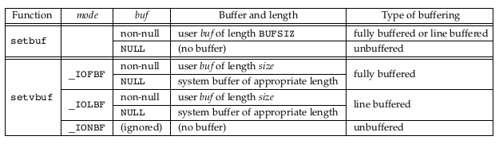
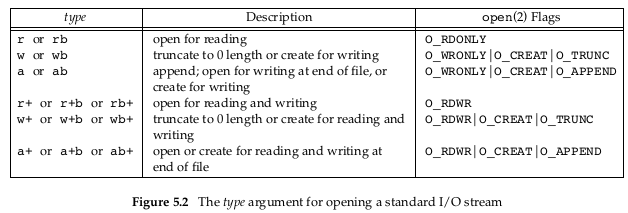
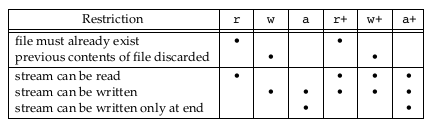
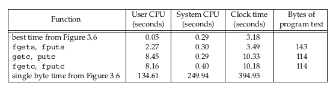
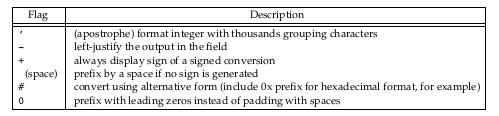
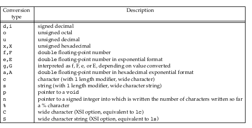
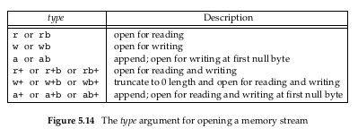

- [Standard I/O Library](#standard-io-library)
  - [5.1 Indroduction](#51-indroduction)
  - [5.2 Streams and ```FILE``` Objects](#52-streams-and-file-objects)
  - [5.3 Standard Input, Standard Output, and Standard Error](#53-standard-input-standard-output-and-standard-error)
  - [5.4 Buffering](#54-buffering)
  - [5.5 Opening a Stream](#55-opening-a-stream)
  - [5.6 Reading and Writing a Stream](#56-reading-and-writing-a-stream)
    - [Input Functions](#input-functions)
    - [Output Functions](#output-functions)
  - [5.7 Lint-at-a-Time I/O](#57-lint-at-a-time-io)
  - [5.8 Standard I/O Efficiency](#58-standard-io-efficiency)
  - [5.9 Binary I/O](#59-binary-io)
  - [5.10 Positioning a Stream](#510-positioning-a-stream)
  - [5.11 Formatted I/O](#511-formatted-io)
  - [5.12 Implementation Details](#512-implementation-details)
  - [5.13 Temporary Files](#513-temporary-files)
  - [5.14 Memory Streams](#514-memory-streams)
  - [5.15 Alternatives to standard I/O](#515-alternatives-to-standard-io)


# Standard I/O Library

## 5.1 Indroduction

이 챕터에선 ```표준 I/O 라이브러리```(귀찮으니 ```표준 라이브러리```, ```표준 I/O``` 로도 쓰겠다.)에 대해 학습한다. 이 ```표준 라이브러리```는 UNIX 어쩌고가 아닌, ISO 에서 표준화를 했다. 왜냐면, 수 없이 많은 OS 벤더들이 개발을 했기 때문.

```표준 라이브러리```는 I/O에서 사용할 버퍼 할당 및 I/O 사용시 최적화된 chunk 크기로 사용된다.

이를 통해 적절한 block 크기 (3장에서 도표로 나왔던 I/O 버퍼 크기 별 속도차이) 등을 OS 벤더 별로 걱정할 필요가 없다.

다만, ```표준 라이브러리``` 내 함수들에서 정확하게 뭘 하는지 모르면 문제가 발생할 수 있음!

## 5.2 Streams and ```FILE``` Objects

3장에선 모든걸 ```fd(file descriptor)``` 로 수행했다. ```open()```에 플래그를 주어 파일을 열고, 해당 파일에 대해 ```read(int fd)```, ```write(int fd)```를 수행하여 파일을 조작한다.

하지만 ```표준 라이브러리```에선 ```Stream``` 으로 관리한다.

```Stream``` 은 ```Single Byte Orientation``` 으로도 쓸 수 있고, ```Multi Byte Orientation```으로도 쓸 수 있다.

처음 ```Stream```을 생성했을 땐 아무런 ```Byte Orientation``` 이 정해지지 않는데, Byte 관련 함수를 사용하면 자동으로 ```Orientation```이 정해진다.

오직 두 가지 함수만 이미 정해진 ```Orientation```을 변경할 수 있다.
* ```freopen(const char *restrict pathname, const char *restrict mode, FILE *restrict stream)```
  * ```Stream``` 상에 있는 데이터를 우선 ```fflush``` 하고, ```Stream``` 과 관련된 ```fd``` 를 닫으려고 시도할 것이다.
  * 그리고 다시 ```Stream```을 연다.
  * [Linux man](https://man7.org/linux/man-pages/man3/freopen.3p.html)
* ```fwide(FILE *stream, int mode)```
  * ```Stream```에 대한 ```byte orientation```을 결정하는 함수.
  * ```mode``` < 0 일 땐, byte oriented로 ```Stream```을 변경
  * ```mode``` > 0 일 땐, wide oriented로 ```Stream```변경
  * ```mode``` = 0 이면, 아무 것도 하지않지만, Stream의 orientation을 리턴하긴 한다.
  * [Linux man](https://man7.org/linux/man-pages/man3/fwide.3.html)

코드
```c
#include <stdio.h>
#include <wchar.h>

int main(void) {
    FILE *fp;

    fp = fopen("asdfasdf", "w");
    fprintf(fp, "hihihi\n");
    printf("fwide: %d\n", fwide(fp, 0));
    fclose(fp);

    return 0;
}
```

출력
```bash
[22:49:35] [gyujin_choi] [/hdd/GraphicsStudy/APUE/5/code]
> ./a.out
fwide: -1
```

```fwide()```는 이미 oriented된 ```Stream``` 에 대해선 변경하지 못한다. 또한 에러 리턴이 없기 때문에, ```Stream```이 가용상태인지 확인해야 한다.

이를 위해선 ```fwide()``` 호출 전/후로 errno를 깔아놓고 에러발생여부를 판단해야 한다.(..)

이 부분 이후론 모두 ```byte-oriended```로 설명할꺼니까 그런줄 알아라.

또한 이후에 나오는 ```fopen``` 을통해 ```FILE``` Object를 받게되는데, 이 구조체는 ```Stream```을 다루기 위해 표준 I/O에 필요한 모든 정보들을 가지고 있다. 또한 이 객체 내부 정보를 반드시 알 필요는 없을 것이다. 이미 필요한 것들은 함수로 다 구현이 되어있다.

```c
// 리눅스 기준
typedef struct _IO_FILE FILE;

struct _IO_FILE {
  int _flags;		/* High-order word is _IO_MAGIC; rest is flags. */
#define _IO_file_flags _flags

  /* The following pointers correspond to the C++ streambuf protocol. */
  /* Note:  Tk uses the _IO_read_ptr and _IO_read_end fields directly. */
  char* _IO_read_ptr;	/* Current read pointer */
  char* _IO_read_end;	/* End of get area. */
  char* _IO_read_base;	/* Start of putback+get area. */
  char* _IO_write_base;	/* Start of put area. */
  char* _IO_write_ptr;	/* Current put pointer. */
  char* _IO_write_end;	/* End of put area. */
  char* _IO_buf_base;	/* Start of reserve area. */
  char* _IO_buf_end;	/* End of reserve area. */
  /* The following fields are used to support backing up and undo. */
  char *_IO_save_base; /* Pointer to start of non-current get area. */
  char *_IO_backup_base;  /* Pointer to first valid character of backup area */
  char *_IO_save_end; /* Pointer to end of non-current get area. */

  struct _IO_marker *_markers;

  struct _IO_FILE *_chain;

  int _fileno;
#if 0
  int _blksize;
#else
  int _flags2;
#endif
  _IO_off_t _old_offset; /* This used to be _offset but it's too small.  */

#define __HAVE_COLUMN /* temporary */
  /* 1+column number of pbase(); 0 is unknown. */
  unsigned short _cur_column;
  signed char _vtable_offset;
  char _shortbuf[1];

  /*  char* _save_gptr;  char* _save_egptr; */

  _IO_lock_t *_lock;
#ifdef _IO_USE_OLD_IO_FILE
};
```

OS 벤더마다 차이는 있겠지만 ```typedef```로 알아서 표준화를 다 해놨고, 다른 표준 라이브러리 함수들도 마찬가지다.

따라서 표준 I/O 함수 사용 시 ```FILE``` 구조체 포인터만 잘 넘기면 된다. 이를 파일 포인터처럼 생각하면 더 좋다.

## 5.3 Standard Input, Standard Output, and Standard Error

3.2장에서 언급했던 ```stdin```, ```stdout```, ```stderr```에 대응되는 스트림들은 이미 predefine 되어있다.

* ```STDIN_FILENO```
* ```STDOUT_FILENO```
* ```STDERR_FILENO```

얘네는 ```stdio.h```에 정의되어 있다.

## 5.4 Buffering

표준 I/O에서의 버퍼링은 ```read``` / ```write``` 수를 최대한 줄이는 데에 목적이 있다. 3장에서 봤다시피, I/O 횟수는 적절한 버퍼크기 내에서 최소한으로 호출하는게 성능이 가장 좋기 때문.

또한 개발자는 표준 I/O를 쓸 경우 이 버퍼 크기를 설정하는 데에 있어 신경스지 않아도 된다는 장점이 있지만, 반대로 이 버퍼링 때문에 많은 혼동이 야기된다.

1. ```Fully Buffered```

이 경우, 실제 I/O는 표준 I/O 내 버퍼가 가득 찼을 때만 사용된다. 디스크 내의 파일은 표준 I/O함수에 의해 완전히 버퍼된다 (메모리로 올라온다). 표준 I/O의 버퍼는 ```malloc``` (7.8) 으로 할당되고, ```Stream``` 내에서 사용된다.

```flush``` 라는 용어는 표준 I/O 버퍼의 내용에 대한 **쓰기** 명령이다. 버퍼 내용을 강제로 쓰는 표준 함수도 있다. (```fflush```).

유닉스에선 ```flush``` 가 두 가지 의미로 쓰이는데, 하나는 얘기한 표준 I/O이고, 다른 하나는 ```tcflush``` (18장)라고, 터미널 드라이버 관점에서 버퍼에 저장된 데이터에 대한 폐기 명령이다.

> **터미널 디바이스 / 터미널 드라이버?**
>
> 마우스 / 키보드처럼 사용자<->컴퓨터 간 정보교환을 도와주는 놈들이라 보면 된다.


2. ```Line Buffered```

이 경우, 표준 I/O는 ```\n``` 문자의 여부에 따라 실제 I/O를 수행한다. 이를 통해 ```fputc``` 같은 한글자만 내뱉기 같은 동작을 수행할 수 있다. 왜냐면, 실제 I/O는 어차피 개행문자에 따라 발생한다는걸 알기 때문에 글자단위로 메모리에 데이터를 미리 올려 놓을 수 있다. (혹은 한 글자만 실제 파일에 남길 수도 있고..)

라인 버퍼링은 터미널에서도 자주 쓰인다. 보통 터미널 명령은 한 줄 단위로 수행되고 개행문자 (Enter) 입력 시 입력 끝으로 생각하기 때문이다.

라인 버퍼링을 사용할 땐, 두 가지 주의사항이 있다.

하나는 Buffer 크기가 이미 표준 라이브러리 상에서 정해져 있기 때문에, 개행문자가 없어도 버퍼가 가득차면 지혼자 I/O를 수행할 수 있다는 점이다.

두 번째는 뒤에 나올 Unbufferd 형태나 Line Buffered 형태로 표준 I/O를 통해 input(read) 요청이 오면, 라인 버퍼링된 데이터들을 모두 flush한다.

다만, write하려는 데이터가 이미 write buffer 내에 존재한다면 커널로부터 데이터를 요청할 필요가 없다.

3. ```Unbuffered```

아무런 데이터도 버퍼링을 하지 않고, 요청오는 데이터를 바로 커널로 넘겨 I/O를 수행한다. ```write``` 랑 비슷하다. 당연히 개행 여부도 확인할 필요가 없으며, 혹시라도 시스템콜 사용에 에러가 있을 경우 곧바로 에러를 리턴받을 수 있다는 장점이 있다.


ISO C에서 표준 입출력 fd에 대해 다음의 특징을 기술한다.
* STDIN/STDOUT을 위한 버퍼는 다른 장치를 참조하지 않는이상 fully buffered이다. (리다이렉션/터미널 디바이스를 의미하는 듯)
* STDERR는 결코 fully buffered 되지않는다.

다만 기술된 내용엔 다음 내용이 없다.
* 리다이렉션 된 STDIN/STDOUT이 * 실제로 line buffered되는지 unbuffered 되는 지
* STDERR가 line buffered여야 하는지 unbuffered여야 하는지

대부분의 Default 동작은 아래와 같다.
* STDERR는 unbuffered이다.
* STDIN/STDOUT은 터미널 디바이스의 경우 보통 line buffered이며, 그 외의 경우엔 Fully Buffered이다.

기본 동작이 맘에 안들면 아래 두 함수로 변경가능
```c
#include <stdio.h>
/**
 * setbuf는 버퍼링 켜고 끄는거에만 사용됨
 * buf가 stdio.h에 정의된 BUFSIZ 크기만큼 할당된 버퍼여야함. NULL 때리면 Unbuffered임.
 * 터미널 디바이스같은게 아니면 알아서 Fully buffered가 될거다.
*/
void setbuf(FILE *restrict fp, char *restrict buf );

/**
 * 얘는 _IOFBF / _IOLBF /_IONBF 세개로 버퍼링 타입까지 정해줄 수 있다.
 * buf에 NULL 때려도 모드 넣고가는거라 알아서 buffer할당까지 해버린다.
 * 물론 모드를 _IONBF로 하면 다 무시될거다.
 */
int setvbuf(FILE *restrict fp, char *restrict buf, int mode, size_t size);

// Returns: 0 if OK, nonzero on error
```
얘내들은 ```FILE```포인터를 필요로 하기 때문에 반드시 ```Stream``` 이 Open된 이후에 사용되어야 한다.

표로 정리하면 아래와 같다



7장에서 얘기하겠지만, 만약 우리가 buffer를 표준 I/O의 자동할당에 맡겼다면, 반드시 ```close```를 해야한다.

또한 일부 케이스의 경우 버퍼의 일부분을 내부적으로 다른곳에 사용하기 때문에, 버퍼 크기보다 더 작은양만 실제 데이터에 사용될 수도 있다. 따라서 시스템이 자동으로 버퍼를 할당하게 내비둬야 한다.

이렇게 하면 ```close```할때도 알아서 ```flush```를 자동으로 해준다.

추가로 ```fflush(NULL)``` 때리면 저장된 모든 FILE*에 대한 flush를 수행한다 카더라

## 5.5 Opening a Stream

```Stream``` 으로 파일을 여는건 종류가 3가지 나온다.


```c
#include <stdio.h>
/**
 * 1. path에 적힌 특정 파일을 여는 데에 사용된다. return은 FILE*
 */
FILE *fopen(const char *restrict pathname, const char *restrict type);

/**
 * 2. 앞서 나온 reopen이다. close를 자동으로 수행하고, 당연히 자동 flush도 된다.
 * byte orientation도 초기화 되고, fopen을 수행한다.
 * 주로 STDIO/ERR에 사용된다고 한다.
 */
FILE *freopen(const char *restrict pathname, const char *restrict type, FILE *restrict fp);

/**
 * 3. fd를 가지고서 FILE*를 만들 때 사용한다.
 * 소켓 / 파이프 등에 사용된다.
 */
FILE *fdopen(int fd, const char *type);
```

* fdopen 예시 (5_2.c 참고)

결과는 아래와 같다.
```bash

########### PARENT_DEFAULT
# 타이밍이 맞으면 1번에 2개씩 출력한다.
# 파이프 버퍼에 쌓인걸 읽는 시점에 쓰기가 성공을 리턴받고 곧바로 쓰면, 아마 2개 동시에 읽는 듯.
recved data[0]: DATA[0]
recved data[1]: DATA[1]
recved data[2]: DATA[2]
recved data[3]: DATA[3]
recved data[4]: DATA[4]
recved data[5]: DATA[5]
recved data[6]: DATA[6]
recved data[7]: DATA[7]
recved data[8]: DATA[8]
recved data[9]: DATA[9]
recved data[10]: DATA[10]
recved data[11]: DATA[11]
recved data[12]: DATA[12]
recved data[13]: DATA[13]
recved data[14]: DATA[14]
recved data[15]: DATA[15]
recved data[16]: DATA[16]
recved data[17]: DATA[17]
recved data[18]: DATA[18]
recved data[19]: DATA[19]
recved disconnected, Success

########### PARENT_FDOPEN
# fscanf 의 리턴은 바이트 수를 리턴하는게 아니라, 한 번에 읽어들인 데이터 횟수? 와 같은거라
# write처리에 대해 동기로 동작한다 해도 표준 I/O 내부 버퍼에 들어온 순간 이미 성공처리가 되고
# write는 대기없이 계속 올라간다. fscanf도 그냥 1트에 다 성공해버린다. 메모리로 이미 다 올라와 있기 때문
# 근데 개행넣으면 알아서 잘 잘려서 출력한다. (지혼자 line buffering 처리 하는듯.)
./a.out
recved data[0]: [DATA[0]DATA[1]DATA[2]DATA[3]DATA[4]DATA[5]DATA[6]DATA[7]DATA[8]DATA[9]DATA[10]DATA[11]DATA[12]DATA[13]DATA[14]DATA[15]DATA[16]DATA[17]DATA[18]DATA[19]]
recved error, Success
```

fopen 시리즈엔 ```char *restict type``` 가 꼭 들어가는걸 알 수 있다. ISO C에선 이 타입에 대해 총 15가지 값들을 제공한다.



그냥 설명 대충 보면 뭔말인지 알 수 있다.

```fdopen```은 살짝 다르게 동작하는데, ```open```이라는게 이미 수행된 뒤라, ```O_TRUNC``` 같은건 동작하지 않음. 마찬가지로 ```O_CREATE``` 도.

파일이 일단 열렸다면 ```write``` 관련 동작은 ```EOF``` 다음부터 진행된다.

여러 프로세스로 파일에 write를 해도 이전에 봤던 ```O_APPEND```모드 에 대한 시스템콜의 직렬화 덕분에 크게 문제 없이 ```write```이 동작한다.


파일이 열렸다면 두 가지 제약이 존재한다.
* Output(쓰기)은 ```fflush```, ```fseek```, ```fsetpos```, ```rewind``` 동작 없이 바로 사용될 수 없다.
* Input(읽기)는 ```fseek```, ```fsetpos```, ```rewind``` 동작 없이 EOF에서 바로 사용될 수 없다.

버퍼에 대해 가리키는 위치를 조정하고 사용가능하다는 뜻인 것 같다. 위에 ```FILE*```  보면 이를 위한 ```position``` 관련 포인터들이 정의되어있던걸 기억하자.

일반적인 제약은 아래와 같다.



지정한 type 별로 제약사항이라 보면 된다.

이미 쓰기를(w/a)위해 파일을 생성했다면, 파일 엑세스 권한비트들을 바꿀 수 없다. 이건 3장에 나온 비트를 위해 시스템콜로 처리해야 한다.

다만 4장에 나온 ```umask```로 열기 이후에 변경할 수 있다.

```Stream```은 기본적으로 ```fully buffered``` 로 열릴 것이다. ```Stream``` 이 열리면, ```setbuf```/```setvbuf```로 버퍼링 옵션 변경이 가능하다.

```Stream``` 은 ```fclose``` 로 닫힌다.

닫힐 때 flush가 자동으로 돌아간다. ```input data``` 는 아쉽게 버려진다. (쓸 놈이 닫아버리니 쩔수임)

프로세스 종료를 해도 알아서 flush가 돈다 (```fd```도 ```close```가 자동으로 일어나니, ```fclose```도 마찬가지인 셈.)

## 5.6 Reading and Writing a Stream

```Stream``` 을 열면, 포맷팅 되지 않은 I/O에 대해 3가지 타입을 선택할 수 있다.

1. Character at a time

```fgetc``` / ```fputc```로 사용된다.

1개의 ```char``` 데이터에 대해 읽고쓰기가 가능하다.

2. Line at a time

```fgets``` / ```fputs```로 사용된다.

개행문자로 구분되는 데이터들에 대해 읽고쓰기가 가능하다. 최대 크기를 설정해야 하는데, 이건 5.7에서 본다.

3. Direct I/O

```fread``` / ```fwrite``` 로 사용된다.

지정한 객체의 크기만큼 데이터를 읽고쓸 수 있다. 시스템콜의 ```read```/```write``` 대체품이라 생각하면 된다. 5.9장에서 더 보도록 한다.

### Input Functions

```c
#include <stdio.h>
int getc(FILE *fp);
int fgetc(FILE *fp);
int getchar(void);
```

```getchar``` 는 ```getc(stdin)``` 의 매크로라고 보면 된다.

```c
// 리눅스 기준
/* Read a character from stdin.  */
__STDIO_INLINE int
getchar (void)
{
  return _IO_getc (stdin);
}
```

```fgetc``` 와 ```getc``` 의 차이만 알면 되는데, 두 차이는 매크로로 사용될 수 있냐의 차이가 있다.

이는 다음을 시사한다.

1. ```getc``` 는 매개변수가 될 수 없다. 매크로가 될 수 있다는 말은 실체가 없이 inline될 수 있다는 뜻이고, 그 자체로 expression이라는 의미로 보임. 따라서 컴파일 타임에 2회이상 연역되는 동작을 막아야 함.
2. ```fgetc``` 얘는 함수라는게 반드시 보장됨. 따라서 마구마구 써도 된다.
3. ```fgetc```가 살~짝 오래걸린다. 함수 실체가 반드시 있어야 하기 때문에 포인터 이동시간이 소요.

```c
// 5_3.c
#include <stdio.h>

int main(void) {
    // char c = getc(stdin);
    // printf("%c\n", c);

    printf("address of getc:\t%p\n", getc);
    printf("address of fgetc:\t%p\n", fgetc);

    FILE *fp = fopen("5_3.c", "r'");
    printf("%c\n", fgetc(fp));
    return 0;
}
```

돌려본 결과 (O3로 컴파일해도 동일, getc랑 차이를 더더욱 모르겠다..)
```bash
> ./a.out
address of getc:        0x400500
address of fgetc:       0x4004d0
#
```

또한 위 세 함수 리턴은 반드시 ```unsigned int```이다. 에러처리 및 EOF를 위해 음수가 사용된다.
 높은 차수의 비트가 설정되어 있을 때도 반환값이 음수가 되지 않게하려고 사용한다고 한다. (아마 multi-byte 같은걸 고려한 것도 있을 듯)

에러 발생 시 아래 함수를 사용할 수 있다. 둘 다 똑같다.
```c
#include <stdio.h>
// Both return: nonzero (true) if condition is true, 0 (false) otherwise
int ferror(FILE *fp);
int feof(FILE *fp);

// clear err
void clearerr(FILE *fp);
```

또한 ```FILE``` 에는 에러/EOF 비트가 각자 존재한다. 이 비트들도 ```clearerr``` 로 날아간다.

```fgetc```로 읽고 나서 다시 이를 반환할 수 있다.
```c
#include <stdio.h>
int ungetc(int c, FILE *fp);
```

반환하려는 *c*는 반드시 읽어온 놈과 같을 필요 없다. 참고로 ```EOF```는 ```ungetc```의 대상이 될 수 없다. 다음 ```read``` 때 해당 캐릭터가 들어오게 되며, 이후에 들어오는 ```EOF```도 정상동작한다.

이런 동작이 있는 이유는 ```Stream``` 에 대해 토큰을 추가하는 동작 등에 사용된다. 특정 character를 어떻게 처리할 지 정하고, 처리방법과 관련된 데이터를 다시 밀어넣어 보내는 형식인듯 하다.

이런 기능이 없었다면 이런 비트를 따로 저장해놓고 해당 데이터까지 같이 넘겨서 처리하도록 조치해야만 한다.

### Output Functions

```c
#include <stdio.h>
int putc(int c, FILE *fp);
int fputc(int c, FILE *fp);
int putchar(int c); // smae as putc(int c, stdout);
```

## 5.7 Lint-at-a-Time I/O

라인 단위로 읽는 함수들을 알아본다.

```c
#include <stdio.h>
char *fgets(char *restrict buf, int n, FILE *restrict fp);
char *gets(char *buf );
// Both return: non-negative value if OK, EOF on error
```

둘 다 ```Stream``` 으로부터 읽어들일 버퍼가 존재한다.

```gets``` 는 STDIN으로부터 데이터를 읽고, ```fgets``` 는 ```Stream``` 지정이 가능하다는 차이가 있다.

* ```fgets``` 의 특징
  * 데이터 갯수 *n* 을 지정할 수 있다.
  * 개행문자 ```'\n'``` 까지 포함해서 읽어들인다.
  * 읽어들일 문자의 최대 수는 *n-1* 개를 넘을 수 없다.
  * 남는 1개 공간엔 반드시 ```null-termination``` 된다.
  * 버퍼보다 ```Stream``` 한 line이 커도 *n-1* 개를 읽고 ```null-termination``` 된다.

* ```gets``` 는 쓰지마라!
  * 버퍼 사이즈를 지정할 수 없어서 오버플로우가 난다.
  * 메모리에 무슨 일이일어나던 상관없이 걍 다써버린다.
  * 또한 개행문자를 포함시키지 않는다. 정의와 맞지않다.

ISO C에서 ```gets```를 위한 어떤 조치를 해줬어도 걍 ```fgets```써라.

라인 단위로 쓰는 함수들을 알아본다.

```c
#include <stdio.h>
int fputs(const char *restrict str, FILE *restrict fp);
int puts(const char *str);
// Both return: non-negative value if OK, EOF on error
```

* fputs
  * ```null-termination``` 처리가 된 *str* 을 사용해야 한다.
  * 개행을 자동으로 붙이진 않는다.

* puts
  * STDOUT에다만 갈긴다.
  * 자동으로 개행문자를 붙여준다.
  * 근데 얘도 헷갈리니까 쓰지마라..

```c
// 5_4.c
#include <stdio.h>

int main(void) {
    FILE *fp = fopen("5_4_out", "w");
    fputs("String1", fp);
    fputs("String2", fp);
    fputs("String3", fp);

    puts("String1");
    puts("String2");
    puts("String3");

    fclose(fp);
    return 0;
}
```
output
```bash
[04:21:45] [gyujin_choi] [/hdd/GraphicsStudy/APUE/5/code]
> ./a.out
String1
String2
String3
[04:21:47] [gyujin_choi] [/hdd/GraphicsStudy/APUE/5/code]
> cat 5_4_out
String1String2String3[04:22:20] [gyujin_choi] [/hdd/GraphicsStudy/APUE/5/code]
```

## 5.8 Standard I/O Efficiency

3장에서 본 코드의 표준I/O 버전은 아래와 같다. (getc버전은 생략)
```c
#include "apue.h"
int
main(void)
{
  char buf[MAXLINE];
  while (fgets(buf, MAXLINE, stdin) != NULL)
    if (fputs(buf, stdout) == EOF)
      err_sys("output error");

  if (ferror(stdin))
    err_sys("input error");
  exit(0);
}
```

자동 flush가 되니 close도 따로 안해도 된다. 시스템콜은 애초에 버퍼가 없으니 걍 종료시점에 fd닫히는거만 자동으로 되면 됨.

시간 비교하면 아래 표와 같다.



포인트만 집고 넘어가자.

* 표준 I/O의 UserCPU 시간이 시스템콜 Best 버전보다 대부분 크다.
  * 일단 getc류들은 루프 수가 많아 애초에 Clock Time이 클 수밖에 없다.
  * gets류는 아마 표준I/O 내에서 처리되는 여러 다른 오퍼레이션 때문인듯
  * 추가로 내부 버퍼에서 내 실제 코드로 카피하는 동작도 필요하니까 느리다.
* SystemCPU 시간은 엇비슷하다.
  * 표준 I/O를 쓰는 큰 이유라고 할 수 있다.
  * 사용자가 getc류를 쓰던 gets를 쓰던, 커널로 요청하는 실제 시스템콜 횟수가 최적화된다.
  * 따라서 비슷하다.
* Bytes of program text가 getc/fgetc가 동일하다.
  * 앞서 언급했듯이 getc는 매크로처럼 동작하기도 해서, 실제 C 컴파일러 내부에선 동일하게 처리될 수 있다.
* fgets가 왜 fgetc보다 빨랐을까
  * fgets는 여러 fgetc로 동작하는게 아니라 memccpy라는 함수 콜로 처리된다.
  * 따라서 길이가 필요한듯?

이 결과는 당연히 모든 벤더에서 같을 수 없다. 하지만 요런거 하나 알아두고 시간차이가 날 포인트들을 알면, 시스템 이해에 큰 도움이 된다.

물론 UserCPU시간이 쪼~금 느리긴 한데, 대부분은 개발자 실수때문에 UserCPU가 느려지지 얘땜에 느려지진 않는다. 그니까 필요하면 걍 써라.

## 5.9 Binary I/O

만약 바이트 어레이 전체를 읽고 쓰고 싶을때 지금까지 본대로면 fgetc/fputc를 루프때려야 한다. 근데 이건 근데 앞에서 봤다시피 속도가 느리다.

fgets/fputs도 곤란하다. 왜냐면 구조체 데이터 dump같은걸 할 때 구조체 안에있는 Null을 쓸 수가 없기 때문이다.

따라서 다음 두 함수를 사용한다.

```c
#include <stdio.h>
size_t fread(void *restrict ptr, size_t size, size_t nobj, FILE *restrict fp);
size_t fwrite(const void *restrict ptr, size_t size, size_t nobj, FILE *restrict fp);
// Both return: number of objects read or written
```

```size```를 명시한걸 알 수있는데, 이건 OpenGL의 ```stride```같은거다 예시가 구조체 dump라 이렇게 쓰면 매우 유용하게 쓸 수 있다는걸 알 수 있다.

```c
struct {
  short count;
  long
  total;
  char
  name[NAMESIZE];
} item;

if (fwrite(&item, sizeof(item), 1, fp) != 1)
  err_sys("fwrite error")
```

다만 fread/fwrite를 막 쓰면 안되는데,

옛날에 vulkan할때였나 잠깐 나왔는데, 구조체는 4바이트의 배수로 정렬이 되는 특징이 있다. char만있으면 1바이트 정렬일 때도 있긴한데, 아무튼 이건 최적화 때문에 컴파일러가 크기계산을 알아서 해버린다.

이렇게 되면 OS 혹은 컴파일러 별로 포맷이 다 다를 수가 있다. 따라서 막 쓰지 말어라.

요런걸 해결하는 문제가 16장에 잠시 언급된다.

## 5.10 Positioning a Stream

```Stream``` 에 대해 포지셔닝하는건 3가지 방법이 있다.

1. ftell / fseek
   * Version 7부터 나옴 (ISO C 얘기인듯)
   * 파일 offset을 long(4바이트)로 보는 매우 질나쁜 놈
2. ftello / fseeko
   * long을 ```off_t``` 로 바꾼 친구
3. fgetpos / fsetpos
   * ```fpos_t``` 를 사용하는 친구, 얘가 파일 위치를 기억함
   * 크기제한 없이 쭉쭉커질 수 있음.

```c
#include <stdio.h>
long ftell(FILE *fp);
// Returns: current file position indicator if OK, −1L on error

int fseek(FILE *fp, long offset, int whence);
// Returns: 0 if OK, −1 on error
// whence는 lseek에서 사용한거랑 동일
//       SEEK_SET
//              The file offset is set to offset bytes.
//
//       SEEK_CUR
//              The file offset is set to its current location plus offset
//              bytes.
//
//       SEEK_END
//              The file offset is set to the size of the file plus offset
//              bytes.
void rewind(FILE *fp);
// SEEK_CUR
```
텍스트 파일의 경우 파일의 현재 위치는 측정하기가 어렵다. 특히 UNIX가 아닌 시스템에선 파일을 다른 형식으로 저장할 수 있기 때문. 따라서 텍스트 파일은 0이나 ftell 리턴값으로만 지정이 가능하다.

```ftello/fseeko```는 변수 타입의 크기만 확장시킨거고

```fgetpos/fsetpos``` 는 여기서 더 확장시켜 나온 ISO C의 표준이다.

## 5.11 Formatted I/O

포맷팅을 허용해주는 ```Stream``` 관련 ```printf``` 함수는 아래와 같다.
```c
#include <stdio.h>
int printf(const char *restrict format, ...);

int fprintf(FILE *restrict fp, const char *restrict format, ...);

int dprintf(int fd, const char *restrict format, ...);
// All three return: number of characters output if OK, negative value if output error

int sprintf(char *restrict buf, const char *restrict format, ...);
// Returns: number of characters stored in array if OK, negative value if encoding error

int snprintf(char *restrict buf, size_t n, const char *restrict format, ...);
// Returns: number of characters that would have been stored in array
// if buffer was large enough, negative value if encoding error
```

볼만한게 몇가지 있다.

* dprintf는 fd에 바로 포매팅된 놈을 쓴다는 것
  * 얘를 쓰면 fdopen같은 이상한 짓 안해도된다
* sprintf는 버퍼로 데이터를 쓰는건데, 길이 제한이 없어서 위험
  * snprintf가 나오게 된 배경
  * snprintf는 버퍼 크기를 명시적으로 지정해야 한다.
  * 오류 발생 시 둘다 음수 리턴.

포맷에 사용되는 형태는 아래와 같음

```
%[flags][fldwidth][precision][lenmodifier]convtype
```

*flags* 관련된건 아래 그림 참조



*fldwidth* 는 최소 필드폭을 지정한다. 더 적은 문자가 들어오면 공란으로 채워진다. 필드 폭은 음이아닌 Decimal이어야 하고, *가 될 수 있다.

*precision* 은 부동소수점에서 사용되는 그거다. (.) 다음에 나온다.

```c
#include <stdio.h>

int main(void) {
    int width = 3;
    int value = 5;
    float fvalue = 1234.3413241f;
    printf("%*d, width, value\n", width, value);
    printf("%*.*f, width, value\n", width, width, fvalue);
    return 0;
}
```

output은 아래와 같다.
```bash
> ./a.out
  5, width, value
1234.341, width, value
```

*lenmodifier* 는 자료형과 상관없이 길이에 대한 값이다. float을 double로 변환하거나, Decimal들을 ```lld``` 같이 표현해서 더 큰 숫자로 표현할 수 있다.

*convtype*은 실제 출력할 자료형의 타입이다.



그렇다면 위에나온 ***...*** 는 어떻게 쓰이는걸까? 아래와 같이 ```va_list``` 로 변환되고, 함수 이름 앞에 v가 붙는 형식으로 정의되어있다.

```c
include <stdarg.h>
#include <stdio.h>
int vprintf(const char *restrict format, va_list arg);
int vfprintf(FILE *restrict fp, const char *restrict format, va_list arg);
int vdprintf(int fd, const char *restrict format, va_list arg);
// All three return: number of characters output if OK, negative value if output error
int vsprintf(char *restrict buf, const char *restrict format, va_list arg);
// Returns: number of characters stored in array if OK, negative value if encoding error
int vsnprintf(char *restrict buf, size_t n, const char *restrict format, va_list arg);
// Returns: number of characters that would have been stored in array

// if buffer was large enough, negative value if encoding error
```

```va_list``` 의 갯수만큼 돌면서 ```format``` 에 맞게 넣어준다 보면 된다.

입력은 비슷하니 생략하겠다.

## 5.12 Implementation Details

표준 I/O도 결국 시스템콜로 만들어놓은 표준 함수셋이다. 당연히 fd를 가져올 수 있다.

```c
#include <stdio.h>
int fileno(FILE *fp);
// Returns: the file descriptor associated with the stream
```

우리가 ```dup```으로 fd들을 복제하거나, ```fcntl``` 로 ```O_NONBLOCK``` 같이 필수적인 플래그를 설정할 필요가 있을 때 사용할 수 있다.

추가로 5_6.c 파일을 실행시키면 아래와 같은 결과를 얻을 수 있다.

```bash
> ./a.out
enter any character
a
one line to standard error
stream = stdin, line buffered, buffer size = 1024
stream = stdout, line buffered, buffer size = 1024
stream = stderr, unbuffered, buffer size = 1
stream = /etc/passwd, fully buffered, buffer size = 4096
```

STDIN/STDOUT/STDERR 에 대한 리다이렉션 없이 처리하면 위와같이 ```terminal device``` 처리가 되어 알아서 line buffered가 됨을 볼 수 있고, 명령어를 수정하면 아래와 같다.

```bash
> cat std.out
enter any character
stream = stdin, fully buffered, buffer size = 4096
stream = stdout, fully buffered, buffer size = 4096
stream = stderr, unbuffered, buffer size = 1
stream = /etc/passwd, fully buffered, buffer size = 4096
[05:58:49] [gyujin_choi] [/hdd/GraphicsStudy/APUE/5/code]
> cat std.err
one line to standard error
```

STDIN/STDOUT/STDERR 에 파일이 리다이렉션 되었으므로, ```terminal device```가 아니게 되어 버퍼 크기 및 버퍼링 모드가 변경됨을 확인할 수 있다.

또한 STDERR는 앞서 말한대로 unbuffered임이 변경되지 않는다.

## 5.13 Temporary Files

표준 I/O에선 임시파일 생성을 돕기 위한 두 함수가 제공된다.

```c
#include <stdio.h>
char *tmpnam(char *ptr);
// Returns: pointer to unique pathname
FILE *tmpfile(void);
// Returns: file pointer if OK, NULL on error
```

* ```tmpnam```
  * 존재하는 어떤 파일과도 매칭되지 않는 ```/tmp``` 경로의 유니크한 파일이름을 제공해준다.
  * ```TMP_MAX```갯수 까진 생성을 보장한다.
  * *ptr*에 ```NULL``` 을 넣으면 라이브러리 내에 정의된 static 영역의 변수로 ```pathName```을 생성.
  * static 영역 변수에 대한 포인터가 리턴된다.

* ```tmpfile```
  * static 영역의 포인터를 써서 ```wb+``` 로 열리게 되고, 프로그램 종료시 자동 삭제된다.

5_7.c
```c
#include <stdio.h>
#include <stdlib.h>

int main(void)
{
    char name[L_tmpnam], line[1024];
    FILE *fp;

    char *ptr = tmpnam(NULL);
    printf("tmpnam[%p]: %s\n", ptr, ptr); /* first temp name */
    tmpnam(name);
    printf("tmpnam[%p]: %s\n", ptr, name); /* first temp name */
    if ((fp = tmpfile()) == NULL)
        /* create temp file */
        fprintf(stderr, "tmpfile error");
    fputs("one line of output\n", fp); /* write to temp file */
    rewind(fp);
    /* then read it back */

    // sleep(10);
    if (fgets(line, sizeof(line), fp) == NULL)
        fprintf(stderr, "fgets error");
    fputs(line, stdout);
    /* print the line we wrote */


    char *val = mkdtemp("/tmp/asdfasdf");
    fprintf(stdout, "%p, %s\n", val, val);

    exit(0);
}
```

5_7.c의 결과
```bash
> ./a.out
tmpnam[0x7f7820201840]: /tmp/fileK5IfTS
tmpnam[0x7f7820201840]: /tmp/filelTTqFH
one line of output
(nil), (null)
```

+) async하게 실행하고 ```sudo cat```으로 파일 찍어봐도 존재하질 않는다. 외부에서 보이지도 않는듯?

다음 두 함수를 보자

```c
#include <stdlib.h>
char *mkdtemp(char *template);
  // Returns: pointer to directory name if OK, NULL on error
int mkstemp(char *template);
  // Returns: file descriptor if OK, −1 on error
```

* mkdtemp는 고유한 이름으로 디렉토리를 생성
  * 액세스 권한 RWX
* mkstemp는 일반파일을 생성
  * 액세스 권한: RW

추가로 위 표준 함수들은 단점이 있다. 생성 자체를 커널에서 하기 때문에, 파일이름이 다른 프로세스와 겹칠 수 있다. 직렬화가 되어있으면 중복방지를 알아서 해올텐데, 그렇지 않아서 이부분은 사용자가 보장해주어야 한다.


## 5.14 Memory Streams

표준 I/O의 장점/단점 사용법등을 살펴봤는데, 이를 동일하게 메모리에서도 사용하기 위해 관련된 표준 함수들이 제공된다.

이렇게 생성되는 메모리용 ```Stream```은 실제 파일을 생성하지 않고, 파일 ```Stream``` 으로 보이지만, 모든 입출력은 메모리의 버퍼로 바이트를 송/수신 함으로 이루어진다.

추가로 문자열을 조작하기에 좋은 여러 기능들이 제공된다.

```c
#include <stdio.h>
FILE *fmemopen(void *restrict buf, size_t size, const char *restrict type);
  // Returns: stream pointer if OK, NULL on error
```

* buf는 NULL이면 자동할당, 아니면 기존 버퍼를 사용한다.
* size는 버퍼의 크기이다. NULL을 넣어도 크기는 줘야한다.
* type은 아래 그림 참고



* ```append``` 로 열리면, 현재 파일위치는 버퍼 내 첫 ```NULL``` 위치로 지정된다.
  * ```NULL``` 없으면 끝바이트 다음위치로 지정
* ```append``` 가 아닌경우 버퍼 시작으로 위치됨.
* ```buf``` 를 ```NULL``` 로 해서 ```fmemopen```을 수행하면, 버퍼 할당 자체가 표준함수 내에서 일어남
  * 따라서 실제 저장된 주소값을 가져올 수가 없어서, 쓰기만 하고 다신 안읽을 목적으로 사용해야한다.
* 추가로 ```fclose```, ```fflush```, ```fseek```, ```fsetpos``` 를 쓰면, 널바이트가 써짐.

```c
#include <stdio.h>

#define BSZ 48
int main()
{
    FILE *fp;
    char buf[BSZ];
    memset(buf, 'a', BSZ-2);
    buf[BSZ-2] = '\0';
    buf[BSZ-1] = 'X';
    if ((fp = fmemopen(buf, BSZ, "w+")) == NULL)
        fprintf(stderr, "fmemopen failed");
    printf("initial buffer contents: %s\n", buf);
    fprintf(fp, "hello, world");
    printf("before flush: %s\n", buf);
    fflush(fp);
    printf("after fflush: %s\n", buf);
    printf("len of string in buf = %ld\n", (long)strlen(buf));
    memset(buf, 'b', BSZ-2);
    buf[BSZ-2] = '\0';
    buf[BSZ-1] = 'X';
    fprintf(fp, "hello, world");
    fseek(fp, 0, SEEK_SET);
    printf("after fseek: %s\n", buf);
    printf("len of string in buf = %ld\n", (long)strlen(buf));

    memset(buf, 'c', BSZ-2);
    buf[BSZ-2] = '\0';
    buf[BSZ-1] = 'X';
    fprintf(fp, "hello, world");
    fclose(fp);
    printf("after fclose: %s\n", buf);
    printf("len of string in buf = %ld\n", (long)strlen(buf));
    return(0);
}

```
결과는 아래와 같다.

```bash
> ./a.out
initial buffer contents:
before flush:
after fflush: hello, world
len of string in buf = 12
after fseek: bbbbbbbbbbbbhello, world
len of string in buf = 24
after fclose: hello, worldcccccccccccccccccccccccccccccccccc
len of string in buf = 46
```

이걸 보면 ```flush``` 마다 '\0'이 붙고있다는걸 알 수 있다.

이 때문에 스트림 내 버퍼의 크기는 우리가 작성한 데이터의 총량이 되게된다.

```c
#include <stdio.h>
FILE *open_memstream(char **bufp, size_t *sizep); // byte oriented

#include <wchar.h>
FILE *open_wmemstream(wchar_t **bufp, size_t *sizep); // wide oriented
  // Both return: stream pointer if OK, NULL on error
```

* 생성되는 스트림은 쓰기 전용이다.
* 버퍼 지정은 불가하지만, ```bufp```와 ```sizep``` 값을 이용하면 데이터에 접근할 수 있다.
* 스트림에 사용된 버퍼는 직접 해제해야 한다.
* 스트림에 바이트를 추가할 수록 커진다.

여기서 사용되는 ```bufp``` 는 말 그대로 버퍼 포인터로, 현재 ```Stream``` 에서 사용되는 버퍼의 커서? 라고 보면 된다.

데이터가 써질때마다 bufp가 올라간다고 보면 됨.

주의할 점은 버퍼의 실제 주소와 길이는 fclose/fflush 이후 부터 다음 fclose/fflush 호출 전까지만 유효하다. Null 때문인 것 같다.

또한 size 이상만큼의 데이터가 써지면 주소값이 바뀔 수도 있다. 재할당이 필요하기 때문.

메모리 스트림은 바이트 문자열을 생성하기에 적합하다. temp파일 없이 좀 더 빠르게 사용이 가능하다.

## 5.15 Alternatives to standard I/O

앞서 시스템콜봐 비교애서 UserCPU값이 높았던 것 처럼 표준 I/O는 완벽하진 않다. 큰 이유는 line단위 함수 사용 등에서 복사를 2회 진행해야 한다는 점이 있다.

이런걸 줄이려고 여러 라이브러리들이 있단 얘기가 쭉쭉 나온다.