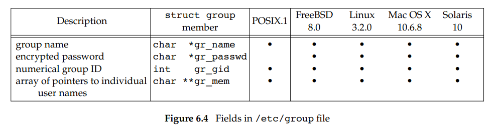

# 6.  시스템 자료 파일과 시스템 정보

## 6.1 소개

- 유닉스 시스템의 통상적인 운영에 여러 가지 파일이 요구되고, 특히 패스워드 파일, 그룹 파일은 여러 프로그램에 사용된다. 이번 장에서는 이런 자료 파일들에 대해 알아볼 것이다.


## 6.2 패스워드 파일

- UNIX 시스템의 패스워드 파일 필드


- 패스워드 파일은 /etc/passwd 에 ASCII 로 저장

- /etc/passwd 파일 예시 
```
root:x:0:0:root:/root:/bin/bash
squid:x:23:23::/var/spool/squid:/dev/null
nobody:x:65534:65534:Nobody:/home:/bin/sh
sar:x:205:105:Stephen Rago:/home/sar:/bin/bash
```
- 위의 패스워드 파일 설명
	- 사용자 이름이 `root` 인 항목이 존재하고, 이 사용자 ID 는 0 (슈퍼 사용자) 이다.
	- 암호화된 패스워드 필드에는 그냥 문자 하나만 존재. 암호화된 패스워드는 다른 곳에 보관
	- 일부 필드는 비어 있을 수 있다. 예시의 squid 의 주석 필드는 비어 있음.
	- 셸 필드에는 사용자의 로그인 셸로 쓰일 실행 가능한 프로그램 이름이 저장. 셸 필드가 비어 있는 경우의 기본값은 일반적으로 `/bin/sh` 이다. 
	- 셸 필드에 `/dev/null`(실행할 수 없는 장치), `/bin/true`, `/bin/false`(아무 일 없이 상태만 리턴) 일 경우 사용자가 시스템에 로그인하지 못하게 하기 위한 것이다. 
	- 예시의 nobody 사용자 이름은 누구나 이 시스템에 로그인 할 수 있게 하는 용도로 사용된다. 단, 그런 사용자에는 어떤 특권도 없는 사용자 ID (65534), 그룹 ID(65534) 가 부여된다.
	- 일부 시스템에는 주석 필드에 추가적인 정보를 담아서 활용할 수 있게 하는 finger(1) 지원
	- 관리자가 패스워드 파일을 안전하게 수정할 수 있는 `vipw` 명령 제공

### 패스워드 항목 조회 함수

```c++
#include <pwd.h>
struct passwd *getpwuid(uid_t uid);
struct passwd *getpwnam(const char *name);
```

- `getpwuid` : i-노드에 담긴 수치 사용자 ID 에 해당하는 패스워드 파일 정보 얻음
- `getpwnam` : 로그인 이름에 해당하는 패스워드 파일 정보 얻음

패스워드 파일 전체를 탐색하고자 할 때는 다음과 같은 함수를 사용한다.

```c++
#include <pwd.h>
struct passwd *getpwent(void); // 리턴값 : 성공시 포인터, 오류 또는 파일 끝도달시 NULL

void setpwent(void);
void endpwent(void);
```

- `getpwent` : 패스워드 파일의 다음 항목이 반환된다. 호출할 때마다 덮어 쓰인다. 이때 패스워드 파일 항목들을 돌려주는 순서에는 어떠한 보장이 없다( /etc/passwd 파일을 해싱한 버전 ).
- `setpwent` : 관련 파일을 되감는다.
- `endpwent` : 파일을 닫는다. `getpwent`를 사용할 때는 반드시 `endpwent` 를 호출하여 파일들을 닫아야 한다.


#### 예제
- `getpwnam` 함수 구현

```c++
#include <pwd.h>
#include <stddef.h>
#include <string.h>

struct passwd *getpwnam(const char *name)
{
	struct passwd *ptr;
	
	setpwent(); // 방어적 프로그래밍, 파일을 되감은 후 나머지 작업 수행
	while((ptr = getpwent()) != NULL)
	{
		if(strcmp(name, ptr->pw_name) == 0)
			break; /* 부합하는 항목 발견 */
	}
	endpwent();
	return (ptr); // 부합하는 항목을 발견하지 못했으면 NULL
```


## 6.3 그림자 패스워드

- 암호화된 패스워드는 사용자 패스워드를 단방향 암호화 알고리즘으로 암호화한 것
- 따라서 암호화된 패스워드로 부터 원래의 패스워드를 추측하는 것은 불가능
- 암호화된 패스워드를 얻기 힘들게 하기 위해, 요즘 시스템은 암호화된 패스워드를 개별적인 파일에 저장한다. 이를 `그림자 패스워드( shadow password)` 라고 한다. 
- 사용자 이름과 암호화된 패스워드의 쌍은 무조건 저장한다. 그 외의 필드는 패스워드 연령(age) 이라고 불리는 패스워드 변경 주기와 계정 활성화 유지 기간을 제어한다.
- 그림자 패스워드 파일은 기타 계정이 읽으면 안되고, 이 파일에 접근하는 프로그램들은 루트로의 사용자 ID 설정 비트가 설정된 경우가 많다.


- 그림자 패스워드 파일에 접근하기 위한 함수는 다음과 같다.

```c++
#include <shadow.h>
struct spwd *getspname(const char *name);
struct spwd *getspent(void);
// 리턴값 : 성공 시 포인터, 실패 시 NULL

void setspent(void);
void endspent(void);
```


## 6.4 그룹 파일

- /etc/group에 위치한 UNIX 시스템의 그룹 파일에는 다음과 같은 필드들이 담겨 있다.



- `gr_mem` : 그룹에 속한 사용자 이름들을 가리키는 포인터들의 배열. 널 포인트로 끝남
- 그룹 이름이나 수치 그룹 ID 로 특정 그룹에 대한 항목을 조회할 때, 다음 함수를 사용한다.

```c++
#include <grp.h>
struct group *getgrgid(gid_t gid);
struct group *getgrnam(const char *name);
// 리턴값 : 성공 시 포인터, 오류 시 NULL
```

- 그룹 파일 전체를 검색할 때, 다음 함수를 사용한다.

```c++
#include <grp.h>
struct group *getgrent(void);
// 리턴값 : 성공시 포인터, 오류 또는 파일 끝 도달 시 NULL

void setgrent(void); // 그룹 파일을 열고 되감는 함수
void endgrent(void); // 그룹 파일을 닫는 함수
```

## 6.5 추가 그룹 ID

- 예전엔 각 사용자는 임의의 한 시점에서 하나의 그룹에만 속함. 사용자가 로그인하면 패스워드 파일의 해당 사용자 항목에 있는 수치 그룹 ID가 사용자의 실제 그룹 ID 로 설정되었음.
- 이후 추가 그룹 ID 라는 것을 도입함. 사용자는 패스워드 파일 항목의 그룹 ID 에 해당하는 그룹에 속할 뿐만 아니라, 최대 16개까지의 추가적인 그룹에도 속할 수 있게 함.
- 추가 그룹 ID 를 사용하면 사용자가 명시적으로 그룹을 변경할 필요가 없음
- 추가 그룹 ID 의 조회 및 설정을 할 때,  다음 함수를 사용한다.

```c++
#include <unistd.h>
int getgroups(int gidsetsize, gid_t grouplist[]);
// 리턴값 : 성공 시 추가 그룹 ID 수, 오류 시 -1

#include <grp.h> // Linux
#include <unistd.h> // FreeBSD, Mac, Solaris
int setgroups(int ngroups, const gid_t grouplist[]);

#include <grp.h> // Linux, Solaris
#include <unistd.h> // FreeBSD, Mac
int initgroups(const char *username, gid_t basegid);
// 리턴값 : 성공 시 0, 오류 시 -1
```

- `getgroups` : grouplist 배열에 추가 그룹 ID 를 채움, 최대 gidsetsize 개의 원소가 저장, 배열에 저장한 추가 그룹 ID 개수를 리턴 ( gidsetsize 가 0으로 하여 추가 그룹 ID 의 갯수를 알아낼 수 있음 )
- `setgroup` : 슈퍼사용자만 호출할 수 있고, 추가 그룹 ID 목록을 설정함. 
- `initgroups` : 그룹 파일 전체를 읽어 들여서 username 에 해당하는 사용자가 속한 그룹을 파악하고, 그 다음 `setgroups` 를 호출하여 그 사용자에 대한 추가 그룹 ID 목록을 초기화함.
- `basegid` : username 에 대한 패스워드 파일 항목에 저장된 그룹 ID
- username 이 속한 모든 그룹을 찾을 뿐만 아니라, basegid 를 추가 그룹 ID 목록에 포함시킴

## 6.6 구현들의 차이점

- 다음은 네 플랫폼이 사용자 정보와 그룹 정보를 저장하는 방식이다.


- FreeBSD
	- 그림자 패스워드 파일은 /etc/master.passwd
	- 이 파일을 편집 시, 그림자 패스워드 파일로 부터 /etc/passwd 의 복사본이 생성되고 해싱 버전도 생성됨

- Mac OS X
	- /etc/passwd 와 /etc/master.passed 가 단일 사용자 모드에서만 쓰임. ( 안전모드 )
	- 정상 운영 중의 다중 사용자 모드에서는 디렉터리 서비스 데몬이 사용자와 그룹에게 계정 정보 접근을 제공
- Linux / Solaris
	- 비슷한 그림자 패스워드 인터페이스를 제공
	
## 6.7 기타 자료 파일

- Unix 시스템들은 패스워드 파일과 그룹 파일 말고도 수많은 파일들을 사용함.
- 다양한 파일들에 대한 인터페이스에 대한 일반적인 원칙이 존재하고, 다음과 같은 세 종류의 함수는 적어도 제공한다.

1. 다음 레코드를 읽는 get 함수. 구조체를 가리키는 포인터를 리턴
2. 파일을 되감는 set 함수. 파일의 첫 레코드부터 처리를 시작할 때 사용
3. 자료 파일을 닫는 end 함수.

- 만일 자료 파일이 일종의 키 참조를 지원한다면, 지정된 키로 레코드를 찾는 함수도 제공됨.
	- 패스워드 파일에 대해 두 종류의 키 참조 함수가 제공
	- `getpwnam` / `getpwuid`

- 다음은 유닉스 시스템에 공통인 참조 루틴들이다.


## 6.8 로그인 계정 관리

- 로그인 계정 관리와 관련해서 두 가지 자료 파일을 제공
- `utmp` : 현재 로그인되어 있는 모든 사용자를 기록하는 파일
- `wtmp` : 모든 로그인 및 로그아웃 히스토리를 기록하는 파일
- 두 파일 모두 다음과 같은 한 종류의 레코드를 기록
```c++
struct utmp {
	char ut_line[8]; // tty 회선 : "ttyh0", "ttyd0", ...
	char ut_name[8]; // 로그인 이름
	long ut_time; // UNIX 기원 이후 흐른 초들의 개수
}
```
- 사용자가 로그인하면 login  프로그램은 이 구조체를 하나 채워서 utmp 파일에 기록, 같은 구조체를 wtmp 파일에 추가
- 로그아웃하면 init 프로세스가 utmp 파일의 해당 항목을 삭제, 새 항목을 wtmp 파일에 추가.
- 또한 wtmp 파일에 시스템 재부팅되거나 시스템 시간 및 날짜가 변경되기 직전과 직후의 정보를 추가함.


## 6.9 시스템 식별

- 현재 호스트 및 운영체제에 관한 정보를 돌려주는 함수는 다음과 같다.

```c++
struct utsname {
	char sysname[]; // 운영체제 이름
	char nodename[]; // 이 노드의 이름
	char release[]; // 운영체제 현재 릴리스
	char version[]; // 이 릴리스의 현재 버전
	char machine[]; // 하드웨어 종류의 이름
}

#include <sys/utsname.h>
int uname(struct utsname *name); 
// 리턴값 : 성공시 음이 아닌 값, 오류 시 -1
```

- BSD 기반 시스템의 `gethostname` 함수는 오직 호스트의 이름만 리턴함. 일반적으로 TCP/IP 네트워크의 한 호스트 이름임.
- `gethostname` 함수가 돌려줄 수 있는 호스트 이름의 최대 길이는 `HOST_NAME_MAX` 상수로 정의
```c++
#include <unistd.h>
int gethostname(char *name, int namelen);
// 리턴값 : 성공 시 0, 오류 시 -1
```


## 6.10 시간 및 날짜 함수들

- UNIX 에서 제공하는 기본적인 시간 서비스는 UNIX 기원(UTC 기준 1970.01.01 0시 0분 0초) 부터 흐른 초들의 개수
- 이런 초수를 달력 시간(calendar time) 이라 부르고, 프로그램에서는 time_t 라는 자료 형식으로 표현
- 타 운영체제와의 다른 점
	- 지역 시간 대신 UTC 사용
	- 일광적약 시간 등의 변환을 자동으로 처리
	- 시간과 날짜를 하나의 수량으로 표현

```c++
#include <time.h>
time_t time(time_t *calptr); // calptr 이 NULL 아니면, calptr 도 시간값 저장
// 리턴값 : 성공 시 시간값, 오류 시 -1
```

- 이후 시스템에 여러 개의 클록을 두는 기능이 추가, 각 클록은 `clockid_t` 형식의 값을 가짐


-  `clock_gettime` : 특정 클록 시간을 얻을 때 사용하는 함수, 이는 `timespec` 구조체를 채워서 돌려주는데, 이 구조체는 시간 값들을 초와 나노초 단위로 표현
	- 클록 식별자 (clock_id) 를 `CLOCK_REALTIME` 으로 지정할 시, `time`함수와 비슷한 기능성을 제공
	- `clock_gettime` 이  `time`보다 더 높은 해상도의 시간 제공
	- 
```c++
#include <sys.time.h>
int clock_gettime(clockid_t clock_id, struct timespec *tsp);
// 리턴값 : 성공 시 0, 오류 시 -1
```
- `clock_getres` : 시스템 클록의 해상도를 얻을 때 사용하는 함수
	- timespec 구조체에 클록의 해상도 정보를 채움
	- 해상도가 1밀리초이면 tv_sec 필드는 0, tv_nsec 필드는 1000000

```c++
#include <sys/time.h>
int clock_getres(clockid_t clock_id, struct timespec *tsp);
// 리턴값 : 성공 시 0, 오류 시 -1
```

- `clock_settime` : 특정 클록의 시간을 설정할 때 사용하는 함수 
	- 적절한 특권이 필요, 수정이 불가능한 클록도 존재

```c++
#include <sys/time.h>
int clock_settime(clockid_t clock_id, const struct timespec *tsp);
// 리턴값 : 성공 시 0, 오류 시 -1
```

- `gettimeofday` : `time` 함수보다 더 나은 해상도(마이크로초 단위까지) 제공하는 함수
	- 단일 유닉스 규격 버전 4 에서는 퇴화된 상태
	- 시간을 초와 나노초 단위로 저장

```c++
#include <sys/time.h>
int  gettimeofday(struct timeval *restrict tp, struct *restrict tzp);
```

### 시간 함수들 사이의 관계


- UNIX 기원 이후 흐른 초의 개수에 해당하는 정수 값을 얻은 후에는 그 값을 어떤 함수에 넘겨주어 `분할된 시간`을 담은 구조체를 얻는다. 이 구조체를 또 다른 함수를 이용하여 사람이 읽기 편한 시간 및 날짜로 변환한다.
- `localtime` 과 `gmtime` 은 달력 시간을 소위 `분할된 시간(broken-down time)` 으로 변환
	- `localtime` : 달력 시간을 지역 시간대와 일광절약시간 플래그를 고려해서 지역 시간으로 변환
	- `gmtime` : 달력 시간을 UTC 기준의 분할된 시간으로 변환

```c++
struct tm { 		// 분할된 시간
	int tm_sec;		// 분 단위 미만 초 : [0-60] / 60 초가 있는 것은 윤초(leap second) 때문
	int tm_min;		// 시 단위 미만 분 : [0-59]
	int tm_hour;	// 자정 이후의 시 : [0-23]
	int tm_mday;	// 한 달의 일 : [1-31]
	int tm_mon;		// 1년 안의 달 : [0-11]
	int tm_year;	// 1900 이후의 연도
	int tm_wday;	// 요일 번호(일요일이 0) : [0-6]
	int tm_yday;	// 1월 1일로부터의 일 수 : [0-365]
	int tm_isdst;	// 일광절약시간 플래그 : <0 (모름), 0 (시행X), >0 (시행O)
};
```

```c++
#include <time.h>
struct tm *gmtime(const time_t *calptr);
struct tm *localtime(const time_t *calptr);
// 리턴값 : 분할된 시간을 가리키는 포인터, 오류 시 NULL
```

- `mktime` : 지역 시간 기준의 분할된 시간을 받아 time_t 로 변환하는 함수
```c++
#include <time.h>
time_t mktime(struct tm *tmptr);
// 리턴값 : 성공 시 달력 시간, 오류 시 -1
```


- `strftime` : 시간 값에 대한 printf 류 함수
- `strftime_l` : `strftime` 와 비슷하되, `locale` 을 인수로 지정할 수 있음

```c++
#include <time.h>
size_t strftime(char *restrict buf, size_t maxsize,
				const char *restrict format,
				const struct tm *restrict tmptr);
size_t strftime_l(char *restrict buf, size_t maxsize,
				const char *restrict format,
				const struct tm *restrict tmptr, locale_t locale);

// 리턴값 : 배열에 저장된 문자 개수, 아니면 0
```

- `tmptr` : 서식화할 시간 값을 담은 분할된 시간 구조체를 가리키는 포인터
- `buf` : 서식화된 결과는 크기가 maxsize 인 배열 buf 에 저장
- `format` : 시간 값의 서식화 방식을 결정, 
	- printf류 함수처럼 이 서식 문자열은 퍼센트 기호 다음에 특수 문자가 오는 형태의 변환 지정자로 구성


- `%U` : 그 해의 주(week) 번호로, 그 해 첫째 일요일이 있는 주가 1번
- `%W` : 첫째 월요일이 있는 주를 1번으로 계산한 주 번호
- `%V` :  1월 첫 날이 있는 주의 새해 날짜 수가 4 이상이면 그 주가 1번, 아니면 그 주는 지난해의 마지막 주이다. 
	- `%W`, `%V` 모두 월요일을 한 주의 시작으로 간주


### 예제

- 다음 `strftime` 을 이용해서 현재 날짜와 시간을 담은 문자열을 얻는 프로그램이다

```c++
#include <stdio.h>
#include <stdlib.h>
#include <time.h>

int main(void)
{
	time_t t;
	struct tm *tmp;
	char buf1[16];
	char buf2[64];

	time(&t);
	tmp = localtime(&t);
	if(strftime(buf1, 16, "time and date: %r, %a %b %d, %Y", tmp) == 0)
		printf("buffer length 16 is too small\n");
	else
		printf("%s\n", buf1);
		
	if(strftime(buf2, 64, "time and date: %r, %a %b %d, %Y", tmp) == 0)
		printf("buffer length 64 is too small\n");
	else
		printf("%s\n", buf2);

	exit(0);
}

// 실행 결과
$ ./a.out
buffer length 16 is too small
time and date: 03:38:08 PM, Sat May 25, 2024
```

----------------------------------------

- `strptime` : `strftime` 의 역함수
	- 주어진 문자열을 분할된 시간 구조체로 변환
	- 변환 명세는 그림과 같다.

```c++
#include <time.h>

char *strptime(const char *restrict buf, 
				const char *restrict format,
				struct tm *restrict tmptr);
// 리턴값 : 변환 성공 시 해석한 문자 바로 다음 문자를 가리키는 포인터
//			그외의 경우 NULL
```


