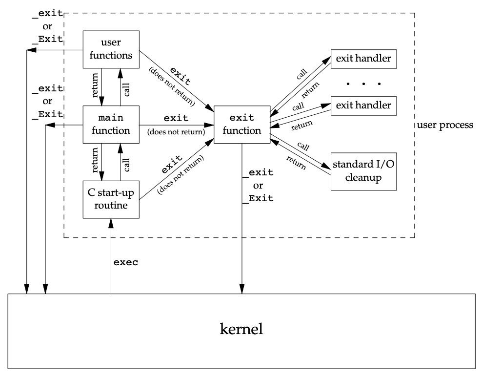
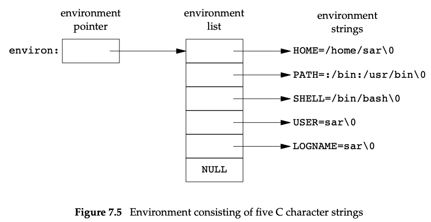
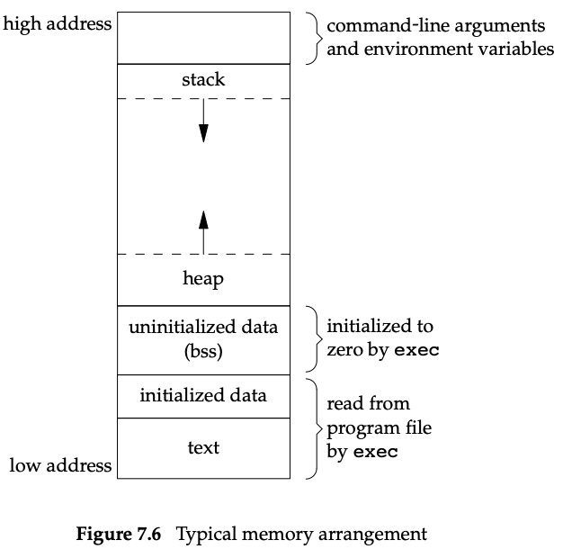
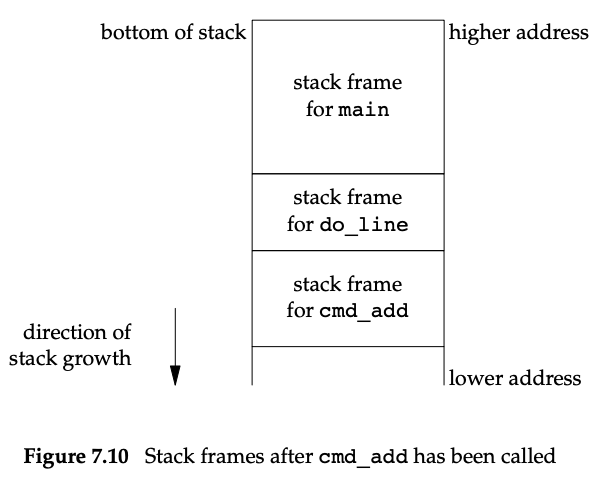
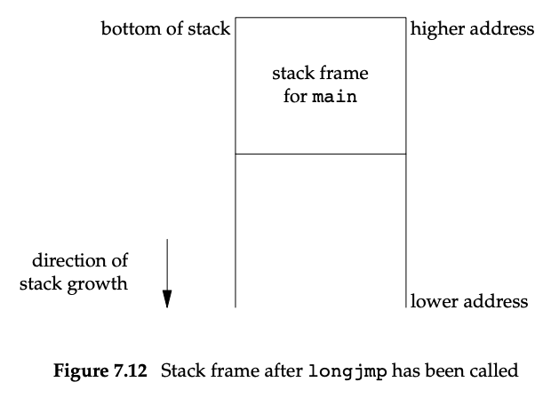


# 7.  프로세스 환경

## 7.1 소개

이 장에서는 단일 프로세스의 환경을 다룬다. 프로그램이 실행될 때 main 함수가 호출되고, 명령줄 인수가 전달되는 방법, 메모리 레이아웃, 메모리 할당, 환경 변수 사용, 프로세스 종료 방법 등을 설명한다. 또한, longjmp와 setjmp 함수와 스택과의 상호 작용, 프로세스의 리소스 제한을 논의한다.


## 7.2 main 함수

 - main 함수는 프로그램의 시작점으로, 다음과 같은 형태를 갖는다

``` c
int main(int argc, char *argv[]);
```
 - argc는 명령줄 인수의 수, argv는 인수 배열이다.
 - 실행 시 커널이 명령줄 인수와 환경 변수를 전달하며, 이는 시작 루틴을 통해 main 함수로 설정된다.

## 7.3 프로세스 종료

프로세스는 정상 종료와 비정상 종료 두 가지 방법으로 종료할 수 있다.

정상 종료 방법 (5가지)
1. `main` 함수에서 반환
2. `exit` 함수 호출
3. `_exit` 또는 `_Exit` 함수 호출
4. 마지막 스레드가 시작 루틴에서 반환
5. 마지막 스레드에서 `pthread_exit` 호출

비정상 종료 방법 (3가지)
1. `abort` 함수 호출
2. 시그널 수신
3. 마지막 스레드가 취소 요청에 응답

### Exit 함수
- `exit`, `_exit`, `_Exit` 세 가지 함수는 프로그램을 종료시킨다.
- `exit` 함수는 정리 작업을 수행한 후 커널로 반환한다.
- `_exit` 및 `_Exit` 함수는 즉시 커널로 반환한다.

```c
#include <stdlib.h>

void exit(int status);
void _Exit(int status);

#include <unistd.h>

void _exit(int status);

```
### Exit 함수의 작동 방식
- `exit` 함수는 표준 I/O 라이브러리를 종료하며, 모든 열려있는 스트림을 닫는다.
- 세 함수 모두 하나의 정수 인자를 받아 종료 상태를 나타낸다.
- main 함수가 정수 값을 반환하면 `exit` 함수 호출과 동일하다.
  - 종료상태 없이 `exit` 함수가 호출되거나,
  - `main` 함수가 반환값이 없이 return 문을  통해 반환되었거나,
  - `main` 함수가 정수를 돌려주도록 선언되어 있지 않다면 프로세스의 종료 상태는 정의되지 않는다.

```c
#include <stdio.h>

main(void) {
    printf("hello, world\n");
    return 0;
}

```
"Hello. world' 프로그램을 컴파일하고 실행한 결과 종료 코드가 13이 나올 수 있다. ISO C 1999 컴파일러 확장을 사용하면 종료 코드가 0으로 변경된다.

### atexit 함수

```c
#include <stdlib.h>

int atexit(void (*func)(void));
```
- 프로세스는 `exit` 함수 호출시 자동으로 호출될 종료 핸들러를 등록할 수 있다.
- 종료 핸들러는 등록된 역순으로 호출된다.
- 핸들러는 어떠한 인수도 받지 않으며 어떤 값도 돌려주지 않아야 한다.
- 한 함수를 여러 번 등록하면 등록된 횟수만큼 호출된다.


```c
#include "apue.h"

static void my_exit1(void);
static void my_exit2(void);

int main(void) {
    if (atexit(my_exit2) != 0) err_sys("can't register my_exit2");
    if (atexit(my_exit1) != 0) err_sys("can't register my_exit1");
    if (atexit(my_exit1) != 0) err_sys("can't register my_exit1");

    printf("main is done\n");
    return 0;
}

static void my_exit1(void) {
    printf("first exit handler\n");
}

static void my_exit2(void) {
    printf("second exit handler\n");
}
```

```bash
main is done
first exit handler
first exit handler
second exit handler
```

## 7.4 명령줄 인수

- 프로그램이 실행될 때 `exec`를 수행하는 프로세스는 새로운 프로그램에 명령줄 인수를 전달할 수 있다.
- 이는 UNIX 세스템 쉘의 일반적인 동작이다.
- 다음 프로그램은 모든 명령줄 인수를 표준 출력으로 에코한다.
- 일반 `echo` 프로그램과 달리 0번째 인수도 에코한다.

```c
#include "apue.h"

int main(int argc, char *argv[]) {
    int i;
    for (i = 0; i < argc; i++) /* 모든 명령줄 인수 에코 */
        printf("argv[%d]: %s\n", i, argv[i]);
    exit(0);
}
```
```sh
$ ./echoarg arg1 TEST foo
argv[0]: ./echoarg
argv[1]: arg1
argv[2]: TEST
argv[3]: foo
```
- ISO C와 POSIX.1 표준에 따르면 `argv[argc]`는 NULL 포인터이다.
- 이를 통해 인수 처리 루프를 다음과 같이 작성할 수도 있다.
```c
for (i = 0; argv[i] != NULL; i++)
```

## 7.5 환경 목록
- 각 프로그램은 환경 목록을 전달받는다. 
- 환경 목록은 `null`로 종료된 C 문자열의 주소를 포함하는 문자 포인터 배열이다. 
- 이 포인터 배열의 주소는 전역 변수 `environ`에 저장된다

```c
extern char **eviron;
```

예를 들어, 환경이 다섯 개의 문자열로 구성된 경우, 이는 다음과 같다.


- 관례상 각 환경 문자열은 ***이름=값*** 의 형태를 따른다.
- 대부분의 사전 정의된 이름은 대문자로 되어 있지만, 이는 관례일 뿐이다.

대부분의 UNIX 시스템에서는 환경 목록의 주소를 포함하는 세 번째 인수를 `main` 함수에 제공한다.
```c
int main(int argc, char *argv[], char *envp[]);
```
- ISO C 표준에 따라 `main` 함수는 두 개의 인수로 작성되어야 하며, POSIX.1 표준에서는 전역 변수 `environ`을 사용할 것을 권장한다.
- 특정 환경 변수에 접근하는 것은 일반적으로 `getenv`와 `putenv` 함수를 통해 이루어지며, 전체 환경을 순회하려면 `environ` 포인터를 사용해야 한다.

## 7.6 C 프로그램의 메모리 배치

오래전부터 C 프로그램은 다음과 같은 부분으로 구성된다.
- **텍스트 세그먼트(text segment)**: CPU 가 실행하는 기계 명령어로 구성되며, 일반적으로 읽기 전용이다. 이 세그먼트는 공유 가능하며 동일한 프로그램이 여러 번 실행될 때 메모리 낭비를 방지한다.
  - 사용자 정의 함수 혹은 라이브러리 코드(`stdio.h` 에서 제공하는 함수)의 기계 명령어가 포함될 수 있다.
- **초기화된 데이타 세그먼트(initialized data segment)**: 프로그램에서 명시적으로 초기화된 변수들이 저장된다. 예를들어 `int maxcount = 99;` 는 초기화된 데이타 세그먼트에 저장된다.
- **초기화되지 않은 데이타 세그먼트(uninitialized data segment)**: 초기화되지 않은 변수들이 저장되며, 프로그램 시작 시 커널에 의해 0으로 초기화된다. 예를 들어, `long sum[1000];`은 이 세그먼트에 저장된다.
- **스택(stack)**: 함수 호출 시 자동 변수들과 호출자의 환경 정보(몇몇 CPU 레지스터 등)가 저장된다. 각 함수 호출마다 새로운 스택 프레임이 생성되며, 재귀 호출을 지원한다. 함수의 한 호출에서의 변수들은 다음 함수 혹은 다른 호출에서의 변수들에 간섭하지 않는다.
- **힙(heap)**: 동적 메모리 할당이 이루어지는 영역으로, 초기화되지 않은 데이타 세그먼트와 스택 사이에 위치한다.


이는 일반적인 메모리 배치를 나타낸 것이다.

### `size` 명령어
`size` 명령어는 텍스트, 데이터, BSS 세그먼트의 크기를 바이트 단위로 출력한다.
```sh
$ size /usr/bin/cc /bin/sh
   text    data     bss     dec     hex filename
 346919   3576    6680  357175  57337  /usr/bin/cc
 102134   1776   11272  115182  1c1ee  /bin/sh
```

여기서 네 번째와 다섯 번째 열은 세그먼트 크기의 합계를 각각 10진수와 16진수로 표시한 것이다.

## 7.7 공유 라이브러리
- 대부분의 UNIX 시스템은 공유 라이브러리를 지원한다.
- 공유 라이브러리는 공통 라이브러리 루틴을 실행 파일에서 제거하고, 대신 모든 프로세스가 참조할 수 있는 메모리의 단일 복사본을 유지한다.
- 이는 각 실행 파일의 크기를 줄이는 대신, 프로그램이 처음 실행되거나 공유 라이브러리 함수가 처음 호출될 때 약간의 런타임 오버헤드를 추가할 수 있다.

#### 주요 장점
1. **크기 감소**: 실행 파일의 크기가 줄어든다.
2. **업데이트 용이**: 라이브러리 함수를 새로운 버전으로 쉽게 교체할 수 있다.

#### 예시
- **공유 라이브러리 사용 안함**
```sh
$ gcc -static hello1.c
$ ls -l a.out
-rwxr-xr-x 1 sar 879443 Sep 2 10:39 a.out
$ size a.out
text    data     bss     dec     hex filename
787775  6128    11272  805175  c4937 a.out
```

- **공유 라이브러리 사용**
```sh
$ gcc hello1.c
$ ls -l a.out
-rwxr-xr-x 1 sar 8378 Sep 2 10:39 a.out
$ size a.out
text data bss dec hex filename
1176 504 16 1696 6a0 a.out
```

## 7.8 메모리 할당
ISO C 는 메모리 할당을 위해 세 가지 함수를 지정한다.
1. `malloc`: 지정된 바이트 수의 메모리를 할당한다. 초기 메모리 값은 불확정적이다.
2. `calloc`: 지정된 개수의 객체에 대한 공간을 할당하고, 모든 비트를 0으로 초기화한다.
3. `realloc`: 이전에 할당된 영역의 크기를 변경한다. 크기를 늘리면 기존 데이터를 복사하고 추가 공간을 할당한다.
```c
#include <stdlib.h>

void *malloc(size_t size);
void *calloc(size_t nobj, size_t size);
void *realloc(void *ptr, size_t newsize);
void free(void *ptr);
```
- 메모리 할당 함수는 포인터 반환 시 올바르게 정렬된 메모리를 보장한다.
- 메모리 할당 함수는 일반적으로 `void*`를 돌려주므로 `#include <stdlib.h>`로 함수 원형을 도입했다면 캐스팅이 필요하지 않다.
- `free` 함수는 `ptr` 가 가리키는 공간의 할당을 해제하고, 해제된 공간은 가용 메모리 풀로 반환된다.
- 대체로 할당 루틴들은 시스템 호출 sbrk 로 구현된다. sbrk 시스템 호출을 사용하여 힙을 확장 또는 축소할 수 있지만, 대부분의 `malloc`과 `free` 구현은 실제 메모리 크기를 줄이지 않는다.
- 할당된 메모리 블록의 앞뒤에는 관리 정보를 저장하는 공간이 추가된다. 이 공간을 넘어 쓰거나, 해제된 메모리를 다시 해제하는 등의 오류는 심각한 문제를 일으킬 수 있다.
- 일부 시스템에서는 오류 검사를 추가하여 메모리 할당 함수를 제공하기도 한다.

### 대체 메모리 할당자
- **libmalloc**: SVR4 기반 시스템에서 제공되며, ISO C 메모리 할당 함수와 호환되는 인터페이스를 제공한다.
- **vmalloc**: 다양한 메모리 영역에 대해 다른 할당 기법을 사용할 수 있는 라이브러리.
- **quick-fit**: 다양한 크기의 버퍼를 유지 관리하며 빠른 메모리 할당을 제공하는 알고리즘.
- **jemalloc**: FreeBSD 8.0에서 기본 메모리 할당기로 사용되며, 멀티프로세서 시스템에서 확장성이 좋다.
- **TCMalloc**: Google에서 제공하는 고성능 메모리 할당기로, 스레드 로컬 캐시를 사용하여 잠금 오버헤드를 줄인다.
- **alloca**: 스택 프레임에서 메모리를 할당하며, 함수가 반환될 때 자동으로 해제된다. 스택 크기를 증가시키는 단점이 있지만, 많은 시스템에서 사용된다.

## 7.9 환경 변수
- 환경 문자열은 보통 `name=value` 형식으로 되어 있다.
- UNIX 커널은 이 문자열들을 직접 사용하지 않으며, 해석은 애플리케이션에 달려있다. 쉘은 다양한 환경 변수를 사용한다.
- 예를들어 `HOME`과 `USER`는 로그인 시 자동으로 설정되며. 다른 변수들은 사용자가 설정할 수 있다.

```c
#include <stdlib.h>
char *getenv(const char *name);
```
- `getenv`함수는 환경 변수의 값을 반환하며, 없을 경우 `NULL`을 반환한다.
- 특정 환경 변수를 얻으려면 `environ`에 접근하기 보단 이 함수를 사용하는것이 바람직하다.

### 환경 변수의 설정과 변경
POSIX.1 표준에서는 다양한 환경 변수를 정의하고 있으며, 일부는 XSI 옵션을 지원하는 경우에만 사용된다. 다양한 시스템에서 지원되는 환경 변수는 아래 표와 같다.

| Variable    | POSIX.1 | FreeBSD 8.0 | Linux 3.2.0 | Mac OS X 10.6.8 | Solaris 10 |
|-------------|---------|-------------|-------------|-----------------|------------|
| COLUMNS     | •       | •           | •           | •               | •          |
| DATEMSK     | XSI     | •           | •           | •               | •          |
| HOME        | •       | •           | •           | •               | •          |
| LANG        | •       | •           | •           | •               | •          |
| LC_ALL      | •       | •           | •           | •               | •          |
| LC_COLLATE  | •       | •           | •           | •               | •          |
| LC_CTYPE    | •       | •           | •           | •               | •          |
| LC_MESSAGES | •       | •           | •           | •               | •          |
| LC_MONETARY | •       | •           | •           | •               | •          |
| LC_NUMERIC  | •       | •           | •           | •               | •          |
| LC_TIME     | •       | •           | •           | •               | •          |
| LINES       | •       | •           | •           | •               | •          |
| LOGNAME     | •       | •           | •           | •               | •          |
| MSGVERB     | XSI     | •           | •           | •               | •          |
| NLSPATH     | •       | •           | •           | •               | •          |
| PATH        | •       | •           | •           | •               | •          |
| PWD         | •       | •           | •           | •               | •          |
| SHELL       | •       | •           | •           | •               | •          |
| TERM        | •       | •           | •           | •               | •          |
| TMPDIR      | •       | •           | •           | •               | •          |
| TZ          | •       | •           | •           | •               | •          |

환경 변수의 값을 가져오는 것 외에도 환경 변수를 설정하거나 제거할 수 있다.

```c
#include <stdlib.h>
int putenv(char *str);
int setenv(const char *name, const char *value, int rewrite);
int unsetenv(const char *name);
```
- `putenv`: `name=value` 형식의 문자열을 환경 변수에 추가한다.
  - 만일 이름이 이미 존재하면 기존 정의가 제거된다.
- `setenv`: 환경 변수를 설정한다.
  - `rewirte`가 0이 아니면 `name`의 기존 변수를 덮어 쓴다.
  - `rewrite`가 0이면 기존 변수를 덮어쓰지 않는다.
- `unsetenv`: 환경 변수를 제거한다.
- 환경 변수는 프로세스의 메모리 공간에서 스택 위에 위치한다.
- 문자열을 삭제하는 것은 비교적 간단하지만, 새로운 변수를 추가하거나 기존 변수를 수정하는 것은 더 복잡할 수 있다.

1. 기존 변수 수정
   1. 새로운 값이 기존 값보다 짧거나 같으면, 기존 문자열 위에 덮어쓴다.
   2. 새로운 값이 기존 값보다 길면, 새로운 메모리 공간을 할당하고 값을 복사한 후 포인터를 갱신한다.
2. 새로운 변수 추가
   1. 처음 추가 시, 새로운 리스트를 위한 메모리를 할당하고 기존 리스트를 복사한다. 그런 다음 새 변수와 널 포인터를 마지막에 추가한다. 만약 환경 목록이 스택 최상단보다 위쪽 공간을 차지한다면 포인터들의 목록은 힙 영역으로 이동된다.
   2. 두 번째 이후 추가 시, 기존 리스트에 공간을 추가로 할당하고 새 변수를 추가한다.

## 7.10 setjmp 함수와 longjmp 함수

C 언어에서는 다른 함수 내의 레이블로 이동할 수 없으므로, 비슷한 작업을 수행하기 위해 `setjmp`와 `longjmp`함수를 사용한다. 이러한 함수들은 깊게 중첩된 함수 호출에서 발생하는 오류 조건을 처리하는 데 유용하다.

```c
#include "apue.h"
#define TOK_ADD 5

void do_line(char *);
void cmd_add(void);
int get_token(void);

int main(void) {
    char line[MAXLINE];
    while (fgets(line, MAXLINE, stdin) != NULL)
        do_line(line);
    exit(0);
}

char *tok_ptr;

void do_line(char *ptr) {
    int cmd;
    tok_ptr = ptr;
    while ((cmd = get_token()) > 0) {
        switch (cmd) {
            case TOK_ADD:
                cmd_add();
                break;
        }
    }
}

void cmd_add(void) {
    int token;
    token = get_token();
}

int get_token(void) {
    // 토큰 가져오기
}
```

- 함수의 자동 변수들의 저장소는 스택 프레임 안에 마련된다.

### 비치명적 오류 처리
```c
#include <setjmp.h>

int setjmp(jmp_buf env);
void longjmp(jmp_buf env, int val);
```
- 함수의 호출 스택이 깊어질 수록 오류 처리 이후 main 함수로 돌아가려면 여러 단계를 거쳐야 한다.
- 이 문제를 해결 하려면 `setjmp`함수와 `longjmp`함수를 이용해서 비국소 분기를 수행하면 된다.
- `setjmp`는 반환하고자 하는 위치에서 호출된다.
  - `setjmp`는 0을 반환하고, `longjmp`가 호출되면 `setjmp`는 `val`값을 반환한다.
- `longjmp`는 `setjmp`로 돌아갈 때 사용된다.

```c
#include "apue.h"
#include <setjmp.h>
#define TOK_ADD 5

jmp_buf jmpbuffer;

int main(void) {
    char line[MAXLINE];
    if (setjmp(jmpbuffer) != 0)
        printf("error");
    while (fgets(line, MAXLINE, stdin) != NULL)
        do_line(line);
    exit(0);
}

void cmd_add(void) {
    int token;
    token = get_token();
    if (token < 0)  // 오류 발생 시
        longjmp(jmpbuffer, 1);
}
```


- `longjmp`가 호출되면 `cmd_add`의 스택 프레임이 사라지면서 스택이 다시 `main` 함수로 풀리는 결과가 된다.
- 이때 `setjmp` 함수 호출의 반환값은 1이다.

### 자동, 레지스터 및 휘발성 변수
`longjmp`가 호출되면 자동 및 레지스터 변수의 상태는 불확정적이다. 휘발성변수(volatile) 는 그대로 유지된다.
```c
#include "apue.h"
#include <setjmp.h>

static jmp_buf jmpbuffer;
static int globval;

int main(void) {
    int autoval;
    register int regival;
    volatile int volaval;
    static int statval;

    globval = 1; autoval = 2; regival = 3; volaval = 4; statval = 5;

    if (setjmp(jmpbuffer) != 0) {
        printf("after longjmp:\n");
        printf("globval = %d, autoval = %d, regival = %d, volaval = %d, statval = %d\n",
               globval, autoval, regival, volaval, statval);
        exit(0);
    }

    globval = 95; autoval = 96; regival = 97; volaval = 98; statval = 99;
    f1(autoval, regival, volaval, statval);
    exit(0);
}

void f1(int i, int j, int k, int l) {
    printf("in f1():\n");
    printf("globval = %d, autoval = %d, regival = %d, volaval = %d, statval = %d\n",
           globval, i, j, k, l);
    f2();
}

void f2(void) {
    longjmp(jmpbuffer, 1);
}
```

```bash
$ gcc testjmp.c 		# compile without any optimization
$ ./a.out
in f1():
globval = 95, autoval = 96, regival = 97, volaval = 98, statval = 99
after longjmp:
globval = 95, autoval = 96, regival = 97, volaval = 98, statval = 99
$ gcc -O testjmp.c 		# compile with full optimization
$ ./a.out
in f1():
globval = 95, autoval = 96, regival = 97, volaval = 98, statval = 99
after longjmp:
globval = 95, autoval = 2, regival = 3, volaval = 98, statval = 99
```
- 이 예제는 컴파일러 최적화 여부에 따라 변수가 다르게 처리되는 것을 보여준다.
  - 최적화가 되지 않은 경우 다섯 변수 모두 메모리에 저장된다.
  - 최적화가 된 경우 `regival`, `autoval` 변수 모두 레지스터에 저장된다.
- `volatile` 속성은 이러한 변수들이 `longjmp`후에도 일관성을 유지하도록 보장한다.

### 자동 변수의 잠재적 문제점
```c
#include <stdio.h>

FILE *open_data(void) {
    FILE *fp;
    char databuf[BUFSIZ];  // 자동 변수로 버퍼를 선언

    if ((fp = fopen("datafile", "r")) == NULL)
        return NULL;
    if (setvbuf(fp, databuf, _IOLBF, BUFSIZ) != 0)
        return NULL;
    return fp;  // 문제 발생
}
```
- 자동 변수는 함수가 반환된 후에는 더 이상 참조할 수 없다.
- 함수 `open_data`가 반환된 후, `databuf` 배열이 위치한 스택 프레임은 다음 호출에 의해 재사용된다.
- 그러나 표준 I/O 라이브러리는 여전히 `databuf`메모리 공간을 스트림 버퍼로 사용하려 한다.
- 이는 혼란을 초래할 수 있으며, 프로그램의 예측 불가능한 동작을 유발할 수 있다.
- `databuf` 배열을 저역 또는 정적으로 선언하여 스택 프레임의 수명에 의존하지 않도록 할 수 있다.
- `malloc`과 같은 동적 메모리 할당 함수를 사용하여 힙에 버퍼를 할당할 수 있다.

```c
#include <stdio.h>
#include <stdlib.h>

FILE *open_data(void) {
    FILE *fp;
    char *databuf;

    if ((fp = fopen("datafile", "r")) == NULL)
        return NULL;
    if ((databuf = malloc(BUFSIZ)) == NULL)
        return NULL;
    if (setvbuf(fp, databuf, _IOLBF, BUFSIZ) != 0)
        return NULL;
    return fp;
}
```

## 7.11 `getrlimit`함수와 `setrlimit`함수
각 프로세스는 `getrlimit` 및 `setrlimit` 함수를 통해 조회하고 변경할 수 있는 자원 제한 집합을 가지고 있다.
```c
#include <sys/resource.h>

struct rlimit {
    rlim_t rlim_cur;  // 소프트 제한: 현재 제한
    rlim_t rlim_max;  // 하드 제한: rlim_cur의 최대 값
};

int getrlimit(int resource, struct rlimit *rlptr);
int setrlimit(int resource, const struct rlimit *rlptr);
```
이 함수들은 `struct rlimit` 구조체를 사용하여 자원 제한을 정의한다.

### 자원 제한 변경 규칙
1. 프로세스는 soft limit 을 hard limit 보다 작거나 같은 값으로만 변경할 수 있다.
2. 프로세스는 hard limit 을 soft limit 이상으로 낮출 수 있다. 일반 사용자는 hard limit을 높일 수 없다.
3. hard limit 을 높이는 작업은 슈퍼 사용자 프로세스만 가능하다.

### 자원 제한 상수
- `RLIMIT_AS`: 프로세스의 총 메모리 사용량
- `RLIMIT_CORE`: 코어 덤프 파일의 최대 크기
- `RLIMIT_CPU`: 최대 CPU 시간
- `RLIMIT_DATA`: 데이터 세그먼트의 최대 크기
- `RLIMIT_FSIZE`: 생성할 수 있는 파일의 최대 크기
- `RLIMIT_MEMLOCK`: 메모리에 잠글 수 있는 최대 메모리 양
- `RLIMIT_MSGQUEUE`: POSIX 메시지 큐에 할당할 수 있는 최대 메모리 양
- `RLIMIT_NICE`: 프로세스의 우선 순위 제한
- `RLIMIT_NOFILE`: 열 수 있는 파일의 최대 수
- `RLIMIT_NPROC`: 생성할 수 있는 자식 프로세스의 최대 수
- `RLIMIT_NPTS`: 동시에 열 수 있는 가상 터미널의 최대 수
- `RLIMIT_RSS`: 최대 상주 집합 크기
- `RLIMIT_SBSIZE`: 소비할 수 있는 최대 소켓 버퍼 크기
- `RLIMIT_SIGPENDING`: 큐에 넣을 수 있는 최대 신호 수
- `RLIMIT_STACK`: 스택의 최대 크기
- `RLIMIT_SWAP`: 사용 가능한 최대 스왑 공간
- `RLIMIT_VMEM`: RLIMIT_AS와 동일

- 아래 예제는 시스템이 지원하는 모든 자원 한계의 현재 soft limit 과 hard limit 를 출력한다.

```c
#include "apue.h"
#include <sys/resource.h>

#define doit(name) pr_limits(#name, name)
static void pr_limits(char *, int);

int main(void) {
    #ifdef RLIMIT_AS
    doit(RLIMIT_AS);
    #endif

    doit(RLIMIT_CORE);
    doit(RLIMIT_CPU);
    doit(RLIMIT_DATA);
    doit(RLIMIT_FSIZE);

    #ifdef RLIMIT_MEMLOCK
    doit(RLIMIT_MEMLOCK);
    #endif

    #ifdef RLIMIT_MSGQUEUE
    doit(RLIMIT_MSGQUEUE);
    #endif

    #ifdef RLIMIT_NICE
    doit(RLIMIT_NICE);
    #endif

    doit(RLIMIT_NOFILE);

    #ifdef RLIMIT_NPROC
    doit(RLIMIT_NPROC);
    #endif

    #ifdef RLIMIT_NPTS
    doit(RLIMIT_NPTS);
    #endif

    #ifdef RLIMIT_RSS
    doit(RLIMIT_RSS);
    #endif

    #ifdef RLIMIT_SBSIZE
    doit(RLIMIT_SBSIZE);
    #endif

    #ifdef RLIMIT_SIGPENDING
    doit(RLIMIT_SIGPENDING);
    #endif

    doit(RLIMIT_STACK);

    #ifdef RLIMIT_SWAP
    doit(RLIMIT_SWAP);
    #endif

    #ifdef RLIMIT_VMEM
    doit(RLIMIT_VMEM);
    #endif

    exit(0);
}

static void pr_limits(char *name, int resource) {
    struct rlimit limit;
    unsigned long long lim;

    if (getrlimit(resource, &limit) < 0)
        err_sys("getrlimit error for %s", name);
    
    printf("%-14s  ", name);
    if (limit.rlim_cur == RLIM_INFINITY)
        printf("(infinite)  ");
    else {
        lim = limit.rlim_cur;
        printf("%10lld  ", lim);
    }

    if (limit.rlim_max == RLIM_INFINITY)
        printf("(infinite)");
    else {
        lim = limit.rlim_max;
        printf("%10lld", lim);
    }
    putchar((int)'\n');
}
```