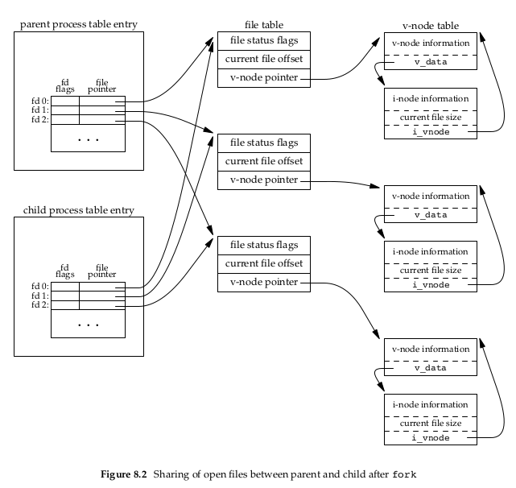
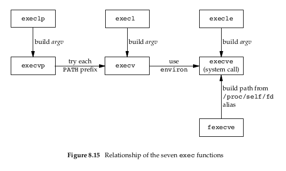

- [8. Process Control](#8-process-control)
  - [8.1 Introduction](#81-introduction)
  - [8.2 Proecss Identifiers](#82-proecss-identifiers)
    - [```PID```란?](#pid란)
    - [특수 목적의 ```PID```?](#특수-목적의-pid)
    - [```PID``` 조회](#pid-조회)
  - [8.3 ```fork``` Function](#83-fork-function)
    - [코드 예, ```fork```](#코드-예-fork)
    - [File Sharing](#file-sharing)
    - [fork 동작 관련 참고?](#fork-동작-관련-참고)
  - [8.4 vfork Function](#84-vfork-function)
    - [코드 예, ```vfork```](#코드-예-vfork)
  - [8.5 exit Functions](#85-exit-functions)
  - [8.6 wait and waitpid Functions](#86-wait-and-waitpid-functions)
    - [코드 예, ```wait```](#코드-예-wait)
    - [waitpid 설명](#waitpid-설명)
    - [waidpid 코드 예](#waidpid-코드-예)
  - [8.7 waitid Function](#87-waitid-function)
  - [8.8 wait3 and wait4 Functions](#88-wait3-and-wait4-functions)
  - [8.9 Race Condition](#89-race-condition)
  - [8.10 exec Functions](#810-exec-functions)
  - [8.11 Changing User IDs and Group IDs](#811-changing-user-ids-and-group-ids)
    - [Example? (at)](#example-at)
  - [8.12 Interpreter Files](#812-interpreter-files)
  - [8.13 system Function](#813-system-function)
    - [System 프로그램](#system-프로그램)
    - [Set-User-ID Programs 프로그램](#set-user-id-programs-프로그램)
  - [8.14 Process Accounting](#814-process-accounting)
  - [8.15 User Identification](#815-user-identification)
  - [8.16 Process Scheduling](#816-process-scheduling)
  - [8.17 Procee Times](#817-procee-times)


# 8. Process Control
## 8.1 Introduction
이 챕터에선 UNIX 상에서 프로세스가 컨트롤되는 방식들에 대해 배운다.

* 프로세스 생성
* 프로세스 실행
* 프로세스 제거

에 대해 중접적으로 다룬다. 이 챕터에스 프로세스 관리에 대해 학습하면, 이와 관련된 함수나 시스템콜을 볼 때, 다른 관점으로 볼 수 있게 된다.

## 8.2 Proecss Identifiers
### ```PID```란?
모든 프로세스는 고유의 ID인 음이 아닌 정수 ```Process ID``` (이하 ```PID```)가 존재하며 Unique한 속성을 지닌다.

따라서 이 값을 파일이나 특수한 식별자로도 쓴다. (로그 등등)

물론 Unique하다곤 하지만 ,```PID```가 커널로 반환이 되면, 이는 재사용된다.

대신 대부분의 UNIX 시스템에선 ```PID``` 재사용을 delay시켜 빠른 시간 안에 재사용되는걸 막는다.
 (혹시라도 같은 ```PID```, 같은 종류의 프로세스라고 식별하는 일이 있으면 곤란하니..)

### 특수 목적의 ```PID```?
특수목적의 ```PID``` 도 존재한다.

1. ```PID```: 0

   ```PID```: 0인 프로세스는 스케줄러 프로세스로, ```swapper``` 라고도 불린다.

   디스크 상의 어떤 프로그램파일도 이 프로세스완 관련이 없으며, 오직 커널에서만 쓰인다.

2. ```PID```: 1

   이 프로세스는 ```init``` 프로세스로, bootstrap 동작 이후 커널로부터 호출되어 깨어난다.

   커널이 bootstrap된 이후, UNIX 시스템을 올리는 동작을 담당한다. 말 그대로 초기화 프로세스

   > Bootstrap이란?
   >
   > 학창시절에 배운거같긴 한데, 일반적으론 부팅 = 부트스트랩이다.
   > 전원 상태, ROM상태 등등 확인을 하는 동작을 한다.
   > 이후에 메모리로 UNIX 시스템을 올리는걸 ```init``` 이 한다는 의미.

   보통 ```/etc/rc*``` 혹은 ```/etc/inittab```, ```/etc/init.d``` 파일을 읽어들여 시스템을 특정 상태로 가져온다.

   이 프로세스는 결코 죽지 않도록 설계되어있다. + 고아가된 녀석들의 부모가 된다. 이후 설명.

3. 기타
    각 UNIX 시스템 별로 특수목적의 프로세스는 더 있을 수 있다.

    예를들면 어떤 UNIX에선 ```PID```: 2 는 *pagedaemon* 라는 역할을 하는데, 이 친구는 가상메모리의 페이지 기능을 도와주는 역할을 한다.

### ```PID``` 조회
```c
#include <unistd.h>
pid_t getpid(void);
    Returns: process ID of calling process
pid_t getppid(void);
    Returns: parent process ID of calling process
uid_t getuid(void);
    Returns: real user ID of calling process
uid_t geteuid(void);
    Returns: effective user ID of calling process
gid_t getgid(void);
    Returns: real group ID of calling process
gid_t getegid(void);
    Returns: effective group ID of calling process
```
가 있다.

## 8.3 ```fork``` Function

```c
#include <unistd.h>
pid_t fork(void);
    Returns: 0 in child, process ID of child in parent, −1 on error
```

```fork``` 를 수행하면 Return이 총 2회 온다. ```fork``` 수행 시, 프로세스가 2개로 갈라지기 때문.

* 자식 프로세스

    자식 프로세스는 return으로 0을 받는다. 이는 자기 ```PID```가 0임을 의미하는게 아니고, ```fork``` 된 자식프로세스가 자기 자신임을 의미한다.
* 부모 프로세스

    부모 프로세스는 return으로 자식의 ```PID```를 받는다.

이런 구조가 가능한 이유는, 자식 프로세스는 오직 한명의 부모프로세스만 가지기 때문이다. 부모의 ```PID``` 를 알기 위해선 위에 나온 ```getppid``` 함수를 호출하면 된다.

부모 자식은 메모리 공간을 별도로 사용한다. 즉 ```fork``` 시 Text영역을 제외하곤 모두 복사해온다는 뜻이다. (Text는 공유)

근래에 와선 이런 full copy는 잘 하지 않고, 영역 자체를 공유한다. 왜냐면 대부분의 경우 ```fork``` 이후 ```exec``` 로 메모리를 싹다 닦아버리기 때문.

따라서 요즘은 계속 공유하다가 메모리 변경을 하는 경우에, 해당하는 부분만 따로 페이지 단위로 메모리를 관리하여 수정한다고 한다.

```COW```(Copy On Write) 라고 하는데, 우선 공유 메모리 영역을 Read-Only로 해놓고, 변경이 필요할 때, 해당 영역을 페이지단위로 가져와 수정하여 사용한다고 한다.


### 코드 예, ```fork```
fork.c 참고, 책 내용 일부 변형 (perror 등)
```c
#include <stdio.h>
#include <unistd.h>
#include <stdlib.h>

int globvar = 6; /* external variable in initialized data */
char buf[] = "a write to stdout\n";

int main(void)
{
    int var; /* automatic variable on the stack */
    pid_t pid;

    var = 88;
    if (write(STDOUT_FILENO, buf, sizeof(buf)-1) != sizeof(buf)-1)
        perror("write error");

    printf("before fork\n"); /* we don’t flush stdout */

    if ((pid = fork()) < 0) {
        perror("fork error");
    } else if (pid == 0) { /* child */
        globvar++;
        var++;
    } else { /* parent */
        sleep(2);
    }

    printf("pid = %ld, glob = %d, var = %d\n", (long)getpid(), globvar, var);
    exit(0);
}
```

결과는 아래와 같다.

```bash
> ./a.out
a write to stdout               # write
before fork                     # printf (line buffered)
pid = 27445, glob = 7, var = 89 # printf (line buffered) CHILD
pid = 27444, glob = 6, var = 88 # printf (line buffered) PARENT

> ./a.out > z
> cat z
a write to stdout               # write
before fork                     # printf (fully buffered) CHILD
pid = 31424, glob = 7, var = 89 # printf (fully buffered) CHILD
before fork                     # printf (fully buffered) PARENT
pid = 31423, glob = 6, var = 88 # printf (fully buffered) PARENT
```
메모리 영역이 복사가 되었음을 알 수 있다.

* 코드 관련 설명?
  * 프로세스 순서관련
    * Sleep 2초가 들어가있는데, 커널에서 어떤 프로세스를 먼저실행한다에 대한 보장은 없다.
    * 따라서 단순히 2초를 넣었는데, 이게 적절하다는 보장또한 없다.
    * 뒤에 Race Condition 다루는 파트에서 이 부분 디테일하게 다룬다. 10장에선 Signal로 다룬다.
  * buf 관련?
    * sizeof는 컴파일타임때 크기계산을 하니, -1을 붙여서 null은 제거해준다.
  * STDIO 관련
    * redirection 여부에 따라 터미널로 output을 낼 수도 있고, 파일로 낼 수도 있다.
    * 5장에서 배운대로, buffering 처리가 달라지는데, 터미널 디바이스의 경우 line buffered가 디폴트라
    * 개행까지 출력할 경우, fork 이전의 ```printf``` 알아서 flush가 된다.
    * 파일로 redirection 할 경우 개행 같은거 알빠노, 그냥 stdio 버퍼영역까지 그대로 복사된다.
    * 따라서 before fork 문장이 2개나온다.

### File Sharing

```fork``` 된 프로세스는 시스템콜 ```dup``` 와 유사하게 Parent가 들고있던 모든 file descriptor를 복사한다.

파일 테이블은 child / parent 공유하게 된다.



> filetable / i-node / v-node?
>
> 파일시스템(물리 디스크) 안에는 파일에 대한 메타정보를 저장하는 곳인 i-node가 있고, 실제 데이터가 뒤에 달려있는 구조이다.
>
> v-node는 메모리 상에서 커널이 vfs라는 가상 파일시스템에서 i-node를 관리하는 녀석이라 보면 된다.
>
> File Table은 여러 프로세스가 각자 들고있고, 메모리 내 1개만 존재하는 v-node와의 인터페이스를 담당하기 위해 존재하는 메타데이터이다.

파일 테이블을 공유하기 때문에, 같은 fd에 데이터를 작성하는 데에 있어서, offset보고 처리하기가 용이? 하다고 한다.

만약 공유를 하지 않는다면 매번 두 프로세스가 동기화 할 방안을 찾아야 한다. ( 근데 이건 장점이자 단점 같다. )

하지만 아무런 동기화 방안 없이 파일들을 무분별하게 사용한다면 문제가 발생할 것이다. 따라서 ```fork``` 이후 보통 두가지 방법을 통해 핸들링한다.
1. 부모가 자식이 끝날 때 까지 대기

    따로 동기화 작업을 추가할 필요가 없다. 부모가 사용을 안하기 때문.

2. parent / child가 fd를 적절히 닫기

    이렇게 해서 fd가 서로 공유되지 않도록 한다. 이러면 동기화 문제가 사라진다.

단순히 파일 말고도 공유되는 항목들이 매우 많다. 상세한건 책을 참고.

### fork 동작 관련 참고?
대표적인 실패 사례는 아래 두 이유 때문이다.
1. 시스템 내에 비정상적인 이유로 이미 프로세스가 너무 많다.
2. 특정 real user ID에 대한 프로세스 제한을 넘어 섰다. (시스템 환경변수 ```CHILD_MAX``` 값 참고)

fork의 주요 사용처는 아래와 같다.
1. 비동기 처리 목적

    예시를 들면 네트워크 서버가 있음. 서비스 요청이 왔을 때, ```fork``` 하고 child procee가 일처리를 하도록 한다.

    부모는 나중에 ipc를 통해 결과를 받거나 후처리 하면 됨.

2. 다른 프로그램을 기동하고 싶을 때

    ```exec``` 를 통해 ```fork``` 이후 다른 프로세스로 child를 전환시킬 때 사용한다.

    뒤에 좀 더 자세히 나온다.

    ```spawn``` 같은 명령어로 두 명령을 합친 기능을 제공하는 UNIX기반 커널들도 있는데, UNIX 표준은 일단 나눠놓는 것.


## 8.4 vfork Function

```vfork``` 는 앞선 **다른 프로그램을 기동하고 싶을 때** 에 사용된다고 생각하면 된다.

```fork``` 와의 차이는 메모리 공간 복사가 없다는 것이고, ```exit``` 이나 ```exec``` 전까지 메모리를 공유한다.

앞서 설명한 Copy On Write도 최대한 복사를 적게하는 건데, 이건 복사자체가 없어서 여전히 더 빠르다.

```vfork``` 는 ```exec```나 ```exit```이 금방 발생할걸 가정하기 때문에, child가 parent보다 무조건 먼저 실행됨을 보장하고, 탈출 전까지 락을 잡아버린다.

당연히 처리를 제대로 안해놓으면 Deadlock이 발생해서 Parent가 곤란해진다.

### 코드 예, ```vfork```

```c
#include <unistd.h>

int globvar = 6;
int main(void)
{
    int var;
    pid_t pid;
    /* external variable in initialized data */
    /* automatic variable on the stack */
    var = 88;
    printf("before vfork\n");       /* we don’t flush stdio */
    if ((pid = vfork()) < 0) {
        perror("vfork error");
    } else if (pid == 0) {          /* child */
        globvar++;                  /* modify parent’s variables */
        var++;
        _exit(0);                   /* child terminates */
    }
    /* parent continues here */
    printf("pid = %ld, glob = %d, var = %d\n", (long)getpid(), globvar,
            var);
    exit(0);
}
```

```bash
> ./a.out
before vfork
pid = 14692, glob = 7, var = 89
```

* 코드 설명
  * sleep?
    * 아까와는 다르게 sleep이 없어도 된다. Unix 표준 ```_exit``` 수행 시, parent가 깨어나는게 보장된다.
  * ```_exit``` ?
    * 얘는 ISO C표준이 아니라 POSIX 표준. 따라서 STDIO 버퍼를 flush하지 않는다.
    * 그러니 "before vfork" 문장이 두번 출력되는 일이 없다.
    * 다만 메모리 공간을 공유하기 때문에 ```exit``` 으로 수행해도 사실 큰 차이가 없다ㅋ


## 8.5 exit Functions

7.3 장에서 이야기를 했듯이, 프로세스 종료는 총 5가지 방법이 있다.
1. ```main```에서 ```return``` 때리기.

    ```exit``` 호출과 동일하다.

2. ```exit``` 호출하기

    7장에서 봣듯이 ```atexit``` 으로 달아놓은 exit handler 들을 호출 후 리소스를 정리한다.

    다만 얘는 ISO C과의 놈이라 표준입출력과 관련된 놈들만 닫는다.

    따라서 fd나 parent/child 프로세스 리소스 정리 등이 이루어지지 않아 UNIX와는 완벽호환되지 못한다.

3. ```_exit``` 호출하기

    애는 POSIX 함수이다. 시그널 핸들러? exit 핸들러? 다 무시하고 프로세스 종료된다.

    당연히 STDIO 내의 메모리 버퍼도 걍 무시하고 종료된다.

4. 프로세스 내 마지막 Thread의 start routine 에서의 리턴

    특이한 점은 thread start routine에서의 return이 프로세스의 return code가 되진 않는다고 한다.

    그저 정상종료(0)를 리턴한다.

5. 프로세스 내 마지막 Thread의 pthread_exit

    나중에 더 살펴본단다.

비정상 종료는 크게 3가지가 있다.

1. ```abort``` 호출

    얘는 ```SIGABRT``` 를 유발시켜 프로세스에게 시그널핸들러를 사용하도록 한다.

    핸들러가 없으면 걍 종료되는 시그널이다. 사실상 자살버튼

2. 특정 시그널을 받을 때

    이건 뭐, 코테할때도 본거지만 SIGSEGV (메모리 영역 잘못 참조) 나, SIGFPE (0으로 나누기) 같은걸 시키면
    커널이 알아서 시그널을 날려준다.

    마찬가지로 핸들러 없으면 걍 종료되는 시그널로 자살버튼.

3. 마지막 Thread의 업무가 cancel되었을 경우?

    나중에 알아본단다..

어떤 식으로 종료가 되던, 커널에선 같은 code로 종료가 되고, fd 정리와 메모리 정리 등 프로세스 기동 이전상태로 잘 정리해준다.

프로세스가 정리될 때, 우리는 Parent에게 어떤 방식으로든 종료에 대한 ```return code```를 줄 수 있다.

* 정상종료 상황

    ```exit```, ```_exit```, ```_Exit```(==```_exit```) 을 사용하면, argument로 ```return code``` 를 넣을 수 있다. 이 코드는 ```termination staus``` 로 변환되어 Parent에 반환된다.

* 비정상종료 상황

    ```termination status``` 형태로 ```return code``` 를 반환한다.

* ```return code``` 수집?

    Parent는 ```wait```, ```waitpid``` 를 통해 ```termination status``` 를 획득할 수 있다.


고려할만한 특수한 상황들?
1. Parent가 모종의 이유로 종료되면 어떻게 될까?

    이 경우 ```init``` 프로세스가 Child들에 대한 Parent가 된다. 이렇게 해서, 모든 프로세스들은 Parent 프로세스를 가질 수 있게된다.

2. Child가 먼저 죽는 경우?

    정상종료나 비정상 종료의 경우 ```waitpid```로 감지가 가능하다.

    ```waitpid``` 호출 이전에 child가 먼저 죽는 경우를 생각해볼 수 있는데, 커널은 프로세스 종료 후에도

    종료 상태를 알려주기 위한 최소한의 정보 (```PID```, CPU 사용량, Termination Status) 를 유지하고 있다.

    이로인해 사후에 waitpid를 호출해도 대기가 가능한 것이다.

    Parent가 Child 상태를 확인하지 않으면, 죽은 Child는 좀비프로세스라고 불린다. (ps -ef 시 Z 혹은 defunct 로 나온다.)

3. 1번의 연장으로, 부모가 ```init``` 프로세스로 변경되어버린 Child들은 defunct(좀비)인가?

    답은 그렇지 않다.

    ```init``` 프로세스는 자식이 죽으면 ```wait``` 을 호출하도록 작성되어있다.

## 8.6 wait and waitpid Functions

Child가 죽으면 Parent에 ```SIGCHLD``` 를 보내어 종료를 알린다.

자식의 종료는 당연히 비동기로 처리되고, 부모는 해당 Signal을 핸들러로 처리하거나 무시할 수 있다.

Default 동작은 무시하는 것이고, 보통은 ```wait```/```waitpid``` 로 처리된다.

```wait```/```waitpid``` 에 대한 처리 방법은 아래 3가지이다.

* Child들이 실행중이라면 시스템콜에서 Block됨
* Child가 종료되어 커널이 종료상태(Termination Status)를 가지고 있다면, 해당 종료상태를 가져옴
* 자식이 없으면 곧바로 오류 반환

```c
#include <sys/wait.h>
pid_t wait(int *statloc);
pid_t waitpid(pid_t pid, int *statloc, int options);
    Both return: process ID if OK, 0 (see later), or −1 on error
```

두 함수의 설명은 아래와 같다.

* Block 여부.
  * ```wait``` 은 자식이 종료될 때까지 Block될 수 있다. 위에서 말했듯, 좀비가 있으면 바로 리턴됨
  * ```waitpid```는 뒤에 옵션을 줄 수 있는데, ```options``` 에 ```WNOHANG```을 주면  (wait no hang) 종료되지 않았을 때 0을 리턴하고 나온다.
    * 옵션을 안주면 ```wait``` 과 동일하다.

* 자식 프로세스 선택 여부
  * ```wait``` 은 먼저 종료된 Child를 기다리지만, ```waitpid``` 는 특정 Chlid를 기다릴 수 있다.

* 리턴 관련
  * 리턴이 0이면 다시 수행하라는거고 (WNOHANG) PID가 오면 정상처리 (포인터가 리턴) 음수면 에러이다.

* ```statloc``` ?
  * 종료상태 (Termination Status) 를 받아오는 정수타입 포인터이다. 리턴 코드 / 종료 코드등을 받아온다고 생각하자.
  * NULL을 주면 상태를 따로 받지 않겠다는 의미로, 종료만 기다린다.

종료 상태를 확인하는건 매크로로 사용된다. (옛날에 파일 타입 확인하는 매크로랑 비슷하다. ```S_ISREG```, ```S_ISDIR```)

아래 매크로들은 상호 배타적으로 사용되며 하나가 참이면 종료상태나 Signal 을 얻기위한 추가 매크로를 사용한다.
> ```WIF``` 라는 prefix 가 붙는다. 아마 wait if 인듯


* ```WIFEXITED(status)```
  * 정상종료시 참.
  * ```WEXITSTATUS(status)``` 로 정상종료 에러코드 (8bit)를 가져올 수 있다.
* ```WIFSIGNALED(status)```
  * 비정상 종료시 참.
  * ```WTERMSIG(status)``` 로 시그널 번호를 얻어올 수 있고
  * ```WCOREDUMP(status)``` 같은 (표준은아님) 걸로 코어덤프가 떨어졌는지 확인할 수도 있다. 코어덤프는 보통 함수 콜스택이라 보면 될듯
* ```WIFSTOPPED(status)```
  * 현재 중지되어있으면 참. 아래 나오는 작업제어랑 관련이 있다.
  * ```WSTOPSIG(status)``` 로 종료때 시그널 번호를 얻을 수 있다고 한다. (이미 종료된게 비정상인지 정상인지 여기서 판단하나봄)
* ```WIFCONTINUED(status)```
  * Job Control이 멈춘 이후에 프로세스가 재개되면 이게 불린다고 한다.
  * Job Control?
    * ```SIGSTP```: 프로세스를 멈추는 시그널. 동작을 멈춘단다.
    * ```SIGCONT```: 작업을 재개시키는 시그널. 동작 재시작.
    * 날리는법?
      * 터미널에서 kill STP/CONT [```PID```] 를 수행하면 된단다.

### 코드 예, ```wait```
```c
// Wait 예시
#include <unistd.h>
#include <sys/wait.h>

void pr_exit(int status) {
    if (WIFEXITED(status)) {
        printf("normal termination, exit status = %d\n", WEXITSTATUS(status));
    } else if (WIFSIGNALED(status)) {
        printf("abnormal termination, signal number = %d%s\n",
               WTERMSIG(status),
#ifdef WCOREDUMP
               WCOREDUMP(status) ? " (core file generated)" : "");
#else
               "");
#endif
    } else if (WIFSTOPPED(status)) {
        printf("child stopped, signal number = %d\n", WSTOPSIG(status));
    }
}


int main(void) {
    pid_t pid;
    int status;

    if ((pid = fork()) < 0) {
        perror("fork error");
    } else if (pid == 0) { /* child */
        exit(7);
    }

    if (wait(&status) != pid) { /* wait for child */
        perror("wait error");
    }
    pr_exit(status); /* and print its status */

    if ((pid = fork()) < 0) {
        perror("fork error");
    } else if (pid == 0) { /* child */
        abort(); /* generates SIGABRT */
    }

    if (wait(&status) != pid) { /* wait for child */
        perror("wait error");
    }
    pr_exit(status); /* and print its status */

    if ((pid = fork()) < 0) {
        perror("fork error");
    } else if (pid == 0) { /* child */
        status /= 0; /* divide by 0 generates SIGFPE */
    }

    if (wait(&status) != pid) { /* wait for child */
        perror("wait error");
    }
    pr_exit(status); /* and print its status */

    exit(0);
}
```

결과
```bash
> ./a.out
normal termination, exit status = 7
abnormal termination, signal number = 6 (core file generated)
abnormal termination, signal number = 8 (core file generated)
```

결과가 번호가 아니라 이름으로 나오는건 10장에서 한다.

```wait``` 자체가 block이라 타이밍 이슈가 날일은 없다.

다만 위 코드의 한계는 ```waitpid``` 처럼 특정 child를 기다릴 수 없다는 것에 있고, non block이 안된다는 단점이 있다.

### waitpid 설명
```waitpid``` 의 첫 인자인 pid에 따라 다음과 같이 해석이 된다.

* pid == -1
  * 모든 자식을 기다린다. ```wait``` 과 동일해진다.
* pid > 0
  * 프로세스 ID가 pid와 일치하는 놈을 기다린다.
* pid == 0
  * 동일한 프로세스 그룹(9장)을 가진 녀석들을 기다린다.
* pid < -1
  * 프로세스 그룹의 ID(9장)가 pid의 절대값과 동일한 녀석들을 기다린다.

```waitpid``` 함수는 앞서 설명한대로, 정상상황에서 PID 리턴이 기본이며, ```wait```과 마찬가지로 statloc 에 종료상태를 받아온다.

```wait```은 ```pid``` 가 자기 자식이 아니면 에러고 나머지는 Block을 하면 되지만,
```waitpid```는 ```pid``` 지정으로 프로세스나 특정 프로세스 그룹에 대한 설정이 가능하다는 점과 option을 줄 수 있는 점에서 차이가 있다.

option 설명은 아래와 같다.

* ```WCONTINUED```: 작업제어로 재개되었지만 아직 종료가 안된 경우라면 해당 상태를 반환
* ```WNOHANG```: non-block으로 함수 동작을 바꾸는 옵션이다. 장애가 아닌 상황에서 ```PID``` 리턴이 아니라 0이 리턴된다.
* ```WUNTRACED```: 작업제어로 중지된 녀석이 이 이후에 아무런 상태보고가 안된경우, 해당 상태를 반환한다. 실제 중지여부는 ```WIFSTOPPED```로 확인한단다.

즉 작업제어에대한 제어와 특정 ```PID``` 에 대한 제어가 가능하다는 점에서 차이가 있다.

### waidpid 코드 예
```c
#include <unistd.h>
#include <sys/wait.h>

int main(void) {
    pid_t pid;

    if ((pid = fork()) < 0) {
        perror("fork error");
    } else if (pid == 0) { /* first child */
        if ((pid = fork()) < 0)
            perror("fork error");
        else if (pid > 0)
            exit(0); /* parent from second fork == first child */

        /* second child */
        /* We’re the second child; our parent becomes init as soon
         * as our real parent calls exit() in the statement above.
         * Here’s where we’d continue executing, knowing that when
         * we’re done, init will reap our status.
         */
        sleep(2);
        printf("second child, parent pid = %ld\n", (long)getppid());
        exit(0);
    }

    if (waitpid(pid, NULL, 0) != pid) /* wait for first child */
        perror("waitpid error");
    /* We’re the parent (the original process); we continue executing,
     * knowing that we’re not the parent of the second child.
     */
    exit(0);
}
```

```bash
# 2초 뒤에 아래 문장이 찍힘.
> second child, parent pid = 1
```

## 8.7 waitid Function

요약만함

```c
#include <sys/wait.h>
int waitid(idtype_t idtype, id_t id, siginfo_t *infop, int options);
```

```waitpid``` 와 상당히 유사하다. 앞에 나온 ```PID``` 를 음수로 놓고 0으로 놓고하는 이상한 짓 안해도 ```idtype``` 으로 처리가 가능하다.

```id``` 가 실제 ```PID``` 나 프로세스 그룹 아이디가 되고, ```options``` 는 위에 나온거랑 비슷하지만 세부적으로 몇개 더 추가된다. (큰차이 없다)

```siginfo_t *infop``` 는 10장에서 다룬다.

## 8.8 wait3 and wait4 Functions

요약만함
```c
pid_t wait3(int *statloc, int options, struct rusage *rusage);
pid_t wait4(pid_t pid, int *statloc, int options, struct rusage *rusage);
```

각각 ```wait```, ```waitpid``` 에 대응.

```struct rusage``` 는 ```#include <sys/resource.h>``` 에서 조회가 가능하다.

리소스 정보를 조회할 수 있다고 생각하면 된다. POSIX 에서 지원하진 않지만 대부분의 UNIX 기반 OS에서 제공한다.


## 8.9 Race Condition

앞서 말했듯이 ```fork``` 이후 어떤 프로세스가 먼저 실행될지는 시스템 부하 및 커널의 스케줄링 알고리즘에 기반한다.

앞의 ```waitpid``` 코드 예에서, 두 번째 프로세스가 부모 pid를 1로 찍고있는데, 이건 ```sleep``` 없이 첫 번째 프로세스가 죽어서 그렇다.

이러면 두 번째 프로세스는 부모를 잃고 ```PID```=1 인 ```init``` 을 부모로 삼는다. (우리회사에선 이걸 Daemonize라고 함)

따라서 만약 자식이 부모를 기다려야 한다면 아래 코드를 쓰면 된다.
```c
while (getppid() != 1)
    sleep(1);
```

위와같은 루프는 ```polling``` 이라고 부르는데, ```sleep``` 이 있어도 어찌되었든, 정확한 타이밍에 깨지 못하고 계속 루프를 돌아야 하는 낭비가 있다.

Race Condition과 폴링을 피하려면 Signal이나 IPC를 쓸 수 있다. (둘다 나중에 나옴)

```TELL_***``` 가 어떤 로그파일이나 fd에 데이터를 남기고 ```WAIT_***``` 가 해당 파일이나 fd로의 데이터를 감지한다고 하면 아래의 pseudo code로 Race Condition과 폴링을 피한다고 생각할 수 있다.

```c
#include "apue.h"
TELL_WAIT();

if ((pid = fork()) < 0) {
    err_sys("fork error");
} else if (pid == 0) {
    /* child */
    /* child does whatever is necessary ... */
    TELL_PARENT(getppid());
    WAIT_PARENT();
    /* tell parent we’re done */
    /* and wait for parent */
    /* and the child continues on its way ... */
    exit(0);
}

/* parent does whatever is necessary ... */
TELL_CHILD(pid);
WAIT_CHILD();
/* tell child we’re done */
/* and wait for child */
/* and the parent continues on its way ... */
exit(0);
```

실제 Race Condition이 들어가는 코드는 아래와 같다. (순서 보장 X)

```c
#include <unistd.h>
#include <stdio.h>

static void charatatime(char *);

int main(void)
{
    pid_t pid;

    if ((pid = fork()) < 0) {
        perror("fork error");
    } else if (pid == 0) {
        charatatime("output from child\n");
    } else {
        charatatime("output from parent\n");
    }

    exit(0);
}

static void charatatime(char *str)
{
    char *ptr;
    int c;
    setbuf(stdout, NULL);  /* set unbuffered */

    for (ptr = str; (c = *ptr++) != 0; )
        putc(c, stdout);
}
```

결과는 아래와 같다. 아주 가끔가다 깨짐.

```bash
> for i in {1..100}; do ./a.out; done
.....
output from child
output from parent
output from child
output from paroeunttp
ut from child
output from parent
output from child
output from parent
output from child
output from parent
.....
```
아주 가끔가다 깨짐.

Race Condition 없애려면 아래처럼 해야된단 얘기다. IPC나 Signal 처리는 나중에 나오니 여기서 만족해라.

```c
#include <unistd.h>
#include <stdio.h>

static void charatatime(char *);

int main(void)
{
    pid_t pid;
+   TELL_WAIT();

    if ((pid = fork()) < 0) {
        perror("fork error");
    } else if (pid == 0) {
+       WAIT_PARENT();
        charatatime("output from child\n");
    } else {
        charatatime("output from parent\n");
+       TELL_CHILD(pid);
    }

    exit(0);
}

static void charatatime(char *str)
{
    char *ptr;
    int c;
    setbuf(stdout, NULL);  /* set unbuffered */

    for (ptr = str; (c = *ptr++) != 0; )
        putc(c, stdout);
}
```

## 8.10 exec Functions

```exec``` 동작은 이전 장에서 살펴본대로, 메모리를 갈아치워버리는 시스템콜이다.

따라서 ```PID``` 변경은 없다.

아래를 기억하자.
* ```exec``` 로 프로세스를 시작시키고, (```fork```는 이미 됨)
* ```exit``` 으로 프로세스가 종료되며
* ```wait``` 으로 자식프로세스를 기다린다.

책에 ```exec``` 함수별로 설명을 오지게 써놨는데,

다른거 다 필요 없고 아래껄 보면 된다.


1. 경로
   * 절대경로
   * 상대경로 (PATH 환경변수에서 찾음)
   * fd
     * 경로로 찾는거에 대한 불완전성을 처리할 수 있음
2. main의 argument 처리방법
   * Arg list는 va_list로 무한하게 들어올 수 있기 때문에 마지막에 ```(char*)0``` 넣어줘야 함.
   * argv[] 로 넣어줄 수도 있음
3. 환경변수 처리
   * 환경변수 상속 (environ)
   * envp[] 로 처리도 가능

arg list는 크기 제한이 있어서 grep 같은 함수에

```bash
grep getrlimit /usr/share/man/*/*
```
를 쓰면 4096바이트를 넘어가서 에러날수도 있단다. 우회할 수 있는 방안도 있다곤 하는데, 크게 신경은 안써도 될듯. 다른 방법 쓰는게 안전해보임.

```exec``` 는 ```PID```, ```PPID```를 포함해서 많은 것을 상속한다. (책 참고)

fd 관련해서도 ```fcntl``` 로 현재 열린 fd에 대해 ```FD_CLOEXEC``` 설정을 해야 ```exec``` 시스템콜 수행 이후 해당 fd가 닫힌다.

POSIX 표준에선 디렉토리의 경우 ```opendir``` 등으로 디렉토리 스트림을 열었으면 exec 이후에도 닫아줘야 한다고 설명한다.

real uid/gid는 변경 없다. setuid/setgid로 변경이 되어버렸다면 effective uid/gid는 exec대상 파일의 소유자가 된다.

```exec```의 여러 배리에이션을 봤지만 실제론 ```execve``` 얘만 시스템콜이라고 한다.

그림 참고



이후 echoall.c 랑 exec.c 코드는 대충 참고하자.

echoall은 환경변수와 argument vector 출력이고, exec는 해당 echoall 바이너리를 PATH에서 찾아서 실행하는 코드이다.

```bash
export PATH=$PATH:`pwd`
```

같은 동작으로 echoall 있는 경로만 추가해주면 동작한다.

## 8.11 Changing User IDs and Group IDs

UNIX 의 user / group의 ID는 시스템의 시간, timezone등을 변경하거나 특정 파일에 대한 접근제한 등 많은 역할을 할 수 있다.

따라서 특정 프로그램에서 timezone을 변경한다거나 특정 디렉토리 등에 접근하려면 uid/gid를 변경할 수 있어야 한다.

아래 두 함수로 변경 가능하다

```c
#include <unistd.h>
int setuid(uid_t uid);
int setgid(gid_t gid);
```
이 함수들은 real / effective를 다 바꾼다.

1. 위 함수를 프로세스가 슈퍼유저 권한이 있으면 real / effective, set-user-ID를 싹다 uid로 바꾼다.
   * set-user-ID 는 실행할 때 권한 변경을 한 경우를 생각하면 된다.
   * sudo apt-get 에서의 sudo는 내가 슈퍼유저가 아니어도 임시로 권한부여가 가능하다.
2. 프로세스가 슈퍼유저는 아닌데, 입력받은 uid가 real id / set-user-id와 동일하다면 effective id만 uid로 바꾼다.
3. 위 두개가 안되면 걍 EPERM (권한에러) 나버린다.

그림 참고


```c
#include <unistd.h>
int setreuid(uid_t ruid, uid_t euid);
int setregid(gid_t rgid, gid_t egid);
```

얘는 real / effective uid들을 변경하는 함수이다. 동작이 위에꺼랑 살짝 다르다.


```c
#include <unistd.h>
int seteuid(uid_t uid);
int setegid(gid_t gid);
```

얘는 effective uid만 바꾼다.

그림보는게 제일 좋다.


Group ID도 user랑 유사하게 동작한다.

### Example? (at)

글만 나와있어서 정확한진 모르겠다.

```at``` 이라는 녀석을 linux repository에서 받고 테스트를 해본다 생각하자.

```at``` 요건 프로그램 스케줄링이 가능하다 (배치작업 등에 사용된단다.)

1. ```at``` 의 소유자가 root고, set-user-ID가 root인상태로 프로그램이 실행된다면, 첫 번째 상태는 아래와 같다.
   * real id = 사용자
   * effective id = root
   * set-user-id = root
2. ```at``` 은 실행 도중 권한 정리(줄이기)를 한다.
   * real id = 사용자
   * effective id = 사용자
   * set-user-id = root
3. ```at``` 은 특정 시간에서 프로그램을 실행할 시간관련 설정이 필요하므로, effective id를 바꿔야한다.
   * real id = 사용자
   * effective id = root # 프로그램을 대신 실행할 데몬이 있고 해당 데몬이 접근할 파일이 있음. 이 파일에 접근하려고 root로 변경.
   * set-user-id = root
4. 변경 이후 유효 사용자를 다시 낮춘다.
   * real id = 사용자
   * effective id = 사용자
   * set-user-id = root
5. 시간이 되어 데몬이 실행되면 아래와 같은 권한으로 실행된다.
   * real id = 사용자
   * effective id = 사용자
   * set-user-id = 사용자

결국 ```at``` 자체가 권한을 계속 쪼개고 구분을 해놔서 안전하다는 이야기.

## 8.12 Interpreter Files

첫 줄에 인터프리터 파일이 있는걸 본 적이 있을거다.

```bash
#!/bin/sh
```

이 구조는 보통 아래와 같이 해석된다.

```bash
#! pathname [ optional-argument ]
```

따라서 위에껀 ```/bin/sh```로 실행할꺼고, 옵션이 없다는 뜻이다.

경로는 절대경로이고, ```PATH``` 는 사용되지 않는다. 커널에서 exec를 쓸 때,

인터프리터 파일을 exec에 적으면, 해당 파일이 실행되는게 아니라,

exec가 바라보는 파일 첫 줄에 있는 인터프리터 파일이 실행된다고 한다.

```c
#include "apue.h"
#include <sys/wait.h>

int main(void) {
    pid_t pid;

    if ((pid = fork()) < 0) {
        err_sys("fork error");
    } else if (pid == 0) {
        /* Child process */
        if (execl("/home/sar/bin/testinterp", "testinterp", "myarg1", "MY ARG2", (char *)0) < 0) {
            err_sys("execl error");
        }
    }

    /* Parent process */
    if (waitpid(pid, NULL, 0) < 0) {
        err_sys("waitpid error");
    }

    exit(0);
}
```

```bash
$ cat /home/sar/bin/testinterp
#!/home/sar/bin/echoarg foo
$ ./a.out
argv[0]: /home/sar/bin/echoarg
argv[1]: foo
argv[2]: /home/sar/bin/testinterp
argv[3]: myarg1
argv[4]: MY ARG2
```
와 같이 나온다.

앞에 echoarg 프로그램을 짰었고, 해당 프로그램 뒤에 foo를 붙이라고 인터프리터 파일에 작성이 되어있다.

그리고 뒤에오는 argv들이 붙는것이기 때문에 이렇게 나온다.

testinterp가 절대경로로 바뀐건 execvp만 시스템콜이기 때문에 이미 변환이 끝난거다.

## 8.13 system Function

c 코드 내에서 시간을 찍어오려면 localtime 호출 후 strftime 호출 이후 해당 결과를 파일로 내리는 일련의 작업을 해야한다.

하지만 c코드에서 단순히 PATH내에 있는 프로그램등을 실행시켜 결과를 파일로 내리면 매우 간단하다.

```c
system("date > file");
```

```system``` 은 ISO C에서 정의되엇지만 POSIX.1로 넘어와 정의가 확장되어 사용되고있다.

```c
#include <stdlib.h>
int system(const char *cmdstring);
    Returns: (see below)
```

system의 리턴은 아래와 같다.
* fork 실패 혹은 waitpid가 EINTR(시스템콜 인터럽트로, 보통 재시도) 가 아닌 다른 오류일 경우 errno 설정 및 -1반환
* exec 실패 시 (파일없음 등) 127 리턴 ([bash exit code](https://velog.io/@legendre13/exit-code) 참고)
* 이외엔 성공, 종료상태는 ```waitpid``` 와 동일하게 반환

아래는 system을 구현해본 것. signal 핸들링은 제외하고 만들어짐.

### System 프로그램
```c
#include <sys/wait.h>
#include <errno.h>
#include <unistd.h>

int system(const char *cmdstring)
{
    pid_t pid;
    int status;

    /* Version without signal handling */

    if (cmdstring == NULL)
        return 1; /* Return nonzero if command string is NULL */

    /* Always a command processor with UNIX */
    if ((pid = fork()) < 0) {
        status = -1; /* Fork error */
    } else if (pid == 0) {
        /* Child process */
        execl("/bin/sh", "sh", "-c", cmdstring, (char *)0);
        _exit(127); /* Exec error */
    } else {
        /* Parent process */
        while (waitpid(pid, &status, 0) < 0) {
            if (errno != EINTR) {
                status = -1; /* Error other than EINTR from waitpid() */
                break;
            }
        }
    }

    return status;
}

void pr_exit(int status) {
    if (WIFEXITED(status)) {
        printf("normal termination, exit status = %d\n", WEXITSTATUS(status));
    } else if (WIFSIGNALED(status)) {
        printf("abnormal termination, signal number = %d%s\n",
               WTERMSIG(status),
#ifdef WCOREDUMP
               WCOREDUMP(status) ? " (core file generated)" : "");
#else
               "");
#endif
    } else if (WIFSTOPPED(status)) {
        printf("child stopped, signal number = %d\n", WSTOPSIG(status));
    }
}

int main(void)
{
    int status;
    printf("Case 1\n\n");
    if ((status = system("date")) < 0)
        perror("system() error");
    pr_exit(status);

    printf("Case 2\n\n");
    if ((status = system("nosuchcommand")) < 0)
        perror("system() error");
    pr_exit(status);

    printf("Case 3\n\n");
    if ((status = system("who; exit 44")) < 0)
        perror("system() error");
    pr_exit(status);

    exit(0);
}
```
결과는 아래와 같다.

```bash
> ./a.out
Case 1

Wed Jul 10 21:09:07 KST 2024
normal termination, exit status = 0
Case 2

sh: 1: nosuchcommand: not found
normal termination, exit status = 127
Case 3

gyujin_choi :0           2024-06-26 11:22 (:0)
gyujin_choi pts/2        2024-06-26 13:23 (tmux(29190).%0)
gyujin_choi pts/3        2024-06-26 13:23 (tmux(29190).%1)
gyujin_choi pts/4        2024-07-10 11:38 (tmux(29190).%74)
gyujin_choi pts/5        2024-06-26 14:00 (tmux(29190).%3)
gyujin_choi pts/6        2024-06-26 14:15 (tmux(29190).%4)
gyujin_choi pts/7        2024-06-26 14:15 (tmux(29190).%5)
gyujin_choi pts/8        2024-06-26 14:18 (tmux(29190).%6)
gyujin_choi pts/1        2024-06-26 14:30 (tmux(29190).%7)
normal termination, exit status = 44
```


### Set-User-ID Programs 프로그램

set-user-id 프로그램에서 system을 호출한다면 보안 구멍이 날 수 있단다.

root유저로 set-user-id 변경
```bash
root> chmod u+s {프로그램}
```
을 수행하면,
해당 프로그램의 effective uid가 root가 되버린다는 것.

예시가 있긴한데 패스하자.

## 8.14 Process Accounting

UNIX 커널은 프로세스 accounting 기능을 제공해서 프로세스 종료시마다 이 레코드들을 기록한다.

앞에 나온내용이긴 한데, CPU시간, uid / gid, 시작시간 등의 데이터를 포함한다.

```acct```나 OS별로 ```pacct``` 등의 함수가 사용됨

```c
#include <sys/types.h>

struct acct {
    char ac_flag;         // Accounting 레코드의 플래그 (아래 그림 참고)
    char ac_stat;         // 종료 상태 (시그널 및 코어 플래그만 Solaris에서)
    uid_t ac_uid;         // 실제 사용자 ID
    gid_t ac_gid;         // 실제 그룹 ID
    dev_t ac_tty;         // 제어 터미널
    time_t ac_btime;      // 시작 시간 (캘린더 시간)
    u_short ac_utime;     // 사용자 CPU 시간 (3-bit base 8 지수, 13-bit 분수)
    u_short ac_stime;     // 시스템 CPU 시간 (3-bit base 8 지수, 13-bit 분수)
    u_short ac_etime;     // 경과 시간 (3-bit base 8 지수, 13-bit 분수)
    short ac_mem;         // 평균 메모리 사용량
    comp_t ac_io;         // 읽기 및 쓰기 작업으로 전송된 바이트 수
    comp_t ac_rw;         // BSD 시스템에서 사용되는 "블록"
    char ac_comm[8];      // 프로세스의 명령어 이름 (Solaris는 8자, Mac OS X는 10자, FreeBSD는 16자, Linux는 17자)
};

```


이 Accounting 레코드들은 프로세스가 종료되어야만 남는다.

또한 Accounting 파일의 레코드 순서는 프로세스 종료 순서와 일치하고, 시작순서랑은 상관없다.

시작시간 순으로 정렬하는것도 쉽지는 않다고 한다. 캘린더 시간으로 기록되기 때문에 특정 초에 시작된 프로세스가 2개 이상일 수 있기 때문.

acct / acct2.c에 코드 작성은 했는데 제대로 실행이 안됨.

확인하는 방법들에 대해 단순히 설명만 해주고 있음.

관리자 권한으로 바꾸고 account 파일 확인 후 다시 되돌리는 등의 작업을 수행하여 output파일을 보면 된다고 한다.

우선 생략

## 8.15 User Identification

```c
#include <unistd.h>
char *getlogin(void);
    Returns: pointer to string giving login name if OK, NULL on error
```

위 함수로 uid나 gid가 아니라 로그인 이름을 string으로 알 수 있다고 한다.

## 8.16 Process Scheduling

*nice value* 라는게 있어서 전통적으로 UNIX는 이 값으로 프로세스 스케줄링에 대한 우선순위를 정해왔다고 한다.

```c
#include <unistd.h>
int nice(int incr);
    Returns: new nice value − NZERO if OK, −1 on error


#include <sys/resource.h>
int getpriority(int which, id_t who);
    Returns: nice value between −NZERO and NZERO−1 if OK, −1 on error
int setpriority(int which, id_t who, int value);
    Returns: 0 if OK, −1 on error
```

```incr``` 가 너무 크면 알아서 조절됨. 너무 작아도 마찬가지로 최소값이 된다.

시스템콜이니 -1이면 errno를 확인해야 한다.

프로세스의 nice값 조회를 위해선 ```getpriority``` 를 쓰셔라. 혹은 nice에 0 넣으면 리턴된다.
```setpriority``` 를 통해 설정도 가능하다.

* ```which```
  * PRIO_PROCESS / PRIO_PGRP / PRIO_USER 로 프로세스, 프로세스 그룹, 유저 에 대한 설정을 선택할 수 있다.
* ```who```
  * id를 집어넣어 위 which 항목 별로 식별자를 넣는다.
* ```value```
  * set에서 변경할 값이다.

```c
#include <unistd.h>
#include <sys/resource.h>
#include <errno.h>
#include <sys/time.h>
#include <stdio.h>
#include <stdlib.h>

#if defined(MACOS)
#include <sys/syslimits.h>
#elif defined(SOLARIS)
#include <limits.h>
#elif defined(BSD)
#include <sys/param.h>
#endif

unsigned long long count;
struct timeval end;

void checktime(char *str)
{
    struct timeval tv;
    gettimeofday(&tv, NULL);
    if (tv.tv_sec >= end.tv_sec && tv.tv_usec >= end.tv_usec) {
        printf("%s count = %lld\n", str, count);
        exit(0);
    }
}

int main(int argc, char *argv[])
{
    pid_t pid;
    char *s;
    int nzero, ret;
    int adj = 0;

    setbuf(stdout, NULL);

#if defined(NZERO)
    nzero = NZERO;
#elif defined(_SC_NZERO)
    nzero = sysconf(_SC_NZERO);
#else
    #error NZERO undefined
#endif

    printf("NZERO = %d\n", nzero);

    if (argc == 2)
        adj = strtol(argv[1], NULL, 10);

    gettimeofday(&end, NULL);
    end.tv_sec += 10; /* run for 10 seconds */

    if ((pid = fork()) < 0) {
        perror("fork error");
    } else if (pid == 0) { /* child */
        s = "child";
        printf("current nice value in child is %d, adjusting by %d\n", nice(0) + nzero, adj);
        errno = 0;
        if ((ret = nice(adj)) == -1 && errno != 0)
            perror("child set scheduling priority");
        printf("now child nice value is %d\n", ret + nzero);
    } else { /* parent */
        s = "parent";
        printf("current nice value in parent is %d\n", nice(0) + nzero);
    }

    for (;;) {
        if (++count == 0)
            fprintf(STDERR_FILENO, "%s counter wrap", s);
        checktime(s);
    }

    return 0; /* unreachable */
}
```
결과는 아래와 같다.
```bash
> ./a.out
NZERO = 20
current nice value in parent is 20
current nice value in child is 20, adjusting by 0
now child nice value is 20

child count = 673401051
parent count = 671429518


> ./a.out 20
NZERO = 20
current nice value in parent is 20
current nice value in child is 20, adjusting by 20
now child nice value is 39
child count = 686588177
parent count = 685387632
```
환경이 멀티코어라 별 차이 없음..


## 8.17 Procee Times

찐막 챕터..

```c
#include <sys/times.h>
clock_t times(struct tms *buf );
    Returns: elapsed wall clock time in clock ticks if OK, −1 on error

struct tms {
    clock_t tms_utime;  /* 사용자 CPU 시간 */
    clock_t tms_stime;  /* 시스템 CPU 시간 */
    clock_t tms_cutime; /* 종료된 자식 프로세스의 사용자 CPU 시간 */
    clock_t tms_cstime; /* 종료된 자식 프로세스의 시스템 CPU 시간 */
};

```

buf에 내용들을 채워서 리턴해준다.


```c
#include <stdio.h>
#include <stdlib.h>
#include <unistd.h>
#include <sys/times.h>

static void pr_times(clock_t, struct tms *, struct tms *);
static void do_cmd(char *);

void pr_exit(int status) {
    if (WIFEXITED(status)) {
        printf("normal termination, exit status = %d\n", WEXITSTATUS(status));
    } else if (WIFSIGNALED(status)) {
        printf("abnormal termination, signal number = %d%s\n",
               WTERMSIG(status),
#ifdef WCOREDUMP
               WCOREDUMP(status) ? " (core file generated)" : "");
#else
               "");
#endif
    } else if (WIFSTOPPED(status)) {
        printf("child stopped, signal number = %d\n", WSTOPSIG(status));
    }
}


int main(int argc, char *argv[]) {
    int i;

    setbuf(stdout, NULL); // 표준 출력 버퍼링을 비활성화

    // 각 명령줄 인자마다 do_cmd 함수 실행
    for (i = 1; i < argc; i++)
        do_cmd(argv[i]);

    exit(0);
}

static void do_cmd(char *cmd) {
    struct tms tmsstart, tmsend;
    clock_t start, end;
    int status;

    printf("\ncommand: %s\n", cmd);

    // 시작 시간 측정
    if ((start = times(&tmsstart)) == -1)
        perror("times error");

    // 명령 실행
    if ((status = system(cmd)) < 0)
        perror("system() error");

    // 종료 시간 측정
    if ((end = times(&tmsend)) == -1)
        perror("times error");

    // 실행 시간 및 CPU 사용량 출력
    pr_times(end - start, &tmsstart, &tmsend);
    pr_exit(status);
}

static void pr_times(clock_t real, struct tms *tmsstart, struct tms *tmsend) {
    static long clktck = 0;

    // 클럭 틱 값 가져오기
    if (clktck == 0) {
        if ((clktck = sysconf(_SC_CLK_TCK)) < 0)
            perror("sysconf error");
    }

    // 실제 경과 시간 출력
    printf(" real: %7.2f\n", real / (double) clktck);

    // 사용자 CPU 시간 출력
    printf(" user: %7.2f\n",
           (tmsend->tms_utime - tmsstart->tms_utime) / (double) clktck);

    // 시스템 CPU 시간 출력
    printf(" sys:  %7.2f\n",
           (tmsend->tms_stime - tmsstart->tms_stime) / (double) clktck);

    // 자식 프로세스의 사용자 CPU 시간 출력
    printf(" child user: %7.2f\n",
           (tmsend->tms_cutime - tmsstart->tms_cutime) / (double) clktck);

    // 자식 프로세스의 시스템 CPU 시간 출력
    printf(" child sys:  %7.2f\n",
           (tmsend->tms_cstime - tmsstart->tms_cstime) / (double) clktck);
}

```

결과

```bash
> ./a.out "sleep 5" "date" "man bash >/dev/null"

command: sleep 5
 real:    5.01
 user:    0.00
 sys:     0.00
 child user:    0.00
 child sys:     0.00
normal termination, exit status = 0

command: date
Wed Jul 10 21:50:17 KST 2024
 real:    0.00
 user:    0.00
 sys:     0.00
 child user:    0.00
 child sys:     0.00
normal termination, exit status = 0

command: man bash >/dev/null
 real:    0.11
 user:    0.00
 sys:     0.00
 child user:    0.17
 child sys:     0.04
normal termination, exit status = 0
```