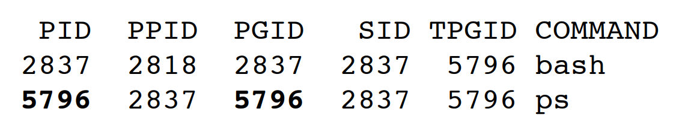

# 9. 프로세스 관계

## 9.1 소개

9장에서는 프로세스들 사이의 관계에 대해 조금 더 알아본다.
- 프로세스 그룹
- 세션(session)
- 로그인 셸과 프로세스 사이의 관계


## 9.2 터미널 로그인

터미널을 이용해서 유닉스 시스템에 로그인하는 데 쓰이는 절차를 설명

### BSD 터미널 로그인

- 시스템 관리자는 터미널 장치당 한 줄씩으로 이루어진 `/etc/ttys` 파일을 생성한다. 
이 파일은 장치 이름과 getty 프로그램에 전달할 매개변수들이 지정되어 있음.
- 그리고 시스템이 부팅될 때 커널은 프로세스 ID 가 1 인 init 프로세스를 생성한다. 
init 프로세스는 `/etc/ttys` 파일을 읽어서 로그인을 허용하는 각각의 터미널 장치마다 `fork-exec` 조합으로 getty 프로그램 실행


- 모든 프로세스의 실제 사용자 ID 와 유효 사용자 ID 모두 0 이고, 슈퍼사용자 특권을 가진다.
- getty 는 open 으로 터미널 장치를 읽기 및 쓰기용으로 연다. 
- 이후 getty 는 login: 과 같은 프롬프트를 출력하고 사용자가 로그인 이름을 입력하길 기다린다. 입력이 완료되면 getty 의 임무는 완료된다.
- getty 는 다음과 같은 호출을 통해서 login 프로그램 실행
- execle("/bin.login", "login", "-p", username, (char*)0, envp);

#### login 프로그램


- 사용자 이름을 알고 있어, `getpwnam` 을 호출해서 패스워드 파일의 사용자 항목을 조회할 수 있다. 
- 사용자 항목을 조회한 후에는 `getpass(3)` 를 호출해서 Password: 라는 프롬프트를 표시하고 사용자 패스워드를 입력받는다. 
- `crypt(3)` 를 호출해서 입력된 패스워드를 암호화하고, 그 결과를 그림자 패스워드 파일 항목의 pw_passwd 필드와 비교한다. 
만약 두 값이 일치하지 않으면 로그인이 실패하게 되고 이 상황이 반복되면 login 은 인수 1로 exit 를 호출한다. 
프로세스 종료가 부모인 init 프로세스에게 통지되며, 부모는 fork-exec 조합으로 getty 를 다시 실행해서 새로운 터미널을 띄우고 다시 시작한다.

- 로그인 성공시 login 은 다음과 같은 일을 수행한다.
	- 현재 작업 디렉터리를 사용자의 홈 디렉터리로 변경(chdir)
	- 사용자가 터미널 장치를 소유하도록 장치 소유권을 변경(chown)
	- 사용자가 터미널을 읽고 쓸 수 있도록 터미널 장치에 대한 접근 권한을 변경
	- `setgid`와 `initgroups`를 호출해서 사용자 그룹 ID 들을 변경
	- login 이 가진 모든 정보로 환경을 초기화. (홈 디렉터리(HOME), 셸(SHELL), 사용자 이름(USER 와 LOGNAME), 기본 경로(PATH))
	- 사용자의 사용자 ID 로 전환 후 사용자의 로그인 셸을 다음과 같은 형태로 띄운다.
	execl("/bin/sh", "-sh", (char*)0);

#### 로그인 셸
- 로그인 셸의 부모는 원래의 init 프로세스(프로세스 ID 1) 이다. 
따라서 로그인 셸이 종료되면 init 에게 그 사실이 SIGCHLD 신호에 의해 통지된다. 그러면 init 는 이 터미널에 대해 전체 절차를 다시 실행
- 사용자의 로그인 셸에 대한 파일 서술자 0,1,2 는 그 터미널 장치로 설정되고 시동 파일(.bash_profile, .bash_login 등)을 읽어 환경 변수를 재설정한다.


## 9.3 네트워크 로그인

직렬 터미널을 통해 시스템에 로그인하는 것과 네트워크를 통해 시스템에 로그인하는 것의 차이점은, 터미널과 컴퓨터 사이의 연결이 점대점(point-to-point)이 아니라는 것이다. 

앞서 설명한 터미널 로그인에서 init 은 로그인에 사용할 수 있는 터미널 장치들의 종류와 개수를 알고 있으면, 그런 상태에서 각 장치에 대해 getty 프로세스를 띄운다.
그러나 네트워크 로그인에서는 모든 로그인 요청이 커널의 네트워크 인터페이스 장치를 통해 들어오며, 요청이 몇 개나 될 것인지 미리 알 수 없다. 
하나의 프로세스로 모든 가능한 로그인을 기다리는 대신, 네트워크 연결 요청이 도달하기 기다려야 한다. 
터미널과 네트워크 로그인을 동일한 소프트웨어로 로그인을 처리할 수 게 하기 위해 `유사 터미널`이 존재

#### BSD 네트워크 로그인

BSD 에서는  `인터넷 슈퍼서버` 라고 부르는 inetd 라는 하나의 프로세스가 대부분의 네트워크 연결을 처리. 

- 시스템 시동 과정에서 init 는 셸 하나를 띄워서 셸 스크립트 /etc/rc 를 실행한다. 이 스크립트는 여러 개의 데몬을 실행하고, 그 중 하나가 inetd.
- 스크립트의 실행이 끝나면 init 가 inetd 의 부모 프로세스가 됨.
- inetd 는 호스트에 TCP/IP 연결 요청이 들어오길 기다리고, 요청이 들어오면 fork-exec 를 이용해서 적절한 프로그램을 실행한다.

##### TELNET 예시

- TELNET 서버에 대한 TCP 연결 요청이 도착
- 다음과 같은 TELNET 클라이언트를 실행하면 네트워크 로그인 절차 시작
telnet 호스트이름
- 이 명령에 의해, TELNET 클라이언트는 호스트이름으로 지정된 호스트에 대한 TCP 연결을 연다. 


- 위의 그림은 TELNET 서버 telnetd 의 실행에 관련된 일련의 프로세스이다.
- 이후 telnetd 프로세스는 유사 터미널 장치를 열고 fork 를 이용해서 두 개의 프로세스로 갈라진다. 부모는 계속해서 네트워크를 통한 통신을 처리, 자식은 exec 로 login 프로그램을 실행.
- exec 실행 전 자식은 파일 서술자를 0, 1, 2 를 유사 터미널로 설정
- 로그인에 성공했다면 이전의 과정처럼 초기 환경을 설정한다.


## 9.4 프로세스 그룹

#### 프로세스 그룹
 - 하나 이상의 프로세스들의 집합
 - 같은 작업(job)에 연관되어 있으며 같은 터미널로부터 신호를 받을 수 있는 프로세스들이 하나의 그룹에 묶임
 - 각 프로세스 그룹은 고유한 프로세스 그룹 ID 가 있음.
```c++
#include <unistd.h>
pid_t getpgrp(void); 
// 반환값: 호출 프로세스의 프로세스 그룹 ID

// 단일 UNIX 규격
#include <unistd.h>
pid_t getpgid(pid_t pid);
// 반환값: 프로세스 그룹 ID
```
- `getpgid(0)` == `getpgrp()`

#### 프로세스 그룹 리더

- 프로세스 그룹에는 하나의 프로세스 그룹 리더가 존재할 수 있음
- 프로세스 ID 가 프로세스 그룹 ID 와 동일한 프로세스가 리더
- 프로세스 그룹 리더는 프로세스 그룹을 생성 / 그룹 안에 프로세스들을 생성할 수 있음
- 프로세스 그룹이 존재하는 동안에도 리더가 종료되는 것이 가능하고, 리더가 없더라도 그룹 안에 프로세스가 하나라도 남아 있으면 그룹은 유지
- 프로세스 그룹 수명 - 그룹 생성된 시점 ~ 마지막 프로세스가 그룹을 떠날 때 까지
- 프로세스가 기존의 프로세스 그룹에 들어가거나 새 프로세스 그룹을 만들 때에는 다음 함수를 호출
```c++
#include <unistd.h>
int setpgid(pid_t pid, pid_t pgid);
// 반환값: 성공 시 0, 오류 시 -1
```
- 프로세스 ID 가 pid 인 프로세스의 프로세스 그룹 ID 를 pgid 로 설정
- `pid == pgid` 일 시 pid 에 해당하는 프로세스는 리더가 됨.
- `pid == 0` 일 시 호출자의 프로세스 ID 가 쓰임
- `pgid == 0` 일 시 pid 로 지정된 프로세스 ID 가 프로세스 그룹 ID 로 쓰임.

- 한 프로세스는 오직 자신 또는 자신의 자식 프로세스의 프로세스 그룹 ID 만 설정할 수 있음.
- 하지만 exec 류 함수를 호출한 자식 프로세스의 프로세스 그룹 ID 는 변경할 수 없음.
- 따라서 대부분의 작업 제어 셸은 fork 이후 부모가 이 함수를 호출해서 자식의 프로세스 그룹 ID 를 설정 / 자식 역시 이 함수를 호출해서 자신의 프로세스 그룹 ID 를 설정
이 과정에서 호출 하나는 중복이 되지만, 부모 자식 실행 순서에 상관없이 항상 자식이 자신의 프로세스 그룹 ID 를 설정


## 9.5 세션

- 세션은 하나 이상의 프로세스 그룹들의 집합
- 셸 파이프라인을 통해서 프로세스들이 하나의 프로세스 그룹을 형성. 
- 아래의 명령으로 그림과 같은 세션이 만들어진다.
```
proc1 | proc2 &
proc3 | proc4 | proc5
```


- 프로세스가 새 세션을 만들 때에는 다음 함수를 호출
```c++
#include <unistd.h>
pid_t setsid(void);
// 반환값: 성공 시 프로세스 그룹 ID, 오류 시 -1
```
- 호출 프로세스가 프로세스 그룹 리더가 아니면, 새 세션을 생성
1. 호출 프로세스가 새 세션의 세션 리더가 된다. (즉, 세션 리더는 세션을 생성한 프로세스). 이때 세션에는 하나의 프로세스만 존재
2. 호출 프로세스는 새 프로세스 그룹의 프로세스 그룹 리더가 된다. 새 프로세스 그룹의 ID 는 호출 프로세스 ID
3. 호출 프로세스에는 제어 터미널이 없다. 

- 호출자가 이미 프로세스 그룹 리더면 오류 발생.
- 이와 같은 상황이 발생하지 않도록, fork 호출 후 부모를 종료하고 자식은 계속 실행되게 한다. 이렇게 하면 자식이 프로세스 그룹 리더가 되는 일이 없다. 
부모의 프로세스 그룹 ID가 자식에게 상속되지만, 자식의 프로세스 ID 는 새로운 ID 이므로, 자식의 프로세스 ID 가 상속된 프로세스 그룹 ID 와 다름.

- 프로세스가 속한 세션의 세션 리더의 프로세스 그룹 ID 는 다음 함수로 알 수 있다.
```c++
#include <unistd.h>
pid_t getsid(pid_t pid);
// 반환값: 성공 시 세션 리더의 프로세스 그룹 ID, 오류 시 -1
// pid == 0 이면 호출 프로세스의 세션 리더의 프로세스 그룹 ID를 리턴
```


## 9.6 제어 터미널

- 세션에 하나의 `제어 터미널` 이 연결될 수 있다. 보통의 경우 제어 터미널은 사용자가 로그인한 터미널 장치 or 유사 터미널 장치
- 제어 터미널과 연결을 확립한 세션 리더를 `제어 프로세스`라고 부른다.
- 세션 안의 프로세스 그룹들은 하나의 `전경(foreground) 프로세스 그룹`과 하나 이상의 `배경(background) 프로세스 그룹` 으로 나뉜다.
- 세션에 제어 터미널이 존재하면, 그 세션에는 반드시 하나의 전경 프로세스 그룹이 존재, 그 외의 그룹은 배경 프로세스 그룹
- 터미널의 가로채기 키(DELETE or Ctrl-C) 를 누르면 전경 프로세스 그룹의 모든 프로세스에 가로채기 신호가 전송
- 터미널의 중지(quit) 키(Ctrl-\) 를 누르면 전경 프로세스 그룹의 모든 프로세스에 중지 신호 전송
- 모뎀(or 네트워크)이 끊어졌음을 터미널 장치가 인식하면 제어 프로세스(세션리더)에 단절(hang-up) 신호가 전송
- 보통의 경우 사용자가 제어 터미널을 신경쓰지 않아도 됨. 로그인 시 자동으로 연결


- 프로그램이 제어 터미널과 통신하고 있음을 보장하는 방법은 /dev/tty 파일을 open 으로 여는 것이다. 제어 터미널이 없는 프로그램에서 이 장치 파일을 열려고 하면 open 호출이 실패.


## 9.7 tcgetpgrp, tcsetpgrp, tcgetsid 함수

- 터미널 장치 구동기가 터미널 입력과 터미널에서 발생한 신호들을 전경 프로세스 그룹에 보낼려면, 어떤 프로세스 그룹이 전경 프로세스 그룹인지 알아야 한다. 전경 프로세스 그룹을 조회하고 설정하는 함수는 다음과 같다.

```c++
#include <unistd.h>
pid_t tcgetpgrp(int fd);
// 반환값: 성공 시 전경 프로세스 그룹의 프로세스 그룹 ID, 오류 시 -1

int tcsetpgrp(int fd, pid_t pgrpid);
// 반환값: 성공 시 0, 오류 시 -1
```
```c++
#include <termios.h>
pid_t tcgetsid(int fd);
// 반환값: 성공 시 세션 리더의 프로세스 그룹 ID, 오류 시 -1
```

- `tcgetpgrp` : fd 에 대해 열려 있는 터미널에 연관된 전경 프로세스 그룹의 프로세스 그룹 ID 를 리턴
- `tcsetpgrp` : 제어 터미널을 가진 프로세스는 이를 호출하여 전경 프로세스 그룹을 설정할 수 있음.
	- 호출 성공 시 프로세스 그룹 ID 가 pgrpid 인수와 같은 프로세스 그룹이 전경 프로세스 그룹으로 설정됨.
	- pgrpid 의 값은  반드시 같은 세션 안의 한 프로세스 그룹의 프로세스 그룹 ID 
	- fd 는 반드시 그 세션의 제어 터미널에 대한 파일 서술자
- `tcgetsid` : 특정 제어 터미널에 연관된 세션 리더의 프로세스 그룹 ID 를 알고 싶을 때 호출


## 9.8 작업 제어

- 작업 제어(job control) 기능을 이용하면 하나의 터미널에서 여러 개의 작업(프로세스 그룹) 을 시작할 수 있다. 
또한 특정 작업이 터미널에 접근할 수 있게 만들거나 배경에서 실행되게 만들 수 있다.
- 작업 제어를 위해 다음과 같은 조건을 만족해야 한다.
1. 작업 제어를 지원하는 셸이 존재
2. 커널의 터미널 구동기가 작업 제를 지원어
3. 커널이 특정 작업 제어 신호들을 지원

- 셸에서 작업 제어를 사용할 때에는 하나의 작업을 전경에서 시작할 수도 있고, 배경에서 시작할 수도 있다.
작업이란 그냥 프로세스들의 집합으로, 파이프라인으로 연결된 프로세스들인 경우가 많음.
```
하나의 프로세스로 구성된 작업을 전경에서 시작하는 명령
vi main.c 

두 개의 작업을 배경에서 시작하는 명령
pr *.c | lpr &
make all & 
```

- 사용자가 셸에서 배경 작업을 시작하면 셸은 그 작업에 작업 식별 번호를 부여하고 그 번호와 하나 이상의 프로세스 ID 들을 출력한다.
- 아래의 예에서 make 작업 번호는 1 이고 시작 프로세스 ID 는 1475 이다.  그 다음 파이프라인 작업 번호는 2이고 첫 프로세스의 프로세스 ID 는 1490 이다. 
```
$ make all > Make.out &
[1]		1475
& pr *.c | lpr &
[2]		1490
&
[2]	+	Done	pr *.c | lpr &
[1]	+	Done	make all > Make.out &
```

- 전경 작업에 영향을 미치는 터미널 특수 문자가 입력되면 작업과 터미널 구동기 사이의 상호 작업이 발생
- 터미널 구동기는 다음과 같이 세 종류의 특수 문자를 감지해서 적절한 신호를 전경 프로세스 그룹에 보낸다.
	- 가로채기 문자(DELETE  or Ctrl-C) 는 SIGINT 신호를 발생
	- 중지 문자(Ctrl-\) 는 SIGQUIT 신호를 발생
	- 일시정지 문자(Ctrl-Z) 는 SIGTSTP 신호를 발생

- 사용자가 터미널에 입력한 내용은 오직 전경 작업만 받는다. 배경 작업이 터미널을 읽으려고 해도 오류가 발생하지 않고, 대신 터미널 구동기는 그러한 사실을 감지하고 배경 작업에게 `SIGTTIN` 이라는 신호를 보낸다. 보통의 경우 이 신호에 의해 배경 작업이 정지된다. 
셸을 사용하는 경우 사용자에게 이 사건이 통지되며, 사용자는 해당 배경 작업을 전경으로 가져와서 터미널로부터 입력을 읽을 수 있게 만들 수 있다.

```
$ cat > temp.foo & // 배경에서 시작되지만 표준 입력을 읽으려 한다.
[1]		1681
$
[1]	+	Stopped (SIGTTIN)	cat > temp.foo &
$ fg %1			// 1번 작업을 전경으로 가져온다
cat > temp.foo 	// 셸이 현재 어떤 작업이 전경 작업인지 알려준다
hello, world 	// 한줄을 입력
^D 				// 파일 끝(EOF) 문자를 입력
$ cat temp.foo	// 그 한 줄이 파일에 기록되었는지 확인
hello, world
```
- 위의 예는 cat 명령을 배경에서 시작하나, cat 은 자신의 표준 입력(제어 터미널)을 읽으려 함.
- cat 이 배경 작업임을 알고 있는 터미널 구동기가 SIGTTIN 신호를 배경 작업에 보낸다.
- 셸은 그 작업이 정지되었음을 사용자에게 알려주고, 사용자는 정지된 작업을 fg 명령을 통해 전경으로 가져온다.
- 셸은 그 작업을 전경 프로세스 그룹으로 옮기고(tcsetpgrp) 그 프로세스 그룹에게 실행 재개 신호(SIGCONT) 신호 보낸다.
- 이후 cat 은 전경 프로세스 그룹에 있으므로 제어 터미널로부터 입력을 읽어 들일 수 있다.

시스템은 배경 작업이 자신의 출력을 제어 터미널에 보내는 옵션을 제공한다. `stty(1)` 명령을 이용해서 설정 한다.
```
$ cat temp.foo &	// 배경에서 실행
[1]		1719
$ hello, world		// 배경 작업의 출력이 프롬프트 이후에 나타남

[1]	+	Done	cat temp.foo &
$ stty tostop		// 배경 작업이 제어 터미널에 출력하지 못하게 함
$ cat temp.foo &	// 다시 배경 작업 출력을 시도
[1]		1721
$
[1]	+	Stopped(SIGTTOU)	cat temp.foo &
$ fg %1				// 정지된 작업을 전경에서 재개
cat temp.foo		
hello, world		// 작업의 출력
```

- 배경 작업이 제어 터미널에 출력하지 못하게 설정하면 cat 은 표준 출력에 대한 기록이 가능해질 때까지 차단
해당 출력이 배경 프로세스에서 온 것임을 인지하고 SIGTTOU 신호를 보내기 때문.
fg 명령으로 전경으로 가져오면 출력할 수 있게 된다.

- 다음 그림은 작업 제어의 몇 가지 기능들을 요약한 것이다. 


## 9.9 셸의 프로그램 실행

셸이 프로그램이 어떻게 실행하는지 예시를 보며 알아보자

#### 작업 제어 지원하지 않는 셸

우선 작업 제어를 지원하지 않는 셸에서 ps 명령을 하면 다음과 같다.

```
ps -o pid,ppid,pgid,sid,comm
```


- ps 명령의 부모는 셸임을 알 수 있고, 셸과 ps 명령은 동일한 세션 및 전경 프로세스 그룹(949)에 있다. 

동일한 명령을 배경에서 실행하면 다음과 같다.
```
ps -o pid,ppid,pgid,sid,comm &
```


- ps 명령의 프로세스 ID 만 변경되었다.

그리고 셸이 파이프라인을 처리하는 법은 다음과 같다.

```
ps -o pid,ppid,pgid,sid,comm | cat1
// cat1 은 cat 프로그램의 복사본
```


- 파이프라인의 마지막 프로세스(cat1)는 셸의 자식인 반면 첫 프로세스(ps)는 마지막 프로세스의 자식이 된다.
- 셸은 fork 로 자신의 복사본을 띄우고, 그 복사본이 다시 fork 로 파이프라인의 이전 프로세스들 각각을 실행


위 명령을 배경에서 실행하면 달라지는 것은 프로세스 ID 들 뿐이다. ( 셸이 작업 제어 지원 X ) 
```
ps -o pid,ppid,pgid,sid,comm | cat1 &
```

이 셸에서 배경 프로세스가 제어 터미널에서 입력을 읽으려 하면 다음과 같다.
```
cat > temp.foo &
```
- 작업 제어 셸이라면 배경 작업을 배경 프로세스 그룹에 넣고, 배경 작업이 제어 터미널을 읽으려 하면 SIGTTIN 신호가 발생할 것이다. 
- 하지만 작업 제어를 지원하지 않는 셸은 배경 프로세스의 표준 입력을 /dev/null 로 재지정한다. 이를 읽으면 파일 끝이 반환되고, 배경 cat 프로세스는 즉시 파일 끝에 도달해서 정상적으로 종료된다.

다음과 같이 파이프라인으로 세 개의 프로세스를 실행해보면 다음과 같다.
```
ps -o pid,ppid,pgid,sid,comm | cat1 | cat2
```


- 파이프라인의 마지막 프로세스는 셸의 자식이고, 그 이전 프로세스들은 모두 마지막 프로세스의 자식이다.


- 하지만 다음처럼 나올 수도 있음
이는 ps 프로세스와 셸 사이에 경쟁 조건이 발생해서 이다. 셸이 fork-exec 로 cat 명령을 실행했지만 exec 호출이 끝나지 않은 시점에 ps가 출력할 프로세스 목록을 얻었기 때문이다.


#### 작업 제어 지원하는 셸

작업 제어 지원하는 셸에서 아래 명령을 실행하면 다음과 같다.
```
ps -o pid,ppid,pgid,sid,tpgid,comm
```


(전경 프로세스는 굵은 글씨)

- 이번 예제의 셸은 전경 작업(ps)을 개별적인 프로세스 그룹(5796) 에 넣는다. ps 명령이 그 프로세스 그룹의 리더이자,  그 그룹의 유일한 프로세스이다. 그리고 이 프로세스 그룹은 제어 터미널을 가지고 있어 전경 프로세스 그룹이다. ps 명령이 실행되는 동안 로그인 셸은 배경 프로세스 그룹에 있다. 그러나 두 프로세스 그룹(2837, 5796) 모두 같은 세션이다.

이를 배경에서 실행하면 다음과 같다.
```
ps -o pid,ppid,pgid,sid,tpgid,comm &
```


- ps 명령은 자신만의 프로세스 그룹에 들어갔지만, 그 프로세스 그룹(5797)은 배경 프로세스 그룹이다. TPGID 가 2837이라는 점은 전경 프로세스 그룹이 로그인 셸임을 뜻한다..


하나의 파이프라인으로 두 개의 프로세스를 실행하면 다음과 같다.
```
ps -o pid,ppid,pgid,sid,tpgid,comm | cat1
```


- ps 와 cat1 둘 다 새로운 프로세스 그룹(5799)에 들어갔고, 이 그룹은 전경 프로세스 그룹이다.
- 이전의 예에선 파이프라인 마지막 프로세스를 먼저 생성 후, 첫 프로세스는 그 프로세스의 자식이었다.
이번 예는 두 프로세스 모두 셸 자체의 자식이다. 

이를 배경에서 실행하면 다음과 같다.
```
ps -o pid,ppid,pgid,sid,tpgid,comm | cat1 &
```


- 앞과 비슷한 결과가 나오나, ps 와 cat1 이 같은 프로세스 그룹에 존재한다. 


## 9.10 고아 프로세스 그룹


부모가 먼저 종료된 프로세스를 고아 프로세스(orphan process) 라고 부르고, 고아 프로세스가 init 프로세스의 자식이 된다는 점은 이전에 배웠다. 이번 절에서는 하나의 프로세스 그룹 전체가 고아가 될 수 있다는 점을 배운다.

#### 예제

fork 로 자식 하나를 생성 후 종료되는 프로세스가 존재한다고 하자. 
그런데 자식이 정지된 상태에서 부모가 종료되면 다음 그림과 같다.


- 위의 그림은 부모 프로세스는 fork 로 자식을 생성했고, 그 자식 프로세스는 부모가 종료되기 전에 정지 되었다.

```c++
#include "apue.h"
#include <errno.h>

static void sig_hup(int signo)
{
	printf("SIGHUP received, pid = %ld\n", (long)getpid());
}
static void pr_ids(char *name)
{
	printf("%s: pid = %ld, ppid = %ld, pgrp = %ld, tpgrp = %ld\n",
		name, (long)getpid(), (long)getppid(), (long)getpgrp(),
		(long)tcgetpgrp(STDIN_FILENO));
	fflush(stdout);
}

int main(void)
{
	char c;
	pid_t pid;
	pr_ids("parent");
	if((pid = fork()) < 0) {
		err_sys("fork error");
	} else if(pid > 0) { // 부모
		sleep(5); // 자식이 스스로 정지하도록 sleep
	} else { // 자식
		pr_ids("child");
		signal(SIGHUP, sig_hup); // 신호 처리부를 설정
		kill(getpid(), SIGTSTP); // 스스로 정지
		pr_ids("child");
		if(read(STDIN_FILENO, &c, 1) != 1)
			printf("read error %d on controlling TTY\n", errno);
	}
	exit(0);
}
```

예시를 보면, 셸은 전경 프로세스들을 개별적인 프로세스 그룹(6099) 에 넣되 셸 자신의 자신만의 프로세스 그룹(2837)에 남는다. 자식은 부모의 프로세스 그룹(6099)을 물려받는다. 
fork 이후 일어나는 일은 다음과 같다.

- 부모가 5초가 수면 ( 부모가 종료되기 전에 자식이 실행되게 만들기 위한 방법)
- 그 사이에 자식은 단절 신호(SIGHUP)를 위한 신호 처리부 설정 (신호가 자식에게 전송되었는지 확인, 10장)
- 자식은 kill 함수를 이용해서 자신에게 정지 신호(SIGTSTP)를 보내고 자식은 정지된다.
- 부모가 종료되면 자식은 고아가 되며, 따라서 자식의 부모 프로세스 ID 는 init 프로세스 ID 인 1이 된다.
- 이 시점에서 자식은 `고아가 된 프로세스 그룹(orphaned process group), 고아프로세스 그룹`의 일원이 된다.
고아 프로세스 그룹은 그룹의 모든 구성원의 부모가 그 그룹의 프로세스이거나 그 그룹과는 다른 세션에 있는 어떤 그룹의 프로세스인 그룹이다. 
그룹의 프로세스들 중 하나라도 부모가 같은 세션의 다른 어떤 프로세스 그룹에 있으면 그 그룹은 고아가 아니다.

- 프로세스 그룹은 부모가 종료되면 고아가 되며, 프로세스 그룹에는 정지된 프로세스들이 존재하므로,  새로 고아가 된 프로세스 그룹의 모든 프로세스에 반드시 단절 신호( SIGHUP)와 재개 신호(SIGCONT)가 차례대로 전송되어야 한다.
- 이에 의해, 단절 신호가 처리된 후 자식의 실행이 재개된다.


위의 결과를 분석하면 다음과 같다.

- 셸 프롬프트가 자식의 출력과 함께 나타났다. 이는 두 개의 프로세스(로그인 셸과 자식)가 터미널에 대해 쓰기 연산을 수행하기 때문이다.
- 자식의 부모 프로세스 ID 는 1이 되었다.
- 자식에서 pr_ids 를 호출 후 프로그램은 표준 입력을 읽으려한다. 
배경 프로세스 그룹의 프로세스가 자신의 제어 터미널을 읽으려 하면 배경 프로세스 그룹에서 SIGTTIN 신호가 전송되는데, 지금은 프로세스 그룹이 고아가 된 상태이다. 만일 커널이 그 신호로 그룹을 정지하려 한다면 프로세스 그룹의 프로세스들은 결코 재개될 수 없다. 
이를 피하기 위해, 이런 상황에서 read 가 erron 를 EIO(5) 로 설정하고 오류를 반환한다.


## 9.11 FreeBSD 구현

이번 절에서는 FreeBSD 에 쓰이는 구현을 소개한다.


- `session` 구조체
	- 각 세션마다 할당되는 구조체이다. ( setsid 가 호출될 때마다)
	- `s_count` : 세션의 프로세스 그룹 개수, 0이 되면 구조체가 해제될 수 있음
	- `s_leader` : 세션 리더의 proc 구조체를 가리키는 포인터
	- `s_ttyvp` : 제어 터미널의 vnode 구조체를 가리키는 포인터
	- `s_ttyp` : 제어 터미널의 tty 구조체를 가리키는 포인터
	- `s_sid` : 세션 ID

- `tty` 구조체
	- 각각의 터미널 장치와 각각의 유사 터미널 장치마다 이 구조체가 있다.
	- `t_session` : 이 터미널을 제어 터미널로 둔 session 구조체를 가리킨다.
	- `t_pgrp` : 전경 프로세스 그룹의 pgrp 구조체를 가리키는 포인터
	- `t_termios` : 모든 특수 문자와 기타 관련 정보를 담는 구조체, 18장
	- `t_winsize` : 터미널 창의 현재 크기를 담은 winsize 구조체

커널이 특정 세션의 전경 프로세스 그룹을 알아내는 과정은 다음과 같다.
- 우선 session 구조체의 s_ttyp 필드를 따라가서 제어 터미널 tty 구조체를 얻는다.
- 그 구조체의 t_pgrp 필드를 따라가서 전경 프로세스 그룹의 pgrp 구조체를 얻는다.
- pgrp 구조체에는 해당 프로세스 그룹의 정보가 들어있다.
	- `pg_id` :  프로세스 그룹 ID
	- `pg_session` : 이 프로세스 그룹이 속한 세션의 session 구조체를 가리킨다.
	- `pg_members` : 이 프로세스 그룹에 속한 프로세스들의 proc 구조체들의 목록을 가리킨다.

- proc 구조체는 하나의 프로세스에 대한 정보가 들어있다.
	- `p_pid` : 프로세스 Id
	- `p_pptr` : 부모 프로세스의 proc 구조체를 가리키는 포인터
	- `p_pgrp` : 이 프로세스가 속한 프로세스 그룹의 pgrp 구조체를 가리킨다.
	- `p_pglist` : 프로세스 그룹의 이전, 다음 프로세스를 가리키는 포인터


