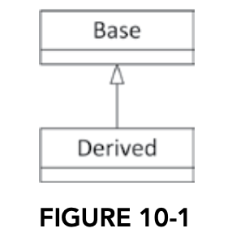
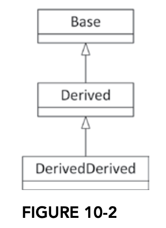
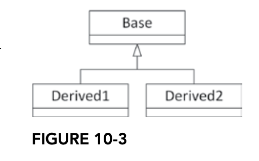
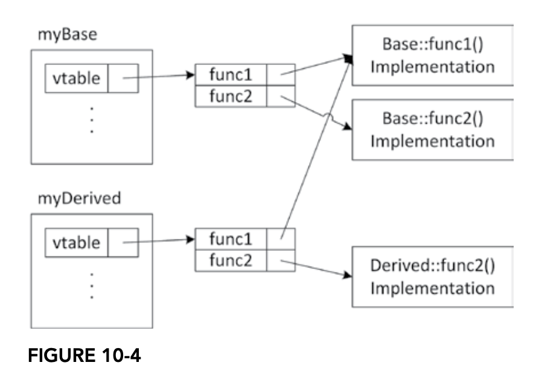
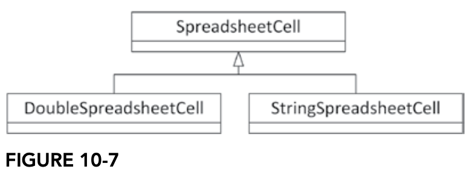
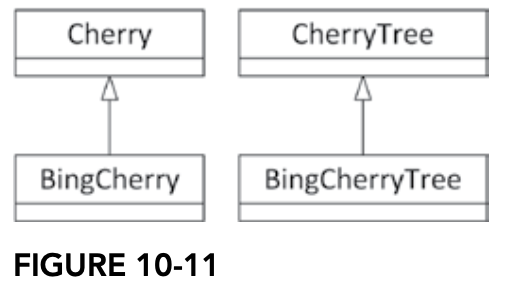

# 목록
### 10. 상속 활용하기
#### [10.1 상속을 이용한 클래스 구현](#101-상속을-이용한-클래스-구현-1)
#### [10.2 코드 재사용을 위한 상속](#102-코드-재사용을-위한-상속-1)
#### [10.3 부모를 공경하라](#103-부모를-공경하라-1)
#### [10.4 다형성을 위한 상속](#104-다형성을-위한-상속-1)
#### [10.5 다중 상속](#105-다중-상속-1)
#### [10.6 상속에 관련된 미묘하면서 흥미로운 문제들](#106-상속에-관련된-미묘하면서-흥미로운-문제들-1)
#### [10.7 캐스트](#107-캐스트-1)
### [11. c++ 의 까다롭고 유별난 부분]()
#### [11.1 모듈]()
#### [11.2 헤더 파일]()
#### [11.3 언어 핵심 기능에 대한 테스트 매크로]()
#### [11.4 static 키워드]()
#### [11.5 C 유틸리티]()

# 10. 상속 활용하기
 - 클래스는 재사용하거나 확장 가능한 컴포넌트
 - 상속의 강력함을 활용하기 위한 여러가지 방법 소개
 - 구체적 문법 + 고급 테크닉 소개

## 10.1 상속을 이용한 클래스 구현
 - 상속은 두 클래스 간에 실제 세계에서 관찰되는 **"is-a"** 관계를 프로그래밍에 적용한 것
 - 코드 복사 대신 상속을 사용하여 기존 클래스를 기반으로 새 클래스 정의 가능
 - 상속하지 않고 복사를 한다면
   - 원본 클래스에 대한 수정이 새 클래스에 반영 안됨
   - 두 클래스간의 관계를 컴파일러가 모름
   - is-a 관계가 아님
   - 원래 코드에 접근할 수 없는 경우 복사 불가능

### 10.1.1 클래스 확장하기
 - 파생 클래스는 기존 클래스의 데이터를 상속받고, 자신의 고유 메서드와 데이터를 추가 정의 가능
 - 원본 클래스를 **parent class(base class, super class)** 라 부름
 - 상속 받은 클래스를 **child class(derrived class, subclass)** 라 부름

```c++
// 기본 클래스 예시
class Base {
public:
    void someMethod() {}
protected:
    int m_protectedInt { 0 };
private:
    int m_privateInt { 0 };
};

// 파생 클래스 예시
class Derived : public Base {
public:
    void someOtherMethod() {}
};
```




#### 클라이언트 입장에서 본 상속
 - 파생 클래스는 기본 클래스의 `public` 및 `protected`멤버에 접근 가능
 - `private`멤버는 상속되지 않음.
 - 상속은 한 방향으로만 작동, 파생 클래스는 기본 클래스의 데이터 사용가능하지만, 기본 클래스는 파생 클래스의 데이터를 모름
 - 객체에 대한 포인터나 레퍼런스 타입은 객체의 선언문에 나온 클래스뿐만 아니라 그 클래스의 파생 클래스 타입으로 지정 가능

#### 파생 클래스 입장에서 본 상속
|**접근 제한자**|**의미**|**용도**|
|------------|-------|-------|
| `public` | 객체의 `public` 멤버 함수나 데이터 멤버는 누구나 접근 가능 | 클라이언트가 사용할 메서드. `private`또는 `protected` 데이터 멤버에 대한 접근 메서드 |
| `protected` | `protected` 멤버 함수나 데이터 멤버는 같은 클래스로 된 객체의 멤버 함수로 접근할 수 있다. 또한 파생 클래스의 멤버 함수는 베이스 클래스의 `proected` 멤버에 접근할 수 있다. | 외부 클라이언트가 사용하면 안 되는 헬퍼 메서드에 적용한다. |
| `private` | `privated` 멤버 함수나 데이터 멤버는 같은 클래스의 멤버 함수로만 접근할 수 있다. 파생 클래스의 멤버 함수는 베이스 클래스의 `private` 멤버에 접근할 수 없다. | 기본적으로 모두 `private` 로 지정한다. 특히 데이터 멤버라면 반드시 `priavte`로 지정한다. 파생 클래스만 게터나 세터에 접근하게 하려면 `protected`로 지정하고, 외부 클라이언트도 접근하게 하려면 `public` 으로 지정한다. |

#### 상속 방지
 - `final`키워드를 사용하여 클래스를 상속 금지할 수 있음
```c++
class Foo final {};
```

### 10.1.2 메서드 오버라이딩
 - 메서드 오버라이딩은 상속받은 클래스에서 기본 클래스의 메서드를 재정의(override)하여 다른 동작을 수행하도록 만드는 것
 - 이를 통해 클래스의 동작을 변경하거나 확장 가능

#### `virtual` 키워드
 - C++에서 기본 클래스의 메서드에 `virtual` 키워드를 사용하면, 해당 메서드는 파생 클래스에서 재정의

```c++
// 기본 클래스의 메서드를 정의
class Base {
public:
    virtual void someMethod() {}
};

// 파생 클래스에서 재정의
class Derived : public Base {
public:
    virtual void someOtherMethod();
};
```

#### 메서드 오버라이딩 문법
 - 파생 클래스에서 메서드를 재정의할 때, 원래 기본 클래스의 메서드를 정확히 재정의하는지 확인하는 키워드
   - 잘못된 오버라이딩 방지.
   - 기본 클래스의 메서드와 다른 시그니처를 가진 메서드가 새롭게 정의되는 것을 방지

```c++
void Base::someMethod() {
    cout << "This is Base's version of someMethod()." << endl;
}

class Derived : public Base {
    public:
        void someMethod() override; // Base의 someMethod() 오버라이딩
        virtual void someOtherMethod();
}
```

#### 클라이언트 관점에서 본 오버라이드한 메서드
 - 포인터나 레퍼런스는 해당 클래스뿐만 아니라 파생클래스 객체까지 가리킬 수 있음.
 - 객체 자신은 멤버가 어느 클래스에 속하는지 알기 때문에 `virtual` 로 선언되었다면 가장 적합한 메서드 호출.
 - 베이스 클래스 타입의 레퍼런스나 포인터가 실제로 파생 클래스 타입 객체를 가리킨다 해도 베이스 클래스에 정의되지 않은 파생 클래스의 데이터 멤버나 메서드는 접근 불가

```c++
Base myBase;
myBase.someMethod(); // Base 에 정의된 someMethod() 호출

Derived myDerived;
myDerived.someMethod(); // Derived 버전의 someMethod() 호출

Base& ref { myDerived };
ref.someMethod(); // Derived 버전의 someMethod() 호출

myDerived.someOtherMethod(); // 정상작동
ref.someOtherMethod(); // 에러

Base assignedObject { myDerived };
assignedObject.someMethod(); // Base 버전의 someMethod() 호출
```

#### override 키워드
 - `override` 키워드가 없어도 virtual method 는 정상적으로 오버라이드
 - 그러나 매개변수가 잘못되거나 했을 경우 잘못된 오버라이딩 발생.
 - `override` 키워드가 있다면 컴파일 에러 발생

#### virtual 메서드
 - `virtual` 키워드 없이 메서드를 선언하면, 파생 클래스에서 동일한 이름으로 메서드를 선언해도 오버라이딩이 아니라 기본 클래스의 메서드를 숨기는 효과만 발생
 - 기본 클래스의 메서드와 파생 클래스의 메서드가 독립적으로 존재

```c++
class Base {
public:
    void go() {
        cout << "Base's go()" << endl;
    }
};

class Derived : public Base {
public:
    void go() {
        cout << "Derived's go()" << endl;
    }
};

Base* obj = new Derived();
obj->go(); // 출력: "Base's go()"
```

 - `virtual` 로 선언하지 않은 메서드를 호출하는 부분은 컴파일 시간에 결정된 타입의 코드로 교체. (`static binding`, `early binding`)
 - `virtual` 메서드를 가진 클래스는 내부적으로 가상 함수 테이블(vtable)을 생성
 - 테이블에는 각 메서드의 포인터가 저장되어, 런타임에 호출할 메서드가 동적으로 결정. (`dynamic binding`, `late binding`)
   - 다형성을 구현
   - 오버라이딩된 메서드가 런타임에서 호출

```c++
class Base {
public:
    virtual void func() {
        cout << "Base func()" << endl;
    }
};

class Derived : public Base {
public:
    void func() override {
        cout << "Derived func()" << endl;
    }
};

Base* obj = new Derived();
obj->func(); // 출력: "Derived func()"
```



 - c++ 에서는 vtable 의 오버헤드를 줄이기 위해서 따로 `virtual` 키워드를 명시적으로 붙이도록 함
 - `viatual` 메서드를 호출하려면 포인터 역참조가 필요.
 - 프로그래머가 이런 성능 오버헤드 효과 여부를 결정할 수 있도록 함
   - 특정 사례 혹은 메모리 부분에서 `virtual` 로 선언하지 않는 편이 나을 때도 있음

 - 기본 클래스의 소멸자가 `virtual` 로 선언되지 않으면, 파생 클래스의 소멸자가 호출되지 않아 메모리 누수 발생 가능
 - 소멸자에서 따로 처리할 일은 없늗네 `virtual` 로만 설정하고 싶다면 명시적 디폴트 소멸자를 선언
```c++
class Base {
public:
    virtual ~Base() {
        cout << "Base destructor" << endl;
    }
    /* 할일이 없을 경우
    * virtual Base() = default;
    */ 
};

class Derived : public Base {
public:
    ~Derived() {
        cout << "Derived destructor" << endl;
    }
};

Base* obj = new Derived();
delete obj; // 출력: "Derived destructor" -> "Base destructor"
```

 - 특정 메서드를 더 이상 파생 클래스에서 오버라이딩하지 못하도록 설정하려면 `final` 키워드 사용

```c++
class Base {
public:
    virtual void func() final {
        cout << "Base func()" << endl;
    }
};

class Derived : public Base {
public:
    void func() override; // 오류: func()는 final로 선언됨.
};
```

## 10.2 코드 재사용을 위한 상속

### 10.2.1 WeatherPrediction 클래스
```c++
export class WeatherPrediction {
public:
    virtual ~WeatherPrediction();
    virtual void setCurrentTempFahrenheit(int temp);
    virtual void setPositionOfJupiter(int distanceFromMars);
    virtual int getTomorrowTempFahrenheit() const;
    virtual double getChanceOfRain() const;
    virtual void showResult() const;

private:
    int m_currentTempFahrenheit { 0 };
    int m_distanceFromMars { 0 };
};
```
 - 화씨와 섭씨 온도를 사용하여 날씨 예측
 - 컴파일된 바이너라 파일로 배포된다 가정.
   - 온도는 화씨로만 지원, 섭씨를 추가로 지원해야 함
   - `showResult()`메서드는 결과를 충분히 사용자 친화적으로 표시하지 않았을 수 있음

### 10.2.2 파생 클래스에 기능 추가하기
```c++
export class MyWeatherPrediction : public WeatherPrediction {
public:
    virtual void setCurrentTempCelsius(int temp);
    virtual int getTomorrowTempCelsius() const;

private:
    static int convertCelsiusToFahrenheit(int celsius);
    static int convertFahrenheitToCelsius(int fahrenheit);
};

void MyWeatherPrediction::setCurrentTempCelsius(int temp) {
    int fahrenheitTemp { convertCelsiusToFahrenheit(temp) };
    setCurrentTempFahrenheit(fahrenheitTemp);
}

int MyWeatherPrediction::getTomorrowTempCelsius() const {
    int fahrenheitTemp { getTomorrowTempFahrenheit() };
    return convertFahrenheitToCelsius(fahrenheitTemp);
}

```
 - 새로운 클래스 정의
   - `WeatherPrediction` 클래스를 상속하여 새로운 클래스 `MyWeatherPrediction`을 정의
   - 추가적인 기능 구현을 하여 섭씨 온도를 지원하도록 확장
 - 새로 추가된 메서드
   - 섭씨 온도를 설정하고 반환하기 위한 메서드
 - 기존 `WeatherPrediction` 클래스의 기능을 래핑하여 섭씨를 지원하는 새로운 인터페이스 제공

### 10.2.3 파생 클래스에서 기존 기능 변경하기
```c++
export class MyWeatherPrediction : public WeatherPrediction {
public:
    virtual void setCurrentTempCelsius(int temp);
    virtual int getTomorrowTempCelsius() const;
    void showResult() const override;
private:
    static int convertCelsiusToFahrenheit(int celsius);
    static int convertFahrenheitToCelsius(int fahrenheit);
};

void MyWeatherPrediction::showResult() const override {
    cout << format("Tomorrow will be {} degrees Celsius ({} degrees Fahrenheit)",
                   getTomorrowTempCelsius(), getTomorrowTempFahrenheit()) << endl;
    cout << format("Chance of rain is {}%", getChanceOfRain() * 100) << endl;
    if (getChanceOfRain() > 0.5) {
        cout << "Bring an umbrella!" << endl;
    }
}
```
 - 기존 기능 재정의
   - `showResult` 메서드를 재정의하여 더 사용자 친화적인 출력 형식을 제공
   - 기존 `WeatherPrediction` 클래스의 제한적인 출력 방식을 개선.
   - 새로운 `MyWeatherPrediction` 클래스는 특정 요구사항에 맞춘 새 기능으로 확장, 기존 코드의 많은 부분을 재사용
  
## 10.3 부모를 공경하라
### 10.3.1 부모 클래스의 생성자
 1. 생성자 호출 순서
    - 기본 클래스 생성자: 기본 클래스의 생성자가 먼저 호출. `ctor-initializer` 를 통해 명시적으로 호출하지 않는 경우 기본 생성자가 사용
    - 멤버 초기화: 클래스의 비-정적 데이터 멤버가 선언된 순서대로 초기화
    - 파생 클래스 생성자: 최종적으로 파생 클래스의 생성자가 호출
 2. 코드 예시
 ```c++
 class Something {
public:
    Something() { cout << "2"; }
};

class Base {
public:
    Base() { cout << "1"; }
};

class Derived : public Base {
public:
    Derived() { cout << "3"; }
private:
    Something m_dataMember;
};

int main() {
    Derived myDerived;
}
// 123 순으로 호출
 ```
 3. 주의사항:
    - 기본 클래스에 기본 생성자가 없으면 `ctor-initializer`를 사용해 명시적으로 생성자를 호출해야 함
```c++
class Base {
public:
    Base(int i) {}
};

class Derived : public Base {
public:
    Derived() : Base(7) {}
};
```

### 10.3.2 부모 클래스의 소멸자
 1. 소멸자 호출 순서
    - 파생 클래스 소멸자 -> 데이터 멤버 소멸 -> 기본 클래스 소멸자
 2. 코드 예시:
```c++
class Something {
public:
    Something() { cout << "2"; }
    virtual ~Something() { cout << "~2"; }
};

class Base {
public:
    Base() { cout << "1"; }
    virtual ~Base() { cout << "~1"; }
};

class Derived : public Base {
public:
    Derived() { cout << "3"; }
    virtual ~Derived() { cout << "~3"; }
private:
    Something m_dataMember;
};

int main() {
    Base* ptr = new Derived();
    delete ptr;
}
// 123~3~2~1 순으로 호출
```
 3. 가상 소멸자
    - 기본 클래스에 가상 소멸자를 선언하지 않으면, 파생 클래스의 소멸자가 호출되지 않아 메모리 누수가 발생 가능

### 10.3.3 부모 클래스 참조하기
 1. 문제
     - 파생 클래스에서 부모 클래스의 메서드를 호출할 때, 잘못된 스코프 지정으로 무한 재귀 호출이 발생할 수 있음
```c++
string MyWeatherPrediction::getTemperature() const {
    return getTemperature() + "°F"; // BUG: 무한 재귀 호출 발생
}
```
 2. 해결 방법
     - 스코프 해석 연산자(`::`)를 사용하여 부모 클래스의 메서드를 명시적으로 호출
     - 만일 파생 클래스에 구현 코드가 없다면 클래스 계층을 거슬러 올라가 상위 클래스를 탐색
```c++
string MyWeatherPrediction::getTemperature() const {
    return WeatherPrediction::getTemperature() + "°F";
}
```

### 10.3.4 업캐스트와 다운캐스트
1. 업캐스트
   - 파생 클래스 객체를 기본 클래스 포인터나 참조로 다룰 수 있음
   - `Base* basePtr = new Derived(); // 업캐스트`
2. 다운캐스트
   - 기본 클래스 객체를 파생 클래스 객체로 캐스팅
   - 잘못된 캐스팅은 심각한 문제 유발
   - `static_cast` 대신 `dynamic_cast`를 사용하는 것이 안전
   - `Derived* derivedPtr = dynamic_cast<Derived*>(basePtr);`
3. 권장 사항
   - 다운 캐스트는 가능한 피하고, 다형성을 활용하여 설계 문제 해결

## 10.4 다형성을 위한 상속
### 10.4.1 스프레드시트 예제 다시보기
```c++
class SpreadsheetCell {
public:
    virtual void set(double value);
    virtual void set(std::string_view value);
    virtual std::string getString() const;

private:
    static std::string doubleToString(double value);
    static double stringToDouble(std::string_view value);
    double m_value;
};
```
 - 셀의 단일 항목을 나타냄
 - `double` 또는 `string` 데이터를 저장 가능
 - 데이터는 항상 내부적으로 `double`로 저장되지만, 반환 시 `string`으로 변환
 - 셀에 다양한 데이터 유형(`Date`, `Formula`)을 지원하기 위해 확장 필요
### 10.4.2 다형성을 지원한느 스프레드시트 셀 설계하기

 - 새로운 설계 방안
   - 공통 부모 클래스 `SpreadsheetCell` 를 기반으로 파생 클래스 `DoubleSpreadsheetCell`, `StringSpreadsheetCell` 설계
   - 모든 파생 클래스는 동일한 인터페이스 `set`, `getString` 지원
 - 장점
   - 다형성을 통해 파생 클래스 간 상호 교환 가능
   - 데이터 유형에 따라 적절한 메서드가 런타임에 호출
### 10.4.3 SpreadsheetCell 베이스 클래스
```c++
export class SpreadsheetCell {
public:
    virtual ~SpreadsheetCell() = default;
    virtual void set(std::string_view value);
    virtual std::string getString() const;
};
```
 - 첫 번째 버전
   - 모든 셀은 값을 `string` 으로 설정하고 반환
   - 데이터 멤버는 정의되지 않음

```c++
export class SpreadsheetCell { // 추상 클래스
public:
    virtual ~SpreadsheetCell() = default;
    virtual void set(std::string_view value) = 0; // 순수 가상 메서드
    virtual std::string getString() const = 0;
};
```
 - 순수 가상 메서드와 추상 베이스 클래스
   - 순수 가상 메서드로 정의된 클래스는 객체 생성이 불가능
   - `SpreadsheetCell` 은 파생 클래스에서만 구현 가능
### 10.4.4 파생 클래스 구현하기
```c++
export class StringSpreadsheetCell : public SpreadsheetCell {
public:
    void set(std::string_view value) override;
    std::string getString() const override;

private:
    std::optional<std::string> m_value;
};
```
 - `StringSpreadsheetCell` 클래스 정의
   - `string` 데이터 처리
   - 데이터 멤버 `std::optional<std::string> m_value` 를 사용하여 값 상태 저장
   - `optinal` 상태를 지정하여 값이 없을 경우 공백 문자열 사용
```c++
void set(std::string_view value) override { m_value = value; }
std::string getString() const override { return m_value.value_or(""); }
```
 - 'StringSpreadsheetCell' 구현
   - `set`: 문자열 데이터를 저장
   - `getString`: 값이 없을 경우 기본 문자열 반환
```c++
export class DoubleSpreadsheetCell : public SpreadsheetCell {
public:
    void set(double value) override { m_value = value; }
    void set(std::string_view value) override { m_value = stringToDouble(value); }
    std::string getString() const override {
        return m_value.has_value() ? doubleToString(m_value.value()) : "";
    }

private:
    std::optional<double> m_value;
};
```
 - `DoubleSpreadsheetCell` 클래스 정의 및 구현
   - `double`데이터를 처리하며, 내부적으로 `std::optional<double>` 사용
   - `set` 메서드는 문자열 또는 숫자를 모두 처리
### 10.4.5 다형성 최대로 활용하기
```c++
std::vector<std::unique_ptr<SpreadsheetCell>> cellArray;
cellArray.push_back(std::make_unique<StringSpreadsheetCell>());
cellArray.push_back(std::make_unique<DoubleSpreadsheetCell>());
```
 - `SpreadsheetCell` 포인터를 사용하여 다양한 파생 클래스 관리
 - `getString` 호출 시 각 파생 클래스의 적절한 구현이 실행
### 10.4.6 나중을 대비하기
```c++
export class StringSpreadsheetCell : public SpreadsheetCell {
public:
    StringSpreadsheetCell(const DoubleSpreadsheetCell& cell)
        : m_value(cell.getString()) {}
};
```
 - 새로운 셀 유형 추가 시 다형성 유지
 - 변환 생성자와 연산자 오버로드로 셀 간 데이터 변환 가능

```c++
export StringSpreadsheetcell operator+(const StringSpreadsheetCell& lhs, const StringSpreadsheetCell& rhs) {
    StringSpreadsheetCell newCell;
    newCell.set(lhs.getString() + rhs.getString());
    return newCell;
}

DoubleSpreadsheetCell myDbl;
myDebl.set(8.4);
StringSpreadsheetCell result { myDbl + myDbl };
```
 - 여라 타입의 spread sheet cell 을 만들더라도 각각의 operator+ 를 추가하지 않고서 구현 가능

## 10.5 다중 상속
### 10.5.1 여러 클래스 상속하기
```c++
class Baz : public Foo, public Bar { /* ... */ };
```
 - C++ 에서 클래스는 여러 부모 클래스를 상속받을 수 있다
   - `Baz` 객체는 `Foo`와 `Bar`의 `public` 메서드와 데이터 멤버를 포함.
   - `protected` 데이터 및 메서드도 접근 가능.
   - `Baz` 객체는 `Foo`나 `Bar`로 업캐스트 가능.
   - 객체 생성 시 부모 클래스의 생성자가 정의된 순서대로 호출됨.
   - 객체 소멸 시 부모 클래스의 소멸자가 역순으로 호출됨.
   - 
### 10.5.2 이름 충돌과 모호한 베이스 클래스
```c++
class Dog {
    public:
        virtual void eat() { cout<< "The dog ate." << endl; }
}
class Bird {
    public:
        virtual void eat() { cout << "The bird ate." << endl; }
}
class DogBird : public Dog, public Bird {

}
DogBird myConfusedAnimal;
myConfusedAnimal.eat(); // Error! Ambiguous call.
```
 - 모호한 이름
   - 상속받은 부모 클래스들이 같은 이름의 메서드를 가지고 있으면 문제 발생
   - 명시적 호출: 부모 클래스 이름을 지정하거나 `dynamic_cast` 사용
```c++
myConfusedAnimal.Dog::eat();
dynamic_Cast<Dog&>(myConfusedAnimal).eat()
```
   - Derived 클래스에서 메서드 재정의
```c++
class DogBird : public Dog, public Bird {
public:
    void eat() override { Dog::eat(); }
};
```
   - using 선언: 특정 부모 클래스의 메서드를 명시적으로 상속
```c++
class DogBird : public Dog, public Bird {
public:
    using Dog::eat; // Dog의 eat만 상속.
};
```
 - 모호한 베이스 클래스
   - 동일한 클래스를 여러 경로를 통해 상속받을 경우 발생
```c++
class Dog {};
class Bird : public Dog {};
class DogBird : public Bird, public Dog {}; // Error!
```
   - 다이아몬드 상속 구조에서 가상 상속(`virtual inheritance`) 사용
 - 다중 상속 활용 상세
   - 믹스인 클래스(Mixin classes): 특정 기능을 재사용할 때 사용
   - 컴포넌트 기반 모델링: 여러 구성 요소를 조합해 클래스를 생성
     - ex) `Airplane` 클래스가 `Engine`, `Fuselage`, `Controls` 등을 상속받는 대신, 데이터 멤버로 포함하도록 권장
 - 다중 상속은 유연성을 제공하지만 복잡하고 모호함
 - 이를 해결하기 위해 `using`, 메서드 재정의, 가상 상속등을 활용

## 10.6 상속에 관련된 미묘하면서 흥미로운 문제들
### 10.6.1 오버라이드한 메서드의 리턴 타입 변경하기

 - 일반적으로 메서드를 오버라이드할 때 원래 메서드 프로토타입과 동일하게 유지
 - C++ 에서는 리턴 타입이 포인터 또는 레퍼런스일 경우, 파생 클래스 타입으로 변경 가능. 이를 **공변 리턴 타입(convariant return types)** 라고 함
 - 베이스 클래스와 파생 클래스가 **병렬 계층** 일 때 이 기능이 유용
```c++
Cherry* CherryTree::pick() { return new Cherry(); }
BingCherry* BingCherryTree::pick() { return new BingCherry(); }
BingCherryTree theTree;
unique_ptr<Cherry> theCherry { theTree.pick() };
theCherry->printType();
```
 - `CherryTree` 클래스가 `Cherry` 객체를 반환하도록 정의된 가상 메서드 `pick()` 을 가지고 있고, 파생 클래스 `BingCherryTree` 에서 이를 `BingCherry` 를 반환하도록 재정의
 - 전혀 다른 리턴 타입으로 변경 불가
 - 템플릿 기반 스마트 포인터는 다른 타입으로 간주되어 리턴 타입 변경 불가능
### 10.6.2 파생 클래스에 `virtual` 베이스 클래스 메서드에 대한 오버로드 메서드 추가하기
```c++
class Base {
public:
    virtual void someMethod();
};

class Derived : public Base {
public:
    using Base::someMethod; // Base의 메서드 명시적으로 상속
    virtual void someMethod(int i); // 오버로드 추가
};
```
 - 파생 클래스에서 부모 클래스의 가상 메서드에 새로운 오버로드를 추가 가능
 - `using` 선언을 사용하여 부모 클래스의 메서드 명시적으로 상속.
### 10.6.3 생성자 상속
```c++
class Base {
public:
    Base(float f);
};

class Derived : public Base {
public:
    using Base::Base; // Base 생성자 상속
};
```
 - `using` 키워드를 이용해 부모 생성자도 상속 가능
```c++
class Base {
public:
    Base(float f);
};

class Derived : public Base {
public:
    using Base::Base; // Base 생성자 상속
    Derived(float f); // Base(float) 생성자 가림
};
```
 - 상속한 생성자 가리기
   - 파생 클래스가 부모 클래스의 생성자와 동일한 시그니처를 가진 생성자를 정의할 경우, 해당 생성자가 부모 클래스 생성자를 가림
```c++
class Derived : public Base1, public Base2 {
public:
    Derived(float f) : Base1(f), Base2(f) {}
};
```
 - 생성자 상속과 다중상속
   - 다중 상속 시 동일한 파라미터 리스트를 가진 생성자가 존재할 경우 모호성 발생.
   - 모호성을 해결하려면 파생 클래스에서 명시적으로 생성자를 정의
```c++
class Derived : public Base {
public:
    using Base::Base;
    Derived(int i) : Base(""), m_int(i) {}
private:
    int m_int { 0 }; // 초기화
};
```
 - 데이터 멤버 초기화
   - 부모 클래스 생성자를 상속받은 파생 클래스가 모든 데이터 멤버를 제대로 초기화하지 않으면 문제 발생
   - 데이터 멤버 초기화를 위해 **인클래스 멤버 초기화** 를 사용
### 10.6.4 메서드 오버라이딩의 특수한 경우
```c++
class BaseStatic {
public:
    static void beStatic() { cout << "BaseStatic being static." << endl; }
};
class DerivedStatic : public BaseStatic {
public:
    static void beStatic() { cout << "DerivedStatic keepin' it static." << endl; }
};
BaseStatic::beStatic(); // "BaseStatic being static."
DerivedStatic::beStatic(); // "DerivedStatic keepin' it static."
```
 - 베이스 클래스 메서드가 `static` 인 경우
   - `static` 메서드는 오버라이딩할 수 없음
   - 동일한 이름의 `static` 메서드가 부모 클래스와 자식 클래스에 존재할 경우, 두 메서드는 전혀 관련이 없음
   - 객체 타입에 따라 메서드가 다르게 호출될 수 있음
```c++
class Base {
public:
    virtual void overload() { cout << "Base's overload()" << endl; }
    virtual void overload(int i) { cout << "Base's overload(int)" << endl; }
};
class Derived : public Base {
public:
    using Base::overload; // 모든 오버로드 상속
    void overload() override { cout << "Derived's overload()" << endl; }
};
```
 - 베이스 클래스 메서드가 오버로드된 경우
   - 자식 클래스에서 부모 클래스 메서드 중 일부만 오버라이딩하면, 나머지 오버로드된 메서드는 숨겨짐
   - 명시적으로 모든 오버로드된 메서드를 오버라이딩하거나 `using` 선언으로 명시적으로 상속 가능
   - `Derived` 에서 `overload(int)`를 호출하려면 부모 클래스 참조를 사용해야 함.
```c++
class MilesEstimator {
private:
    virtual int getMilesPerGallon() const { return 20; }
public:
    virtual int getMilesLeft() const {
        return getMilesPerGallon() * getGallonsLeft();
    }
};
class EfficientCarMilesEstimator : public MilesEstimator {
private:
    int getMilesPerGallon() const override { return 35; }
};
```
 - 베이스 클래스 메서드는 `private` 이다
   - `private` 메서드는 자식 클래스에서 오버라이딩 가능
   - 주로 템플릿 메서드 패턴에 사용됨
```c++
class Base {
public:
    virtual void go(int i = 2) { cout << "Base's go with i=" << i << endl; }
};
class Derived : public Base {
public:
    void go(int i = 7) override { cout << "Derived's go with i=" << i << endl; }
};
Base base;
Derived derived;
Base& ref = derived;

base.go();        // "Base's go with i=2"
derived.go();     // "Derived's go with i=7"
ref.go();         // "Derived's go with i=2"
```
 - 베이스 클래스 메서드에 디폴트 인수가 지정된 경우
   - 디폴트 인수는 실행 시간 대신 컴파일 타임 타입에 따라 결정됨
   - 자식 클래스 메서드의 디폴트 인수는 부모 클래스와 다르게 지정 가능
```c++
class Secret {
protected:
    virtual void dontTell() { cout << "I'll never tell." << endl; }
};
class Blabber : public Secret {
public:
    using Secret::dontTell; // dontTell을 public으로 접근 가능
};
```
 - 베이스 클래스 메서드와 접근 범위를 다르게 지정하는 경우
   - 부모 클래스 메서드의 접근 범위를 자식 클래스에서 변경 가능
   - 자식 클래스에서 `protected`로 변경하면, 부모 클래스의 `public` 메서드도 자식 클래스에서는 `protected` 로 제한 가능
   - 접근 범위를 완전히 변경하지 않고 `using` 선언으로 접근자만 추가 가능
### 10.6.5 파생 클래스의 복제 생성자와 대입 연산자
```c++
class Base {
public:
    Base(const Base& src) { }
};

class Derived : public Base {
public:
    Derived(const Derived& src) : Base(src) { } // 부모 클래스 복제 생성자 호출
};
```
 - 복사 상생자
   - 파생 클래스에서 복사 생성자를 정의하지 않을 경우, 기본 복사 생성자가 자동으로 생성됨.
   - 복사 생성자를 명시적으로 정의할 경우, 부모 클래스의 복사 생성자를 호출해야 함
```c++
Derived& Derived::operator=(const Derived& rhs) {
    if (this == &rhs) return *this; // 자기 자신 체크
    Base::operator=(rhs);          // 부모 대입 연산자 호출
    // 파생 클래스의 데이터 복사 로직 추가
    return *this;
}
```
 - 대입 연산자
   - 파생 클래스에서 대입 연산자를 재정의할 경우, 부모 클래스의 대입 연산자를 호출해야 함
### 10.6.6 실행 시간 타입 정보
 - `dynamic_cast`
   - 객체를 상속 계층에서 안전하게 타입 변환하기 위해 사용
   - 가상 메서드가 없는 클래스에서는 사용 불가
 - `typeid`
   - 객체의 실행 시간 타입 정보를 가져옴
   - 클래스에 가상 메서드가 있어야 동작
```c++
class Animal {
    virtual ~Animal() = default;
};

class Dog : public Animal {};
class Bird : public Animal {};

void speak(const Animal& animal) {
    if (typeid(animal) == typeid(Dog)) cout << "Woof!" << endl;
    else if (typeid(animal) == typeid(Bird)) cout << "Chirp!" << endl;
}
```
 - `typeid` 대신 가상 메서드로 다형성을 활용하는 것이 더 적합
### 10.6.7 비 `public` 클래스 상속
```c++
class Engine {};
class Fuselage {};

class Airplane : protected Engine, protected Fuselage {
    // Engine과 Fuselage의 기능을 내부적으로 활용
};
```
 - `protected` 또는 `private` 상속은 부모 클래스의 `public` 및 `protected` 멤버를 자식 클래스에서 각각 `protected` 또는 `private`로 변경
 - 주로 구현 세부 사항 숨기기 또는 구성 요소 모델링에 사용
### 10.6.8 가상 베이스 클래스
```c++
class Animal {
public:
    virtual void sleep() { cout << "zzz..." << endl; }
};

class Dog : public virtual Animal {};
class Bird : public virtual Animal {};

class DogBird : public Dog, public Bird {};
```
 - 다중 상속 시 공통 부모 클래스를 가상 베이스 클래스로 지정하여 다이아몬드 문제 해결
 - 가상 베이스 클래스는 파생 클래스에서 한 번만 생성됨
 - `Animal`을 가상 베이스 클래스로 상속하면, `DogBird` 객체는 `Animal` 의 단일 인스턴스를 공유.

## 10.7 캐스트
### 10.7.1 `static_cast()`
 - 명시적인 형 변환에 사용
 - 기본적으로 컴파일러가 허용하는 변환만 수행 가능
 - 상속 관계에서 상위 클래스와 하위 클래스 간의 캐스트에 사용
```c++
// 기본 타입 간 변환
int i = 3, j = 4;
double result = static_cast<double>(i) / j;
// 상속 계층에서 업캐스트 또는 다운캐스트 수행
Base* b = new Derived();
Derived* d = static_cast<Derived*>(b); // 다운캐스트
```
 - 주요 용도
   - 기본 타입간 변환
   - 상속 계층에서 업캐스트 혹은 다운캐스트 수행
   - 사용자 정의 형 변환 지원
     - 사용자 정의 생성자나 변환 연산자가 있을 경우 활용
 - 실행 시간 타입 확인을 하지 않으므로 안전성 보장이 어려움
 - 잘못된 변환 시 런타임 오류 발생 가능
### 10.7.2 `reinterpret_cast()`
 - 타입간의 비트 레벨 변환을 수행
 - 포인터 간의 변환, 또는 포인터와 정수 간 변환에 사용
 - `static_cast` 보다 강력하지만 안정성은 떨어짐
```c++
void* p = reinterpret_cast<void*>(myPointer);
MyClass* myPointer = reinterpret_cast<MyClass*>(p);

X* xp = reinterpret_cast<X*>(yp); // Y*에서 X*로 변환

uintptr_t address = reinterpret_cast<uintptr_t>(p);
```
 - 주요 용도
   - 포인터를 `void*` 로 변환하거나 반대로 변환
   - 비관련 타입 간의 포인터 변환
   - 포인터를 정수로 변환
 - 런타임 타입 확인을 하지 않으므로 잘못된 사용시 예측 불가능한 결과 초래
 - 최대한 사용을 자제하고 필요한 경우 신중히 사용
### 10.7.3 `std::bit_cast()`
 - 타입 간 비트 기반 변환을 수행
 - `reinterpret_cast` 와 유사하나, 더 안전하고 명확한 변환을 제공
```c++
float asFloat = 1.23f;
auto asUint = std::bit_cast<unsigned int>(asFloat);
```
 - 주요 옹도
   - 동일한 크기의 trivially copyable 타입 간 변환
   - 바이너리 데이터를 다룰 때 사용 (파일 I/O)
 - 변환 대상과 결과 타입이 동일한 크기이어야 함
 - `trivially copyable` 타입만 지원
   - `trivially copyable` 조건
   - 기본 복사 생성자와 기본 대입 연산자가 삭제되지 않고 정의되어야 함
     - 사용자 정의 복사 생성자나 대입 연산자가 없어야 함
   - **소멸자** 가 `virtual` 이 아니며, 기본적으로 제공된 소멸자를 사용해야 함
   - 클래스의 모든 멤버가 `trivially copyable` 이어야 함
### 10.7.4 `dynamic_cast()`
 - 실행 시간에 상속 계층 내에서 타입 안정성을 보장하며 캐스트를 수행
 - 다형성을 지원하는 타입(즉, 가상 메서드를 포함한 클래스) 에서만 사용 가능
```c++
Base* b = new Derived();
Derived* d = dynamic_cast<Derived*>(b);
if (d) { /* 성공적인 변환 */ }
```
 - 주요 용도
   - 상속 계층 내 다운캐스트
   - 실패 시 처리
     - 포인터: `nullptr` 변환
     - 참조: `std::bad_cast` 예외 발생
 - 클래스가 가상 함수 테이블을 가져야 함
 - 가상 메서드가 없는 클래스에서는 컴파일 오류 발생
### 10.7.5 캐스트 정리
| **상황** | **캐스트 방법** |
|---------|--------------|
| `const` 속성 제거 | `const_cast()` |
| 언어에서 허용하는 명시적 변환 | `static_cast()` |
| 사용자 정의 생성자나 변환 연산자에서 지원하는 명시적 변환 | `static_cast()` |
| 서로 관련 없는 타입의 객체끼리 변환 | `bit_cast()` |
| 같은 상속 계층에 있는 클래스 타입의 객체 포인터 사이의 변환 | `dynamic_cast()` 권장, `static_cast()`도 가능 |
| 같은 상속 계층에 있는 클래스 타입의 객체 레퍼런스 사이의 변환 | `dynamic_cast()` 권장, `static_cast()` 도 가능 |
| 서로 관련 없는 타입의 포인터 사이의 변환 | `reinterpret_cast()` |
| 서로 관련 없는 타입의 레퍼런스 사이의 변환 | `reinterpret_cast()` |
| 함수 포인터 사이의 변환 | `reinterpret_cast()` |

# 11. C++ 의 까다롭고 유별난 부분
## 11.1 모듈
 - 매번 컴파일하는 헤더 파일과 달리 한 번만 컴파일
 - 모듈은 외부에서 정의한 매크로에 영향받지 않음
 - 모듈안에 정의된 매크로는 모듈 밖에서 보이지 않음
### 11.1.1 모듈 인터페이스 파일
 - 모듈 인터페이스 파일은 모듈에서 제공하는 기능의 인터페이스를 정의
 - `.cppm` 확장자를 사용하며, 모듈 선언문(`export module`) 으로 시작
   - 예: `export module person;`
 - 모듈 내부에서 외부에 노출될 클래스, 함수, 상수 등을 `export` 키워드로 선언
 - 익스포트한 모든 대상은 모듈 인터페이스
   - 예: `export class Person`
 - 모듈 인터페이스 파일은 C++ 헤더 파일과 달리 전역 모듈 조각(`module;`)으로 기존 C 헤더를 포함 가능
 - `#include` 디렉티브는 글로벌 모듈 프래그먼트라는 곳에 두어야 함
 - 모듈 인터페이스 파일에서 내보낸 엔티티는 `import`를 통해 다른 파일에서 사용 가능
   - 예: `import person;`

### 11.1.2 모듈 구현 파일
 - 모듈 구현 파일은 모듈 인터페이스 파일에서 선언한 기능들의 구현을 포함
 - `.cpp` 확장자를 사용하며, `module <모듈 이름>` 선언으로 시작하지만 `export`는 사용 안함
   - 예: `module person;`
 - 구현 파일은 인터페이스 파일과 달리 엔티티를 외부로 내보내지 않음
 - 구현 파일은 암묵적으로 모듈 인터페이스 파일의 `import`를 상속받아 해당 인터페이스를 사용 가능

### 11.1.3 인터페이스와 구현 분리하기
 - 헤더 파일과 다르게 구현이 인터페이스 파일에 있고, 구현이 수정되더라도 컴파일을 다시 하지 않음
 - 인터페이스 파일에는 클래스 정의, 함수 프로토타입, 열거형 정의 등이 포함
 - 구현 파일에는 함수 및 메서드 구현을 포함하며, 인터페이스 파일을 간결하게 유지
   - 예: `Person` 클래스의 인터페이스와 구현을 각각 `.cppm`과 `.cpp` 파일로 분리

### 11.1.4 가시성과 도달성
```c++
import person;
int main() {
    std::string str;
    Person person { "Kole", "Webb" };
    const std::string& lastName { person.getLastName() }; // 문제
    
    const auto& lastName { person.getLastName() }; // 가능
    auto length { lastName.length() };
```
 - 모듈에서 가져온 엔티티는 "도달 가능(reachable)"하지만 "가시적(visible)"이지 않을 수 있음
 - 도달 가능:
   - `import`된 모듈 내부의 클래스 또는 멤버 함수를 통해 간접적으로 접근 가능.
 - 가시적:
   - 특정 이름(std::string)을 직접 사용하려면 명시적인 `import` 필요.
   - 예: `<string>` 모듈을 명시적으로 가져와야 `operator<<` 등을 사용할 수 있음.
 - 가시성과 도달성을 혼동하지 않도록 명시적 `import`를 적절히 사용하는 것이 중요

### 11.1.5 서브모듈
 - C++ 표준에서 서브모듈이라는 명시적인 개념은 없지만, 모듈 이름에 점(`.`)을 사용하여 계층적으로 구조화 가능
 - 예를 들어, `datamodel`이라는 모듈에서 `datamodel.person`과 `datamodel.address`라는 서브모듈로 분리할 수 있음.
 - 모듈 구현 파일에서 분리해서 작성 가능
 - 서브 모듈이 모두 필요할 경우 상위 모듈 `import`
 - 장점:
   - 특정 서브모듈만 가져오기(`import`) 가능.
   - 필요에 따라 전체 모듈이 아닌 일부만 클라이언트 코드에서 가져올 수 있음.
```c++
// datamodel.person 인터페이스 파일
export module datamodel.person;
export namespace DataModel {
    class Person { /* ... */ };
}

// datamodel.address 인터페이스 파일
export module datamodel.address;
export namespace DataModel {
    class Address { /* ... */ };
}

// datamodel 인터페이스 파일
export module datamodel;
export import datamodel.person;
export import datamodel.address;
```
### 11.1.6 모듈 파티션
 - 파티션은 모듈 내부에서만 사용되는 구조화 방식으로, 서브모듈과 달리 외부에 노출되지 않음
 - 파티션을 모듈 인터페이스 파티션 파일에 선언했다면 반드시 기본 모듈 인터페이스 파일에 export 해야함
 - 파티션은 모듈의 주요 인터페이스 파일에서 내보내야(import/export) 사용 가능
 - 파티션 이름은 모듈 이름 뒤에 `:`로 구분됨. 예: `datamodel:person`
 - 파티션은 내부에서만 사용되므로 외부 클라이언트는 특정 파티션을 가져올 수 없고, 전체 모듈을 가져와야함
```c++
export module datamodel; // Primary module interface
export import :person;  // Import partition
export import :address; // Import partition

module datamodel:person; // Partition definition
export namespace DataModel {
    class Person { /* ... */ };
}
```
파티션 구현
```c++
module math:details; // Implementation partition
double someHelperFunction(double a) { /* ... */ }

module math; // Main module implementation
import :details; // Import the implementation partition
double Math::superLog(double z, double b) { /* ... */ }
```
 - 파티션은 모듈 구현 파티션 파일과 일반 소스 코드파일에서도 선언 할 수 있음
   - 이를 내부 파티션 또는 구현 파티션이라고 함
 - 파티션은 구현 세부사항을 캡슐화하여 모듈 내부에서만 사용할 수 있도록 함
 - 구현 파티션은 함수나 헬퍼 메서드와 같이 외부에 노출될 필요가 없는 내용을 포하
 - 모듈 구현 파일은 구현 파티션을 가져와 사용할 수 있음
 - 구현 파티션은 여러 구현 파일에서 재사용 가능
### 11.1.7 헤더 단위
 - 모듈 사용시 `import` 선언을 통해 모듈을 가져옴
 - 하지만 기존 레거시 코드의 경우, person.h 같은 헤더 파일을 모듈로 변환하지 못하거나, 외부 라이브러리의 헤더 파일(person.h)을 수정할 수 없는 상황이 있음
 - 이러한 경우, 기존 헤더 파일을 직접 가져와 사용할 수 있음
   - `import "person.h`;
 - 기존 레거시 코드를 모듈화하지 못하는 상황에서 유용
 - 모듈과 유사한 방식으로 헤더 파일을 처리하여 빌드 속도와 모듈화의 이점을 제공

1. 헤더 파일의 암시적 내보내기 (Implicit Export):
   - 선언된 헤더 파일(person.h)의 모든 내용이 암시적으로 내보내짐
   - 이 경우, 헤더에 정의된 매크로도 클라이언트 코드에 노출됨. (실제 모듈에서는 그렇지 않음)
2. 빌드 성능 개선:
   - #include를 사용할 때와 비교해, 헤더 파일이 암시적으로 모듈로 변환되어 컴파일 단위가 한 번만 처리됨
   - 결과적으로, 빌드 성능이 향상됨.
   - 이는 컴파일러 의존적으로 작동하며, 컴파일러가 사전 컴파일된 헤더 파일을 지원하지 않아도 작동 가능
3. 헤더 단위 (Header Unit):
   - 컴파일러는 import "header.h" 선언을 처리할 때 헤더 파일의 정의를 기반으로 한 모듈을 생성함
   - 이 모듈은 헤더 파일이 내보내는 인터페이스와 동일한 내용을 포함

## 11.2 헤더 파일
 - 컴파일러는 헤더파일에 나온 내용을 보고 함수를 호출하는 방식 파악
### 11.2.1 중복 정의
 - 여러 헤더 파일이 동일한 내용을 포함하고 있을 때, 컴파일러는 중복 정의 오류를 발생시킬 수 있음
   - Include Guard
   - `#ifndef`, `#define`, `#endif` 를 사용하여 중복 포함 방지
```c++
#ifndef LOGGER_H
#define LOGGER_H

class Logger { /* ... */ };

#endif // LOGGER_H
```
   - `#pragma once`
   - Include gaurd 를 대체하며, 간단한 방법으로 헤더 중복 정의 방지
### 11.2.2 순환 의존
 - 두 헤더 파일이 서로를 포함하려고 하면 순환 참조가 발생, 컴파일 실패로 이어짐
   - `Forward declaration`
   - 클래스의 세부 사항을 선언하지 않고, 존재만 선언
   - 의전성을 최소화하여 컴파일 시간을 줄이고, 순환 참조 문제를 방지
```c++
class Preferences; // Forward Declaration

class Logger {
public:
    void setPreferences(const Preferences& prefs);
};
```
### 11.2.3 헤더 존재 확인
 - 특정 헤더 파일의 존재 여부를 확인하기 위해 `__has_include` 전처리기 상수를 사용
 - c++17에서 도입
 - 헤더가 존재하면 해당 파일을 포함, 없으면 다른 옵션을 선택
```c++
#if __has_include(<optional>)
#include <optional>
#elif __has_include(<experimental/optional>)
#include <experimental/optional>
#endif
```
## 11.3 언어 핵심 기능에 대한 테스트 매크로
 - C++20 에서는 컴파일러가 지원한느 핵심 언어 기능을 감지하기 위해 **Feature Test Macros** 도입
 - 이 매크로는 모두 `__cpp_` 또는 `__has_cpp_` 로 시작하며, 특정 기능의 도입 여부와 해당 기능의 업데이트 시기 확인 가능
   - 크로스 플랫폼/크로스 컴파일러 라이브러리를 작성할 때 유용
   - 이러한 매크로는 특정 기능을 감지해 코드의 조건부 컴파일에 사용 가능
   - 그러나, 대부분 개발자는 이러한 매크로를 직접 사용할일 거의 없음
   - 크로스 플랫폼에서만 유용
## 11.4 static 키워드
### 11.4.1 static 데이터 멤버와 메서드
 - `static` 데이터 멤버
   - 클래스의 모든 객체가 공유하는 단일 인스턴스
   - 각 객체별로 생성되지 않고 클래스 레벨에서만 존재
 - `static` 메서드
   - 특정 객체의 문맥 없이 실행
   - `this` 포인터가 없으므로 `const` 로 지정 불가
### 11.4.2 static 링크
```c++
// Firtfile.cpp
void f(); // linkage error
int main() {
    f();
}

// AnotherFile.cpp
import <iostream>;
static void f();
void f() {
    std::cout << "f\n";
}
```
 - 링크?
   - C++ 에서 변수나 함수는 **외부 링크(external linkage)** 또는 **내부 링크(internal linkage)** 로 선언 가능
   - `static` 을 사용하면 내부 링크로 지정되어, 해당 소스 파일 내에서만 사용 가능
 - `static` 대신 익명 네임스페이스로 내부 링크 구현 가능
   - 익명 네임스페이스가 가독성과 유지보수 측면에서 더 권장됨

extern 키워드
```c++
// AnotherFile.cpp
extern int x; // x는 다른 파일에서 정의됨
int x { 3 };  // 정의는 한 번만 존재

// FirstFile.cpp
extern int x; // x를 참조
int main() {
    std::cout << x << std::endl; // 출력: 3
}
```
 - `extern` 키워드는 변수나 함수의 정의가 다른 파일에 있다고 명시
 - 전역 범위에서 다른 파일에 정의된 변수나 함수를 사용할 때 사용
 - 변수나 함수 선언시 `extern`키워드 추가
 - 정의는 한 번만 작성하며, 다른 파일에서는 `extern`으로 참조
 - 주의 사항
   - 글로별 변수 사용 경고
   - `extern`을 사용해 전역 변수를 공유하는 것은 혼란과 오류 초래
   - 글로벌 변수를 피하고, 상태는 객체 내부에서 관리하는 것이 안전
   - `extern` 선언은 변수를 정의하지 않으며, 정의는 별도의 파일에 있어야 함
   - `extern int x;`만 선언하면 메모리가 할당되지 않음
   - 초기화까지 포함해 `extern int x = 3;` 으로 선언하면 정의로 간주
### 11.4.3 함수 안의 static 변수
 - 함수 내에 선언되지만, 함수 호출이 끝나도 값이 유지
 - 초기화는 한 번만 이루어짐
 - 다중 스레드 환경에서는 동기화 문제 발생 가능
 - 상태 관리를 위해 클래스 멤버로 대체하는 것이 일반적으로 더 나은 설계
### 11.4.4 비 로컬 변수의 초기화 순서
 - 한 소스 파일 내에서는 변수 선언 순서대로 초기화
 - 그러나 여러 소스 파일에 걸쳐 있는 변수는 초기화 순서가 정의되지 않음
 - 전역 객체 간 의존성이 있다면 예상치 못한 버그 발생 가능
### 11.4.5 비 로컬 변수의 소멸 순서
 - 초기화된 순서의 역순으로 소멸
 - 소멸 순서도 여러 소스 파일간에는 정의되지 않아 예측 어려움
## 11.5 C 유틸리티
### 11.5.1 가변 길이 인수 리스트
 - C 스타일 가변 길이 인수 리스트는 다양한 개수의 인수를 처리할 수 있도록 설계
 - 주로 `printf()` 와 같은 함수에서 사용
 - 새로운 코드에서는 타입 안전을 보장하기 위해 가변 템플릿 사용을 권장

인수에 접근하기
```c++
void debugOut(const char* str, ...) {
    va_list ap;
    va_start(ap, str);
    vfprintf(stderr, str, ap);
    va_end(ap);
}
```
 - **`va_list`** 와 관련된 매크로를 사용해 인수 처리
   - `va_start` 로 인수 리스트 초기화
   - `va_arg` 로 인수 값을 가져오기
   - `va_end` 로 리스트 접근 종료
 - 직접 인수에 접근할 경우
   - `va_arg`로 특정 타입의 값을 가져옴
   - 호출자가 첫 번째 인수로 인수 개수를 제공하거나, 종료 신호를 보내야 안전

C 스타일 가변 길이 인수 리스트를 사용하면 안 되는 이유
 - 인수 개수를 알 수 없으며, 호출자에 의존해야 함
 - 인수 타입을 알 수 없으며, `va_arg` 의 타입 명사가 필요
 - 오히려 가변 템플릿, 배열, 벡터 등을 사용하는 것이 더 안전
```c++
#include <iostream>

template<typename... Args>
void print(Args... args) {
    (std::cout << ... << args) << '\n'; // Fold Expression
}

int main() {
    print(1, 2.5, "Hello", 'c'); // 출력: 1 2.5 Hello c
    return 0;
}
```
### 11.5.2 전처리 매크로
 - 매크로는 컴파일러가 소스 코드를 처리하기 전에 변환하는 전처리 단계에서 작동
 - 함수와 비슷하지만 타입 검사 불가, 간단한 텍스트 대체만 수행

문제점
 1. 연산 우선순위 문제
   - `#define SQUARE(x) x * x` 가 `SQUARE(2 + 3)` 을 25가 아닌 11로 계산
 2. 성능 문제
   - 중복 계산이 발생할 수 있음
   - `SQUARE(veryExpensiveFunction())` 에서 함수가 두 번 호출
 3. 디버깅 어려움
   - 실제 코드와 디버거에서 보여지는 코드가 다를 수 있음

권장 사항
 - 매크로 대신 인라인 함수를 사용
 - 컴파일러별 전처리 결과를 출력하는 옵션 사용 가능
   - MSVC: `/P` 스위치
   - GCC: `-E` 스위치