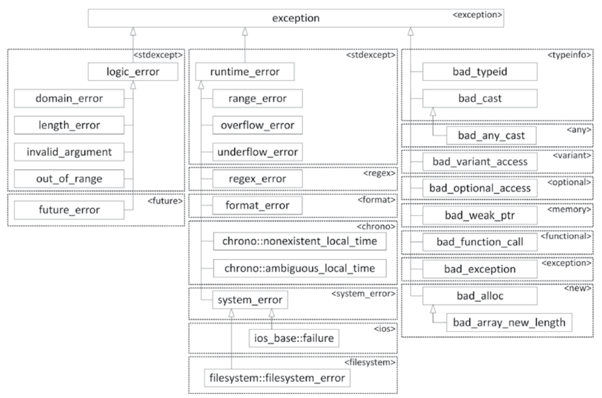
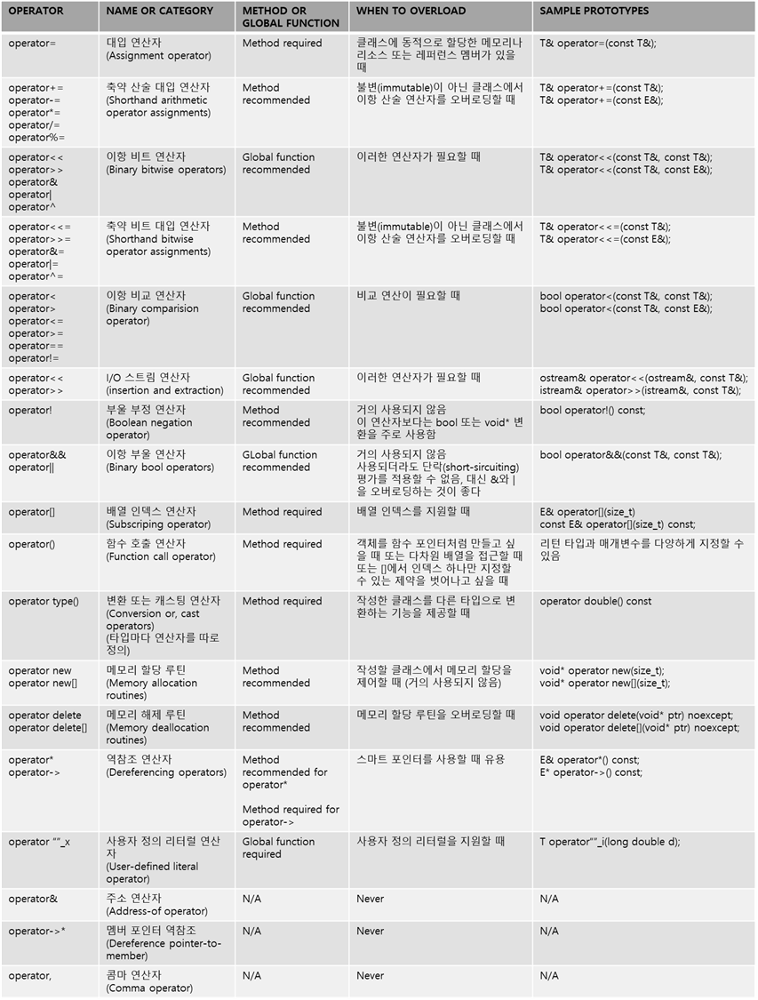

# 14. 에러 처리하기

## 14.1 에러와 예외

프로그램을 구현할 때 에러나 예외 상황이 발생하는 것은 피할 수 없어 에러 처리 기능 제공 필요

### 14.1.1 익셉션의 정체

- 익셉션
    - 코드에서 발생한 예외 상황이나 에러가 코드의 정상적인 실행 흐름에 퍼지지 않도록 하는 메커니즘
 

- 익셉션 메커니즘
    1. 에러가 발생한 코드는 익셉션을 throw
    2. 이를 처리하는 코드는 발생한 익셉션을 catch 하는 식으로 동작


### 14.1.2 C++ 에서 익셉션이 필요한 이유

기존의 C++ 프로그램을 보면 에러를 처리하는 방식이 제각각임

함수가 정수 코드를 리턴하거나, errno 매크로를 사용해서 에러를 표시했음.

하지만 앞의 방법들은 일관성이 없어 문제가 발생할 수 있음.


### 14.1.3 바람직한 에러 처리 방식

따라서 익셉션 메커니즘을 활용해서 에러를 쉽고 일관성 있고 안전하게 처리해야 함.


## 14.2 익셉션 처리 과정

 ```c++
vector<int> readIntegerFile(string_view fileName)
{
    ifstream inputStream(fileName.data());

    vector<int> integers;
    int temp;
    while(inputStream >> temp) {
        integers.push_back(temp);
    }
    return integers;
}

int main()
{
    const string fileName = "IntegerFile.txt";
    vector<int> myInts = readIntegerFile(fileName);
    for(const auto& element : myInts) {
        cout << element << " ";
    }
    cout << endl;
}
 ```

 위의 코드는 파일 끝에 도달하거나 에러가 발생하기 전까지 ifstream 에서 읽은 값을 저장.

 >> 연산에서 에러가 발생하면 ifstream 객체에 에러 플래그가 설정되고, while 문이 종료.


 ### 14.2.1 익셉션 던지고 받기

 익셉션은 발생한 익셉션을 처리하는 try/catch 문과 익셉션을을 던지는 throw 문으로 구현됨.

 ```c++
try {

} catch (익셉션_타입1 익셉션_이름) {

} catch (익셉션_타입2 익셉션_이름){

}
 ```

 익셉션이 발생하지 않으면 catch 블록은 실행되지 않고, try 문의 마지막 문장을 실행하고 나서 try/catch 문을 빠져나와 다음 문장 실행.

 익셉션이 발생하면 throw 또는 throw 문이 담긴 함수를 호출하는 문장의 뒤에 있는 코드는 실행되지 않고, 발생한 익셉션의 타입에 맞는 catch 블록으로 실행 흐름이 바뀜.

 catch 블록에서 더 이상 실행 흐름이 바뀌지 않는다면 (값을 리턴/다른 익셉션 던짐 등) catch 블록의 마지막 문장을 끝낸 후 try/catch 문을 빠져나와 다음 코드 실행.

```c++
double SafeDivide(double num, double den)
{
    if (den == 0)
        throw invalid_argument("Divide by zero");
    return num / den;
}

int main()
{
    try {
        cout << SafeDivide(5, 2) << endl;
        cout << SafeDivide(10, 0) << endl;
        cout << SafeDivide(3, 3) << endl;
    }
    catch (const invalid_argument& e) {
        cout << "Caught exception: " << e.what() << endl;
    }

    return 0;
}

2.5
Caught exception: Divide by zero
```

위의 코드는 0으로 나누는 상황에서 발생한 에러임.

throw 로 익셉션을 던지고, catch 에서 발생한 invalid_argument 타입의 익셉션을 확인해 실행함.

```c++
vector<int> readIntegerFile(string_view fileName)
{
    ifstream inputStream(fileName.data());
    if (inputStream.fail()) {
        throw exception();
    }

    vector<int> integers;
    int temp;
    while (inputStream >> temp) {
        integers.push_back(temp);
    }
    return integers;
}

int main()
{
    const string fileName = "IntegerFile.txt";
    vector<int> myInts;
    try {
        myInts = readIntegerFile(fileName);
    }
    catch (const exception& e) {
        cerr << "Unable to open file " << fileName << endl;
        return 1;
    }
    for (const auto& element : myInts) {
        cout << element << " ";
    }
    cout << endl;
    return 0;
}
```

위의 함수에서 파일 열기에 실패하면 throw exception() 아 실행되면서 함수의 나머지 코드를 건너뛰고ㅓ 가장 가까운 핸들러 코드로  실행 흐름이 바뀜.


### 14.2.2 익셉션 타입

던질 수 있는 익셉션의 타입에는 제한이 없음. 다음과 같이 int 타입 객체도 가능

```c++
vector<int> readIntegerFile(string_view fileName)
{
    ifstream inputStream(fileName.data());
    if (inputStream.fail()) {
        throw 5;
    }
    ...
}

try {
    myInts = readIntegerFile(fileName);
} catch (int e) {
    cerr << "Unable to open file " << fileName << endl;
    return 1;
}
```

하지만 기본 타입을 사용하기보다 타입을 새로 정의하는 것이 바람직함.
- 객체의 클래스 이름에 예외 상황에 대한 정보를 보여줄 수 있음.
- 예외 상황의 종류뿐만 아니라 다른 정보도 담을 수 있음.


### 14.2.3 익셉션 객체를 const 레퍼런스로 받기

```c++
catch(const exception& e)

catch(exception e)

catch(exception& e)
```

위의 방법 다 가능하지만, 익셉션 객체는 항상 const 레퍼런스로 받는 것이 좋음. 값으로 받으면 객체 슬라이싱이 발생


### 14.2.4 여러 가지 익셉션 던지고 받기

앞의 코드에선 exception 를 던졌지만, 아래 코드는 exception 을 상속한 runtime_error 로 구현.

```c++
vector<int> readIntegerFile(string_view fileName)
{
    ifstream inputStream(fileName.data());
    if (inputStream.fail()) {
        throw runtime_error("Unable to open the file.");
    }

    vector<int> integers;
    int temp;
    while (inputStream >> temp) {
        integers.push_back(temp);
    }

    if (!inputStream.eof()) {
        throw runtime_error("Error reading the file.");
    }
    return integers;
}

int main()
{
    const string fileName = "IntegerFile.txt";
    vector<int> myInts;
    try {
        myInts = readIntegerFile(fileName);
    }
    catch (const exception& e) {
        cerr << e.what() << endl;
        return 1;
    }
    for (const auto& element : myInts) {
        cout << element << " ";
    }
    cout << endl;
    return 0;
}
```

다음 코드에선 exception 을 상속한 runtime_error 과 invalid_argument 로로 구현.

```c++
vector<int> readIntegerFile(string_view fileName)
{
    ifstream inputStream(fileName.data());
    if (inputStream.fail()) {
        throw invalid_argument("Unable to open the file.");
    }

    vector<int> integers;
    int temp;
    while (inputStream >> temp) {
        integers.push_back(temp);
    }

    if (!inputStream.eof()) {
        throw runtime_error("Error reading the file.");
    }
    return integers;
}

int main()
{
    const string fileName = "IntegerFile.txt";
    vector<int> myInts;
    try {
        myInts = readIntegerFile(fileName);
    } catch (const invalid_argument& e) {
        cerr << e.what() << endl;
        return 1;
    } catch (const runtime_error& e) {
        cerr << e.what() << endl;
        return 2;
    }
    for (const auto& element : myInts) {
        cout << element << " ";
    }
    cout << endl;
    return 0;
}
```

#### 14.2.4.1 익셉션 타입 매칭과 const

처리하려는 익셉션 타입에 const 여부는 매칭 과정에서 영향 X.

다음은 runtime_error 타입에 속하는 모든 익셉션을 매칭

```c++
catch (const runtime_error& e)

catch (runtime_error& e)
```

#### 14.2.4.2 모든 익셉션 매칭하기

다음과 같이 하면 모든 익셉션을 매칭

```c++
catch (...)
```


### 14.2.5 처리하지 못한 익셉션

프로그램에서 발생한 익셉션을 처리하는 곳이 없다면 프로그램이 종료됨.

그래서 다음과 같은 패턴을 많이 사용.

```c++
try {
    main(argc, argv);
} catch {
    // 프로그램 종료.
}
```

위의 방법 말고 다음과 같은 방법도 존재.

프로그램이 잡지 못한 익셉션을 만나면 terminate() 함수를 호출하게 함.

이 함수는 c++ 에서 기본으로 제공, abort() 함수를 호출해서 프로그램을 죽임.

```c++
try {
    main(argc, argv);
} catch (...) {
    if(terminate_handler != nullptr) {
        terminate_handler();
    } else {
        terminate();
    }
}
```

set_terminate() 함수를 사용해 콜백함수를 지정 가능.

```c++
void myTerminate()
{
    cout << "Uncaught exception!" << endl;
    exit(1);
}

int main()
{
    set_terminate(myTerminate);

    const string fileName = "IntegerFile.txt";
    vector<int> myInts = readIntegerFile(fileName);
    
    for (const auto& element : myInts) {
        cout << element << " ";
    }
    cout << endl;
    return 0;
}
```

### 14.2.6 noexcept

noexcept 키워드를 지정해 어떠한 익셉션도 던지지 않는다고 지정 가능.

만약 noexcept 키워드가 지정된 함수에 익셉션 던지는 코드가 있을시, 런타임에 terminate() 를 호출하여 프로그램 종료시킴.


## 14.3 익셉션과 다형성

### 14.3.1 표준 익셉션 클래스의 계층 구조

 exception, runtime_error, invalid_argument 모두 표준 익셉션 클래스 타입.
 
 익셉션 객체 클래스는 다음과 같음.


 

 위의 나온 클래스 모두 what() 메서드를 가지고 있음. 이 메서드는 에러 메시지 출력에 활용할 수 있음.

```c++
vector<int> readIntegerFile(string_view fileName)
{
    ifstream inputStream(fileName.data());
    if (inputStream.fail()) { 
        const string error = "Unable to open the file "s + fileName.data();
        throw invalid_argument(error);
    }

    vector<int> integers;
    int temp;
    while (inputStream >> temp) {
        integers.push_back(temp);
    }

    if (!inputStream.eof()) {
        const string error = "Unable to read file "s + fileName.data();
        throw runtime_error(error);
    }
    return integers;
}

int main()
{
    const string fileName = "IntegerFile.txt";
    vector<int> myInts;
    try {
        myInts = readIntegerFile(fileName);
    } catch (const invalid_argument& e) {
        cerr << e.what() << endl;
        return 1;
    } catch (const runtime_error& e) {
        cerr << e.what() << endl;
        return 2;
    }
    for (const auto& element : myInts) {
        cout << element << " ";
    }
    cout << endl;
    return 0;
}
```


### 14.3.2 클래스 계층 구조에서 정확한 익셉션 타입 선택하기

익센셥 타입을 클래스 계층으로 구성하면 catch 구문에서 다형성을 활용할 수 있음.

인수로 exception 레퍼런스로 받으면 invalid_argument, runtime_error 모두 매칭할 수 있음.

```c++
try {
    myInts = readIntegerFile(filename);
}
catch (const exception& e) {
    cerr << e.what() << endl;
    return 2;
}

// invalid_argument 체크 후 나머지
try {
    myInts = readIntegerFile(filename);
}
catch (const invalid_argument& e) {
    cerr << e.what() << endl;
    return 1;
}
catch (const exception& e) {
    cerr << e.what() << endl;
    return 2;
}
```

### 14.3.3 익셉션 클래스 직접 정의하기

직접 클래스 정의시 장점

1. 작성한 프로그램에서 발생하는 에러에 최대한 가까운 이름으로 표현 가능
2. 원하는 정보를 익셉션에 추가 가능

익셉션을 직접 정의할 때에는 반드시 표준 exception 클래스를 직간접적으로 상속하는 것이 좋음. 이렇게 하면 다형성을 이용하기 쉬움

```c++
class FileError : public exception
{
public:
    FileError(string filename) : mFilename{ move(filename) } {}
    virtual const char* what() const noexcept override {
        return mMessage.c_str();
    }

    string_view getFilename() const noexcept { return mFilename; }

protected:
    virtual void setMessage(string message) { mMessage = move(message); }
private:
    string mFilename;
    string mMessage;
};

class FileOpenError : public FileError
{
public:
    FileOpenError(string_view fileName) : FileError(fileName)
    {
        setMessage("Unable to open "s + fileName.data());
    }
};

class FileReadError : public FileError
{
public:
    FileReadError(string_view fileName, size_t lineNumber)
        : FileError(fileName), mLineNumber(lineNumber)
    {
        ostringstream ostr;
        ostr << "Error reading " << fileName << " at line " << lineNumber;
        setMessage(ostr.str());
    }

    size_t getLineNumber() const noexcept { return mLineNumber; }

private:
    size_t mLineNumber;
};
```

exception 을 상속하려면 what 메서드를 오버라이드 필요

파일이 열리지 않는 경우의 익셉션 처리를 위해 FileError 를 상속해 FileOpenError 익셉션을 정의 가능.

파일을 읽을 수 없는 경우의 익셉션도 FileReadError 익셉션으로 정의. 


### 14.3.4 중첩된 익셉션

앞서 발생한 익셉션을 처리하는 도중에 또 다른 에러가 발생해서 새로운 익셉션이 전달될 수 있음. 이렇게 중간에 익셉션이 발생하면 현재 처리하고 있던 익셉션 정보가 사라짐. 이를 해결하기 위해 `중첩된 익셉션` 이라는 기능 제공

어떤 익셉션을 처리하는 catch 문에서 새로운 익셉션을 던지고 싶다면 `throw_with_nested()` 를 사용. 나중에 발생한 익셉션을 처리하는 catch 문에서 먼저 발생했던 익셉션에 접근할 때에는 `dynamic_cast()` 를 이용. 이때 먼저 발생한 익셉션을 `nested_exception` 으로  표현

```c++
class MyException : public exception
{
public:
    MyException(string_view message) : mMessage(message) { }
    virtual const char* what() const noexcept override {
        return mMessage.c_str();
    }
private:
    string mMessage;
};

void doSomething()
{
    try {
        throw runtime_error("Throwing a runtime_error exception");
    } catch (const runtime_error& e) {
        cout << __func__ << " caught a runtime_error" << endl;
        cout << __func__ << " throwing MyException" << endl;
        throw_with_nested(MyException("MyException with nested runtime_error"));
    }
}

int main()
{
    try {
        doSomething();
    } catch (const MyException& e) {
        cout << __func__ << " caught MyException: " << e.what() << endl;
        const auto* pNested = dynamic_cast<const nested_exception*>(&e);
        if (pNested) {
            try {
                pNested->rethrow_nested();
            } catch (const runtime_error& e) {
                cout << " Nested exception: " << e.what() << endl;
            }
        }

    }
    return 0;
}


doSomething caught a runtime_error
doSomething throwing MyException
main caught MyException: MyException with nested runtime_error
 Nested exception: Throwing a runtime_error exception
```

위의 코드는 중첩된 익셉션을 처리하는 방법을 보여줌.

MyException 익셉션을 처리하는 catch 핸들러가 나오고, 이 핸들러가 익셉션을 잡으면 메시지를 작성 후 dynamic_cast 로 중첩된 익셉션에 접근함. 

중첩된 익셉션이 없으면 널 포인터를 리턴하고, 있다면 nested_exception 의 rethrow_nested() 메서드를 호출해서 중첩된 익셉션을 다시 던짐.

```c++
int main()
{
    try {
        doSomething();
    } catch (const MyException& e) {
        cout << __func__ << " caught MyException: " << e.what() << endl;
        try {
            rethrow_if_nested(e);
        }
        catch (const runtime_error& e) {
            cout << " Nested exception: " << e.what() << endl;
        }
    }
    return 0;
}
```

중첩된 익셉션을 위해 dynamic_cast 를 호출할 일이 많기에 rethrow_if_nested() 라는 헬프 함수가 정의되어 있음.


## 14.4 익셉션 다시 던지기


```c++
void g() { throw invalid_argument("Some exception"); }

void f()
{
    try {
        g();
    } catch (const invalid_argument& e) {
        cout << "caught in f: " << e.what() << endl;
        throw;
    }
}

int main()
{
    try {
        f();
    }
    catch (const invalid_argument& e) {
        cout << "caught in main: " << e.what() << endl;
    }
    return 0;
}

caught in f: Some exception
caught in main: Some exception
```

throw 키워드를 사용해서 현재 발생한 키워드를 다시 던질 수 있음.

여기서 throw e; 와 같은 문장을 사용하면 안됨. 익셉션 객체에 대한 슬라이싱이 발생함.


## 14.5 스택 풀기와 청소

코드에서 익셉션을 던지면 이를 받아서 처리할 catch 핸들러를 스택에서 찾고, 발견하면 그 핸들러가 정의된 스택 단계로 되돌아감. 이때 중간 단계에 있던 스택 프레임을 모두 풀어버림. 이를 `스택 풀기` 라 부르며, 스코프가 로컬인 소멸자를 모두 호출하고, 각 함수에서 미처 실행하지 못한 코드는 건너뜀.

그런데 스택 풀기가 발생할 때 포인터 변수를 해제하고 리소스를 정리하는 작업은 실행되지 않아 메모리 누수가 발생함.

이를 방지하려면 다음과 같은 기법을 활용.

### 14.5.1 스마트 포인터 활용

스마트 포인터를 활용하면 익셉션 처리 과정에 메모리나 리소스 누수 방지 작업을 자동으로 처리

### 14.5.2 익셉션을 잡고, 리소스를 정리한 뒤, 익셉션 다시 던지기

또다른 방법은 각 함수마다 발생 가능한 익셉션을 모두 잡아서 리소스를 제대로 정리한 뒤 그 익셉션을 다시 스택의 상위 핸들러로 던지는 것임.

하지만 스마트 포인터를 쓰는게 더 좋음.


## 14.6 익셉션 처리 과정에서 흔히 발생하는 문제

### 14.6.1 메모리 할당 에러

모바일이나 레거시 시스템에서는 메모리 할당 에러가 발생할 수 있음. 이런 시스템에서는 반드시 메모리 할당 에러에 대처하는 코드 구현 필요.

new/new[] 에서 메모리를 할당할 수 없을 때 기본적으로 수행하는 동작은 bad_alloc 익셉션을 던지므로 이를 처리하는 catch 구문 작성.

```c++
int* ptr = nullptr;
size_t integerCount = numeric_limits<size_t>::max();
try {
    ptr = new int[integerCount];
}
catch (const bad_alloc& e) {
    cerr << __FILE__ << "(" << __LINE__ << "): Unable to allocate memory: " << e.what() << endl;
    return;
}
```

#### 14.6.1.1 익셉션을 던지지 않는 new

익셉션 메커니즘을 사용하지 않고, 예전 C 방식처럼 메모리 할당에 실패하면 널 포인터를 리턴하게 작성 가능. C++ 은 익셉션을 던지지 않는 nothrow 버전의 new/new[] 버전을 제공.

```c++
size_t integerCount = numeric_limits<size_t>::max();
int* ptr = new(nothrow) int[integerCount];
if (ptr == nullptr)
{
    cerr << __FILE__ << "(" << __LINE__ << "): Unable to allocate memory!" << endl;
    return;
}
```

#### 14.6.1.2 메모리 할당 에러 처리 방식 커스터마이즈하기

c++ 는 new 핸들러 콜백 함수를 커스터마이즈하는 기능 제공.

new 핸들러를 정의하면 메모리 할당 루틴에서 에러가 발생했을 때 익셉션을 던지지 않고 정의된 new 핸들러를 호출. new 핸들러가 리턴하면 메모리 할당 루틴은 다시 메모리를 할당하려고 시도하는데, 이때 실패해도 new 핸들러를 호출하여 무한 루프 발생할 수 있음. 

따라서 다음 세 가지 중 한 가지 방식으로 구현해야 함.

1. 메모리 추가하기 : 공간을 확보하기 위한 한 가지 방법은 프로그램 구동시 큰 덩어리의 메모리를 할당했다가 new 핸들러로 해제하게 만드는 것.
2. 익셉션 던지기 : new 핸들러에서 익셉션을 던질 때 반드시 bad_alloc 이나 이를 상속한 익셉션을 던지도록 명시.
3. 다른 new 핸들러 설정하기 : 이론적으로 new 핸들러를 여러 개 만들어서 각각 메모리를 생성하고 문제가 발생하면 다른 new 핸들러를 설정할 수 있음.


#### 14.6.2 생성자에서 발생하는 에러

생성자가 값을 리턴하지는 못하지만 익셉션은 던질 수 있음. 따라서 객체의 정상 생성 여부를 확인할 수 있음. 

하지만 생성자에서 익셉션이 발생해서 정상 종료되지 못하고 중간에 빠져나와 버리면 그 객체의 소멸자가 호출되지 않아 메모리와 리소스 누수가 발생할 수 있음.

따라서 익셉션이 발생하여 생성자를 빠져나올 때는 반드시 생성자에서 할당했던 메모리와 리소스를 정리해야 함.

```c++
template <typename T>
class Matrix
{
public:
    Matrix(size_t width, size_t height);
    virtual ~Matrix();
private:
    void cleanup();

    size_t mWidth = 0;
    size_t mHeight = 0;
    T** mMatrix = nullptr;
};

template <typename T>
Matrix<T>::Matrix(size_t width, size_t height)
{
    mMatrix = new T * [width] {};

    mWidth = width;
    mHeight = height;

    try {
        for (size_t i = 0; i < width; ++i) {
            mMatrix[i] = new T[height];
        }
    } catch (...) {
        cerr << "Exception caught in constructor, cleaning up..." << endl;
        cleanup();
        throw_with_nested(bad_alloc());
    }
}

template <typename T>
Matrix<T>::~Matrix()
{
    cleanup();
}

template <typename T>
void Matrix<T>::cleanup()
{
    for (size_t i = 0; i < mWidth; ++i) {
        delete mMatrix[i];
    }
    delete[] mMatrix;
    mMatrix = nullptr;
    mWidth = mHeight = 0;
}

class Element
{
private:
    int mValue;
};

int main()
{
    Matrix<Element> m(10, 10);
    return 0;
}
```


### 14.6.3 생성자를 위한 함수 try 블록

함수 try 블록이란 기능으로 일반 함수뿐만 아니라 생성자에도 적용가능.

```c++
MyClass::MyClass()
try
    : <생성자 이니셜라이저>
{
}
catch (const exception& e)
{
}
```

이를 적용할 땐 다음과 같은 점에 주의

- catch 문은 생성자 이니셜라이저나 생성자 본문에서 발생한 익셉션을 잡아서 처리
- catch 문은 반드시 현재 발생한 익셉션을 다시 던지거나 새 익셉션을 만들어 던져야 함.
- catch 문은 생성자에 전달된 인수에 접근할 수 있음.
- catch 문이 함수 try 블록에서 익셉션을 잡으면 생성자의 실행을 정상적으로 마친 베이스 클래스나 그 객체로 된 멤버는 catch 문을 시작하기 전에 소멸됨.
- catch 문 안에서는 객체로 된 멤버 변수에 접근하면 안됨.
- 함수 try 블록에 있는 catch 문은 그 안에 담긴 함수에서 값을 리턴할 때 return 키워드를 사용할 수 없음.

위의 제약사항을 감안하면 다음과 같은 제한된 상황에서만 적합

- 생성자 이니셜라이저에서 던진 익셉션을 다른 익셉션으로 변활할 때
- 메시지를 로그 파일에 기록할 때
- 생성자 이니셜라이저에서 할당한, 소면자로 자동 제거할 수 없는 리소스를 익셉션을 던지기 전에 해제할 때


### 14.6.4 소멸자에서 익셉션을 처리하는 방법

소멸자에서 발생한 에러는 반드시 소멸자 안에서 처리해야 함. 소멸자에서 익셉션을 다른 곳으로 던지면 안됨.

이유는?

1. 소멸자는 기본적으로 noexcept 로 선언된 것으로 취급
2. 소멸자는 이미 다른 익셉션이 발생해서 스택 풀기를 수행하는 과정에서도 실행될 수 있음.스택 풀기를 하는 도중에 소멸자에서 익셉션을 던지면 terminate() 를 호출해서 애플리케이셙을 종료함.
3. 클라이언트에서는 소멸자를 직접 호출하지 않고 delete 를 이용하여 간접적으로 소멸자를 호출
4. 소멸자는 객체에서 사용할 메모리나 리소스를 해제할 마지막 기회임. 함수 실행 도중에 익셉션을 던져 이 기회를 놓쳐버리면 다시 돌아가 해제할 수 없음.

## 14.7 모두 합치기

```c++
class GamePiece {};

class GameBoard {
public:
    explicit GameBoard(size_t width = kDefaultWidth,
                       size_t height = kDefaultHeight);
    GameBoard(const GameBoard& src);
    virtual ~GameBoard() noexcept;
    GameBoard& operator=(const GameBoard& rhs); // 대입 연산자

    GamePiece& at(size_t x, size_t y);
    const GamePiece& at(size_t x, size_t y) const;

    size_t getHeight() const noexcept { return mHeight; }
    size_t getWidth() const noexcept { return mWidth; }

    static const size_t kDefaultWidth = 100;
    static const size_t kDefaultHeight = 100;

    friend void swap(GameBoard& first, GameBoard& second) noexcept;

private:
    void cleanup() noexcept;
    void verifyCoordinate(size_t x, size_t y) const;

    GamePiece** mCells = nullptr;
    size_t mWidth = 0, mHeight = 0;
};

GameBoard::GameBoard(size_t width, size_t height)
    : mCells(new GamePiece*[width]()), mWidth(width), mHeight(height) {
    try {
        for (size_t i = 0; i < width; ++i) {
            mCells[i] = new GamePiece[height];
        }
    } catch (...) {
        cleanup();
        std::throw_with_nested(std::bad_alloc());
    }
}

GameBoard::GameBoard(const GameBoard& src)
    : GameBoard(src.mWidth, src.mHeight) {
    for (size_t i = 0; i < mWidth; ++i) {
        for (size_t j = 0; j < mHeight; ++j) {
            mCells[i][j] = src.mCells[i][j];
        }
    }
}

GameBoard::~GameBoard() noexcept {
    cleanup();
}

void GameBoard::cleanup() noexcept {
    for (size_t i = 0; i < mWidth; ++i) {
        delete[] mCells[i];
    }
    delete[] mCells;
    mCells = nullptr;
    mWidth = 0;
    mHeight = 0;
}

void GameBoard::verifyCoordinate(size_t x, size_t y) const {
    if (x >= mWidth)
        throw std::out_of_range("x-coordinate beyond width");
    if (y >= mHeight)
        throw std::out_of_range("y-coordinate beyond height");
}

void swap(GameBoard& first, GameBoard& second) noexcept {
    using std::swap;
    swap(first.mWidth, second.mWidth);
    swap(first.mHeight, second.mHeight);
    swap(first.mCells, second.mCells);
}

GameBoard& GameBoard::operator=(const GameBoard& rhs) {
    if (this == &rhs) {
        return *this;
    }
    GameBoard temp(rhs);
    swap(*this, temp);
    return *this;
}

const GamePiece& GameBoard::at(size_t x, size_t y) const {
    verifyCoordinate(x, y);
    return mCells[x][y];
}
```


# 15 C++ 연산자 오버로딩하기

## 15.1 연산자 오버로딩 개요

### 15.1.1 연산자 오버로딩을 하는 이유

1. 자신이 정의할 클래스를 기본 타입처럼 다루기 위해서
2. 프로그램을 좀 더 세밀하게 제어하기 위해서

### 15.1.2 연산자 오버로딩의 한계

- 연산자 기호를 새로 만들 수는 없음
- . / :: / sizeof / ?: 등 일부 연산자는 오버로딩 x
- 에리티(arity) 는 연산자의 인수 또는 피연산자의 개수
에리티를 변경할 수 있는 곳은 함수호출, new, delete 연산자 뿐이고, 나머지는 변경할 수 없음
- 연산자의 평가 순서를 결정하는 우선순위와 결합순위는 바꿀 수 없음
- 기본 타입 연산자의 의미는 바꿀 수 없음.

### 15.1.3 연산자 오버로딩 선택

연산자 오버로딩은 operatorX 란 이름의 메서드나 함수를 정의하는 방식으로 정의

```c++
SpreadsheetCell operator+(const SpreadsheetCell& lhs, const SpreadsheetCell& rhs);
```

#### 15.1.3.1 메서드와 전역 함수

메서드로 구현 : 연산자를 사용한 표현식의 좌변은 반드시 그 클래스 객체여야 함
전역 함수로 구현 : 좌변에 다른 타입의 객체를 적을 수 있음

연산자는 크게 세 종류가 존재

1. 반드시 메서드로 정의해야 하는 연산자
    - operator= 의 경우 소속 클래스와 밀접한 관계에 있음
2. 반드시 전역 함수로 정의해야 하는 연산자
    - operator<< / operator>> 
3. 메서드와 전역 함수 둘 다 가능한 연산자

#### 15.1.3.2 인수 타입에 대한 결정사항

 - 인수 갯수에 대한 사항은 거의 변경 불가능함.
 - 비기본 타입 매개변수는 모두 레퍼런스로 받음
 - 변경할 일이 없다면 무조건 const 지정
  

#### 15.1.3.3 리턴 타입에 대한 결정사항

c++ 은 적합한 오버로딩 연산자를 찾을 때 리턴 타입 고려 X

하지만 오버로딩한 연산자도 기본 타입 연산자와 동일한 타입을 리턴하게 정의

그리고 레퍼런스로 리턴할 수 있으면 레퍼런스로 아니면 값으로 리턴

또한 좌측값으로 사용해서 변경될 가능성이 있는 리턴값은 const 로 지정 X, 나머지는 const 로 지정

#### 15.1.3.4 동작에 대한 결정사항

연산자를 오버로딩할 때는 원하는 동작을 마음대로 구현할 수 있지만, 원래 의미하는 바에 맞춰 오버로딩함


### 15.1.4 오버로딩하면 안되는 연산자

C++ 에서 허용하지만 오버로딩하면 안되는 연산자

- 주소연산자 operator&
- 이항 부울 연산자 operator&& operator||
- 콤마 연산자 operator,

### 15.1.5 오버로딩할 수 있는 연산자


 


 ### 15.1.6 우측값 레퍼런스

대부분의 연산자는 좌측값 레퍼런스를 사용한 버전과 우측값 레퍼런스를 사용한 버전이 함께 존재해도 문제없음

operator+ 의 경우 다음과 같이 여러 오버로딩 버전이 존재

```c++
string operator+(const string& lhs, const string& rhs);
string operator+(string&& lhs, const string& rhs);
string operator+(const string& lhs, string&& rhs);
string operator+(string&& lhs, string&& rhs);
```


## 15.2 산술 연산자 오버로딩하기

### 15.2.1 단항 뺄셈과 단항 덧셈 연산자 오버로딩하기


```c++
// int 예시

int i, j = 4;
i = -j;
i = +j;
j = +(-i);
j = -(-i);

// operator- 연산자 SpreadsheetCell 클래스 예시
SpreadsheetCell SpreadsheetCell::operator-() const
{
    return SpreadsheetCell(-getValue());
}

SpreadsheetCell c1(4);
SpreadsheetCell c3 = -c1;
```

### 15.2.2 증가와 감소 연산자 오버로딩하기
```c++
i = i + 1;
i += 1;
++i; // 선행 증가 연산자
i++; // 후행 증가 연산자
```

operator++ 와 operator-- 를 오버로딩할 때 대상이 선행 증가인지 후행 증가인지 명확히 표현할 방법이 없음.

c++ 에서는 다음과 같은 방법으로 해결
- 선행 연산 버전은 인수를 받지 않고, 후행 연산 버전은 타입의 인수를 하나 받음

```c++
// operator-- / operator++ 연산자 SpreadsheetCell 클래스 예시
SpreadsheetCell& operator++(); // 선행 증가
SpreadsheetCell operator++(int); // 후행 증가
SpreadsheetCell& operator--(); // 선행 감소
SpreadsheetCell operator--(int); // 후행 감소
```

```c++
SpreadsheetCell& SpreadsheetCell::operator++()
{
    set(getValue() + 1);
    return *this;
}


SpreadsheetCell SpreadsheetCell::operator++(int)
{
    auto oldCell(*this);
    ++(*this);
    return oldCell;
}

SpreadsheetCell c1(4);
SpreadsheetCell c2(4);
c1++;
++c2;
```

## 15.3 비트 연산자와 논리 연산자 오버로딩하기

비트 연산자와 비트 축약 대입 연산자는 생략


## 스트림 입출력 연산자 오버로딩하기

스트림 입력이나 출력 연산자 왼쪽에는 istream 이나 ostream 객체가 나와야 함.

istream 이나 ostream 클래스에는 메서드를 직접 추가할 수 없기에 전역 함수로 만들어 오버로딩해야 함.

```c++
class SpreadsheetCell
{
    // 코드 생략
}

ostream& operator<<(ostream& ostr, const SpreadsheetCell& cell);
iostream& operator>>(istream& istr, SpreadsheetCell& cell);

ostream& operator<<(ostream& ostr, const SpreadsheetCell& cell)
{
    ostr << cell.getValue();
    return ostr;
}

iostream& operator>>(istream& istr, SpreadsheetCell& cell)
{
    double value;
    istr >> value;
    cell.set(value);
    return istr;
}

cin >> myCell >> anotherCell >> aThirdCeel;
// operator>>(operator>>(operator>>(cin, myCell), anotherCell), aThirdCell);
```


## 15.5 인덱스 연산자 오버로딩하기

다음은 특정한 인덱스에 있는 원소를 설정하거나 읽는 기능을 제공하는 동적 할당 배열에 대한 클래스 정의임

```c++
template <typename T>
class Array
{
public:
    // 필요에 따라 크기가 증가하는 배열을 디폴트 크기로 생성한다.
    Array();
    virtual ~Array();

    // 대입과 값 전달 방식을 허용하지 않는다.
    Array<T>& operator=(const Array<T>& rhs) = delete;
    Array(const Array<T>& src) = delete;

    // 인덱스 x에 있는 값을 리턴한다. 인덱스 x에 원소가 없으면
    // out_of_range 익셉션을 던진다.
    const T& getElementAt(size_t x) const;

    // 인덱스 x에 값을 설정한다. 인덱스 x가 현재 배열의 크기를 벗어나면
    // 공간을 더 할당한다.
    void setElementAt(size_t x, const T& value);

    size_t getSize() const;

private:
    static const size_t kAllocSize = 4;
    void resize(size_t newSize);
    T* mElements = nullptr;
    size_t mSize = 0;
};

template <typename T> Array<T>::Array()
{
    mSize = kAllocSize;
    mElements = new T[mSize] {}; // 원소를 0으로 초기화한다.
}

template <typename T> Array<T>::~Array()
{
    delete[] mElements;
    mElements = nullptr;
}

template <typename T> void Array<T>::resize(size_t newSize)
{
    // 더 큰 배열을 생성한다. 값을 0으로 초기화한다.
    auto newArray = std::make_unique<T[]>(newSize);

    for (size_t i = 0; i < mSize; i++) {
        // 이전 배열의 원소를 모두 새 배열로 복사한다.
        newArray[i] = mElements[i];
    }

    // 이전 배열을 삭제하고 새 배열을 설정한다.
    delete[] mElements;
    mSize = newSize;
    mElements = newArray.release();
}

template <typename T> const T& Array<T>::getElementAt(size_t x) const
{
    if (x >= mSize) {
        throw std::out_of_range("");
    }
    return mElements[x];
}

template <typename T> void Array<T>::setElementAt(size_t x, const T& val)
{
    if (x >= mSize) {
        // 클라이언트가 요청한 원소 뒤로 kAllocSize만큼 공간을 할당한다.
        resize(x + kAllocSize);
    }
    mElements[x] = val;
}

template <typename T> size_t Array<T>::getSize() const
{
    return mSize;
}
```

```c++
Array<int> myArray;
for(size_t i = 0; i < 10; i++) {
    myArray.setElementAt(i, 100);
}
for(size_t i = 0; i < 10; i++) {
    cout << myArray.getElementAt(i) << " ";
}
```

위의 코드는 배열을 사용할 때 공간을 얼마나 차지할지 설정할 필요없음
하지만 매번 setElementAt, getElementAt 을 호출하는 것이 번거로움.

다음과 같이 인덱스 연산자를 오버로딩하면 익숙한 방식으로 사용 가능함.

```c++
template <typename T> T& Array<T>::operator[](size_t x)
{
    if (x >= mSize) {
        resize(x + kAllocSize);
    }
    return mElements[x];
}

Array<int> myArray;
for(size_t i = 0; i < 10; i++) {
    myArray[i] = 100;
}
for(size_t i = 0; i < 10; i++) {
    cout << myArray[i] << " ";
}
```


### 15.5.1 읽기 전용 operator[] 만들기

operator[] 가 원소의 좌측값으로 리턴하면 편하지만, 반드시 이렇게만 작동하는 것도 문제임.
배열 원소를 const 레퍼런스로 리턴해서 읽기 전용으로 접근하는 기능도 필요하다면 다음과 같이 정의함

```c++
T& operator[](size_t x);
const T& operator[](size_t x) const;

// 익셉션 던지는 버전
template <typename T> const T& Array<T>::operator[](size_t x) const
{
    if (x >= mSize) {
        throw std::out_of_range("");
    }
    return mElements[x];
}

// 영으로 초기화된 배열을 리턴하는 버전
template <typename T> const T& Array<T>::operator[](size_t x) const
{
    if (x >= mSize) {
        throw std::out_of_range("");
    }
    return mElements[x];
}
```


## 15.6 함수 호출 연산자 오버로딩하기

클래스를 정의할 때 operator() 를 추가하면 이 클래스의 객체를 함수 포인터로 사용가능함

함수 호출 연산자를 제공하는 클래스의 객체를 함수 객체 또는 펑터(functor) 라 부름

이 연산자는 non-static 메서드로 오버로딩 해야하고, 예시는 다음과 같음

```c++
class FunctionObject
{
public:
    int operator() (int param); // 함수 호출 연산자
    int doSquare(int param); // 일반 메서드
};

// 오버로딩한 함수 호출 연산자
int FunctionObject::operator() (int param)
{
    return doSquare(param);
}

// 일반 메서드
int FunctionObject::doSquare(int param)
{
    return param * param;
}

int x = 3. xSquared, xSquaredAgain;
FunctionObject square;
xSquared = square(x);                   // 함수 호출 연산자자
xSquaredAgain = xSquared.doSquare(x);   // 일반 메서드
```

함수 호출 연산자 사용이 어색하게 보이지만 이 함수 객체를 함수 포인터로 해서 다른 함수에 
콜백 함수로 전달할 수 있는 장점이 있음. 이는 18장에서 설명

또한 전역 함수보다 함수 객체로 만들면 다음의 장점이 있음
- 함수 호출 연산자를 여러 번 호출하더라도 객체의 데이터 멤버를 통해 정보를 지속적으로 유지 가능
- 데이터 멤버를 설정하는 방식으로 함수 객체의 동작을 변경할 수 있음.


## 15.7 역참조 연산자 오버로딩하기

### 15.7.1 operator* 구현

예제로 활용할 스마트 포인터 클래스 템플릿 정의는 다음과 같다.

```c++
template <typename T> class Pointer
{
public:
    Pointer(T* ptr);
    virtual ~Pointer();

    Pointer(const Pointer<T>& src) = delete;
    Pointer<T>& operator=(const Pointer<T>& rhs) = delete;

    T& operator*();
    const T& operator*() const;
private:
    T* mPtr = nullptr;
};

template <typename T> Pointer<T>::Pointer(T* ptr) : mPtr(ptr) {}
template <typename T> Pointer<T>::~Pointer()
{
    delete mPtr;
    mPtr = nullptr;
}

template <typename T> T& Pointer<T>::operator*()
{
    return *mPtr;
}

template <typename T> const T& Pointer<T>::operator*() const
{
    return *mPtr;
}
```

포인터를 역참조하는 것은 포인터가 가리키던 메모리에 접근한다는 의미임. 

포인터가 가리키는 메모리가 객체와 같이 복합 타입으로 된 대상을 담고 있다면 그 안에 있는 데이터 멤버나
메서드에 접근하기 위해서는 . 연산자를 사용해야 함. 

이렇게 하기 위해선 operator* 가 레퍼런스를 리턴해야 함.

### 15.7.2 operator-> 구현

-> 연산자를 적용한 결과는 반드시 객체의 멤버나 메서드여야 함.

이렇게 구현하려면 operator* 를 실행한 뒤 곧바로 operator. 를 호출해야 함.

c++ 에서는 operator. 을 오버로딩할 수 없기에 operator-> 를 예외로 취급함.
```c++
smartCell->set(5);
(smartCell.operator->())->set(5);
```

위처럼 오버로딩한 operator-> 에서 리턴한 값에 다른 operator-> 를 적용함.

따라서 다음과 같이 포인터로 리턴하게 구현해야함.

```c++
template <typename T> class Pointer
{
public:

    T* operator->();
    const T* operator->() const;
private:
    T* mPtr = nullptr;
};

template <typename T> T* Pointer<T>::operator->()
{
    return mPtr;
}

template <typename T> const T* Pointer<T>::operator->() const
{
    return mPtr;
}
```


### 15.7.3 operator.* 와 operator->*

클래스의 데이터 멤버와 메서드에 대한 주소를 받아서 포인터를 만드는 기능을 지원함.

하지만 객체를 거쳐야 non-static 메서드나 데이터 멤버를 호출하거나 접근가능함.

따라서 포인터를 통해 데이터 멤버나 메서드를 호출하려면 반드시 객체의 문맥 안에서 포인터를 역참조해야 함.

```c++
SpreadsheetCell myCell;
double (SpreadsheetCell::*methodPtr) () const = &SpreadsheetCell::getValue;
cout << (myCell.*methodPtr)() << endl;
```

위의 코드는 .* 연산자로 메서드 포인터를 역참조하는 방식으로 메서드 호출함

```c++
SpreadsheetCell* myCell = new SpreadsheetCell();
double (SpreadsheetCell::*methodPtr) () const = &SpreadsheetCell::getValue;
cout << (myCell->*methodPtr)() << endl;
```

위 코드는 객체 자체는 없고, 객체에 대한 포인터만 있을 때 operator->* 로 메서드를 호출함

operator. 와 마찬가지로 operator.* 도 오버로딩할 수 없음.

operator->* 는 오버로딩할 수 있지만 굳이 하지 않는다.


## 15.8 변환 연산자 구현하기

```c++
SpreadsheetCell cell(1.23);
double d1 = cell; // 컴파일 에러
double d2 = (double)cell; // 컴파일 에러
```

SpreadsheetCell 을 double 로 변환하는 방법을 모르기에 컴파일 에러가 발생함.

위처럼 대입하고 싶다면 컴파일러에서 SpreadsheetCell을 double 로 변환하는 변환 연산자를 구현해야 함.

```c++
operator double() const;

SpreadsheetCell::operator double() const
{
    return getValue();
}

// String 변환
SpreadsheetCell::operator std::string() const
{
    return doubleToString(getValue());
}
```

### 15.8.1 명시적 변환 연산자로 모호한 문제 해결하기

SpreadsheetCell 객체에 double 변환 연산자를 추가하면 모호함이 발생할 수 있음.

```c++
SpreadsheetCell cell(1.23);
double d2 = cell + 3.3; // operator double() 정의했을 시 컴파일 에러
```

위의 코드는 cell 을 double() 연산자를 적용해서 double 덧셈으로 할지, 
3.3 을 SpreadsheetCell 로 변환한 뒤 SpreadsheetCell 덧셈으로 처리할지 결정할 수 없기에
컴파일 에러가 발생함.

위 문제는 double 변환 연산자를 explicit 으로 선언하는 방식으로 해결함.

```c++
explicit operator double() const;

// double 을 SpreadsheetCell로 암묵적 변환
SpreadsheetCell cell = 6.6; 

// operator string 변환 연산자
string str = cell; 

// operator double 변환 연산자, explicit 으로 선언했기에 반드시 명시적으로 캐스팅
double d1 = static_cast<double>(cell); 

// 3.3 을 SpreadsheetCell로 암묵적 변환 후, SpreadsheetCell 덧셈 후 명시적으로 operator double 변환 연산자
double d2 = static_cast<double>(cell+3.3);
```


### 15.8.2 부울 표현식으로 변환하기

객체를 부울 표현식으로 사용하면 좋을 때가 있음. 

```c++
if (ptr != nullter)
if (ptr)
if (!ptr)
```

앞서 만든 스마트 포인터 클래스 템플릿인 Pointer 를 위처럼 사용하면 에러가 발생함.

위처럼 사용하려면 Pointer 에 포인터 타입을 변환하는 연산자를 추가하면 됨.

```c++
template <typename T> Pointer<T>::operator void*() const
{
    return mPtr;
}

void process(Pointer<SpreadsheetCell>& p)
{
    if(p != nullptr) { cout << "not nullptr" << endl; }
    if(p != NULL) { cout << "not NULL" << endl; }
    if(p) { cout << "not nullptr" << endl; }
    if(!p) { cout << "nullptr" << endl; }
}

int main()
{
    Pointer<SpreadsheetCell> smartCell(nullptr);
    process(smartCell);
    cout << endl;
    
    Pointer<SpreadsheetCell> anotherSmartCell(new SpreadsheetCell(5.0));
    process(anotherSmartCell);
}
```

```
nullptr

not nullptr
not Null
not nullptr
```


또다른 방법으로는 operator bool() 을 오버로딩해도 됨.

```c++
template <typename T> Pointer<T>::operator bool() const
{
    return mPtr != nullptr;
}


if(p != nullptr) { cout << "not nullptr" << endl; } // 컴파일 에러
if(p != NULL) { cout << "not NULL" << endl; }
if(p) { cout << "not nullptr" << endl; }
if(!p) { cout << "nullptr" << endl; }
```

하지만 if(p != nullptr) 코드에서 컴파일 에러가 발생함.

이는 nullptr 타입은 nullptr_t 이고 자동으로 0(false) 으로 변환되지 않기 때문에 에러가 발생함.

operator!= 과 같은 연산자를 Pointer 클래스의 friend 로 구현해도 됨.

```c++
template <typename T>
class Pointer
{
public:
    template <typename T>
    friend bool operator!=(const Pointer<T>& lhs, std::nullptr_t rhs);
};


template <typename T>
bool operator!=(const Pointer<T>& lhs, std::nullptr_t rhs) 
{
    return lhs.mPtr != rhs;
}
```

하지만 이렇게 하면 다음 코드가 컴파일 에러가 발생함

```c++
if(p != NULL) { cout << "not NULL" << endl; }
```

따라서 operator bool() 대신 operator void*() 를 선호함.


## 15.9 메모리 할당과 해제 연산자 오버로딩하기

### 15.9.1 new 와 delete 의 구체적인 작동 방식

```c++
SpreadsheetCell* cell = new SpreadsheetCell();
```

위의 코드에서 new SpreadsheetCell() 을 `new-표현식` 이라 부름.

이 문장은 먼저 operator new 를 호출해서 SpreadsheetCell 객체에 대한 메모리를 할당 후 객체의 생성자를 호출함
생성자의 실행이 끝나야 객체에 대한 포인터가 리턴됨.

```c++
delete cell;
```

위의 코드 문장을 `delete-표현식` 이라 부름.

이는 먼저 cell 의 소멸자를 호출한 다음 operator delete 를 호출해서 cell 에 할당된 메모리를 해제함.

operator new 와 operator delete 를 오버로딩해서 메모리 할당과 해제 과정을 직접 제어할 수 있음.

하지만 new-표현식과 delete-표현식 자체를 오버로딩할 수 없음. 실제로 메모리 할당하고 해제되는 과정은 커스터마이즈할 수 있지만
생성자와 소멸자를 호출하는 동작은 변경할 수 없음.

#### 15.9.1.1 new-표현식과 operator new

`new-표현식` 은 여섯 가지 종류가 있음. 그 중 네 가지는 다음과 같음.

```c++
void* operator new(size_t size);
void* operator new[](size_t size);
void* operator new(size_t size, const std::nothrow_t&) noexcept;
void* operator new[](size_t size, const std::nothrow_t&) noexcept;
```

나머지 두 개는 실제로 객체를 할당하지 않고 기존에 저장된 객체의 생성자를 호출만 하는 특수한 형태의 new-표현식임.

이를 `배치 new 연산자` 라 부르며, 일반 변수 버전과 배열 버전이 있음.

```c++
void* ptr = allocateMemorySomehow();
SpreadsheetCell* cell = new (ptr) SpreadsheetCell();
```

두 가지 버전의 배치 new 연산자에 대응되는 operator new 는 다음과 같음.
다음 두 가지 연산자는 오버로딩 금지

```c++
void* operator new(size_t size, void* p) noexcept;
void* operator new[](size_t size, void* p) noexcept;
```

#### 15.9.1.2 delete-표현식과 operator delete

직접 호출할 수 있는 delete-표현식은 두 개뿐임.

하지만 operator delete 는 여섯 가지가 있음.

```c++
void operator delete(void* ptr) noexcept;
void operator delete[](void* ptr) noexcept;
void operator delete(void* ptr, const std::nothrow_t&) noexcept;
void operator delete[](void* ptr, const std::nothrow_t&) noexcept;
void operator delete(void* ptr, void*) noexcept;
void operator delete[](void* ptr, void*) noexcept;
```

### 15.9.2 operator new 와 operator delete 오버로딩하기

전역 함수 버전인 operator new 와 operator delete 은 오버로딩 가능함. 
하지만 가능하면 하지 않는게 좋음.

오버로딩시 특정 클래스에 대해서만 하는 것이 좋음.

```c++
#include <cstddef>
#include <new>

class MemoryDemo
{
public:
    virtual ~MemoryDemo() = default;

    void* operator new(size_t size);
    void operator delete(void* ptr) noexcept;
    
    void* operator new[](size_t size);
    void operator delete[](void* ptr) noexcept;

    void* operator new(size_t size, const std::nothrow_t&) noexcept;
    void operator delete(void* ptr, const std::nothrow_t&) noexcept;
    
    void* operator new[](size_t size, const std::nothrow_t&) noexcept;
    void operator delete[](void* ptr, const std::nothrow_t&) noexcept;
}

void* MemoryDemo::operator new(size_t size)
{
    cout << "operator new" << endl;
    return ::operator new(size);
}

void MemoryDemo::operator delete(void* ptr) noexcept;
{
    cout << "operator delete" << endl;
    return ::operator delete(ptr);
}

void* MemoryDemo::operator new[](size_t size)
{
    cout << "operator new[]" << endl;
    return ::operator new[](size);
}

void MemoryDemo::operator delete[](void* ptr) noexcept;
{
    cout << "operator delete[]" << endl;
    return ::operator delete[](ptr);
}

void* MemoryDemo::operator new(size_t size, const std::nothrow_t&) noexcept;
{
    cout << "operator new nothrow" << endl;
    return ::operator new(size, nothrow);
}

void MemoryDemo::operator delete(void* ptr, const std::nothrow_t&) noexcept;
{
    cout << "operator delete nothrow" << endl;
    return ::operator delete(ptr, nothrow);
}

void* MemoryDemo::operator new[](size_t size, const std::nothrow_t&) noexcept;
{
    cout << "operator new[] nothrow" << endl;
    return ::operator new[](size, nothrow);
}

void MemoryDemo::operator delete[](void* ptr, const std::nothrow_t&) noexcept;
{
    cout << "operator delete[] nothrow" << endl;
    return ::operator delete[](ptr, nothrow);
}
```

```c++
MemoryDemo* mem = new MemoryDemo();
delete mem;
mem = new MemoryDemo[10];
delete[] mem;
mem = new (nothrow) MemoryDemo();
delete mem;
mem = new (nothrow) MemoryDemo[10];
delete[] mem;

// 결과
operator new
operator delete
operator new[]
operator delete[]
operator new nothrow
operator delete
operator new[] nothrow
operator delete[]
```


### 15.9.3 operator new 와 operator delete 를 명시적으로 삭제하거나 디폴트로 만들기

```c++
class MyClass
{
public:
    void* operator new(size_t size) = delete;
    void* operator new[](size_t size) = delete;
};

```

### 15.9.4 operator new 와 operator delete 에 매개변수를 추가하도록 오버로딩하기

operator new 를 오버로딩 시 매개변수를 원하는 형태로 추가해서 할 수도 있음.

operator new 에 매개변수를 추가해서 정의할 때 이에 대응되는 operator delete 도 반드시 똑같이
매개변수를 추가해서 정의해야 함.

```c++
void* operator new(size_t size, int extra);
void operator delete(void* ptr, int extra) noexcept;

void* MemoryDemo::operator new(size_t size, int extra)
{
    cout << "operator new with extra int: " << endl;
    return ::operator new(size);
}
void MemoryDemo::operator delete(void* ptr, int extra) noexcept;
{
    cout << "operator delete with extra int: " << endl;
    return ::operator delete(ptr);
}
```


### 15.9.5 operator delete 에 메모리 크기를 매개변수로 전달하도록 오버로딩하기


```c++
class MyClass
{
public:
    void* operator new(size_t size);
    void operator delete(void* ptr, size_t size) noexcept;
};

void MemoryDemo::operator delete(void* ptr, int extra) noexcept
{
    cout << "operator delete with size " << size << endl;
    return ::operator delete(ptr);
}
```