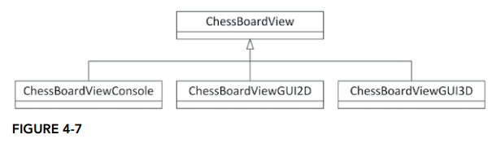

# 목록
### 4. 전문적인 C++ 프로그램 설계
#### [4.1 프로그램 설계 정의](#프로그램-설계-정의)
#### [4.2 프로그램 설계의 중요성](#프로그램-설계의-중요성)
#### [4.3 C++ 적합한 설계 방법](#c-적합한-설계-방법)
#### [4.4 C++ 설계에 관련된 두 가지 원칙](#c-설계에-관련된-두-가지-원칙)
#### [4.5 코드 재사용](#코드-재사용)
#### [4.6 체스 프로그램 설계](#체스-프로그램-설계)
### [5. 객체지향 설계](#객체지향-설계)
#### [5.1 절차형 사고방식](#절차형-사고방식)
#### [5.2 객체지향 철학](#객체지향-철학)
#### [5.3 클래스 세상에 살기](#클래스-세상에-살기)
#### [5.4 클래스 관계](#클래스-관계)

# 전문적인 C++ 프로그램 설계
 -  프로그래밍의 설계정의와 중요성
 -  C++ 에 고유한 설계
 -  효과적인 C++ 설계를 위한 두 가지
 -  재사용 가능한 코드의 유형
 -  재사용할 라이브러리를 선택하는 방법
 -  오픈소스 라이브러리와 C++ 표준 라이브러리

설계는 소프트웨어 엔지니어링에서 자주 간과되지만 중요한 요소다. 설계 없이 코딩을 시작하면 유지보수가 어려운 코드가 될 수 있다.

## 프로그램 설계 정의
 - 프로그램의 설계의 첫 단계는 요구사항 분석
 - 이해 당사자와 논의 해야함
 - 기능 요구사항(어떤 기능을 수행해야 하나)
 - 비 기능 요구사항(시스이 어떻게 동작하나, 보안성 확장성등)
 - 요구사항 수집이후 프로그램 설계 시작, 문서 형태로 작성
   - 프로그램을 구성하는 서브 시스템 : 인터페이스와 서브시스템 사이의 의존성, 서브시스템 사이의 데이터 흐름, 입출력, 기본 스레드 활용 모델
   - 서브시스템 세부사항 : 클래스 구성, 클래스 계층도, 데이터 구조, 알고리즘, 개별 스레드 활용 모델, 에러 처리 방법
 - 보통 UML 을 이용

## 프로그램 설계의 중요성

 - 설계 없이 코딩을 시작하면 복잡한 프로젝트에서 문제에 직면할 가능성이 크다.
 - 프로젝트 성공 여부는 개발자의 경험, 디자인 패턴에 대한 이해, 문제 도메인에 따라 달라짐
 - 설계 문서는 팀 프로젝트에서는 필수.
 - 팀 구성원이 프로젝트의 다른 부분을 담당할 때, 일관된 설계 문서가 필요
 - 설계의 필요성
   - 코드 작성 전에 설계하면 프로그램의 구성 요소가 어떻게 연관되는지 파악 가능
   - 설계 없이 진행하면 서브 시스템 간의 연결과 재사용 가능성을 놓치기 쉬움
   - 애자일 방법론처럼 반복적인 설계 과정은 계속해서 문서를 업데이트 해줘야 함

## C++ 적합한 설계 방법
C++ 설계의 주요 고려사항
 1. C++ 의 방대한 기능. C언어 뿐만 아니라 객체, 연산자 오버로딩, 예외 처리, 템플릿등 방대함으로 설계가 복잡
 2. 객체지향 언어. 클래스 계층 구조, 클래스 인터페이스, 객체간 상호 작용등을 고려
 3. 재사용 가능한 코드 설계. 클래스와 상속 외에 템플릿, 연산자 오버로딩 같은 기능으로 재사용 가능한 코드 설계
 4. 유용한 표준 라이브러리. 여러 데이터 구조와 알고리즘을 포함한 기능 제공
 5. 다양한 디자인 패턴 지원. 널리 알려진 디자인 패턴 기법을 적용하기 유용

설계의 어려움 및 해결 방법
 1. 도움 요청.
 2. 다른 작업으로 전환
 3. 우선 결정 이후 진행. 만약 잘못된 선택이라면 곧 문제는 드러날 것. 혹은 좋은 방식일 수도 있다.

C++ 설계는 코딩보다 더 어려울 수 있다. 연습이 필요

## C++ 설계에 관련된 두 가지 원칙

### 추상화
 - 추상화는 복잡한 시스템의 내부 작동 방식을 숨기고 외부 인터페이스만 노출

#### 추상화의 장점
 - 내부 구현 방식을 몰라도 코드를 사용할 수 있다.
 - 코드 인터페이스만 알면 기능을 사용할 수 있다.

#### 추상화를 적용하여 설계
 - 프로그램 설계시 인터페이스를 통해 내부 구현을 감추도록 클래스와 함수 설계
 - ex) 체스보드를 2차원 배열로 구현하는 대신, `ChessBoard` 클래스를 만들어 메모리 관리 등 구현 세부 사항을 감춘다

### 재사용
 - 기존의 해결책(코드)을 반복해서 새용하는 것이 코드 재사용
#### 재사용 가능한 코드 만들기
 - 프로그램 설계시 클래스나 알고리즘 데이터 구조를 재사용할 수 있도록 해야함
 - 당장 주어진 문제에만 적용할 수 있도록 너무 특화된 형태의 설계는 좋지 않다.
 - 특정 데이터 구조에 의존하는 대신 템플릿을 사용해 범용 코드 작성 가능

#### 설계 재사용
 - C++ 설계 패턴과 기법을 익히면 재사용에 용이
 - 설계 기법과 디자인 패턴이라는 재사용 기법 사용
 - 디자인 패턴은 자주 반복되는 문제를 해결하기 위한 표준 방법
 - `ErrorLogger`와 같은 예제에서 의존성 주입을 통해 설계 개선 가능

## 코드 재사용
### 용어 정리
코드 재사용은 세 가지로 구분 가능하다.
 1. 예전에 자신이 작성한 코드
 2. 동료가 작성한 코드
 3. 외부에서 작성한 서드파티 코드

코드 재사용 형태는 다으모가 같은 형태로 나뉜다
 - 독립 함수 또는 클래스 - 자신의 코드나 동료 코드 재사용시
 - 라이브러리 - 특정 작업을 수행하는 코드 모음, XML 파싱이나 암호화등 특정 기능 제공
 - 프레임워크 - 설계할 프로그램의 기방니 되는 코드 모음
 - 애플리 케이션 - 웹 서버 프로트엔드 같은 전체 애플리케이션을 통합 가능
 - API - 특정 목적을 위한 라이브러리나 코드의 인터페이스

### 코드 재사용의 판단 기준
코드 재사용 구칙은 이해하기 쉽지만, 실제 적용시 상황에 따라 다르다.
이때 장점과 단점을 고려해야 한다.
#### 코드 재사용 장점
 1. 시간 절약
 2. 단순한 설계(재사용 코드 설계 필요X)
 3. 디버깅 최소화
 4. 다양한 입력 조건 처리(광범위한 입력 조건과 사용자 오류를 처리할 수 있도록 설계)
 5. 보안 강화
 6. 지속적인 개선

#### 코드 재사용 단점
 1. 코드에 대한 이해 부족
 2. 기능 제한(원하는 기능을 정확히 제공하지 않을 수 있다)
 3. 성능 문제(성능 요구를 충족하지 못할 수 있다)
 4. 지원 문제(버그가 있을 경우 직접 수정 불가)
 5. 라이선스 문제
 6. 신뢰 문제(외부 코드에 대한 신뢰가 필요)

#### 판단 기준 정리
 - 직접 작성하는데 걸리는 시간과 라이브러리를 익히고 사용하는데 걸리는 시간을 비교, 결정해야함
 - ex) GUI 작성 시 MFC 나 Qt 같은 프레임워크를 사용하는 것이 효율적
 - 단순한 데이터 구조가 필요할 경우, 직접 구현이 더 나을 수 있다

### 코드 재사용 전략
#### 기능과 제약사항 파악
 - 라이브러리와 기능 한계를 이해하기 위해 충분이 익숙해야함 공개된 인터페이스 혹은 API 부터 검토
 - 인터페이스와 구현이 명확히 분리되지 않았다면, 소스 코드를 봐야함
 - 라이브러리 사용 경험이 있는 사람과 논의

선택시 고려할 점
 - 멀티스레드 프로그램에 안전?
 - 특정 컴파일러 설정을 요구?
 - 의존하는 다른 라이브러리가 있는가?

추가 고려 사항
 - 초기화 및 정리 호출 필요?
 - 클래스 상속시, 어떤 생성자를 호출하고 어떤 가상 메서드를 재정의해야 하나?
 - 모메리 포인터를 반환하는 함수의 경우 메모리 관리 책임자는 호출자와 라이브러리중 누구에게 있는가?(스마트 포인터 고려)
 - 반환 값으 종류와 모든 예외 이해
 - 라이브러리의 에러 처리 방식과 오류 알림 방법 검토

#### 학습 비용 파악
 - 학습 비용은 라이브러리를 사용하는 방법을 배우는데 걸리는 시간
 - 어떤 라이브러리는 학습 비용이 높을 수 있기에 잘 알려진 라이브러리를 사용하는것이 좋다. (ex. 표준 라이브러리)

#### 성능 파악
재사용 코드의 성능이 어느 수준까지 보장되는지 파악하는것도 중요. 특정 조건에서의 성능 테스트

##### Big-O 표기법
 - 알고리즘의 성능을 입력 크기의 함수로 설명. 상대적인 성능
 - 이를 알고리즘의 복잡도라고 부름

| **Algorithm Complexity** | **Big-O Notation** | **Explanation**                                      | **Example Algorithms**                   |
|--------------------------|--------------------|------------------------------------------------------|------------------------------------------|
| Constant                 | O(1)               | 입력 크기와 관련 없다 | 배열의 원소에 접근 |
| Logarithmic              | O(log n)           | 입력의 크기에 대해 밑이 2인 로그 함수로 결정 | 이진 탐색으로 정렬 리스트에서 원소 탐색 |
| Linear                   | O(n)               | 입력 크기에 정비례 | 정렬되지 않은 리스트에서 원소 탐색 |
| Linear Logarithmic       | O(n log n)         | 입력 크기에 대한 로그 함수의 선형 배수 | 병합 정렬 |
| Quadratic                | O(n²)              | 입력 크기의 제곱인 함수 | 선택 정렬과 같은 알고리즘 |
| Exponential              | O(2ⁿ)              | 입력 크기의 지수 함수 | 최적화된 버전의 TSP |

 - 플랫폼 독립적 - 성능이 입력 크기의 함수로 설명되기에 하드웨어나 플랫폼에 의존하지 않음
 - 입력 크기에 따른 성능 평가 - 다양한 입력에 대해 성능을 예측가능하여 효율적인 알고리즘 선택 가능

##### 성능 분석 관련 팁
 대부분의 C++ 표준 라이브러리는 알고리즘과 데이터 구조의 성능을 Big-O로 설명한다.

 Big-O의 한계
  - 절대적인 실행 시간 부족 - 상대적인 시간만 나오지 처음 입력에 대해 얼마나 오래 걸리는지는 언급하지 않는다.
  - 비교의 어려움 - 두 알고리즘 비교시 실제 어떤 것이 빠른지 실행하기 전에는 알기 어렵다
  - 작은 입력 크기에 대한 부정확성

추가 고려사항
 - 사용 빈도 고려 - 90/10 규칙을 참조하여 빈도 낮은 코드에서는 성능 최적화가 필수적이지 않음
 - 문서 신뢰하지 않기 - 직접 성능 테스트를 실행해 라이브러리가 요구하는 성능을 제공하는지 확인
#### 플랫폼 제약사항 파악
 - 라이브러리 사용시 지원되는 플랫폼 확인 필요
 - 크로스 플랫폼 라이브러리라도 플랫폼 간에 차이가 있을 수 있음
#### 라이선스와 기술 지원 파악
 - 서드파티 라이브러리 사용시 라이선스 문제 고려 필요
 - 오픈 소스 라이브러리도 라이선스 포함에 관련한 문제 고려 필요
#### 기술 지원 및 도움을 받을 수 있는 곳 파악
 - 라이브러리 사용 전에 버그 신고 절차와 문제 해결 소요시간 확인
 - 전체 애플리케이션 재사용시 버그 발생에 대한 책임 소재를 누가 할지 명확히 해야 함
#### 프로토타입
 - 새 라이브러리나 프레임워크 처음 사용시 프로토 타입 작성 필요
 - 단순 라이브러리 테스트 용도로 작성
#### 오픈소스 라이브러리
 - 일부 라이선스는 최종 제품에 라이선스를 포함하거나, 오픈 소스로 공개하도록 요구
 - XML 파싱, 오류 로깅 등 다양한 C++ 라이브러리를 무료로 사용할 수 있고, 코드를 수정해 맞춤화 가능
 - 오픈 소스 라이브러리는 지원 이슈가 있으며, 기여가 요구될 수 있음
 - 버그 수정시 공개 저장소에 기여하고 문제 보고 필요

#### C++ 표준 라이브러리

 - 가장 중요한 라이브러리
 - 모든 표준 준수 컴파일러에 포함
 - C 표준 라이브러리도 사용 가능
 - 표준 라이브러리는 기능과 성능, 직교성 위주로 설계
 - 표준 라이브러리 사용시 ㅅ학습시간이 서드파티 사용시보다 훨씬 적다.

## 체스 프로그램 설계

### 요구사항
 - 표준 체스 규칙 준수
 - 두 명의 플레이어 지원. 컴퓨터가 조작하는 플레이어는 고려 하지 않는다
 - 인터페이스는 텍스트 기반
   - 체스보드와 말은 일반 텍스트로 표현
   - 플레이어는 체스보드의 위치를 숫자로 입력
### 설계 단계
 - 프로그램 설계시 일반적인 부분에서 점차 구체적으로 진행해야 한다. 이때 다이어그램과 표를 사용하여 시각화 하는것이 좋다.
#### 서브시스템으로 분할
 1. 기능적 서브시스템 분리 - 프로그램을 여러 기능적 서브 시스템으로 나누고, 서브 시스템 간의 인터페이스를 정의
 2. 세부 구현 고려하지 않기 - 데이터 구조나 알고리즘은 고려하지 않고, 시스템간의 주요 기능과 인터페이스 고려
 3. MVC 패턴 사용
    - Model - 데이터와 비즈니스 로직
    - View - 데이터의 시각적 표현
    - Controller - 사용자 입력을 처리하고 모델 수정
  

| **Subsystem Name** | **Instances** | **Functionality** | **Interfaces Exported** | **Interfaces Consumed** |
|--------------------|---------------|-------------------|-------------------------|-------------------------|
| GamePlay           | 1             | 게임 시작, 게임 흐름 제어, 화면 제어, 승자 결정, 게임 종료 | 게임 종료 | 차례 바꾸기(Player), 그리기(ChessBoardView) |
| ChessBoard         | 1             | 체스 말 저장, 무승부나 체크메이트 검사 | 말 위치 확인, 말 위치 조정 | 게임 종료(GamePlay) |
| ChessBoardView     | 1             | 현재 상테에 맞게 체스보드 그리기 | 그리기 | 그리기(ChessPieceView) |
| ChessPiece         | 32            | 말을 움직인다. 규칙에 맞게 움직였는지 확인 | 이동, 이동확인 | 말 위치 확인(ChessBoard), 말 위치 설정(ChessBoard) |
| ChessPieceView     | 32            | 현재 상태에 맞게 체스 말 그리기 | 그리기 | 없음 |
| Player             | 2             | 사용자에게 이동할 위치를 물어보고, 입력 받기, 말 움직이기 | 차례 바꾸기 | 말 위치 확인(ChessBoard), 이동(ChessPiece), 이동 확인(ChessPiece) |
| ErrorLogger        | 1             | 에러 메시지를 로그 파일에 기록 | 에러 기록 | 없음 |
 - 위 도표의 주어진 클래스를 서브 시스템 다이어그램으로 표현하면 다음과 같다.

#### 스레드 모델 선택
 - 설계 초기 단계에서는 구체적인 알고리즘을 멀티 스레드로 구현할 방법을 고민할 필요 없다.
 - 대신 고수준의 스레드 수와 스레드 간의 상호작용을 정의는 필요.
 - 멀티스레드 설계시 공유 데이터는 최소화 해야 한다. 만일 공유해야 한다면 락 방식을 지정해야함
 - 병렬로 처리 가능한 여러 작업이 있는 경우 멀티스레드 프로그램이 적합
#### 서브 시스템의 클래스 계층 구성
 - 구체적으로 프로그램에 구현할 클래스 계층을 결정
 - `ChessPiece` 클래스는 추상 클래스, 그 외에 파생 클래스들을 포함. `ChessPiceView` 클래스도 비슷한 구조
 - `ChessBoardView` 클래스는 2D GUI, 3D GUI 인터페이스를 위한 구체적 클래스 필요

#### 서브 시스템의 클래스, 데이터 구조, 알고리즘, 패턴 지정
| **Subsystem** | **Classes** | **Data Structures** | **Algorithms** | **Patterns** |
|---------------|-------------|---------------------|----------------|--------------|
| GamePlay | `GamePlay` | `GamePlay` 객체는 `ChessBoard` 객체 한 개와 `Player` 두 개를 가진다 | 플레이어는 말을 번갈아 움직인다 | 없음 |
| ChessBoard | `ChessBoard` | `ChessBoard` 객체는 `ChessPieces` 를 최대 32개 가질 수 있는 2차원 8, 8 그리드 구조로 저장한다 | 매번 말을 움직일때마다 우승 또는 무승부 여부를 검사 | 없음 |
| ChessBoardView | `ChessBoardView` 추상 베이스 클래스 `ChessBoardViewConsole`, `ChessBoardViewGUI2D` 등의 파생 구현 클래스 | 체스보드를 그릴 방법에 대한 정보를 저장 | 체스보드를 그린다 | 옵저버 패턴 |
| ChessPiece | `ChessPiece` 추상 베이스 클래스, `Rook`, `Bishop`, `Knight`, `King`, `Pawn`, `Queen` 파생 구현 클래스 | 각 말마다 체스보드 위의 위치를 저장한다 | 체스보드 위에 놓인 말의 위치가 규칙에 맞게 이동했는지 검사 | 없음 |
| ChessPieceView | `ChessPieceView` 추상 베이스 클래스, `RookView`, `BishopView` 등의 파생 클래스 `RookViewConsole`, `RookViewGUI2D`, 등의 파생 구현 클래스 | 체스 말을 그리는 방법에 대한 정보 저장 | 옵저버 패턴 |
| Player | `Player` 추상 베이스 클래스, `PlayerConsole`, `PlayerGUI2D` 등의 파생 구현 클래스 | 없음 | 사용자에게 이동할 위치를 물어보고, 그 움직임이 규칙에 맞는지 확인한 뒤 말을 이동시킨다 | Mediator 패턴 |
| ErrorLogger | `ErrorLogger` 클래스 | 로그에 기록할 메시지에 대한 큐 | 메시지를 버퍼에 담았다가 로그 파일에 쓴다 | Dependency injection 패턴 |
 - 각 서브시스템에 구현할 구체적인 클래스와 같이 서브시스템에 대한 세부사항 지정
 - 상호작용을 위해 **UML 시퀀스 다이어그램** 으로 표현
 - 실제 설계 문서를 작성할 대는 각 클래스에 대한 실제 인터페이스까지 구체적으로 표현
 - 이 단계에서 재사용성을 높이기위해 알고리즘, 패턴 등을 잘 파악해둔다.

#### 서브 시스템의 에러 처리 방법
 - 에러처리 방식을 정할 때 시스템 에러와 사용자 에러를 모두 고려
 - 서브시스템에서 익셉션을 사용하는지도 지정
 - 발생 가능한 경우의 수를 면밀히 검토

| **Subsystem** | **Handling System Errors** | **Handling User Errors** |
|---------------|----------------------------|--------------------------|
| GamePlay | `ErrorLogger` 로 에러를 로그에 기록하고, 사용자에게 메시지를 출력하고, 예기치 않은 에러가 발생하면 프로그램을 안전하게 종료 | 없음 |
| ChessBoard, ChessPiece | 메모리 할당에 실패하면 `ErrorLogger` 에러를 로그에 기록한 뒤 익셉션을 발생 | 없음 |
| ChessBoardView, ChessPieceView | 렌더링 과정에서 문제가 발생하면 `ErrorLogger` 로 에러를 로그에 기록한 뒤 익셉션을 발생 | 없음 |
| Player | 메모리 할당에 실패하면 `ErrorLogger` 로 에러를 로그에 기록한 뒤 익셉션 발생 | 사용자가 이동한 말이 체스보드를 벗어나지 않았는지 검사. 벗어나면 다시 입력하도록 요청. 이 서브시스템은 말을 매번 움직일 때마다 규칙에 맞는지 검사. 규칙에 어긋나면 사용자에게 재입력을 요청 |
| ErrorLogger | 메모리 할당에 실패하면 로그에 에러를 기록하고 사용자에게 이 사실을 알려주고, 프로그램을 안전하게 종료 | 없음 |

## 정리
 - 두 가지 설계 주제인 추상화와 재사용성의 강조
 - 코드 재사용에 관한 장단점과 성능 분석을 포함하여 설계시 고려

## 연습문제
1. 추상화와 재사용성
   - 추상화 - 인터페이스와 구현의 분리
   - 재사용 - 라이브러리 프레임워크 디자인 패턴등을 활용한 설계를 최대한 재사용
2. 카드 덱을 관리하는 `Deck` 클래스를 만들어 카드 섞기, 나눠주기 등 메서드를 통해 추상화를 할 수 있다
3. 두 가지
	- 안드로이드와 iOS 모두에서 게임이 실행되도록 핵심 코드는 플랫폼에 종속되지 않도록 한다.
	- 크로스 플랫폼 지원이 가능한 유니티 언리얼 엔진같은 게임 엔진을 사용
4. $O(1)$, $O(log(n))$, $O(n)$, $O(n^2)$

# 객체지향 설계
 - 객체 지향 프로그래밍 설계의 정의
 - 클래스, 객체, 속성, 행동 - OOP 의 기본 구성 요소
 - 객체 간의 관계 정의 - 객체 사이의 관계 정의

## 절차형 사고방식
 - C 같은 절차형 언어는 프로시저들로 코드를 구성
 - 프로시저는 프로그램이 하는 일을 중심으로 만든 개념
 - 프로그래머가 코드를 읽고 관리하기 쉽도록 추상화 한 것
 - 일정한 단계로 순차적 진행을 하는 프로그램에 적합
 - 복잡한 프로그램에는 부적합
 - 데이터의 표현 방식을 우선시 하지 않음

## 객체지향 철학
 - 절파형 접근은 프로그램이 하는 일이 중심
 - OOP는 모델링하려는 현실 세계의 대상이 중심, 실제 대상에 대한 모델 단위로 구성
 - **클래스, 컴포넌트, 속성, 동작** 중심

### 클래스
 - 구체적인 대상과 그 대상에 대한 정의 구분을 위한 용도
 - **오렌지**는 일반적인 모든 오렌지의 특성
 - 한 오렌지를 가리키면 그것은 클래스의 인스턴스로서 구체적인 특성을 가짐

### 컴포넌트
 - OOP 에서는 복잡한 개체는 더 작은 컴포넌트로 나눌 수 있음
 - 비행기는 동체, 엔진, 착륙 장치등으로 나눌 수 있음

### 속성
 - 객체는 속성(프로퍼티)으로 구분
 - 클래스 속성의 값은 그 클래스에 속한 모든 객체에서 같다
 - 객체 속성의 값은 그 클래스에 속한 객체마다 다르다

### 동작
 - 동작은 객체가 직접 하거나 그 객체로 할 수 있는 일
 - OOP 에서는 어떤 기능을 수행하는 코드를 프로시저가 아닌 클래스 단위루 묶음
 - 동작은 클래스 메서드로 구현
 - ex) 주식 종목 클래스는 가격 불러오기, 과거 데이터 분석하기 등이 가능

### 중간정리
 1. 주식시세에 대한 클래스 정의, 각가의 주식 시세를 그룹단위로 묶을때 이를 컬렉션이라 부름
    - 주식시세 컬렉션 클래스 정의 후 주식 시세를 표현하는 컴포넌트 추가
 2. 주식시세 컬렉션 클래스에 '수집한 시세 목록'이란 속성 추가
 3. 시세 정보 가져오기, 시세 정보 정렬하기 등 메소드 추가

## 클래스 세상에 살기
 - 절차형 프로그래밍에서 OOP 로 전환시 접근 방식은 크게 두 가지
 - 설계 단계로 돌아가 일부를 클래스로 전환
   - 클래스를 단순히 데이터와 기능을 묶는 수단으로만 인식
   - 가독성과 유지보수성만 높임
 - 혹은 코드를 모두 버리고 OOP 방식으로 새로 만듦
 - 절충안을 찾는것이 적합한 방법
### 과도한 클래스화
 - 너무 작은 요소까지 클래스로 만드는 과도한 설계
 - 간단한 틱택토 게임에서 마커는 state 로 표시할 수 있음
 - 미래의 확장성, 변화의 가능성을 고려해 클래스로 만들지만 지나치는것은 피하는게 좋음
### 지나치게 일반화한 클래스
 - 지나치게 일반적인 클래스는 구체적인 대상을 표현하기 힘듦
 - 미디어 데이터를 하나의 클래스로 묶는다면
   - 데이터란 속성은 정확한 미디어의 특성을 나타내지 못함
   - 실행이란 동작도 타입마다 너무 다름
   - 이때는 미디어란 클래스와 구체적인 `Picture` 나 `Movie` 같은 하위 클래스를 사용

## 클래스 관계
 - 프로그램 설계시 클래스들은 서로 관계를 맺음
 - OOP 에서 이런 관계를 표현하는데는 두 가지가 있음 **has-a**, **is-a**

### has-a 관계
 - "A가 B를 가진다" 또는 "A가 B를 포함한다" 라는 패턴
 - 버튼을 포함하는 윈도우 창
 - has-a 관계에는 **Aggregation** 과 **Composition** 으로 나뉨
   - Aggregation - 구성된 객체는 부모 객체가 없어져도 존재
   - Composition - 구성된 객체는 부모에 종속되어 부모가 사라지면 같이 사라짐
### is-a 관계
 - is-a 관계는 상속을 통해 구현(원숭이는 동물 클래스의 하위 클래스)
 - 상속은 공통 속성과 동작을 기본 클래스에 정의하고 구체적인 속성과 동작은 파생 클래스에서 정의
 - Checkbox 는 버튼의 확장(Checkbox is a button)
 - 좋은 설계는 공통 기능은 기본 클래스에 배치해 하위 클래스가 공통 기능을 상속 받도록 함(코드 중복성 제거)
#### 상속 기법
 - 부모 클래스와 파생 클래스를 구분하는 몇 가지 방법
1. 기능 추가
    - 파생 클래스는 부모 클래스의 기능을 확장할 수 있음
2. 기능 변경
    - 파생 클래스는 부모 클래스의 메서드를 override 할 수 있음
3. 속성 추가
    - 파생 클래스는 새로운 속성을 추가 할 수 있음
4. 속성 변경
    - 파생 클래스가 베이스 클래스와 같은 이름의 속성을 정의해서 은닉할 수 있음
    - 하지만 이렇게 하는것이 바람지갛지 않을때가 더 많음

#### 다형성
 - 객체가 정해진 속성과 메서드를 따른다면 서로 바꿔서 적용이 가능함
 - ex) Monkey 객체는 Monkey 클래스에 정의된 속성과 메서드 제공, 또한 Animal 클래스에 정의돈 속성과 메서드도 제공해야함.
 - 사용자는 Animal 클래스의 메서드를 객체를 고려하지 않고 호출한다면 각 객체는 자신이 알고 있는 방식으로 메서드 수행
### has-a 관계와 is-a 관계 구분하기
 - has-a 와 is-a 관계의 구분
   - 현실에서 두 관계는 구분이 쉽지만 코드에서는 모호할 수 있다.
 - `AssociativeArray` 클래스의 경우 하나의 키에는 단일 값에만 매핑
 - 만약 여려 값이 같은 키에 매핑되는 구조 필요시 값으로 **컬렉션** 사용 할 수 있음, 이를 위해 `MultiAssociativeArray` 라는 클래스 생성
 - Is-a 관계
   - `MultiAssociativeArray` 가 `AssociativeArray`를 상속한다면, 메서드 재정의 필요, 설계가 복잡해짐
   - 기존 인터페이스를 사용하는데 어려움이 생길 수 있고, LSP 위반 할 수 있음
 - Has-a 관계
   - `MultiAssociativeArray` 가 `AssociativeArray` 객체를 포함한느 경우, 복잡성은 줄이고 인터페이스도 그대로 유지 가능
   - 더 안정적이고 유지보수하기 쉬운 설계. 기능이 독립적으로 관리

| | IS-A | HAS-A |
|-|------|-------|
| **지지 이유** | 속성만 다를 뿐 추상화 방식은 같다. | `MultiAssociativeArray` 는 `AssociativeArray` 에서 제공하는 메서드에 구애받지 않고 마음껏 원하는 메서드 추가 가능. |
| | `MultiAssociativeArray` 에서 제공하는 메서드는 `AssociativeArray`와 별 차이 없음 | 외부에 드러난 메서드를 변경하지 않고 `AssociativeArray` 완느 다른 방식으로 얼마든지 변경 가능 |
| **반대 이유** | 연관 배열의 정의에 따르면 반드시 키 하나에 값도 하나만 가져야 한다. 따라서 `MultiAssociativeArray` 는 연관 배열이라 볼 수 없다 | `MultiAssociativeArray` 는 메서드만 새로 고칠 뿐 실질적으로는 기존에 있는 것을 다시 만드는 것 |
|              | `MultiAssociativeArray` 는 `AssociativeArray`에서 제공하는 두 메서드를 모두 오버라이드하는데, 이것만 봐도 설계가 잘못되었음 | 부족한 속성이나 메서드는 `AssociativeArray` 에 추가해도 충분 |
|              | `AssociativeArray` 에서 잘못된 속성이나 메서드가 `MultiAssociativeArray`에 악영향을 미칠 수 있음 | |

### not-a 관계
 - OOP 설계시 클래스 간에 관계가 실제로 필요한지 생각해야함
 - 불필요하게 클래스, 파생 클래스 관계를 설정하도록 하지 않아야 함
 - OOP 는 기능적 관계를 모델링 해야하며, 현실세계를 꼭 따르지 않아도 됨.(인위적 관계는 X)
 - 먼저 설계를 도표로 그려서 각 클래스와 파생 클래스에 넣을 속성과 메서드 정리
 - 만약 클래스가 고유 속성이나 메서드가 없거나 파생 클래스에 의해 모두 재정의 되면 재설계

 - Music 과 CEO 관계는 코드상 의미있는 관계인지 고려해야함
### 클래스 계층

 - OOP 설계시 여러 단계의 계층 구조 모델링 가능
 - 클래스 설계시 유사한 기능이 반복되는 경우 공통 부모 클래스로 묶어 정의
   - 사자와 표범의 이동 방식과 먹이가 같다면 묶어서 부모 클래스 생성.
 - 구체적인 요구사항에 따라 계층 관계 설계
 - 기능적으로 의미 있는 관계로 묶어 클래스 구성
 - 공통 기능을 베이스 클래스로 두어 코드 재사용성 지원
 - 파생 클래스가 베이스 클래스를 과도하게 오버라이딩 하지 않도록 설계
### 다중 상속

 - 클래스가 두 개 이상의 부모 클래스를 가지는 경우
   - ex) 이동방식, 먹이, 동물의 형태로 부모 클래스를 만들고 여러 클래스를 상속하여 동물 클래스들 생성
 - **장점**
   - 특정 경우에 유용, 복잡한 관계를 모델링 하는데 사용
 - **단점**
   - 시각화하고 관리하기 어려움
   - 구조의 명확성이 깨짐, 계층 구조가 지저분해진다
   - 구현이 복잡하다
     - 두 부모 클래스가 같은 메서드를 다르게 구현하면 충돌
 - **대안**
   - 다중 상속을 피하기 위해 설계를 재구성하거나, 인터페이스를 사용하는 방법
   - 일부 언어는 지원을 안하거나, 인터페이스만 지원
### 믹스인 클래스

 - 믹스인 클래스는 다중 상속과 비슷하지만 의미는 다름
 - "이 클래스는 무엇을 할 수 있는가?" 에 대한 대답
   - 클래스에 기능을 추가하지만 완전한 상속은 아님
   - **shares-with** 관계
 - 사용자 이터페이스 코드에 흔함
   - 단순히 **클릭 가능 기능** 추가를 위해 `Clickable`믹스인 클래스 생성
   - 이후에 `Image` 에 추가하여 `Image` 와 `Button` 모두 상속받는 대신 클릭 가능한 이미지 클래스 구현이 가능
 - 믹스인 클래스는 기본 클래스와 달리, 특정 동작만 추가하여 다중 상속보다 관리 용이
 - 믹스인은 기능이 제한적이고 다른 클래스와 기능이 섞이는 일이 없어 기능 충돌 가능성도 낮다.

## 연습문제
 1. 
      - `Car` 클래스 하위로 여러 속성들을 컴포넌트로 변환하여 `Car` 클래스가 포함할 수 있도록 한다.
 2. 두 가지 방식이 있을 수 있다
      - Strategy 패턴 사용
        - `DriveStrategy` 인터페이스를 정의하고 HumanDriver 와 AIDriver 클래스를 구현
        - `Car` 클래스는 `DriverStrategy` 인터페이스 사용하여 운전방식 수행
 3. 
      - `Person` - `Employee` - `Manager` 순으로 상속받도록 클래스 설계
 4. `Person` 에는 기본적으로 이름, 주소만 관리하도록 속성, 메서드 추가
      - `Emplyee` 에는 직원 Id, 연봉, 입사일 등의 정보 속성, 관리 메서드 추가
      - `Manager` 에는 팀원들을 관리 할 수 있도록 팀 멤버를 배열 형식으로 속성, 관리 메서드 추가