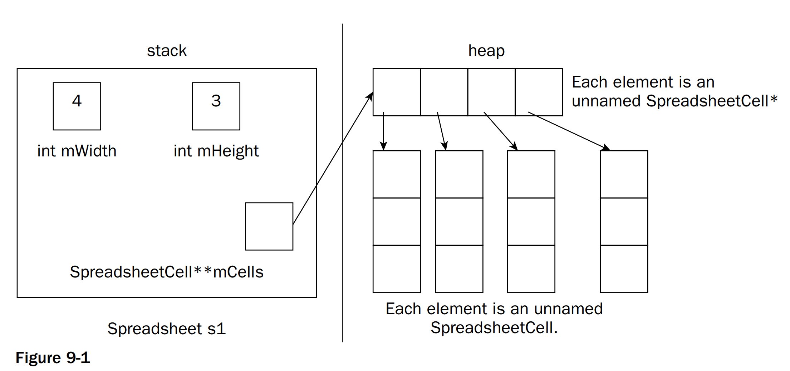
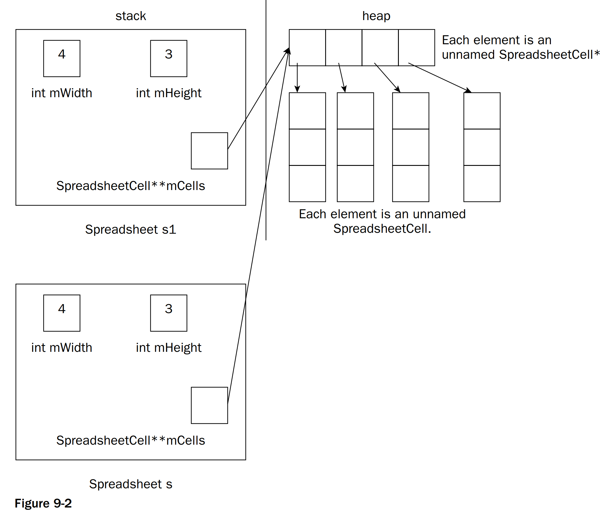
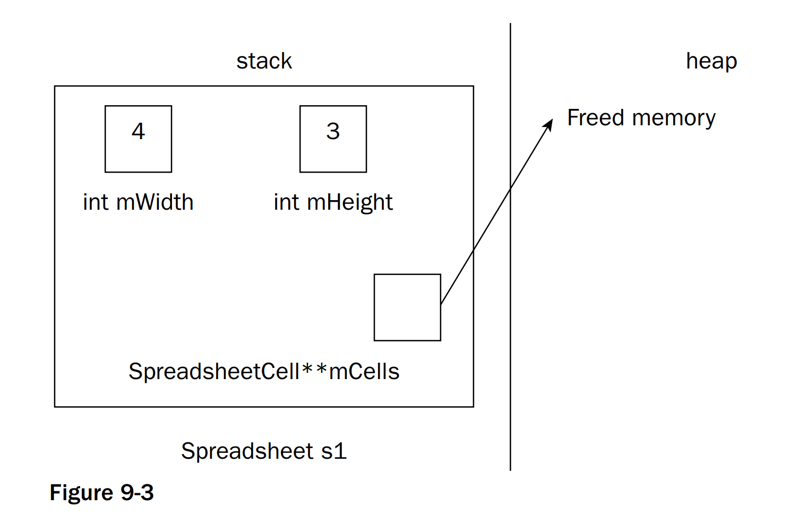
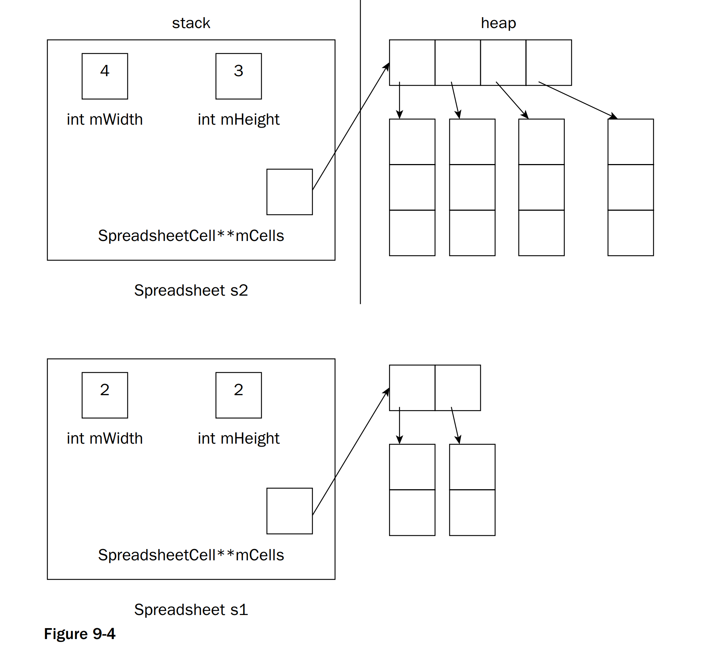
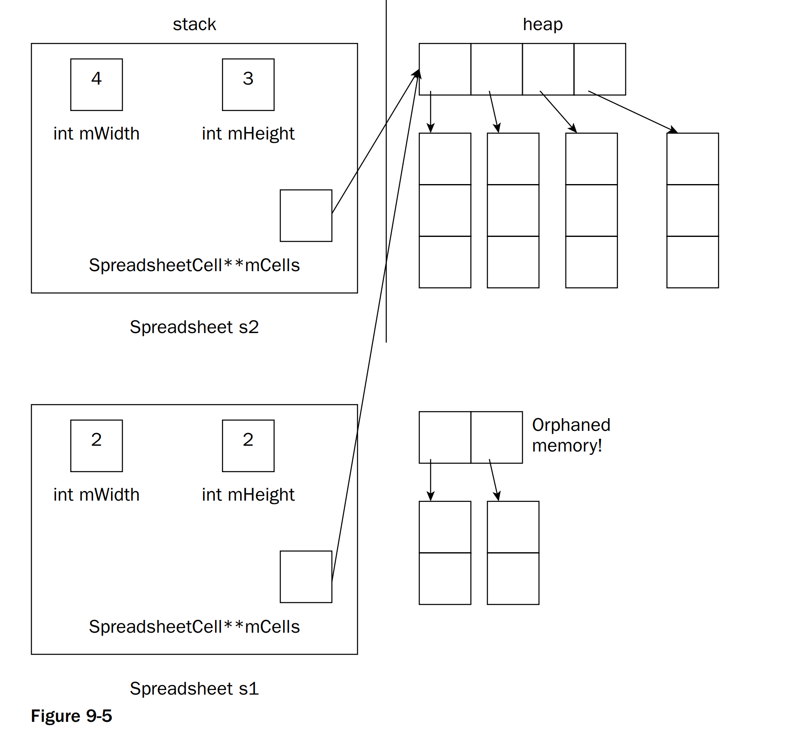

# 8. 클래스와 객체 숙달하기

## 8.1 스프레드시트 예제

예제를 통해 알아보자.


## 8.2 클래스 작성 방법

클래스는 그 클래스의 모든 객체에 적용할 메서드와 각 객체마다 가질 데이터 멤버 지정

### 8.2.1 클래스 정의

```c++
class SpreadsheetCell
{
    public:
        void setValue(double inValue);
        double getValue() const;

    private:
        double mValue;
};
```

클래스의 정의는 항상 class 키워드와 클래스 이름으로 시작

클래스의 정의는 문장이다. 따라서 마지막에 세미콜론 필수


#### 8.2.1.1 클래스 멤버

- 멤버 함수 : 메서드, 생성자, 소멸자
- 멤버 변수 : 열거형, 타입 앨리어스, 중첩 클래스

위와 같은 멤버들은 객체 단위로 적용. 단, 정적 멤버는 클래스 단위로 적용


#### 8.2.1.2 접근 제어

- 접근 제한자
  - public : 어디에서나 접근 가능 / 클라이언트가 사용할 메서드, 게터, 세터
  - protected : 같은 클래스 및 파생 클래스 접근 가능 / 외부 클라이언트가 사용하면 안되는 헬퍼 메서드
  - private : 같은 클래스로만 접근 가능 / 데이터 멤버버

- 접근 제한자따로 명시하지 않으면 private 적용
- struct : 접근 제한자가 public 인 class


#### 8.2.1.3 선언 순서

선언 순서는 따로 제한이 없음. 가독성을 위해 묶어서 선언


#### 8.2.1.4 클래스 내부의 멤버 이니셜라이저

클래스를 정의할 때는 멤버 변수를 선언하는 동시에 초기화 가능

```c++
class SpreadsheetCell
{
    private:
        double mValue = 0;
};
```

### 8.2.2 메서드 정의 방법

```c++
#include "SpreadsheetCell.h"

void SpreadsheetCell::setValue(double inValue)
{
    mValue = inValue;
}

double SpreadsheetCell::getValue() const
{
    return mValue;
}
```

- 클래스 이름과 메서드 이름 사이의 스코프 지정 연산자 :: 

#### 8.2.2.1 데이터 멤버 접근 방법

setValue() 나 getValue() 메서드는 객체에 대해 실행

#### 8.2.2.2 다른 메서드 호출하기

```c++
#include <string>
#include <string_view>

class SpreadsheetCell
{
    public:
        void setValue(double inValue);
        double getValue() const;

        void setString(std::string_view inString);
        std::string getString() const;
    private:
        std::string doubleToString(double inValue) const;
        double stringToDouble(std::string_view inString) const;
        double mValue;
};
```

```c++
#include "SpreadsheetCell.h"
using namespace std;

void SpreadsheetCell::setValue(double inValue)
{
    mValue = inValue;
}

double SpreadsheetCell::getValue() const
{
    return mValue;
}

void SpreadsheetCell::setString(string_view inString)
{
    mValue = stringToDouble(inString);
}

string SpreadsheetCell::getString() const
{
    return doubleToString(mValue);
}

string SpreadsheetCell::doubleToString(double inValue) const
{
    return to_string(inValue);
}

double SpreadsheetCell::stringToDouble(string_view inString) const
{
    return strtod(inString.data(), nullptr);
}
```

#### 8.2.2.3 this 포인터

메서드 호출 시 항상 메서드가 속한 객체의 포인터인 this 가 숨겨진 매개변수로 전달

```c++
void SpreadsheetCell::setValue(double value)
{
    this.vlaue = value;
}
```

### 8.2.3 객체 사용법

#### 8.2.3.1 스택에 생성한 객체

```c++
SpreadsheetCell myCell, anotherCell;
myCell.setValue(6);
anotherCell.setString("3.2");
```

- dot 연산자로 메서드 접근

#### 8.2.3.2 힙에 생성한 객체

```c++
SpreadsheetCell* myCellp = new SpreadsheetCell();
myCellp->setValue(3.7);

delete myCellp;
myCellp = nullptr;
```

- -> 화살표 연산자로 접근. 역참조 연산자(*) 과 멤버 접근 연산자(.) 합친 연산자
- 힙에 생성한 객체는 항상 delete 로 해제

```c++
auto myCellp = make_unique<SpreadsheetCell>();
myCellp->setValue(3.7);
```

- 메모리 문제가 발생하지 않기 위해 반드시 스마트 포인터 사용

## 8.3 객체의 라이프 사이클

- 생성, 소멸(제거), 대입(할당) 로 구성

### 8.3.1 객체 생성

객체를 선언과 동시에 초기값을 설정하는 것이 좋음

이작업은 생성자(ctor) 라 부르는 특수한 메서드에 코드를 작성

#### 8.3.1.1 생성자 작성 방법

- 생성자 이름은 클래스 이름과 동일
- 리턴값이 없으며 필요에 따라 매개변수 받을 수 있음
- 디폴트 생성자 : 아무런 인수를 주지 않고 호출되는 생성자

```c++
class SpreadsheetCell
{
    public:
        SpreadsheetCell(double initialValue);
};

SpreadsheetCell::SpreadsheetCell(double initialValue)
{
    setValue(initialValue);
}
```

#### 8.3.1.2 생성자 사용법

- 스택 객체 생성자

```c++
SpreadsheetCell myCell(5), anotherCell(4);
cout << "cell 1 : " << myCell.getValue() << endl;
cout << "cell 2 : " << anotherCell.getValue() << endl;
```

- 힙 객체 생성자
  
```c++
auto smartCellp = make_unique<SpreadsheetCell>(4);

SpreadsheetCell* myCellp = new SpreadsheetCell(5);
SpreadsheetCell* anotherCell = nullptr;
anotherCell = new SpreadsheetCell(4);

delete myCellp; myCellp = nullptr;
delete anotherCell; anotherCell = nullptr;
```

- 스택의 경우 선언할 때 생성자 호출
- 힙의 경우 선언할 때 바로 생성자 호출하지 않아도 됨
  
#### 8.3.1.3 생성자 여러 개 제공하기

- 오버로딩
  - 컴파일러가 호출하는 시점에 매개변수 타입 일치하는 함수 선택
  - 생성자 안에서 다른 생성자 호출 가능 ( 위임 생성자 )

```c++
class SpreadsheetCell
{
    public:
        SpreadsheetCell(double initialValue);
        SpreadsheetCell(std::string_view initialValue);
};

SpreadsheetCell::SpreadsheetCell(string_view initialValue)
{
    setString(initialValue);
}
```

#### 8.3.1.4 디폴트 생성자

- 디폴트 생성자 : 아무런 인수도 받지 않는 생성자 / 영(0)인수 생성자라고 부름

- 디폴트 생성자가 필요한 경우
  - 객체 배열을 생성하는 경우, 객체 배열을 저장할 메모리 할당 -> 디폴트 생성자 호출
```c++
// 디폴트 생성자가 없는 경우 에러
SpreadsheetCell cells[3];
SpreadsheetCell* myCellp = new SpreadsheetCell[10];
```

- 디폴트 생성자 작성 방법

```c++
class SpreadsheetCell
{
    public:
        SpreadsheetCell();
};

SpreadsheetCell::SpreadsheetCell()
{
    myValue = 0;
}
```

- 사용자가 생성자를 1개라도 선언하지 않았을 경우에만 컴파일러가 자동으로 생성해줌
  
- 명시적 디폴트 생성자
```c++
class SpreadsheetCell
{
    public:
        SpreadsheetCell() = default;
        SpreadsheetCell(double initialValue);
        SpreadsheetCell(std::string_view initialValue);
};
```

- 명시적으로 삭제된 생성자
```c++
class SpreadsheetCell
{
    public:
        SpreadsheetCell() = delete;
};
```


#### 8.3.1.5 생성자 이니셜라이저

생성자에서 데이터 멤버를 초기화하기 위한 생성자 이니셜라이저를 제공

객체 생성 시점에 데이터 멤버를 바로 초기화할 수 있음.
이는 나중에 값을 따로 대입하는 것보다 효율적임.

생성자 이니셜라이저나 클래스 내부 생성자 구문으로 초기화해야하는 타입
- const 데이터 멤버
- 레퍼런스 데이터 멤버
- 디폴트 생성자가 정의되지 않은 객체 데이터 멤버
- 디폴트 생성자가 없는 베이스 클래스 : 이는 10장


```c++
SpreadsheetCell::SpreadsheetCell(double initialValue)
    :mValue(initialValue)
{
}
``` 

생성자 이니셜라이저는 클래스 정의에 나온 순서대로 초기화됨.


#### 8.3.1.6 복제 생성자

- 다른 객체와 똑같은 객체를 생성할 때 복제 생성자를 사용.
- 직접 작성하지 않으면 컴파일러가 자동으로 생성

복제 생성자는 원본 객체에 대한 const 레퍼런스를 인수로 받음

```c++
class SpreadsheetCell
{
    public:
        SpreadsheetCell(const SpreadsheetCell& src);
};


SpreadsheetCell::SpreadsheetCell(const SpreadsheetCell& src)
    : mValue(src.mValue)
{
}
```


- C++ 에서 함수에 인수를 전달할 때 기본적으로 값으로 전달. 함수나 메서드는 값이나 객체의 복사본을 받는다. 객체를 전달하면 컴파일러는 복제 생성자를 호출함.

- 복제 생성자 명시적으로 호출하기
```c++
SpreadsheetCell myCell1(4);
SpreadsheetCell myCell2(myCell1);
```

- 레퍼런스로 객체 전달
  - 객체를 레퍼런스로 전달하면 복제 연산으로 인한 오버헤드 줄일 수 있음
  - const 레퍼런스로 전달하면 더 좋음

- 명시적으로 디폴트로 만든 복제 생성자와 명시적으로 삭제한 복제 생성자

```c++
SpreadsheetCell(const SpreadsheetCell& src) = default;
SpreadsheetCell(const SpreadsheetCell& src) = delete;
```

#### 8.3.1.7 이니셜라이저 리스트 생성자

- std::initializer_list<T> 를 첫번째 매개변수로 받고, 다른 매개변수는 없거나 디폴트값을 가진 매개변수를 추가로 받는 생성자
- 표준 라이프러리는 모두 이니셜라이저 리스트 생성자 지원


```c++
EvenSequence(initializer_list<double> args)
{
    if(args.size() % 2 != 0)
    {
        throw invalid_argument("initializer_list should ""contain even number of elements.");
    }
    mSequence.assign(args); // 복사
}

EvenSequence p1 = {1.0, 2.0, 3.0, 4.0, 5.0, 6.0};
p1.dump();

try {
    EvenSequence p2 = {1.0, 2.0, 3.0};
} catch (const invalid_argument& e) {
    cout << e.what() << endl;
}
```


#### 8.3.1.8 위임 생성자
- 같은 클래스의 다른 생성자를 생성자 안에서 호출
- 반드시 생성자 이니셜라이저에서만 호출해야 함

```c++

SpreadsheetCell::SpreadsheetCell(string_view initialValue)
    : SpreadsheetCell(stringToDouble(initialValue))
{
}
```

#### 8.3.1.9 컴파일러가 생성하는 생성자 정리

복제 생성자의 경우 명시적으로 정의하지 않는 한 컴파일러가 자동으로 생성
디폴트 생성자의 경우 어떠한 생성자도 정의하지 않았다면 컴파일러가 자동으로 생성


### 8.3.2 객체 소멸

객체가 제거되는 과정은 먼저 객체의 소멸자를 호출한 다음 할당받은 메모리를 반환

객체를 정리하는 작업을 소멸자에서 구체적으로 지정

소멸자를 지정하지 않으면 컴파일러가 생성 ( 9.2.2 )

스택 객체의 경우 현재 실행하는 함수, 메서드, 코드 블록이 끝날 때와 같은 스코프를 벗어날 때 자동으로 삭제

힙 객체의 경우 delete 를 명시적으로 호출해서 그 객체의 소멸자를 호출하고 메모리를 해제해야 함.


### 8.3.3 객체에 대입하기

```c++
SpreadsheetCell myCell(5), anotherCell;
anotherCell = myCell;
```

다음과 같이 객체를 대입하기 위해서 대입 연산자가 필요


#### 8.3.3.1 대입 연산자 선업 방법

```c++
class SpreadsheetCell
{
    public:
        SpreadsheetCell& operator=(const SpreadsheetCell& rhs);
};
```

#### 8.3.3.2 대입 연산자 정의 방법

대입 연산자와 복제 생성자 차이점
1. 복제 생성자는 초기화할 때 단 한 번만 호출
2. 객체에 자기 자신을 대입 가능

#### 8.3.3.3 명시적으로 디폴트로 만들거나 삭제한 대입 연산자

```c++
SpreadsheetCell& operator=(const SpreadsheetCell& rhs) = default;
SpreadsheetCell& operator=(const SpreadsheetCell& rhs) = delete;
```

### 8.3.4 컴파일러가 만들어주는 복제 생성자와 복제 대입 연산자

```c++
MyClass(const MyClass& src) = default;
MyClass& operator=(const MyClass& rhs) = default;
```

### 8.3.5 복제와 대입 구분하기

기본적으로 선언처럼 생겼다면 복제 생성자 사용, 
대입문처럼 생겼다면 대입 연산자 사용

```c++

SpreadsheetCell myCell(5);

//복제
SpreadsheetCell anotherCell(myCell);
SpreadsheetCell aThirdCell = myCell;

// 대입입
anotherCell = myCell; 
```

#### 8.3.5.1 리턴값이 객체인 경우

함수나 메서드에서 객체를 리턴할 때 복제될지 아니면 대입될지 판단

```c++
string SpreadsheetCell::getString() const
{
    return doubleToString(mValue);
}

SpreadsheetCell myCell2(5);
string s1;
s1 = myCell2.getString();
```

getString()이 스트링 리턴 시 컴파일러는 string의 복제 생성자를 호출해서 이름 없는 임시 string 객체 생성. 이 객체를 s1 에 대입하면 s1 의 대입 연산자 호출하여 임시 string 객체를 전달. 이후 임시로 생성한 string 객체 삭제

따라서 복제 생성자와 대입 연산자가 서로 다른 두 객체에 대해 호출.

컴파일러는 이로인한 오버헤드가 크다면 `리턴값 최적화` 또는 `복제 생략` 를 적용해 최적화

```c++
SpreadsheetCell myCell3(5);
string s2 = myCell3.getString();
```

위의 코드에서 getString 은 임시 string 객체 생성. 이번에는 대입 연산자가 아닌 복제 생성자가 호출

이동의미론에 따르면 컴파일러는 복제 생성자 대신 이동 생성자를 사용, 이는 9장


# 9. 클래스와 객체 마스터하기

## 9.1 friend

클래스 안에서 다른 클래스나 다른 클래스의 멤버 함수 또는 비멤버 함수를 friend 로 선언하여 접근 가능하도록 허용

```c++
class Foo
{
    friend class Bar;
}
```

Bar 클래스를 Foo 의 프렌드로 지정 -> Bar에 있는 모든 메서드는 Foo 의 private 나 protected 데이터 멤버 및 메서드에 접근 가능

특정 메서드만 프렌드로 만들 수 있음.
```c++
class Foo
{
    friend void Bar::processFoo(const Foo& foo);
}
```

스탠드얼론( 멤버가 아닌 독립 ) 함수도 클래스의 프렌드가 될 수 있음.
```c++
class Foo
{
    friend void dumpFoo(const Foo& foo);
}
```


## 9.2 객체에 동적 메모리 할당하기

### 9.2.1 Spreadsheet 클래스

스프레드시트를 2차원 배열로 만들고 셀을 설정하거나 조회하는 메서드를 정의한 코드

```c++
#include <cstddef>
#include "SpreadsheetCell.h"

class SpreadSheet
{
    public:
        SpreadSheet(size_t width, size_t height);
        void setCellAt(size_t x, size_t y, const SpreadsheetCell& cell);
        SpreadSheetCell& getCellAt(size_t x, size_t y);

    private:
        void verifyCoordinate(size_t x, size_t y) const;
        size_t mWidth = 0;
        size_t mHeight = 0;
        SpreadSheetCell** mCells = nullptr;
};

Spreadsheet::Spreadsheet(size_t width, size_t height)
    : mWidth(width), mHeight(height)
{
    mCells = new SpreadsheetCell*[mWidth];
    for (size_t i = 0; i < mWidth; i++) {
        mCells[i] = new SpreadsheetCell[mHeight];
    }
}

void Spreadsheet::setCellAt(size_t x, size_t y, const SpreadsheetCell& cell)
{
    verifyCoordinate(x, y);
    mCells[x][y] = cell;
}

SpreadsheetCell& Spreadsheet::getCellAt(size_t x, size_t y)
{
    verifyCoordinate(x, y);
    return mCells[x][y];
}

void Spreadsheet::verifyCoordinate(size_t x, size_t y) const
{
    if(x >= mWidth || y >= mHeight) {
        throw std::out_of_range("");
    }
}
```




### 9.2.2 소멸자로 메모리 해제하기

동적으로 할당한 메모리는 소멸자에서 해제, 기본적으로 익셉션을 발생하지 않기에 noexcept 적용

소멸자에서는 메모리를 해제하거나 다른 리소스를 반환하는 코드만 작성


```c++
class SpreadSheet
{
    public:
        SpreadSheet(size_t width, size_t height);
        ~SpreadSheet()
};

Spreadsheet::~Spreadsheet()
{
    for (size_t i = 0; i < mWidth; i++) {
        delete [] mCells[i];
    }
    delete [] mCells;
    mCells = nullptr;
}
```


### 9.2.3 복제와 대입 처리하기

복제 생성자나 대입 연산자를 직접 작성하지 않으면 컴파일러가 자동으로 만들어줌

컴파일러가 생성한 메서드는 객체의 데이터 멤버에 대해 복제 생성자나 대입 연산자를 재귀적으로 호출

하지만, int 나 double, 포인터와 같은 기본 타입에 대해서는 비트 단위 복제, 얕은 복제 또는 대입이 적용

이때 동적으로 할당한 객체에 대해서는 문제가 발생

- 복제 생성자의 경우

```c++
#include "Spreadsheet.h"

void printSpreadsheet(Spreadsheet s)
{
    // 코드 생략략
}

int main()
{
    Spreadsheet s1(4,3);
    printSpreadsheet(s1);
    return 0;
}
```

포인터 변수에 대해 다음 그림과 같은 상황이 발생하고, printSpreadsheet 함수가 리턴할 때 s 의 소멸자를 호출하여 mCells가 가리키는 메모리를 해제. 이와 같은 포인터를 `댕글링 포인터` 라 함






- 대음 연산자의 경우 
```c++
int main()
{
    Spreadsheet s1(2,2), s2(4,3);
    s1 = s2;
    return 0;
}
```

다음 그림과 같은 상황이 발생하고, s1 의 mCells 에서 가리키던 메모리는 미아가 되어 메모리 누수가 발생.

따라서 대입 연산자에서는 반드시 깊은 복제를 적용






#### 9.2.3.1 Spreadsheet 복제 생성자

```c++
Spreadsheet::Spreadsheet(const Spreadsheet& src)
    : Spreadsheet(src.mWidth, src.mHeight)
{
    for (size_t i = 0; i < mWidth; i++) {
        for (size_t j = 0; j < mHeight; j++) {
            mCells[i][j] = src.mCells[i][j];
        }
    }
}
```

복제 생성자의 생성자 이니셜라이저로 비복제 버전의 생성자에 메모리를 할당하도록 함. ( 위임 생성자 )

이후 실제로 값을 복제하는 작업을 수행하여 깊은 복제로 처리


#### 9.2.3.2 Spreadsheet 대입 연산자

```c++
class Spreadsheet
{
    public:
        Spreadsheet& operator=(const Spreadsheet& rhs);
};

Spreadsheet& Spreadsheet::operator=(const Spreadsheet &rhs)
{
    if(this ==&rhs) {
        return *this;
    }

    for (size_t i = 0; i < mWidth; i++) {
        delete [] mCells[i];
    }
    delete [] mCells;
    mCells = nullptr;

    mWidth = rhs.mWidth;
    mHeight = rhs.mHeight;

    mCells = new SpreadsheetCell*[mWidth];
    for (size_t i = 0; i < mWidth; i++) {
        mCells[i] = new SpreadsheetCell[mHeight];
    }
    
    for (size_t i = 0; i < mWidth; i++) {
        for (size_t j = 0; j < mHeight; j++) {
            mCells[i][j] = rhs.mCells[i][j];
        }
    }

    return *this;
}
```

1. 자기 자신 체크
2. this 객체에 할당된 메모리 해제
3. 메모리 할당 및 복제

위의 코드는 문제가 발생할 여지가 존재.

만약 메모리 할당하는 부분에서 익셉션이 발생할 경우, mCells 데이터 멤버에 필요한 만큼의 메모리가 없어 문제가 발생함.

따라서 예외가 발생해도 문제가 생기지 않도록 대입 연산자를 구현하려면 복제 후 맞바꾸기 패턴을 적용

비멤버 swap() 함수를 만들고 friend 로 지정하면 됨.


```c++
class Spreadsheet
{
    public:
        Spreadsheet& operator=(const Spreadsheet& rhs);
        friend void swap(Spreadsheet& first, Spreadsheet& second) noexcept;
};

void swap(Spreadsheet &first, Spreadsheet &second) noexcept
{
    using std::swap;

    swap(first.mWidth, second.mWidth);
    swap(first.mHeight, second.mHeight);
    swap(first.mCells, second.mCells);
}

Spreadsheet& Spreadsheet::operator=(const Spreadsheet &rhs)
{
    if(this ==&rhs) {
        return *this;
    }
    
    Spreadsheet temp(rhs);
    swap(*this, temp);
    return *this;
}
```

1. 자기 자신 체크
2. 우변의 복제본을 생성하여 *this 와 교체


#### 9.2.3.3 대입과 값 전달 방식 금지

클래스에서 메모리를 동적으로 할당할 때 아무도 이 객체에 복제나 대입을 할 수 없게 만드는게 간편할 때가 있기에 다음과 같이 삭제

```c++
class Spreadsheet
{
    public:
        Spreadsheet(size_t width, size_t height);
        Spreadsheet(const Spreadsheet& src) = delete;
        ~Spreadsheet();

        Spreadsheet& operator=(const Spreadsheet& rhs) = delete;
};
```

### 9.2.4 이동 의미론으로 이동 처리하기

객체에 이동 의미론을 적용하려면 이동 생성자와 이동 대입 연산자를 정의.

그러면 컴파일러는 원본 객체를 임시 객체로 만들어서 대입 연산을 수행한 뒤 임시 객체를 제거하는데 이 과정에서 이동 생성자와 이동 대입 연산자를 활용

#### 9.2.4.1 우측값 레퍼런스

c++ 에서 좌측값(lvalue) 은 변수처럼 이름과 주소를 가진 대상
우측값(rvalue)은 리터럴, 임시 객체, 값처럼 좌측값이 아닌 모든 대상

우측값 레퍼런스도 존재. 우측값이 임시 객체일 때 적용되는 개념.

함수의 매개변수에 && 를 붙여서 우측값 레퍼런스로 만들 수 있음

```c++
// 좌측값 레퍼런스 매개변수
void handleMessage(std::string& message)
{
    cout << "handleMessage with lvalue referernce: " << message << endl;
}
// 우측값값 레퍼런스 매개변수
void handleMessage(std::string&& message)
{
    cout << "handleMessage with rvalue referernce: " << message << endl;
}

std::string a = "hello ";
std::string b = "world";
handleMessage(a); // 좌측값 레퍼런스 버전 호출
handleMessage(a + b); // a+b 임시객체, 우측값 레퍼런스 버전 호출
handleMessage("hello world"); // 우측값 레퍼런스 버전 호출

handleMessage(std::move(b)); // move 로 우측값으로 캐스팅, 우측값 레퍼런스 버전 호출
```

다음의 코드의 경우 에러가 발생

helper 의 경우 우측값 레퍼런스를 받지만 handleMessage 가 전달하는 message 는 좌측값값

```c++
void helper(std::string&& message)
{}

// 에러러 버전
void handleMessage(std::string&& message)
{
    helper(message);
}

// 수정 버전
void handleMessage(std::string&& message)
{
    helper(std::move(message));
}
```


#### 9.2.4.2 이동 의미론 구현 방법

이동 의미론은 우측값 레퍼런스로 구현. 따라서 이동 생성자와 이동 대입 연산자를 구현 필요하고 noexcept 로 지정

이동 생성자와 이동 대입 연산자 모두 mCells 에 대한 메모리 소유권을 원본 객체에서 새로운 객체로 이동

```c++
class Spreadsheet
{
    public:
        Spreadsheet(Spreadsheet&& src) noexcept; // 이동 생성자
        Spreadsheet& operator=(Spreadsheet&& rhs) noexcept; // 이동 대입 연산자자

    private:
        void cleanup() noexcept;
        void moveFrom(Spreadsheet& src) noexcept;
};

void Spreadsheet::cleanup() noexcept
{
    for (size_t i = 0; i < mWidth; i++) {
        delete [] mCells[i];
    }
    delete [] mCells;
    mCells = nullptr;
    mWidth = mHeight = 0;
}

void Spreadsheet::moveFrom(Spreadsheet& src) noexcept
{
    // 얕은 복제제
    mWidth = src.mWidth;
    mHeight = src.mHeight;
    mCells = src.mCells;

    src.mWidth = 0;
    src.mHeight = 0;
    src.mCells = nullptr;
}

Spreadsheet::Spreadsheet(Spreadsheet&& src) noexcept
{
    moveFrom(src);
}

Spreadsheet &Spreadsheet::operator=(Spreadsheet&& rhs) noexcept
{
    if(this == &rhs) {
        return *this;
    }
    cleanup();
    moveFrom(rhs);
    return *this;
}
```


---

### 5의 규칙

클래스에 동적 할당 메모리를 사용하는 코드를 작성했다면 소멸자, 복제 생성자, 이동 생성자, 복제 대입 연산자, 이동 대입 연산자를 반드시 구현현

---

##### 객체 데이터 멤버 이동하기

위의 moveFrom 의 경우 기본 타입을 직접 대입. 하지만 데이터 멤버가 객체라면 move 로 객체를 이동시켜야 함.

```c++
void Spreadsheet::moveFrom(Spreadsheet& src) noexcept
{
    mName = std::move(src.mName);

    // 얕은 복제제
    mWidth = src.mWidth;
    mHeight = src.mHeight;
    mCells = src.mCells;

    src.mWidth = 0;
    src.mHeight = 0;
    src.mCells = nullptr;
}
```


##### swap() 함수로 구현한 이동 생성자와 이동 대입 연산자

위처럼 코드 구현시 데이터 멤버 추가시 swap 과 moveFrom 을 동시에 수정필요.

따라서 디폴트 생성자와 swap 만으로 구현

```c++
class Spreadsheet
{
    private:
        Spreadsheet() = default;
};

Spreadsheet::Spreadsheet(Spreadsheet&& src) noexcept
    : Spreadsheet()
{
    swap(*this, src);
}

Spreadsheet &Spreadsheet::operator=(Spreadsheet&& rhs) noexcept
{
    Spreadsheet temp(std::move(rhs));
    swap(*this, temp);
    return *this;
}
```


#### 9.2.4.3 Spreadsheet의 이동 연산자 테스트

```c++
Spreadsheet createObject()
{
    return Spreadsheet(3,2);
}

int main()
{
    vector<Spreadsheet> vec;
    for(int i = 0; i < 2; i++)
    {
        cout << "Iteration " << i << endl;
        vec.push_back(Spreadsheet(100, 100));
        cout << endl;
    }

    Spreadsheet s(2, 3);
    s = createObject();

    Spreadsheet s2(5, 6);
    s2 = s;
    return 0;
}
```

```
Iteration 0
Normal constructor          // i = 1, Spreadsheet(100, 100)
Move constructor            // push_back

Iteration 1
Normal constructor          // i = 2, Spreadsheet(100, 100)
Move constructor            // push_back, 기존 vector 원소
Move constructor            // push_back, 새로만든 Spreadsheet

Normal constructor          // Spreadsheet s(2, 3)
Normal constructor          // createObject()
Move assignment operator    // s = createObject()
Normal constructor          // Spreadsheet s2(5, 6)
Copy assignment operator    // s2 = s 에서 복제 대입 연산자 호출
Normal constructor          // 복제 대입 연산자의 일반 생성자 호출
Copy constructor            // 복제 작업
```


#### 9.2.4.4 이동 의미론으로 swap 함수 구현

```c++
// 이동 의미론 적용 X
void swapCopy(T& a, T& b)
{
    T temp(a);
    a = b;
    b = temp;
}

// 이동 의미론 적용 O
void swapCopy(T& a, T& b)
{
    T temp(std::move(a));
    a = std::move(b);
    b = std::move(temp);
}
```


### 9.2.5 영의 규칙

특수 멤버 함수 : 소멸자, 복제 생성자, 이동 생성자, 복제 대입 연산자, 이동 대입 연산자

영의 규칙은 다섯 가지 특수 멤버 함수를 구현할 필요가 없도록 클래스를 디자인해야 함.

이를 위해선 메모리를 동적으로 할당하지 말고 표준 라이브러리 컨테이너 사용


## 9.3 메서드의 종류

### 9.3.1 static 메서드

메서드도 데이터 멤버처럼 특정 객체 단위가 아닌 클래스 단위로 적용되는 메서드가 static 메서드

다음 두 함수는 객체 정보에 접근하지 않기에 static 으로 정의 가능

```c++
class SpreadsheetCell
{
    private:
        static std::string doubleToString(double inValue);
        static double stringToDouble(std::string_view inString);
};
```

static 메서드는 특정 객체에 대해 호출되지 않기 때문에 this 포인터를 가질 수 없고, 어떤 객체의 non-static 멤버에 접근하는 용도로 호출할 수 없음. 클래스의 private static 이나 protected static 멤버만 접근 가능

또한 같은 타입의 객체를 포인터나 레퍼런스로 전달하는 방법 등을 사용해서 그 객체를 static 메서드에서 볼 수 있게 만들면 클래스의 non-static private 또는 protected 멤버에 접근 가능


### 9.3.2 const 메서드

const 객체란 값이 바뀌지 않는 객체. const 객체나 이에 대한 레퍼런스 또는 포인터를 사용할 때는 그 객체의 데이터 멤버를 절대로 변경하지 않는 메서드만 호출할 수 있음. 이처럼 메서드가 데이터 멤버를 변경하지 않는다고 보장하고 싶을때 const 키워드를 사용

```c++
class SpreadsheetCell
{
    public:
        double getValue() const;
        std::string getString() const;
};

double SpreadsheetCell::getValue() const
{
    return mValue;
}

string SpreadsheetCell::getString() const
{
    return doubleToString(mValue);
}
```

메서드를 const 로 선언하면 이 메서드 안에서 객체의 내부 값을 변경하지 않는다는 선언을 한 것임

객체를 const 로 선언하지 않았다면 그 객체의 const 메서드와 non-const 메서드를 모두 호출 가능

객체를 const 로 선언했다면 그 객체의 const 메서드만 호출 가능

```c++
SpreadsheetCell myCell(5);
cout << myCell.getValue() << endl;
myCell.setString("6");

const SpreadsheetCell& myCellConstRef = myCell;
cout << myCellConstRef.getValue() << endl;
myCellConstRef.setString("6"); // 컴파일 에러
```


#### 9.3.2.1 mutable 데이터 멤버

때로는 const 메서드에서 객체의 데이터 멤버를 변경하는 경우가 존재.

이럴때는 변수를 mutable 로 선언해서 컴파일러에 이 변수를 const 메서드에서 변경할 수 있다고 알림.

```c++
class SpreadsheetCell
{
    private:
        mutable size_t mNumAccesses = 0;
};

double SpreadsheetCell::getValue() const
{
    mNumAccesses++;
    return mValue;
}

string SpreadsheetCell::getString() const
{
    mNumAccesses++;
    return doubleToString(mValue);
}
```


### 9.3.3 메서드 오버로딩

오버로딩 : 매개변수의 타입이나 개수만 다르게 지정해서 동일한 이름의 함수나 메서드를 여러 개 정의

#### 9.3.3.1 const 기반 오버로딩

const 를 기준으로 오버로딩 가능. 

const 객체가 메서드를 호출하면 const 버전 호출

non-const 객체가 메서드를 호출하면 non-const 버전 호출

다음과 같이 오버로딩함

```c++
class Spreadsheet
{
    public:
        SpreadsheetCell& getCellAt(size_t x, size_t y);
        const SpreadsheetCell& getCellAt(size_t x, size_t y) const;
};

const SpreadsheetCell& Spreadsheet::getCellAt(size_t x, size_t y)
{
    verifyCoordinate(x, y);
    return mCells[x][y];
}

SpreadsheetCell &Spreadsheet::getCellAt(size_t x, size_t y) const
{
    return const_cast<SpreadsheetCell&>(std::as_const(*this).getCellAt(x,y));
}
```


#### 9.3.3.2 명시적으로 오버로딩 제거하기

```c++
class MyClass
{
    public:
        void foo(int i);
        void foo(double d) = delete;
};

MyClass c;
c.foo(123);
c.foo(1.23); // 컴파일 에러
```

### 9.3.4 인라인 메서드

인라이닝 : 메서드를 별도의 코드 블록에 구현해서 호출하지 않고 곧바로 구현 코드를 작성하는 방법

```c++
inline double SpreadsheetCell::getValue() const
{
    mNumAccesses++;
    return mValue;
}

inline std::string SpreadsheetCell::getString() const
{
    mNumAccesses++;
    return doubleToString(mValue);
}

class SpreadsheetCell
{
    public:
        double getValue() const 
        {
            mNumAccesses++;
            return mValue;
        }
        std::string getString() const;
        {
            mNumAccesses++;
            return doubleToString(mValue);
        }
};

```

inline 이란 키워드를 적거나 클래스 정의에서 곧바로 메서드 정의 코드를 작성하면 인라인 메서드로 처리함.

하지만 inline 키워드는 컴파일러가 참고만 하고고 무조건 inline 으로 처리하지 않음


### 9.3.5 디폴트 인수

디폴트 인수 : 함수나 메서드의 선언에서 매개변수의 기본값을 지정, 오른쪽 끝의 매개변수부터 연속으로 지정필요

```c++
class Spreadsheet
{
    public:
        Spreadsheet(size_t width = 100, size_t height = 100);
};

Spreadsheet s1;
Spreadsheet s2(5);
Spreadsheet s3(5, 6);
```


## 9.4 데이터 멤버의 종류

### 9.4.1 static 데이터 멤버

데이터 멤버의 성격이 객체보다 클래스에 가깝다면 static 으로 선언

static 데이터 멤버는 객체가 아닌 클래스에 속하고, 전역 변수와 비슷하지만 자신이 속한 클래스 범위를 벗어날 수 없음

```c++
class Spreadsheet
{
    private:
        static size_t sCounter;
};

// 소스 파일에서 공간 할당당
size_t Spreadsheet::sCounter = 0;
```

#### 9.4.1.1 인라인 변수

static 데이터 멤버를 inline 으로 선언 가능

```c++
class Spreadsheet
{
    public:
        static inline size_t sCounter = 0;
}
```

#### 9.4.1.2 클래스 메서드에서 static 데이터 멤버 접근하기

클래스 메서드 안에서는 static 데이터 멤버를 마치 일반 데이터 멤버처럼 사용

```c++
class Spreadsheet
{
    public:
        size_t getId() const;

    private:
        static size_t sCounter;
        size_t mId = 0;
};

Spreadsheet::Spreadsheet(size_t width, size_t height)
    : mId(sCounter++), mWidth(width), mHeight(height)
{
    mCells = new SpreadsheetCell*[mWidth];
    for (size_t i = 0; i < mWidth; i++) {
        mCells[i] = new SpreadsheetCell[mHeight];
    }
}
```


#### 9.4.1.3 메서드 밖에서 static 데이터 멤버 접근하기

```c++
int c = Spreadsheet::sCounter;
```


### 9.4.2 const static 데이터 멤버

클래스에 정의된 데이터 멤버를 const 로 선언하면 생성되고 초기화된 후 변경 불가능

특정 클래스에만 적용되는 상수를 정의할 때는 전역 상수로 선언하지말고 반드시 static const 데이터 멤버로 선언

```c++
class Spreadsheet
{
    public:
        static const size_t kMaxWidth = 100;
        static const size_t kMaxHeight = 100;
};

Spreadsheet::Spreadsheet(size_t width, size_t height)
    : mId(sCounter++)
    , mWidth(std::min(width, kMaxWidth))
    , mHeight(std::min(height, kMaxHeight))
{
    mCells = new SpreadsheetCell*[mWidth];
    for (size_t i = 0; i < mWidth; i++) {
        mCells[i] = new SpreadsheetCell[mHeight];
    }
}
```

kMaxWidth, kMaxHeight  모두 public 이므로 전역 변수처럼 접근 가능. 단 Spreadsheet:: 처럼 클래스 이름과 스코프 지정 연산자 붙여야 함

```c++
cout << Spreadsheet::kMaxWidth << endl;
```

### 9.4.3 레퍼런스 데이터 멤버

스프레드시트 애플리케이션을 제어하기 위해 SpreadsheetApplication 클래스 구현

한 애플리케이션에서 여러 스프레드시트를 관리하기 때문에 스프레드시트와 통신 필요. 마찬가지로 스프레드시트마다 애플리케이션 객체에 대한 레퍼런스 저장 필요

Spreadsheet 클래스와 SpreadsheetApplication 클래스는 서로에 대해 알고 있어야하는데 이러면 순환참조 발생.

이를 해결하기위해 포워드 선언함.

```c++
class SpreadsheetApplication;

class Spreadsheet
{
    public:
        Spreadsheet(size_t width, size_t height, SpreadsheetApplication& theApp);

    private:
        SpreadsheetApplication& mTheApp;

};

Spreadsheet::Spreadsheet(size_t width, size_t height, SpreadsheetApplication& theApp)
    : mId(sCounter++)
    , mWidth(width)
    , mHeight(height)
    , mTheApp(theApp) // 레퍼런스이기에 생성자 이니셜라이저에서 반드시 지정
{
}
```

### 9.4.4 const 레퍼런스 데이터 멤버

```c++
class SpreadsheetApplication;

class Spreadsheet
{
    public:
        Spreadsheet(size_t width, size_t height, const SpreadsheetApplication& theApp);

    private:
        const SpreadsheetApplication& mTheApp;

};
```


## 9.5 중첩 클래스

클래스 정의에 데이터 멤버와 메서드 뿐만 아니라 중첩 클래스와 구조체, 타입 앨리어스, 열거 타입도 선언 가능. 이들에 대한 스코프는 그 클래스로 제한됨.

```c++
class Spreadsheet
{
    public:
        class Cell
        {
            public:
                Cell() = default;
                Cell(double initialValue);
        };

        Spreadsheet(size_t width, size_t height, const SpreadsheetApplication& theApp);
};

Spreadsheet::Cell::Cell(double initialValue)
    : mValue(initialValue)
{
}

// 리턴 타입에 대해서도 스코프 지정 연산자를 붙임
Spreadsheet::Cell& Spreadsheet::getCellAt(size_t x, size_t y)
{
    // 생략
}

```


## 9.6 클래스에 열거 타입 정의하기

```c++
class SpreadsheetCell
{
    public:
        enum class Color { Red = 1, Green, Blue, Yellow};
        void setColor(Color color);
        Color getColor() const;

    private:
        Color mColor = Color::Red;
};

void SpreadsheetCell::setColor(Color color) { mColor = color; }
SpreadsheetCell::Color SpreadsheetCell::getColor() const { return mColor; }
```


## 9.7 연산자 오버로딩

객체에 대해 연산을 수행할 때가 많음. 

### 9.7.1 예제: SpreadsheetCell 에 대한 덧셈 구현

#### 9.7.1.1 첫 번째 버전 : add 메서드

```c++
class SpreadsheetCell
{
    public:
        SpreadsheetCell add(const SpreadsheetCell& cell) const;
};

SpreadsheetCell SpreadsheetCell::add(const SpreadsheetCell& cell) const;
{
    return SpreadsheetCell(getValue() + cell.getValue());
}

SpreadsheetCell myCell(4), anotherCell(5);
SpreadsheetCell aThirdCell = myCell.add(anotherCell);
```


#### 9.7.1.2 두 번째 버전 : operator+ 오버로딩으로 구현하기

```c++
class SpreadsheetCell
{
    public:
        SpreadsheetCell() = default;
        SpreadsheetCell(double initialValue);
        SpreadsheetCell operator+(const SpreadsheetCell& cell) const;
};

SpreadsheetCell SpreadsheetCell::operator+(const SpreadsheetCell& cell) const;
{
    return SpreadsheetCell(getValue() + cell.getValue());
}

SpreadsheetCell myCell(4), aThirdCell;
aThirdCell = myCell + 5.6; // 묵시적 변환, 교환법칙은 성립 X
```


#### 9.7.1.3 세 번째 버전 : operator+ 를 전역 함수로 구현하기

두 번째 버전은 교환법칙이 성립하지 X, 전역 함수로 만들면 성립함

```c++
class SpreadsheetCell
{
};

SpreadsheetCell operator+(const SpreadsheetCell& lhs, const SpreadsheetCell& rhs);

SpreadsheetCell operator+(const SpreadsheetCell& lhs, const SpreadsheetCell& rhs)
{
    return SpreadsheetCell(lhs.getValue() + rhs.getValue());
}

aThirdCell = myCell + 5.6;
aThirdCell = 5.6 + myCell;
```

### 9.7.2 산술 연산자 오버로딩

#### 9.7.2.1 축약형 산술 연산자의 오버로딩

기본 산술 연산자뿐만 아니라 축약형 연산자(+=, -= 등) 도 제공

축약형 산술 연산자는 좌변에 반드시 객체가 와야 함. 따라서 전역 함수가 아닌 메서드로 구현

```c++
class SpreadsheetCell
{
    public:
        SpreadsheetCell& operator+=(const SpreadsheetCell& rhs);
        SpreadsheetCell& operator-=(const SpreadsheetCell& rhs);
        SpreadsheetCell& operator*=(const SpreadsheetCell& rhs);
        SpreadsheetCell& operator/=(const SpreadsheetCell& rhs);
};

SpreadsheetCell& SpreadsheetCell::operator+=(const SpreadsheetCell& rhs)
{
    set(getValue() + rhs.getValue());
    return *this;
}

SpreadsheetCell myCell(4), aThirdCell(2);
aThirdCell -= myCell;
aThirdCell += 5.4;
```


연산자에 대한 일반 버전과 축약 버전 모두 정의할때는 다음과 같이 구현하여 코드 중복을 피함

```c++
SpreadsheetCell operator+(const SpreadsheetCell& lhs, const SpreadsheetCell& rhs)
{
    auto result(lhs);
    result += rhs;
    return result;
}
```


### 9.7.3 비교 연산자 오버로딩

비교 연산자도 클래스에서 정의 가능.
연산자의 좌변 우변 모두 묵시적 변환할 수 있도록 전역 함수로 구현현

```c++
class SpreadsheetCell
{
};

bool operator<op>(const SpreadsheetCell& lhs, const SpreadsheetCell& rhs);


bool operator==(const SpreadsheetCell& lhs, const SpreadsheetCell& rhs)
{
    return (lhs.getValue() == rhs.getValue());
}

bool operator>=(const SpreadsheetCell& lhs, const SpreadsheetCell& rhs)
{
    return !(lhs < rhs);
}
```


## 9.8 안정적인 인터페이스 만들기


### 9.8.1 인터페이스 클래스와 구현 클래스

인터페이스를 간결하게 구성하고 구현 세부사항을 모두 숨겨서 인터페이스를 안정적으로 유지하는 방법이 있음. 

인터페이스 클래스와 구현 클래스를 따로 정의하는 방법이고, 구현 클래스는 흔히 작성하는 클래스를 말하고 인터페이스 클래스는 구현 클래스와 똑같이 public 메서드를 제공하되 구현 클래스 객체에 대한 포인터를 갖는 데이터 멤버 하나만 정의.

이를 핌플 이디엄 또는 브릿지 패턴이라고 부름.

이 패턴으로 구현하면 구현 코드가 변해도 인터페이스 클래스는 영향을 받지 않아 컴파일할 필요가 없음.

Spreadsheet 클래스에 이 방식을 적용하기 위해 다음과 같이 Spreadsheet 클래스를 public 인터페이스 클래스로 정의

```c++
#include "SpreadsheetCell.h"
#include <memory>

class SpreadsheetApplication;

class Spreadsheet
{
    public:
        Spreadsheet(SpreadsheetApplication& theApp, size_t width = kMaxWidth, size_t height = kMaxHeight);
        Spreadsheet(const Spreadsheet& src);
        ~Spreadsheet();

        Spreadsheet& operator=(const Spreadsheet& rhs);

        void setCellAt(size_t x, size_t y, const SpreadsheetCell& cell);
        SpreadsheetCell& getCellAt(size_t x, size_t y);

        size_t getId() const;

        static const size_t kMaxWidth = 100;
        static const size_t kMaxHeight = 100;
        
        friend void swap(Spreadsheet& first, Spreadsheet& second) noexcept;

    private:
        class Impl;
        std::unique_ptr<Impl> mImpl;
};
```

public 메서드는 기존 Spreadsheet 클래스에 있던 것과 같음.

데이터 멤버는 Impl 인스턴스에 대한 포인터 하나만 가짐 

Impl 클래스는 Spreadsheet 의 private 중첩 클래스이기에 Impl 객체를 맞바꾸는 전역 friend swap() 함수를 가질 수 없음

```c++
void swap(Impl& other) noexcept;

void Spreadsheet::Impl::swap(Impl& other) noexcept
{
    using std::swap;
    swap(mWidth, other.mWidth);
    swap(mHeight, other.mHeight);
    swap(mCells, other.mCells);
}
```


setCellAt() 이나 getCellAt() 과 같은 Spreadsheet 의 메서드에 대한 구현 코드는 들어온 요청을 내부 Impl 객체로 전달만 하면 됨.

```c++
void Spreadsheet::setCellAt(size_t x, size_t y, const SpreadsheetCell& cell)
{
    mImpl->setCellAt(x, y, cell);
}

SpreadsheetCell& Spreadsheet::getCellAt(size_t x, size_t y)
{
    return mImpl->getCellAt(x, y);
}
```

Spreadsheet 의 생성자에서 Impl 객체를 생성하도록 구현해야 함.

```c++
Spreadsheet::Spreadsheet(SpreadsheetApplication& theApp, size_t width, size_t height)
{
    mImpl = std::make_unique<Impl>(theApp, width, height);
}

Spreadsheet::Spreadsheet(const Spreadsheet& src)
{
    mImpl = std::make_unique<Impl>(*src.mImpl);
}

Spreadsheet& Spreadsheet::operator=(const Spreadsheet& rhs)
{
    *mImpl = *rhs.mImpl;
    return *this;
}
```