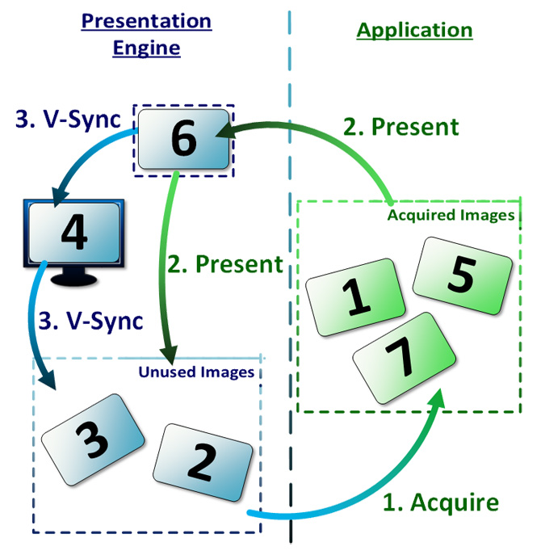

# 목차
#### OpenGL & Vulkan
#### 벌칸 시작하기 (인스턴스, 디바이스)
#### 벌칸과 윈도우 시스템 (익스텐션, 서피스, 스왑체인)

---

# OpenGL & Vulkan

### OpenGL 의 한계 (CPU 측면)
- State machine 의 사용으로 멀티 코어 환경에서 사용이 부적합
- CPU 가 멀티 코어로 바뀌는 환경에서 부적합

```c++
// 스테이트 머신의 클리어 색상값 상태를 변경합니다.
glClearColor(1.0f, 1.0f, 1.0f, 1.0f);
// 스테이트 머신의 프레임버퍼를 framebuffer0으로 변경합니다.
glBindFramebuffer(GL_FRAMEBUFFER, framebuffer0);
// 스테이트 머신의 클리어 색상값과 프레임버퍼를 초기화 합니다.
glClear(GL_COLOR_BUFFER_BIT);
// 스테이트 머신의 프레임버퍼를 framebuffer1으로 변경합니다.
glBindFramebuffer(GL_FRAMEBUFFER, framebuffer1);
// 스테이트 머신의 클리어 색상값과 프레임버퍼를 초기화 합니다.
glClear(GL_COLOR_BUFFER_BIT);
glBindFrameBuffer(GL_FRAMEBUFFER, 0);
```

위 코드를 보면 state machine 에 대해 잘 이해할 수 있다. 한 프레임 버퍼를 특정 색상으로 초기화 하려면 다음의 과정을 거친다.
1. 초기화 색상 변경
2. 특정 프레임 버퍼 바인딩
3. 바인딩한 프레임 버퍼를 특정 색상으로 초기화

단일 스레드에서는 문제 없지만 멀티 스레드 환경에서는 data race 문제가 발생할 수 있다.
 - 만약 멀티 스레드 환경에서 각 스레드가 ```framebuffer0``` 과 ```framebuffer1``` 을 동시에 바인딩 한다면?
 - 설령 thread safe 하게 만든다고 하더라도? 어디서 부터 어디까지 thread safe 하게 해야 하는지?

[](https://youtu.be/rvCD9FaTKCA?t=38) 

### OpenGL 의 한계 (GPU 측면)
 - 그래픽 카드 보다 GPU 사용량이 많아짐
 - Fixed pipeline 인 그래픽카드
   - 그래픽 카드는 렌더링 용도로만 사용하기 때문에 고정 파이프라인 사용
 - Unified pipeline 인 GPU (programmable pipeline 과 비슷한 개념)
   - GPU 의 유연한 사용을 위해 unicied pipeline 사용
   - 대용량 연산을 위해 CPU 보다 GPU 사용
   - Unified pipeline 은 사용자에게 더 많은 제어를 제공, state machine 방식과는 부적합
   - CUDA, OpenCL 같은 컴퓨팅 API
 - OpenGL 은 너무 추상화 되어 있어 벤더별로 동작이 다름
   - AMD 에서 최적화를 한다고 해서 NVIDIA 에서도 빠르진 않음
   - 모바일 환경에서는 또 다를수도 있다.


### OpenGL 과 Vulkan 차이
#### High level API vs Low level API
 - OpenGL 은 API 호출시 바로 명령을 수행하지 않음, 매개변수 전달 확인 후 명령 수행
 - Vulkan 은 체크 없이 바로 처리, 커널 패닉 발생가능 (사용자의 방어코드 필요)
 - Vulkan 은 OpenGL 과 다르게 사용자 자유도 상승
 - 드라이버가 책임지던 부분들을 사용자가 책임지게 됨
 - 사용자들은 더 엄격하게 API 사용 규칙을 준수

```c++
GLuint buffer;
glGenBuffers(1, &buffer);
glBindBuffer(GL_ARRAY_BUFFER, buffer);
glBufferData(GL_ARRAY_BUFFER, sizeof(vertices), vertices, GL_STATIC_DRAW);
```

OpenGL은 추상적인 드라이버다. 위 코드에서는 하나의 버퍼를 생성하고 메모리 전달을 하지만, 버퍼를 생성할 수도 아닐 수도 있다.

버퍼가 사용하기 전까지 버퍼에 필요한 정보만 유지하다 사용할 때 생성할 수도 있는것이다. 이는 벤더마다 다르다.

하지만 Vulkan 은 보다 명시적이다. 
```c++
VkBufferCreateInfo create_info;

create_info.sType = VK_STRUCTURE_TYPE_BUFFER_CREATE_INFO;
create_info.size = sizeof(vertices);
// 추가적인 버퍼 설정들...

vkCreateBuffer(device, &create_info, nullptr, &buffer);
```

버퍼 생성 명령이 있다면 바로 버퍼를 생성하고 생명주기에 일절 영향을 미치지 않는다.
때문에 벤더가 다르더라도 같은 동작을 기대할 수 있다.

#### None state machine
 - Vulkan 은 OpenGL 과 다르게 state machine 이 아니기 때문에 멀티 코어 환경에서 사용 가능
 - 사용자가 유연하게 멀티코어에서 여러 커맨드를 동시에 사용 가능
 - 그러나 모든 리소스가 멀티 코어 환경에서 사용가능한건 아니기에 사용에 조심해야 함
 - ex) 커맨드 버퍼의 경우 data race 가 발생할 수 있음

[](https://youtu.be/P_I8an8jXuM?t=0)

---
# Vulkan 시작하기

### Vulkan 로더, 레이어

#### Vulkan loader?

 - App 은 로더와 통신하며, 로더의 반대편에는 vulkan 하드웨어를 제어하는 ICD 를 지원
 - 로더는 여러 레이어와 작동하고, 여러 GPU 와 그 드라이버를 지원
 - 시스템에서 하나 이상의 Vulkan 호환 ICD 를 지원
 - 사용자가 원하는 레이어를 지원, 활성화

### Vulkan layer?

 - Vulkan 시스템을 보강하는 선택적 요소
 - API 가 하드웨어로 내려가는 도중 해당 API 를 가로채고, 평가하고, 수정
 - 주로 API 유효성 검사, API 추적 및 디버깅등에 사용
 - 개발자가 직접 필요한 레이어를 만들 수 있다.

#### Debugging layer
 - 잘못된 매개변수 혹은 메모리 leak 등을 찾아내기 위한 용도
 - 혹은 API 호출을 검증하는 용도
 - App 에서 발생하는 문제를 빠르게 찾기 위한 용도
 - 주로 디버깅 용도로 사용하고 release 시에는 제외하는 레이어

```c++
// PostCallAllocateMemory는 ICD의 vkAllocateMemory가 호출되기 전에 실행됩니다.
VkResult MemDemo::PostCallAllocateMemory(VkDevice device, const VkMemoryAllocateInfo *pAllocateInfo, const VkAllocationCallbacks *pAllocator, VkDeviceMemory *pMemory) {
    // 메모리 오브젝트의 수를 증가시킵니다. 
    number_mem_objects_++;
    // 할당된 메모리의 크기를 최종 메모리 크기에 더합니다. 
    total_memory_ += pAllocateInfo->allocationSize;
    return VK_SUCCESS;
}
// PreCallFreeMemory는 ICD의 vkFreeMemory가 호출된 후에 실행됩니다.
void MemDemo::PreCallFreeMemory(VkDevice device, VkDeviceMemory memory, const VkAllocationCallbacks *pAllocator) {
    if(memory != VK_NULL_HANDLE) {
    // 메모리 오브젝트의 수를 감소시킵니다. 
    number_mem_objects_--;
    // 해제된 메모리의 크기를 최종 메모리 크기에서 뺍니다.
        total_memory_ -= this_alloc;
    }
}
```
메모리 leak 을 체크하는 간단한 커스텀 레이어

### Instance vs Device
Vulkan 에는 주로 사용되는 두 개의 다른 개념이 있다. 그것이 Instance-related object 와 Device-related object 다

#### Instance-related objects
 - Vulkan 시스템 수준의 정보, 기능을 제공하기 위해 사용되는 고수준의 객체
 - VkInstance, VkPhysicalDevice 
 - 관련 함수? vkEnumerateInstanceExtensionProperties, vkCreateInstance
#### Device-related objects
 - 특정 물리 디바이스와 함수를 연결하기 위한 논리적 식별자
 - VkDevice, VkQueue, VkCommandBuffer


### Vulkan instance
 - OpenGL 의 컨텍스트와 비슷한 역할
 - 이를 이용해 레이어 체인을 구성하거나 사용 익스텐션 정의


#### Vulkan layer

 - 인스턴스 생성 전에는 어떤 레이어를 사용할 지 결정
 - 시스템마다 사용 가능 레이어가 다르기 때문에 레이어를 지원하는지 확인 필요
 - 지원하지 않는 레이어를 사용하려 하면 비정상적으로 종료
 - 특별히 ```VK_LAYER_KHRONOS_validation``` 레이어는 벌칸 개발에 꼭 필요 (디버깅 용도)


```c++
VkResult vkEnumerateInstanceLayerProperties(
    uint32_t* pPropertyCount, 
    VkLayerProperties* pProperties);

// 사용가능한 레이어의 수를 얻기 위한 변수를 선언합니다. 
uint32_t count {0};
// 사용가능한 레이어의 수를 얻어옵니다. 
vkEnumerateInstanceLayerProperties(&count, nullptr);
// 사용가능한 레이어들의 정보를 얻기 위한 변수를 선언합니다.
vector<VkLayerProperties> properties;
// 사용가능한 레이어들의 정보를 얻기 위한 메모리를 할당합니다.
properties.resize(count);
// 사용가능한 레이어들의 정보를 얻어옵니다.
vkEnumerateInstanceLayerProperties(&count, &properties[0]);

typedef struct VkLayerProperties {
    char        layerName[VK_MAX_EXTENSION_NAME_SIZE];
    uint32_t    specVersion;                                // 레이어가 사용 가능한 벌칸 버전 (최소 버전)
    uint32_t    implementationVersion;                      // 레이어의 버전
    char        description[VK_MAX_DESCRIPTION_SIZE];
} VkLayerProperties;
```
 

실제 실행 화면 캡처

#### Vulkan instance

```c++
typedef struct VkInstanceCreateInfo {
    VkStructureType             sType;                      // 구조체 타입 정의
    const void*                 pNext;                      // NULL 이거나 익스텐션 구조체의 포인터
    VkInstanceCreateFlags       flags;
    const VkApplicationInfo*    pApplicationInfo;           // App 정보 정의
    uint32_t                    enabledLayerCount;          // 사용하려는 레이어 개수
    const char* const*          ppEnabledLayerNames;        // 사용하려는 레이어 이름 배열 포인터
    uint32_t                    enabledExtensionCount;      // 사용하려는 익스텐션 개수
    const char* const*          ppEnabledExtensionNames;    // 사용하려는 익스텐션 이름 배열 포인터
} VkInstanceCreateInfo;

// 벌칸 프로그램을 작성하는데 있어서 반드시 필요한 레이어입니다.
// 하지만 CPU를 굉장히 많이 사용하기 때문에 개발중에만 사용해야 합니다.
constexpr auto layer_name {"VK_LAYER_KHRONOS_validation"};

// 생성하려는 인스턴스를 정의합니다. 
VkInstanceCreateInfo create_info {};

create_info.sType = VK_STRUCTURE_TYPE_INSTANCE_CREATE_INFO;
create_info.enabledLayerCount = 1;
create_info.ppEnabledLayerNames = &layer_name;

VkResult vkCreateInstance(
    const VkInstanceCreateInfo*     pCreateInfo,
    const VkAllocationCallbacks*    pAllocator,             // 커스텀 메모리 할당자 포인터 사용 안하면 nullptr 전달
    VkInstance*                     pInstance);

// 인스턴스를 생성합니다.
result = vkCreateInstance(&create_info, nullptr, &instance_);
assert(result == VK_SUCCESS);

void vkDestroyInstance(
    VkInstance                      instance,
    const VkAllocationCallbacks*    pAllocator);

vkDestroyInstance(instance_, nullptr);
```

### Vulkan physical device
 - Vulkan 의 물리 디바이스는 GPU
 - 사용자는 어떤 GPU 를 사용해서 vulkan 을 실행시킬지 선택
 - OpenGL 의 경우 OS 나 드라이버가 GPU 자동 선택
 - 사용 목적에 따라 사용자가 GPU 를 유연하게 선택

```c++
VkResult vkEnumeratePhysicalDevices(
    VkInstance                                  instance,
    uint32_t*                                   pPhysicalDeviceCount,
    VkPhysicalDevice*                           pPhysicalDevices);

// 사용가능한 물리 디바이스의 수를 얻기 위한 변수 선언
uint32_t count {0};

// 사용 가능한 물리 디바이스 수를 얻어온다
vkEnumeratePhysicalDevices(instance_, &count, nullptr);

// 사용 가능한 물리 디바이스들의 정보를 얻기 위한 변수 선언,  개수 만큼 메모리 할당
vector<VkPhysicalDevice> physical_devices {count};

// 사용 가능한 물리 디바이스들의 핸들을 얻어온다
vkEnumeratePhysicalDevices(instance_, &count, &physical_devices[0]);

void vkGetPhysicalDeviceProperties(
    VkPhysicalDevice                            physicalDevice,     // 물리 디바이스
    VkPhysicalDeviceProperties*                 pProperties);       // 물리 디바이스의 속성 변수 포인터

typedef struct VkPhysicalDeviceProperties {
    uint32_t                            apiVersion;                 // 디바이스가 지원하는 벌칸 버전
    uint32_t                            driverVersion;              // 벤더가 정의한 드라이버 버전
    uint32_t                            vendorID;
    uint32_t                            deviceID;
    VkPhysicalDeviceType                deviceType;
    char                                deviceName[VK_MAX_PHYSICAL_DEVICE_NAME_SIZE];
    uint8_t                             pipelineCacheUUID[VK_UUID_SIZE];
    VkPhysicalDeviceLimits              limits;
    VkPhysicalDeviceSparseProperties    sparseProperties;
} VkPhysicalDeviceProperties;
```
### Vulkan device
 - Physical device 는 말 그대로 GPU 를 나타낼 뿐 어떤 처리도 할 수 없다.
 - Vulkan device 는 physical device 와 연결된 기능을 사용하기 위함
 - VkDevice, VkQueue, VkCommandBuffer 및 하위 객체들로 구성


VkDevice 를 생성하기 위해서 두 가지를 정해야 한다.
1. 어떤 물리 디바이스를 사용할지
2. 어떤 종류의 큐들을 사용할지
    - OpenGL 의 경우 대개 명령어는 바로 실행
    - Vulkan 의 경우 cmd buffer 를 queue 에 제출하여 device 에 명령을 전달
    - Queue 의 경우 사용 목적에 따라 다른 종류의 queue 가 이용
    - 필요에 따라 사용 목적에 맞는 큐들을 사용하도록 device 에 등록


 - ACE 는 GPGPU 연산 명령을 담당
 - HWS 는 다양한 async 작업들을 관리하고 스케쥴링
 - DMA 는 CPU 가 관여하지 않고 메모리를 복사하거나 디바이스간 데이터 전송흘 수행하는데 사용
 - ACE 의 경우 독립적인 commad stream 이 있어 CU 에 디스패치
 - DMA 또한 별도 큐가 존재

```c++
void vkGetPhysicalDeviceQueueFamilyProperties(
    VkPhysicalDevice                            physicalDevice,
    uint32_t*                                   pQueueFamilyPropertyCount,
    VkQueueFamilyProperties*                    pQueueFamilyProperties);

typedef struct VkQueueFamilyProperties {
    VkQueueFlags    queueFlags;                     // 큐 패밀리가 지원하는 큐의 특징
    uint32_t        queueCount;                     // 큐 패밀리에 해당하는 큐의 숫자
    uint32_t        timestampValidBits;
    VkExtent3D      minImageTransferGranularity;
} VkQueueFamilyProperties;

// flag 비트들의 조합으로 VkQueueFlag 정의
typedef enum VkQueueFlagBits {
    VK_QUEUE_GRAPHICS_BIT = 0x00000001,
    VK_QUEUE_COMPUTE_BIT = 0x00000002,
    VK_QUEUE_TRANSFER_BIT = 0x00000004,
    VK_QUEUE_SPARSE_BINDING_BIT = 0x00000008,
    VK_QUEUE_PROTECTED_BIT = 0x00000010,
    VK_QUEUE_FLAG_BITS_MAX_ENUM = 0x7FFFFFFF
} VkQueueFlagBits;


// 사용가능한 큐 패밀리의 수를 얻기 위한 변수를 선언합니다. 
uint32_t count {0};

// 사용가능한 큐 패밀리의 수를 얻어옵니다. 
vkGetPhysicalDeviceQueueFamilyProperties(physical_device_, &count, 0);

// 사용가능한 큐 패밀리의 정보를 얻기 위한 변수를 선언합니다. 
vector<VkQueueFamilyProperties> properties;

// 사용가능한 큐 패밀리의 정보를 얻기 위한 메모리를 할당합니다. 
properties.resize(count);

// 사용가능한 큐 패밀리의 정보를 얻어옵니다. 
vkGetPhysicalDeviceQueueFamilyProperties(physical_device_, &count, &properties[0]);

for (auto i = 0; i != properties.size(); ++i) {
    // 큐 패밀리에서 사용가능한 큐가 있는지 확인
    if (properties[i].queueCount < 1)
        continue;

    // 큐 패밀리가 그래픽스 기능을 제공하는지 확인
    if (VK_QUEUE_GRAPHICS_BIT & properties[i].queueFlags) {
        queue_family_index_ = i;
        break;
    }
}
```

 - 물리 디바이스에서 어떤 큐를 사용할 수 있는지 확인 이후 디바이스에 필요한 큐 생성 정보를 정의
 - 큐는 별도로 생성하는 API 가 없고 디바이스가 생성될 때 같이 생성됨
 - 디바이스 생성 이후 해당 디바이스에서 큐를 얻어온 이후 커멘드 제출 가능

```c++
typedef struct VkDeviceQueueCreateInfo {
    VkStructureType             sType;
    const void*                 pNext;
    VkDeviceQueueCreateFlags    flags;
    uint32_t                    queueFamilyIndex;           // 사용하려는 큐 패밀리의 인덱스 정의 vkGetPhsycalDeviceQueueFamilyProperties 로 얻어온 배열 인덱스
    uint32_t                    queueCount;                 // 생성하려는 큐의 개수 정의
    const float*                pQueuePriorities;           // 생성하려는 큐의 우선순위
} VkDeviceQueueCreateInfo;

typedef struct VkDeviceCreateInfo {
    VkStructureType                     sType;
    const void*                         pNext;
    VkDeviceCreateFlags                 flags;
    uint32_t                            queueCreateInfoCount;           // 생성하려는 큐를 정의한 VkDeviceQueueCreateInfo 개수
    const VkDeviceQueueCreateInfo*      pQueueCreateInfos;              // 생성하려는 큐를 정의한 배열 포인터
    uint32_t                            enabledLayerCount;
    const char* const*                  ppEnabledLayerNames;
    uint32_t                            enabledExtensionCount;
    const char* const*                  ppEnabledExtensionNames;
    const VkPhysicalDeviceFeatures*     pEnabledFeatures;
} VkDeviceCreateInfo;

VkResult vkCreateDevice(
    VkPhysicalDevice                physicalDevice,
    const VkDeviceCreateInfo*       pCreateInfo,
    const VkAllocationCallbacks*    pAllocator,
    VkDevice*                       pDevice);

// 큐의 우선순위를 지정합니다.
// 여러개의 큐를 사용할 경우 다르게 우선순위를 지정할 수 있습니다. 
constexpr auto priority = 1.0f;
// 생성하려는 큐를 정의합니다. 
VkDeviceQueueCreateInfo queue_create_info {};

queue_create_info.sType = VK_STRUCTURE_TYPE_DEVICE_QUEUE_CREATE_INFO;
queue_create_info.queueFamilyIndex = queue_family_index_;
queue_create_info.queueCount = 1;
queue_create_info.pQueuePriorities = &priority;

VkDeviceCreateInfo create_info {};

create_info.sType = VK_STRUCTURE_TYPE_DEVICE_CREATE_INFO;
create_info.queueCreateInfoCount = 1;
create_info.pQueueCreateInfos = &queue_create_info;

result = vkCreateDevice(physical_device_, &create_info, nullptr, &device_);
assert(result == VK_SUCCESS);

void vkGetDeviceQueue(
    VkDevice device,
    uint32_t queueFamilyIndex,      // 큐가 속해있는 큐 패밀리 인덱스
    uint32_t queueIndex,            // 큐 패밀리에서 생성된 큐 인덱스
    VkQueue* pQueue);               // 생성된 큐를 얻어오기 위한 포인터

vkGetDeviceQueue(device_, queue_family_index_, 0, &queue_);

void vkDestroyDevice(
    VkDevice                                    device,
    const VkAllocationCallbacks*                pAllocator);

vkDestroyDevice(device_, nullptr);
```

# 벌칸과 윈도우 시스템
 - OpenGL 에서 화면 출력은 자연스러운 일
 - 그러나 Vulkan 은 화면 출력 기능을 자동으로 제공하지 않는다.
   - GPGPU 용도로 사용할 수도 있고, 서버에서 렌더링 한 이후 전달 할 목적도 있기 때문
 - 사용하기 위해선 익스텐션 사용필요

### Extension
 - 레이어, 로더 혹은 ICD 가 제공하는 선택적 기능
 - 두 가지 유형의 extension 존재
1. Instance extension
   - Instance object 에서 기존 동작을 수정하거나 새로운 동작을 구현
2. Device extension
   - Device object 에서 기존 동작을 수정하거나 새로운 동작 구현
   - VkDevice 객체 혹은 VkQueue 및 VkCommandBuffer 같은 하위 객체가 해당
 - extension 들은 vkCreateInstance, vkCreateDevice 에서 활성화

```c++
VkResult vkEnumerateInstanceExtensionProperties(
    const char*                                 pLayerName,
    uint32_t*                                   pPropertyCount,
    VkExtensionProperties*                      pProperties);

typedef struct VkExtensionProperties {
    char        extensionName[VK_MAX_EXTENSION_NAME_SIZE];
    uint32_t    specVersion;            // 익스텐션 스펙 버전
} VkExtensionProperties;

uint32_t count {0};
vkEnumerateInstanceExtensionProperties("VK_LAYER_KHRONOS_validation", &count, nullptr);

vector<VkExtensionProperties> properties {count};
vkEnumerateInstanceExtensionProperties("VK_LAYER_KHRONOS_validation", &count, &properties[0]);

vector<const char*> extension_names {
    "VK_KHR_surface",
    "VK_MVK_macos_surface"
};

VkInstanceCreateInfo create_info {};

// ...
create_info.enabledExtensionCount = extension_names.size();
create_info.ppEnabledExtensionNames = &extension_names[0];

auto result = vkCreateInstance(&create_info, nullptr, &instance_);
```

시스템에서 사용 불가능한 익스텐션과 함께 인스턴스를 생성할 경우 ```VK_ERROR_EXTENSION_NOT_PRESENT``` 반환

```c++
VkResult vkEnumerateDeviceExtensionProperties(
    VkPhysicalDevice                            physicalDevice,
    const char*                                 pLayerName,
    uint32_t*                                   pPropertyCount,
    VkExtensionProperties*                      pProperties);

uint32_t count {0};
vkEnumerateDeviceExtensionProperties(physical_device_, nullptr, &count, nullptr);

vector<VkExtensionProperties> properties {count};
vkEnumerateDeviceExtensionProperties(physical_device_, nullptr, &count, &properties[0])

vector<const char*> extension_names {
    "VK_KHR_swapchain",
};

VkDeviceCreateInfo create_info {};

// ...
create_info.enabledExtensionCount = extension_names.size();
create_info.ppEnabledExtensionNames = &extension_names[0];

auto result = vkCreateDevice(physical_device_, &create_info, nullptr, &device_);
```

마찬가지로 사용 불가능한 익스텐션과 함께 디바이스 생성시 ```VK_ERROR_EXTENSION_NOT_PRESENT``` 반환

### Vulkan surface
 - Vulkan 그래픽 API 를 이용해 플랫폼 윈도우에 렌더링 하기 위한 플랫폼 특정 객체
 - Surface를 통해서 윈도우와 연결된 디스플레이와 윈도우에 대한 정보 확인
 - 윈도우 시스템마다 surface 생성하는 API 가 다름

In OSX system
```c++
// 맥os 에서는 해당 디파인 선언 필요
#define VK_USE_PLATFORM_MACOS_MVK 1

typedef struct VkMacOSSurfaceCreateInfoMVK {
    VkStructureType                 sType;
    const void*                     pNext;
    VkMacOSSurfaceCreateFlagsMVK    flags;
    const void*                     pView;
} VkMacOSSurfaceCreateInfoMVK;

VkResult vkCreateMacOSSurfaceMVK(
    VkInstance                                  instance,
    const VkMacOSSurfaceCreateInfoMVK*          pCreateInfo,
    const VkAllocationCallbacks*                pAllocator,
    VkSurfaceKHR*                               pSurface);

VkMacOSSurfaceCreateInfoMVK create_info {};

create_info.sType = VK_STRUCTURE_TYPE_MACOS_SURFACE_CREATE_INFO_MVK;
create_info.pView = (__bridge void*)content_view;               // macOS 윈도우 view 포인터

auto result = vkCreateMacOSSurfaceMVK(instance_, &create_info, nullptr, &surface_);
```

서피스 생성 이후 물리 디바이스의 큐 패밀리가 surface 지원 가능한지 확인해야 한다.


Tesla 의 경우 서버용 GPU 이기 때문에 디스플레이 포트가 없다. 이런 경우 렌더링 했을지라도 화면에 출력이 불가능 하다.


```c++
VkResult vkGetPhysicalDeviceSurfaceSupportKHR(
    VkPhysicalDevice                            physicalDevice,
    uint32_t                                    queueFamilyIndex,
    VkSurfaceKHR                                surface,
    VkBool32*                                   pSupported);
    
VkBool32 supported;
vkGetPhysicalDeviceSurfaceSupportKHR(physical_device_, queue_family_index_, surface_, &supported);
assert(supported == VK_TRUE);

void vkDestroySurfaceKHR(
    VkInstance                      instance,
    VkSurfaceKHR                    surface,
    const VkAllocationCallbacks*    pAllocator);

vkDestroySurfaceKHR(instance_, surface_, nullptr);
```

### Vulkan swapchain
 - surface 를 통해 화면에 출력하기 위한 리소스
 - 스왑체인 생성시 멀티 버퍼링 설정
 - 어떤 방식으로 화면에 출력할지 설정
   - 수직 동기화? immediate mode?

```c++
typedef struct VkSwapchainCreateInfoKHR {
    VkStructureType                  sType;
    const void*                      pNext;
    VkSwapchainCreateFlagsKHR        flags;
    VkSurfaceKHR                     surface;                   // 스왑체인과 연결할 surface
    uint32_t                         minImageCount;             // app 에서 필요한 최소 이미지 개수
    VkFormat                         imageFormat;               // 스왑체인의 이미지 포맷
    VkColorSpaceKHR                  imageColorSpace;           // 컬러스페이스
    VkExtent2D                       imageExtent;               // 이미지 크기
    uint32_t                         imageArrayLayers;
    VkImageUsageFlags                imageUsage;
    VkSharingMode                    imageSharingMode;
    uint32_t                         queueFamilyIndexCount;     // 스왑체인에 접근할 큐 패밀리 인덱스 배열 포인터
    const uint32_t*                  pQueueFamilyIndices;
    VkSurfaceTransformFlagBitsKHR    preTransform;
    VkCompositeAlphaFlagBitsKHR      compositeAlpha;
    VkPresentModeKHR                 presentMode;               // 스왑체인이 사용할 출력 모드
    VkBool32                         clipped;                   // clip 기능 사용할지 말지
    VkSwapchainKHR                   oldSwapchain;              // VK_NULL_HANDLE 이거나 이전에 생성된 스왑체인 중 파괴하려는 스왑체인 정의
} VkSwapchainCreateInfoKHR;

typedef enum VkPresentModeKHR {
    VK_PRESENT_MODE_IMMEDIATE_KHR = 0,
    VK_PRESENT_MODE_MAILBOX_KHR = 1,
    VK_PRESENT_MODE_FIFO_KHR = 2,
    VK_PRESENT_MODE_FIFO_RELAXED_KHR = 3,
    VK_PRESENT_MODE_SHARED_DEMAND_REFRESH_KHR = 1000111000,
    VK_PRESENT_MODE_SHARED_CONTINUOUS_REFRESH_KHR = 1000111001,
} VkPresentModeKHR;
```

#### immediate mode

 
 - 1, 5, 7번 이미지들은 렌더링하기 위해 사용
 - 2, 3, 6번 이미지들은 스왑체인 안에서 대기중
 - 앱이 렌더링을 위해 이미지를 요청할 경우 스오바체인은 2, 3, 6번 중에 하나를 전달
 - 없다면 획득 실패, 자원이 준비될 때까지 기다림
 - 렌더링 완료 이후 스왑체인에 출력 요청.
 - immediate mode 에서는 출력 요청시 바로 디스플레이에 메모리 복사
 - 때문에 tearing 발생 가능

#### fifo mode


 - fifo mode 에서는 렌더링 이후 이미지는 큐에서 대기
 - 수직동기화가 끝나면 큐에서 대기중인 이미지를 화면에 출력

#### mailbox mode


 - element 가 1개인 큐만 이용하는 경우
 - 앱이 렌더링을 끝낸 경우 큐 끝에 추가되는것이 아니라 대기하고 있는 이미지를 대체
 - 이미지가 두 개 이상인 경우에 사용 가능

 어떤 출력 모드를 사용할 지 결정 했다면 스퇍체인을 생성하기 전에 해당 모드를 물리 디바이스가 지원하는지 확인해야한다.

```c++
VkResult vkGetPhysicalDeviceSurfacePresentModesKHR(
   VkPhysicalDevice                            physicalDevice,
   VkSurfaceKHR                                surface,
   uint32_t*                                   pPresentModeCount,
   VkPresentModeKHR*                           pPresentModes);

uint32_t count;
vkGetPhysicalDeviceSurfacePresentModesKHR(physical_device_, surface_, &count, nullptr);

vector<VkPresentModeKHR> modes {count};
vkGetPhysicalDeviceSurfacePresentModesKHR(physical_device_, surface_, &count, &modes[0]);

```
해당 출력 모드 지원을 확인했다면 원하는 스왑체인을 만들 수 있다. 생성시에는 연결하려는 윈도우에 대한 정보도 알아햐 한다.

```c++
VkResult vkGetPhysicalDeviceSurfaceCapabilitiesKHR(
    VkPhysicalDevice                            physicalDevice,
    VkSurfaceKHR                                surface,
    VkSurfaceCapabilitiesKHR*                   pSurfaceCapabilities);

typedef struct VkSurfaceCapabilitiesKHR {
    uint32_t                         minImageCount;
    uint32_t                         maxImageCount;
    VkExtent2D                       currentExtent;
    VkExtent2D                       minImageExtent;
    VkExtent2D                       maxImageExtent;
    uint32_t                         maxImageArrayLayers;
    VkSurfaceTransformFlagsKHR       supportedTransforms;
    VkSurfaceTransformFlagBitsKHR    currentTransform;
    VkCompositeAlphaFlagsKHR         supportedCompositeAlpha;
    VkImageUsageFlags                supportedUsageFlags;
} VkSurfaceCapabilitiesKHR;

VkSurfaceCapabilitiesKHR surface_capabilities;
vkGetPhysicalDeviceSurfaceCapabilitiesKHR(physical_device_, surface_, &surface_capabilities);

// surface capabilities 를 얻었다면 예시로 사용 가능한 composite alpha를 선택할수있다.
VkCompositeAlphaFlagBitsKHR composite_alpha;
for (auto i = 1; i != 32; ++i) {
    VkCompositeAlphaFlagBitsKHR flag = static_cast<VkCompositeAlphaFlagBitsKHR>(0x1 << i);
    if (surface_capabilities.supportedUsageFlags & flag) {
        // os 에서 사용 가능한 첫 번째 composite alpha 모드 선택
        composite_alpha = flag;
        break;
    }
}

VkSwapchainCreateInfoKHR create_info {};

create_info.sType = VK_STRUCTURE_TYPE_SWAPCHAIN_CREATE_INFO_KHR;
create_info.surface = surface_;
create_info.minImageCount = 2;
create_info.imageFormat = surface_format.format;
create_info.imageColorSpace = surface_format.colorSpace;
create_info.imageExtent = surface_capabilities.currentExtent;
create_info.imageArrayLayers = 1;
create_info.imageUsage = VK_IMAGE_USAGE_COLOR_ATTACHMENT_BIT;
create_info.imageSharingMode = VK_SHARING_MODE_EXCLUSIVE;
create_info.preTransform = surface_capabilities.currentTransform;
create_info.compositeAlpha = composite_alpha;
create_info.presentMode = present_mode;

auto result = vkCreateSwapchainKHR(device_, &create_info, nullptr, &swapchain_);
```

스왑체인을 생성했다면 렌더링을 할 수 있는 이미지를 얻어와야 한다. 생성시 최소 이미지만 정의 했기에 더 많은 이미지가 생성됏을 수 있다.

```c++
VkResult vkGetSwapchainImagesKHR(
    VkDevice                                    device,
    VkSwapchainKHR                              swapchain,
    uint32_t*                                   pSwapchainImageCount,
    VkImage*                                    pSwapchainImages);
uint32_t count;
vkGetSwapchainImagesKHR(device_, swapchain_, &count, nullptr);

swapchain_images_.resize(count);
vkGetSwapchainImagesKHR(device_, swapchain_, &count, &swapchain_images_[0]);
```