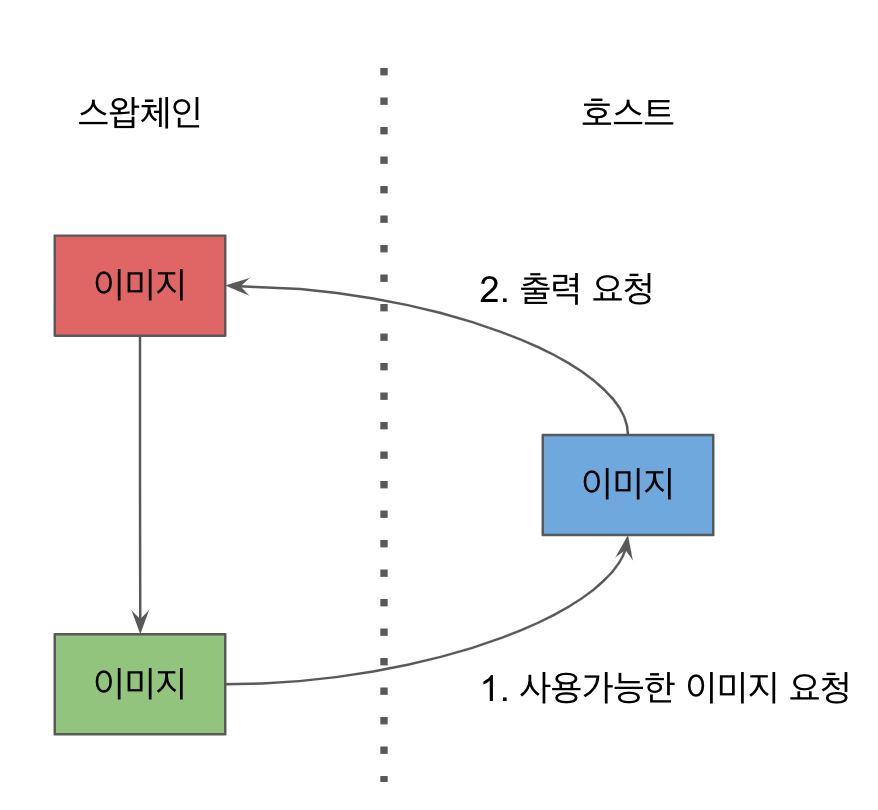

# 목차
* 벌칸을 이용한 첫 화면 출력
  * 커맨드/커맨드버퍼/커맨드풀에 관해
* 벌칸 동기화
  * 벌칸 펜스/ 벌칸 세마포어
* 벌칸 이미지 렌더링
  * 이미지 뷰/프레임버퍼/렌더패스

# 벌칸을 이용한 첫 화면 출력
## 벌칸의 커맨드?
GL에서 커맨드라는 것을 본 적은 없지만 우린 실제로 쓰고있다.
아래의 GL 예시를 들면, 버텍스 어레이를 바인딩하고 드로우하는 행동 각각이 모두 커맨드이다.
```c
glUseProgram(program);
glBindVertexArray(vertex_array);
glDrawElements(GL_TRIANGLES, 6, GL_UNSIGNED_INT, 0);
glBindVertexArray(0);
glUseProgram(0);
```


위 그림은 벌칸에서의 커맨드 처리 과정이다.
1. 커맨드를 커맨드 버퍼에 기록
2. 커맨드 버퍼를 큐에 제출
3. 디바이스에서 큐의 커맨드를 처리.

GL과의 차이점이라고 하면, GL에서는 어플리케이션이 어느 커맨드에 기록할 지를 정할 수가 없다.
하지만 벌칸은 어느 커맨드 버퍼에 커맨드를 작성할 지를 정할 수 있어서 GL과 달리 CPU상에서의 멀티스레딩이 가능하다.

## 벌칸의 커맨드 풀?
커맨드를 기록하기위해선 위 그림처럼 커맨드 버퍼가 필요하다.
커맨드 버퍼는 앞서 나온 자원들과 달리 우리가 생성하는게 아니고, 커맨드 풀에서 꺼내오는 형태이다.
따라서 우리는 커맨드 풀을 먼저 만들어야 한다.

마찬가지로 선 Info, 후 Create이다.
```c
typedef struct VkCommandPoolCreateInfo {
  VkStructureType sType; // 구조체 타입.
  const void* pNext; // 익스텐션 용인듯. NULL처리하면 된다.
  VkCommandPoolCreateFlags flags; // 동작을 정의하는 플래그
  uint32_t queueFamilyIndex; // 큐 페밀리 인덱스.
}  VkCommandPoolCreateInfo;

typedef enum VkCommandPoolCreateFlagBits {
  VK_COMMAND_POOL_CREATE_TRANSIENT_BIT = 0x00000001, // TRANSIENT = 일시적인.
  VK_COMMAND_POOL_CREATE_RESET_COMMAND_BUFFER_BIT = 0x00000002, // 커맨드 버퍼 사용 후 리셋
  VK_COMMAND_POOL_CREATE_PROTECTED_BIT = 0x00000004,
} VkCommandPoolCreateFlagBits;
```
벌칸의 커맨드 버퍼는 기본적으로 여러번 재사용 하도록 설계되었다.
그려야 하는 장면이 변하지 않으면 (동작이 똑같다면) 커맨드 버퍼를 계속 재활용 하면 되기 때문이다.

하지만 매번 장면이나 동작이 변하는 경우에 커맨드 버퍼를 다시 기록해주어야 하는데, 이를 위해선 반드시 ```리셋```이 필요하다.

```VK_COMMAND_POOL_CREATE_TRANSIENT_BIT``` 이 플래그는 1회용 플래그이다. 커맨드버퍼를 한번 쓰면 재사용하지않는다.
```VK_COMMAND_POOL_CREATE_RESET_COMMAND_BUFFER_BIT``` 기본적으론 리셋하지 않도록 되어있는데, 이를 설정하면 커맨드버퍼를 리셋한다.
```VK_COMMAND_POOL_CREATE_PROTECTED_BIT``` 이거에 대해선 자료가 별로 없다. [Protected Memory](https://github.com/KhronosGroup/Vulkan-Guide/blob/main/chapters/protected.adoc) 라는 개념이 있는 것 같은데, 제대로 조사는 못했다..

```c
VkResult vkCreateCommandPool(
  VkDevice device,
   const VkCommandPoolCreateInfo* pCreateInfo,
   const VkAllocationCallbacks* pAllocator,
   VkCommandPool* pCommandPool);
```
위 함수를 사용해 만들면 된다.

```c
// Demo코드 실사용 예
const VkCommandPoolCreateInfo cmd_pool_info = {
   .sType = VK_STRUCTURE_TYPE_COMMAND_POOL_CREATE_INFO,
   .pNext = NULL,
   .queueFamilyIndex = demo->graphics_queue_family_index,
   .flags = 0, // 커맨드버퍼 리셋도 안하고 재사용 한다는 의미.
};
err = vkCreateCommandPool(demo->device, &cmd_pool_info, NULL, &demo->cmd_pool);
assert(!err);
```

커맨드 풀은 Thread Safe하지 않기 때문에 무ㅠ텍스를 통해 동기화를 보장하거나 쓰레드마다 커맨드 풀을 만들어야 한다.
> 풀 자체가 Thread Safe하지 않은건 이상하긴 하다. 보통 백엔드 어플리케이션에서 커넥션풀이나 쓰레드풀을 많이 쓸텐데,
> 커넥션풀도 그렇고 쓰레드 풀도 그렇고, 가져오는 행위 자체는 내부에서 뮤텍스를 쓰건 락을 걸건 해서 동시성 보장을 해준다.

또한 아래 함수를 통해 제거할 수 있다.
```c
vkDestroyCommandPool(demo->device, demo->cmd_pool, NULL);
// NULL인자는 Allocator.
```
풀이 파괴되면 풀이 소유한 커맨드버퍼도 파괴된다.

## 벌칸의 커맨드 버퍼?
커맨드 버퍼는 커맨드를 기록할 수 있는 리소스.
아래와 같은 라이프사이클을 가진다.


* 커맨드 버퍼가 풀로부터 ```Allocate``` 되면 초기 상태인 ```Initial``` 상태를 가지고 있다.
* 버퍼에 커맨드를 기록하기 위해선 ```Recoding``` 으로 변환을 해주어야 한다.
* ```Recoding``` 상태에서 데이터를 기록했다면 큐에 넣어줄 수 있도록 ```Executable``` 로 변환해주어야 한다.
* 큐에 제출된 이후엔 디바이스에 의해 실행되기 전까진 ```Pending``` 상태가 된다
* 큐에서 디바이스로 보내 커맨드 버퍼가 처리되고 나면
  1. ```Executable``` 로 돌아가거나
  2. 버퍼 특징에 따라 ```Invalid``` 상태가 된다.

커맨드 버퍼를 풀에서 가져오는 동작도 이전과 동일하게, Info를 정의하고 ~~Create~~Allocate으로 가져온다.
```c
typedef struct VkCommandBufferAllocateInfo {
  VkStructureType sType;
   const void* pNext;
   VkCommandPool commandPool;
   VkCommandBufferLevel level;
   uint32_t commandBufferCount; // 생성하려는 갯수
} VkCommandBufferAllocateInfo;

VkResult vkAllocateCommandBuffers(
  VkDevice device,
  const VkCommandBufferAllocateInfo* pAllocateInfo,
  VkCommandBuffer* pCommandBuffers // 리턴 포인터.
);

// 데모 코드 예
const VkCommandBufferAllocateInfo cmd = {
  .sType = VK_STRUCTURE_TYPE_COMMAND_BUFFER_ALLOCATE_INFO,
  .pNext = NULL,
  .commandPool = demo->cmd_pool,
  .level = VK_COMMAND_BUFFER_LEVEL_PRIMARY,
  .commandBufferCount = 1,
};
err = vkAllocateCommandBuffers(demo->device, &cmd, &demo->cmd);
assert(!err);
```

할당받아 온 데이터이기 때문에 다른 자원들과 달리 파괴가 없고 Free만 있다.

```c
vkFreeCommandBuffers(demo->device, demo->cmd_pool, 1, cmd_bufs);
```

## 클리어 색상 화면 출력
색상을 클리어하기위해서 필요한 단계는 아래와 같다.
1. 스왑체인으로부터 사용가능한 이미지 인덱스를 얻어옵니다.
2. 새로운 커맨드를 기록하기 위해 커맨드 버퍼를 리셋합니다.
3. 클리어 커맨드를 기록하기 위해 커맨드 버퍼를 기록중 상태로 전이합니다.
4. 이미지에 클리어 커맨드를 사용할 수 있도록 레이아웃을 변경합니다.
5. 이미지 인덱스에 해당하는 이미지를 특정 색상으로 클리어합니다.
6. 이미지를 출력할 수 있도록 레이아웃을 변경합니다.
7. 모든 커맨드들을 기록했으므로 커맨드 버퍼를 실행가능 상태로 전이합니다.
8. 커맨드 버퍼를 큐에 제출합니다.
9. 제출한 커맨드 버퍼가 처리되기를 기다립니다.
10. 화면에 출력합니다.

이미지 인덱스를 스왑체인으로부터 가져오는 코드는 아래의 함수이다.
```c
VkResult vkAcquireNextImageKHR(
 VkDevice device,
 VkSwapchainKHR swapchain,
 uint64_t timeout,
 VkSemaphore semaphore, // 다음장에 나옴
 VkFence fence, // 다음장에 나옴
 uint32_t* pImageIndex); // 리턴위치, 이미지 인덱스가 나온다.

 // 데모코드 사용 예, 큐브예제에선 펜스 없이 세마포어만 준다.
do {
// Get the index of the next available swapchain image:
    err =
      demo->fpAcquireNextImageKHR(demo->device, demo->swapchain, UINT64_MAX,
                    demo->image_acquired_semaphores[demo->frame_index],
                    VK_NULL_HANDLE, &demo->current_buffer);
} while (err != SUCCESS);
```

커맨드 버퍼를 리셋하려면 아래 코드를 쓰자.
```c
VkResult vkResetCommandBuffer(
  VkCommandBuffer commandBuffer,
  VkCommandBufferResetFlags flags);

vkResetCommandBuffer(command_buffer_, 0);

// 데모코드에선 커맨드버퍼를 따로 리셋하지 않는다.
```

기록 중 상태로 바꾸려면 아래 구조체를 이용해야한다.
```c
typedef struct VkCommandBufferBeginInfo {
  VkStructureType sType;
  const void* pNext;
  VkCommandBufferUsageFlags flags;
  const VkCommandBufferInheritanceInfo* pInheritanceInfo;
} VkCommandBufferBeginInfo;

typedef enum VkCommandBufferUsageFlagBits {
  // 커맨드 버퍼가 한 번만 쓰이고, 리셋이나 해제가 되는 경우.
  // 앞의 설정은 Pool에 대한 설정이었는데 여기서도 필요한가봄
  VK_COMMAND_BUFFER_USAGE_ONE_TIME_SUBMIT_BIT = 0x00000001,

  // 새컨더리 커맨드 버퍼 전체가 렌더패스에 포함된다는 의미라고 함. 아직은 중요하지않아보임
  VK_COMMAND_BUFFER_USAGE_RENDER_PASS_CONTINUE_BIT = 0x00000002,

  // 데모코드에서 이미지에 사용하는 플래그, pending상태일 때 다시 큐에 제출될 수 있음(재사용)을 의미한다.
  VK_COMMAND_BUFFER_USAGE_SIMULTANEOUS_USE_BIT = 0x00000004,
} VkCommandBufferUsageFlagBits;
```

Info정의를 했다면 함수를 호출하여 Begin을 호출하자.
```c
vkBeginCommandBuffer(command_buffer_, &begin_info);

// 데모코드에선?
VkCommandBufferBeginInfo cmd_buf_info = {
  .sType = VK_STRUCTURE_TYPE_COMMAND_BUFFER_BEGIN_INFO,
  .pNext = NULL,
  .flags = 0,
  .pInheritanceInfo = NULL,
};
err = vkBeginCommandBuffer(demo->cmd, &cmd_buf_info);
```

이제 아까 나온
```
4. 이미지에 클리어 커맨드를 사용할 수 있도록 레이아웃을 변경합니다.
5. 이미지 인덱스에 해당하는 이미지를 특정 색상으로 클리어합니다.
6. 이미지를 출력할 수 있도록 레이아웃을 변경합니다.
```
를 수행해야 한다.

이미지를 설명할 때 레이아웃에 대해 자세히 설명하겠지만,
레이아웃은 GPU에서 성능을 효율적으로 내기 위해 사용된다.

이미지 레이아웃의 변경은 아래 구조체를 사용한다.
```c
typedef struct VkImageMemoryBarrier { // 베리어
  VkStructureType sType;
  const void* pNext;
  VkAccessFlags srcAccessMask; // 현재 메모리 엑세스 유형
  VkAccessFlags dstAccessMask; // 새로운 메모리 엑세스 유형
  VkImageLayout oldLayout; // 현재 레이아웃
  VkImageLayout newLayout; // 새로운 레이아웃
  uint32_t srcQueueFamilyIndex; // 아직은 중요치 않다고 함.
  uint32_t dstQueueFamilyIndex; // 아직은 중요치 않다고 함.
  VkImage image;
  VkImageSubresourceRange subresourceRange;
} VkImageMemoryBarrier;
```

왜 메모리 베리어가 필요할까? 왜 파이프라인 베리어가 필요할까?
GPU의 구조때문에 그렇다.


위와 같은 구조에서 큐에 쌓인 커맨드 버퍼들이 각각 CU에 할당이 될텐데, Queueing되었기 때문에 순차적으로 실행은 되겠지만 순차적으로 끝난다는 보장은 존재하지 않는다. 따라서 나중에 시작한게 먼저 끝날 수가 있다. 이렇게 되면 디퍼드 렌더링 같은 경우에 연산이 끝나지도 않은 메모리영역을 참조하여 사용하려고 시도할 수 있기 때문에 이와같은 베리어가 필요하다.

메모리 엑세스 유형 및 이미지 레이아웃관련 ENUM은 너무 많다.
하나하나 살펴보면 이해가 어느정도 되게끔 써있다.

메모리 엑세스 관련해서 책의 예시론 ```VK_ACCESS_VERTEX_ATTRIBUTE_READ_BIT``` 이 있는데 이놈은
버퍼가 버텍스 버퍼로 사용되고자 할 때 버텍스 셰이더의 어트리뷰트로 전달이 될 것이기 때문에
메모리 엑세스 유형을 버텍스 어트리뷰트에서 읽을 수 있게 설정한다는 의미이다.

클리어의 경우 트랜스퍼 스테이지에서 수행되는데 클리어 값이 이미지에 쓰이기 때문에
```VK_ACCESS_MEMORY_WRITE_BIT``` 가 쓰이게 된다.

이미지 레이아웃 값도 ENUM이 많은데,
예를 들어 ```VK_IMAGE_LAYOUT_COLOR_ATTACHMENT_OPTIMAL``` 의 경우 이미지가 프레임버퍼처럼 렌더링의 결과가 쓰여야 하기 때문에 설정되는 값이고

```VK_IMAGE_LAYOUT_TRANSFER_DST_OPTIMAL``` 의 경우 클리어가 트랜스퍼 스테이지에서 수행되고 그 값이 이미지에 쓰이기 때문에 사용된다고 한다.

당장은 이해하기가 좀 난해한데, 일단은 특정 커맨드를 사용하기 위해선 특정 이미지 레이아웃과 특정 메모리 엑세스가 필요하다고 이해하면 편하다고 한다.

이미지 레이아웃이 변경될 영역에 대한 것은 아래 구조체를 통해 정의한다.

```c
typedef struct VkImageSubresourceRange {
  VkImageAspectFlags aspectMask; // 이미지의 애스팩트
  uint32_t baseMipLevel;
  uint32_t levelCount;
  uint32_t baseArrayLayer;
  uint32_t layerCount;
} VkImageSubresourceRange;
```

이미지 애스팩트도 마찬가지로 수많은 ENUM으로 되어있는데, 자세한 내용은 다다음 챕터에서 설명함.

레이아웃 변경을 위해 메모리 배리어를 이제 정의할 수 있다.
```c
barrier.sType = VK_STRUCTURE_TYPE_IMAGE_MEMORY_BARRIER;
barrier.srcAccessMask = VK_ACCESS_TRANSFER_READ_BIT;
barrier.dstAccessMask = 0;
barrier.oldLayout = VK_IMAGE_LAYOUT_TRANSFER_DST_OPTIMAL;
barrier.newLayout = VK_IMAGE_LAYOUT_PRESENT_SRC_KHR;
barrier.srcQueueFamilyIndex = queue_family_index_;
barrier.dstQueueFamilyIndex = queue_family_index_;
barrier.image = swapchain_image;
barrier.subresourceRange.aspectMask = VK_IMAGE_ASPECT_COLOR_BIT;
barrier.subresourceRange.levelCount = 1;
barrier.subresourceRange.layerCount = 1;
```

이걸 아래의 명령어로 기록할 수 있다.
```c
void vkCmdPipelineBarrier(
  VkCommandBuffer commandBuffer,
  VkPipelineStageFlags srcStageMask,
  VkPipelineStageFlags dstStageMask,
  VkDependencyFlags dependencyFlags, // 현재는 안중요
  uint32_t memoryBarrierCount,
  const VkMemoryBarrier* pMemoryBarriers, // NULL이거나 메모리 배리어 구조체 배열 포인터
  uint32_t bufferMemoryBarrierCount,
  const VkBufferMemoryBarrier* pBufferMemoryBarriers, // NULL이거나 버퍼 메모리 구조체 배열 포인터
  uint32_t imageMemoryBarrierCount,
  const VkImageMemoryBarrier* pImageMemoryBarriers // NULL이거나 이미지 메모리 구조체 배열 포인터
);
```

이 명령은 커맨드의 이미지 레이아웃을 변경할 수도 있지만, 리소스의 디펜던시도 정의한다.
예를 들어서 이미지를 렌더링하고, 렌더링된 이미지를 텍스쳐로 읽는 경우 (디퍼드 렌더링), 플래그가 이를 보장해준다.


위와 같이 이미지렌더링 후 텍스쳐로 사용할 경우,
베리어 정의 후 API에
srcStageMask를 VK_PIPELINE_STAGE_COLOR_ATTACHMENT_OUTPUT_BIT로 dstStageMask를 VK_PIPELINE_STAGE_FRAGMENT_SHADER_BIT 로 정의해주면 된다.

```c
// 플래그 일부
VK_PIPELINE_STAGE_VERTEX_INPUT_BIT = 0x00000004,
VK_PIPELINE_STAGE_VERTEX_SHADER_BIT = 0x00000008,
VK_PIPELINE_STAGE_TESSELLATION_CONTROL_SHADER_BIT = 0x00000010,
VK_PIPELINE_STAGE_TESSELLATION_EVALUATION_SHADER_BIT = 0x00000020,
VK_PIPELINE_STAGE_GEOMETRY_SHADER_BIT = 0x00000040,
VK_PIPELINE_STAGE_FRAGMENT_SHADER_BIT = 0x00000080
```

이후는 코드를 통해 설명 (ch5_on_render 참조)

...

```vkQueuePresentKHR``` 까지 호출했다 해도 결과를 볼 수 없다.
스왑체인 이미지가 클리어 커맨드에 사용되었기 때문에, 스왑체인을 생성할 때 이미지가 트랜스퍼의 데스티네이션으로 사용될 것이라는 것도 명시해야 한다.

```c
// 생성하려는 스왑체인을 정의합니다.
// 예제의 간소화를 위해 FIFO 프레젠트 모드를 사용합니다.
VkSwapchainCreateInfoKHR create_info {};

create_info.sType = VK_STRUCTURE_TYPE_SWAPCHAIN_CREATE_INFO_KHR;
create_info.surface = surface_;
create_info.minImageCount = 2; // 더블 버퍼링을 사용합니다.
create_info.imageFormat = surface_format.format;
create_info.imageColorSpace = surface_format.colorSpace;
create_info.imageExtent = surface_capabilities.currentExtent;
create_info.imageArrayLayers = 1; // VR과 같은 특수한 경우를 제외하곤 항상 1입니다.
create_info.imageUsage = VK_IMAGE_USAGE_TRANSFER_DST_BIT;
create_info.imageSharingMode = VK_SHARING_MODE_EXCLUSIVE;
create_info.preTransform = surface_capabilities.currentTransform;
create_info.compositeAlpha = composite_alpha;
create_info.presentMode = VK_PRESENT_MODE_FIFO_KHR;

// 스왑체인을 생성합니다.
auto result = vkCreateSwapchainKHR(device_, &create_info, nullptr, &swapchain_);
```

이와같이 스왑체인도 이미지 용도를 설정해야 하고, 이미지 레이아웃자체에도 어떤 레이아웃인지 명시를 동일하게 해주어야 한다.

# 벌칸 동기화
## c++ 동기화
thread에 대해 뮤택스 (예제에선 락가드 사용. 락가드는 스코프 벗어나면 자동으로 해제되는 편리한 뮤텍스락)

```cpp
mutex m;
void add(vector<uint32_t>& values) {
  lock_guard<mutex> lock(m);
  // 배열의 요소에 10을 더합니다.
  for_each(begin(values), end(values), [](uint32_t& v) {
    v += 10;
    sleep(1);
  });
}
void print(vector<uint32_t>& values) { // 배열의 모든 원소에 10이 더해질 때까지 기다립니다.
  lock_guard<mutex> lock(m);
  // 배열의 요소를 출력합니다.
  for_each(begin(values), end(values), [](auto& v) {
    cout << v << ' ';
  });
  cout << endl;
}// 숫자 배열을 정의합니다. vector<uint32_t> values {0, 1, 2, 3, 4, 5, 6, 7, 8, 9};
thread t1(add, ref(values));
thread t2(print, ref(values));
```

## 벌칸 펜스
디바이스와 호스트 동기화에 쓰이는 녀석.
렌더링 된 결과를 호스트가 받아와야 한다고 했을 때, 호스트는 디바이스의 동작이 모두 끝날 때 까지 기다려주어야 한다.

이 때 사용되는 것이 펜스.

만약 디바이스 결과를 복사하는 예시라고 했을 때


위와 같이 처리 완료에 대한 이벤트를 펜스를 통한 시그널로 받아올 수 있다.

오픈지엘에는 이런 처리가 필요없는게 아니라 드라이버 내부적으로 동기화를 하기 때문에 가능하다.

```c
glDrawArrays(GL_TRIANGLES, 0, 3);
glReadPixels(0, 0, w, h, GL_RGBA, GL_UNSIGNED_BYTE, pixels); // 내부 펜스때문에 느리다.
```

펜스 생성 코드 (ch 6)
```c
void init_fences_()
{
  VkFenceCreateInfo create_info {};
  create_info.sType = VK_STRUCTURE_TYPE_FENCE_CREATE_INFO;

  for (auto i = 0; i != 2; ++i) {
      create_info.flags = (i == rendering_done_index) ? VK_FENCE_CREATE_SIGNALED_BIT : 0;
      auto result = vkCreateFence(device_, &create_info, nullptr, &fences_[i]);
      switch (result) {
          case VK_ERROR_OUT_OF_HOST_MEMORY:
              cout << "VK_ERROR_OUT_OF_HOST_MEMORY" << endl;
              break;
          case VK_ERROR_OUT_OF_DEVICE_MEMORY:
              cout << "VK_ERROR_OUT_OF_DEVICE_MEMORY" << endl;
              break;
          default:
              break;
      }
      assert(result == VK_SUCCESS);
  }
}
```

책에서는 펜스를 2개를 가져와서, 하나는 스왑체인으로부터 이미지를 가져올 때, 또 다른 하나는 커맨드 버퍼에서 사용한다.

내부적인 처리를 하고 있는 와중에 이미지를 요청하고 렌더링을 해버리면 화면에 제대로 완료되지 않은 결과가 나와버린다.

이 때문에 펜스를 친다.



스왑체인에 대한 펜스 예시는 아래와 같다.

```c
uint32_t swapchain_index;
vkAcquireNextImageKHR(device_, swapchain_, UINT64_MAX,
                     semaphores_[image_available_index], fences_[image_available_index],
                     &swapchain_index);

auto& swapchain_image = swapchain_images_[swapchain_index];

// 펜스가 시그널 될 때까지 기다립니다. 시그널이 되면 스왑체인 이미지에 렌더링을 할 수 있습니다.
vkWaitForFences(device_, 1, &fences_[image_available_index], VK_TRUE, UINT64_MAX);

// 펜스를 언시그널 상태로 변경합니다.
vkResetFences(device_, 1, &fences_[image_available_index]);
```

```vkAcquireNextImageKHR``` 에서 파라미터로 넘어간 fence는 스왑체인 이미지가 사용가능해질 때 시그널을 날린다. 따라서 우리는 이걸 ```vkWaitForFences``` 로 listen 해주어야 한다. 시그널된 펜스는 반드시 언시그널을 해주어야 한다.

다음은 큐에 커맨드버퍼를 제출할 때 사용되는 펜스의 예시이다.


스왑체인과 사용하는 이유는 똑같다. 커맨드 버퍼에 레코딩이 끝난 뒤 큐까지 제출하고 나면, 이건 이제 디바이스의 영역이다. 처리가 끝났는 지는 호스트에선 알 수가 없다. 이를 시그널을 통해 받는 것이다.

커맨드 버퍼가 처리되는 도중에 새로운 커맨드들을 기록해버리면 안되기 때문에 커맨드가 모두 처리되었음을 확인한 뒤에 해당 커맨드 버퍼에 데이터를 다시 레코드 할 수 있다.

아래와 같이 큐에 제출할 때 펜스를 같이 넣어주게 되고
```c
vkQueueSubmit(queue_, 1, &submit_info, fence);
```

아래와 같이 상태를 받아와서 펜스가 시그널 될 때 까지 호스트가 기다리면 된다.
```c
// 새로운 프레임을 렌더링하기 위해선 제출한 커맨드 버퍼가 처리되었는지를 확인해야합니다.
// 다 처리되었는지를 알기 위해서 큐에 커맨드 버퍼를 제출할 때 파라미터로 펜스를 넘길 수 있습니다.
// 커맨드 버퍼를 리셋하기 전에 펜스의 상태를 확인한 뒤 언시그널드 상태이면 시그널 상태가 될 때까지 기다립니다.
if (VK_NOT_READY == vkGetFenceStatus(device_, fences_[rendering_done_index]))
   vkWaitForFences(device_, 1, &fences_[rendering_done_index], VK_TRUE, UINT64_MAX);

// 펜스를 언시그널 상태로 변경합니다.
vkResetFences(device_, 1, &fences_[rendering_done_index]);

// 커맨드 버퍼를 재사용하기 위해서 커맨드 버퍼를 리셋합니다.
vkResetCommandBuffer(command_buffer_, 0);
```

## 벌칸 세마포어
세마포어는 간단히 말하면 디바이스간 동기화이다. (호스트랑은 노상관)


위 그림에서 처럼 각기 다른 커맨드 버퍼 간에 동기화를 해줄 수 있다.

```cpp
// Info 정의
// 생성하려는 세마포어를 정의합니다.
VkSemaphoreCreateInfo create_info {};

// Create 함수
auto result = vkCreateSemaphore(device_, &create_info, nullptr, &semaphore);
```

위와 같이 생성을 해주고, 사용할 수 있다.

현재 어플리케이션에서 두 곳에 세마포어를 사용할 수 있는데,

1. 커맨드 버퍼를 처리하기 전 스왑체인 이미지가 준비되었는 지. (펜스 안쓰고)
2. 화면에 출력하기 전, 커맨드 버퍼가 다 처리 됐는지

1번의 경우를 먼저 살펴보면,


위 그림은 커맨드 버퍼를 넣기 전에 커맨드 버퍼가 다 끝났는 지를 펜스로 대기하는 것이다.
이건 Async가 아니라 Sync가 걸려있는 상황으로 호스트가 디바이스의 처리가 끝나기 전까지 대기를 계속 해야한다.
당연히 매우 안좋겠다.


위 그림은 세마포어를 통해 디바이스 내에서 락경합이 일어나도록 세마포어를 사용한 케이스이다. 큐를 제출하고 CPU는 신경쓰지 않으므로 Async하게 동작한다고 볼 수 있고 구조상 훨씬 효율적이다.

```c
vkAcquireNextImageKHR(device_, swapchain_, UINT64_MAX,
                              semaphores_[image_available_index],
                              fences_[image_available_index],
                              &swapchain_index);
```
세마포어도 펜스와 마찬가지로 CPU에서 달아주면 된다.
근데 펜스랑은 다른게, 펜스는 호스트에서 걸고, 호스트에서 대기를 한다.

세마포어는 호스트에서 걸었다 쳐도 디바이스에서 기다려야 할텐데 이건 어떻게 기다릴까?

```c
typedef struct VkSubmitInfo {
  VkStructureType sType;
  const void* pNext;
  uint32_t waitSemaphoreCount;
  const VkSemaphore* pWaitSemaphores; // 기다릴 세마포어들
  const VkPipelineStageFlags* pWaitDstStageMask; // 어떤 파이프라인 스테이지에서 대기할래?
  uint32_t commandBufferCount;
  const VkCommandBuffer* pCommandBuffers;
  uint32_t signalSemaphoreCount;
  const VkSemaphore* pSignalSemaphores;
} VkSubmitInfo;
```
위 두 플래그를 커맨드 버퍼를 제출할 때 같이 준다. 그렇게 되면 세마포어를 특정 스테이지에서 기다리고 있는다.

```c
// 스테이지 이넘들 일부, 베리어때 썼던 놈이랑 아예 똑같은 친구들이다.
VK_PIPELINE_STAGE_VERTEX_INPUT_BIT = 0x00000004,
VK_PIPELINE_STAGE_VERTEX_SHADER_BIT = 0x00000008,
VK_PIPELINE_STAGE_TESSELLATION_CONTROL_SHADER_BIT = 0x00000010,
VK_PIPELINE_STAGE_TESSELLATION_EVALUATION_SHADER_BIT = 0x00000020,
VK_PIPELINE_STAGE_GEOMETRY_SHADER_BIT = 0x00000040,
VK_PIPELINE_STAGE_FRAGMENT_SHADER_BIT = 0x00000080
```
베리어때 썼던 ENUM과 동일한 놈들이다. 말 그대로 파이프라인 플래그.

펜스를 이용한 예시에선 이미지 출력을 위해 커맨드 버퍼들이 모두 처리될 때 까지 대기를 해야한다.
```c
vkDeviceWaitIdle(device_); // 디바이스 내 일하고있는 놈들이 없는 상태
vkQueuePresentKHR(queue, &present_info);
```

세마포어가 있다면 그러지 않아도 된다. (ch 08 예)
```c
// 필요한 모든 커맨드들을 기록했기 때문에 커맨드 버퍼의 커맨드 기록을 끝마칩니다.
// 커맨드 버퍼의 상태는 실행 가능 상태입니다.
vkEndCommandBuffer(command_buffer_);

// 세마포어가 반드시 시그널 되야하는 파이프라인 스테이지를 정의합니다.
constexpr VkPipelineStageFlags wait_dst_stage_mask = VK_PIPELINE_STAGE_COLOR_ATTACHMENT_OUTPUT_BIT;

// 큐에 제출할 커맨드 버퍼와 동기화를 정의하기 위한 변수를 선언합니다.
VkSubmitInfo submit_info {};

submit_info.sType = VK_STRUCTURE_TYPE_SUBMIT_INFO;
// 픽셀의 결과를 계산한 후에 스왑체인 이미지가 준비될 때까지 기다립니다.
// 기다리지 않고 픽셀의 결과를 쓴다면 원하지 않는 결과가 화면에 출력됩니다.
submit_info.waitSemaphoreCount = 1;
submit_info.pWaitSemaphores = &semaphores_[image_available_index];
submit_info.pWaitDstStageMask = &wait_dst_stage_mask;
submit_info.commandBufferCount = 1;
submit_info.pCommandBuffers = &command_buffer_;
// 결과를 올바르게 출력하기 위해선 커맨드 버퍼가 처리될 때까지 기다려야합니다,
// 커맨드 버퍼가 처리된 시점을 알려주는 세마포어를 정의합니다.
submit_info.signalSemaphoreCount = 1;
submit_info.pSignalSemaphores = &semaphores_[rendering_done_index];

// 큐에 커맨드 버퍼를 제출합니다.
vkQueueSubmit(queue_, 1, &submit_info, fence_);

// 화면에 출력되는 이미지를 정의합니다.
VkPresentInfoKHR present_info {};

present_info.sType = VK_STRUCTURE_TYPE_PRESENT_INFO_KHR;
// 커맨드 버퍼가 처리되기를 보장하기 위해 기다려야하는 세마포어를 정의합니다.
// 기다리지 않고 출력한다면 원하지 않는 결과가 화면에 출력됩니다.
present_info.waitSemaphoreCount = 1;
present_info.pWaitSemaphores = &semaphores_[rendering_done_index];
present_info.swapchainCount = 1;
present_info.pSwapchains = &swapchain_;
present_info.pImageIndices = &swapchain_index;

// 화면에 이미지를 출력합니다.
vkQueuePresentKHR(queue_, &present_info);
```

어떤 동작을 하는 커맨드 버퍼 정의 후, 해당 동작이 끝났을 때 화면에 출력시켜주는 동작을 수행한다.
이를 펜스가 아닌 세마포어로 처리하는 예시이다.


커맨드 버퍼에 커맨드를 작성하는건 CPU에서 하니깐 펜스를 친다.
커맨드 버퍼 작성 이후부턴 GPU 내에서 처리하면 되기 때문에 세마포어로 관리하면 좋다.


# 벌칸 이미지 렌더링
## 이미지 뷰
이미지 뷰란 GL에서 뷰폿 같은 놈이다.
그래픽스 파이프라인이 이미지에 바로 접근할 수 없기 때문에 이미지 뷰라는 가상 객체가 필요하고, 여기에 렌더링한 내용이 실제 픽셀로 찍혀져서 나오게 된다.


벌칸은 리소스가 단순한 경우는 그래픽스 파이프라인이 접근이 가능하지만 리소스가 복잡한 경우는 리소스 뷰를 통해 접근해야 한다. 리소스가 단순하다는 말은 메모리 레이아웃이 선형적임을 의미한다.

벌칸의 픽셀정보는 3차원 데이터가 그래픽 파이프라인을 거쳐 2차원 데이터로 나오게 되는데, 해당 리소스는 단순하지 않은 구조이고 이로인해 벌칸은 이미지 렌더링을 위해 이미지 뷰가 필요하다.

```c
typedef struct VkImageViewCreateInfo {
  VkStructureType sType;
  const void* pNext;
  VkImageViewCreateFlags flags;
  VkImage image;
  VkImageViewType viewType;
  VkFormat format;
  VkComponentMapping components;
  VkImageSubresourceRange subresourceRange;
} VkImageViewCreateInfo;
```
위와 같이 정의가 되며 코드 상으론

```c
// 생성하려는 이미지 뷰를 정의합니다.
VkImageViewCreateInfo create_info {};

create_info.sType = VK_STRUCTURE_TYPE_IMAGE_VIEW_CREATE_INFO;
create_info.viewType = VK_IMAGE_VIEW_TYPE_2D;
create_info.format = surface_format.format;
create_info.subresourceRange.aspectMask = VK_IMAGE_ASPECT_COLOR_BIT;
create_info.subresourceRange.levelCount = 1;
create_info.subresourceRange.layerCount = 1;
```
와 같이 create_info 내용을 채워넣을 수 있다.

그리고자 하는 이미지 픽셀과 모두 동일하다면 굳이 뷰까지 만들어야하나 싶지만, 고용량 텍스쳐 등을 사용할 때 이미지 뷰에 전체 데이터가 아닌 일부 데이터만 캐싱되게 할 수도 있고 밉맵등의 설정도 용이하다.

```c
VkResult vkCreateImageView(
  VkDevice device, const VkImageViewCreateInfo* pCreateInfo,
  const VkAllocationCallbacks* pAllocator,
  VkImageView* pView);
```

## 벌칸 프레임 버퍼

GL에선 프레임버퍼가 기본적으로 존재했지만 벌칸의 경우 우리가 생성해주어야 한다.
뷰폿만 있다고 해서 화면에 출력할 수 없듯이, 이미지 뷰를 가졌다고 해서 화면에 출력할 수 없다. 프레임 버퍼를 만들어 주어야 한다.

```c
typedef struct VkFramebufferCreateInfo {
  VkStructureType sType;
  const void* pNext;
  VkFramebufferCreateFlags flags;
  VkRenderPass renderPass;
  uint32_t attachmentCount;
  const VkImageView* pAttachments;
  uint32_t width;
  uint32_t height;
  uint32_t layers;
} VkFramebufferCreateInfo;
```
깊게 보진 않아도 되는 것 같고 ```렌더패스```라는 새로운 자원이 나오는 것에 유의하자.

```c
VkFramebufferCreateInfo create_info {};

create_info.sType = VK_STRUCTURE_TYPE_FRAMEBUFFER_CREATE_INFO;
create_info.renderPass = render_pass_;
create_info.attachmentCount = 1;
create_info.width = swapchain_image_extent_.width;
create_info.height = swapchain_image_extent_.height;
create_info.layers = 1;

// 프레임버퍼를 위한 메모리를 할당합니다.
framebuffers_.resize(swapchain_image_views_.size());

for (auto i = 0; i != swapchain_image_views_.size(); ++i) {
   create_info.pAttachments = &swapchain_image_views_[i];

   // 프레임버퍼를 생성합니다.
   auto result = vkCreateFramebuffer(device_, &create_info, nullptr, &framebuffers_[i]);
   // ... 생략
```

## 벌칸 렌더 패스

프레임 버퍼의 ```메모리 대역폭``` 을 어떻게 사용할 지 정의하는 리소스이다.
왜 이런걸 해야할까?


GL의 경우 화면 출력에 뎁스가 필요하지 않은 경우라 하더라도 ```GL_DEPTH_ATTACHMENT``` 의 형태로 메모리를 들고서 파이프라인을 수행한다. 이게 성능에 꽤나 큰 영향을 미친다.


프레임 버퍼의 어테치먼트는 이미지이고, 이미지는 디바이스의 메모리를 사용한다. GPU 렌더링 결과를 디바이스 메모리에 직접 저장하는건 시간이 너무 오래걸리기 때문에 ```타일 메모리``` 라는 곳에 저장하게 된다. CPU의 캐시같은 곳이라 보면 된다. 즉 타일메모리로 선복사 이후 나중에 디바이스 메모리로 복사되는 것이다.

앞에 언급한 내용을 취합하면, 이미지를 그리기 위해선 타일 메모리를 디바이스 메모리로 옮기는 작업이 필요하고, 이 과정에서 GL의 경우 뎁스 정보도 같이 복사하게 된다.

디바이스로의 카피는 상당히 느린 작업이기 때문에 속도 차이가 많이난다. 책에서는 뎁스정보를 사용하는 경우, 사용하지 않는 경우 각각

```bash
769.5 MiB/s
239.5 MiB/s
```
로, 메모리 대역폭 사용량이 대폭 줄어들었음을 알 수 있다고 밝혔다.

물론 OpenGL도 메모리 대역폭의 사용을 설정할 수 있는 함수들이 몇개 있다.
```c
glClear() // 타일메모리를 파라미터로 들어온 색상으로 닦아버리면 그만이기 때문에 디바이스 메모리에서 타일 메모리로 데이터를 올릴 필요가 없다.

void glInvalidateFramebuffer(GLenum target, GLsizei numAttachments, const GLenum *attachments);
// 어떤 어테치먼트를 타일 to 디바이스로 저장하지 않을 것인가를 설정하는 함수.
```

GL 자체가 굉장히 암묵적으로 동작하기 때문에 이런 내용 자체를 모르는 개발자가 매우많다. 따라서 이런걸 신경쓰지 않고 개발해도 되었지만, 성능에 큰 영향을 미치는 요소라 벌칸에서 렌더패스라는 이름으로 등장하게 된 것.

렌더패스를 어떻게 생성할까?

```c
typedef struct VkRenderPassCreateInfo {
  VkStructureType sType;
  const void* pNext;
  VkRenderPassCreateFlags flags; // 아직 몰라도 댐
  uint32_t attachmentCount; // 어태치먼트 갯수
  const VkAttachmentDescription* pAttachments; // 어태치먼트 배열포인터
  uint32_t subpassCount; // 아직 몰라도 댐
  const VkSubpassDescription* pSubpasses; // 아직 몰라도 댐
  uint32_t dependencyCount; // 아직 몰라도 댐
  const VkSubpassDependency* pDependencies; // 아직 몰라도 댐
} VkRenderPassCreateInfo;
```

그럼 어태치먼트는?

```c
typedef struct VkAttachmentDescription {
  VkAttachmentDescriptionFlags flags; // 아직 몰라도 댐
  VkFormat format; // 어태치먼트 포맷 정의
  VkSampleCountFlagBits samples; // 어태치먼트 샘플 수
  VkAttachmentLoadOp loadOp; // 어태치먼트 로드 오퍼레이션
  VkAttachmentStoreOp storeOp; // 어태치먼트 스토어 오퍼레이션
  VkAttachmentLoadOp stencilLoadOp; // 어태치먼트 스텐실 로드 오퍼레이션
  VkAttachmentStoreOp stencilStoreOp; // 어태치먼트 스텐실 스토어 오퍼레이션
  VkImageLayout initialLayout; // 아직 몰라도 됨
  VkImageLayout finalLayout; // 아직 몰라도 됨
} VkAttachmentDescription;
```

VkAttachmentLoadOp 란?
```c
typedef enum VkAttachmentLoadOp {
  VK_ATTACHMENT_LOAD_OP_LOAD = 0,
  VK_ATTACHMENT_LOAD_OP_CLEAR = 1,
  VK_ATTACHMENT_LOAD_OP_DONT_CARE = 2,
} VkAttachmentLoadOp;
```

로드는 저장된 이미지에 추가적인 렌더링이 필요할 때 사용된다고 한다.


위와 같이 카메라 화면 위에 추가적인 렌더링을 해야하기 때문에 디바이스 메모리로부터 타일 메모리로의 복사가 일어난다.
이 때 ```VK_ATTACHMENT_LOAD_OP_LOAD``` 를 사용하고, 클리어 색상 위에 렌더링을 할 때는 ```VK_ATTACHMENT_LOAD_OP_CLEAR``` 를 사용한다. ```VK_ATTACHMENT_LOAD_OP_DONT_CARE``` 는 로드 및 클리어가 필요하지 않을 때 사용된다고 한다.

VkAttachmentStoreOp 란?
```c
typedef enum VkAttachmentStoreOp {
  VK_ATTACHMENT_STORE_OP_STORE = 0,
  VK_ATTACHMENT_STORE_OP_DONT_CARE = 1,
  VK_ATTACHMENT_STORE_OP_NONE_QCOM = 1000301000,
} VkAttachmentStoreOp;
```
렌더링 결과를 타일메모리에서 디바이스 메모리로 복사할 때 일어난다.

돈케어는 스토어가 필요하지 않을 때 사용되며 앞서 말한 뎁스의 경우 돈케어로 설정해서 저장하지 않을 수 있다.

클리어만 하는 우리코드에선 아래와같이 정의할 수 있다. 컬러부분에 대한 어테치먼트만 만들어 렌더패스에 달아주면 된다.
```c
VkAttachmentDescription attachment_desc {};

attachment_desc.format = surface_format.format;
attachment_desc.samples = VK_SAMPLE_COUNT_1_BIT;
attachment_desc.loadOp = VK_ATTACHMENT_LOAD_OP_CLEAR;
attachment_desc.storeOp = VK_ATTACHMENT_STORE_OP_STORE;
attachment_desc.initialLayout = VK_IMAGE_LAYOUT_COLOR_ATTACHMENT_OPTIMAL;
attachment_desc.finalLayout = VK_IMAGE_LAYOUT_COLOR_ATTACHMENT_OPTIMAL;

// 렌더패스를 정의합니다.
VkRenderPassCreateInfo create_info {};

create_info.sType = VK_STRUCTURE_TYPE_RENDER_PASS_CREATE_INFO;
create_info.attachmentCount = 1;
create_info.pAttachments = &attachment_desc;
create_info.subpassCount = 1;
create_info.pSubpasses = &subpass_desc;

// 렌더패스를 생성합니다.
auto result = vkCreateRenderPass(device_, &create_info, nullptr, &render_pass_);
switch (result) {
   case VK_ERROR_OUT_OF_HOST_MEMORY:
       cout << "VK_ERROR_OUT_OF_HOST_MEMORY" << endl;
       break;
   case VK_ERROR_OUT_OF_DEVICE_MEMORY:
       cout << "VK_ERROR_OUT_OF_DEVICE_MEMORY" << endl;
       break;
   default:
       break;
}
assert(result == VK_SUCCESS);
```

렌더 패스는 또한 여러 개의 서브패스로 구성된다. 서브패스를 사용함으로써 메모리 대역폭의 사용을 최적화 할 수 있다.


첫 번째 서브패스의 결과가 두 번째 서브패스의 결과에 사용된다. 디바이스 메모리에 저장하지 않고 전달이 가능해 매우 효율적인데, 어려우니까 일단은 여러개 쓰는건 패스한다고 나와있다.

```c
typedef struct VkSubpassDescription {
  VkSubpassDescriptionFlags flags; // 일단 스킵
  VkPipelineBindPoint pipelineBindPoint; // 어떤 파이프라인이 사용될 지 정의
  uint32_t inputAttachmentCount; // 일단 스킵
  const VkAttachmentReference* pInputAttachments; // 일단 스킵
  uint32_t colorAttachmentCount; // 색상 어테치먼트 갯수
  const VkAttachmentReference* pColorAttachments; // 정의한 색상 어테치먼트
  const VkAttachmentReference* pResolveAttachments;// 일단 스킵
  const VkAttachmentReference* pDepthStencilAttachment;// 일단 스킵
  uint32_t preserveAttachmentCount; // 일단 스킵
  const uint32_t* pPreserveAttachments; // 일단 스킵
} VkSubpassDescription;
```

아래는 서브패스에서 어떤 어태치먼트가 사용될 지에 대한 구조체이다.
```c
typedef struct VkAttachmentReference {
  uint32_t attachment; // 어태치먼트 디스크립션 배열에서 참조할 어태치먼트 인덱스
  VkImageLayout layout;
} VkAttachmentReference;

// 데모코드 사용 예
const VkAttachmentReference depth_reference = {
  .attachment = 1, // Depth라 두 번째 인덱스, 첫 번째는 아마 컬러를 사용시켰을 것 같다.
  .layout = VK_IMAGE_LAYOUT_DEPTH_STENCIL_ATTACHMENT_OPTIMAL,
};
```
이제 아래와 같이 서브패스를 정의하고 위의 렌더패스 정의 시에 사용하면 된다.
```c
// 렌더패스의 서브패스를 정의합니다.
VkSubpassDescription subpass_desc {};

subpass_desc.pipelineBindPoint = VK_PIPELINE_BIND_POINT_GRAPHICS;
subpass_desc.colorAttachmentCount = 1;
subpass_desc.pColorAttachments = &color_attachment_ref;
```


