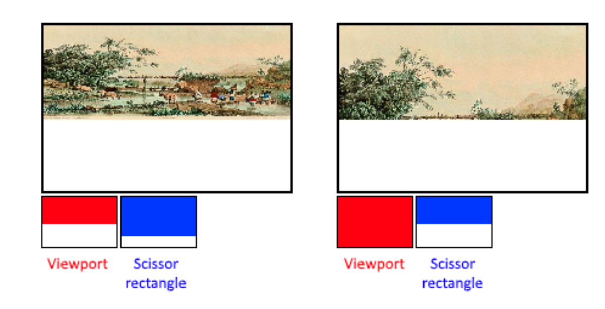

# Vulkan Study

# 목차
### 벌칸을 이용한 첫 삼각형
#### 1. 벌칸 파이프라인
#### 2. 벌칸 셰이더 모듈
#### 3. 벌칸 파이프라인 레이아웃
#### 4. 벌칸 그래픽스 파이프라인
#### 5. 삼각형 그리기

### 벌칸 메모리
### 벌칸 버텍스 버퍼
### 벌칸 인덱스 버퍼
### 벌칸 유니폼 버퍼
---

### 1. 벌칸 파이프라인
- OpenGL 과 Vulkan 은 그래픽스 파이프라인에 대한 개념은 동일
- OpenGL - 암시적 / Vulkan - 명시적
```c++
// OpenGL 에서의 그래픽스 파이프라인 설정
glEnable(GL_CULL_FACE);
glEnable(GL_BLEND);
glEnable(GL_DEPTH_TEST);
```
- OpenGL 에서는 그래픽스 파이프라인을 알아서 생성해주기 때문에 성능이 떨어지는 문제가 있음
- Vulkan 에서는 그래픽스 파이프라인을 하나의 리소스로 정의하여 프로그래머가 직접 생성 가능


Vulkan 의 그래픽스 파이프라인 / OpenGL과 동일

### 2. 벌칸 셰이더 모듈

- 그래픽스 파이프라인 생성을 위해 버텍스/프래그먼트 셰이더 정의 필요
- 버텍스 셰이더는 버텍스 버퍼로부터 입력

```c++
// VKSL
void main() {
	vec2 pos[3] = vec2[3](vec2(-0.5, 0.5),
						vec2(-0.5, 0.5),
						vec2(-0.5, 0.5));
	// gl_VertexIndex - 버텍스의 인덱스
	gl_Position = vec4(pos[gl_VertexIndex], 0.0, 1.0);
}
```
```c++
glDrawArrays(GL_TRIANGLES, 0, 3);
```

```c++
// VKSL
precision mediump float;

layout(location = 0) out vec4 fragment_color0;
void main() {
	fragment_color0 = vec4(0.0, 1.0, 0.0, 1.0);
}
```

VKSL 문법으로 셰이더를 작성 -> SPIRV 로 변경 필요
```c++
const string vksl = {
	"void main() { 										\n"
	" 	vec2 pos[3] = vec2[3](vec2(-0.5, 0.5), 			\n"
	" 						vec2( 0.5, 0.5), 			\n"
	" 						vec2( 0.0, -0.5)); 			\n"
	" 													\n"
	" gl_Position = vec4(pos[gl_VertexIndex], 0.0, 1.0); \n"
	"} 													\n"
};

auto spirv = Spirv_compiler().compile(Shader_type::vertex, vksl);
```

- 벌칸 셰이더 모듈 생성

```c++
typedef struct VkShaderModuleCreateInfo {
	VkStructureType 			sType; 		// 구조체 타입 정의
	const void* 				pNext; 		// NULL 
	VkShaderModuleCreateFlags 	flags; 
	size_t 						codeSize; 	// SPIRV 크기
	const uint32_t* 			pCode; 		// SPIRV 포인터
} VkShaderModuleCreateInfo;

VkResult vkCreateShaderModule( 
	VkDevice 						device, 		// 디바이스
	const VkShaderModuleCreateInfo* pCreateInfo,	// 정의한 셰이더 모듈 구조체 포인터
	const VkAllocationCallbacks* 	pAllocator, 	// NULL
	VkShaderModule* 				pShaderModule);	// 생성된 셰이더 모듈 받는 변수 포인터

// 생성하려는 셰이더 모듈 정의
VkShaderModuleCreateInfo create_info {}; 
create_info.sType = VK_STRUCTURE_TYPE_SHADER_MODULE_CREATE_INFO;
create_info.codeSize = spirv.size() * sizeof(uint32_t);
create_info.pCode = &spirv[0];

// 셰이더 모듈 생성
auto result = vkCreateShaderModule(device_, &create_info, nullptr, &shader_modules_[0]);
switch (result) {
	case VK_ERROR_OUT_OF_HOST_MEMORY: 
		cout << "VK_ERROR_OUT_OF_HOST_MEMORY" << endl
		break; 
	case VK_ERROR_OUT_OF_DEVICE_MEMORY: 
		cout << "VK_ERROR_OUT_OF_DEVICE_MEMORY" << endl; 
		break; 
	default: 
		break;
}
assert(result == VK_SUCCESS);


void vkDestroyShaderModule( 
	VkDevice 						device,
	VkShaderModule 					shaderModule, 
	const VkAllocationCallbacks* 	pAllocator);
	
// 생성한 셰이더 모듈 파괴
vkDestroyShaderModule(device_, shader_module, nullptr);
```

### 3. 벌칸 파이프라인 레이아웃

- 그래픽스 파이프라인 생성을 위해선 파이프라인 레이아웃 리소스가 필요

```c++
typedef struct VkPipelineLayoutCreateInfo { 
	VkStructureType 				sType; 					// 구조체 타입 정의
	const void* 					pNext; 					// NULL
	VkPipelineLayoutCreateFlags 	flags; 					
	uint32_t 						setLayoutCount; 		// 레이아웃에 포함될 디스크립터 셋의 수
	const VkDescriptorSetLayout* 	pSetLayouts; 			// 디스크립터 셋 레이아웃 변수나 배열의 포인터
	uint32_t 						pushConstantRangeCount;
	const VkPushConstantRange* 		pPushConstantRanges;
} VkPipelineLayoutCreateInfo;

VkResult vkCreatePipelineLayout( 
	VkDevice 							device, 		
	const VkPipelineLayoutCreateInfo* 	pCreateInfo, 		// 구조체의 포인터
	const VkAllocationCallbacks* 		pAllocator, 		// NULL
	VkPipelineLayout* 					pPipelineLayout);	// 생성된 레이아웃을 얻는 변수의 포인터


// 생성하려는 파이프라인 레이아웃 정의
// 리소스를 사용하지 않기에 단순함.
VkPipelineLayoutCreateInfo create_info {}; 
create_info.sType = VK_STRUCTURE_TYPE_PIPELINE_LAYOUT_CREATE_INFO;

// 파이프라인 레이아웃 생성
auto result = vkCreatePipelineLayout(device_, &create_info, nullptr,&pipeline_layout_); 

switch (result) { 
	case VK_ERROR_OUT_OF_HOST_MEMORY: 
		cout << "VK_ERROR_OUT_OF_HOST_MEMORY" << endl; 
		break; 
	case VK_ERROR_OUT_OF_DEVICE_MEMORY: 
		cout << "VK_ERROR_OUT_OF_DEVICE_MEMORY" << endl; 
		break; 
	default: 
	break; 
} 
assert(result == VK_SUCCESS);


void vkDestroyPipelineLayout( 
	VkDevice 						device, 
	VkPipelineLayout 				pipelineLayout, 
	const VkAllocationCallbacks* 	pAllocator);

// 생성한 파이프라인 레이아웃 파괴
vkDestroyPipelineLayout(device_, pipeline_layout_, nullptr);
```

### 4. 벌칸 그래픽스 파이프라인

- 그래픽스 파이프라인은 다음 구조체를 통해 정의

```c++
typedef struct VkGraphicsPipelineCreateInfo { 
	VkStructureType 									sType; 				// 구조체 타입
	const void* 										pNext; 				// NULL
	VkPipelineCreateFlags 								flags; 
	uint32_t 											stageCount; 		// 셰이더 스테이지 수
	const VkPipelineShaderStageCreateInfo* 				pStages; 			// 셰이더 스테이지 배열의 포인터
	const VkPipelineVertexInputStateCreateInfo* 		pVertexInputState; 	
	const VkPipelineInputAssemblyStateCreateInfo* 		pInputAssemblyState; 
	const VkPipelineTessellationStateCreateInfo* 		pTessellationState;
	const VkPipelineViewportStateCreateInfo* 			pViewportState; 
	const VkPipelineRasterizationStateCreateInfo* 		pRasterizationState; 
	const VkPipelineMultisampleStateCreateInfo* 		pMultisampleState; 
	const VkPipelineDepthStencilStateCreateInfo* 		pDepthStencilState; 
	const VkPipelineColorBlendStateCreateInfo* 			pColorBlendState; 
	const VkPipelineDynamicStateCreateInfo* 			pDynamicState; 
	VkPipelineLayout 									layout; 			// 파이프라인 레이아웃
	VkRenderPass 										renderPass; 		// 렌더패스 
	uint32_t 											subpass; 			// 렌더패스의 서브패스 인덱스
	VkPipeline 											basePipelineHandle; 
	int32_t 											basePipelineIndex; 
} VkGraphicsPipelineCreateInfo;
```

### 버텍스/프래그먼트 스테이지
```c++
typedef struct VkPipelineShaderStageCreateInfo { 
	VkStructureType 					sType;  // 구조체 타입 정의
	const void* 						pNext; 	// NULL
	VkPipelineShaderStageCreateFlags 	flags;
	VkShaderStageFlagBits 				stage; 	// 셰이더 스테이지 정의
	VkShaderModule 						module; // 셰이더 스테이지에서 사용되는 셰이더 모듈 정의
	const char* 						pName; // 셰이더 모듈에서 엔트리 포인트 이름 정의
	const VkSpecializationInfo* 		pSpecializationInfo; 
} VkPipelineShaderStageCreateInfo;


// 파이프라인 셰이더 스테이지 정의

array<VkPipelineShaderStageCreateInfo, 2> stages;

{
	// 버텍스 셰이더 스테이지 정의
	VkPipelineShaderStageCreateInfo stage {}; 
	stage.sType 	= VK_STRUCTURE_TYPE_PIPELINE_SHADER_STAGE_CREATE_INFO; 
	stage.stage 	= VK_SHADER_STAGE_VERTEX_BIT; 
	stage.module 	= shader_modules_[0]; 
	stage.pName 	= "main"; 
	
	stages[0] 		= stage;
}
{
	// 프래그먼트 셰이더 스테이지 정의
	VkPipelineShaderStageCreateInfo stage {}; 
	stage.sType 	= VK_STRUCTURE_TYPE_PIPELINE_SHADER_STAGE_CREATE_INFO; 
	stage.stage 	= VK_SHADER_STAGE_FRAGMENT_BIT; 
	stage.module 	= shader_modules_[1]; 
	stage.pName 	= "main"; 
	
	stages[1] 		= stage; 
}
```


### 버텍스 인풋 스테이지 
```c++
typedef struct VkPipelineVertexInputStateCreateInfo { 
	VkStructureType 							sType; // 구조체 타입 정의
	const void* 								pNext; // NULL
	VkPipelineVertexInputStateCreateFlags 		flags; 
	uint32_t 									vertexBindingDescriptionCount; // 버텍스 바인딩 개수
	const VkVertexInputBindingDescription* 		pVertexBindingDescriptions; // 사용되는 버텍스 바인딩 배열의 포인터
	uint32_t 									vertexAttributeDescriptionCount; // 버텍스 애트리뷰트 개수
	const VkVertexInputAttributeDescription* 	pVertexAttributeDescriptions; // 사용되는 버텍스 애트리뷰트 배열의 포인터
} VkPipelineVertexInputStateCreateInfo;

typedef struct VkPipelineInputAssemblyStateCreateInfo { 
	VkStructureType 						sType; // 구조체 타입 정의
	const void* 							pNext; 
	VkPipelineInputAssemblyStateCreateFlags flags; 
	VkPrimitiveTopology 					topology; // 프리미티브 토폴로지 정의
	VkBool32 								primitiveRestartEnable;
} VkPipelineInputAssemblyStateCreateInfo;

typedef enum VkPrimitiveTopology { 
	VK_PRIMITIVE_TOPOLOGY_POINT_LIST = 0, 
	VK_PRIMITIVE_TOPOLOGY_LINE_LIST = 1, 
	VK_PRIMITIVE_TOPOLOGY_LINE_STRIP = 2,
	VK_PRIMITIVE_TOPOLOGY_TRIANGLE_LIST = 3, 
	VK_PRIMITIVE_TOPOLOGY_TRIANGLE_STRIP = 4,
	VK_PRIMITIVE_TOPOLOGY_TRIANGLE_FAN = 5, 
	VK_PRIMITIVE_TOPOLOGY_LINE_LIST_WITH_ADJACENCY = 6,
	VK_PRIMITIVE_TOPOLOGY_LINE_STRIP_WITH_ADJACENCY = 7, 
	VK_PRIMITIVE_TOPOLOGY_TRIANGLE_LIST_WITH_ADJACENCY = 8, 
	VK_PRIMITIVE_TOPOLOGY_TRIANGLE_STRIP_WITH_ADJACENCY = 9, 
	VK_PRIMITIVE_TOPOLOGY_PATCH_LIST = 10, 
	VK_PRIMITIVE_TOPOLOGY_MAX_ENUM = 0x7FFFFFFF 
} VkPrimitiveTopology;

// 삼각형을 그리기 위해서 버텍스 버퍼가 사용되지 않기 때문에 
// 버텍스 버퍼를 읽지 않는 파이프라인 버텍스 인풋 스테이지 정의
VkPipelineVertexInputStateCreateInfo vertex_input_state {}; 
vertex_input_state.sType = VK_STRUCTURE_TYPE_PIPELINE_VERTEX_INPUT_STATE_CREATE_INFO;

// 파이프라인 인풋 어셈블리 스테이지 정의
VkPipelineInputAssemblyStateCreateInfo input_assembly_state {}; 
input_assembly_state.sType = VK_STRUCTURE_TYPE_PIPELINE_INPUT_ASSEMBLY_STATE_CREATE_INFO; 
input_assembly_state.topology = VK_PRIMITIVE_TOPOLOGY_TRIANGLE_LIST;

```


### 파이프라인 뷰포트 스테이지



```c++
typedef struct VkPipelineViewportStateCreateInfo { 
VkStructureType 					sType; 
const void* 						pNext;
VkPipelineViewportStateCreateFlags 	flags; 
uint32_t 							viewportCount; 	// 뷰포트 개수
const VkViewport* 					pViewports;		// 퓨포트 배열의 포인터
uint32_t 							scissorCount; 	// 시저 개수
const VkRect2D* 					pScissors; 		// 시저 배열의 포인터
} VkPipelineViewportStateCreateInfo;

typedef struct VkViewport { 
	float x; 		// 좌측 상단 코너 x
	float y; 		// 좌측 상단 코너 y
	float width; 	
	float height; 
	float minDepth; // 최소 뎁스, 일반적으로 0.0
	float maxDepth; // 최대 뎁스, 일반적으로 1.0
} VkViewport;

typedef struct VkRect2D { 
	VkOffset2D offset; // 사각형 오프셋
	VkExtent2D extent; // 사각형 크기
} VkRect2D;

// 뷰포트 정의
VkViewport viewport {}; 
viewport.width = swapchain_image_extent_.width; 
viewport.height = swapchain_image_extent_.height; 
viewport.minDepth = 0.0f; 
viewport.maxDepth = 1.0f;

// 시저 영역 정의
VkRect2D scissor {}; 
scissor.extent = swapchain_image_extent_;

// 파이프라인 뷰포트 스테이지 정의 
VkPipelineViewportStateCreateInfo viewport_state {}; 
viewport_state.sType = VK_STRUCTURE_TYPE_PIPELINE_VIEWPORT_STATE_CREATE_INFO; 
viewport_state.viewportCount = 1; 
viewport_state.pViewports = &viewport; 
viewport_state.scissorCount = 1; 
viewport_state.pScissors = &scissor;
```


### 파이프라인 래스터라이제이션 스테이지

```c++
typedef struct VkPipelineRasterizationStateCreateInfo { 
	VkStructureType 						sType; 
	const void* 							pNext; 
	VkPipelineRasterizationStateCreateFlags flags; 
	VkBool32 								depthClampEnable; 
	VkBool32 								rasterizerDiscardEnable; 
	VkPolygonMode 							polygonMode; 
	VkCullModeFlags 						cullMode; 
	VkFrontFace 							frontFace; 
	VkBool32 								depthBiasEnable; 
	float 									depthBiasConstantFactor; 
	float 									depthBiasClamp; 
	float 									depthBiasSlopeFactor; 
	float 									lineWidth; 
} VkPipelineRasterizationStateCreateInfo;

typedef enum VkPolygonMode { 
	VK_POLYGON_MODE_FILL = 0, 
	VK_POLYGON_MODE_LINE = 1, 
	VK_POLYGON_MODE_POINT = 2, 
	VK_POLYGON_MODE_FILL_RECTANGLE_NV = 1000153000, 
	VK_POLYGON_MODE_MAX_ENUM = 0x7FFFFFFF 
} VkPolygonMode;

typedef enum VkCullModeFlagBits { 
	VK_CULL_MODE_NONE = 0, 
	VK_CULL_MODE_FRONT_BIT = 0x00000001, 
	VK_CULL_MODE_BACK_BIT = 0x00000002, 
	VK_CULL_MODE_FRONT_AND_BACK = 0x00000003, 
	VK_CULL_MODE_FLAG_BITS_MAX_ENUM = 0x7FFFFFFF 
} VkCullModeFlagBits;


// 파이프라인 래스터라이제이션 스테이지 정의 
VkPipelineRasterizationStateCreateInfo rasterization_state {}; 
rasterization_state.sType = VK_STRUCTURE_TYPE_PIPELINE_RASTERIZATION_STATE_CREATE_INFO; 
rasterization_state.polygonMode = VK_POLYGON_MODE_FILL; 
rasterization_state.cullMode = VK_CULL_MODE_NONE; 
rasterization_state.lineWidth = 1.0f;

```


### 파이프라인 멀티 샘플 스테이지

```c++
typedef struct VkPipelineMultisampleStateCreateInfo { 
	VkStructureType 						sType; 
	const void* 							pNext; 
	VkPipelineMultisampleStateCreateFlags 	flags; 
	VkSampleCountFlagBits 					rasterizationSamples; // 샘플 수
	VkBool32 								sampleShadingEnable;
	float 									minSampleShading; 
	const VkSampleMask* 					pSampleMask; 
	VkBool32 								alphaToCoverageEnable;
	VkBool32 								alphaToOneEnable; 
} VkPipelineMultisampleStateCreateInfo;

typedef enum VkSampleCountFlagBits { 
	VK_SAMPLE_COUNT_1_BIT = 0x00000001, 
	VK_SAMPLE_COUNT_2_BIT = 0x00000002, 
	VK_SAMPLE_COUNT_4_BIT = 0x00000004, 
	VK_SAMPLE_COUNT_8_BIT = 0x00000008, 
	VK_SAMPLE_COUNT_16_BIT = 0x00000010, 
	VK_SAMPLE_COUNT_32_BIT = 0x00000020, 
	VK_SAMPLE_COUNT_64_BIT = 0x00000040, 
} VkSampleCountFlagBits;

// 파이프라인 멀티샘플 스테이지 정의
// 멀티샘플을 사용하지 않는 경우 래스터라이제이션 샘플 개수를 1로 정의
VkPipelineMultisampleStateCreateInfo multisample_state {}; 
multisample_state.sType = VK_STRUCTURE_TYPE_PIPELINE_MULTISAMPLE_STATE_CREATE_INFO; 
multisample_state.rasterizationSamples = VK_SAMPLE_COUNT_1_BIT;

```

### 파이프라인 뎁스 스텐실 스테이지

```c++
typedef struct VkPipelineDepthStencilStateCreateInfo { 
	VkStructureType 						sType; // 구조체 타입 정의
	const void* 							pNext; 
	VkPipelineDepthStencilStateCreateFlags 	flags; 
	VkBool32 								depthTestEnable; 
	VkBool32 								depthWriteEnable; 
	VkCompareOp 							depthCompareOp; 
	VkBool32 								depthBoundsTestEnable; 
	VkBool32 								stencilTestEnable; 
	VkStencilOpState 						front; // 앞면에 대한 스텐실 테스트
	VkStencilOpState 						back; // 뒷면에 대한 스텐실 테스트
	float 									minDepthBounds; 
	float 									maxDepthBounds; 
} VkPipelineDepthStencilStateCreateInfo;

// 삼각형 그리는데는 depth/stencil 테스트 필요 X
// 파이프라인 뎁스 스텐실 스테이지 정의
VkPipelineDepthStencilStateCreateInfo depth_stencil_state {}; 
depth_stencil_state.sType = VK_STRUCTURE_TYPE_PIPELINE_DEPTH_STENCIL_STATE_CREATE_INFO;

```

### 파이프라인 컬러 블렌드 스테이지

```c++
typedef struct VkPipelineColorBlendStateCreateInfo { 
	VkStructureType 							sType; 
	const void* 								pNext; 
	VkPipelineColorBlendStateCreateFlags 		flags; 
	VkBool32 									logicOpEnable; 
	VkLogicOp 									logicOp; 
	uint32_t 									attachmentCount; // 어태치먼트 수
	const VkPipelineColorBlendAttachmentState* 	pAttachments; 	// 어태치먼트 배열의 포인터
	float 										blendConstants[4]; 
} VkPipelineColorBlendStateCreateInfo;


typedef struct VkPipelineColorBlendAttachmentState { 
	VkBool32 				blendEnable; // 블랜드 사용 유무
	VkBlendFactor 			srcColorBlendFactor; // 소스 컬러 블랜드 팩터
	VkBlendFactor 			dstColorBlendFactor; // 데스티네이션 컬러 블랜드 팩터
	VkBlendOp 				colorBlendOp; // 컬러 블랜드 오퍼레이션
	VkBlendFactor 			srcAlphaBlendFactor; // 소스 알파 블랜드 팩터
	VkBlendFactor 			dstAlphaBlendFactor; // 데스티네이션 알파 블랜드 팩터
	VkBlendOp 				alphaBlendOp; // 알파 블랜드 오퍼레이션
	VkColorComponentFlags 	colorWriteMask; // 컬러 쓰기 마스크 
} VkPipelineColorBlendAttachmentState;
// 여기서 colorWriteMask 정의하지 않으면 컬러가 Write 되지 않음

// 파이프라인 컬러 블렌드 어테치먼트 정의 
// colorWriteMask가 0이면 프래그먼트의 결과가 이미지에 기록 X 
VkPipelineColorBlendAttachmentState attachment {}; 
attachment.colorWriteMask = VK_COLOR_COMPONENT_R_BIT 
						| VK_COLOR_COMPONENT_G_BIT 
						| VK_COLOR_COMPONENT_B_BIT 
						| VK_COLOR_COMPONENT_A_BIT;


// 파이프라인 컬러 블렌드 스테이지 정의 
VkPipelineColorBlendStateCreateInfo color_blend_state {}; 
color_blend_state.sType = VK_STRUCTURE_TYPE_PIPELINE_COLOR_BLEND_STATE_CREATE_INFO; 
color_blend_state.attachmentCount = 1; 
color_blend_state.pAttachments = &attachment;

```

### 그래픽스 파이프라인

```c++
// 생성하려는 그래픽스 파이프라인 정의
VkGraphicsPipelineCreateInfo create_info {}; 
create_info.sType = VK_STRUCTURE_TYPE_GRAPHICS_PIPELINE_CREATE_INFO; 
create_info.stageCount = stages.size(); 
create_info.pStages = &stages[0]; 
create_info.pVertexInputState = &vertex_input_state; 
create_info.pInputAssemblyState = &input_assembly_state; 
create_info.pViewportState = &viewport_state; 
create_info.pRasterizationState = &rasterization_state; 
create_info.pMultisampleState = &multisample_state; 
create_info.pDepthStencilState = &depth_stencil_state; 
create_info.pColorBlendState = &color_blend_state; 
create_info.layout = pipeline_layout_; 
create_info.renderPass = render_pass_;


VkResult vkCreateGraphicsPipelines( 
	VkDevice 							device, 
	VkPipelineCache 					pipelineCache,
	uint32_t 							createInfoCount, // 그래픽스 파이프라인 구조체 수
	const VkGraphicsPipelineCreateInfo* pCreateInfos, 	// 그래픽스 파이프라인 구조체 배열의 포인터
	const VkAllocationCallbacks* 		pAllocator, 
	VkPipeline* 						pPipelines);

// 그래픽스 파이프라인 생성
auto result = vkCreateGraphicsPipelines(device_, VK_NULL_HANDLE, 1, 
										&create_info, nullptr, &pipeline_); 

switch (result) { 
	case VK_ERROR_OUT_OF_HOST_MEMORY: 
		cout << "VK_ERROR_OUT_OF_HOST_MEMORY" << endl; 
		break; 
	case VK_ERROR_OUT_OF_DEVICE_MEMORY: 
		cout << "VK_ERROR_OUT_OF_DEVICE_MEMORY" << endl; 
		break; 
	default: 
		break; 
} 
assert(result == VK_SUCCESS);

void vkDestroyPipeline( 
	VkDevice device, 
	VkPipeline pipeline, 
	const VkAllocationCallbacks* pAllocator);

// 생성한 그래픽스 파이프라인을 파괴합니다. 
vkDestroyPipeline(device_, pipeline_, nullptr);

```


### 4. 삼각형 그리기

```c++
void vkCmdDraw( 
	VkCommandBuffer commandBuffer, 	// 커맨드 버퍼
	uint32_t vertexCount, 			// 버텍스 수
	uint32_t instanceCount, 		// 인스턴스의 수
	uint32_t firstVertex, 			// 첫번째 버텍스의 인덱스, 오프셋 역할
	uint32_t firstInstance);		

void vkCmdBindPipeline( 
	VkCommandBuffer commandBuffer, 
	VkPipelineBindPoint pipelineBindPoint, 	// 파이프라인 바인드 포인트
	VkPipeline pipeline);					// 파이프라인

typedef enum VkPipelineBindPoint { 
	VK_PIPELINE_BIND_POINT_GRAPHICS = 0, 
	VK_PIPELINE_BIND_POINT_COMPUTE = 1, 
	VK_PIPELINE_BIND_POINT_RAY_TRACING_KHR = 1000165000, 
	VK_PIPELINE_BIND_POINT_RAY_TRACING_NV = VK_PIPELINE_BIND_POINT_RAY_TRACING_KHR,
} VkPipelineBindPoint;

// 삼각형을 그리기 위한 드로우 커맨드 기록
// 인스턴스 렌더링 사용하지 않는 경우 instanceCount 1로 설정
vkCmdDraw(command_buffer_, 3, 1, 0, 0);

// 삼각형을 그리기 위한 그래픽스 파이프라인 바인딩.
vkCmdBindPipeline(command_buffer_, VK_PIPELINE_BIND_POINT_GRAPHICS, pipeline_);

```


## 벌칸 메모리

### Opengl 과 메모리

- opengl 에서는 메모리를 고려한 적 X
- 아래처럼 버퍼를 생성하고 데이터를 설정
- API 를 호출하기만 하고 메모리에 대한 어떠한 고려도 없음

```c++
unsigned int vertex_buffer; 
glGenBuffers(1, &vertex_buffer); 

glBindBuffer(GL_ARRAY_BUFFER, vertex_buffer); 
glBufferData(GL_ARRAY_BUFFER, sizeof(vertices), vertices, GL_STATIC_DRAW);
```

```c++
void glBufferData(GLenum target, GLsizeiptr size, const void * data, GLenum usage);
```

- usage에 GL_STATIC_DRAW 또는 GL_DYNAMIC_DRAW 설정
	- GL_STATIC_DRAW - 변하지 않는 데이터, CPU 에 의해 변하지 않기에 GPU 가 빠르게 접근할 수 있는 메모리에 버퍼 할당
	- GL_DYNAMIC_DRAW  - 변하는 데이터, CPU 에 의해 자주  변경되기에 CPU 가 빠르게 접근할 수 있는 메모리에 버퍼 할당

- 많은 개발자들이 버퍼의 성격에 상관없이 GL_STATIC_DRAW 를 자주 사용 


### 벌칸 메모리 성질

- Vulkan 은 개발자가 어떤 메모리를 사용할 지 결정 가능

```c++
void vkGetPhysicalDeviceMemoryProperties( 
	VkPhysicalDevice physicalDevice, // 물리 디바이스
	VkPhysicalDeviceMemoryProperties* pMemoryProperties); // 메모리 성질을 얻어올 변수 포인터

// 메모리 성질을 얻어오기 위한 변수 선언
VkPhysicalDeviceMemoryProperties properties; 
// 물리 디바이스로부터 메모리의 성질 얻음 
vkGetPhysicalDeviceMemoryProperties(physical_device_, &properties);


// 메모리 성질 구조체
typedef struct VkPhysicalDeviceMemoryProperties { 
	uint32_t 		memoryTypeCount; 					// 사용가능한 메모리 타입 수
	VkMemoryType 	memoryTypes[VK_MAX_MEMORY_TYPES]; 	// 메모리 타입 배열
	uint32_t 		memoryHeapCount; 					// 사용가능한 메모리 힙의 수
	VkMemoryHeap 	memoryHeaps[VK_MAX_MEMORY_HEAPS]; 	// 매모리 힙 배열
} VkPhysicalDeviceMemoryProperties;

// 메모리 타입 구조체
typedef struct VkMemoryType { 
	VkMemoryPropertyFlags 	propertyFlags; 	// 메모리 타입 성질
	uint32_t 				heapIndex; 		// 이 메모리 타입에 대응되는 메모리 힙 인덱스
} VkMemoryType;

// 메모리 특성 플래그
typedef enum VkMemoryPropertyFlagBits { 
	VK_MEMORY_PROPERTY_DEVICE_LOCAL_BIT = 0x00000001, 
	VK_MEMORY_PROPERTY_HOST_VISIBLE_BIT = 0x00000002, 
	VK_MEMORY_PROPERTY_HOST_COHERENT_BIT = 0x00000004, 
	VK_MEMORY_PROPERTY_HOST_CACHED_BIT = 0x00000008, 
	VK_MEMORY_PROPERTY_LAZILY_ALLOCATED_BIT = 0x00000010, 
	VK_MEMORY_PROPERTY_PROTECTED_BIT = 0x00000020, 
	VK_MEMORY_PROPERTY_DEVICE_COHERENT_BIT_AMD = 0x00000040, 
	VK_MEMORY_PROPERTY_DEVICE_UNCACHED_BIT_AMD = 0x00000080, 
	VK_MEMORY_PROPERTY_FLAG_BITS_MAX_ENUM = 0x7FFFFFFF 
} VkMemoryPropertyFlagBits;
```

- DEVICE_LOCAL_BIT : GPU 가 빠르게 접근 가능 / CPU 접근 불가 ( VRAM )
- HOST_VISIBLE_BIT : GPU 느리게 접근 가능 / CPU 빠르게 접근 가능 (DRAM)
- HOST_COHERENT_BIT : GPU, CPU 메모리 동기화 보장
	- CPU 가 메모리에 데이터를 Write 시 메모리에 바로 Write 가 아니라 캐시에 Write
	- GPU 가 메모리를 Read 시 메모리를 Read 가 아닌 캐시를 Read


#### 메모리 힙

```c++
typedef struct VkMemoryHeap { 
	VkDeviceSize 		size; 	// 메모리 힙 크기		
	VkMemoryHeapFlags 	flags; 	
} VkMemoryHeap;


// 사용가능한 디바이스 메모리의 성질 출력 
for (auto i = 0; i != VK_MAX_MEMORY_TYPES; ++i) { 
	auto heap_index = properties.memoryTypes[i].heapIndex; 
	
	cout << i << " Memory Type" << '\n' 
		<< '\t' << properties.memoryTypes[i] << '\n' 
		<< '\t' << properties.memoryHeaps[heap_index] << '\n'; 
}
```


#### VMA ( Vulkan Memory Allocator)

- 메모리 할당 뿐만 아니라 메모리 폴도 직접 구현
- AMD 에서 메모리를 효율적으로 할당하는 VMA 를 오픈소스로 공개

```c++
#define VMA_IMPLEMENTATION 
#include "vk_mem_alloc.h"


// 생성하려는 얼로케이터를 정의합니다. 
VmaAllocatorCreateInfo create_info = {}; 
create_info.device = device_; 
create_info.instance = instance_; 
create_info.physicalDevice = physical_device_; 

// 얼로케이터를 생성합니다. 
auto result = vmaCreateAllocator(&create_info, &allocator_); 
assert(result == VK_SUCCESS);

// 얼로케이터를 파괴합니다. 
vmaDestroyAllocator(allocator_);
```

--- 

### 벌칸 버텍스 버퍼

#### 벌칸 버퍼

- 이전 예시에선 버텍스 셰이더 안에서 버텍스 정보를 정의함.
- 일반적으로 버텍스 정보를 버퍼에 저장하고 버텍스 셰이더는 버텍스 버퍼로부터 버텍스 정보를 읽어서 NDC 공간으로 변환


```c++
// 위치와 색상 정보를 가진 버텍스 정보 정의. 
struct Vertex { 
	float x, y, z; // 위치 정보 
	float r, g, b; // 색상 정보 
};

// 삼각형을 그리기위해 필요한 버텍스 정보 정의 
vector vertices = { 
	/* 위치 */ /* 색상 */ 
	{ 0.0, -0.5, 0.0, 1.0, 0.0, 0.0}, 
	{ 0.5, 0.5, 0.0, 0.0, 1.0, 0.0}, 
	{-0.5, 0.5, 0.0, 0.0, 0.0, 1.0} 
};

```

버텍스 정보는 CPU 에서만 접근 가능한 메모리에 저장되어 있음. GPU 가 접근가능한 버퍼를 생성한 뒤 버텍스 정보를 복사해주어야 함.


```c++
typedef struct VkBufferCreateInfo { 
	VkStructureType 	sType; 
	const void* 		pNext; 
	VkBufferCreateFlags flags; 
	VkDeviceSize 		size; // 버퍼 사이즈
	VkBufferUsageFlags 	usage; // 버퍼 사용처
	VkSharingMode 		sharingMode; // 버퍼가 여러 큐에 의해 공유될지 정의
	uint32_t 			queueFamilyIndexCount; // 버퍼를 사용한 큐 인덱스 개수
	const uint32_t* 	pQueueFamilyIndices; // 버퍼를 사용할 큐 인덱스 배열의 포인터
} VkBufferCreateInfo;


// 버퍼 사용처
typedef enum VkBufferUsageFlagBits { 
	VK_BUFFER_USAGE_TRANSFER_SRC_BIT = 0x00000001,
	VK_BUFFER_USAGE_TRANSFER_DST_BIT = 0x00000002, 
	VK_BUFFER_USAGE_UNIFORM_TEXEL_BUFFER_BIT = 0x00000004, 
	VK_BUFFER_USAGE_STORAGE_TEXEL_BUFFER_BIT = 0x00000008, 
	VK_BUFFER_USAGE_UNIFORM_BUFFER_BIT = 0x00000010, 
	VK_BUFFER_USAGE_STORAGE_BUFFER_BIT = 0x00000020, 
	VK_BUFFER_USAGE_INDEX_BUFFER_BIT = 0x00000040, 
	VK_BUFFER_USAGE_VERTEX_BUFFER_BIT = 0x00000080, 
	VK_BUFFER_USAGE_INDIRECT_BUFFER_BIT = 0x00000100, 
	// Provided by VK_VERSION_1_2 
	VK_BUFFER_USAGE_SHADER_DEVICE_ADDRESS_BIT = 0x00020000, 
	// Provided by VK_EXT_transform_feedback 
	VK_BUFFER_USAGE_TRANSFORM_FEEDBACK_BUFFER_BIT_EXT = 0x00000800, 
	// Provided by VK_EXT_transform_feedback 
	VK_BUFFER_USAGE_TRANSFORM_FEEDBACK_COUNTER_BUFFER_BIT_EXT = 0x00001000, 
	// Provided by VK_EXT_conditional_rendering 
	VK_BUFFER_USAGE_CONDITIONAL_RENDERING_BIT_EXT = 0x00000200, 
	// Provided by VK_KHR_ray_tracing
	VK_BUFFER_USAGE_RAY_TRACING_BIT_KHR = 0x00000400, 
	// Provided by VK_NV_ray_tracing 
	VK_BUFFER_USAGE_RAY_TRACING_BIT_NV = VK_BUFFER_USAGE_RAY_TRACING_BIT_KHR, 
	// Provided by VK_EXT_buffer_device_address 
	VK_BUFFER_USAGE_SHADER_DEVICE_ADDRESS_BIT_EXT = VK_BUFFER_USAGE_SHADER_DEVICE_ADDRESS_BIT, 
	// Provided by VK_KHR_buffer_device_address 
	VK_BUFFER_USAGE_SHADER_DEVICE_ADDRESS_BIT_KHR = VK_BUFFER_USAGE_SHADER_DEVICE_ADDRESS_BIT, 
} VkBufferUsageFlagBits;


// 생성하려는 버텍스 버퍼 정의
VkBufferCreateInfo create_info {}; 
create_info.sType = VK_STRUCTURE_TYPE_BUFFER_CREATE_INFO; 
create_info.size = sizeof(Vertex) * vertices.size(); 
// 버퍼의 사용처를 VERTEX_BUFFER_BIT을 설정하지 않으면 버텍스 버퍼로 사용할 수 없습니다.
create_info.usage = VK_BUFFER_USAGE_VERTEX_BUFFER_BIT;


VkResult vkCreateBuffer( 
	VkDevice device, 
	const VkBufferCreateInfo* pCreateInfo, // 생성하려는 버퍼를 정의한 구조체
	const VkAllocationCallbacks* pAllocator, 
	VkBuffer* pBuffer);

// 버퍼 생성
auto result = vkCreateBuffer(device_, &create_info, nullptr, &vertex_buffer_); 

switch (result) { 
	case VK_ERROR_OUT_OF_HOST_MEMORY: 
		cout << "VK_ERROR_OUT_OF_HOST_MEMORY" << endl; 
		break; 
	case VK_ERROR_OUT_OF_DEVICE_MEMORY: 
		cout << "VK_ERROR_OUT_OF_DEVICE_MEMORY" << endl; 
		break; 
	default: 
		break; 
} 
assert(result == VK_SUCCESS);


void vkDestroyBuffer( 
	VkDevice device, 
	VkBuffer buffer, 
	const VkAllocationCallbacks* pAllocator);

// 생성된 버퍼 파괴 
vkDestroyBuffer(device_, vertex_buffer_, nullptr);
```

---
#### 벌칸 메모리 

- 버텍스 버퍼를 생성했지만 버텍스 정보를 복사하기 위한 메모리 필요
- Vulkan 에서 버퍼는 실제 자원이 아닌 메모리를 어떻게 읽을 지를 명시한 일종의 메타데이터
- 따라서 버퍼를 위한 메모리 할당이 필요함.
- 주의할 점은 할당하려는 메모리 크기가 버텍스 버퍼의 크기와 다를 수 있음.
- GPU 마다 요구되는 메모리 얼라이먼트가 다르고 다른 이유로 인해 버퍼를 위해 필요한 메모리의 크기가 더 크게 요구될 수 있음.
- 따라서 다음 API 를 통해 버퍼를 위해 필요한 메모리 요구사항 가져와야 함

```c++
void vkGetBufferMemoryRequirements( 
	VkDevice device, 
	VkBuffer buffer, 
	VkMemoryRequirements* pMemoryRequirements);
	
// 메모리 요구사항 구조체
typedef struct VkMemoryRequirements { 
	VkDeviceSize 	size; 			// 버퍼를 위해 필요한 메모리 크기
	VkDeviceSize 	alignment; 		// 메모리 얼라이먼트
	uint32_t 		memoryTypeBits; // 메모리가 할당될 수 있는 메모리 타입이 정의된 마스크
} VkMemoryRequirements;

// 메모리 요구사항을 얻어올 변수 선언
VkMemoryRequirements requirements; 

// 버퍼를 위해 필요한 메모리 요구사항을 얻어옵니다. 
vkGetBufferMemoryRequirements(device_, vertex_buffer_, &requirements);
```

- 개발자가 메모리를 어떻게 접근할지에 따라서 최종적으로 사용할 메모리 타입을 결정
- CPU 에서 버퍼를 접근해야 하면 메모리 타입이 HOST_VISIBLE_BIT 을 지원해야 함
- 아래와 같이 메모리 타입을 결정하기 위한 유틸리티 함수 정의

```c++
uint32_t find_memory_type_index(const VkMemoryRequirements& requirements,
 VkMemoryPropertyFlags properties) 
{ 
	// 메모리 요구사항과 필요한 메모리 성질을 모두 만족하는 메모리 타입 인덱스를 찾습니다. 
	for (auto i = 0; i != physical_device_memory_properties_.memoryTypeCount; ++i) { 
		// 메모리가 i번째 메모리 타입에 할당 가능한지 검사합니다. 
		if (!(requirements.memoryTypeBits & (1 << i))) continue; 
		// 개발자가 요구한 메모리 성질을 만족하는지 검사합니다. 
		if ((physical_device_memory_properties_.memoryTypes[i].propertyFlags & 
			properties) != properties)
			 continue; 
		return i; 
	} 
	assert(false); 
	return UINT32_MAX; 
}

find_memory_type_index(requirements, 
	VK_MEMORY_PROPERTY_HOST_VISIBLE_BIT | VK_MEMORY_PROPERTY_HOST_COHERENT_BIT);
```

#### 할당하려는 메모리 정의

```c++
typedef struct VkMemoryAllocateInfo { 
	VkStructureType 	sType; 
	const void* 		pNext; 
	VkDeviceSize 		allocationSize; // 할당하려는 메모리 크기
	uint32_t 			memoryTypeIndex; // 메모리 타입 인덱스 정의
} VkMemoryAllocateInfo;

// 할당하려는 메모리 정의
VkMemoryAllocateInfo alloc_info {}; 
alloc_info.sType = VK_STRUCTURE_TYPE_MEMORY_ALLOCATE_INFO; 
alloc_info.allocationSize = requirements.size; 

// CPU에서 접근 가능하고 CPU와 GPU의 메모리 동기화가 보장되는 메모리 타입을 선택합니다.
alloc_info.memoryTypeIndex = find_memory_type_index(requirements, 
	VK_MEMORY_PROPERTY_HOST_VISIBLE_BIT | VK_MEMORY_PROPERTY_HOST_COHERENT_BIT);


VkResult vkAllocateMemory( 
	VkDevice 						device, 
	const VkMemoryAllocateInfo* 	pAllocateInfo, // 할당하려는 메모리 정의 구조체
	const VkAllocationCallbacks* 	pAllocator, 
	VkDeviceMemory* 				pMemory);	// 할당된 메모리를 얻어오는 변수의 포인터

// 메모리 할당 
result = vkAllocateMemory(device_, &alloc_info, nullptr, &vertex_device_memory_); 

switch (result) { 
	case VK_ERROR_OUT_OF_HOST_MEMORY: 
		cout << "VK_ERROR_OUT_OF_HOST_MEMORY" << endl; 
		break; 
	case VK_ERROR_OUT_OF_DEVICE_MEMORY: 
		cout << "VK_ERROR_OUT_OF_DEVICE_MEMORY" << endl; 
		break; 
	case VK_ERROR_TOO_MANY_OBJECTS: 
		cout << "VK_ERROR_TOO_MANY_OBJECTS" << endl; 
		break; 
	default: 
		break; 
} 
assert(result == VK_SUCCESS);
```

#### 버퍼와 메모리 바인드

```c++
VkResult vkBindBufferMemory( 
	VkDevice device, 
	VkBuffer buffer, 
	VkDeviceMemory memory, 
	VkDeviceSize memoryOffset);

// 버퍼와 메모리 바인드
result = vkBindBufferMemory(device_, vertex_buffer_, vertex_device_memory_, 0); 

switch (result) { 
	case VK_ERROR_OUT_OF_HOST_MEMORY: 
		cout << "VK_ERROR_OUT_OF_HOST_MEMORY" << endl; 
		break; 
	case VK_ERROR_OUT_OF_DEVICE_MEMORY: 
		cout << "VK_ERROR_OUT_OF_DEVICE_MEMORY" << endl; 
		break; 
	default: 
		break; 
} assert(result == VK_SUCCESS);
```

#### 버텍스 정보 메모리 복사

- HOST_VISIBLE_BIT 이 지원되는 메모리로 할당했기에 CPU 에서 메모리를 바로 접근하여 버텍스 정보 복사
```c++
VkResult vkMapMemory( 
	VkDevice device, 
	VkDeviceMemory memory,
	VkDeviceSize offset, 
	VkDeviceSize size, 
	VkMemoryMapFlags flags, 
	void** ppData); // 메모리에 접근 가능한 버추얼 어드레스를 얻어올 변수의 포인터

// CPU에서 메모리에 접근하기 위한 버추얼 어드레스 얻음 
void* contents; result = vkMapMemory(device_, vertex_device_memory_, 0, 
						sizeof(Vertex) * vertices.size(), 0, &contents); 

switch (result) { 
	case VK_ERROR_OUT_OF_HOST_MEMORY: 
		cout << "VK_ERROR_OUT_OF_HOST_MEMORY" << endl; 
		break; 
	case VK_ERROR_OUT_OF_DEVICE_MEMORY: 
		cout << "VK_ERROR_OUT_OF_DEVICE_MEMORY" << endl; 
		break; 
	case VK_ERROR_MEMORY_MAP_FAILED: 
		cout << "VK_ERROR_MEMORY_MAP_FAILED" << endl; 
		break; 
	default: 
		break; 
} 
assert(result == VK_SUCCESS);

// 버텍스 정보를 메모리에 복사
memcpy(contents, &vertices[0], sizeof(Vertex) * vertices.size());


void vkUnmapMemory( VkDevice device, VkDeviceMemory memory);
// CPU에서 메모리의 접근을 끝마침
vkUnmapMemory(device_, vertex_device_memory_);


void vkFreeMemory( VkDevice device, VkDeviceMemory memory, 
					const VkAllocationCallbacks* pAllocator);		
// 할당된 메모리 해제
vkFreeMemory(device_, vertex_device_memory_, nullptr);

```

---
#### 그래픽스 파이프라인 변경

- 버텍스 버퍼에서 버텍스 데이터를 가져올 것이기에 셰이더 수정

```c++
// Vertex Shader
precision mediump float; 

layout(location = 0) in vec2 i_pos; 
layout(location = 1) in vec3 i_col; 

layout(location = 0) out vec3 o_col; 

void main() { 
	gl_Position = vec4(i_pos, 0.0, 1.0); 
	o_col = i_col; 
}

// Fragment Shader
precision mediump float; 

layout(location = 0) in vec3 i_col; 
layout(location = 0) out vec4 fragment_color0; 

void main() { 
	fragment_color0 = vec4(i_col, 1.0); 
}
```

- 파이프라인 버텍스 인풋 스테이지 수정
```c++
typedef struct VkPipelineVertexInputStateCreateInfo { 
	VkStructureType 							sType; // 구조체 타입 정의
	const void* 								pNext; // NULL
	VkPipelineVertexInputStateCreateFlags 		flags; 
	uint32_t 									vertexBindingDescriptionCount; // 버텍스 바인딩 개수
	const VkVertexInputBindingDescription* 		pVertexBindingDescriptions; // 사용되는 버텍스 바인딩 배열의 포인터
	uint32_t 									vertexAttributeDescriptionCount; // 버텍스 애트리뷰트 개수
	const VkVertexInputAttributeDescription* 	pVertexAttributeDescriptions; // 사용되는 버텍스 애트리뷰트 배열의 포인터
} VkPipelineVertexInputStateCreateInfo;


typedef struct VkVertexInputBindingDescription { 
	uint32_t 			binding; // 버텍스 버퍼가 바인딩 될 위치
	uint32_t 			stride; // 버텍스 정보 스트라이드
	VkVertexInputRate 	inputRate; // 버텍스 정보가 셰이더에 어떻게 공급될지 정의
} VkVertexInputBindingDescription;

// 버텍스 인풋 바인딩 정의
VkVertexInputBindingDescription vertex_input_binding {}; 
vertex_input_binding.binding = 0; 
vertex_input_binding.stride = sizeof(Vertex); 
vertex_input_binding.inputRate = VK_VERTEX_INPUT_RATE_VERTEX;


typedef struct VkVertexInputAttributeDescription { 
	uint32_t location; // 특정 로케이션의 애트리뷰트에 데이터 전달할지 정의
	uint32_t binding; // 어떤 버텍스 버퍼로부터 데이터 읽을지 정의
	VkFormat format; // 애트리뷰트 포맷
	uint32_t offset; 
} VkVertexInputAttributeDescription;

// 버텍스 셰이더엔 2개의 애트리뷰트 있음
vector<VkVertexInputAttributeDescription> vertex_input_attributes;

{ 
	// 위치에 대한 버텍스 인풋 애트리뷰트 정의
	VkVertexInputAttributeDescription vertex_input_attribute {}; 
	vertex_input_attribute.location = 0; // 셰이더에서 정의한 로케이션 
	vertex_input_attribute.binding = 0; // 버텍스 버퍼의 바인딩 인덱스 
	vertex_input_attribute.format = VK_FORMAT_R32G32B32_SFLOAT; 
	vertex_input_attribute.offset = offsetof(Vertex, x); 
	vertex_input_attributes.push_back(vertex_input_attribute); 
} 
{ 
	// 색상에 대한 버텍스 인풋 애트리뷰트를 정의한다. 
	VkVertexInputAttributeDescription vertex_input_attribute {}; 
	vertex_input_attribute.location = 1; // 셰이더에서 정의한 로케이션 
	vertex_input_attribute.binding = 0; // 버텍스 버퍼의 바인딩 인덱스 
	vertex_input_attribute.format = VK_FORMAT_R32G32B32_SFLOAT; 
	vertex_input_attribute.offset = offsetof(Vertex, r); 
	vertex_input_attributes.push_back(vertex_input_attribute); 
}

```
---
#### 삼각형 그리기

- 생성한 버텍스 버퍼를 바인드

```c++
void vkCmdBindVertexBuffers( 
	VkCommandBuffer commandBuffer, 
	uint32_t firstBinding, // 버텍스 버퍼를 바인드할 첫번째 버텍스 인풋 바인딩 인덱스
	uint32_t bindingCount, // 바인드할 버텍스 버퍼 수
	const VkBuffer* pBuffers, // 바인드할 버텍스 버퍼 배열의 포인터
	const VkDeviceSize* pOffsets); // 버텍스 버퍼 오프셋 배열의 포인터

// 삼각형을 그리기 위해 필요한 버텍스 버퍼를 0번에 바인드
VkDeviceSize vertex_buffer_offset {0}; 
vkCmdBindVertexBuffers(command_buffer_, 0, 1, 
					&vertex_buffer_, &vertex_buffer_offset);
```


---
---
### 벌칸 인덱스 버퍼

#### 인덱스 버퍼

- 모델을 렌더링할 때 인덱스 버퍼를 사용
- 인덱스 버퍼는 버텍스 인덱스를 저장하여 메모리 소모량을 줄이고, 캐시를 활용해서 성능향상


```c++
// 인덱스 정보 정의
vector indices {0, 1, 2};

// 생성하려는 인덱스 버퍼 정의
VkBufferCreateInfo create_info {}; 
create_info.sType = VK_STRUCTURE_TYPE_BUFFER_CREATE_INFO; 
create_info.size = sizeof(uint16_t) * indices.size(); 
create_info.usage = VK_BUFFER_USAGE_INDEX_BUFFER_BIT 
					| VK_BUFFER_USAGE_TRANSFER_DST_BIT; 

// 정의한 인덱스 버퍼 생성
auto result = vkCreateBuffer(device_, &create_info, nullptr, &index_buffer_);

switch (result) { 
	case VK_ERROR_OUT_OF_HOST_MEMORY: 
		cout << "VK_ERROR_OUT_OF_HOST_MEMORY" << endl; 
		break; 
	case VK_ERROR_OUT_OF_DEVICE_MEMORY: 
		cout << "VK_ERROR_OUT_OF_DEVICE_MEMORY" << endl; 
		break; 
	default: 
		break; 
} 
assert(result == VK_SUCCESS);
```

#### 인덱스 버퍼를 위한 메모리 할당

```c++
// 메모리 요구사항을 얻어올 변수 선언
VkMemoryRequirements requirements; 

// 버퍼를 위해 필요한 메모리 요구사항 얻음 
vkGetBufferMemoryRequirements(device_, index_buffer_, &requirements); 

// 할당하려는 메모리 정의
VkMemoryAllocateInfo alloc_info {}; 
alloc_info.sType = VK_STRUCTURE_TYPE_MEMORY_ALLOCATE_INFO; 
alloc_info.allocationSize = requirements.size; 
// GPU의 접근이 빠르나 CPU는 접근 X
alloc_info.memoryTypeIndex = find_memory_type_index(requirements, 
							VK_MEMORY_PROPERTY_DEVICE_LOCAL_BIT); 

// 메모리 할당 
result = vkAllocateMemory(device_, &alloc_info, nullptr, &index_device_memory_); 

switch (result) { 
	case VK_ERROR_OUT_OF_HOST_MEMORY: 
		cout << "VK_ERROR_OUT_OF_HOST_MEMORY" << endl; 
		break; 
	case VK_ERROR_OUT_OF_DEVICE_MEMORY: 
		cout << "VK_ERROR_OUT_OF_DEVICE_MEMORY" << endl;
		break; 
	case VK_ERROR_TOO_MANY_OBJECTS: 
		cout << "VK_ERROR_TOO_MANY_OBJECTS" << endl; 
		break; 
	default: 
		break; 
} 
assert(result == VK_SUCCESS);
```

이때 메모리 타입을 DEVICE_LOCAL_BIT 로 지정했기 때문에 GPU 만 접근 가능함. 그러므로 메모리의 버추얼 어드레스를 vkMapMemory 로 가져오려고 하면 에러 발생.

--- 

#### 인덱스 버퍼와 메모리 바인드
```c++
// 버퍼와 메모리 바인드 
result = vkBindBufferMemory(device_, index_buffer_, index_device_memory_, 0); 

switch (result) { 
	case VK_ERROR_OUT_OF_HOST_MEMORY: 
		cout << "VK_ERROR_OUT_OF_HOST_MEMORY" << endl; 
		break; 
	case VK_ERROR_OUT_OF_DEVICE_MEMORY: 
		cout << "VK_ERROR_OUT_OF_DEVICE_MEMORY" << endl; 
		break; 
	default: 
		break; 
}
assert(result == VK_SUCCESS)
```

---

### 벌칸 스테이징 버퍼

- 인덱스 버퍼의 메모리를 CPU 가 접근할 수 없기 때문에 인덱스 정보를 인덱스 버퍼로 복사하려고 할 때 스테이징 버퍼를 사용해야 함.
- CPU 가 VRAM 을 바로 접근하지 못하기 때문에 CPU 가 필요한 데이터를 스테이징 버퍼에 복사하고 그 다음에 스테이징 버퍼가 VRAM 으로 복사 


- 아래의 코드에서 스테이징 버퍼가 인덱스 버퍼로 복사되기 때문에 usage 에 TRANSFER_SRC_BIT 로 정의
```c++
// 생성하려는 스테이징 버퍼 정의 
VkBufferCreateInfo create_info {}; 
create_info.sType = VK_STRUCTURE_TYPE_BUFFER_CREATE_INFO; 
create_info.size = sizeof(uint16_t) * indices.size();
create_info.usage = VK_BUFFER_USAGE_TRANSFER_SRC_BIT; 

// 버퍼를 생성합니다. 
auto result = vkCreateBuffer(device_, &create_info, nullptr, &staging_buffer); 

switch (result) { 
	case VK_ERROR_OUT_OF_HOST_MEMORY: 
		cout << "VK_ERROR_OUT_OF_HOST_MEMORY" << endl; 
		break; 
	case VK_ERROR_OUT_OF_DEVICE_MEMORY: 
		cout << "VK_ERROR_OUT_OF_DEVICE_MEMORY" << endl; 
		break; 
	default: 
		break; 
} 
assert(result == VK_SUCCESS);
```

#### 스테이징 버퍼 메모리 할당
```c++
// 메모리 요구사항을 얻어올 변수 선언 
VkMemoryRequirements requirements; 

// 버퍼를 위해 필요한 메모리 요구사항을 얻음 
vkGetBufferMemoryRequirements(device_, staging_buffer, &requirements);

// 할당하려는 메모리 정의
VkMemoryAllocateInfo alloc_info {}; 
alloc_info.sType = VK_STRUCTURE_TYPE_MEMORY_ALLOCATE_INFO; 
alloc_info.allocationSize = requirements.size; 
// CPU에서 접근 가능하고 CPU와 GPU의 메모리 동기화가 보장되는 메모리 타입을 선택합니다. 
alloc_info.memoryTypeIndex = find_memory_type_index(requirements, 
	VK_MEMORY_PROPERTY_HOST_VISIBLE_BIT | VK_MEMORY_PROPERTY_HOST_COHERENT_BIT); 

// 메모리를 할당합니다. 
result = vkAllocateMemory(device_, &alloc_info, nullptr, &staging_device_memory); 

switch (result) { 
	case VK_ERROR_OUT_OF_HOST_MEMORY: 
		cout << "VK_ERROR_OUT_OF_HOST_MEMORY" << endl;
		break; 
	case VK_ERROR_OUT_OF_DEVICE_MEMORY: 
		cout << "VK_ERROR_OUT_OF_DEVICE_MEMORY" << endl; 
		break; 
	case VK_ERROR_TOO_MANY_OBJECTS: 
		cout << "VK_ERROR_TOO_MANY_OBJECTS" << endl; 
		break; 
	default: 
		break; 
} 
assert(result == VK_SUCCESS)

```

#### 스테이징 버퍼와 메모리 바인드 및 복사

```c++
// 버퍼와 메모리 바인드 
result = vkBindBufferMemory(device_, staging_buffer, staging_device_memory, 0); 

// CPU에서 메모리에 접근하기 위한 버추얼 어드레스 얻음
void* contents; 
result = vkMapMemory(device_, staging_device_memory, 0, 
					sizeof(uint16_t) * indices.size(), 0, &contents);

// 인덱스 정보를 메모리 복사 
memcpy(contents, &indices[0], sizeof(uint16_t) * indices.size()); 

// CPU에서 메모리의 접근 마침 
vkUnmapMemory(device_, staging_device_memory);
```


#### 버퍼 복사하기

- 스테이징 버퍼를 인덱스 버퍼로 복사하는 것은 커맨드에 의해 이뤄짐.

```c++
void vkCmdCopyBuffer( 
	VkCommandBuffer 	commandBuffer, 
	VkBuffer 			srcBuffer, // 복사할 소스 버퍼
	VkBuffer 			dstBuffer, // 복사될 데스티네이션 버퍼
	uint32_t 			regionCount, // 복사 영역의 수
	const VkBufferCopy* pRegions);	// 복사 영역을 정의한 구조체 배열의 포인터

// 복사할 영역 구조체 정의
typedef struct VkBufferCopy { 
	VkDeviceSize srcOffset; // 소스 버퍼의 오프셋
	VkDeviceSize dstOffset; // 데스티네이션 버퍼의 오프셋
	VkDeviceSize size; // 복사할 크기
} VkBufferCopy;
```

- 지금은 스테이징 버퍼의 모든 데이터를 인덱스 버퍼로 복사 필요하기에 아래와 같이 정의

```c++
// 복사할 영역 정의 
VkBufferCopy region {}; 
region.size = sizeof(uint16_t) * indices.size();

// 스테이징 버퍼를 인덱스 버퍼로 정의한 영역만큼 복사
vkCmdCopyBuffer(command_buffer, staging_buffer, index_buffer_, 1, &region);

// 어떤 기록된 커맨드를 큐에 제출할지 정의 
VkSubmitInfo submit_info {}; 
submit_info.sType = VK_STRUCTURE_TYPE_SUBMIT_INFO; 
submit_info.commandBufferCount = 1; 
submit_info.pCommandBuffers = &command_buffer; 

// 기록된 커맨드를 큐에 제출한다. 
vkQueueSubmit(queue_, 1, &submit_info, VK_NULL_HANDLE);
```

- 커맨드를 제출한 다음에 스테이징 버퍼와 메모리는 더 이상 필요 없음
- 이때 복사 명령을 커맨드 버퍼에 복사하고 큐에 제출했지만 GPU 가 바로 실행 하지 않을 수 있음. 즉 커맨드 버퍼를 큐에 제출하는 것은 GPU 를 실행하는 것이 아니라 GPU 에 실행을 요청하는 것임.
- 따라서 GPU 가 제출한 커맨드 버퍼를 모두 처리한 다음에 스테이징 버퍼와 메모리를 해제해야 함.

```c++
// 커맨드 버퍼들이 모두 처리될 때까지 대기
vkDeviceWaitIdle(device_); 

// 할당된 메모리 해제
vkFreeMemory(device_, staging_device_memory, nullptr); 

// 생성된 버퍼 파괴
 vkDestroyBuffer(device_, staging_buffer, nullptr);
```

#### 삼각형 그리기

- 인덱스 버퍼를 바인드 후 드로우 커맨드 기록
```c++
void vkCmdBindIndexBuffer( 
	VkCommandBuffer commandBuffer, 
	VkBuffer buffer, 
	VkDeviceSize offset, 
	VkIndexType indexType);

typedef enum VkIndexType { 
	VK_INDEX_TYPE_UINT16 = 0, 
	VK_INDEX_TYPE_UINT32 = 1, 
	VK_INDEX_TYPE_NONE_NV = 1000165000, 
	VK_INDEX_TYPE_UINT8_EXT = 1000265000, 
	VK_INDEX_TYPE_MAX_ENUM = 0x7FFFFFFF 
} VkIndexType;

void vkCmdDrawIndexed( 
	VkCommandBuffer commandBuffer, 
	uint32_t indexCount, // 인덱스 개수
	uint32_t instanceCount, // 인스턴스 개수, 사용하지 않을 경우 1
	uint32_t firstIndex, // 드로우에 사용될 첫번째 인덱스
	int32_t vertexOffset, // 버텍스의 오프셋
	uint32_t firstInstance);// 첫번째 인스턴스, 사용하지 않을 경우 0

// 인덱스 버퍼를 바인드 
vkCmdBindIndexBuffer(command_buffer_, index_buffer_, 0, VK_INDEX_TYPE_UINT16);

// 인덱스 버퍼를 이용한 드로우 커맨드 기록
vkCmdDrawIndexed(command_buffer_, 3, 1, 0, 0, 0);

```


### 벌칸 유니폼 버퍼 

#### 유니폼 버퍼

- 매트릭스 등 셰이더에서 사용되는 상수값들은 유니폼 버퍼를 통해 제공할 수 있음.
- opengl 에서는 유니폼 버퍼라는 개념이 있었지만 실제로 버퍼를 할당하진 않음.
```c++
auto location = glGetUniformLocation(program, "PVM"); 
glUniformMatrix4fv(location, 1, GL_FALSE, pvm);
```
- Vulkan 은 개발자가 직접 처리해주어야 함.

#### 유니폼 버퍼를 이용하여 삼각형 깜빡임

- 프래그먼트 셰이더 변경
```c++
precision mediump float;

layout(location = 0) in vec3 i_col; 
layout(location = 0) out vec4 fragment_color0; 
// 유니폼 블록을 정의합니다. 
layout(set = 0, binding = 0) uniform Material { 
	vec3 col; 
} material; 

void main() { 
	fragment_color0 = vec4(material.col * i_col, 1.0); 
}
```
이때 유니폼 블록은 유니폼 변수들을 효율적으로 업데이트하기 위해 나온 기능.
Vulkan 에서는 유니폼 변수를 더 이상 지원하지 않으며 유니폼 블록만 지원함.

```c++
// 메테리얼 유니폼 블록에 해당하는 구조체 선언
struct Material { 
	float r, g, b;
};
```
- 이때 메모리 레이아웃을 고려해야 함. 
	- CPU 와 GPU 의 하드웨어 차이로 인해 선호하는 메모리 타입이 다르기 때문.
	-  Vulkan 에서 사용하는 메모리 레이아웃은 STD 140


```c++
layout(set = 0, binding = 0) uniform Uniform_block { 
						// base alignment 	// aligned offset 
	float value; 		// 4 				// 0 
	vec3 vector; 		// 16 				// 16 
	mat4 matrix; 		// 16 				// 32 (0 열) 
						// 16 				// 48 (1 열) 
						// 16 				// 64 (2 열) 
						// 16 				// 80 (3 열) 
	float values[3]; 	// 16 				// 96 (values[0]) 
						// 16 				// 112 (values[1]) 
						// 16 				// 128 (values[2]) 
	bool boolean; 		// 4 				// 144 
	int integer; 		// 4 				// 148 
};

struct Uniform_block { 
	vec4 value; 
	vec4 vector;
	mat4 matrix; 
	vec4 values[3]; 
	bool boolean; 
	int integer;
};
```

#### 유니폼 버퍼 생성

```c++
// 생성하려는 유니폼 버퍼 정의 
VkBufferCreateInfo create_info {}; 
create_info.sType = VK_STRUCTURE_TYPE_BUFFER_CREATE_INFO; 
create_info.size = sizeof(Material); 

// UNIFORM_BUFFER_BIT을 설정하지 않으면 유니폼 버퍼로 사용할 수 없음 
create_info.usage = VK_BUFFER_USAGE_UNIFORM_BUFFER_BIT; 

// 버퍼 생성
auto result = vkCreateBuffer(device_, &create_info, nullptr, &uniform_buffer_);
```

유니폼 버퍼는 GPU 가 매 프레임 읽기만 CPU 도 매 프레임마다 쓰기 때문에 CPU 에서의 접근 속도가 가장 빠른 메모리 타입을 선택해야 함.
```c++
// 할당하려는 메모리 정의 
VkMemoryAllocateInfo alloc_info {}; 
alloc_info.sType = VK_STRUCTURE_TYPE_MEMORY_ALLOCATE_INFO;
alloc_info.allocationSize = requirements.size; 
// CPU에서 접근 가능하고 CPU와 GPU의 메모리 동기화가 보장되는 메모리 타입 선택
alloc_info.memoryTypeIndex = find_memory_type_index(requirements, 
	VK_MEMORY_PROPERTY_HOST_VISIBLE_BIT | VK_MEMORY_PROPERTY_HOST_COHERENT_BIT);

// 메모리를 할당 
result = vkAllocateMemory(device_, &alloc_info, nullptr, &uniform_device_memory_);

// 버퍼와 메모리를 바인드 
result = vkBindBufferMemory(device_, uniform_buffer_, uniform_device_memory_, 0);
```

### 파이프라인에서 리소스 접근하기

- 파이프라인에서 어떠한 리소스에 접근할지는 파이프라인 레이아웃을 통해 정의됨
- 파이프라인 레이아웃은 일종의 테이블로 어떤 리소스들이 파이프라인에 의해 접근될지 정의되어 있음.
- 접근할 리소스들은 디스크립터 셋 레이아웃을 통해 정의됨.

```c++
layout(set = 0, binding = 0) uniform UBO00 {}; 
layout(set = 0, binding = 1) uniform UBO01 {}; 
layout(set = 0, binding = 2) uniform UBO02 {}; 
layout(set = 0, binding = 3) uniform sampler2D Tex2D03; 

layout(set = 1, binding = 0) uniform sampler2D Tex2D10; 
layout(set = 1, binding = 1) uniform sampler2D Tex2D11; 
layout(set = 1, binding = 2) uniform sampler2D Tex2D12; 

layout(set = 2, binding = 0) uniform UBO20 {}; 
layout(set = 2, binding = 1) uniform UBO21 {};
```


#### 파이프라인 레이아웃

```c++
typedef struct VkPipelineLayoutCreateInfo { 
	VkStructureType 				sType; // 구조체 타입
	const void* 					pNext; 
	VkPipelineLayoutCreateFlags 	flags; 
	uint32_t 						setLayoutCount; // 레이아웃에 포함될 디스크립터 셋 수
	const VkDescriptorSetLayout* 	pSetLayouts; // 디스크립터 셋 레이아웃 변수나 배열의 포인터
	uint32_t 						pushConstantRangeCount; 
	const VkPushConstantRange* 		pPushConstantRanges; 
} VkPipelineLayoutCreateInfo;


// 디스크립터 셋 레이아웃 구조체
// 파이프라인이 어떤 리소스들을 접근할지 정의
typedef struct VkDescriptorSetLayoutCreateInfo { 
	VkStructureType 					sType; // 구조체 타입
	const void* 						pNext; 
	VkDescriptorSetLayoutCreateFlags 	flags; 
	uint32_t 							bindingCount; // 디스크립터 셋 레이아웃 바인딩 수
	const VkDescriptorSetLayoutBinding* pBindings; // 디스크립터 셋 레이아웃 바인딩 배열의 포인터
} VkDescriptorSetLayoutCreateInfo;

typedef struct VkDescriptorSetLayoutBinding { 
	uint32_t 			binding; // 리소스의 바인딩 로케이션 정의
	VkDescriptorType 	descriptorType; // 디스크립터의 타입
	uint32_t 			descriptorCount; // 디스크립터의 수
	VkShaderStageFlags 	stageFlags; // 리소스가 접근될 스테이지 
	const VkSampler* 	pImmutableSamplers; 
} VkDescriptorSetLayoutBinding;

// 디스크립터 타입
typedef enum VkDescriptorType { 
	VK_DESCRIPTOR_TYPE_SAMPLER = 0, 
	VK_DESCRIPTOR_TYPE_COMBINED_IMAGE_SAMPLER = 1, 
	VK_DESCRIPTOR_TYPE_SAMPLED_IMAGE = 2, 
	VK_DESCRIPTOR_TYPE_STORAGE_IMAGE = 3,
	VK_DESCRIPTOR_TYPE_UNIFORM_TEXEL_BUFFER = 4, 
	VK_DESCRIPTOR_TYPE_STORAGE_TEXEL_BUFFER = 5, 
	VK_DESCRIPTOR_TYPE_UNIFORM_BUFFER = 6, 
	VK_DESCRIPTOR_TYPE_STORAGE_BUFFER = 7, 
	VK_DESCRIPTOR_TYPE_UNIFORM_BUFFER_DYNAMIC = 8, 
	VK_DESCRIPTOR_TYPE_STORAGE_BUFFER_DYNAMIC = 9, 
	VK_DESCRIPTOR_TYPE_INPUT_ATTACHMENT = 10, 
	VK_DESCRIPTOR_TYPE_INLINE_UNIFORM_BLOCK_EXT = 1000138000, 
	VK_DESCRIPTOR_TYPE_ACCELERATION_STRUCTURE_NV = 1000165000, 
	VK_DESCRIPTOR_TYPE_MAX_ENUM = 0x7FFFFFFF 
} VkDescriptorType;

// 스테이지 타입
typedef enum VkShaderStageFlagBits { 
	VK_SHADER_STAGE_VERTEX_BIT = 0x00000001, 
	VK_SHADER_STAGE_TESSELLATION_CONTROL_BIT = 0x00000002, 
	VK_SHADER_STAGE_TESSELLATION_EVALUATION_BIT = 0x00000004, 
	VK_SHADER_STAGE_GEOMETRY_BIT = 0x00000008, 
	VK_SHADER_STAGE_FRAGMENT_BIT = 0x00000010, 
	VK_SHADER_STAGE_COMPUTE_BIT = 0x00000020, 
	VK_SHADER_STAGE_ALL_GRAPHICS = 0x0000001F, 
	VK_SHADER_STAGE_ALL = 0x7FFFFFFF, 
	VK_SHADER_STAGE_RAYGEN_BIT_NV = 0x00000100, 
	VK_SHADER_STAGE_ANY_HIT_BIT_NV = 0x00000200, 
	VK_SHADER_STAGE_CLOSEST_HIT_BIT_NV = 0x00000400, 
	VK_SHADER_STAGE_MISS_BIT_NV = 0x00000800, 
	VK_SHADER_STAGE_INTERSECTION_BIT_NV = 0x00001000, 
	VK_SHADER_STAGE_CALLABLE_BIT_NV = 0x00002000, 
	VK_SHADER_STAGE_TASK_BIT_NV = 0x00000040, 
	VK_SHADER_STAGE_MESH_BIT_NV = 0x00000080, 
	VK_SHADER_STAGE_FLAG_BITS_MAX_ENUM = 0x7FFFFFFF
} VkShaderStageFlagBits;

// 유니폼 블록을 위한 디스크립터 셋 레이아웃 바인딩 정의
VkDescriptorSetLayoutBinding binding {}; 
binding.binding = 0;
binding.descriptorType = VK_DESCRIPTOR_TYPE_UNIFORM_BUFFER; 
binding.descriptorCount = 1; 
// 프래그먼트 셰이더에서만 접근
binding.stageFlags = VK_SHADER_STAGE_FRAGMENT_BIT;

// 생성하려는 디스크립터 셋 레이아웃 정의
VkDescriptorSetLayoutCreateInfo create_info {}; 
create_info.sType = VK_STRUCTURE_TYPE_DESCRIPTOR_SET_LAYOUT_CREATE_INFO; 
create_info.bindingCount = 1; 
create_info.pBindings = &binding;


VkResult vkCreateDescriptorSetLayout( 
	VkDevice device, 
	const VkDescriptorSetLayoutCreateInfo* pCreateInfo, 
	const VkAllocationCallbacks* pAllocator, 
	VkDescriptorSetLayout* pSetLayout);

void vkDestroyDescriptorSetLayout( 
	VkDevice device, 
	VkDescriptorSetLayout descriptor SetLayout, 
	const VkAllocationCallbacks* pAllocator);

// 디스크립터 셋 레이아웃 생성
auto result = vkCreateDescriptorSetLayout(device_, &create_info, nullptr, 
										&material_descriptor_set_layout_);

// 생성한 디스크립터 셋 레이아웃 파괴 
vkDestroyDescriptorSetLayout(device_, material_descriptor_set_layout_, nullptr);


// 생성하려는 파이프라인 레이아웃을 정의 
VkPipelineLayoutCreateInfo create_info {}; 
create_info.sType = VK_STRUCTURE_TYPE_PIPELINE_LAYOUT_CREATE_INFO; 
create_info.setLayoutCount = 1; 
create_info.pSetLayouts = &material_descriptor_set_layout_;

// 파이프라인 레이아웃을 정의합니다. 
auto result = vkCreatePipelineLayout(device_, &create_info, nullptr, &pipeline_layout_);
```

생성한 파이프라인이 리소스를 읽게 하기 위해선 디스크립터 셋이 필요함. 디스크립터 셋은 디스크립터 풀에서 할당받을 수 있음.

```c++
// 생성하려는 디스크립터 풀 구조체
typedef struct VkDescriptorPoolCreateInfo { 
	VkStructureType sType; 
	const void* pNext; 
	VkDescriptorPoolCreateFlags flags; 
	uint32_t maxSets; // 최대로 할당할 수 있는 디스크립터 셋 수
	uint32_t poolSizeCount; // 디스크립터 풀 사이즈 수
	const VkDescriptorPoolSize* pPoolSizes; // 디스크립터 풀 사이즈 배열의 포인터
} VkDescriptorPoolCreateInfo;

// 디스크립터 풀 사이즈 구조체
typedef struct VkDescriptorPoolSize { 
	VkDescriptorType type; // 디스크립터 타입
	uint32_t descriptorCount; // 할당할 수 있는 디스크립터의 수
} VkDescriptorPoolSize;

// 디스크립터 풀의 크기를 정의
// 유니폼 버퍼 한개만 필요하기 때문에 아래와 같이 디스크립터 풀의 크기를 정의 
VkDescriptorPoolSize pool_size {VK_DESCRIPTOR_TYPE_UNIFORM_BUFFER, 1};

// 생성하려는 디스크립터 풀을 정의합니다. 
VkDescriptorPoolCreateInfo create_info {}; 
create_info.sType = VK_STRUCTURE_TYPE_DESCRIPTOR_POOL_CREATE_INFO; 
create_info.maxSets = 1; 
create_info.poolSizeCount = 1; 
create_info.pPoolSizes = &pool_size;


VkResult vkCreateDescriptorPool( 
	VkDevice device, 
	const VkDescriptorPoolCreateInfo* pCreateInfo,
	const VkAllocationCallbacks* pAllocator, 
	VkDescriptorPool* pDescriptorPool);

void vkDestroyDescriptorPool( 
	VkDevice device, 
	VkDescriptorPool descriptorPool, 
	const VkAllocationCallbacks* pAllocator);

// 디스크립터 풀을 생성 
auto result = vkCreateDescriptorPool(device_, &create_info, nullptr, &descriptor_pool_);
// 생성한 디스크립터 풀을 파괴 
vkDestroyDescriptorPool(device_, descriptor_pool_, nullptr);
```

#### 디스크립터 셋 할당

```c++
// 할당하려는 디스크립터 셋 구조체
typedef struct VkDescriptorSetAllocateInfo { 
	VkStructureType sType; 
	const void* pNext; 
	VkDescriptorPool descriptorPool; // 디스크립터 풀
	uint32_t descriptorSetCount; // 디스크립터 셋 레이아웃 수
	const VkDescriptorSetLayout* pSetLayouts; // 디스크립터 셋 레이아웃 배열의 포인터
} VkDescriptorSetAllocateInfo;

// 할당 받으려는 디스크립터 셋을 정의 
VkDescriptorSetAllocateInfo allocate_info {}; 
allocate_info.sType = VK_STRUCTURE_TYPE_DESCRIPTOR_SET_ALLOCATE_INFO; 
allocate_info.descriptorPool = descriptor_pool_; 
allocate_info.descriptorSetCount = 1; 
allocate_info.pSetLayouts = &material_descriptor_set_layout_;

VkResult vkAllocateDescriptorSets( 
	VkDevice device, 
	const VkDescriptorSetAllocateInfo* pAllocateInfo, 
	VkDescriptorSet* pDescriptorSets);

VkResult vkFreeDescriptorSets( 
	VkDevice device, 
	VkDescriptorPool descriptorPool, 
	uint32_t descriptorSetCount, 
	const VkDescriptorSet* pDescriptorSets);

// 디스크립터 셋을 할당
auto result = vkAllocateDescriptorSets(device_, &allocate_info, &material_descriptor_set_);
// 할당받은 디스크립터 셋을 해제 
vkFreeDescriptorSets(device_, descriptor_pool_, 1, &material_descriptor_set_);
```

다음으로 생성한 디스크립터 셋이 유니폼 버퍼를 가리키도록 해야 함.

```c++
typedef struct VkWriteDescriptorSet { 
	VkStructureType 				sType; 
	const void* 					pNext; 
	VkDescriptorSet 				dstSet; // 디스크립터 셋
	uint32_t 						dstBinding; // 디스크립터 셋 바인딩 인덱스
	uint32_t 						dstArrayElement; // 배열 시작 엘리먼트 인덱스
	uint32_t 						descriptorCount; // 업데이트할 디스크립터 수
	VkDescriptorType 				descriptorType; // 업데이트할 디스크립터 타입
	const VkDescriptorImageInfo* 	pImageInfo; // 디스크립터 타입이 이미지일 경우, 이미지 정의
	const VkDescriptorBufferInfo* 	pBufferInfo; // 디스크립터 타입이 버퍼인 경우, 버퍼 정의
	const VkBufferView* 			pTexelBufferView; // 디스크립터 타입이 텍셀버퍼인 경우,버퍼 정의
} VkWriteDescriptorSet;

typedef struct VkDescriptorBufferInfo { 
	VkBuffer 		buffer; // 디스크립터 셋이 가리킬 버퍼 
	VkDeviceSize 	offset; // 버퍼의 오프셋
	VkDeviceSize 	range;  // 접근할 수 있는 버퍼의 범위
} VkDescriptorBufferInfo;

// 디스크립터 셋이 가리킬 버퍼 정보를 정의
VkDescriptorBufferInfo buffer_info {}; 
buffer_info.buffer = uniform_buffer_; 
buffer_info.offset = 0; 
buffer_info.range = sizeof(Material);

// 디스크립터 셋이 어떤 리소스를 가리킬지 정의
VkWriteDescriptorSet descriptor_write {}; 
descriptor_write.sType = VK_STRUCTURE_TYPE_WRITE_DESCRIPTOR_SET; 
descriptor_write.dstSet = material_descriptor_set_;
descriptor_write.dstBinding = 0; 
descriptor_write.descriptorCount = 1; 
descriptor_write.descriptorType = VK_DESCRIPTOR_TYPE_UNIFORM_BUFFER; 
descriptor_write.pBufferInfo = &buffer_info;


// 디스크립터 셋이 어떤 리소스를 가리킬지 정의한 정보를 디스크립터 셋에 업데이트하는 API
void vkUpdateDescriptorSets( 
	VkDevice device, 
	uint32_t descriptorWriteCount, // 업데이트하려는 디스크립터 셋 수
	const VkWriteDescriptorSet* pDescriptorWrites, // 어떤 리소스를 가리킬지 정의한 구조체 배열의 포인터
	uint32_t descriptorCopyCount, // 카피할 디스크립터 셋 수
	const VkCopyDescriptorSet* pDescriptorCopies);

// 디스크립터 셋을 업데이트
vkUpdateDescriptorSets(device_, 1, &descriptor_write, 0, nullptr);
```


#### 삼각형 그리기

```c++
// CPU에서 유니폼 버퍼 메모리에 접근하기 위한 버추얼 어드레스 가져옴 
void* contents; 
vkMapMemory(device_, uniform_device_memory_, 0, sizeof(Material), 0, &contents); 
// CPU에서 정의한 메터리얼 구조체로 캐스팅합니다. 
auto material = static_cast<Material*>(contents);

// 흘러간 시간을 저장할 변수를 선언
static auto time = 0.0f; 
// 색상을 계산합니다. 
// 시간을 이용해서 코사인 값을 계산합니다. 
float value = (cos(time) + 1.0f) / 2.0f; 
time += 0.05f;

// 메터리얼 데이터를 업데이트
 material->r = value; 
 material->g = value; 
 material->b = value;
 
// CPU에서 메모리의 접근 끝냄
vkUnmapMemory(device_, uniform_device_memory_);
```

다음으로 유니폼 버퍼를 가리키고 있는 디스크립터 셋 바인드

```c++
void vkCmdBindDescriptorSets( 
	VkCommandBuffer commandBuffer, 
	VkPipelineBindPoint pipelineBindPoint, // 파이프라인 바인드 포인트
	VkPipelineLayout layout, // 파이프라인 레이아웃
	uint32_t firstSet, // 디스크립터 셋이 바인딩될 첫번째 셋 인덱스
	uint32_t descriptorSetCount, // 바인딩할 디스크립터 수
	const VkDescriptorSet* pDescriptorSets, //바인딩할 디스크립터 배열의 포인터
	uint32_t dynamicOffsetCount, 
	const uint32_t* pDynamicOffsets);

// 디스크립터 셋을 바인드 
vkCmdBindDescriptorSets(command_buffer_, VK_PIPELINE_BIND_POINT_GRAPHICS, 
					pipeline_layout_, 0, 1, &material_descriptor_set_, 0, nullptr);
```

