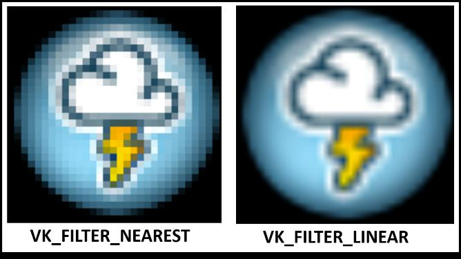
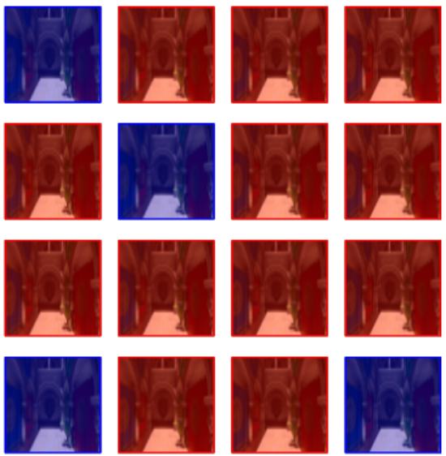
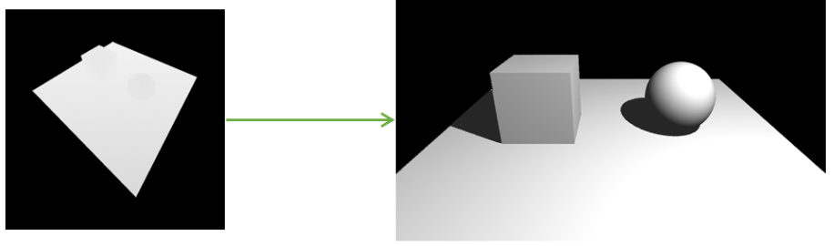
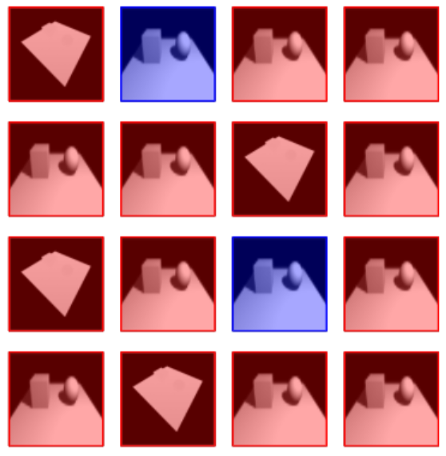
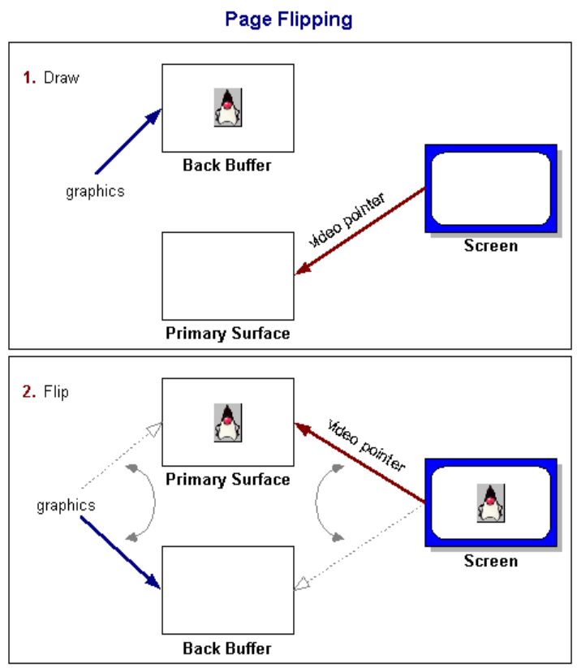
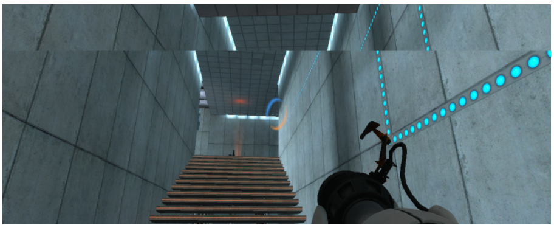
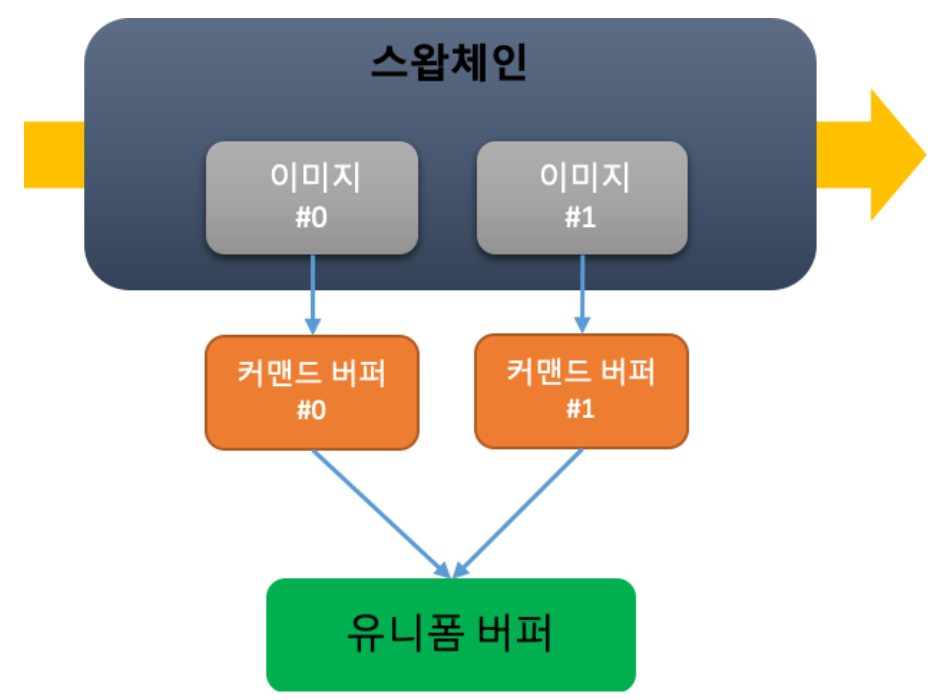
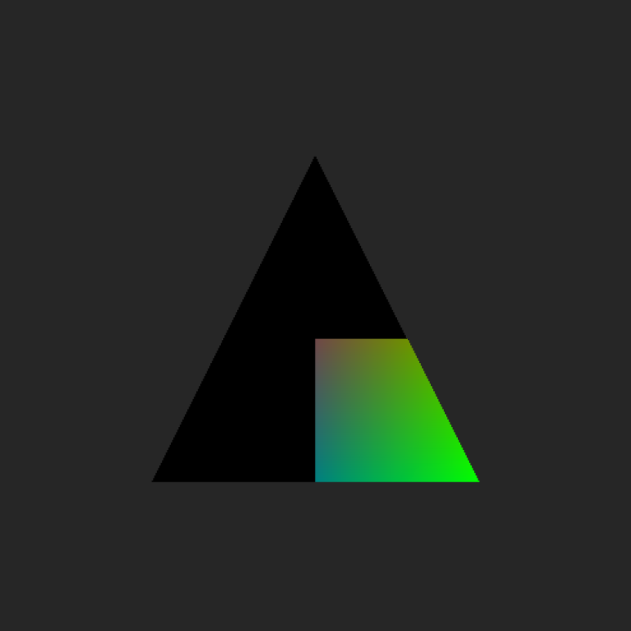
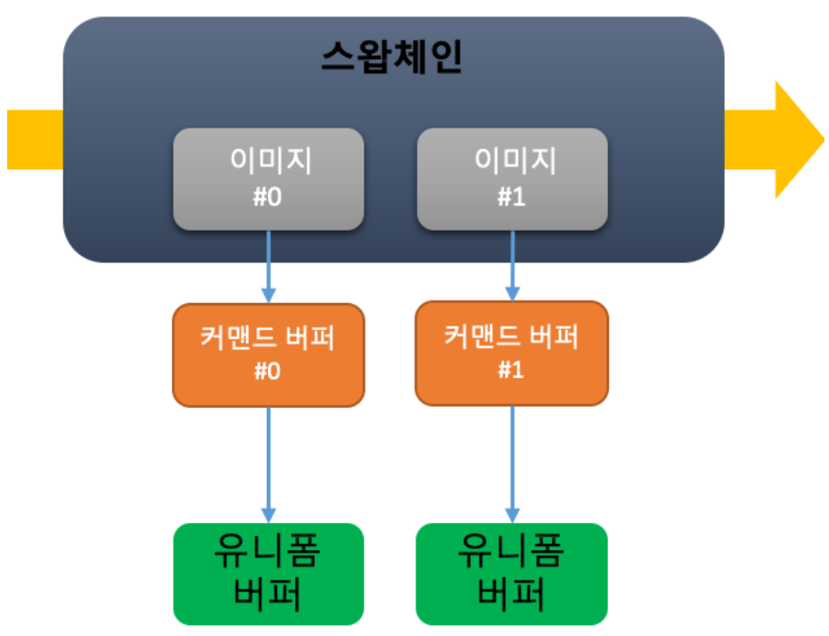

# 목차
#### 벌칸 텍스처
#### 벌칸 파이프라인 베리어
#### 벌칸 버퍼링(스왑체인)

---

# 벌칸 텍스처
```c++
// 텍스쳐 생성
unsigned int texture;
glGenTextures(1, &texture);

// 텍스쳐의 데이터 정의
glBindTexture(GL_TEXTURE_2D, texture);
glTexImage2D(GL_TEXTURE_2D, 0, GL_RGBA, width, height, 0, GL_RGBA, GL_UNSIGNED_BYTE, data);

// 텍스처의 데이터가 어떻게 샘플링될지 정의
glTexParameteri(GL_TEXTURE_2D, GL_TEXTURE_WRAP_S, GL_REPEAT);
glTexParameteri(GL_TEXTURE_2D, GL_TEXTURE_WRAP_T, GL_REPEAT);
glTexParameteri(GL_TEXTURE_2D, GL_TEXTURE_MIN_FILTER, GL_LINEAR);
```
 - openGL 은 텍스쳐가 기본 리소스로 지원
 - 벌칸에서는 더 이상 텍스쳐라는 리소스를 지원하지 않는다.
 - 단점으로 다른 형태의 텍스쳐 필요시 동일한 이미지로 두 개의 텍스쳐를 생성
 - 대신 이미지와 컴바인드 이미지 샘플러라는 리소스를 지원
 - 필요에 따라서 동일 이미지의 다른 포맷의 샘플러 사용시 같은 이미지를 두고 두 개의 컴바인드 이미지 샘플러를 생성해서 사용

벌칸에서 샘플러를 사용하기 위해선 다음의 과정을 거친다
1. 이미지 로드(생략)
2. vkImage 생성
3. vkImageView 생성
4. vkSampler 생성
5. 셰이더에서 샘플러를 사용하기 위해 설정 변경
   1. 셰이더 변경
   2. 파이프라인
   3. 버텍스 버퍼 어트리뷰트
   4. 디스크립터 레이아웃
   5. 디스크립터 셋

---

## vkImage
 이미지의 생성 과정은 다음과 같다.
1. create info 객체를 이용해 이미지 생성
2. 이미지 메모리 할당, 바인딩
3. 스테이징 버퍼를 이용해 메모리 복사

### create info 를 이용해 이미지 생성

 이미지를 CPU 메모리에 올리는 데 까지 성공했다는 가정하에 진행한다,
``` c++
typedef struct VkImageCreateInfo {
   VkStructureType          sType;
   const void*              pNext;
   VkImageCreateFlags       flags;
   VkImageType              imageType;
   VkFormat                 format;
   VkExtent3D               extent;
   uint32_t                 mipLevels;
   uint32_t                 arrayLayers;
   VkSampleCountFlagBits    samples;
   VkImageTiling            tiling;
   VkImageUsageFlags        usage;
   VkSharingMode            sharingMode;
   uint32_t                 queueFamilyIndexCount;
   const uint32_t*          pQueueFamilyIndices;
   VkImageLayout            initialLayout;
} VkImageCreateInfo;

```
 vkImage 는 복잡한 구조체다. 이를 다 설명하기에는 지금 사용하는 옵션이 많지 않으니 필요한 부분만 살피고 넘어가겠다.

#### vkImageType

```c++
typedef enum VkImageType {
    VK_IMAGE_TYPE_1D = 0,
    VK_IMAGE_TYPE_2D = 1,
    VK_IMAGE_TYPE_3D = 2,
    VK_IMAGE_TYPE_MAX_ENUM = 0x7FFFFFFF
} VkImageType;
```
 - 이미지 차원에 대해 정의
 - 일반적으로 사용하는 텍스쳐는 `VK_IMAGE_TYPE_2D` 에 해당
 - 큐브맵, 2D 이미지 어레이, 3D 텍스처 는 `VK_IMAGE_TYPE_3D` 에 해당

#### vkFormat

```c++
typedef enum VkFormat {
    VK_FORMAT_UNDEFINED = 0,
    // ...
    VK_FORMAT_R8G8B8A8_UNORM = 37,
    VK_FORMAT_R8G8B8A8_SNORM = 38,
    // ...
    VK_FORMAT_R32G32_UINT = 101,
    VK_FORMAT_R32G32_SINT = 102,
    VK_FORMAT_R32G32_SFLOAT = 103,
    VK_FORMAT_R32G32B32_UINT = 104,
    VK_FORMAT_R32G32B32_SINT = 105,
    VK_FORMAT_R32G32B32_SFLOAT = 106,
    VK_FORMAT_R32G32B32A32_UINT = 107,
    VK_FORMAT_R32G32B32A32_SINT = 108,
    VK_FORMAT_R32G32B32A32_SFLOAT = 109,
    // ...
} VkFormat;
```
 - `VK_FORMAT` 뒤에 있는 두 개의 필드로 형태를 유추
 - 앞에 있는 필드는 RGBA 채널과 각 채널의 비트 수
 - 뒤에 있는 필드는 데이터 포맷
 - `VK_FORMAT_R8G8B8A8_UNORM` 는 RGBA 4개의 채널이 8비트를 사용, Unsigned Normalize Format 값을 저장
 - 8비트 이기 때문에 0~255 값을 저장하지만, UNORM 은 0.0~1.1 로 normalize 한 값을 사용

#### vkImageTiling

```c++
typedef enum VkImageTiling {
    VK_IMAGE_TILING_OPTIMAL = 0,
    VK_IMAGE_TILING_LINEAR = 1,
    VK_IMAGE_TILING_DRM_FORMAT_MODIFIER_EXT = 1000158000,
    VK_IMAGE_TILING_MAX_ENUM = 0x7FFFFFFF
} VkImageTiling;
```


 - 여기선 optimal, linear 에 대해서만 설명
 - linaer 같은 경우 가독성이 좋은 형태, 일반적인 column-major (혹은 row-major) 형태
 - optimal 같은 경우 GPU 에서 더 빠르게 읽을 수 있는 형태
 - optimal 에서는 같은 블록으로 묶인 compute unit 끼리 캐시 히트를 높이도록 메모리가 저장되지 않았을까 추측
 - 화면에 출력해야 하는 이미지의 경우 비디오 인코더가 읽을 수 있는 메모리 형태를 띄어야 한다
 - optimal 인 이미지 이더라도 화면에 출력해야 한다면 linear 형태로 바꿔서 비디오 인코더가 읽을 수 있도록 해야 한다
 - 때문에 optimal 이라고 항상 성능이 좋은 형태는 아니다

#### vkImageUsageFlagBits

```c++
typedef enum VkImageUsageFlagBits {
    VK_IMAGE_USAGE_TRANSFER_SRC_BIT = 0x00000001,
    VK_IMAGE_USAGE_TRANSFER_DST_BIT = 0x00000002,
    VK_IMAGE_USAGE_SAMPLED_BIT = 0x00000004,
    VK_IMAGE_USAGE_STORAGE_BIT = 0x00000008,
    VK_IMAGE_USAGE_COLOR_ATTACHMENT_BIT = 0x00000010,
    VK_IMAGE_USAGE_DEPTH_STENCIL_ATTACHMENT_BIT = 0x00000020,
    VK_IMAGE_USAGE_TRANSIENT_ATTACHMENT_BIT = 0x00000040,
    VK_IMAGE_USAGE_INPUT_ATTACHMENT_BIT = 0x00000080,
    VK_IMAGE_USAGE_SHADING_RATE_IMAGE_BIT_NV = 0x00000100,
    VK_IMAGE_USAGE_FRAGMENT_DENSITY_MAP_BIT_EXT = 0x00000200,
    VK_IMAGE_USAGE_FLAG_BITS_MAX_ENUM = 0x7FFFFFFF
} VkImageUsageFlagBits;
```

 - 이미지가 어떻게 쓰일지 정의
 - 복사를 위해선 `VK_IMAGE_USAGE_TRANSFER_DST_BIT`
 - 셰이더에서 읽히기 위해선 `VK_IMAGE_USAGE_SAMPLED_BIT`
 - 프레임버퍼로 사용하기 위해선 `VK_IMAGE_USAGE_COLOR_ATTACHMENT_BIT` or `VK_IMAGE_USAGE_DEPTH_STENCIL_ATTACHMENT_BIT`

#### vkCreateImage

```c++
VkResult vkCreateImage(
    VkDevice                                    device,
    const VkImageCreateInfo*                    pCreateInfo,
    const VkAllocationCallbacks*                pAllocator,
    VkImage*                                    pImage);

VkImageCreateInfo create_info {};

create_info.sType = VK_STRUCTURE_TYPE_IMAGE_CREATE_INFO;
create_info.imageType = VK_IMAGE_TYPE_2D;
create_info.format = VK_FORMAT_R8G8B8A8_UNORM;
create_info.extent = {static_cast<uint32_t>(w), static_cast<uint32_t>(h), 1};
create_info.mipLevels = 1;
create_info.arrayLayers = 1;
create_info.samples = VK_SAMPLE_COUNT_1_BIT;
// 쉐이더에서만 사용하기 때문에 optimal
create_info.tiling = VK_IMAGE_TILING_OPTIMAL;
// 스테이징 버퍼에서 메모리 복사하기 위해 transfer_dst_bit, 쉐이더에서 사용하기 위한 sampled_bit
create_info.usage = VK_IMAGE_USAGE_TRANSFER_DST_BIT | VK_IMAGE_USAGE_SAMPLED_BIT;
// 다른 큐에서 사용하지 않을거기 때문에 exclusive
create_info.sharingMode = VK_SHARING_MODE_EXCLUSIVE;
// 초기 레이아웃은 undefined 로 설정
create_info.initialLayout = VK_IMAGE_LAYOUT_UNDEFINED;

auto result = vkCreateImage(device_, &create_info, nullptr, &texture_image_);
```
 - 사용할 이미지 타입은 일반적인 `VK_IMAGE_TYPE_2D`
 - 밉맵 정보와 레이어 정보는 1로 설정하여 별 다른 옵션을 주지 않는다.
 - 해당 이미지는 디바이스에서 sampler 용도로 사용하기 때문에 tiling 은 `VK_IMAGE_TILING_OPTIMAL`
 - 스테이징 버퍼로 메모리 복사가 필요하고, sampler 용도로 사용하기 때문에 usage 에는 `VK_IMAGE_USAGE_TRANSFER_DST_BIT | VK_IMAGE_USAGE_SAMPLED_BIT`

이미지 생성에 필요한 정보들을 설정했다면 위와 같이 `vkCreateImage` 를 호출해 이미지를 생성할 수 있다.

### 이미지 메모리 할당, 바인딩

```c++
uint32_t find_memory_type_index(const VkMemoryRequirements& requirements,
 VkMemoryPropertyFlags properties) 
{ 
	// 메모리 요구사항과 필요한 메모리 성질을 모두 만족하는 메모리 타입 인덱스를 찾습니다. 
	for (auto i = 0; i != physical_device_memory_properties_.memoryTypeCount; ++i) { 
		// 메모리가 i번째 메모리 타입에 할당 가능한지 검사합니다. 
		if (!(requirements.memoryTypeBits & (1 << i))) continue; 
		// 개발자가 요구한 메모리 성질을 만족하는지 검사합니다. 
		if ((physical_device_memory_properties_.memoryTypes[i].propertyFlags & 
			properties) != properties)
			 continue; 
		return i; 
	} 
	assert(false); 
	return UINT32_MAX; 
}

VkMemoryRequirements requirements;
// 필요한 이미지 메모리크기를 얻어온다.
vkGetImageMemoryRequirements(device_, texture_image_, &requirements);

VkMemoryAllocateInfo alloc_info {};

alloc_info.sType = VK_STRUCTURE_TYPE_MEMORY_ALLOCATE_INFO;
alloc_info.allocationSize = requirements.size;
// 디바이스에서만 접근 가능한 메모리 타입을 찾아서 index 설정
alloc_info.memoryTypeIndex = find_memory_type_index(requirements, VK_MEMORY_PROPERTY_DEVICE_LOCAL_BIT);

result = vkAllocateMemory(device_, &alloc_info, nullptr, &texture_device_memory_);

// 차례로 Vkdevice, VkImage, VkDeviceMemory, VkDeviceSize(memoryOffset)
result = vkBindImageMemory(device_, texture_image_, texture_device_memory_, 0);
```

이미지를 생성했다면 이미지 데이터를 저장할 메모리를 할당하고, 생성한 이미지에 바인딩해야한다. 위 코드는 그 과정을 나타낸다.

 - `vkGetImageMemoryRequirements` 를 이용해 얼마만큼의 메모리가 할당되어야 하는지 알 수 있다.
 - 이후 알아낸 메모리 크기와, 메모리 타입 인덱스를 설정해 이미지 메모리를 할당할 수 있다.
 - 이미지는 보통 한 번 생성하면 데이터를 변경하지 않고 GPU 에서만 사용하기 때문에 메모리 속성으로 `VK_MEMORY_PROPERTY_DEVICE_LOCAL_BIT` 있는 메모리 타입 사용
 - 할당한 메모리는 `vkBindImageMememory` 를 호출해 이미지에 바인딩

### 스테이징 버퍼를 이용해 메모리 복사

#### 스테이징 버퍼 생성, 버퍼로 메모리 복사
```c++
VkBufferCreateInfo create_info {};

create_info.sType = VK_STRUCTURE_TYPE_BUFFER_CREATE_INFO;
// 해당 이미지의 크기 만큼 size 설정
create_info.size = w * h * STBI_rgb_alpha;
// 이미지로 복사하기 위한 스테이징 버퍼로 transfer_src_bit 설정
create_info.usage = VK_BUFFER_USAGE_TRANSFER_SRC_BIT;

auto result = vkCreateBuffer(device_, &create_info, nullptr, &staging_buffer);

VkMemoryRequirements requirements;
// 스테이징 버퍼 메모리 할당시 얼마나 필요한지 확인
vkGetBufferMemoryRequirements(device_, staging_buffer, &requirements);

VkMemoryAllocateInfo alloc_info {};

alloc_info.sType = VK_STRUCTURE_TYPE_MEMORY_ALLOCATE_INFO;
alloc_info.allocationSize = requirements.size;
// CPU 에서 접근 가능하고 GPU 에 메모리 전송을 위해 CPU 와 메모리 동기화가 필요하기에
// host_visible_bit, host_coherent_bit 설정
alloc_info.memoryTypeIndex = find_memory_type_index(requirements, VK_MEMORY_PROPERTY_HOST_VISIBLE_BIT
                                                                | VK_MEMORY_PROPERTY_HOST_COHERENT_BIT);

result = vkAllocateMemory(device_, &alloc_info, nullptr, &staging_device_memory);
// 스테이징 버퍼에 메모리 바인딩
result = vkBindBufferMemory(device_, staging_buffer, staging_device_memory, 0);

void* contents;
// CPU 에서 접근 가능한 가상 주소 매핑
result = vkMapMemory(device_, staging_device_memory, 0, w * h * STBI_rgb_alpha, 0, &contents);

memcpy(contents, data, w * h * STBI_rgb_alpha);

vkUnmapMemory(device_, staging_device_memory);
```

 - 이미지를 cpu 에서 볼 수 없는 VRAM 에 할당했기 때문에 메모리 전달을 위해서 스테이징 버퍼가 필요하다.
 - cpu 메모리에 있는 이미지 메모리 크기에 맞춰 스테이징 버퍼를 생성한다.
 - 스테이징 버퍼를 생성했다면 cpu 와 gpu 모두 접근 할 수 있도록 설정하여 메모리를 할당하고 생성한 스테이징 버퍼에 바인딩한다.
 - 바인딩이 끝났다면 cpu 에서 접근 가능한 가상 주소로 매핑한 이후 데이터를 복사, 복사가 끝나면 매핑을 해제한다.

#### 스테이징 버퍼에서 이미지로 데이터 복사

 이미지로 데이터를 복사함에 있어서 다음과 같은 과정을 거쳐야한다.
1. 데이터 복사를 위해 이미지의 레이아웃 변경
2. 스테이징 버퍼에서 이미지 데이터로 복사
3. 복사 이후 shader 에서 읽을 수 있도록 이미지의 레이아웃 변경

##### VkImageLayout
```c++
typedef enum VkImageLayout {
    VK_IMAGE_LAYOUT_UNDEFINED = 0,
    VK_IMAGE_LAYOUT_GENERAL = 1,
    VK_IMAGE_LAYOUT_COLOR_ATTACHMENT_OPTIMAL = 2,
    VK_IMAGE_LAYOUT_DEPTH_STENCIL_ATTACHMENT_OPTIMAL = 3,
    VK_IMAGE_LAYOUT_DEPTH_STENCIL_READ_ONLY_OPTIMAL = 4,
    VK_IMAGE_LAYOUT_SHADER_READ_ONLY_OPTIMAL = 5,
    VK_IMAGE_LAYOUT_TRANSFER_SRC_OPTIMAL = 6,
    VK_IMAGE_LAYOUT_TRANSFER_DST_OPTIMAL = 7,
    VK_IMAGE_LAYOUT_PREINITIALIZED = 8,
    VK_IMAGE_LAYOUT_DEPTH_READ_ONLY_STENCIL_ATTACHMENT_OPTIMAL = 1000117000,
    VK_IMAGE_LAYOUT_DEPTH_ATTACHMENT_STENCIL_READ_ONLY_OPTIMAL = 1000117001,
    VK_IMAGE_LAYOUT_DEPTH_ATTACHMENT_OPTIMAL = 1000241000,
    VK_IMAGE_LAYOUT_DEPTH_READ_ONLY_OPTIMAL = 1000241001,
    VK_IMAGE_LAYOUT_STENCIL_ATTACHMENT_OPTIMAL = 1000241002,
    VK_IMAGE_LAYOUT_STENCIL_READ_ONLY_OPTIMAL = 1000241003,
    VK_IMAGE_LAYOUT_PRESENT_SRC_KHR = 1000001002,
    VK_IMAGE_LAYOUT_SHARED_PRESENT_KHR = 1000111000,
    VK_IMAGE_LAYOUT_SHADING_RATE_OPTIMAL_NV = 1000164003,
    VK_IMAGE_LAYOUT_FRAGMENT_DENSITY_MAP_OPTIMAL_EXT = 1000218000,
    // ...
} VkImageLayout;
```


 - 이미지를 사용하는 목적에 따라 각각의 레이아웃이 존재, 다른 목적으로 사용하면 원하는 결과를 얻을 수 없다.
 - 목적에 맞는 레이아웃을 사용한다면 좋은 성능을 낼 수 있고, 레이아웃의 구현은 벤더마다 다르다.
   - 예를들어 AMD에서 `VK_IMAGE_LAYOUT_COLOR_ATTACHMENT_OPTIMAL` 레이아웃은 DCC(Delta Color Compress)를 사용한다.
   - GPU 병목의 가장 큰 영향은 연산이 아닌 메모리 로딩
   - 이 기술은 메모리 대역폭을 줄이기 위한 기술, 모든 데이터를 통신하는것이 아니라 색상의 차이만 갖고 통신(메모리 대역폭 축소)
   - 이런 이유로 해당 레이아웃을 갖고 있는 이미지를 다른 목적으로 사용할 수 없다.

```c++
VkImageMemoryBarrier barrier {};

barrier.sType = VK_STRUCTURE_TYPE_IMAGE_MEMORY_BARRIER;
barrier.oldLayout = VK_IMAGE_LAYOUT_UNDEFINED;
barrier.newLayout = VK_IMAGE_LAYOUT_TRANSFER_DST_OPTIMAL;
barrier.srcQueueFamilyIndex = queue_family_index_;
barrier.dstQueueFamilyIndex = queue_family_index_;
barrier.image = texture_image_;
barrier.subresourceRange.aspectMask = VK_IMAGE_ASPECT_COLOR_BIT;
barrier.subresourceRange.levelCount = 1;
barrier.subresourceRange.layerCount = 1;

vkCmdPipelineBarrier(command_buffer,
                     VK_PIPELINE_STAGE_TOP_OF_PIPE_BIT, VK_PIPELINE_STAGE_TRANSFER_BIT,
                     0,
                     0, nullptr,
                     0, nullptr,
                     1, &barrier);
```

 - 이미지의 레이아웃을 변경하려면 레이아웃 변경되기 전까지 다른 접근을 막기 위해 이미지 베리어를 설정
 - 데이터 복사를 위해 이미지 레이아웃을 `VK_IMAGE_LAYOUT_TRANSFER_DST_OPTIMAL`
 - 이미지는 별 다른 레벨이나 레이어를 설정하지 않았기 때문에 1로 세팅
 - 베리어 설정이 끝났다면 커맨드를 통해 제출

```c++
typedef struct VkBufferImageCopy {
    VkDeviceSize                bufferOffset;           // 버퍼에서 복사를 시작할 offset
    uint32_t                    bufferRowLength;        // 버퍼의 각 row 에 대한 정보
    uint32_t                    bufferImageHeight;      // 버퍼의 각 col 에 대한 정보
    VkImageSubresourceLayers    imageSubresource;       // 이미지 하위 리소스 정보, 레이어 및 face 설정
    VkOffset3D                  imageOffset;            // 대상 이미지에서 복사를 시작할 좌표
    VkExtent3D                  imageExtent;            // 복사할 이미지 영역 크기
} VkBufferImageCopy;

void vkCmdCopyBufferToImage(
    VkCommandBuffer                             commandBuffer,
    VkBuffer                                    srcBuffer,
    VkImage                                     dstImage,
    VkImageLayout                               dstImageLayout,
    uint32_t                                    regionCount,
    const VkBufferImageCopy*                    pRegions);

VkBufferImageCopy region {};

// region.bufferRowLength = w;
// region.bufferImageHeight = h;
region.imageSubresource.aspectMask = VK_IMAGE_ASPECT_COLOR_BIT;
// 밉맵, 레이어 사용하지 않기 때문에 0, 1 세팅
region.imageSubresource.mipLevel = 0;
region.imageSubresource.layerCount = 1;

region.imageExtent = {static_cast<uint32_t>(w), static_cast<uint32_t>(h), 1};

// 어느 영역에 메모리를 복사할지 지정 했다면 커맨드로 제출
vkCmdCopyBufferToImage(command_buffer,
                       staging_buffer,
                       texture_image_, VK_IMAGE_LAYOUT_TRANSFER_DST_OPTIMAL,
                       1, &region);
```

 - 버퍼의 내용을 이미지에 복사하기 위해서는 버퍼를 어떻게 이미지로 복사할지 알아야 한다.
 - 이를 설정하기 위해 `VkBufferImageCopy` 를 이용해 이미지의 복사 영역을 설정
 - 버퍼가 이미지의 복사 영역의 크기와 동일한 크기를 갖고 있다면 buffer 에 대한 정보를 입력하지 않아도 된다.

```c++
VkImageMemoryBarrier barrier {};

barrier.sType = VK_STRUCTURE_TYPE_IMAGE_MEMORY_BARRIER;
barrier.oldLayout = VK_IMAGE_LAYOUT_TRANSFER_DST_OPTIMAL;
barrier.newLayout = VK_IMAGE_LAYOUT_SHADER_READ_ONLY_OPTIMAL;
barrier.srcQueueFamilyIndex = queue_family_index_;
barrier.dstQueueFamilyIndex = queue_family_index_;
barrier.image = texture_image_;
barrier.subresourceRange.aspectMask = VK_IMAGE_ASPECT_COLOR_BIT;
barrier.subresourceRange.levelCount = 1;
barrier.subresourceRange.layerCount = 1;

vkCmdPipelineBarrier(command_buffer,
                     VK_PIPELINE_STAGE_TRANSFER_BIT, VK_PIPELINE_STAGE_BOTTOM_OF_PIPE_BIT,
                     0,
                     0, nullptr,
                     0, nullptr,
                     1, &barrier);
// 커맨드 버퍼에 커맨드 기록을 끝마칩니다.
vkEndCommandBuffer(command_buffer);

// 어떤 기록된 커맨드를 큐에 제출할지 정의합니다.
VkSubmitInfo submit_info {};

submit_info.sType = VK_STRUCTURE_TYPE_SUBMIT_INFO;
submit_info.commandBufferCount = 1;
submit_info.pCommandBuffers = &command_buffer;

// 기록된 커맨드를 큐에 제출합니다.
vkQueueSubmit(queue_, 1, &submit_info, VK_NULL_HANDLE);

// 커맨드 버퍼들이 모두 처리될 때까지 기다립니다.
vkDeviceWaitIdle(device_);

// 커맨드 버퍼를 해제합니다.
vkFreeCommandBuffers(device_, command_pool_, 1, &command_buffer);

// 할당된 메모리를 해제합니다.
vkFreeMemory(device_, staging_device_memory, nullptr);

// 생성된 버퍼를 파괴합니다.
vkDestroyBuffer(device_, staging_buffer, nullptr);
```

 - 이미지 메모리 복사를 위한 커맨드를 제출했다면 쉐이더에서 사용하기 위해 이미지 레이아웃을 변경한다.
 - 레이아웃 변경을 할 때 이미지의 접근을 제한하기위해 베리어 설정

## vkImageView

 이미지는 이미지 자체로 읽힐 수 없고 `VkImageView` 가 필요하다. 이미지는 여러가지 설정이 있고 복잡하기 때문에 이미지 뷰가 필요하다.
 - 이미지 리소스 접근 : 이미지 특정 픽셀에 대한 읽기 및 쓰기 작업 수행
 - 이미지 서브 리소스 선택 : 2D 이미지는 밉맵정보, 레벨 정보, 레이어 정보등 여러개의 서브 리소스로 구성될 수 있다. 이미지 뷰는 사용자가 원하는 서브 리소스를 선택하여 작업할 수 있도록 한다.
 - 특정 영역 이미지 레이아웃 변경 : 특정 영역만을 지정하여 이미지 레아이웃을 변경할 수 있다.

```c++
typedef struct VkImageViewCreateInfo {
    VkStructureType            sType;
    const void*                pNext;
    VkImageViewCreateFlags     flags;
    VkImage                    image;
    VkImageViewType            viewType;
    VkFormat                   format;
    VkComponentMapping         components;
    VkImageSubresourceRange    subresourceRange;
} VkImageViewCreateInfo;

typedef struct VkImageSubresourceRange {
    VkImageAspectFlags    aspectMask;
    uint32_t              baseMipLevel;
    uint32_t              levelCount;
    uint32_t              baseArrayLayer;
    uint32_t              layerCount;
} VkImageSubresourceRange;

VkImageViewCreateInfo create_info {};

// 현재 단계에서는 별도의 서브 리소스를 설정하여 사용하거나 하지 않기 때문에 기본 세팅을 하여 이미지뷰를 생성
create_info.sType = VK_STRUCTURE_TYPE_IMAGE_VIEW_CREATE_INFO;
create_info.image = texture_image_;
create_info.viewType = VK_IMAGE_VIEW_TYPE_2D;
create_info.format = VK_FORMAT_R8G8B8A8_UNORM;
create_info.subresourceRange.aspectMask = VK_IMAGE_ASPECT_COLOR_BIT;
create_info.subresourceRange.levelCount = 1;
create_info.subresourceRange.layerCount = 1;

VkResult vkCreateImageView(
    VkDevice                                    device,
    const VkImageViewCreateInfo*                pCreateInfo,
    const VkAllocationCallbacks*                pAllocator,
    VkImageView*                                pView);

auto result = vkCreateImageView(device_, &create_info, nullptr, &texture_image_view_);
```
## vkSampler

 이미지를 생성하고 이미지 뷰를 생성했다면 쉐이더에서 해당 이미지를 어떻게 참조할 지 설정할 수 있다. `VkSampler` 는 같은 이미지를 사용하더라도 어떤 방식으로 이미지 정보를 불러 올 지 샘플러마다 다르게 설정하여 사용할 수 있다.

```c++
typedef struct VkSamplerCreateInfo {
    VkStructureType         sType;
    const void*             pNext;
    VkSamplerCreateFlags    flags;
    VkFilter                magFilter;                  // filter 정보
    VkFilter                minFilter;
    VkSamplerMipmapMode     mipmapMode;                 // 밉맵 정보
    VkSamplerAddressMode    addressModeU;               // border 에서 어떻게 보일지
    VkSamplerAddressMode    addressModeV;
    VkSamplerAddressMode    addressModeW;
    float                   mipLodBias;
    VkBool32                anisotropyEnable;
    float                   maxAnisotropy;
    VkBool32                compareEnable;
    VkCompareOp             compareOp;
    float                   minLod;
    float                   maxLod;
    VkBorderColor           borderColor;                // border 에서 어떤 색을 사용할지
    VkBool32                unnormalizedCoordinates;
} VkSamplerCreateInfo;

typedef enum VkFilter {
    VK_FILTER_NEAREST = 0,
    VK_FILTER_LINEAR = 1,
    VK_FILTER_CUBIC_IMG = 1000015000,
    VK_FILTER_CUBIC_EXT = VK_FILTER_CUBIC_IMG,
    VK_FILTER_MAX_ENUM = 0x7FFFFFFF
} VkFilter;

typedef enum VkSamplerAddressMode {
    VK_SAMPLER_ADDRESS_MODE_REPEAT = 0,
    VK_SAMPLER_ADDRESS_MODE_MIRRORED_REPEAT = 1,
    VK_SAMPLER_ADDRESS_MODE_CLAMP_TO_EDGE = 2,
    VK_SAMPLER_ADDRESS_MODE_CLAMP_TO_BORDER = 3,
    VK_SAMPLER_ADDRESS_MODE_MIRROR_CLAMP_TO_EDGE = 4,
    VK_SAMPLER_ADDRESS_MODE_MIRROR_CLAMP_TO_EDGE_KHR = VK_SAMPLER_ADDRESS_MODE_MIRROR_CLAMP_TO_EDGE,
    VK_SAMPLER_ADDRESS_MODE_MAX_ENUM = 0x7FFFFFFF
} VkSamplerAddressMode;
```




```c++
VkResult vkCreateSampler(
    VkDevice                                    device,
    const VkSamplerCreateInfo*                  pCreateInfo,
    const VkAllocationCallbacks*                pAllocator,
    VkSampler*                                  pSampler);

VkSamplerCreateInfo create_info {};

create_info.sType = VK_STRUCTURE_TYPE_SAMPLER_CREATE_INFO;
// filtering 정보 설정
create_info.magFilter = VK_FILTER_LINEAR;
create_info.minFilter = VK_FILTER_LINEAR;
// address mode 설정
create_info.addressModeU = VK_SAMPLER_ADDRESS_MODE_CLAMP_TO_EDGE;
create_info.addressModeV = VK_SAMPLER_ADDRESS_MODE_CLAMP_TO_EDGE;

auto result = vkCreateSampler(device_, &create_info, nullptr, &texture_sampler_);
```

## 샘플러 사용을 위한 설정 변경

### 셰이더 코드 변경

```c++
// vertex shader
layout(location = 1) in vec3 i_col;
// texture mapping 을 위한 uv 맵 정보 (vertex attribute) 추가
layout(location = 2) in vec2 i_uv;

layout(location = 0) out vec3 o_col;
// fragment shader 에서 샘플러의 픽셀 정보를 갖고 오기 위해 uv 정보 전달
layout(location = 1) out vec2 o_uv;

void main() {
    // ...
    o_col = i_col;
    o_uv = i_uv;
}

// fragment shader
layout(location = 0) in vec3 i_col;
// fragment shader 에서 샘플러의 픽셀 정보를 갖고 오기 위해 uv 정보 전달
layout(location = 1) in vec2 i_uv;

// 샘플러를 쉐이더에서 사용하기 위해 set, binding, unform 변수 설정
layout(set = 1, binding = 0) uniform sampler2D tex;

void main() {
    vec3 col = i_col;
    col *= material.col;
    col *= texture(tex, i_uv).rgb;

    fragment_color0 = vec4(col, 1.0);
}
```

### vertex attribute 정보 변경

 텍스쳐 좌표계를 읽고 샘플러를 통해 이미지를 읽도록 셰이더를 수정했기 때문에 버텍스 버퍼를 수정해야 한다. 앞서 position, color 값에 샘플러를 통해 이미지를 읽기 위해 필요한 uv 정보도 들어가야 한다.

```c++
struct Vertex {
    float x, y;
    float r, g, b;
    float u, v;         // 추가된 uv 정보
};
vector<Vertex> vertices = {
    {-0.5,  0.5, 1.0, 0.3, 0.3, 0.0, 1.0},
    { 0.5,  0.5, 0.3, 1.0, 0.3, 1.0, 1.0},
    { 0.0, -0.5, 0.3, 0.3, 1.0, 0.5, 0.0}
};
```

CPU 에서 필요한 버텍스 정보들을 설정했다면 버텍스 어트리뷰트 정보를 정의해야한다.

```c++
VkVertexInputAttributeDescription vertex_input_attribute {};

// uv 맵 바인딩 위치는 2
vertex_input_attribute.location = 2;
vertex_input_attribute.binding = 0;
vertex_input_attribute.format = VK_FORMAT_R32G32_SFLOAT;
// uv map 시작 offset 위치 설정
vertex_input_attribute.offset = offsetof(Vertex, u);

vertex_input_attributes.push_back(vertex_input_attribute);
```

#### 샘플러용 디스크립터 셋 레이아웃 생성

```c++
VkDescriptorSetLayoutBinding binding {};

// location 0 에 바인딩
binding.binding = 0;
// 컴바인드 이미지 샘플러 사용
binding.descriptorType = VK_DESCRIPTOR_TYPE_COMBINED_IMAGE_SAMPLER;
// 디스크립터 개수
binding.descriptorCount = 1;
// fragment shader 에서 사용
binding.stageFlags = VK_SHADER_STAGE_FRAGMENT_BIT;

VkDescriptorSetLayoutCreateInfo create_info {};

// descriptor set 생성
create_info.sType = VK_STRUCTURE_TYPE_DESCRIPTOR_SET_LAYOUT_CREATE_INFO;
create_info.bindingCount = 1;
create_info.pBindings = &binding;

auto result = vkCreateDescriptorSetLayout(device_, &create_info, nullptr, &texture_descriptor_set_layout_);
```

 - 샘플러 이미지를 읽기 위한 descriptor set layout 생성
 - 벌칸은 텍스쳐가 존재 하지 않고 이미지와 샘플러가 독립적으로 존재
   - 1:N, N:1 의 관계가 가능
   - 1:N 의 경우 이미지 배열, 큐브맵 과 같이 여러개의 이미지가 단일 개체로 구성된 경우 동일한 샘플링을 이용해 읽을 수 있다.
 - 때문에 OpenGL 처럼 샘플러와 이미지를 묶는 개념이 COMBINED_IMAGE_SAMPLER

#### 셰이더에 맞춰 파이프라인 재정의

```c++
vector<VkDescriptorSetLayout> set_layouts {
    material_descriptor_set_layout_,
    texture_descriptor_set_layout_          // sampler 사용을 위한 descriptor set layout
};

VkPipelineLayoutCreateInfo create_info {};

// material set layout 과 sampler 용 set layout 설정
create_info.sType = VK_STRUCTURE_TYPE_PIPELINE_LAYOUT_CREATE_INFO;
create_info.setLayoutCount = set_layouts.size();
create_info.pSetLayouts = &set_layouts[0];

auto result = vkCreatePipelineLayout(device_, &create_info, nullptr, &pipeline_layout_);

//sampler 사용을 위한 descriptor pool size 재정의
vector<VkDescriptorPoolSize> pool_size {
    {VK_DESCRIPTOR_TYPE_UNIFORM_BUFFER, 1},
    {VK_DESCRIPTOR_TYPE_COMBINED_IMAGE_SAMPLER, 1}
};

// 재 정의한 size 를 이용해 deescriptor pool 생성
VkDescriptorPoolCreateInfo create_info {};

create_info.sType = VK_STRUCTURE_TYPE_DESCRIPTOR_POOL_CREATE_INFO;
create_info.maxSets = 2;
create_info.poolSizeCount = pool_size.size();
create_info.pPoolSizes = &pool_size[0];

auto result = vkCreateDescriptorPool(device_, &create_info, nullptr, &descriptor_pool_);

...

VkDescriptorSetAllocateInfo allocate_info {};
// descriptor pool 로 부터 texture descriptor set 할당
allocate_info.sType = VK_STRUCTURE_TYPE_DESCRIPTOR_SET_ALLOCATE_INFO;
allocate_info.descriptorPool = descriptor_pool_;
allocate_info.descriptorSetCount = 1;
allocate_info.pSetLayouts = &texture_descriptor_set_layout_;

auto result = vkAllocateDescriptorSets(device_, &allocate_info, &texture_descriptor_set_);

VkDescriptorImageInfo image_info {};

// 샘플러와 이미지 뷰 설정
image_info.sampler = texture_sampler_;
image_info.imageView = texture_image_view_;
// 사용하고자 이미지의 레이아웃은 fragment shader 에서만 사용하기 때문에 shader read only optimal
image_info.imageLayout = VK_IMAGE_LAYOUT_SHADER_READ_ONLY_OPTIMAL;

VkWriteDescriptorSet descriptor_write {};

descriptor_write.sType = VK_STRUCTURE_TYPE_WRITE_DESCRIPTOR_SET;
descriptor_write.dstSet = texture_descriptor_set_;
descriptor_write.dstBinding = 0;
descriptor_write.descriptorCount = 1;
descriptor_write.descriptorType = VK_DESCRIPTOR_TYPE_COMBINED_IMAGE_SAMPLER;
descriptor_write.pImageInfo = &image_info;

vkUpdateDescriptorSets(device_, 1, &descriptor_write, 0, nullptr);
// 할당받은 descriptor set 과 이미지 바인딩
vkCmdBindDescriptorSets(command_buffer_,
                        VK_PIPELINE_BIND_POINT_GRAPHICS, pipeline_layout_,
                        1, 1, &texture_descriptor_set_,
                        0, nullptr);
```
[샘플 코드 링크](https://github.com/daemyung/ogl_to_vlk/blob/master/chapter13/main.cpp)

# 파이프라인 베리어

 - 벌칸 파이프라인 베리어는 스펙의 이해가 어렵고 벤더마다 구현 방식이 다르기에 어렵다
 - 벌칸은 사용자가 직접 베리어를 관리할 수 있도록 해서 최적화가 가능하다.
 - 하지만 제대로 사용하지 않으면 성능 하락의 원인이 될 수 있다.

## stage bits

```c++
typedef enum VkPipelineStageFlagBits {
    VK_PIPELINE_STAGE_TOP_OF_PIPE_BIT = 0x00000001,
    VK_PIPELINE_STAGE_DRAW_INDIRECT_BIT = 0x00000002,
    VK_PIPELINE_STAGE_VERTEX_INPUT_BIT = 0x00000004,
    VK_PIPELINE_STAGE_VERTEX_SHADER_BIT = 0x00000008,
    VK_PIPELINE_STAGE_TESSELLATION_CONTROL_SHADER_BIT = 0x00000010,
    VK_PIPELINE_STAGE_TESSELLATION_EVALUATION_SHADER_BIT = 0x00000020,
    VK_PIPELINE_STAGE_GEOMETRY_SHADER_BIT = 0x00000040,
    VK_PIPELINE_STAGE_FRAGMENT_SHADER_BIT = 0x00000080,
    VK_PIPELINE_STAGE_EARLY_FRAGMENT_TESTS_BIT = 0x00000100,
    VK_PIPELINE_STAGE_LATE_FRAGMENT_TESTS_BIT = 0x00000200,
    VK_PIPELINE_STAGE_COLOR_ATTACHMENT_OUTPUT_BIT = 0x00000400,
    VK_PIPELINE_STAGE_COMPUTE_SHADER_BIT = 0x00000800,
    VK_PIPELINE_STAGE_TRANSFER_BIT = 0x00001000,
    VK_PIPELINE_STAGE_BOTTOM_OF_PIPE_BIT = 0x00002000,
    VK_PIPELINE_STAGE_HOST_BIT = 0x00004000,
    VK_PIPELINE_STAGE_ALL_GRAPHICS_BIT = 0x00008000,
    VK_PIPELINE_STAGE_ALL_COMMANDS_BIT = 0x00010000,
    VK_PIPELINE_STAGE_TRANSFORM_FEEDBACK_BIT_EXT = 0x01000000,
    VK_PIPELINE_STAGE_CONDITIONAL_RENDERING_BIT_EXT = 0x00040000,
    VK_PIPELINE_STAGE_COMMAND_PROCESS_BIT_NVX = 0x00020000,
    VK_PIPELINE_STAGE_SHADING_RATE_IMAGE_BIT_NV = 0x00400000,
    VK_PIPELINE_STAGE_RAY_TRACING_SHADER_BIT_NV = 0x00200000,
    VK_PIPELINE_STAGE_ACCELERATION_STRUCTURE_BUILD_BIT_NV = 0x02000000,
    VK_PIPELINE_STAGE_TASK_SHADER_BIT_NV = 0x00080000,
    VK_PIPELINE_STAGE_MESH_SHADER_BIT_NV = 0x00100000,
    VK_PIPELINE_STAGE_FRAGMENT_DENSITY_PROCESS_BIT_EXT = 0x00800000,
    VK_PIPELINE_STAGE_FLAG_BITS_MAX_ENUM = 0x7FFFFFFF
} VkPipelineStageFlagBits;
```
 - 플래그 비트들은 모두 파이프라인 스테이지 이름
 - src 와 dst 에 스테이지 비트를 설정하면 의존성 생성



 - 이해를 돕기 위해 vertex shader 와 fragment shader 단계만 고려하자.
 - 1 pass 파이프라인 경우 여러 compute unit 에서 실행되더라도 문제 없음.
 - vertex shader 와 fragment shader 단계가 순차적으로 실행되기 때문

 

 - 그림자 생성을 위한 2 pass 파이프라인
 - 두 번째 패스 fragment shader 단계에서는 그림자 표현을 위한 그림자 뎁스맵이 필요
 - 그림자 뎁스 맵은 첫 번재 패스가 모두 끝나야 생성
 - GPU 는 병렬 처리에 특화 되었기 때문에 첫 번째 패스가 끝나기도 전에 두 번째 패스의 fragment shader 실행 가능
 - 이 경우에 잘못된 결과 나타남

  

 - 이를 막기 위해 첫 번째 패스의 최종 단계와 두 번째 패스의 fragment shader 단계의 의존성 필요
 - 베리어를 만들어 생성 가능

```c++
// 그림자 맵을 위한 첫 번째 렌더 패스 종료.
vkEndRenderPass();

vkCmdPipelineBarrier(command_buffer_,
                     VK_PIPELINE_STAGE_COLOR_ATTACHMENT_OUTPUT_BIT,
                     VK_PIPELINE_STAGE_FRAGMENT_SHADER_BIT,
                     ...);
// 그림자 맵핑을 위한 두 번째 렌더 패스 시작.
vkBeginRenderPass(...);
```

```c++
vkCmdPipelineBarrier(command_buffer_,
                     VK_PIPELINE_STAGE_COLOR_ATTACHMENT_OUTPUT_BIT,
                     VK_PIPELINE_STAGE_VERTEX_SHADER_BIT |
                     VK_PIPELINE_STAGE_FRAGMENT_SHADER_BIT,
                     /* ... */);
```

 - 그러나 파이프 라인 베리어를 잘못 생성한다면 성능 저하 가능
 - 과거 언리얼 엔진은 렌더 패스 최종 단계와 모든 셰이더와의 베리어 생성
 - 하지만 이전 패스에서 생성한 맵 정보는 다음 패스 fragment shader 에서 사용
 - 따라서 vertex shader bit 제거 해야함

 

 - 잘못된 베리어를 사용한 예와, 수정한 예
 - 필요하지 않은 곳에 베리어 사용사 성능 저하가 발생


# 벌칸의 버퍼링 (스왑체인)





- 보통 렌더링 파이프라인에서 여러개의 버퍼를 생성, 하나의 버퍼가 화면에 출력중이라면 다른 버퍼를 이용해 렌더링을 수행
- 이렇게 여분의 버퍼를 두어서 GPU 가 쉬지않고 렌더링을 할 수 있도록 만든다.
- 만일 하나의 버퍼만 사용한다면 티어링 문제 발생 가능
- 벌칸에서는 스왑체인 정의시 `minInageCount`를 통해 몇개의 버퍼링을 사용할지 정의
- 몇개의 버퍼링을 사용할지 정의했다면 그에 필요한 몇 개의 정보들도 개수에 맞게 생성해야 한다.
- 커맨드 버퍼, 유니폼 버퍼, 디스크립터 셋, 디스크립터 풀

## swapchain

```c++
// 버퍼링을 위한 스왑체인 이미지 개수를 정의합니다.
constexpr auto swapchain_image_count {2};

// 생성하려는 스왑체인을 정의합니다.
VkSwapchainCreateInfoKHR create_info {};

create_info.sType = VK_STRUCTURE_TYPE_SWAPCHAIN_CREATE_INFO_KHR;
create_info.surface = surface_;
create_info.minImageCount = swapchain_image_count;
create_info.imageFormat = surface_format.format;
create_info.imageColorSpace = surface_format.colorSpace;
create_info.imageExtent = swapchain_image_extent_;
create_info.imageArrayLayers = 1;
create_info.imageUsage = VK_IMAGE_USAGE_TRANSFER_DST_BIT | VK_IMAGE_USAGE_COLOR_ATTACHMENT_BIT;
create_info.imageSharingMode = VK_SHARING_MODE_EXCLUSIVE;
create_info.preTransform = surface_capabilities.currentTransform;
create_info.compositeAlpha = composite_alpha;
create_info.presentMode = VK_PRESENT_MODE_FIFO_KHR;
// 스왑체인 생성
auto result = vkCreateSwapchainKHR(device_, &create_info, nullptr, &swapchain_);
// 더 많은 이미지가 생성됐을 가능성이 있기에 생성된 이미지 개수 확인
uint32_t count;
vkGetSwapchainImagesKHR(device_, swapchain_, &count, nullptr);
// 해당 이미지 개수만큼 리사이즈
swapchain_images_.resize(count);
vkGetSwapchainImagesKHR(device_, swapchain_, &count, &swapchain_images_[0]);
```

 - 원하는 버퍼링 개수만큼 swapchain image 생성
 - 더 많이 생성 됐을 가능성이 있으니 생성된 이미지 개수 확인

## command buffer
 - 커맨드 버퍼가 버퍼링 개수 만큼 있지 않고 1개만 있다면
 - 버퍼링을 위해 커맨드 버퍼를 제출 하더라도 이전 커맨드가 아직 다 수행되지 않았을 가능성 존재
 - 따라서 버퍼링 개수만큼 커맨드 버퍼도 필요
 - 커맨드 버퍼의 개수가 늘어난 만큼 해당 커맨드 버퍼와 동기화를 해주는 펜스도 커맨드 버퍼만큼 필요
 - 커맨드 버퍼의 처리 확인
 - 마찬가지로 커맨드 버퍼 개수 만큼 세마포어도 필요
 - 스왑체인 이미지 시그널 확인용 (이미지가 준비 됐는지, 렌더가 완료 됐는지)
```c++
VkCommandBufferAllocateInfo allocate_info {};

allocate_info.sType = VK_STRUCTURE_TYPE_COMMAND_BUFFER_ALLOCATE_INFO;
allocate_info.commandPool = command_pool_;
allocate_info.level = VK_COMMAND_BUFFER_LEVEL_PRIMARY;
// 버퍼링을 위해서 스왑체인 이미지의 개수만큼 커맨드 버퍼를 생성합니다.
allocate_info.commandBufferCount = swapchain_image_count;

// 커맨드 버퍼를 생성합니다.
auto result = vkAllocateCommandBuffers(device_, &allocate_info, &command_buffers_[0]);
switch (result) {
    case VK_ERROR_OUT_OF_HOST_MEMORY:
        cout << "VK_ERROR_OUT_OF_HOST_MEMORY" << endl;
        break;
    case VK_ERROR_OUT_OF_DEVICE_MEMORY:
        cout << "VK_ERROR_OUT_OF_DEVICE_MEMORY" << endl;
        break;
    default:
        break;
}
assert(result == VK_SUCCESS);
// 생성하려는 펜스를 정의합니다.
VkFenceCreateInfo create_info {};

create_info.sType = VK_STRUCTURE_TYPE_FENCE_CREATE_INFO;
// 커맨드 버퍼가 모두 처리 되었는지를 알기 위해 사용된 펜스는 처음에 시그널 상태면 어플리케이션의 로직이 단순해집니다.
create_info.flags = VK_FENCE_CREATE_SIGNALED_BIT;

// 버퍼링을 위해서 스왑체인 이미지의 개수만큼 펜스를 생성합니다.
for (auto& fence : fences_) {
    auto result = vkCreateFence(device_, &create_info, nullptr, &fence);
    switch (result) {
        case VK_ERROR_OUT_OF_HOST_MEMORY:
            cout << "VK_ERROR_OUT_OF_HOST_MEMORY" << endl;
            break;
        case VK_ERROR_OUT_OF_DEVICE_MEMORY:
            cout << "VK_ERROR_OUT_OF_DEVICE_MEMORY" << endl;
            break;
        default:
            break;
    }
    assert(result == VK_SUCCESS);
}

// 생성하려는 세마포어를 정의합니다.
VkSemaphoreCreateInfo create_info {};

create_info.sType = VK_STRUCTURE_TYPE_SEMAPHORE_CREATE_INFO;

// 버퍼링을 위해서 스왑체인 이미지의 개수 * 2만큼 세마포어를 생성합니다.
// 한 개의 스왑체인 이미지를 위해 2개의 세마포어가 필요합니다.
// - 첫 번째 세마포어는 스왑체인 이미지가 준비된 후에 제출한 커맨드 버퍼가 처리되기 위해 사용됩니다.
// - 두 번째 세마포어는 제출한 커맨드 버퍼가 처리된 후에 화면에 출력을 하기 위해 사용됩니다.
for (auto& semaphores : semaphores_) {
    for (auto& semaphore : semaphores) {
        auto result = vkCreateSemaphore(device_, &create_info, nullptr, &semaphore);
        switch (result) {
            case VK_ERROR_OUT_OF_HOST_MEMORY:
                cout << "VK_ERROR_OUT_OF_HOST_MEMORY" << endl;
                break;
            case VK_ERROR_OUT_OF_DEVICE_MEMORY:
                cout << "VK_ERROR_OUT_OF_DEVICE_MEMORY" << endl;
                break;
            default:
                break;
        }
        assert(result == VK_SUCCESS);
    }
}
```

## Uniform buffer

 - 유니폼 버퍼도 커맨드 버퍼 개수 만큼 필요
 - 보통 유니폼 버퍼는 매 프레임 마다 값이 달라 질 수 있다.
 - 만일 동일 유니폼 버퍼를 사용한다면 맞지 않은 메모리를 참조할 수 있다.
 - 아래 삼각형은 버퍼링 도중 단일 유니폼 버퍼를 사용하여 잘못 렌더링 되었다.
 - 샘플러를 사용한다면 

 
 

```c++
// 각 프레임에 해당하는 유니폼 버퍼를 생성합니다.
for (auto i = 0; i != swapchain_image_count; ++i) {
    // 생성하려는 유니폼 버퍼를 정의합니다.
    VkBufferCreateInfo create_info {};

    create_info.sType = VK_STRUCTURE_TYPE_BUFFER_CREATE_INFO;
    create_info.size = sizeof(Material);
    create_info.usage = VK_BUFFER_USAGE_UNIFORM_BUFFER_BIT;

    // 버퍼를 생성합니다.
    auto result = vkCreateBuffer(device_, &create_info, nullptr, &uniform_buffers_[i]);
    switch (result) {
        case VK_ERROR_OUT_OF_HOST_MEMORY:
            cout << "VK_ERROR_OUT_OF_HOST_MEMORY" << endl;
            break;
        case VK_ERROR_OUT_OF_DEVICE_MEMORY:
            cout << "VK_ERROR_OUT_OF_DEVICE_MEMORY" << endl;
            break;
        default:
            break;
    }
    assert(result == VK_SUCCESS);

    // 메모리 요구사항을 얻어올 변수를 선언합니다.
    VkMemoryRequirements requirements;

    // 버퍼를 위해 필요한 메모리 요구사항을 얻어옵니다.
    vkGetBufferMemoryRequirements(device_, vertex_buffer_, &requirements);

    // 할당하려는 메모리를 정의합니다.
    VkMemoryAllocateInfo alloc_info {};

    alloc_info.sType = VK_STRUCTURE_TYPE_MEMORY_ALLOCATE_INFO;
    alloc_info.allocationSize = requirements.size;
    // CPU에서 접근 가능하고 CPU와 GPU의 메모리 동기화가 보장되는 메모리 타입을 선택합니다.
    alloc_info.memoryTypeIndex = find_memory_type_index(requirements,
        VK_MEMORY_PROPERTY_HOST_VISIBLE_BIT | VK_MEMORY_PROPERTY_HOST_COHERENT_BIT);

    // 메모리를 할당합니다.
    result = vkAllocateMemory(device_, &alloc_info, nullptr, &uniform_device_memories_[i]);
    switch (result) {
        case VK_ERROR_OUT_OF_HOST_MEMORY:
            cout << "VK_ERROR_OUT_OF_HOST_MEMORY" << endl;
            break;
        case VK_ERROR_OUT_OF_DEVICE_MEMORY:
            cout << "VK_ERROR_OUT_OF_DEVICE_MEMORY" << endl;
            break;
        case VK_ERROR_TOO_MANY_OBJECTS:
            cout << "VK_ERROR_TOO_MANY_OBJECTS" << endl;
            break;
        default:
            break;
    }
    assert(result == VK_SUCCESS);

    // 버퍼와 메모리를 바인드합니다.
    result = vkBindBufferMemory(device_, uniform_buffers_[i], uniform_device_memories_[i], 0);
    switch (result) {
        case VK_ERROR_OUT_OF_HOST_MEMORY:
            cout << "VK_ERROR_OUT_OF_HOST_MEMORY" << endl;
            break;
        case VK_ERROR_OUT_OF_DEVICE_MEMORY:
            cout << "VK_ERROR_OUT_OF_DEVICE_MEMORY" << endl;
            break;
        default:
            break;
    }
    assert(result == VK_SUCCESS);
}
```

## Descriptor set



 - 유니폼 버퍼를 스왑체인 개수만큼 생성했다면 사진과 같은 구조로 될 것
 - 유니폼 버퍼를 스왑체인 개수만큼 생성했다면 descriptor set 도 개수만큼 추가로 할당필요
 - 먼저 Descriptor pool 크기를 수정하고 descriptor set 을 할당 받아야 한다.

```c++
/ 각 프레임에 해당하는 디스크립터 셋을 할당하기 위해 데스크립터 풀 크기를 변경합니다.
vector<VkDescriptorPoolSize> pool_size {
    {VK_DESCRIPTOR_TYPE_UNIFORM_BUFFER, 2},
    {VK_DESCRIPTOR_TYPE_COMBINED_IMAGE_SAMPLER, 2}
};
// 동일한 이미지와 샘플러를 사용하는데 combined image sampler 도 버퍼링의 개수만큼 필요한가?
// 생성하려는 디스크립터 풀을 정의합니다.
VkDescriptorPoolCreateInfo create_info {};

create_info.sType = VK_STRUCTURE_TYPE_DESCRIPTOR_POOL_CREATE_INFO;
// 유니폼 버퍼와 컴바인드 이미지 샘플러를 위한 디스크립터 셋이 2개 * 버퍼링의 개수만큼 필요합니다.
create_info.maxSets = 4;
create_info.poolSizeCount = pool_size.size();
create_info.pPoolSizes = &pool_size[0];

// 디스크립터 풀을 생성합니다.
auto result = vkCreateDescriptorPool(device_, &create_info, nullptr, &descriptor_pool_);
switch (result) {
    case VK_ERROR_OUT_OF_HOST_MEMORY:
        cout << "VK_ERROR_OUT_OF_HOST_MEMORY" << endl;
        break;
    case VK_ERROR_OUT_OF_DEVICE_MEMORY:
        cout << "VK_ERROR_OUT_OF_DEVICE_MEMORY" << endl;
        break;
    default:
        break;
}

// 각 프레임에 해당하는 디스크립터 셋을 할당 받습니다.
for (auto i = 0; i != swapchain_image_count; ++i) {
    {
        // 할당 받으려는 디스크립터 셋을 정의합니다.
        VkDescriptorSetAllocateInfo allocate_info {};

        allocate_info.sType = VK_STRUCTURE_TYPE_DESCRIPTOR_SET_ALLOCATE_INFO;
        allocate_info.descriptorPool = descriptor_pool_;
        allocate_info.descriptorSetCount = 1;
        allocate_info.pSetLayouts = &material_descriptor_set_layout_;

        // 디스크립터 셋을 할당 받습니다.
        auto result = vkAllocateDescriptorSets(device_, &allocate_info, &material_descriptor_sets_[i]);
        switch (result) {
            case VK_ERROR_OUT_OF_HOST_MEMORY:
                cout << "VK_ERROR_OUT_OF_HOST_MEMORY" << endl;
                break;
            case VK_ERROR_OUT_OF_DEVICE_MEMORY:
                cout << "VK_ERROR_OUT_OF_DEVICE_MEMORY" << endl;
                break;
            case VK_ERROR_OUT_OF_POOL_MEMORY:
                cout << "VK_ERROR_OUT_OF_POOL_MEMORY" << endl;
                break;
            default:
                break;
        }
        assert(result == VK_SUCCESS);
    }

    {
        // 할당 받으려는 디스크립터 셋을 정의합니다.
        VkDescriptorSetAllocateInfo allocate_info {};

        allocate_info.sType = VK_STRUCTURE_TYPE_DESCRIPTOR_SET_ALLOCATE_INFO;
        allocate_info.descriptorPool = descriptor_pool_;
        allocate_info.descriptorSetCount = 1;
        allocate_info.pSetLayouts = &texture_descriptor_set_layout_;

        // 디스크립터 셋을 할당 받습니다.
        auto result = vkAllocateDescriptorSets(device_, &allocate_info, &texture_descriptor_sets_[i]);
        switch (result) {
           case VK_ERROR_OUT_OF_HOST_MEMORY:
               cout << "VK_ERROR_OUT_OF_HOST_MEMORY" << endl;
               break;
           case VK_ERROR_OUT_OF_DEVICE_MEMORY:
               cout << "VK_ERROR_OUT_OF_DEVICE_MEMORY" << endl;
               break;
           case VK_ERROR_OUT_OF_POOL_MEMORY:
               cout << "VK_ERROR_OUT_OF_POOL_MEMORY" << endl;
               break;
           default:
               break;
        }
        assert(result == VK_SUCCESS);
    }
}
```