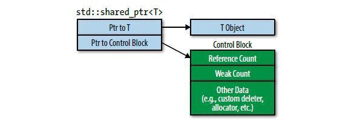

# 목차
소유권 독점 자원의 관리에는 std::unique_ptr를 사용하라
소유권 공유 자원의 관리에는 std::shared_ptr를 사용하라
std::shared_ptr처럼 작동하되 대상을 잃을 수도 있는 포인터가 필요하면 std::wak_ptr를 사용하라
new를 직접 사용하는 것보다 std::make_unique와 std::make_shared를 선호하라
Pimpl 관용구를 사용할 때에는 특수 멤버 함수들을 구현 파일에서 정의하라
std::move와 std::forwardc를 숙지하라보편 참조와 오른값 참조를 구별하라
오른값 참조에는 std::move를, 보편 참조에는 std::forward를 사용하라
#### 18. 소유권 독점 자원은 std::unique_ptr
#### 19. 소유권 공유 자원은 std::sahred_ptr
#### 20. 잃을 수도 있는 공유 자원 std::weak_ptr
#### 21. new를 사용하는 것보다 make_unique, make_shared 선호
#### 22. Pimpl 관용구를 사용할 때 특수 멤버 함수 정의
#### 23. std::move 와 std::forward 숙지
#### 24. 보편 참조와 오른값 참조 구별
#### 25. 오른값 참조에는 move, 보편 참조에는 foward 사용
---

# 4장 똑똑한 포인터

생 포인터를 사용하기 힘든 이유
1. 선언으로 객체와 배열을 구분하기 힘듦
2. 객체의 소유권여부 파악하기 힘듦
3. 객체의 파괴 매커니즘 알아야 할 수 있음 (`delete` 가 아닌 별도 매커니즘 사용 가능성 존재)
4. 파괴 하더라도 배열의 파괴인지 객체의 파괴인지 알 수 없음
5. 여러 곳에서 포인터를 소유할 수 있지만, 딱 한번 파괴되어야 한다.
6. Dangling ptr 문제가 발생 가능

이러한 문제점을 해결하기 위한 스마트 포인터 네 가지
 - `std::auto_ptr`
 - `std::unique_ptr`
 - `std::shared_ptr`
 - `std::weak_ptr`

단, c++11 이후로는 `unique_ptr` 이 `auto_ptr` 의 상위 호환이므로 `unique_ptr` 만을 고려한다.

---
## Item 18. 소유권 독점 자원은 `unique_ptr` 를 사용

### std::unique_ptr 특징
- 독점 소유권 의미론을 가진 자원을 위해 사용 (항상 자신이 가리키는 객체 독점 소유, 이동시 소유권 이전)
- 생 포인터와 같은 크기의 메모리 사용
- 이동 전용 형식 (move-only type), 복사를 허용하지 않는다

### Hierarchy 안의 객체를 생성하는 팩터리 함수의 반환으로 보통 사용
```cpp
class Investment { 
};

class Stock :
    public Investment {
};

class Bond :
    public Investment {
};

class RealEstate :
    public Investment {
};

template <typename... Ts> 
std::unique_ptr<Investment> makeInvestment(Ts&&... params);
{
    // pInvestment의 타입은 std::unique_ptr<Investment> *pInvestment가 파괴된다.   
    auto pInvestment = makeInvestment(인수들);   
}
```
 이런 팩터리 함수는 힙에 객체를 생성하고 포인터를 리턴한다. 이 객체에 대한 소유권은 온전히 이 함수를 호출한 호출자의 몫이다. 즉, 팩터리 함수는 객체를 생성하고 소유권을 호출자를 이전하기만 하면 되기 때문에 `unique_ptr` 의 사용은 적합하다.

 `unique_ptr` 은 객체를 위한 것(`std::unique_ptr<T>`)과 배열을 위한 것(`std::unique_ptr<T[]>`)이 있다. 이 때문에 생 포인터와는 다르게 포인터가 객체를 가르키는지, 배열을 가르키는지에 대한 애매함으 해소된다. 하지만 내장 배열보다는 `std::array`나 `std::vector`을 사용하기를 추천한다.


 ### 기본적인 파괴는 `delete` 를 통해 일어나나, 커스텀 삭제자를 지정할 수 있다.
 자원의 파괴는 기본적으로 `delete` 를 통해서 일어나지만, `std::unique_ptr`객체 생성시 커스텀 삭제자를 사용하도록 등록할 수 있다.
 ```cpp
 auto delInvmt = [](Investment* pInvestment) // 커스텀 삭제자
{                                
    makeLogEntry(pInvestment);   
    delete pInvestment;          
}

template <typename... Ts>
std::unique_ptr<Investment, decltype(delInvmt)>
makeInvestment(Ts&&... params)
{
    std::unique_ptr<Investment, decltype(delInvmt)>
        pInv(nullptr, delInvmt);

    if ( /* Stock 객체를 생성해야 하는 경우 */)
    {
        pInv.reset(new Stock(std::forward<Ts>(params)...));
    }
    else if ( /* Bond 객체를 생성해야 하는 경우 */)
    {
        pInv.reset(new Bond(std::forward<Ts>(params)...));
    }
    else if ( /* RealEstate 객체를 생성해야 하는 경우 */)
    {
        pInv.reset(new RealEstate(std::forward<Ts>(params)...));
    }

    return pInv;
}
 ```
 - 모든 커스텀 삭제 함수는 파괴할 객체 하나를 받으며 삭제하는데 필요한 일을 수행한다.
   - `delInvmt`는 `makeInvestment`가 돌려준 객체에 대한 커스텀 삭제자
 - 커스텀 삭제자 사용시 그 타입을 `unique_ptr`의 둘째 타입 인수로 지정해야 한다.
   - 예시의 삭제자 타입은 `delInvmt`
 - 예시의 기본 전략은 `nullptr` 값인 `unique_ptr`를 만들어서 적절한 객체를 가리키게 한 후 돌려주는 것이다.
 - 생 포인터를 `unique_ptr`에 대입하는 것은 컴파일 되지 않는다.
   - 때문에 `reset`함수를 호출했다.
 - 기반 클래스를 매개변수로 받고 기반 클래스의 소멸자를 호출하기 때문에 기반 클래스의 소멸자는 가상 소멸자야 한다.

```cpp
auto delInvmt1 = [](Investment* pInvestment) // 상태 없는 람다 형태의 삭제자
{                                    
    makeLogEntry(pInvestment);       
    delete pInvestment;
}

template <typename... Ts> // 반환 타입은 Investment*와 같은 크기
std::unique_ptr<Investment, decltype(delInvmt1)> makeInvestment(Ts&&... args);                       

void delInvmt2(Investment* pInvestment) // 함수 형태의 삭제자
{
    makeLogEntry(pInvestment);
    delete pInvestment;
}

template <typename... Ts> // 반환 타입의 크기는 Investment*의 크기에 적어도 함수 포인터의 크기를 더한 것임!
std::unique_ptr<Investment, void (*)(Investment*)> makeInvestment(Ts&&... params);   
```

커스텀 소멸자를 사용한다면 `unique_ptr`크기는 달라진다.
 - 함수포인터의 경우 `unique_ptr`크기가 1워드에서 2워드로 증가
 - 함수 객체는 저장된 상태만큼 크기 증가
 - 람다는 상태(캡처)가 없다면 크기 변화가 없다

따라서 캡처가 없는 람다를 사용하는것이 바람직하다.

### `unique_ptr`를 `shared_ptr`로 손쉽게 변환할 수 있다
`unique_ptr`의 경우 다음과 같이 손쉽게 `shared_ptr`로 변환이 가능하다
```cpp
std::shared_ptr<Investment> sp = makeInvestment( params );
```
하지만 반대로 `shared_ptr`를 `unique_ptr`로 변환하는 것은 불가능하다.
따라서 팩터리 함수는 호출자가 객체를 독점적으로 소유하는지, 공유하려는지 모르기 때문에 `unique_ptr`로 반환하는 것이 합당하다.

---
## Item 19. 소유권 공유 자원은 `shared_ptr` 사용

### `shared_ptr`은 임의의 공유 자원의 수명을 편리하게 관리할 수 있는 수단 제공

`shared_ptr` 를 통해서 접근되는 객체의 수명은 공유 포인터가 공유된 소유권 의미론을 통해 관리한다. 이를 위해 `shared_ptr` 는 참조 횟수(reference count)를 통해 여러 객체가 공동으로 관리할 수 있게 한다. 해당 객체를 소유하는 `shared_ptr` 가 늘어나면 reference count 가 1 증가, 소유권을 잃는 경우가 생기면 reference count 는 1 감소한다. Reference count 가 0이 되면 객체는 파괴된다. 이런 reference count 관리는 다음과 같은 영향을 미친다.
 - `shared_ptr` 의 크기는 생 포인터의 두배다.
 - Reference count를 담을 메모리는 반드시 동적으로 할당해야 한다.
 - 참조 횟수의 증가와 감소가 반드시 atomic 연산이여야 한다.
   - 멀티 스레드 환경에서 레이스가 발생 가능하다.
 - 이동 생성의 경우 reference count 를 증가시키지 않는다.
   - reference count 연산이 필요 없기에 이동 생성이 복사 생성보다 빠르다.

### 기본적으로 `delete` 를 통해 파괴되지만 커스텀 삭제자도 지원한다. `unique_ptr` 과 다르게 삭제자 형식은 아무런 영향을 미치지 않음

`shared_ptr` 은 `unique_ptr` 과 다르게 커스텀 삭제자가 smart pointer 형식의 일부가 아니다. 이 때문에 여러 `shared_ptr` 가 서로 다른 커스텀 삭제자를 갖더라도 동일한 컨테이너에 담길 수 있다.

```cpp
auto loggingDel = [](Widget* pw)
{
  makeLogEntry(pw);
  delete pw;
};

...

// 삭제자의 형식이 포인터 형식의 일부
template<typename T>
std::unique_ptr<Widget, decltype(loggingDel)>
upw(new Widget, loggingDel);

// 삭제자의 형식이 포인터 형식의 일부가 아님
template<typename T>
std::shared_ptr<Widget>
spw(new Widget, loggingDel);

// 따라서 다음과 같은 구현도 가능하다
auto customDeleter1 = [](Widget *pw) { ... };
auto customDeleter2 = [](Widget *pw) { ... };

std::shared_ptr<Widget> pw1(new Widget, customDeleter1);
std::shared_ptr<Widget> pw2(new Widget, customDeleter2);

// 다른 삭제자를 가진 shared_ptr 를 같은 컨테이너에 넣을 수 있다
// unique_ptr 은 삭제자별로 형식이 다르므로 같은 컨테이너에 넣을 수 없다!
std::vector<std::shared_ptr<Widget>> vpw{ pw1, pw2 };
```

### 대체로 `shared_ptr` 객체는 `unique_ptr` 객체의 두배 크기를 갖는다. 이는 제어 블록과 atomic 연산 때문

`shared_ptr` 에는 `unique_ptr` 과는 달리 제어 블록(control block)이 존재하기에 더 많은 메모리가 필요하다.



제어 블록에는 reference count, 약한 참조(weak count), 커스텀 생성자/소멸자 등 `shared_ptr` 에 필요한 것들이 담긴다. 제어 블록은 최초의 `shared_ptr` 이 생성될 때 설정된다. 때문에 `shared_ptr` 생성과 같은 다음의 규칙을 유추할 수 있다.
- `std::make_shared` 는 항상 제어 블록을 생성
- `unique_ptr` 로부터 `shared_ptr` 객체를 생성하면 제어 블록이 생성된다.
- 생 포인터로 `shared_ptr` 생성자를 호출하면 제어 블록이 생성된다.

### 생 포인터로부터 `shared_ptr` 를 생성하는 일은 피해야 함 (제어 블록 생성을 하나만 하도록)

만약 하나의 생 포인터로 `shared_ptr` 생성자 호출을 여러번 한다면 여러개의 제어 블록이 생성되기 때문에 예상치 못한 행동이 일어날 수 있다.

```cpp
auto pw = new Widget;
std::shared_ptr<Widget> spw1(pw, loggingDel);
std::shared_ptr<Widget> spw2(pw, loggingDel);
```

위 코드의 경우 `spw1` `spw2` 모두 각기 다른 제어 블록을 생성하기에 두 `shared_ptr` 의 reference count 는 모두 1이다. 이후 `pw` 변수에 대한 소멸자가 두 번 호출되기 때문에 dangling pointer 문제가 발생할 수 있다.

```cpp
std::shared_ptr<Widget> spw1(new Widget, loggingDel);
// spw2 는 spw1 과 동일한 제어 블록 사용 (복사 생성자 호출)
std::shared_ptr<Widget> spw2(spw1);
```

이를 막기 위해 `shared_ptr` 생성자에서 new를 직접 사용하고, 만들어진 `shared_ptr` 를 이용해 또다른 `shared_ptr` 를 생성하도록 하자. 그러면 `spw1` `spw2` 모두 동일한 제어 블록을 사용한다.

생 포인터를 이용해 `shared_ptr` 생성시 `this` 를 이용하면 더 심각한 문제를 야기한다.
```cpp
std::vector<std::shared_ptr<Widget>> processWidgets;

class Widget {
public:
  void process()
  {
    // process
    // 만약 이미 this를 소유한 shared_ptr 이 있을 경우 새로운 제어 블록을 생성하게 된다.
    processWidgets.emplace_back(this);
  }
};
```

이런 상황을 방지 하기 위해 `std::enable_shared_from_this`라는 템플릿이 존재한다. 해당 템플릿을 상속 한 후 `shared_from_this()` 멤버 함수를 호출하면 된다. 이 멤버 함수는 현재 객체의 제어 블록을 조회하고 새 `shared_ptr`를 생성한다 (이미 제어 블록이 있다는 전제).
```cpp
class Widget: public std::enable_shared_from_this<Widget> {
public:
  // shared_ptr 가 유효한 객체를 가리키기 전에 shared_from_this를 호출하는 것을 막기 위해 생성자를 private으로 선언. 팩터리 함수 사용
  template<typename... Ts>
  static std::shared_ptr<Widget> creat(Ts&&... params);

    void process()
  {
    ...
    processWidgets.emplace_back(shared_from_this());
  }
private:
  ... // 생성자들
};
```

다음과 같은 이유로 `shared_ptr` 사용이 꺼려질 수 있다.
1. 커스텀 생성자/소멸자의 크기에 따라 제어 블록 크기가 달라 질수 있다.
2. [가상 함수 메커니즘](https://stackoverflow.com/a/28253835)이 쓰인다
3. reference count 관리에 atomic 연산이 사용된다.

하지만
1. 기본 생성자/소멸자 사용시 제어 블록의 크기는 3워드, `make_shared` 사용시 제어 블록 동적 할당 무료
2. atomic 연산은 하나의 기계어 명령에 대응되어 생각보다 비싸지 않다.
3. 가상함수는 객체 파괴시 한 번만 쓰인다.
   
위 조건들을 생각하면 `shared_ptr` 가 안겨주는 이점에 비해 너무나도 합리적인 비용이다. 만일 독점적 소유가 예상된다면 `unique_ptr` 을 우선 사용하고 추후 공유 자원으로 변했을 때 `shared_ptr` 로 변환 하는것도 하나의 방법이다.

---
## Item 20. 잃을 수도 있는 공유 자원은 `weak_ptr` 을 사용

### `shared_ptr` 처럼 작동하되 대상을 잃을 수도 있는 포인터가 필요하면 `weak_ptr` 를 사용하라

`weak_ptr` 는 `shared_ptr` 처럼 행동하지만 reference count 에는 영향을 미치지 않는다. 때문에 `weak_ptr` 는 자신이 소유한 포인터를 잃을 수도 있는데, 이런 상황을 만료되었다(expired)라고 말한다.

```cpp
// spw가 생성된 후, 피지칭 Widget의 참조 카운트(이하 간단히 카운트)는 1이다
auto spw = std::make_shared<Widget>();   
// wpw는 spw와 같은 Widget을 가리킨다; 카운트는 여전히 1이다.
std::weak_ptr<Widget> wpw(spw);
// 카운트가 0이 되고 Widget이 파괴된다; 이제 wpw는 대상을 잃은 상태이다.
spw = nullptr;   
```

`weak_ptr` 는 기반이 되는 `shared_ptr` 로 부터 생성가능하다. `weak_ptr` 는 포인터 대상을 잃을 수도 있기 때문에 `expired` 여부를 검사한 후 사용해야 한다. 하지만 `weak_ptr` 는 역참조 연산이 불가능 하다는 점, 가능하더라도 `expired` 검사 연산과 역참조 연산 사이에 포인터에 영향을 미치는 연산이 수행 될 수도 있다. 결국 올바르게 사용하기 위해선 `expired` 검사 연산과 객체 접근 연산을 하나의 연산으로 해결하면 된다.

```cpp
// 방법 1 std::weak_ptr::lock 사용
std::shared_ptr<Widget> spw1 = wpw.lock(); // wpw가 만료이면 spw1은 널
auto spw2 = wpw.lock(); // 위와 동일하나 auto를 사용했음
// 방법 2 weak_ptr 로 부터 shared_ptr 생성
std::shared_ptr<Widget> spw3(wpw); // wpw가 만료이면 std::bad_weak_ptr(예외)가 발생
```

1. `weak_ptr::lock` 기능 사용. 이 멤버 함수는 `shared_ptr` 객체를 돌려준다.
2. `weak_ptr` 를 인수로 사용하여 `shared_ptr` 생성하여 사용

### `weak_ptr` 의 잠재적인 용도로는 캐싱, 관찰자 목록, 그리고 `shared_ptr` 순환 고리 방지가 있다

만약 고유 ID 를 받아 임의의 객체 `Widget` 을 생성하는 팩터리 함수가 있고, `Widget` 생성 비용이 크다고 가정하자. 동일한 ID 를 이용한 `Widget` 객체를 자주 사용한다면 성능의 문제로 캐시가 마려울 것이다. 그렇다고 모든 객체를 캐시에 넣어둔다면 이 또한 효율적이지 않다. 이때 캐시에 `weak_ptr` 를 사용한다면 더 이상 사용하지 않는 객체는 자동으로 파괴될 것이므로 캐시 메모리 관리하는데 효율적이다. 캐시에 `weak_ptr` 를 사용하므로 팩터리 함수는 `shared_ptr` 를 리턴해야 한다.
```cpp
std::unique_ptr<const Widget> loadWidget(WidgetID id);
std::shared_ptr<const Widget> fastLoadWidget(WidgetID id) {
  static std::unordered_map<WidgetID, std::weak_ptr<const Widget>> cache;
  auto objPtr = cache[id].lock(); // objPtr는 캐시에 있는 객체를 가리키는 std::shared_ptr
                                   // 단, 객체가 캐시에 없으면 널
  if (!objPtr) {
    objPtr = loadWidget(id);
    cache[id] = objPtr;
    return objPtr;
  }
}
```

옵저버 패턴의 경우 관찰 대상(subject)의 상태가 변화하면 관찰자(observer)들에게 변화한 상태를 알려준다. Subject가 observer 들을 소유하면 상태 변화를 손쉽게 알릴 수 있다. 이때 `weak_ptr` 를 사용하면 observer 의 파괴여부를 신경쓰지 않고 subject 들은 상태 변화를 알릴수 있다.

```cpp
template<typename T>
class Subject<T> {
  public:
    void add(std::shared_ptr<T> observer) {
      if (exist(observer)) {
        return;
      }
      observers.emplace_back(observer);
    }
    void notify(const T& value) {
      std::for_each(m_observers.begin(), m_observers.end(), 
                    [this, &observable](const std::weak_ptr<Observer<T>>& p) {
        if (auto sp = p.lock()) {
          sp->notify(value);
        }
      });
    }
  private:
    bool exist(const std::shared_ptr<T> observer);
    std::vector<std::weak_ptr<Observer<T>>> observers;
}
```

서로가 서로를 소유하는 cyclic reference 관리에서도 `weak_ptr` 는 유용하다. 다음 예시와 같이 Mother 와 Son 이 서로를 `shared_ptr` 로 소유하고 있다면 두 객체 모두 reference count 가 1인 채로 파괴되지 않을것이다. 


그렇다면 둘 중 하나의 `shared_ptr` 를 생 포인터로 바꾸면 어떨까? 이 경우에 dangling pointer 문제가 발생할 수 있다. Mother 와 Daughter 관계와 같이 `weak_ptr` 를 사용한다면 문제를 해결할 수 있다.

---
## Item 21. new를 사용하는 것보다 make_unique, make_shared 선호

### new 의 직접 사용에 비해 `make_shared` 사용이 더 안정적이고 빠르다.

new 직접 사용에 비해 make 함수를 사용해야 하는 이유 첫번째는 코드 중복제거이다. 코드 중복은 object 코드 크기 증가, 일관성 없는 코드 생성 가능, 컴파일 시간의 증가등의 이유로 피해야 하는 것이다. 아래 코드를 보면 make 함수에 비해 new 를 사용할 경우 `Widget` 형식이 되풀이되어 나오는 것을 볼 수 있다.
```cpp
auto upw1(std::make_unique<Widget>()); // make 함수를 사용
std::unique_ptr<Widget> upw2(new Widget); // 사용하지 않음

auto spw1(std::make_shared<Widget>()); // make 함수를 사용
std::shared_ptr<Widget> spw2(new Widget); // 사용하지 않음
```

make 함수를 사용해야 하는 경우에는 안전성과 관련이 있다. 아래 코드는 `Widget` 객체 생성 이후 특정 로직을 수행하는 코드로 마지막 줄의 경우 컴파일러에 따라 일의 실행 순서가 달라지는데, 다음과 같은 순서로 컴파일러가 일을 수행한다면 예기치 못한 상황이 나타날 수 있다.

1. `new Widget` 을 실행한다.
2. `computePriority` 를 실행한다.
3. `shared_ptr` 생성자를 실행한다.

만약 `computePriority` 가 예외를 던진다면 1번에서 생성한 `Widget` 객체는 메모리에 남게 되어 메모리 누수가 발생한다.

```cpp
void processWidget(std::shared_ptr<Widget> spw, int priority);
int computePriority(void);
// 자원 누수 위험이 있음!
processWidget(std::shared_ptr<Widget>(new Widget), computePriority());
```

생 포인터를 이용하는 방법이 아닌 `make_shared` 함수를 사용한다면, 호출 순서에 상관 없이 `Widget` 객체의 동적 생성과 `shared_ptr` 에 포인터를 저장이 `computePriority` 함수 개입 없이 수행되기에 메모리 누수를 걱정하지 않아도 된다. 그럼에도 불구하고 new 를 이용하여 `shared_ptr` 를 생성하고 싶다면, `shared_ptr` 생성 코드를 따로 분리하는 것이 좋을것이다.

```cpp
// 자원 누수의 위험이 없음
processWidget(std::make_shared<Widget>(), computePriority());
// 정확하지만 최적은 아님
std::shared_ptr<Widget> spw(new Widget, cusDel);
processWidget(spw, computePriority());
```

`make_shared` 의 경우 객체 메모리와 제어 블록의 메모리가 한 번의 동적 할당으로 생성되는 반면에, new 를 사용한다면 객체 메모리 동적 할당과 제어 블록 메모리 동적 할당이 분리되어 수행되기 때문에 시간적 측면, 메모리 사용 측면에서 모두 `make_shared` 를 호출하는 편이 더 저렴하다.

위 코드에서 new 를 사용하여 `shared_ptr` 을 생성하는 코드를 보면 `processWidget` 함수는 값을 넘겨받지만 해당 함수 호출시 왼값을 넘기는 것을 볼 수 있다. 이 때 복사 생성이 발생하여 reference count 조작하는 atomic 연산이 발생한다. 만약 `shared_ptr` 를 `move` 연산을 통해 오른값으로 넘긴다면 이동 생성이 발생하여 더 효율적일 것이다,

```cpp
std::shared_ptr<Widget> spw(new Widget, cusDel)
processWidget(std::move(spw), computePriority());
```

### make 함수의 사용이 불가능한 경우 존재

`unique_ptr` 과 `shared_ptr` 에서 커스텀 소멸자를 지정하고 싶다면 make 함수를 사용할 수 없다. 때문에 이 경우에는 new 를 이용해서 스마트 포인터를 생성해야 한다.

```cpp
auto widgetDeleter = [](Widget* pw) { ... };
std::unique_ptr<Widget, decltype(widgetDeleter)> upw(new Widget, widgetDeleter);
std::shared_ptr<Widget> spw(new Widget, widgetDeleter);
```

make 함수의 두 번째 한계는 중괄호 초기치를 완벽하게 전달할 수 없다는 점이다. make 함수들은 내부적으로 매개변수들을 완벽 전달할 때 중괄호가 아니라 괄호를 사용한다. 이 때문에, 피지칭 객체를 중괄호 초기치로 생성하려면 반드시 new를 직접 사용해야 한다. 만약 중괄호 초기치를 전달하고 싶다면 `auto` 타입 추론을 이용해서 중괄호 초기치로부터 `std::initializer_list` 객체를 생성하고(항목 2 참고), 그것을 make 함수에 넘겨주면 된다.

```cpp
// std::initializer_list 객체 생성
auto initList = { 10, 20 };
// 생성한 initializer_list 객체를 이용해서 std::vector 생성
auto spv = std::make_shared<std::vector<int>>(initList);
```

### `make_shared` 가 부적합한 경우가 추가로 존재

`unique_ptr` 의 경우 make 함수를 사용하지 못하는 경우가 위의 두 가지 뿐이지만 `shared_ptr` 의 경우 추가로 두 가지 더 있다.

별도의 `operator new`, `operator delete` 를 정의하는 클래스들은 클래스 객체와 정확히 동일한 메모리를 할당, 해제 하는 경우가 많다.
하지만 `make_shared` 함수는 객체의 메모리 + 제어 블록 메모리를 한번에 할당, 해제 하기 때문에 이 경우에 적합하지 않다. 이 경우가 첫 번째 경우이다.

두 번째 경우 `make_shared` 함수가 객체의 메모리 + 제어 블록 메모리를 한번에 할당, 해제하기 때문에 발생한다. `shared_ptr` 의 경우 reference count 가 0이 되면 피지칭 객체를 파괴하고 해당 메모리를 해제할 수 있다. 하지만 제어 블록을 참조하는 `weak_ptr` 들이 존재하는 한 제어 블록은 계속해서 존재해야 한다. 제어 블록이 존재한다는 것은 `make_shared` 함수를 통해서 메모리 할당을 한다면 객체 메모리 또한 해제되지 않은 채로 있어야 한다는 말이다. 만약 제한된 메모리 환경에서 큰 메모리를 필요로하는 객체를 할당한다면 문제가 될 수 있다.

```cpp
class ReallyBigType { ... };

// 아주 큰 객체를 std::make_shared 를 이용해 생성
auto pBigObj =
	std::make_shared<ReallyBigType>();

// 큰 객체를 가리키는 std::shared_ptr 들과
// std::weak_ptr 들을 생성해서 사용
...

// 객체를 가리키는 마지막 std::shared_ptr 가 파괴됨
// std::weak_ptr 들은 여전히 남아있음
...

// 큰 객체가 차지하던 메모리는 여전히 할당
...

// 마지막 std::weak_ptr 가 파괴
// 제어 블록과 객체가 차지하던 메모리가 해제
...
```

만약 make 함수를 사용하지 못하는 상황의 경우 new의 결과를 **다른 일은 전혀 하지 않는 문장**에서 스마트 포인터의 생성자에게 직접 넘겨주도록 하자. 