# 목차
#### 2.1 좌표계
#### 2.2 벡터
#### 2.3 점
#### 2.4 법선
#### 2.5 광선
#### 2.6 경계 상자
#### 2.7 변환
#### 2.8 변환의 적용
#### 2.9 애니메이션 변환
#### 2.10 상호작용
---

2장의 대부분의 클래스는 [core/geometry.h](https://github.com/mmp/pbrt-v3/blob/master/src/core/geometry.h), [core/transform.h](https://github.com/mmp/pbrt-v3/blob/master/src/core/transform.h) 에서 정의하고 [core/geometry.cpp](https://github.com/mmp/pbrt-v3/blob/master/src/core/geometry.cpp), [core/transform.cpp](https://github.com/mmp/pbrt-v3/blob/master/src/core/transform.cpp) 에서 구현하고 있다.

# 2.1 좌표계
일반적인 n차원의 경우 원점 p0와 n개의 basis vector들로 이루어져 있다. 이 점과 벡터들로 n차원의 아핀공간을 정의한다. 3차원에서의 표준 프레임은 원점 (0, 0, 0), basis vector (1, 0, 0), (0, 1, 0), (0, 0, 1) 으로 이루어져 있다.
## 2.1.1 좌표계의 손방향
pbrt 에서는 왼손 좌표계를 사용한다.
# 2.2 벡터
pbrt 에서 제공하는 vector2, vector3 클래스는 [core/geometry.h](https://github.com/mmp/pbrt-v3/blob/13d871faae88233b327d04cda24022b8bb0093ee/src/core/geometry.h#L58-L283)에 정의되어 있다.

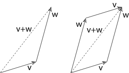

벡터 덧셈

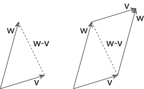

벡터 뺄셈

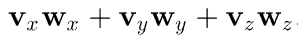

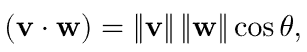

[벡터의 내적](https://github.com/mmp/pbrt-v3/blob/13d871faae88233b327d04cda24022b8bb0093ee/src/core/geometry.h#L945)

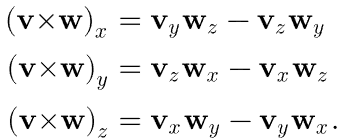

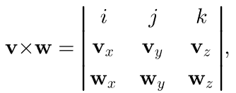

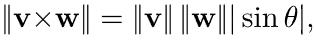

벡터의 외적 계산시 부동 소수점의 뺄셈 연산 오류를 방지하기 위해 double precision 으로 변환하여 연산한다.

[벡터의 외적](https://github.com/mmp/pbrt-v3/blob/13d871faae88233b327d04cda24022b8bb0093ee/src/core/geometry.h#L957)

[정규화](https://github.com/mmp/pbrt-v3/blob/13d871faae88233b327d04cda24022b8bb0093ee/src/core/geometry.h#L984)

## [한 벡터로부터의 좌표계](https://github.com/mmp/pbrt-v3/blob/13d871faae88233b327d04cda24022b8bb0093ee/src/core/geometry.h#L1019-L1027)
단일 3D 벡터만으로 지역 좌표계를 생성하고 싶은 경우, 다음 순서에 따라 지역 좌표계를 생성할 수 있다.
1. 주어진 벡터 v1이 normalize 됐다고 가정
2. v1에서 한 요소를 0으로 만든 뒤 남은 두 요소를 교환하고, 그중 하나의 부호를 변경해 수직인 벡터 v2 생성
3. 다시 v1 x v2 연산을 통해 두 벡터와 수직인 벡터 v3 생성

# 2.3 점
pbrt 에서 제공하는 point2, point3 클래스는 [core/geometry.h](https://github.com/mmp/pbrt-v3/blob/13d871faae88233b327d04cda24022b8bb0093ee/src/core/geometry.h#L286-L554)에 정의되어 있다.

두 점 사이의 선형 보간
``` c++
<<Geometry Inline Functions>>+=  
template <typename T> Point3<T>
Lerp(Float t, const Point3<T> &p0, const Point3<T> &p1) {
    return (1 - t) * p0 + t * p1;
}
```
# 2.4 법선

pbrt 에서 제공하는 [normal3](https://github.com/mmp/pbrt-v3/blob/13d871faae88233b327d04cda24022b8bb0093ee/src/core/geometry.h#L557-L676) 클래스.

법선이 표면적으로 벡터와 비슷하더라도 둘을 구분지어야 할 필요가 있다. 법선은 특정 표면에 의해 정의돼 변환을 적용할 때 벡터와 다르게 연산해야 한다. 또한 벡터와 다르게 법선은 점에 더할 수 없으며, 두 법선의 외적을 계산할 수 없다.
# 2.5 광선
pbrt 에서 제공하는 [Ray, RayDifferential](https://github.com/mmp/pbrt-v3/blob/13d871faae88233b327d04cda24022b8bb0093ee/src/core/geometry.h#L869-L926) 클래스.

광선은 원점과 방향이 지정된 반 직선이다.


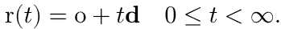

Ray 클래스는 특정 선분을 한정하는 멤버변수 tMax를 갖고 있다. 이는 광선의 최대 선분으로 제한한다. 해당항목은 mutable 이고 광선-물체 교차 테스트에서 가장 가까운 교차점을 tMax로 기록할 수 있게 한다. 또한 광선이 투과될 매절에 대한 멤버 변수를 갖고 있다.

## 광선 미분
pbrt는 안티앨리어싱을 위해 광선에 대해 추가적인 정보를 유지한다. 보통 카메라 기준 pixel 단위로 광선을 만들어서 렌더링을 하는데, 이때 해당 픽셀 영역의 평균값을 계산하기 위해 사용한다.

RayDifferential 은 Ray 의 하위 클래스로, 두 개의 추가적인 광선에 대한 정보를 갖고 있다. ScaleDifferential 함수를 이용해 RayDifferential 의 멤버 변수를 갱신할 수 있다.
```c++
<<RayDifferential Public Data>>= 
bool hasDifferentials;
Point3f rxOrigin, ryOrigin;
Vector3f rxDirection, ryDirection;

<<RayDifferential Public Methods>>+= 
void ScaleDifferentials(Float s) {
    rxOrigin = o + (rxOrigin - o) * s;
    ryOrigin = o + (ryOrigin - o) * s;
    rxDirection = d + (rxDirection - d) * s;
    ryDirection = d + (ryDirection - d) * s;
}
```
# 2.6 경계 상자

pbrt 에서 제공하는 [Bounds2, Bounds3](https://github.com/mmp/pbrt-v3/blob/13d871faae88233b327d04cda24022b8bb0093ee/src/core/geometry.h#L678-L833)클래스.

2d나 3d 공간 상에서 경계를 표현하기 위해 Bounds2, Bounds3 템플릿 클래스를 사용한다.
1. AABB (Axis-aligned bounding box)
2. OBB  (Oriented bounding box)
 
이런 경계를 표현하는 방식에는 크게 두 가지가 있다. pbrt 는 AABB 를 사용하는데 3d 상에서의 공간 경계 박스는 좌표계의 축과 정렬돼 있다. OBB 의 경우 여전히 직육면체의 모습을 띄지만 좌표계의 축과 정렬될 필요는 없다. 3D AABB 를 표현할 수 있는 방법으로는 두 가지 방식이 있다.
1. 정점들 중 하나와 정반대의 위치까지의 대각선 벡터
2. 정점들 중 하나와 대각선 위치의 반대 정점

pbrt 는 두 번째 방법을 선택했으며 8개 정점중 최소 좌표와 최대 좌표로 표현한다. 

별도로 2D 정수형 bounding box 에 대해 forward iterator 조건을 만족하는 BoundxIterator 도 존재한다.
# 2.7 변환

pbty에서 가능한 모든 변환중 다음을 만족하는 변환만을 고려한다.
 - 선형성 : 만일 변환 T 가 선형 변환이라면 임의의 스칼라 값 s 에 대해 다음을 만족한다. T(sv) = sT(v), T(v1 + v2) = T(v1) + T(v2)
 - 연속성 : 변환 T 에 대해 임의의 점 p, 벡터 v 근처에 있는 이웃들은 변환 이후에도 그 주변에 있게 된다.
 - 일대일, 역변환 : 점 p 의 경우 변환 T 를 통해 유일한 값 p' 으로 변환이 되며, p' -> p 로의 역변환 도 존재한다.
 
pbrt 에서 제공하는 [Transform](https://github.com/mmp/pbrt-v3/blob/13d871faae88233b327d04cda24022b8bb0093ee/src/core/transform.h#L113-L206)클래스.

## 2.7.1 동차 좌표계

 3차원 공간 안에서 x, y, z 세 개의 정보만 갖고는 점과 벡터 사이의 차이를 알지 못한다.

 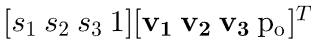, 

위 두 내적에 나타난 si 값과 0 혹은 1은 점과 벡터의 동차 표현이다.

## 2.7.3 이동 변환

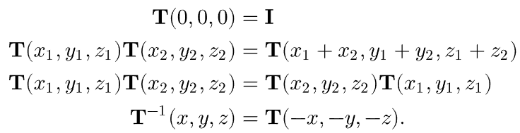


```c++
<<Transform Method Definitions>>= 
Transform Translate(const Vector3f &delta) {
    Matrix4x4 m(1, 0, 0, delta.x,
                0, 1, 0, delta.y,
                0, 0, 1, delta.z, 
                0, 0, 0,       1);
    Matrix4x4 minv(1, 0, 0, -delta.x,
                   0, 1, 0, -delta.y,
                   0, 0, 1, -delta.z, 
                   0, 0, 0,        1);
    return Transform(m, minv);
}
```
## 2.7.4 크기 변환

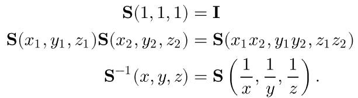

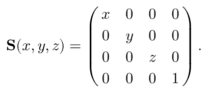

```c++
<<Transform Method Definitions>>+=  
Transform Scale(Float x, Float y, Float z) {
    Matrix4x4 m(x, 0, 0, 0,
                0, y, 0, 0,
                0, 0, z, 0,
                0, 0, 0, 1);
    Matrix4x4 minv(1/x,   0,   0, 0,
                   0,   1/y,   0, 0,
                   0,     0, 1/z, 0,
                   0,     0,   0, 1);
    return Transform(m, minv);
}
```
## 2.7.5 x, y, z축 회전 변환

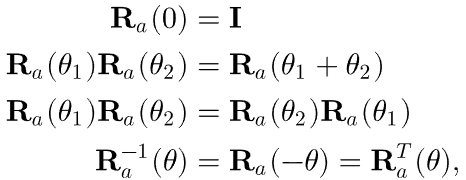

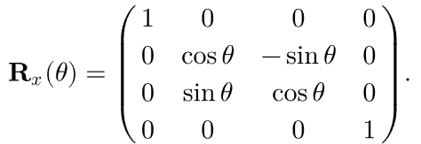

```c++
<<Transform Method Definitions>>+=  
Transform RotateX(Float theta) {
    Float sinTheta = std::sin(Radians(theta));
    Float cosTheta = std::cos(Radians(theta));
    Matrix4x4 m(1,        0,         0, 0, 
                0, cosTheta, -sinTheta, 0,
                0, sinTheta,  cosTheta, 0,
                0,        0,         0, 1);
    return Transform(m, Transpose(m));
}
```

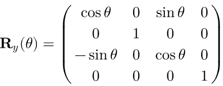

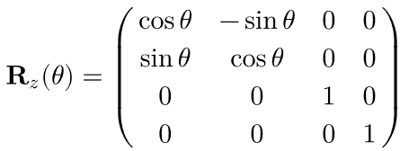
## 2.7.6 임의의 축을 기준으로 한 회전 변환

 하나의 normalize 된 벡터 a 를 기준으로 theta 만큼 벡터 v를 회전한다고 하자.

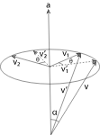

먼저 v 를 a에 투영하여 벡터 vc를 계산하자.

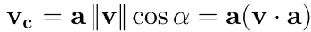

그리고 vc와 v를 이용해 벡터 a와 수직인 임의의 평면 좌표계를 만들 수 있다. 여기서 평면 좌표계의 basis 벡터 v1 v2를 구하자

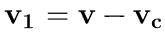

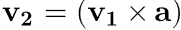

a벡터가 normalized 되었기 때문에 v1과 v2는 v - vc 벡터의 길이와 동일한 길이를 갖게 된다. 이제 vc 벡터를 기준으로 theta 만큼 이 평면 좌표에서 회전하게 되면 그 계산식은 다음과 같다.


```c++
<<Transform Method Definitions>>+=  
Transform Rotate(Float theta, const Vector3f &axis) {
    Vector3f a = Normalize(axis);
    Float sinTheta = std::sin(Radians(theta));
    Float cosTheta = std::cos(Radians(theta));
    Matrix4x4 m;
    <<Compute rotation of first basis vector>> 
       m.m[0][0] = a.x * a.x + (1 - a.x * a.x) * cosTheta;
       m.m[0][1] = a.x * a.y * (1 - cosTheta) - a.z * sinTheta;
       m.m[0][2] = a.x * a.z * (1 - cosTheta) + a.y * sinTheta;
       m.m[0][3] = 0;

    <<Compute rotations of second and third basis vectors>> 
       m.m[1][0] = a.x * a.y * (1 - cosTheta) + a.z * sinTheta;
       m.m[1][1] = a.y * a.y + (1 - a.y * a.y) * cosTheta;
       m.m[1][2] = a.y * a.z * (1 - cosTheta) - a.x * sinTheta;
       m.m[1][3] = 0;
       
       m.m[2][0] = a.x * a.z * (1 - cosTheta) - a.y * sinTheta;
       m.m[2][1] = a.y * a.z * (1 - cosTheta) + a.x * sinTheta;
       m.m[2][2] = a.z * a.z + (1 - a.z * a.z) * cosTheta;
       m.m[2][3] = 0;
    return Transform(m, Transpose(m));
}
<<Compute rotation of first basis vector>>= 
m.m[0][0] = a.x * a.x + (1 - a.x * a.x) * cosTheta;
m.m[0][1] = a.x * a.y * (1 - cosTheta) - a.z * sinTheta;
m.m[0][2] = a.x * a.z * (1 - cosTheta) + a.y * sinTheta;
m.m[0][3] = 0;
```
## 2.7.7 카메라 look-at 변환

 카메라의 위치, 초점 좌표 그리고 up 벡터만 있다면 세상 좌표계 에서 카메라 좌표계로 변환하는 행렬을 쉽게 구할 수 있다. 먼저, 카메라 -> 세상 좌표계로의 변환을 구한뒤 역행렬을 계산하면 된다. 카메라 -> 세상 좌표계로의 변환은 쉽다.

 1. [0, 0, 0, 1] 의 경우 세상 좌표계에서는 pos 와 같은 값을 갖게 된다.
 2. look - pos 를 통해 카메라의 시선 방향 벡터를 계산할 수 있다. 그리고 주어진 up 벡터와의 외적, 다시 그 결과와의 외적을 통해 카메라의 look-at, up, right 벡터를 구할 수 있다.
 3. 카메라 좌표상에서의 [1, 0, 0, 0], [0, 1, 0, 0], [0, 0, 1, 0] 단위 벡터들은 모두 right, up, look-at 벡터로 변환이 이루어 져야한다.

 위 세가지 사항들을 고려하면 camera -> world 좌표로의 변환 행렬을 쉽게 계산할 수 있다.

```c++
<<Transform Method Definitions>>+=  
Transform LookAt(const Point3f &pos, const Point3f &look,
        const Vector3f &up) {
    Matrix4x4 cameraToWorld;
    <<Initialize fourth column of viewing matrix>> 
       cameraToWorld.m[0][3] = pos.x;
       cameraToWorld.m[1][3] = pos.y;
       cameraToWorld.m[2][3] = pos.z;
       cameraToWorld.m[3][3] = 1;

    <<Initialize first three columns of viewing matrix>> 
       Vector3f dir = Normalize(look - pos);
       Vector3f right = Normalize(Cross(Normalize(up), dir));
       Vector3f newUp = Cross(dir, right);
       cameraToWorld.m[0][0] = right.x;
       cameraToWorld.m[1][0] = right.y;
       cameraToWorld.m[2][0] = right.z;
       cameraToWorld.m[3][0] = 0.;
       cameraToWorld.m[0][1] = newUp.x;
       cameraToWorld.m[1][1] = newUp.y;
       cameraToWorld.m[2][1] = newUp.z;
       cameraToWorld.m[3][1] = 0.;
       cameraToWorld.m[0][2] = dir.x;
       cameraToWorld.m[1][2] = dir.y;
       cameraToWorld.m[2][2] = dir.z;
       cameraToWorld.m[3][2] = 0.;

    return Transform(Inverse(cameraToWorld), cameraToWorld);
}
```

# 2.8 변환의 적용

## 2.8.1 점의 변환

점의 변환의 경우 [x, y, z, 1] 의 homogeneous 벡터를 이용해 임의로 계산한다. 이후 계산 결과에서의 w 로 전체 값을 나누어 다시 nonhomogeneous 점으로 변환한다. 
```c++
<<Transform Inline Functions>>= 
template <typename T> inline Point3<T>
Transform::operator()(const Point3<T> &p) const {
    T x = p.x, y = p.y, z = p.z;
    T xp = m.m[0][0]*x + m.m[0][1]*y + m.m[0][2]*z + m.m[0][3];
    T yp = m.m[1][0]*x + m.m[1][1]*y + m.m[1][2]*z + m.m[1][3];
    T zp = m.m[2][0]*x + m.m[2][1]*y + m.m[2][2]*z + m.m[2][3];
    T wp = m.m[3][0]*x + m.m[3][1]*y + m.m[3][2]*z + m.m[3][3];
    if (wp == 1) return Point3<T>(xp, yp, zp);
    else         return Point3<T>(xp, yp, zp) / wp;
}
```

## 2.8.2 벡터의 변환
```c++
<<Transform Inline Functions>>+=  
template <typename T> inline Vector3<T>
Transform::operator()(const Vector3<T> &v) const {
    T x = v.x, y = v.y, z = v.z;
    return Vector3<T>(m.m[0][0]*x + m.m[0][1]*y + m.m[0][2]*z,
                      m.m[1][0]*x + m.m[1][1]*y + m.m[1][2]*z,
                      m.m[2][0]*x + m.m[2][1]*y + m.m[2][2]*z);
}
```

## 2.8.3 법선의 변환

법선은 벡터의 변환과 동일하게 해서는 안된다. 법선은 표면에 수직인 벡터를 뜻한다. a 에서 b로 변환을 했을 때 법선은 더이상 표면에 수직이지 않다. 

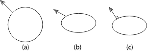

표면에 있는 임의의 탄젠트 벡터 t는 법선 벡터 n과 수직이어야 한다. 이는 변환 이후에도 동일하다.

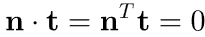

이를 적용하여 법선 벡터의 변환 행렬 S를 정의하였을 때 다음과 같다. 이때 S의 전치 행렬과 M 행렬를 곱했을 때 단위 행렬이어야 한다. 때문에 법선 벡터의 변환 행렬 S 는 M 행렬의 역행렬의 전치행렬이어야 한다. 

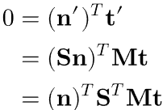

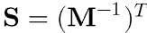

```c++
<<Transform Inline Functions>>+=  
template <typename T> inline Normal3<T>
Transform::operator()(const Normal3<T> &n) const {
    T x = n.x, y = n.y, z = n.z;
    return Normal3<T>(mInv.m[0][0]*x + mInv.m[1][0]*y + mInv.m[2][0]*z,
                      mInv.m[0][1]*x + mInv.m[1][1]*y + mInv.m[2][1]*z,
                      mInv.m[0][2]*x + mInv.m[1][2]*y + mInv.m[2][2]*z);
}
```

## 2.8.4 Ray

[오차를 계산하는 점 변환](https://github.com/mmp/pbrt-v3/blob/13d871faae88233b327d04cda24022b8bb0093ee/src/core/transform.h#L277)
```c++
<<Transform Inline Functions>>+=  
inline Ray Transform::operator()(const Ray &r) const { 
    Vector3f oError;
    Point3f o = (*this)(r.o, &oError);
    Vector3f d = (*this)(r.d);
    <<Offset ray origin to edge of error bounds and compute tMax>> 
       Float lengthSquared = d.LengthSquared();
       Float tMax = r.tMax;
       if (lengthSquared > 0) {
           Float dt = Dot(Abs(d), oError) / lengthSquared;
           o += d * dt;
           tMax -= dt;
       }

    return Ray(o, d, tMax, r.time, r.medium);
}
```
## 2.8.5 Bounding Box

Bounding box 변환은 8개의 정점을 모두 변환시킨 뒤, 8개의 점을 모두 포함하는 Bounding box 를 구하는 방식이다.
```c++
<<Transform Method Definitions>>+=  
Bounds3f Transform::operator()(const Bounds3f &b) const {
    const Transform &M = *this;
    Bounds3f ret(M(Point3f(b.pMin.x, b.pMin.y, b.pMin.z)));    
    ret = Union(ret, M(Point3f(b.pMax.x, b.pMin.y, b.pMin.z)));
    ret = Union(ret, M(Point3f(b.pMin.x, b.pMax.y, b.pMin.z)));
    ret = Union(ret, M(Point3f(b.pMin.x, b.pMin.y, b.pMax.z)));
    ret = Union(ret, M(Point3f(b.pMin.x, b.pMax.y, b.pMax.z)));
    ret = Union(ret, M(Point3f(b.pMax.x, b.pMax.y, b.pMin.z)));
    ret = Union(ret, M(Point3f(b.pMax.x, b.pMin.y, b.pMax.z)));
    ret = Union(ret, M(Point3f(b.pMax.x, b.pMax.y, b.pMax.z)));
    return ret;
}
```

## 2.8.7 Transformations and Coordinate System Handedness

몇몇 변환의 경우 왼손 좌표계 <-> 오른손 좌표계 의 전환이 일어난다. 그 변환이 좌표계 변환이 일어나는지 알 수 있는 방법으로는 행렬의 3x3 determinant 가 음수인지 확인하면 된다.

```c++
<<Transform Method Definitions>>+=  
bool Transform::SwapsHandedness() const {
    Float det = 
        m.m[0][0] * (m.m[1][1] * m.m[2][2] - m.m[1][2] * m.m[2][1]) -
        m.m[0][1] * (m.m[1][0] * m.m[2][2] - m.m[1][2] * m.m[2][0]) +
        m.m[0][2] * (m.m[1][0] * m.m[2][1] - m.m[1][1] * m.m[2][0]);
    return det < 0;
}
```

# 2.9 애니메이션 변환

pbrt 는 키프레임 행렬 애니메이션을 지원한다. 때문에 단일 변환만이 아니라 이런 키프레임 변환을 제공할 수 있어야 한다. 일반적인 키프레임 행렬 사이의 보간 문제는 잘 정의 되지 않는다. 이를 위해 여러가지 접근법이 존재하는데 렌더링에서의 행렬보간은 애니메이션 시스템에서의 보간보다 두 가지 이유로 더 쉽다.
 1. 카메라 오픈시의 키프레임 행렬과 카메라 클로즈시의 키프레임 행렬, 두 행렬 사이의 보간만 계산하면된다. 보통 키프레임들 사이에 더 많은 프레임이 있기 때문에 행렬 보간시 오차를 쉽게 발견할 수 있다.
 2. 렌더러가 행렬 보간하는 시간이 길어질수록 이미지에 블러가 더 많이 생긴다. (카메라 셔터가 길어지기 때문) 때문에 모션블러의 양이 많아지면서 보간에서 발생한 오차가 가려지는 경우가 있다.

 여기서 사용하는 행렬 보간법은 분해한 뒤 각 요소마다 보간을 하여 다시 합치는 것이다.

 

 이동과 크기 변환의 경우 선형 보간해야 하는 요소가 적기 때문에 간단하게 처리할 수 있다.(3 가지) 하지만 회젼 변환의 경우 간단하게 처리하기 쉽지 않다.

## 2.9.1 Quaternions

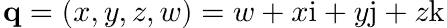

quaternion 은 네 개의 요소들로 구성되어 있다. i, j, k 는 다음의 조건을 만족한다. `i^2 = j^2 = k^2 = ijk = -1`, `ij = k, ji = -k` 이는 quaternion의 곱셈이 교환법칙을 만족하지 않는다는 뜻이 된다.

Quaternion 은 벡터 부분과 스칼라 부분으로 구분되기도 한다. 
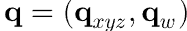

Quaternion 의 곱셈은 다음과 같이 정의된다.


 이를 벡터부분과 스칼라 부분으로 정리하면 다음과 같이 나타낼 수 있다.

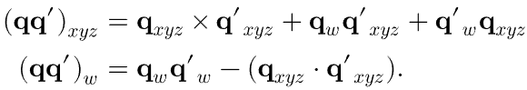

다음의 조건을 만족하는 quaternion 을 unit quaternion 이라고 한다.
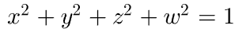

그리고 3차원 공간에서 단위 벡터 v에 대해 2 theta 만큼 회전한다면 이는 unit quaternion 과 매핑될 수 있다. (v sin(theta), cos(theta)) 그리고 이러한 특성으로 인해 점 p 에 대한 회전 변환은 다음과 같은 동차 좌표계 형식으로 나타낼 수 있다.

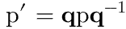

```c++
Quaternion &operator+=(const Quaternion &q) {
    v += q.v;
    w += q.w;
    return *this;
}
<<Quaternion Inline Functions>>= 
inline Float Dot(const Quaternion &q1, const Quaternion &q2) {
    return Dot(q1.v, q2.v) + q1.w * q2.w;
}
<<Quaternion Inline Functions>>+= 
inline Quaternion Normalize(const Quaternion &q) {
    return q / std::sqrt(Dot(q, q));
}
```

Quaternion 과 회전 변환 행렬간의 변경은 다음과 같이 나타낼 수 있다.

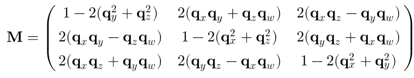

이 회전 변환에서 우리는 회전축 벡터 a와 각도 theta 를 구하여 선형 보간을 할 수 있다. 하지만 그 과정이 너무나도 복잡하고 많은 수의 연산을 필요로 하기 때문에 유용하진 않다. 따라서 우리는 Quaternion 의 선형 보간을 통해 문제를 해결할 것이다.

## 2.9.2 Quaternion interpolation

Quaternion 선형 보간은 spherical linear interpolation 사용한다. 이를 이용하면 다음과 같은 속성을 갖게 된다.
1. 보간된 회전 경로는 두 회전사이의 선형 보간중 가장 작은 값을 나타낸다.
2. 회전 보간은 일정한 각속도를 갖게 된다.

이를 수식으로 나타내면 0과 1 사이의 값 t, q1, q2 가 정해져 있을 때 다음과 같이 나타낼 수 있다.

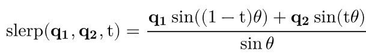

구면 선형 보간을 이해하기 위해선 다음과 같은 그림을 생각해 보자. 2차원 공간 상에서 우선 v0에 수직인 벡터 vh를 구한다. 이후 삼각함수를 적용하면 선형보간한 값인 v'을 얻을 수 있다. `v' = v0 cos(theta') + vh sin(theta')`

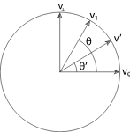

위 과정을 quaternion 상에 옮겨서 생각해보면 다음과 같이 정리할 수 있다.

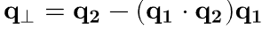

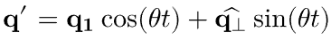

만일 두 quaternion 이 평행에 가까운 경우 선형보간시 오차가 발생할 수 있기 때문에 이 때는 별도의 선형보간을 하도록 한다.

```c++
<<Quaternion Method Definitions>>= 
Quaternion Slerp(Float t, const Quaternion &q1,
                 const Quaternion &q2) {
    Float cosTheta = Dot(q1, q2);
    if (cosTheta > .9995f)
        return Normalize((1 - t) * q1 + t * q2);
    else {
        Float theta = std::acos(Clamp(cosTheta, -1, 1));
        Float thetap = theta * t;
        Quaternion qperp = Normalize(q2 - q1 * cosTheta);
        return q1 * std::cos(thetap) + qperp * std::sin(thetap);
    }
}
```

## 2.9.3 Animated Transform implementation

Quaternion 기반의 시스템을 구축했다면 이제 키 프레임 사이의 선형 보간을 할 수 있다. pbrt 에서는 두 변환 행렬간의 선형 보간을 하기 위해서 Decompose 메소드를 이용해 하나의 키 프레임 행렬을 이동, 크기, 회전 변환 행렬로 나눈다.

```c++
<<AnimatedTransform Method Definitions>>= 
AnimatedTransform::AnimatedTransform(const Transform *startTransform,
        Float startTime, const Transform *endTransform, Float endTime)
    : startTransform(startTransform), endTransform(endTransform),
      startTime(startTime), endTime(endTime),
      actuallyAnimated(*startTransform != *endTransform) {
    Decompose(startTransform->m, &T[0], &R[0], &S[0]);
    Decompose(endTransform->m, &T[1], &R[1], &S[1]);
    <<Flip R[1] if needed to select shortest path>> 
    hasRotation = Dot(R[0], R[1]) < 0.9995f;
    <<Compute terms of motion derivative function>> 
}
<<AnimatedTransform Private Data>>= 
const Transform *startTransform, *endTransform;
const Float startTime, endTime;
const bool actuallyAnimated;
Vector3f T[2];
Quaternion R[2];
Matrix4x4 S[2];
bool hasRotation;
```

https://github.com/mmp/pbrt-v3/blob/13d871faae88233b327d04cda24022b8bb0093ee/src/core/transform.cpp#L395

변환의 곱셈의 경우 교환법칙이 성립하지 않는다. 때문에 decompose 를 하기 위해선 먼저 이동, 크기, 회전 변환의 곱셈에 대한 순서를 정의 해야 한다.

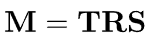

[Decompose](https://github.com/mmp/pbrt-v3/blob/13d871faae88233b327d04cda24022b8bb0093ee/src/core/transform.cpp#L1103)

```c++
<<AnimatedTransform Method Definitions>>+=  
void AnimatedTransform::Decompose(const Matrix4x4 &m, Vector3f *T,
        Quaternion *Rquat, Matrix4x4 *S) {
    <<Extract translation T from transformation matrix>> 
    <<Compute new transformation matrix M without translation>> 
    <<Extract rotation R from transformation matrix>> 
    <<Compute scale S using rotation and original matrix>> 
}
```

때문에 순서에 따라 decompose 는 T, R, S 순서로 이루어 진다.

```c++
<<Extract translation T from transformation matrix>>= 
T->x = m.m[0][3];
T->y = m.m[1][3];
T->z = m.m[2][3];
```

이동 변환 같은 경우 세 가지 요소만 봐도 되기에 간단하다. 그 이후에는 좌측 상단 3x3 행렬 부분만 고려하면 된다. 그 이후 회전 변환을 추출하기 위해서 polar decomposition 이라는 기술을 사용할 것이다. 

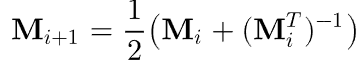

극분해는 재귀적으로 M을 역 전치행렬과 평균을 계산하여 회전행렬을 추출하는 방식이다. 행렬 M이 수렴할 때까지 반복한다면 그 수렴한 행렬 Mi는 회전 행렬 R 이 된다.

```c++
<<Extract rotation R from transformation matrix>>= 
Float norm;
int count = 0;
Matrix4x4 R = M;
do {
    <<Compute next matrix Rnext in series>> 
       Matrix4x4 Rnext;
       Matrix4x4 Rit = Inverse(Transpose(R));
       for (int i = 0; i < 4; ++i)
           for (int j = 0; j < 4; ++j)
               Rnext.m[i][j] = 0.5f * (R.m[i][j] + Rit.m[i][j]);

    <<Compute norm of difference between R and Rnext>> 
       norm = 0;
       for (int i = 0; i < 3; ++i) {
           Float n = std::abs(R.m[i][0] - Rnext.m[i][0]) + 
                     std::abs(R.m[i][1] - Rnext.m[i][1]) + 
                     std::abs(R.m[i][2] - Rnext.m[i][2]);
           norm = std::max(norm, n);
       }

    R = Rnext;
} while (++count < 100 && norm > .0001);
*Rquat = Quaternion(R);
```

이제 회전 변환 R을 구했기 때문에 R의 전치 행렬을 곱하여 크기 변환 행렬 S 또한 구할 수 있다.

모든 회전 행렬에는 대응하는 두 개의 unit 쿼터니언이 존재한다. 만일 두 회전 의 내적이 음수라면 그들 사이의 선형 보간 메서드는 최소 값을 반환하지 않는다. 이를 위해 한 요소를 역수로 전환해야 한다.

```c++
<<Flip R[1] if needed to select shortest path>>= 
if (Dot(R[0], R[1]) < 0)
    R[1] = -R[1];
```

이제 변환 행렬을 decompose 를 했기 때문에 두 프레임 사이의 선형보간이 가능해 졌다. 이동, 회전, 크기 변환에 대해 각각 선형보간하여 선형보간 행렬을 완성할 수 있다.
```c++
<<AnimatedTransform Method Definitions>>+=  
void AnimatedTransform::Interpolate(Float time, Transform *t) const {
    <<Handle boundary conditions for matrix interpolation>> 
    Float dt = (time - startTime) / (endTime - startTime);
    <<Interpolate translation at dt>> 
       Vector3f trans = (1 - dt) * T[0] + dt * T[1];

    <<Interpolate rotation at dt>> 
       Quaternion rotate = Slerp(dt, R[0], R[1]);

    <<Interpolate scale at dt>> 
       Matrix4x4 scale;
       for (int i = 0; i < 3; ++i)
           for (int j = 0; j < 3; ++j)
               scale.m[i][j] = Lerp(dt, S[0].m[i][j], S[1].m[i][j]);

    <<Compute interpolated matrix as product of interpolated components>> 
       *t = Translate(trans) * rotate.ToTransform() * Transform(scale);

}
```

## 2.9.4 Bounding moving bounding boxes

Pbrt 에서 렌더링을 하기 위해선 ray 와 bounding box 의 교차 여부 확인이 필요하다. 이때 애니메이션 시간 동안의 전체를 커버할 수 있는 bounding box 가 있다면 유용하다. 하지만 전체 프레임 동안의 bounding box 를 커버하는 bounding box 를 구하긴 쉽지 않다. 그러기에 몇 가지 전처리가 필요하다.

1. 만일 시작 변환과 끝 변환이 같다면 선형 보간이 일어날 필요는 없다.
2. 만일 시작 변환과 끝 변환 사이에 회전 변환이 없다면 단순히 시작 변환과 끝 변환 시 bounding box 의 union 으로 전체 bounding box 를 커버할 수 있다.

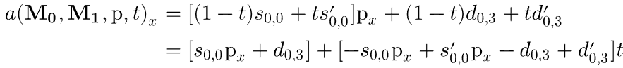

```c++
<<AnimatedTransform Method Definitions>>+=  
Bounds3f AnimatedTransform::MotionBounds(const Bounds3f &b) const {
    if (!actuallyAnimated)
        return (*startTransform)(b);
    if (hasRotation == false)
        return Union((*startTransform)(b), (*endTransform)(b));
    <<Return motion bounds accounting for animated rotation>> 
       Bounds3f bounds;
       for (int corner = 0; corner < 8; ++corner)
           bounds = Union(bounds, BoundPointMotion(b.Corner(corner)));
       return bounds;

}
```

일반적인 케이스 (회전 변환이 포함된 경우) bounding box 8개의 점을 기준으로 각각 극값을 갖게 된다. 결국 그 모든 극값을 커버할 수 있는 bounding box 영역을 계산한다면 변환이 일어나는 모든 영역에 대해 커버할 수 있을 것이다.

보통의 선형 방정식에서 극값을 갖는 경우는 해당 방정식의 미분값이 0일 때 갖게 된다. 회전 변환이 포함되어 있을 경우 quaternion 에 대한 계산이 들어가기 때문에 일반적인 시스템에서 미분방정식에 대한 해를 구하기는 쉽지 않다. 하지만 특정 점 a 에 대해서는 10개의 부동 소수점 연산만이 필요한 다음과 같은 식으로 표현이 가능하다.

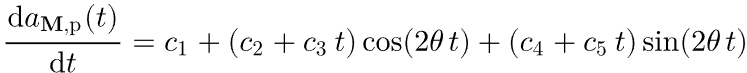

여기서 theta 는 두 quaternion 의 내적이고, 각각의 ci 들은 두 변환의 3개 벡터와 점 p 에 관련되어 있다. 

이제 여기서 
1. 주어진 키프레임 변환 행렬과 p 를 이용해 ci들을 계산하고.
2. 주어진 ci 값들과 theta 를 이용해 극값을 찾아야 한다.

먼저 각 point p 에 대한 ci 값들을 계산해야 한다. 다행히도 이는 다음과 같은 식으로 나타낼 수 있다.

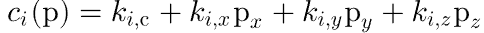

```c++
<<AnimatedTransform Private Data>>+=  
struct DerivativeTerm {
    DerivativeTerm(Float c, Float x, Float y, Float z)
        : kc(c), kx(x), ky(y), kz(z) { }
    Float kc, kx, ky, kz;
    Float Eval(const Point3f &p) const {
        return kc + kx * p.x + ky * p.y + kz * p.z;
    }
  };
```

이제 주어진 ci 값들을 이용해 각 point p 에 따라 극값들을 찾아야 한다. 

도함수의 값을 구하기는 대수적으로 불가능하다. 이를 해결하기 위해선 수치적 방법이 필요한데, 이분법 검색이나 뉴턴 method 를 이용해 찾을 수 있다. 여기서는 Interval arithmetic 을 사용할 것이다.

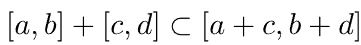

일반적으로 두 값을 더했을 때 각각 [a, b] 구간과 [c, d] 구간에 있다면 더한 값은 [a + c, b + d] 사이에 있기 마련이다.

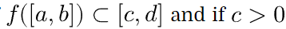

만약 위 조건을 만족할 경우 [a, b] 구간에서 함수 f 를 음수로 만드는 값은 없다는것을 알 수 있다. 이에 따라 위에 언급한 편미분 방정식의 구간을 계산하여 극값을 찾을 것이다.

만약 계산한 구간안에 극값이 존재할 경우 이분법 탐색을 이용해 극값이 있을 수 있는 구간을 좁히고, newton method 를 사용하여 값을 찾을 수 있을 것이다.

```c++
<<Interval Definitions>>+= 
void IntervalFindZeros(Float c1, Float c2, Float c3, Float c4,
        Float c5, Float theta, Interval tInterval, Float *zeros,
        int *zeroCount, int depth = 8) {
    <<Evaluate motion derivative in interval form, return if no zeros>> 
       Interval range = Interval(c1) +
           (Interval(c2) + Interval(c3) * tInterval) *
               Cos(Interval(2 * theta) * tInterval) +
           (Interval(c4) + Interval(c5) * tInterval) *
               Sin(Interval(2 * theta) * tInterval);
       if (range.low > 0. || range.high < 0. || range.low == range.high)
           return;

    if (depth > 0) {
        <<Split tInterval and check both resulting intervals>> 
           Float mid = (tInterval.low + tInterval.high) * 0.5f;
           IntervalFindZeros(c1, c2, c3, c4, c5, theta,
               Interval(tInterval.low, mid), zeros, zeroCount, depth - 1);
           IntervalFindZeros(c1, c2, c3, c4, c5, theta,
               Interval(mid, tInterval.high), zeros, zeroCount, depth - 1);

    } else {
        <<Use Newton’s method to refine zero>> 
           Float tNewton = (tInterval.low + tInterval.high) * 0.5f;
           for (int i = 0; i < 4; ++i) {
               Float fNewton = c1 +
                   (c2 + c3 * tNewton) * std::cos(2.f * theta * tNewton) +
                   (c4 + c5 * tNewton) * std::sin(2.f * theta * tNewton);
               Float fPrimeNewton =
                   (c3 + 2 * (c4 + c5 * tNewton) * theta) *
                       std::cos(2.f * tNewton * theta) +
                   (c5 - 2 * (c2 + c3 * tNewton) * theta) *
                       std::sin(2.f * tNewton * theta);
               if (fNewton == 0 || fPrimeNewton == 0)
                   break;
               tNewton = tNewton - fNewton / fPrimeNewton;
           }
           zeros[*zeroCount] = tNewton;
           (*zeroCount)++;

    }
}
```

# 2.10 상호작용


## 2.10.1 표면 교차

렌더링시 광선과 물체 표면의 교차 정보를 통해 표면에서의 음영 및 빛의 산란등을 계산 할 수 있다. 이를 계산하기 위해 SurfaceInteraction 클래스를 추상화 한다. 해당 클래스는 교차지점 p, 법선벡터 n을 갖고 있는 부모 클래스 Intersection 을 상속하고 있으며 각 요소의 편미분 값들도 멤버 변수로 소유하고 있다.

```c++
<<SurfaceInteraction Declarations>>= 
class SurfaceInteraction : public Interaction {
public:
    <<SurfaceInteraction Public Methods>> 
       SurfaceInteraction() { }
       SurfaceInteraction(const Point3f &p, const Vector3f &pError, const Point2f &uv,
           const Vector3f &wo, const Vector3f &dpdu, const Vector3f &dpdv,
           const Normal3f &dndu, const Normal3f &dndv,
           Float time, const Shape *sh);
       void SetShadingGeometry(const Vector3f &dpdu, const Vector3f &dpdv,
            const Normal3f &dndu, const Normal3f &dndv, bool orientationIsAuthoritative);
       void ComputeScatteringFunctions(const RayDifferential &ray,
           MemoryArena &arena, bool allowMultipleLobes = false,
           TransportMode mode = TransportMode::Radiance);
       void ComputeDifferentials(const RayDifferential &r) const;
       Spectrum Le(const Vector3f &w) const;

    <<SurfaceInteraction Public Data>> 
       Point2f uv;
       Vector3f dpdu, dpdv;
       Normal3f dndu, dndv;
       const Shape *shape = nullptr;
       struct {
           Normal3f n;
           Vector3f dpdu, dpdv;
           Normal3f dndu, dndv;
       } shading;
       const Primitive *primitive = nullptr;
       BSDF *bsdf = nullptr;
       BSSRDF *bssrdf = nullptr;
       mutable Vector3f dpdx, dpdy;
       mutable Float dudx = 0, dvdx = 0, dudy = 0, dvdy = 0;

};
```

```c++
<<SurfaceInteraction Method Definitions>>= 
SurfaceInteraction::SurfaceInteraction(const Point3f &p,
        const Vector3f &pError, const Point2f &uv, const Vector3f &wo,
        const Vector3f &dpdu, const Vector3f &dpdv,
        const Normal3f &dndu, const Normal3f &dndv,
        Float time, const Shape *shape)
    : Interaction(p, Normal3f(Normalize(Cross(dpdu, dpdv))), pError, wo,
                  time, nullptr),
      uv(uv), dpdu(dpdu), dpdv(dpdv), dndu(dndu), dndv(dndv),
      shape(shape) {
    <<Initialize shading geometry from true geometry>> 
       shading.n = n;
       shading.dpdu = dpdu;
       shading.dpdv = dpdv;
       shading.dndu = dndu;
       shading.dndv = dndv;

    <<Adjust normal based on orientation and handedness>> 
       if (shape && (shape->reverseOrientation ^
                     shape->transformSwapsHandedness)) {
           n *= -1;
           shading.n *= -1;
       }

}

```

