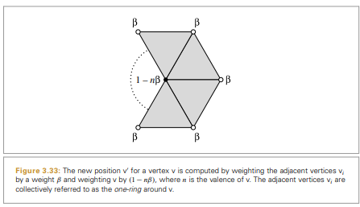
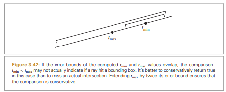

# 목차
### 3.8 세분 표면
### 3.9 반올림 오차 관리


# 3.8 세분 표면

특정 메시의 세분 표면은 반복적으로 메시의 면을 더 작은 면으로 세분하는 것으로 정의
이 장에선 `루프 세분 표면` 을 사용한다. 이는 삼각형 메시를 기반에 두고 이 삼각형을 세분하여 4개의 삼각형으로 만드는 방식이다.


이는 [shapes/loopsubdiv.h](https://github.com/mmp/pbrt-v3/blob/master/src/shapes/loopsubdiv.h), [shapes/loopsubdiv.cpp](https://github.com/mmp/pbrt-v3/blob/master/src/shapes/loopsubdiv.cpp) 에 구현되어 있음.
```c++

<LoopSuvdiv function Definitions> =
static std::vector<std::shared_ptr<Shape>> LoopSubdivide(
    const Transform *ObjectToWorld, const Transform *WorldToObject,
    bool reverseOrientation, int nLevels, int nIndices,
    const int *vertexIndices, int nVertices, const Point3f *p) {
    std::vector<SDVertex *> vertices;
    std::vector<SDFace *> faces;
    
	<Allocate LoopSubdiv verties and faces>
	<Set face to vertex pointers>
	<Set neighbor pointers in faces>
	<Finish vertex initializeation>
	<Refine subdivision mesh into triangles>
}
```

## 3.8.1 메시 표현

루프 세분 방법
1. 제어 메시가 세 면 이상이 같은 변을 공유하지 않는 다양체라고 가정
2. 닫힌 메시와 열린 메시 모두 지원
	- 닫힌 메시 - 경계가 없고, 모든 면은 각각의 변에 대해 근접한 면을 가지고 있음
	- 열린 메시 - 특정 면이 세 변에 대해 이웃을 갖지 않을 수도 있음.

삼각형 메시의 대부분의 정점은 6개의 면과 닿아 있고, 6개의 이웃 정점과 직접 변으로 연결되어 있음.
열린 메시의 가장자리의 대부분의 정점은 3개의 면과 4개의 정점과 닿아 있음.
`차수` - 정점에 직접 연결된 정점의 개수
`특이 정점` - 내부 정점들 중 차수가 6이 아닌 경우나 가장자리 정점의 차수가 4가 아닌 경우
`정규 정점` - 특이 정점이 아닌 정점

### 메시 표현을 위한 구조체 정의

세분 메시의 정점과 면을 위한 SDVertex 와 SDFace , SDEdge 구조체

```c++
struct SDVertex {
	// SDVertex Constructor
    SDVertex(const Point3f &p = Point3f(0, 0, 0)) : p(p) {}
    <SDVertex Methods>
    Point3f p;
    SDFace *startFace = nullptr;
    SDVertex *child = nullptr;
    bool regular = false; // 정점 정점 여부
	bool boundary = false; // 가장자리 여부
};

struct SDFace {
	// SDFace Constructor
	SDFace() {
		for (int i = 0; i < 3; ++i) {
			v[i] = nullptr;
			f[i] = nullptr;
		}
		for (int i = 0; i < 4; ++i) 
			children[i] = nullptr;
	}
	<SDFace Methods>
	SDVertex *v[3];
	SDFace *f[3];
	SDFace *children[4];
};

struct SDEdge {
	// SDEdge Constructor
	SDEdge(SDVertex *v0 = nullptr, SDVertex *v1 = nullptr) {
		// 메모리에 먼저 있는 정점이 v[0]가 되도록 정렬
		v[0] = std::min(v0, v1);
		v[1] = std::max(v0, v1);
		f[0] = f[1] = nullptr;
		f0edgeNum = -1;
	}
    // SDEdge Comparison Function
    bool operator<(const SDEdge &e2) const {
        if (v[0] == e2.v[0]) return v[1] < e2.v[1];
        return v[0] < e2.v[0];
    }
    SDVertex *v[2];
    SDFace *f[2];
    int f0edgeNum;
};

#define NEXT(i) (((i) + 1) % 3)
#define PREV(i) (((i) + 2) % 3)
```


각 삼각형의 면은 SDVertex 객체에 대한 포인터 v[i] 와 인접한 면에 대한 포인터 f[i]를 가짐
i 번째 변은 v[i] 에서 v[(i+1)%3]까지의 변이며, 이 변에 인접한 면은 f[i]


### 세분 메시 할당 및 초기화

SDVertex 는 메시의 각 정점에 대해 할당하고 SDFace 는 각 면에 대해 할당한 후 초기화
SDEdge 를 사용하여 SDFace 에서 이웃 변 포인터를 초기화

```c++
<Allocate LoopSubdiv verties and faces> =
	std::unique_ptr<SDVertex[]> verts(new SDVertex[nVertices]);
	for (int i = 0; i < nVertices; ++i) {
		verts[i] = SDVertex(p[i]);
		vertices.push_back(&verts[i]);
	}
	int nFaces = nIndices / 3;
	std::unique_ptr<SDFace[]> fs(new SDFace[nFaces]);
	for (int i = 0; i < nFaces; ++i) 
		faces.push_back(&fs[i]);


<Set face to vertex pointers> = 
	const int *vp = vertexIndices;
	for (int i = 0; i < nFaces; ++i, vp += 3) {
		SDFace *f = faces[i];
		for (int j = 0; j < 3; ++j) {
			SDVertex *v = vertices[vp[j]];
			f->v[j] = v;
			v->startFace = f;
		}
	}

<Set neighbor pointers in faces> =
	std::set<SDEdge> edges;
	for (int i = 0; i < nFaces; ++i) {
		SDFace *f = faces[i];
		for (int edgeNum = 0; edgeNum < 3; ++edgeNum) {
			// Update neighbor pointer for _edgeNum_
			int v0 = edgeNum, v1 = NEXT(edgeNum);
			SDEdge e(f->v[v0], f->v[v1]);
			if (edges.find(e) == edges.end()) {
				// Handle new edge
				e.f[0] = f;
				e.f0edgeNum = edgeNum;
				edges.insert(e);
			} 
			else {
				// Handle previously seen edge
				e = *edges.find(e);
				e.f[0]->f[e.f0edgeNum] = f;
				f->f[edgeNum] = e.f[0];
				edges.erase(e);
			}
		}
	}
```
### 초기화 계속


이웃 포인터를 가지고 있는 모든 면은 각 정점의 boundary 와 regular 여부를 설정
현재 정점 주변의 다음 면을 계속해서 탐색하여 시작한 면으로 돌아오게 된다면 현재 정점은 내부 정점이고, nullptr 이라면 현재 정점은 가장자리 정점이다.
그 후 정점의 차수를 계산하여 내부 정점의 차수가 6이거나 가장자리 정점의 차수가 4일 경우 정규 정점, 그 외의 경우 특이 정점으로 설정한다.


```c++
	struct SDEdge {
		...
		// SDFace Methods
		int vnum(SDVertex *vert) const {
			for (int i = 0; i < 3; ++i)
			if (v[i] == vert) return i;
			LOG(FATAL) << "Basic logic error in SDFace::vnum()";
			return -1;
		}
		SDFace *nextFace(SDVertex *vert) { return f[vnum(vert)]; }
	    SDFace *prevFace(SDVertex *vert) { return f[PREV(vnum(vert))]; }
	    SDVertex *nextVert(SDVertex *vert) { return v[NEXT(vnum(vert))]; }
	    SDVertex *prevVert(SDVertex *vert) { return v[PREV(vnum(vert))]; }
	    ...
    }
<LoopSubdiv Inline Functions> = 
	inline int SDVertex::valence() {
		SDFace *f = startFace;
		if (!boundary) {
			// Compute valence of interior vertex
			int nf = 1;
			while ((f = f->nextFace(this)) != startFace) ++nf;
			return nf;
		} 
		else {
			// Compute valence of boundary vertex
			int nf = 1;
			while ((f = f->nextFace(this)) != nullptr) ++nf;
			f = startFace;
			while ((f = f->prevFace(this)) != nullptr) ++nf;
			return nf + 1;
		}
	}

<Finish vertex initialization> = 
	for (int i = 0; i < nVertices; ++i) {
		SDVertex *v = vertices[i];
		SDFace *f = v->startFace;
		do {
			f = f->nextFace(v);
		} while (f && f != v->startFace);
		v->boundary = (f == nullptr);
		if (!v->boundary && v->valence() == 6)
			v->regular = true;
		else if (v->boundary && v->valence() == 4)
			v->regular = true;
		else
			v->regular = false;
	}
```


## 3.8.2 세분

여기선 초기화한 데이터를 가지고 루프 법칙에 따라 세분하여 TriangleMesh 를 생성

세분 단계의 반복
1. 현재 세분 단계의 모든 정점과 면에 대한 vertor를 생성
2. 새로운 정점 위치를 계산
3. 세분된 메시의 위상학정 표현 갱신


```c++
<Refine subdivision mesh into triangles> = 
	std::vector<SDFace *> f = faces;
	std::vector<SDVertex *> v = vertices;
	MemoryArena arena;
	for (int i = 0; i < nLevels; ++i) {
		//<Update f and v for next level of subdivision>
	}
	//<Push vertices to limit surface>
	//<Compute vertex tangents on limit surface>
	//<Create triangle mesh from subdivision mesh>
```

```c++
<Update f and v for next level of subdivision> =
	std::vector<SDFace *> newFaces;
	std::vector<SDVertex *> newVertices;
	//<Allocate next level of children in mesh tree>
	//<Update vertex positions and create new edge vertices>
	//<Update new mesh topology>
	//<Prepare for next level of subdivision>
```

### 새로운 정점 및 면 할당 및 초기화

자식 면에 대해 공간을 할당하고, 초기화 해준다. 
```c++
<Allocate next level of children in mesh tree> = 
	for (SDVertex *vertex : v) {
		vertex->child = arena.Alloc<SDVertex>();
		vertex->child->regular = vertex->regular;
		vertex->child->boundary = vertex->boundary;
		newVertices.push_back(vertex->child);
	}
	for (SDFace *face : f) {
		for (int k = 0; k < 4; ++k) {
			face->children[k] = arena.Alloc<SDFace>();
			newFaces.push_back(face->children[k]);
		}
	}

```

### 새 정점 위치의 계산

세분 메서드는 메시에서 모든 정점의 위치를 계산한다.
`짝 정점` - 이미 존재하는 정점
`홀 정점` - 쪼개진 변에 위치한 새 정점

짝 정점이 새로운 위치를 계산하는 방식은 4가지 경우가 존재한다. 
- 정규 or 특이 정점, 가장자리 or 내부

```c++
<Update vertex positions and create new edge vertices> =
	for (SDVertex *vertex : v) {
		if (!vertex->boundary) {
			// Apply one-ring rule for even vertex
			if (vertex->regular)
				vertex->child->p = weightOneRing(vertex, 1.f / 16.f);
			else
				vertex->child->p = weightOneRing(vertex, beta(vertex->valence()));
		} 
		else {
			// Apply boundary rule for even vertex
			vertex->child->p = weightBoundary(vertex, 1.f / 8.f);
		}
	}
```
#### 짝 정점 / 내부 정점 계산




내부 정점의 경우 강 정점에 인접한 정점의 집합을 받아 각 이웃 정점을 가중치 $\beta$ 로 설정하고, 가운데 있는 갱신하는 정점은 $1 - n\beta$(n은 정점의 차수)  로 설정한다. 

$\beta$의 경우 표면의 매끄러움을 보장하는 정점의 차수에 기반을 두고 계산한다.
- beta() 함수의 정규 내부 정점은 1/16 값을 사용.
- 그 외는 차수로 계산

```c++
inline Float beta(int valence) {
	if (valence == 3) return 3.f / 16.f;
	else return 3.f / (8.f * valence);
}

static Point3f weightOneRing(SDVertex *vert, Float beta) {
	int valence = vert->valence();
	Point3f *pRing = ALLOCA(Point3f, valence);
	vert->oneRing(pRing);
	Point3f p = (1 - valence * beta) * vert->p;
	for (int i = 0; i < valence; ++i) p += beta * pRing[i];
	return p;
}

void SDVertex::oneRing(Point3f *p) {
	if (!boundary) {
		SDFace *face = startFace;
		do {
			*p++ = face->nextVert(this)->p;
			face = face->nextFace(this);
		} while (face != startFace);
	} 
	else {
		...
	}
}
static Point3f weightBoundary(SDVertex *vert, Float beta) {
	int valence = vert->valence();
	Point3f *pRing = ALLOCA(Point3f, valence);
	vert->oneRing(pRing);
	Point3f p = (1 - 2 * beta) * vert->p;
	p += beta * pRing[0];
	p += beta * pRing[valence - 1];
	return p;
}

```
#### 짝 정점 / 가장자리 정점 계산


가장자리 정점의 경우 두 이웃의 가장자리 정점에만 기반을 두고 계산된다. 이를 위해 우선 이웃면들을 처음에는 가장자리에 있는 면까지 도달할 때까지 돌고 난 뒤 반대 방향으로 돌면서 정점을 저장한다.

그리고 가중치의 경우 정규/특이 정점에 상관없이 1/8 을 사용한다.

```c++
static Point3f weightBoundary(SDVertex *vert, Float beta) {
	int valence = vert->valence();
	Point3f *pRing = ALLOCA(Point3f, valence);
	vert->oneRing(pRing);
	Point3f p = (1 - 2 * beta) * vert->p;
	p += beta * pRing[0];
	p += beta * pRing[valence - 1];
	return p;
}

void SDVertex::oneRing(Point3f *p) {
	if (!boundary) {
		...
	} 
	else {
		// Get one-ring vertices for boundary vertex
		SDFace *face = startFace, *f2;
		while ((f2 = face->nextFace(this)) != nullptr) face = f2;
		*p++ = face->nextVert(this)->p;
		do {
			*p++ = face->prevVert(this)->p;
			face = face->prevFace(this);
		} while (face != nullptr);
	}
}
```

#### 홀 정점 계산


위 그림처럼 메시에서 각 면의 각 변에 대해 변을 분리하는 새로운 정점을 계산.
- 내부 변의 경우 새 정점은 변에서 끝의 두 정점과 인접한 면에 위치한 변을 지나는 두 정점의 가중치로 계산
- 각 면의 모든 세 변에 대해 반복하고, 이전에 보지 않은 변에 도달했을 때 edgeVerts map 에 대응하는 변에 새로운 홀 정점 저장
- 세분으로 추가되는 새 정점은 항상 정규 정점.
- 그림처럼 내부 정점의 경우 양 끝에 있는 두 정점의 가중치는 3/8, 변에 마주보는 두 정점의 가중치는 1/8. 변에 마주보는 두 정점은 otherVert()로 구함

```c++
struct SDFace {
    ...
    SDVertex *otherVert(SDVertex *v0, SDVertex *v1) {
        for (int i = 0; i < 3; ++i)
            if (v[i] != v0 && v[i] != v1) return v[i];
        LOG(FATAL) << "Basic logic error in SDVertex::otherVert()";
        return nullptr;
    }
    ...
};

std::map<SDEdge, SDVertex *> edgeVerts;
for (SDFace *face : f) {
	for (int k = 0; k < 3; ++k) {
		// Compute odd vertex on _k_th edge
		SDEdge edge(face->v[k], face->v[NEXT(k)]);
		SDVertex *vert = edgeVerts[edge];
		if (!vert) {
			// Create and initialize new odd vertex
			vert = arena.Alloc<SDVertex>();
			newVertices.push_back(vert);
			vert->regular = true;
			vert->boundary = (face->f[k] == nullptr);
			vert->startFace = face->children[3];
			// Apply edge rules to compute new vertex position
			if (vert->boundary) {
				vert->p = 0.5f * edge.v[0]->p;
				vert->p += 0.5f * edge.v[1]->p;
			} else {
				vert->p = 3.f / 8.f * edge.v[0]->p;
				vert->p += 3.f / 8.f * edge.v[1]->p;
				vert->p += 1.f / 8.f * face->otherVert(edge.v[0], edge.v[1])->p;
				vert->p += 1.f / 8.f * face->f[k]->otherVert(edge.v[0], edge.v[1])->p;
			}
			edgeVerts[edge] = vert;
		}
	}
}
```


### 메시 위상 갱신


세분된 메시의 위상적 포인터를 갱신하기 위한 4가지 주요 작업
1. 홀 정점의 SDVertex::startFace 포인터가 인접 면에서 하나의 포인터를 저장해야 한다.
2. 짝 정점의 SDVertex::startFace 포인터도 설정되어야 한다.
3. 새 면의 이웃 f[i] 포인터는 이웃면을 가리키게 설정되어야 한다.
4. 새 면 v[i] 포인터는 적절한 정점을 가리켜야 한다.

이 중 1 번의 경우 생성될 때 이미 초기화된 상태이다. 따라서 3가지 작업을 할 것이다.

```c++
<Update mew mesh topology> =
	<Update even vertex face pointers>
	<Update face neighbor pointers>
	<Update face vertex pointers>
```

정점이 startFace 의 i 번째 정점이라면 startFace 의 i 번째 자식 면에 인접하도록 보장된다.
```c++
<Update even vertex face pointers> =
	for (SDVertex *vertex : v) {
		int vertNum = vertex->startFace->vnum(vertex);
		vertex->child->startFace = vertex->startFace->children[vertNum];
	}
```

새로 생성된 면의 면 이웃 포인터가 갱신. 같은 부모의 자식 사이 이웃을 갱신하고, 다른 부모의 자식 이웃을 갱신하는 두 단계로 진행된다.
- 세분된 자식 면 중 내부 자식의 경우 항상 children[3] 에 저장된다. 
- k+1 번째 자식 면( k=0,1,2 )은 내부 면의 k 번째 변의 반대편이며, 내부 면은 k 번째 면의 k+1 번째 변을 마주한다.
- k 번째 자식의 k 번째 변을 설정하려면 부모 면의 k 번째 변을 찾은 후 그 변을 마주하는 이웃 부모 f2 를 찾음. 
	- f2 가 존재한다면 가장자리가 아니라는 의미로, 정점 v[k] 에 대한 이웃 부모 색인이 된다. 이 색인은 이웃 자식의 색인과 같음.

```c++
<Update face neighbor pointers> = 
	for (SDFace *face : f) {
		for (int j = 0; j < 3; ++j) {
			// Update children f pointers for siblings
			face->children[3]->f[j] = face->children[NEXT(j)];
			face->children[j]->f[NEXT(j)] = face->children[3];
			// Update children f pointers for neighbor children
			SDFace *f2 = face->f[j];
			face->children[j]->f[j] = f2 ? f2->children[f2->vnum(face->v[j])] : nullptr;
			f2 = face->f[PREV(j)];
			face->children[j]->f[PREV(j)] = f2 ? f2->children[f2->vnum(face->v[j])] : nullptr;
		}
	}
```


자식 면의 정점 포인터를 설정
- k 번째 자식 면( k=0,1,2 )에 대해 k 번째 정점은 자식 면에 인접한 짝 정점에 대응한다.
- 내부가 아닌 자식 면에 대해 하나의 짝 정점과 두 개의 홀 정점이 존재한다.
- 내부 자식 면의 경우 3개의 홀 정점이 존재한다.
- edgeVerts 를 사용해 홀 정점을 찾고 세 자식 면에 설정한다.
```c++
<Update face vertex pointers> =
	for (SDFace *face : f) {
		for (int j = 0; j < 3; ++j) {
			// Update child vertex pointer to new even vertex
			face->children[j]->v[j] = face->v[j]->child;
			// Update child vertex pointer to new odd vertex
			SDVertex *vert = edgeVerts[SDEdge(face->v[j], face->v[NEXT(j)])];
			face->children[j]->v[NEXT(j)] = vert;
			face->children[NEXT(j)]->v[j] = vert;
			face->children[3]->v[j] = vert;
		}
	}
```
 
세분 단계를 위한 모든 작업이 끝나면 새로 생성된 정점과 면을 f 와 v 배열로 이동한다.

```c++
<Prepare for next level subdivision> =
	f = newFaces;
	v = newVerteices;
```

### 한계 표면과 결과

세분 표면의 놀라운 특성 중 하나는 세분을 영원히 계속할 경우 얻을 수 있는 메시의 정점 위치를 계산하는 특별한 세분 법칙이 존재한다. 이 법칙을 적용해서 한계 표면의 위치를 계산한다.
- 가장자리 정점의 한계 법칙은 두 이웃 정점을 1/5, 중심 정점을 3/5 로 가중치를 준다.
- 내부 정점의 경우 정점의 차수에 기반을 둔 loopGamma() 를 사용한다.

```c++
inline Float loopGamma(int valence) {
	return 1.f / (valence + 3.f / (8.f * beta(valence)));
}

// Push vertices to limit surface
std::unique_ptr<Point3f[]> pLimit(new Point3f[v.size()]);
for (size_t i = 0; i < v.size(); ++i) {
	if (v[i]->boundary)
		pLimit[i] = weightBoundary(v[i], 1.f / 5.f);
	else
		pLimit[i] = weightOneRing(v[i], loopGamma(v[i]->valence()));
}
for (size_t i = 0; i < v.size(); ++i) 
	v[i]->p = pLimit[i];
```

정점 표면 법선을 가진 매끄러운 삼각형 메시를 생성하기 위해 한계 표면에 대한 평행하지 않는 한 쌍의 접선 벡터가 계산되고, 이를 통해 정확한 접선 벡터를 계산할 수 있다.


- 내부 정점에 대한 접선을 계산하기 위해 고리 정점은 $w_i$ 의 가중치를 가지고, 중심 정점은 0 의 가중치를 가진다.
	- 첫 접선 벡터 s 를 계산하기 위한 가중치는 $$w_i = cos(\frac{2 \pi i}{n}), n 은 정점의 차수$$
	- 두 번째 접선 t의 가중치는 $$w_i = sin(\frac{2 \pi i}{n}), n 은 정점의 차수$$

- 가장자리 정점의 접선
	- 종 접선 이라고 불리는 첫 접선은 두 이웃 가장자리 정점 사이의 접선으로 계산된다.
	- 횡 접선 이라고 불리는 두 번째 접선은 정점의 차수에 기반을 두고 계산한다. 
		- 중심 정점은 가중치 $w_c$, 고리 정점은 벡터 $(w_0, w_1, ..., w_{n-1}))$ 의 가중치를 갖는다.
		- 차수 5와 그 이상의 경우 $w_c = 0$ 이며, $$w_0 = w_{n-1} = sin\theta$$ $$w_i=(2cos\theta-2)sin(\theta i)$$ $$\theta = \frac{\pi}{n-1}$$
		
	

```c++
// Compute vertex tangents on limit surface
std::vector<Normal3f> Ns;
Ns.reserve(v.size());
std::vector<Point3f> pRing(16, Point3f());
for (SDVertex *vertex : v) {
	Vector3f S(0, 0, 0), T(0, 0, 0);
	int valence = vertex->valence();
	if (valence > (int)pRing.size()) pRing.resize(valence);
	vertex->oneRing(&pRing[0]);
	if (!vertex->boundary) {
		// Compute tangents of interior face
		for (int j = 0; j < valence; ++j) {
			S += std::cos(2 * Pi * j / valence) * Vector3f(pRing[j]);
			T += std::sin(2 * Pi * j / valence) * Vector3f(pRing[j]);
		}
	} 
	else {
		// Compute tangents of boundary face
		S = pRing[valence - 1] - pRing[0];
		if (valence == 2)
			T = Vector3f(pRing[0] + pRing[1] - 2 * vertex->p);
		else if (valence == 3)
			T = pRing[1] - vertex->p;
		else if (valence == 4)  // regular
			T = Vector3f(-1 * pRing[0] + 2 * pRing[1] + 2 * pRing[2] + (-1) * pRing[3] + (-2) * vertex->p);
		else
		{
			Float theta = Pi / float(valence - 1);
			T = Vector3f(std::sin(theta) * (pRing[0] + pRing[valence - 1]));
			for (int k = 1; k < valence - 1; ++k) {
				Float wt = (2 * std::cos(theta) - 2) * std::sin((k)*theta);
				T += Vector3f(wt * pRing[k]);
			}
			T = -T;
		}
	}
	Ns.push_back(Normal3f(Cross(S, T)));
}
```

마지막으로 코드 조각 [Create triangle mesh from subdivision mesh] 는 한계 표면의 삼각형화에 대응하는 Triangle 의 벡터를 초기화한다. 세분된 메시를 색인화된 삼각형 메시로 변환하는 과정임.


# 3.9 반올림 오차 관리

앞의 광선-모양 교차 알고리즘은 순수하게 실수에 기반을 둔 이상적인 산술 연산이었음.
하지만 컴퓨터의 경우 부동소수점 수를 사용하여 연산이 수행될 때마다 오차가 발생한다.
이 오차의 누적은 교차 테스트의 정확성에 대해 문제가 발생할 수 있다.
- 유효한 교차가 완전히 벗어날 수 있다.  계산된 교차점의 t 값이 실제로 정확한 값이 양수라도 음수일 수 있다. 더욱이 계산된 광선-모양 교차점이 실제 모양의 표면의 위이거나 아래일 수 있다. 
- 레이트레이싱에서는 생성된 광선을 고정된 `광선 입실론`값으로 오프셋하며, 광선 $p+td$에 대해 일부 $t_{min}$ 값보다 가까운 교차를 무시한다.
- 이 방식이 효율적으로 작동하려면 상당히 높은 $t_{min}$값이 필요하다. 하지만 큰  $t_{min}$값은 광선 원점이 상대적으로 원래 교차점에서 멀어지게 하며, 유효한 근접 교차를 놓지게 해서 정밀도를 떨어뜨린다.


## 3.9.1 부동소수점 산술

### 부동소수점 표현
부동소수점 수는 부호, 유효수, 지수로 표현한다. 32비트 float 을 부호 비트, 지수 8비트, 유효수에 23비트로 표현한다.
지수 $e_b$는 0 ~ 255 까지의 범위를 가진다.$$e_b=e - 127$$
유효수는 정규화된 부동소수점 값이 저장될 때 실제로24비트의 정밀도를 가진다. 유효수와 지수로 표현된 수가 정규화되면 유효수에서 앞의 0들이 없어지고 이는 유효수 앞의 수가 반드시 1이라는 것을 의미한다. 따라서 이 값은 저장할 필요가 없다.
최종적으로 주어진 부호 $s= +-1$, 유효수 $m$, 지수 $e$ 에 대해 부동소수점 값은 다음과 같다.
$$s \times 1.m \times 2^{e-127}$$
-  부동소수점 수 $6.5 = 1.111_{2} \times 2^2$
- $(1\times2^0+1\times2^{-1}+0\times2^{-2}+1\times2^{-3}) \times 2^2 = 1.625\times2^2=6.5$
- $e_b=2$ 이므로 $e=129=1000001_2$, $m=101000...000_2$

이 표현에서 내재된 정보는 두 근접한 2의 승수 안의 표현 가능한 인접한 float 사이의 간격은 범위에서 균일하다.
$[2^e,2^{e+1})$의 범위에서 공간은 $$2^{e-23}$$

1과 2사이의 부동소수점 값에 대해서 $e=0$ 이고, 부동소수점 값 사이의 간격은 $2^{-23}\approx1.19209...\times10^{-7}$이다.
이 간격은 또한 ulp (unit in last place)의 크기로 참조된다. ulp의 크기는 부동소수점 값에 대해 결정된다. ulp는 큰 수에 대해 작은 크기의 수에 비해서 크다.

부동소수점 수 $0 = s\times 0.0...0_2\times 2^{-127}$, 이 표현은 양의 0과 음의 0이 둘 다 존재한다.

시작 1 유효수 비트를 제거시 비정규화된 수의 표현이 가능하다. 시작 1이 항상 존재시 가장 작은 32비트 float 수는 다음과 같다. 
$$1.0...0_2\times2^{-127}\approx5.8774718\times10^{-39}$$
시작 1비트가 없으면 가장 작은 값은 다음과 같다. 
$$0.0...1_2\times2^{-126}=2^{-126}\times2^{-23}\approx1.4012985\times10^{-45}$$
이 작은 값은 아주 작은 값이 0으로 반내림되는 것을 막을 수 있음.
가장 큰 정규 부동소수점 값을 $e=254$이며 다음과 같다.
$$3.402823 \times10^{38}$$

최대 지수 $e=255$ 일 때,유효수 비트가 모두 0이면 부호 비트에 따라 양과 음의 무한대로 간주한다. 0이 아닌 유효수 비트는 특별한 NaN을 가진다.

### 유틸리티 루틴

부동소수점 값을 구성 비트로 해석해서 이가 표현하는 부동소수점 값을 실제 float 나 double 로 변환하는 것이 유용함.
이 변환은 부동소수점 값을 다음의 더 크거나 작은 표현 가능한 부동소수점 값으로 옮기는 함수의 구현에 사용된다.
```c++
// Global Inline Functions
inline uint32_t FloatToBits(float f) {
	uint32_t ui;
	memcpy(&ui, &f, sizeof(float));
	return ui;
}

inline float BitsToFloat(uint32_t ui) {
	float f;
	memcpy(&f, &ui, sizeof(uint32_t));
	return f;
}

inline float NextFloatUp(float v) {
	// Handle infinity and negative zero for NextFloatUp()
	if (std::isinf(v) && v > 0.) return v; // 양의 무한대
	if (v == -0.f) v = 0.f; // 음의 0 일시 양의 0으로 변환

	// Advance v to next higher float
	uint32_t ui = FloatToBits(v);
	if (v >= 0) ++ui; // 유효수 1 증가
	else --ui;
	return BitsToFloat(ui);
}

```

### 산술 연산
IEEE 754 는 부동소수점 산술 특성의 중요한 점을 보장한다. 특히 이는 더하기, 빼기, 곱하기, 나누기, 제곱근의 결과가 같은 입력에 대해 같은 결과를 보장하며, 부동소수점 수에서는 무한 정밀도 연산에서 처리된 기반 계산의 결과가 가장 가까운 값으로 나타난다. 
원 연산자를 사용해 부동소수점 산술 연산을 표기하고 sqrt 로 부동 소수점 제곱근을 표현하면 이 정밀도 보장을 다음과 같이 작성할 수 있다. `round(x)`는 실수를 가장 가까운 부동소수점 값으로 반올림하는 결과를 나타낸다.

$$
a\oplus b = round(a+b) \newline
a\ominus b = round(a+b) \newline 
a\otimes b = round(a*b)  \newline
a\oslash b = round(a/b)\newline
sqrt(a) = round(\sqrt a)
 \tag{3.7}
$$

이 반올림 오차의 경계는 또한 실수의 간격으로 표현될 수 있다. 더하기의 경우 반올림 결과는 특정 $e$에 대해 다음의 간격 안에 있다. 이 반올림으로 생겨난 오차의 양은 $a+b$에서의 부동소수점 간격의 반보다 클 수 없다.
$$
a\oplus b = round(a+b) \subset (a+b)(1 \pm\epsilon) \newline = [(a+b)(1 -\epsilon), (a+b)(1 +\epsilon)]
$$


32비트 float 에 대해 $a+b$에서의 부동소수점 간격은 ulp를 사용해서 $(a+b)2^{-23}$으로 제한할 수 있으며, 간격의 반은 $(a+b)2^{-24}$가 되므로, $\vert\epsilon\vert \leq 2^{-24}$ 이 돤다. 이 경계는 기계 입실론이 된다.

```c++
static PBRT_CONSTEXPR Float MachineEpsilon = std::numeric_limits<Float>::epsilon() * 0.5;
```
$$
a\oplus b = round(a+b) \subset (a+b)(1 \pm\epsilon_m) \newline = [(a+b)(1 -\epsilon_m), (a+b)(1 +\epsilon_m)]
$$

방정식 (3.7) 에서 다음과 같은 특성이 생긴다.

- $1 \otimes x  = x$
- $x \oslash x = x$
- $x \oplus 0 = x$
- $x \ominus x = 0$
- $2 \otimes x$ 와 $x \oslash 2$는 동일하다. 최종 계산 결과에 반올림이 적용 X
- $2^i$ 가 오버플로우하지 않을 경우 모든 정수 $i$에 대해 $x \oslash 2^i = x \otimes 2^{-i}$ 이다.


### 오차 전달
IEEE 부동소수점 산술의 보장을 사용하면 주어진 부동소수점 계산에서 오차를 분석하도록 한정짓는 방법의 개발이 가능

오차의 두 가지 측정인 절대와 상대가 이에 유용하다. 일부 부동소수점 계산을 처리하고 반올림된 결과  $\tilde{a}$ 를 얻으면  $\tilde{a}$ 와 실수 계산 사이의 차이 크기를 절대 오차 $\delta_a$ 라고 한다.
$$\delta_a = \vert \tilde{a} - a\vert$$
상대 오차 $\delta_r$ 은 정확한 결과에 대한 절대 오차의 비율이다. $a$ 가 0이 아니면 다음과 같다.
$$\delta_r = \vert \frac{\tilde{a}-a}{a}\vert =\vert \frac{\delta_a}{a}\vert$$
상대 오차의 정의를 사용해서 계산된 값 $\tilde{a}$ 를 정확한 결과 $a$ 의 변동으로 작성할 수 있다.
$$\tilde{a}=a\pm\delta_a=a(1\pm\delta_r)$$

예시로 a, b, c, d의 합 계산을 해보면 다음과 같다.

$$(((a\oplus b)\oplus c) \oplus d) \subset ((((a+b)(1\pm\epsilon_m))+c)(1\pm\epsilon_m)+d)(1\pm\epsilon_m) \newline = (a+b)(1\pm\epsilon_m)^3+c(1\pm\epsilon_m)^2+d(1\pm\epsilon_m).$$

$\epsilon_m$이 작기에 $\epsilon_m$의 더 높은 승은 추가적인 $\epsilon_m$으로 한정되며, 그러므로 $(1\pm\epsilon_m)^n$ 항을 다음과 같이 한정할 수 있다.
$$(1\pm\epsilon_m)^n \leq (1\pm(n+1)\epsilon_m)$$

이 경계는 더하기의 결과를 다음과 같이 단순화 한다.
$$(a+b)(1\pm4\epsilon_m)+c(1\pm3\epsilon_m) +d(1\pm2\epsilon_m) \newline
= a+b+c+d+[\pm4\epsilon_m(a+b)\pm3\epsilon_mc\pm2\epsilon_md]$$

각괄호 안의 항은 절대 오차를 제공한다. 이 크기는 다음으로 한정된다. 이때 $a+b$의 크기가 $d$ 에 비해 상대적으로 오차 경계에 큰 기여를 한다.
$$4\epsilon_m\vert a+b\vert \pm3\epsilon_m\vert c\vert +2\epsilon_m\vert d\vert$$

만약이 수식을 다음과 같이 연산을 한다고 하자.
$$((a\oplus b)\oplus (c \oplus d))$$ 
절대 오차 경계는 다음과 같이 된다.
$$3\epsilon_m \vert a+b \vert+3\epsilon_m \vert c+d \vert$$
이는 $\vert a+b \vert$가 상대적으로 크면 더 낮지만, 반대로 $\vert d \vert$가 상대적으로 크면 커진다.

#### 오차 경계 수정 Higham(2002, 3.1절)
다음과 같은 보존적 경계보다 더 밀접한 경계 결과 방식을 소개한다.
$$(1\pm\epsilon_m)^n \leq (1\pm(n+1)\epsilon_m)$$

만약 $(1\pm\epsilon_m)^n$이 있을 때, 이값은 $1+\theta_n$으로 한정되며, $\theta_n$은 $n\epsilon_m <1$이기만 하면 다음과 같다.
$$\vert \theta_n \vert \leq \frac{n\epsilon_m}{1-n\epsilon_m}$$
이 표현의 분모는 합리적인 $n$ 값에 대해 1보다 작기에 $n\epsilon_m$을 증가하면 보존적 경계를 얻을 수 있다. 
$$\gamma _n = \frac{n\epsilon_m}{1-n\epsilon_m}$$

```c++
inline Float gamma(int n) {
    return (n * MachineEpsilon) / (1 - n * MachineEpsilon);
}
```

4개 값의 합 오차에서 경계는 다음과 같이 다시 적을 수 있다.

$$
\vert a+b \vert\gamma_3 + \vert c \vert\gamma_2 + \vert d \vert\gamma_1
$$
이 방식의 장점은 $(1\pm\epsilon_m)^n$ 항의 몫이 $\gamma$로 한정될 수 있다.
다음과 같이 주어진 값에 대해 간격은 $(1\pm \gamma_{m+n})$ 으로 한정된다.
$$\frac{(1\pm\epsilon_m)^m}{(1\pm\epsilon_m)^n}$$

$$\frac{(1\pm\epsilon_m)^m}{(1\pm\epsilon_m)^n} \ne (1\pm\epsilon_m)^{m-n}$$


일부 계산에 대해 주어진 입력 자체도 일정량의 오차를 가진다. 이 오차가 기본 산술 연산으로 전달되는 것을 보면 다음과 같다. 주어진 두 값 $a(1\pm\gamma_i)$와  $b(1\pm\gamma_j)$는 각각 앞선 연산의 누적된 오차를 가지며, 이들의 곱을 생각해보면 다음과 같다.
$$a(1\pm\gamma_i) \otimes b(1\pm\gamma_j) \subset ab(1\pm \gamma_{i+j+1})$$

이 결과의 상대 오차는 다음으로 한정된다.
$$\vert \frac{ab\gamma_{i+j+1}}{ab} \vert = \gamma_{i+j+1}$$

그러므로 최종 오차는 대략 곱의 값에서 $(i+j+1)/2 ulp$ 이 된다. 나누기도 비슷하다.
하지만 더하기와 빼기의 경우 상대 오차가 상당히 증가할 수 있다.
$$a(1\pm\gamma_i) \otimes b(1\pm\gamma_j) $$
절대 오차는 $\vert a \vert \gamma_{i+1} + \vert b \vert \gamma_{j+1}$로 한정된다.
이때 $a$와 $b$의 부호가 같으면 절대 오차는 $\vert a+b \vert \gamma_{i+j+1}$로 한정되며, 상대 오차는 계산된 값 주변의 $(i+j+1)/2 ulp$ 이 된다.
하지만 부호가 다르면 상대오차는 상당히 커질 수 있다. $a \approx -b$ 인 경우 상대오차는 다음과 같다.
$$\frac{\vert a \vert \gamma_{i+1} + \vert b \vert \gamma_{j+1}}{a+b} \approx \frac{2\vert a \vert \gamma_{i+j+1}}{a+b}$$
이 상당한 상대 오차의 증가는 `재앙적 상쇄`라 불린다.


#### 실행 시간  오차 분석

실행 시간 오차 분석은 대수적으로 오차 경계를 처리하는 것에 대해 이 작업을 일부 연산이 수행될 때 컴퓨터가 처리하게 하는 방식이다.
이는  [efloat.h](https://github.com/mmp/pbrt-v3/blob/master/src/core/efloat.h) 에 정의되어 있다.

```c++
class EFloat {
public:
	// EFloat Public Methods
	EFloat() {}
	EFloat(float v, float err = 0.f) : v(v) {
	if (err == 0.) low = high = v;
	else {
		low = NextFloatDown(v - err);
		high = NextFloatUp(v + err);
	}
// Store high precision reference value in EFloat
#ifndef NDEBUG
	vPrecise = v;
	Check();
#endif  // NDEBUG

private:
	// EFloat Private Data
	float v, low, high;
#ifndef NDEBUG
	long double vPrecise;
#endif  // NDEBUG
}

float UpperBound() const { return high; }
float LowerBound() const { return low; }

float GetRelativeError() const {
	return std::abs((vPrecise - v) / vPrecise);
}

EFloat operator+(EFloat ef) const {
	EFloat r;
	r.v = v + ef.v;
#ifndef NDEBUG
	r.vPrecise = vPrecise + ef.vPrecise;
#endif  // DEBUG
	// Interval arithemetic addition, with the result rounded away from
	// the value r.v in order to be conservative.
	r.low = NextFloatDown(LowerBound() + ef.LowerBound());
	r.high = NextFloatUp(UpperBound() + ef.UpperBound());
	r.Check();
	return r;
}
```


## 3.9.2 보존적 광선-경계 교차

부동소수점 반올림 오차는 광선-경계 상자 교차 테스트가 광선이 실제로 상자에 교차했지만 놓치는 경우를 생성한다. 
3.1.2절의 광선-경계 상자 테스트는 연속된 광성-판 교차를 계산해 광선이 경계 상자에 들어가는 곳의 매개변수 $t_{min}$과 나가는 곳의 $t_{max}$를 찾는 데 기반을 둔다. $t_{min} < t_{max}$ 면 광선은 상자를 지나가며, 그렇지 않으면 지나가지 않는다.  계산된 $t_{min}$ 값이  $t_{max}$보다 순수하게 반올림 오류로 인해 크다면 교차 테스트는 잘못된 결과를 반환한다. 
점 x 에서 x축에 수직한 평면에 대한 광선 교차의 $t$ 값을 찾는 계산이 $t=(x-o_x)/d_x$ 이므로, 부동소수점 계산으로 표현하면 다음과 같다.

$$t=(x \ominus o_x)\otimes (1\oslash d_x) \subset \frac{x-o_x}{d_x}(1\pm \epsilon)^3$$
또한 다음을 얻는다.
$$t(1\pm \gamma_3)=\frac{x-o_x}{d_x}$$



계산된 결과 $t$ 와 정확한 결과 사이의 차이는 $\gamma_3 \vert t \vert$로 한정된다.
계산된 $t$ 값 주변의 완전히 정확한 $t$ 값을 한정하는 간격을 고려하면 각격이 중첩하는 경우가 문제임. 중첩하지 않으면 계산된 값의 비교는 정확한 결과를 준다. 간격이 중첩하면 실제 $t$값의 순서를 아는 것이 불가능해짐. 이 경우 비교를 수행하기 전에 $t_{max}$ 를 오차 경계의 두 배인 $2\gamma_3 t_{max}$ 로 증가시키면 이 경우 보존적으로 참을 반환하는 것이 보장됨.

```c++
// 3.1.2 절의 광선-경계 상자 교차 테스트 코드 수정
<Update tFar to ensure robust ray-bounds intersection> = 
	tFar *= 1 + 2 * gamma(3);
```

## 3.9.3 안정적 삼각형 교차

3.6.2절의 광선-삼각형 교차 알고리즘의 세부 사항은 광선이 부정확하게 두 개의 인접 삼각형의 공유되는 모서리나 정점에 교차를 생성하지 않고 지나가는 경우가 없게 했다. 이 보장이 있는 교차 알고리즘을 `밀폐됐다`고 한다.

## 3.9.4 교차점 오차 경계

반올림 오차를 분석하는 기계 장치를 적용해 계싼된 광성-모양 교차점 안의 절대 오차에 대한 보존적 경계를 유도해서 실제 표면 위의 교차점 포함이 보장된 경계 상자를 생성한다.


3D 교차점을 찾을 때 광선의 매개변수 방정식 $o+td$를 풀어서 표면에 광선이 교차하는 곳의 $t_{hit}$ 값을 얻어 충돌점 $p$를 $p=o+t_{hit}d$로 계산한다. $t_{hit}$가 오차 $\delta t$를 가지면 계산된 교차점 안의 오차를 한정할 수 있다.

 $x$ 좌표에 대해 생각해보면 다음과 같다.
 $$x = o_x \oplus (t_{hit}\pm \delta_t)\otimes d_x \newline
 \subset o_x \oplus (t_{hit}\pm \delta_t)d_x(1\pm\gamma_1) \newline
 \subset o_x (1\pm \gamma_1)+(t_{hit}\pm \delta_t)d_x(1\pm\gamma_1) \newline
 = o_x+t_{hit}d_x+[\pm o_x\gamma_1\pm \delta_t d_x\pm t_{hit}d_x\gamma_2\pm\delta_td_x\gamma_2] 
$$

오차 항은 다음으로 한정된다.
$$\gamma_1 \vert o_x \vert +\delta_t(1\pm \gamma_2)\vert d_x \vert + \gamma_2\vert t_{hit}d_x \vert  \tag{3.12}$$

이 방정식은 문제가 존재하여 상대적으로 큰 오차가 발생할 수 있다.
1. 계산된 교차점 $(ox, dx,t_{hit}d_x)$에서 오차에 기여하는 항의 크기는 교차점의 크기와 매우 다를 수 있다.
2. 광성 교차 알고리즘이 일반적으로 $t$ 값을 계산하기 위해 수십 부동소수점 연산을 수행하며, 이는 $\delta t$가 최소한 $\gamma_n t$의 크기일 거라 예상하게 되며, $n$은 수십 이상이 된다.


### 재투영 : 2차 곡면

광선-다각형 교차에 대해 계산된 첫 교차점을 두 번째 광선-평명 교차의 시작점으로 사용하는 방식이다. 두 번째 광선의 $t_{hit}$ 값은 거의 0 에 근접하므로, $t_{hit}$ 안의 절대 오류 크기는 매우 작아 이 값을 매개변수 광선 방정식에 사용하면 매우 가까운 점을 찾을 수 있다.
이 방식으로 계산된 두 번째 교차점이 표면의 평면에 더 가깝지만, 여전히 처음 계산된 교차점의 오차로 인한 오프셋으로 인해 오차를 갖게 된다. 이 방식은 가능한 가장 정확한 교차점에 비해 오프셋이 있지만, 표면에 대해 일정 거리 위나 아래로 떨어진 점보다 실제 표면에 매우 가깝게 계산된 교차점이 일반적으로 더 낫다.


계산적으로 비용이 들고 또한 계산된 $t$ 값에서 여전히 오차가 있는 완전한 재교차 계산의 처리보다 효과적인 방식은 계산된 교차점을 다시 표면에 재투영해서 개선하는 것이다. 

광선-구 교차를 고려해보면, 주어진 원점에 있는 반지름 $r$ 인 구에 대한 계산된 교차점 $p$에 대해 이 점을 계산된 점의 원점에서의 거리에 대한 구의 반경 비율로 크기 조절하여 구 표면에 재투영해 새로운 점 $p'=(x', y',z')$를 얻을 수 있다.

$$x'=x \frac{r}{\sqrt {x^2+y^2+z^2}}$$

부동소수점 계산은 다음과 같다.

$$
x'=x \otimes r \oslash sqrt((x \otimes x)\oplus(y \otimes y) \oplus (z \otimes z)) \newline
\subset \frac{xr(1\pm \epsilon_m))^2}{\sqrt{x^2(1\pm \epsilon_m)^3+y^2(1\pm \epsilon_m)^3+z^2(1\pm \epsilon_m)^2}(1\pm \epsilon_m)}\newline
\subset \frac{xr(1\pm\gamma_2)}{\sqrt{x^2(1\pm\gamma_3)+y^2(1\pm\gamma_3)+z^2(1\pm\gamma_2)}(1\pm\gamma_1)}
$$

이때, $x^2, y^2, z^2$가 모두 양수여서 제곱근의 항은 같은 $\gamma$항을 공유할 수 있다.
$$
x' \subset \frac{xr(1\pm\gamma_2)}{\sqrt{(x^2+y^2+z^2)(1\pm\gamma_4)}(1\pm\gamma_1)} \newline
= \frac{xr(1\pm\gamma_2)}{\sqrt{(x^2+y^2+z^2)}\sqrt{(1\pm\gamma_4)}(1\pm\gamma_1)} \newline
\subset \frac{xr(1\pm\gamma_2)}{\sqrt{(x^2+y^2+z^2)}}(1\pm\gamma_5)\newline
= x'(1\pm\gamma_5).
$$

그러므로 재투영된 $x$좌표의 절대오차는 $\gamma_5 \vert x \vert$로 한정되며, 2.5ulp 이하가 된다.

```c++
<Refine sphere intersection point> = 
	pHit *= radius/Distance(pHit, Point3f(0,0,0));
<Compute error bounds for sphere intersection> =
	Vector3f pError = gamma(5) * Abs((Vector3f)pHit);
```


### 매개변수 계산 : 삼각형

3.6.2절의 삼각형 교차 알고리즘은 3개의 모서리 함수 값 $e_0, e_1,  e_2$ 을 계산해 모두 같은 부호를 가지면 교차한다. 이 값은 다음의 무게중심 좌표를 찾는 데 사용할 수 있다.
$$b_i = \frac{e_i}{e_o+e_1+e_2}$$

삼각형 정점에서의 특성 $v_i$는 삼각형의 면에서 다음과 같이 보간될 수 있다.
$$v'=b_0v_0+b_1v_1+b_2v_2$$

이를 부동소수점 연산으로 나타내면 다음과 같다.

$$d = 1 \oslash (e_0+e_1+e_2) \newline \subset \frac{1}{(e_0+e_1)(1 \pm \epsilon_m)^2+e_2(1\pm \epsilon_m)}(1\pm \epsilon_m)$$
교차가 있을 시 모든 $e_i$ 는 동일한 부호를 갖게 되므로 다음과 같다.

$$d \subset \frac{1}{(e_0+e_1+e_2)(1 \pm \epsilon_m)^2}(1\pm \epsilon_m)\newline \subset \frac{1}{e_o+e_1+e_2}(1\pm \gamma_3).$$

이를 사용해 삼각형 안에서 모서리 함수 값에 대응하는 위치에 있는 $x$ 좌표의 보간을 고려하면 다음과 같다.

$$x' = ((e_0 \otimes x_0) \oplus (e_1 \otimes x_1) \oplus (e_2 \otimes x_2))\otimes d \newline 
\subset (e_0x_0(1\pm\epsilon_m)^3 + e_1x_1(1\pm\epsilon_m)^3 + e_2x_2(1\pm\epsilon_m)^2)d(1\pm\epsilon_m) \newline
\subset (e_0x_0(1\pm\gamma_4) + e_1x_1(1\pm\gamma_4) + e_2x_2(1\pm\gamma_3))d$$

d의 경계를 사용해서 다음과 같이 구할 수 있다. 
$$x'  \subset \frac{(e_0x_0(1\pm\gamma_7) + e_1x_1(1\pm\gamma_7) + e_2x_2(1\pm\gamma_6))}{e_0+e_1+e_2} \newline
= b_0x_0(1\pm\gamma_7)+b_1x_1(1\pm\gamma_7)+b_2x_2(1\pm\gamma_6)$$

따라서 최종적으로 계산된 $x'$ 값의 절대 오차는 다음의 간격 안이다. 이때 $b_2x_2$ 항의 $\gamma_6$ 는 $\gamma_7$ 차이가 매우 작아 대체함.
$$\pm b_0x_0\gamma_7 \pm b_1x_1\gamma_7\pm b_2x_2\gamma_7$$
이는 다음으로 한정됨.
$$\gamma_7(\vert b_0x_0\vert + \vert b_1x_1\vert+\vert b_2x_2\vert).$$

```c++
bool Triangle::Intersect(const Ray &ray, Float *tHit, SurfaceInteraction *isect,
                         bool testAlphaTexture) const {
...
// Compute error bounds for triangle intersection
	Float xAbsSum = (std::abs(b0 * p0.x) + std::abs(b1 * p1.x) + std::abs(b2 * p2.x));
	Float yAbsSum = (std::abs(b0 * p0.y) + std::abs(b1 * p1.y) + std::abs(b2 * p2.y));
	Float zAbsSum = (std::abs(b0 * p0.z) + std::abs(b1 * p1.z) + std::abs(b2 * p2.z));
	Vector3f pError = gamma(7) * Vector3f(xAbsSum, yAbsSum, zAbsSum);
...
}
```


#### 변환의 효과

계산된 교차점의 오차를 한정하기 위해 마지막으로 신경써야 하는 세부 사항은 변환의 효과로, 이는 추가적인 반올림 오차를 생성한다. pbrt 에서의 2차 곡면 Shape 는 광선-모양 교차 수행 이전에 월드 공간 광선을 물체 공간으로 변환하고, 계산된 교차점을 다시 월드 공간으로 돌린다. 
가능하면 광선의 좌표계 변환을 피하고 교차점을 찾는 것이 최선이다. 삼각형 정점을 월드 공간으로 변환하고 월드 공간 광선과 교차하는 것이 더 낫다.
다음은 누적 오차가 없는 정확한 점 $(x,y,z)$를 변환하면서 생성되는 오차를 고려하자. 주어진 4x4 요소의 $m_{ij}$로 표기하는 비투영 변환행렬과 변환된 점 $x'$는 다음과 같다.

$$x'=((m_{0,0}\otimes x)\oplus (m_{0,1}\otimes y)))\oplus ((m_{0,2}\otimes z)\oplus m_{0,3})\newline
\subset m_{0,0}x(1\pm \epsilon_m)^3+m_{0,1}y(1\pm \epsilon_m)^3+m_{0,2}z(1\pm \epsilon_m)^3+m_{0,3}(1\pm \epsilon_m)^2 \newline
\subset (m_{0,0}x + m_{0,1}y+ m_{0,2}z+m_{0,3})+\gamma_3(\pm m_{0,0}x \pm m_{0,1}y \pm m_{0,2}z \pm m_{0,3})\newline
\subset  (m_{0,0}x + m_{0,1}y+ m_{0,2}z+m_{0,3})\pm \gamma_3(\vert m_{0,0}x \vert+\vert m_{0,1}y \vert+\vert m_{0,2}z \vert+\vert m_{0,3}\vert)\newline$$

따라서 결과의 절대 오차는 다음으로 한정됨.
$$\gamma_3(\vert m_{0,0}x \vert+\vert m_{0,1}y \vert+\vert m_{0,2}z \vert+\vert m_{0,3}\vert)$$

```c++
template <typename T>
inline Point3<T> Transform::operator()(const Point3<T> &p, Vector3<T> *pError) const {
	T x = p.x, y = p.y, z = p.z;
	// Compute transformed coordinates from point _pt_
	T xp = (m.m[0][0] * x + m.m[0][1] * y) + (m.m[0][2] * z + m.m[0][3]);
	T yp = (m.m[1][0] * x + m.m[1][1] * y) + (m.m[1][2] * z + m.m[1][3]);
	T zp = (m.m[2][0] * x + m.m[2][1] * y) + (m.m[2][2] * z + m.m[2][3]);
	T wp = (m.m[3][0] * x + m.m[3][1] * y) + (m.m[3][2] * z + m.m[3][3]);

	// Compute absolute error for transformed point
	T xAbsSum = (std::abs(m.m[0][0] * x) + std::abs(m.m[0][1] * y) +
					std::abs(m.m[0][2] * z) + std::abs(m.m[0][3]));
	T yAbsSum = (std::abs(m.m[1][0] * x) + std::abs(m.m[1][1] * y) +
					std::abs(m.m[1][2] * z) + std::abs(m.m[1][3]));
	T zAbsSum = (std::abs(m.m[2][0] * x) + std::abs(m.m[2][1] * y) +
					std::abs(m.m[2][2] * z) + std::abs(m.m[2][3]));
	*pError = gamma(3) * Vector3<T>(xAbsSum, yAbsSum, zAbsSum);
	CHECK_NE(wp, 0);
	if (wp == 1) return Point3<T>(xp, yp, zp);
	else return Point3<T>(xp, yp, zp) / wp;
}
```

위의 식의 결과는 변환되는 점이 정확하다고 가정한다. 점 자체가 $\delta_x, \delta_y, \delta_z$ 로 한정되는 오차를 가지면 변환된 $x$ 좌표는 다음과 같다.

$$x' = (m_{0,0}\otimes(x\pm \delta_x)\oplus m_{0,1}\otimes(y\pm \delta_y))\oplus (m_{0,2}\otimes(z\pm \delta_z)\oplus m_{0,3}) \newline
= m_{0,0}(x\pm \delta_x)(1\pm \epsilon_m)^3 + m_{0,1}(y\pm \delta_y)(1\pm \epsilon_m)^3 + m_{0,2}(z\pm \delta_z)(1\pm \epsilon_m)^3 +m_{0,3}(1\pm \epsilon_m)^2.$$

따라서 다음으로 한정된 절대 오차 항을 얻을 수 있다.
$$(\gamma_3+1)(\vert m_{0,0}\vert+\vert \delta_x m_{0,1}\vert \delta_y+\vert m_{0,2}\vert \delta_z)+\gamma_3(\vert m_{0,0}x\vert+\vert m_{0,1}y\vert+\vert m_{0,2}z\vert+\vert m_{0,3}\vert)$$

```c++
template <typename T>
inline Point3<T> Transform::operator()(const Point3<T> &pt,
				const Vector3<T> &ptError,Vector3<T> *absError) const {
	T x = pt.x, y = pt.y, z = pt.z;
	T xp = (m.m[0][0] * x + m.m[0][1] * y) + (m.m[0][2] * z + m.m[0][3]);
	T yp = (m.m[1][0] * x + m.m[1][1] * y) + (m.m[1][2] * z + m.m[1][3]);
	T zp = (m.m[2][0] * x + m.m[2][1] * y) + (m.m[2][2] * z + m.m[2][3]);
	T wp = (m.m[3][0] * x + m.m[3][1] * y) + (m.m[3][2] * z + m.m[3][3]);
	absError->x = (gamma(3) + (T)1) * (std::abs(m.m[0][0]) * ptError.x + std::abs(m.m[0][1]) * ptError.y + std::abs(m.m[0][2]) * ptError.z) +
					gamma(3) * (std::abs(m.m[0][0] * x) + std::abs(m.m[0][1] * y) + std::abs(m.m[0][2] * z) + std::abs(m.m[0][3]));
	absError->y = (gamma(3) + (T)1) * (std::abs(m.m[1][0]) * ptError.x + std::abs(m.m[1][1]) * ptError.y + std::abs(m.m[1][2]) * ptError.z) +
					gamma(3) * (std::abs(m.m[1][0] * x) + std::abs(m.m[1][1] * y) + std::abs(m.m[1][2] * z) + std::abs(m.m[1][3]));
	absError->z = (gamma(3) + (T)1) * (std::abs(m.m[2][0]) * ptError.x + std::abs(m.m[2][1]) * ptError.y + std::abs(m.m[2][2]) * ptError.z) +
					gamma(3) * (std::abs(m.m[2][0] * x) + std::abs(m.m[2][1] * y) + std::abs(m.m[2][2] * z) + std::abs(m.m[2][3]));
	CHECK_NE(wp, 0);
	if (wp == 1.) return Point3<T>(xp, yp, zp);
	else return Point3<T>(xp, yp, zp) / wp;
}
```


## 3.9.5 안정적으로 생성한 광선 원점

계산된 교차점과 오차 범위는 공간의 영역을 경계하는 작은 3D 상자를 제공한다. 정확한 교차점이 반드시 상자 안에 있으며, 그러므로 표면은 반드시 상자를 지나간다.
이 상자를 가지고 표면을 떠나는 광선의 원점 위치가 항상 표면과 재교차를 하지 않게 할 수 있다.


위의 그림처럼 법선 방향으로 충분히 멀리 움직여 법선에 수직한 평면이 오차 경계 상자 밖에 있게하면 된다.
그림의 평면 방정식은 다음과 같다.
$$f(x,y,z)=n_xx+n_yy+n_zz$$
오차 경계 상자의 8개 모서리에 대해 $f(x,y,z)$의 최댓값을 찾아 오프셋을 얻을 수 있다. 오차 경계 상자가 $(\pm\delta_x,\pm\delta_y,\pm\delta_z)$로 주어지면 $f(x,y,z)$의 최댓값은 다음과 같다.
$$d=\vert n_x \vert \delta_x+\vert n_y \vert \delta_y+\vert n_z \vert \delta_z$$

```c++
inline Point3f OffsetRayOrigin(const Point3f &p, const Vector3f &pError, const Normal3f &n, const Vector3f &w) {
	Float d = Dot(Abs(n), pError);
	Vector3f offset = d * Vector3f(n);
	if (Dot(w, n) < 0) offset = -offset;
	Point3f po = p + offset;
	// Round offset point _po_ away from _p_
	for (int i = 0; i < 3; ++i) {
		if (offset[i] > 0) po[i] = NextFloatUp(po[i]);
		else if (offset[i] < 0) po[i] = NextFloatDown(po[i]);
	}
	return po;
}
```


그리고 오프셋 점을 계산할 때 반드시 반올림 오차를 처리해야 한다.  offset 이 p에 추가될 때 결과는 일반적으로 가장 가까운 부동소수점 값으로 반올림된다. 그러므로 그림과 같이 p를 향해 반내림돼서 결과 점이 오차 상자의 경계가 아닌 안에 있을 수 있다. 그러므로 오프셋 점은 p로부터 올림돼 상자 안에 있지 않도록 해야한다.


## 3.9.6 광선 원점 뒤의 교차의 회피

계산된 교차점의 오차를 한정함으로써 광선이  표면 위의 올바른 측에 있게 보장하는 광선 원점을 계산하였다. 하지만 두 번째 반올림 오차의 근원 역시 해결해야 함. 이는 광선-모양 교차에 대해 계산한 매개변수 $t$ 값의 오차다.

### 삼각형
3.6.2절의 광선-삼각형 교차 알고리즘은 최종 $t$ 값을 3개의 모서리 함수 값 $e_i$로 계산하고, 이를 사용해서 변환된 $z$좌표 $z_i$의 무게중심 가중 합을 계산할 수 있다.

$$t = \frac{e_0z_0+e_1z_1+e_2z_2}{e_0+e_1+e_2}$$
이 항들의 오차를 한정하고 그 후 최종 $t$ 값에서 보존적으로 양수인지 확인할 수 있다.

주어진 광선 $r$이 원점 $o$, 방향 $d$, 삼각형 정점 $p$를 가지면 투영된 $z$좌표는 다음과 같다.
$$z=(1 \oslash d_z)\otimes (p_z \ominus o_z)$$
삼각형 $p_i$에서 3개의 각 정점에 대한 $z_i$ 안의 최대 오차가 $\gamma_3 \vert z_i \vert$ 로 한정된다. 그러므로 이 오차의 최댓값을 취해 모든 $z$의 위치에서 보존적 오차의 최대 한도는 찾을 수 있다.
$$\delta_z=\gamma_3 max|z_i|$$

모서리 함수 값은 변환된 $x$와 $y$ 정점 위치에서 두 곱의 차이로 계산할 수 있다.

$$e_0 = (x_1 \otimes y_2)\ominus(y_1 \otimes x_2)\newline
e_1 = (x_2 \otimes y_0)\ominus(y_2 \otimes x_0)\newline
e_2 = (x_0 \otimes y_1)\ominus(y_0 \otimes x_1)$$

변환된 위치 $x_i$와 $y_i$의 오차 경계는 다음과 같다.
$$\delta_x = \gamma_5(max|x_i|+max|z_i|)\newline
\delta_y = \gamma_5(max|y_i|+max|z_i|)$$

모든 3개의 정점에 대한 최대 오차를 받으면 모서리 함수 안의 $x_i \otimes y_i$ 곱은 다음으로 한정된다.

$$(max|x_i|+\delta_x)(max|y_i|+\delta_y)(1\pm \epsilon_m)$$

절대 오차 경계는 다음과 같다.
$$\delta_{xy}=\gamma_2max|x_i|max|y_i|+\delta_ymax|x_i|+\delta_xmax|y_i| + ...$$

무시할 수 있는 고차 항 곱을 제거하면 모서리 함수의 두 x,y 항의 차이 오차는 다음으로 한정된다.
$$\delta_e  =2(\gamma_2max|x_i|max|y_i|+\delta_ymax|x_i|+\delta_xmax|y_i|)$$

다시 오차를 모든 $e_i$ 항에 대한 최대 오차를 구해서 한정하면 $t$ 식의 분자의 계산된 값 오차 경계는 다음과 같다.

$$\delta_t=3(\gamma_3max|e_i|max|z_i|+\delta_e max|z_i|+\delta_zmax|e_i|)$$

계산된 $t$ 값은 유효한 교차로 허용되기 위해 반드시 이 값보다 커야한다면 이는 반드시 양의 $t_i$값을 가진다.

```c++
bool Triangle::Intersect(const Ray &ray, Float *tHit, SurfaceInteraction *isect, bool testAlphaTexture) const 
{
	...
	// Ensure that computed triangle $t$ is conservatively greater than zero
	// Compute $\delta_z$ term for triangle $t$ error bounds
	Float maxZt = MaxComponent(Abs(Vector3f(p0t.z, p1t.z, p2t.z)));
	Float deltaZ = gamma(3) * maxZt;

	// Compute $\delta_x$ and $\delta_y$ terms for triangle $t$ error bounds
	Float maxXt = MaxComponent(Abs(Vector3f(p0t.x, p1t.x, p2t.x)));
	Float maxYt = MaxComponent(Abs(Vector3f(p0t.y, p1t.y, p2t.y)));
	Float deltaX = gamma(5) * (maxXt + maxZt);
	Float deltaY = gamma(5) * (maxYt + maxZt);

	// Compute $\delta_e$ term for triangle $t$ error bounds
	Float deltaE = 2 * (gamma(2) * maxXt * maxYt + deltaY * maxXt + deltaX * maxYt);

	// Compute $\delta_t$ term for triangle $t$ error bounds and check _t_
	Float maxE = MaxComponent(Abs(Vector3f(e0, e1, e2)));
	Float deltaT = 3 * (gamma(3) * maxE * maxZt + deltaE * maxZt + deltaZ * maxE) * std::abs(invDet);
	if (t <= deltaT) return false;

	...
}
```
