# 3장 - 1. Shape Class 시작 부터 삼각형까지
## 개요
3장에선 pbrt에서 원, 삼각형 같은 기본 shape들에 대해 어떻게 추상화를 구현했는 지를 설명한다.
 또한 pbrt에선 모양(Shape)/재질(Primitive) 같은 것들을 구분하여 추상화를 해놓았고, 각각 서로 신경쓰지 않아도 된다.
 렌더러도 마찬가지로 Shape과 Primitive에 대해 각각 함수호출을 하여 사용하면 된다.

## 3-1. 기본 모양 인터페이스
pbrt-v3에서 shape는 아래와 같이 생겼다. 이번 장에 없는건 설명 생략

```c++
class Shape {
  public:
    // Shape Interface
    Shape(const Transform *ObjectToWorld, const Transform *WorldToObject,
          bool reverseOrientation);
    virtual ~Shape();
    virtual Bounds3f ObjectBound() const = 0; // bbox
    virtual Bounds3f WorldBound() const;      // bbox

    // intersection func
    virtual bool Intersect(const Ray &ray, Float *tHit,
                           SurfaceInteraction *isect,
                           bool testAlphaTexture = true) const = 0;
    virtual bool IntersectP(const Ray &ray,
                            bool testAlphaTexture = true) const {
        return Intersect(ray, nullptr, nullptr, testAlphaTexture);
    }

    // get area
    virtual Float Area() const = 0;
    // <Shape Interfaces .. >

    // Public Datas
    const Transform *ObjectToWorld, *WorldToObject; // OC -> WC & WC -> OC transform mat
    const bool reverseOrientation; // normal vector가 뒤집혀야 하는 지의 여부를 알려준다.
    const bool transformSwapsHandedness;
};
```

### ObjectBound / WorldBound
경계상자 (BBox)를 각 좌표계별로 구하는 가상 함수이다.

### Intersect / IntersectP
이번 장에서 계속 다룰, 교차검증 함수이다. P가 붙은건 **predicate function** 라는 의미로, 법선벡터 및 편미분까지 하여 진짜 결과를 포인터에 리턴하는 intersect와 달리
 교차 여부만 판단하고 빠르게 리턴한다.

### Area
넓이 구하는 함수이다.

### Public data 설명
* const Transform *ObjectToWorld, *WorldToObject;
세상좌표계에서 물체좌표계, 그 반대에 대한 Matrix의 포인터이다.

* const bool reverseOrientation
normal vector가 기본 방향에서 뒤집혀야 하는 지의 여부를 알려준다.

* const bool transformSwapsHandedness
왼-오 좌표계 변환을 해야하는 지에 대한 여부를 알려준다.

## 3-1.1 경계
pbrt는 광선이 특정 입체를 지나느냐 안지나느냐로 해당 입체에 대해 연산을 수행하냐 안하냐로 나눈다.
 만약 경계 입체 (보통 BBox)를 지나지 않는다면, 보통 해당 입체안에 있는 모든 연산을 회피한다.

BBox는 6f로 저장된다.

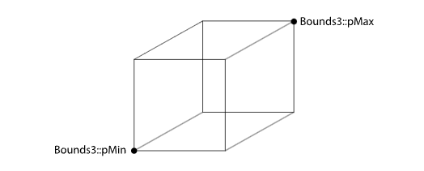

따라서 이 6f로 우선 연산을 하는 것이 굉장히 효율적인걸 알 수 있다.

또한 기본으로 제공되는 WC기준 BBox는 정확하지 않을 수 있어서, 만약 이를 조금 더 정밀하게 하려면 오버라이딩 해서 사용해야 한다.

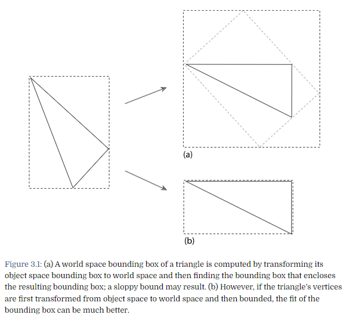

```c++
// 기본 함수 모양
Bounds3f Shape::WorldBound() const { return (*ObjectToWorld)(ObjectBound()); }
```

조금 더 정밀하게 하려면, BBox를 구한 뒤 WC로 보내는게 아닌 WC로 물체 좌표들을 보내어 해당 좌표로 BBox를 구하면 된다. (그림 참고)

## 3-1.2 광선-경계 교차
Ray와 BBox간의 교차 로직을 설명하는 챕터이다.

```cpp
class Ray{
    // Interfaces...

    // Ray Public Data
    Point3f o;
    Vector3f d;
    mutable Float tMax;
    Float time;
    const Medium *medium;
};

template <typename T>
inline bool Bounds3<T>::IntersectP(const Ray &ray, Float *hitt0,
                                   Float *hitt1) const {
    Float t0 = 0, t1 = ray.tMax;
    for (int i = 0; i < 3; ++i) {
        // Update interval for _i_th bounding box slab
        Float invRayDir = 1 / ray.d[i];
        Float tNear = (pMin[i] - ray.o[i]) * invRayDir;
        Float tFar = (pMax[i] - ray.o[i]) * invRayDir;

        // Update parametric interval from slab intersection $t$ values
        if (tNear > tFar) std::swap(tNear, tFar);

        // Update _tFar_ to ensure robust ray--bounds intersection
        tFar *= 1 + 2 * gamma(3);
        t0 = tNear > t0 ? tNear : t0;
        t1 = tFar < t1 ? tFar : t1;
        if (t0 > t1) return false;
    }
    if (hitt0) *hitt0 = t0;
    if (hitt1) *hitt1 = t1;
    return true;
}
```

```Ray``` 구조체는 ```Point``` 1개와 방향을 나타내는 ```Vector``` 로 구성된다

```IntersectP``` 는 교차 여부 판단 후 hitt0, hitt1 (hit한 t0, t1)에 ```Ray.o + t0 * Ray.d``` , ```Ray.o + t1* Ray.d``` 에 해당하는 계수를 주어 교차점을 리턴한다.

수식을 그림으로 보면 아래와 같은데,

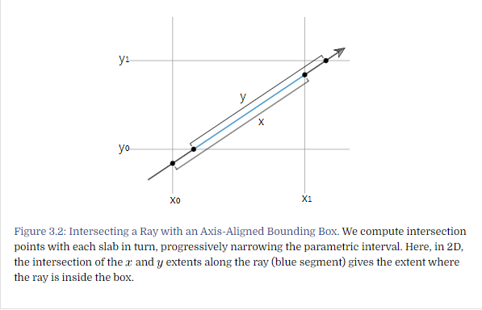

각 축에 해당하는 평면을 그어놓고, tnear, tfar를 갱신하는 구조이다.

만약 Ray가 box를 통과한다고 하면 tnear와 tfar가 대소관계를 유지하겠지만 아래와 같은 경우 near/far 크기 유지가 불가능하다.

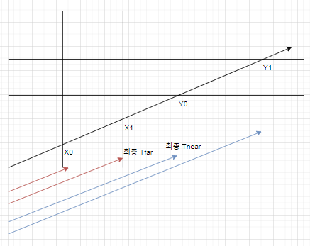

0과 1로 초기화된 Tnear, Tfar에 대해 BBox의 각 평면에 대해서 교점을 계산할 때 Tnear는 크면 갱신하고, Tfar는 더 작으면 갱신한다.

이 상관관계가 역전되면 교차하지 않는다고 판단하기 때문

또한
```c++
Float invRayDir = 1 / ray.d[i];
Float tNear = (pMin[i] - ray.o[i]) * invRayDir;
Float tFar = (pMax[i] - ray.o[i]) * invRayDir;
```
와 같은 수식을 사용하여 tNear / tFar를 갱신하고 있는데, 이는 BBox의 평면방정식과 관계가 있다.

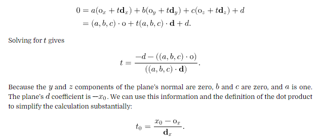

수식을 보면 알 수 있듯이, 축에 수직인 평면이기 때문에 (a,b,c) 가 굉장히 단순화 되고, 이를 통해 평면의 방정식을 간소화 시킬 수 있다.

두 번째 버전은 루프가 없고, invRayDir를 미리 받아 사용하는 버전인데 큰 차이는 없다.
```c++
inline bool Bounds3<T>::IntersectP(const Ray &ray, const Vector3f &invDir,
                                   const int dirIsNeg[3]) const {
    const Bounds3f &bounds = *this;
    // Check for ray intersection against $x$ and $y$ slabs
    Float tMin = (bounds[dirIsNeg[0]].x - ray.o.x) * invDir.x;
    Float tMax = (bounds[1 - dirIsNeg[0]].x - ray.o.x) * invDir.x;
    Float tyMin = (bounds[dirIsNeg[1]].y - ray.o.y) * invDir.y;
    Float tyMax = (bounds[1 - dirIsNeg[1]].y - ray.o.y) * invDir.y;

    // Update _tMax_ and _tyMax_ to ensure robust bounds intersection
    tMax *= 1 + 2 * gamma(3);
    tyMax *= 1 + 2 * gamma(3);
    if (tMin > tyMax || tyMin > tMax) return false;
    if (tyMin > tMin) tMin = tyMin;
    if (tyMax < tMax) tMax = tyMax;

    // Check for ray intersection against $z$ slab
    Float tzMin = (bounds[dirIsNeg[2]].z - ray.o.z) * invDir.z;
    Float tzMax = (bounds[1 - dirIsNeg[2]].z - ray.o.z) * invDir.z;

    // Update _tzMax_ to ensure robust bounds intersection
    tzMax *= 1 + 2 * gamma(3);
    if (tMin > tzMax || tzMin > tMax) return false;
    if (tzMin > tMin) tMin = tzMin;
    if (tzMax < tMax) tMax = tzMax;
    return (tMin < ray.tMax) && (tMax > 0);
}
```

## 3-1.3 교차 테스트
위 함수는 경계박스(BBox) 에 대한 ```intersect``` 함수들이었다. 지금부터 볼건, Shape내에 가상 함수로 선언되어있는 intersect 함수에 관한 이야기이다.

당연히 기본 Shape엔 선언만 되어있고, 책에서 구현에 몇가지 기준을 제시한다.
* Ray는 광선 **선분** 의 끝점인 **Ray::tMax**를 포함한다.
* 교차점을 찾으면 리턴은 함수리턴이 아닌 **tHit 포인터** 에 저장해준다.
* 교차점에 대한 정보(기하정보)는 SurfaceIntersaction 구조체에 저장된다 (2장) 마찬가지로 이것도 포인터로 리턴해준다.
  * 이녀석이 있어야 레이트레이서 구현에 있어서 음영진 부분 및 조명 부분(빛반사 등?)을 깔끔하게 처리한다고 한다.
* 계산 자체는 OC에서 계산되어야 해서 OC로 변환하고 넘어가고, 리턴의 경우는 WC기준이어야 하기 때문에 WC로 변환해주는 작업이 들어간다고 가정한다.
  * 근데 구현에 따라 좌표계가 Ray기준 좌표계기도 해서 이부분은 리턴만 WC로 해준다고 기억해도 될 것 같다.

또한 앞서 언급했듯이 intersectP는 여부만 판단하고 디테일한 리턴값은 모두 무시(연산안함)한다.

## 3-1.4 표면 면적
넓이 계산하는거 넣어야 한다는 얘기.

## 3-1.5 방향성
Z 테스트같은걸로 원래는 Fragment Shader로 넘길 때 후면에 있는 물체를 모두 제거했는데, RT는 특성상 그럴수가 없다는 얘기

## 3-2. 구

음함수 형식(변수 들이 서로 유기적으로 변경되는 함수, y = x+1이 아닌 -x + y = 1) 으로 표현하면 아래와 같다.

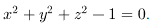

이를 구좌표로 표현하기 위해 그림을 아래와 같이 보도록 하자.

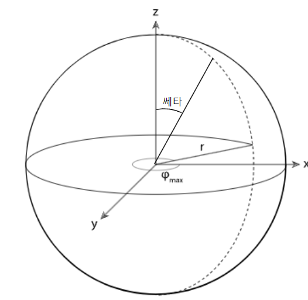

r은 1이라고 가정을 하면, 쎄타와 파이는 각각 아래와 같이 나오며, 이 값을 (u, v)[0, 1]에 매핑시킬 수 있다. (텍스쳐 매핑에 좋음)

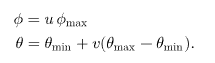

따라서 이런 장점들 때문에 각좌표를 사용하고, 생성자에도 반지름과 zmin, zmax 그리고 각도에 대해 저장한다.

## 3-2.1 경계
BBox는 아래와 같이 매우 간단하다.

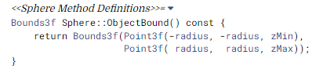

## 3-2.2 교차 테스트
앞서 말한대로 Shape의 Intersect는 보통OC에서 이루어진다. 여기서도 구의 중심을 원점으로 놓고, Ray의 교차여부를 판단한다.

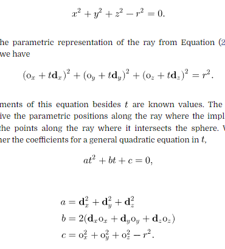

위 식을 보면 알 수 있듯이 구 방정식에서 Ray의 t에 대한 2차방정식을 만들 수 있다.

a, b, c도 Ray를 통해 모두 계산이 가능하니 이차방정식의 해만 구하면 t를 계산할 수 있고, 이 값에 대한 검증만 마치면 교차점을 찾을 수 있다.

다만 여기서 부동소수점 반올림 오차로 인해 ```EFloat```을 사용하는데, 일단은 Float과 동일하다고 본다.

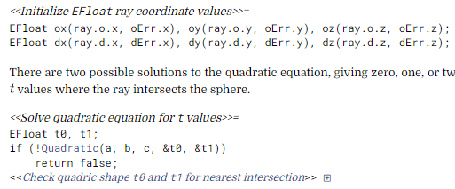

위 식에서 Quadratic은 t0, t1포인터에 각각 2차방정식의 근이 들어온다고 생각하면 된다.
 리턴은 T/F이고, 값은 포인터에 담아주는 형태이다. T/F는 실수해 여부에 따라 나뉜다.

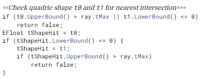

위 로직은 교차점 검증 부분인데, bound의 문제가 발생한다면 Ray가 여기선 선분이기 때문이다. 이런경우는 false처리를 해준다.

교차점이 나왔다면, pHit에 해당하는 점에 대해 구좌표 관점에서 검증을 해야 한다.
z에 해당하는 값을 테스트하면 쎄타를 테스트 하는 것과 같고, 실제 xy 평면상에서의 검증은 파이를 통해서 이루어진다.

파이(xy평면 내 각도)는 arctan y/x이다.

```c++
phi = std::atan2(pHit.y, pHit.x);
if (phi < 0) phi += 2 * Pi;
if ((zMin > -radius && pHit.z < zMin) ||
    (zMax < radius && pHit.z > zMax) || phi > phiMax)
    return false;
```

이후는 편미분 정보를 달아서 ```ShapeIntersection```을 만들어 주어 리턴값에 넣어준다. ```IntersectP```에는 포함되지 않는 부분이다.

쎄타와 파이를 u, v에 대응시킬 수 있고, 각 좌표는 아래와 같다.

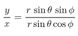

따라서 이에 대해 u, v로 미분시키는 것도 수행할 수 있다.

우선 u의 변화량에 따른 x값의 미분은

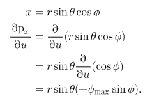

와 같으며, x, y정보를 알기 때문에

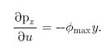

가 된다. 이렇게 u, v에 대해 각 좌표를 미분할 경우

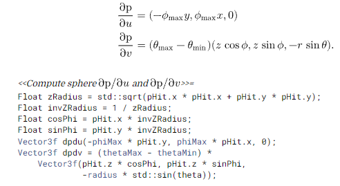

가 된다.

## 3-2.3 법선 벡터의 편미분.

u, v에 따라 점의 위치 변화도 알면 좋지만, 법선벡터의 변화량도 알면 유용하다. 무슨 미분 기하학 책을 써서 구할 수 있다곤 하는데, 여기까진 이해하기가 쉽지가 않았다.

결론만 놓고보면 법선 벡터에 대한 미분정보를 알 수 있다는 뜻이다.

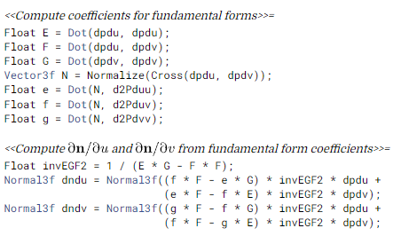

이걸 알아야 하는 이유는, ```SurfaceIntersection``` 초기화를 해주기 위함이다.


## 3-2.4 SurfaceIntersection 초기화

큰 내용은 없고, 포인터에 초기화 변수들을 넣어주면 된다.

## 3-2.5 표면 면적

적분을 통해 계산할 수 있다. 공간도형 복습이기도 하고 스킵..

## 3-3. 원기둥

이름이 원기둥이긴 한데, 위아래 평면이 없는 휴지심같은 모양이다.

모양과 방정식은 아래와 같이 표현된다.

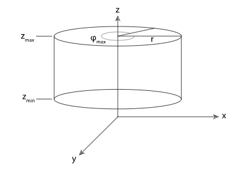

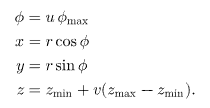

원점은 실린더 중심을 가로지르는 선분 위 어떤 점이고, 실린더 자체가 xy평면에 평행한다고 가정한다.

## 3-3.1 경계

BBox를 계산하는건 구와 마찬가지로 매우 간단하다.

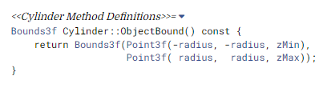

## 3-3.2 교차 테스트

순서는 z없이 2차원으로 바라봤을 때, 원 안에 들어오는 지 보고, 원 안에 들어온다면 (tHit을 구했다면) z범위 안에 들어오는 지 체크한다.

tHit 계산을 위한 2차방정식은 아래와 같이만든다.

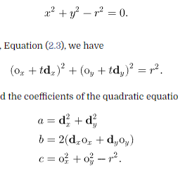

이후 파이를 계산한다.

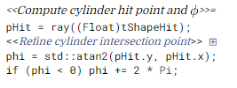

이후 z안에 포함되는지 + 각도가 넘어가진 않는치 체크한다.

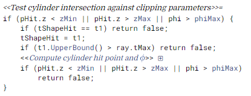

이후 편미분 정보를 포함시켜서 리턴포인터에 담아준다.

## 3-3.3 표면 면적

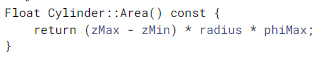

## 3-4. 원반

안쪽반지름, 바깥쪽반지름, 각도 총 3개로 이루어져있다. OC기준 xy축에 평행하다고 가정하며, z값에 따라 원점과 멀어지거나 가까워진다.

내부 반지름과 외부 반지름 사이의 값을 조절하는 v라는 매개변수를 통해 각 좌표는 아래와 같이 표현 가능하다.
 u는 [0, 1] 이다.

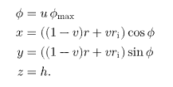

## 3-4.1 경계
BBox는 간단히 정의된다.

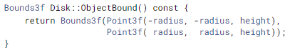

## 3-4.2 교차 테스트

앞서 실린더와 반대로, z값을 기준으로 우선 O부터 tMax까지의 선분이 z값 사이를 지나가는 지 판단하고, Ray가 원반이 속한 평면에 평행하는 지 확인한다.

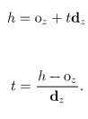

이후 평면에 만나는 점이 원반 내부에 속하는 지 확인한다. (R, Ri, 쌔타)

## 3-4.3 표면 면적

원의 넓이에 가운데 작은 원을 빼면 된다.

## 3-5. 기타 2차 곡면
책에 편미분 정도만 나와있긴 한데, 양도 얼마 안되고 복잡한 관계로 스킵한다..

## 3-6. 삼각형 메시
OpenGL에서 삼각형 데이터를 저장하는 방식과 동일하다.
 3개의 정점에 대한 배열의 인덱스 3개만 저장하는 것이다. 오일러-푸앵카레 공식으로 증명이 된다고 하는데, 이 부분은 이해가 잘 안된다.
 중복저장이 제거되니까 당연히 좋다고 생각하고 넘어가겠다.

이런 방식으로 저장하는 것은 당연히 텍스처, 법선벡터 등 공유자원이 있을수록 더 좋아진다.

따라서 생성자엔 특정 물체를 구성하는 삼각형들에 대한 메타정보 및 실제 정보가 들어가있다.
* ObjectToWorld: OC => WC 변환 행렬
* nTriangles: 삼각형 갯수
* vertexIndices: Vertex의 인덱스. pbrt에선 다음과 같이 쓰인다. P[vertexIndices[3*i]], P[vertexIndices[3*i+1]], and P[vertexIndices[3*i+2]].
* nVertices: 메쉬 내 정점 갯수
* P: An array of nVertices vertex positions.
* S: An optional array of tangent vectors, (음영 접선을 계산할 때 쓰인다.)
* N: An optional array of normal vectors,
* UV: 각 정점 별 매개변수 (u, v)값의 추가적인 배열
* alphaMask: 삼각형 표면 일부를 잘라내기 위한 데이터

## 3-6.1 삼각형
생성자 함수는 아래와 같다.

```c++
class Triangle {
  // methods...
  // public variables
    std::shared_ptr<TriangleMesh> mesh;
    const int *v;
    int faceIndex;
}

Triangle(const Transform *ObjectToWorld, const Transform *WorldToObject,
         bool reverseOrientation, const std::shared_ptr<TriangleMesh> &mesh,
         int triNumber)
    : Shape(ObjectToWorld, WorldToObject, reverseOrientation), mesh(mesh) {
    v = &mesh->vertexIndices[3 * triNumber];
    triMeshBytes += sizeof(*this);
    faceIndex = mesh->faceIndices.size() ? mesh->faceIndices[triNumber] : 0;
}
```

두 변환함수와 삼각형 법선벡터의 reverse여부, 매쉬의 포인터 그리고 삼각형 갯수가 들어온다.
 이후 버텍스의 인덱스 하나를 저장받고, triMeshBytes (메쉬의 바이트 크기) 와 faceIndex(뭔질 모르겠음) 설정을 한 뒤 생성자가 종료된다.

```c++
std::vector<std::shared_ptr<Shape>> CreateTriangleMesh(
    const Transform *ObjectToWorld, const Transform *WorldToObject,
    bool reverseOrientation, int nTriangles, const int *vertexIndices,
    int nVertices, const Point3f *p, const Vector3f *s, const Normal3f *n,
    const Point2f *uv, const std::shared_ptr<Texture<Float>> &alphaMask,
    const std::shared_ptr<Texture<Float>> &shadowAlphaMask,
    const int *faceIndices) {
    std::shared_ptr<TriangleMesh> mesh = std::make_shared<TriangleMesh>(
        *ObjectToWorld, nTriangles, vertexIndices, nVertices, p, s, n, uv,
        alphaMask, shadowAlphaMask, faceIndices);
    std::vector<std::shared_ptr<Shape>> tris;
    tris.reserve(nTriangles);
    for (int i = 0; i < nTriangles; ++i)
        tris.push_back(std::make_shared<Triangle>(ObjectToWorld, WorldToObject,
                                                  reverseOrientation, mesh, i));
    return tris;
}
```
위 코드는 인풋으로 들어온 데이터를 삼각형 메쉬로 변환하는 함수라고 한다. 포맷을 동일하게 유지시킨 뒤 넘겨주면 pbrt안에서 관리해준다.

## 3-6.2 삼각형 교차

삼각형 교차 테스트는 삼각형(OC)가 아닌 Ray의 좌표계를 기준으로 한다.
 공간 내 Ray에 대해 Ray의 원점이 좌표계의 원점이 되고, Ray의 방향벡터를 z축으로 놓고 교차 테스트를 한다.

삼각형의 정점 또한 이 좌표계로 변환되어야 한다.

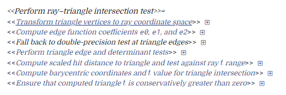

WC에서 OC(광선)로의 이동은 3가지 단계가 있다.
 이동 (T), 좌표 재배열(P), 크기(S)로 이루어져있다.
 이를 모두 합친 변환인 SPT 를 통해 이동한다.

우선 T는 매우 간단하다.

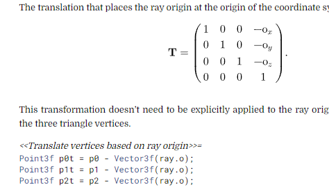

P변환은 길이가 가장 긴 축을 기준으로 좌표 재배열을 한다.


S변환은 해당 축을 기준으로 좌표 정렬을 한다. (해당 축이 z축이 되도록)

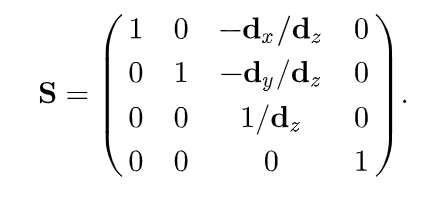

최종 형태는 아래와 같다.

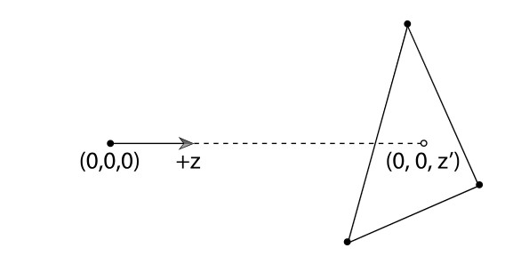

여기서 외적 개념을 사용하는데, 두 벡터의 외적은 평행사변형의 넓이와 같았다. absin(세타) 이기때문.

이를 좌표로 표현하면 두 벡터 A, B에 대해 (1/2)(AxBy - BxAy) = 삼각형의 넓이가 된다.

이를 응용해 삼각형 위에 어떤 점 P가 있다고 할 때, 각 모서리에 해당하는 벡터로부터 총 3개의 삼각형 함수를 만들어 볼 수 있다.

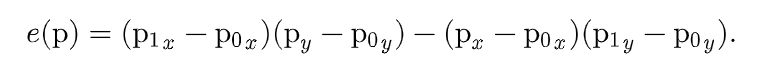

교점 P는 원점이므로 (z축에 있기 때문에) 수식을 변형하면 아래와 같이 모서리 별로 스칼라로 변형이 가능하다.

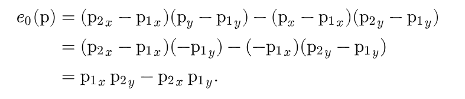

모든 스칼라가 양수거나 음수일 때, 원점이 이 삼각형 내부에 있다고 판단할 수 있다.