# 목차
#### 기본체 인터페이스와 기하학적 기본체
#### 집합체
#### 경계 입체 계층
#### k-d 트리 가속기
---

4장은 primitive 렌더링 가속을 위한 primitive 2진 트리를 소개하는게 주된 내용이다. 그에 대한 방법으로 BVH와 BSP 를 소개한다. 이 두가지 방법을 알려주기 이전에 메모리의 효율적인 사용을 위해 TransformedPrimitive 클래스와 Aggregate 클래스를 소개한다.

# 기본체 인터페이스와 기하학적 기본체

```c++
<<Primitive Declarations>>= 
class Primitive {
public:
    <<Primitive Interface>> 
       virtual ~Primitive();
       virtual Bounds3f WorldBound() const = 0;
       virtual bool Intersect(const Ray &r, SurfaceInteraction *) const = 0;
       virtual bool IntersectP(const Ray &r) const = 0;
       virtual const AreaLight *GetAreaLight() const = 0;
       virtual const Material *GetMaterial() const = 0;
       virtual void ComputeScatteringFunctions(SurfaceInteraction *isect,
           MemoryArena &arena, TransportMode mode,
           bool allowMultipleLobes) const = 0;

};
```

추상 Primitive 기본 클래스는 pbrt 기하 구조 처리와 음영 하부 시스템을 연결한다. 위의 추상 함수들을 차례로 설명하자면 다음과 같다.

1. 월드 공간에서 감싸는 bounding box, 이는 레이 트레이싱 가속 자료구조에 사용될 것이다.
2. 광선 교차 테스트, `Pirmitive::Intersect()`는 교차점을 찾으면 `Ray::tMax`값을 갱신한다.
3. 기본체 자체가 광원이면 area light 에 대한 포인터를 갖는다.
4. 기본체의 재질 인스턴스. 만일 `nullptr`라면 광선 교차는 무시됨.
5. 기본체 표면위에서의 빛 산란에 대한 설명

## 기하학적 기본체

```c++
<<GeometricPrimitive Declarations>>= 
class GeometricPrimitive : public Primitive {
public:
    <<GeometricPrimitive Public Methods>> 
       virtual Bounds3f WorldBound() const; // shape 의 WorldBound
       virtual bool Intersect(const Ray &r, SurfaceInteraction *isect) const;
       virtual bool IntersectP(const Ray &r) const;
       GeometricPrimitive(const std::shared_ptr<Shape> &shape,
               const std::shared_ptr<Material> &material,
               const std::shared_ptr<AreaLight> &areaLight,
               const MediumInterface &mediumInterface)
           : shape(shape), material(material), areaLight(areaLight),
             mediumInterface(mediumInterface) {
       }
       const AreaLight *GetAreaLight() const;
       const Material *GetMaterial() const;
       void ComputeScatteringFunctions(SurfaceInteraction *isect, MemoryArena &arena,
           TransportMode mode, bool allowMultipleLobes) const;

private:
    <<GeometricPrimitive Private Data>> 
       std::shared_ptr<Shape> shape;
       std::shared_ptr<Material> material;
       std::shared_ptr<AreaLight> areaLight; // 광원일 경우
       MediumInterface mediumInterface; // 기본체 안팎에서의 반투명 매질

};

<<GeometricPrimitive Method Definitions>>= 
bool GeometricPrimitive::Intersect(const Ray &r,
        SurfaceInteraction *isect) const {
    Float tHit;
    if (!shape->Intersect(r, &tHit, isect)) // shape 의 Intersect
        return false;
    // 이후에는 광선의 tMax 값을 변경하거나 충돌 primitive 갱신만 한다.
    r.tMax = tHit;
    isect->primitive = this;
    <<Initialize SurfaceInteraction::mediumInterface after Shape intersection>> 
       if (mediumInterface.IsMediumTransition())
           isect->mediumInterface = mediumInterface;
       else
           isect->mediumInterface = MediumInterface(r.medium);

    return true;
}

```

`GeometricPrimitive` 클래스는 구와 같은 하나의 모양을 나타낸다. 때문에 shape, material 에 대한 참조를 갖는다. 더해서 광원일 수도 있기 때문에 areaLight 참조도 갖고 있다.

`GeomtericPrimitive`의 다양한 메서드들은 단순히 `shape`의 값을 전달하거나 `material`, `areaLight`의 값을 전달하기만 한다.

## TransformedPrimitive 물체 인스턴싱과 애니메이션 기본체

```c++
<<TransformedPrimitive Declarations>>= 
class TransformedPrimitive : public Primitive {
public:
    <<TransformedPrimitive Public Methods>> 
       TransformedPrimitive(std::shared_ptr<Primitive> &primitive,
               const AnimatedTransform &PrimitiveToWorld)
           : primitive(primitive), PrimitiveToWorld(PrimitiveToWorld) { }
       bool Intersect(const Ray &r, SurfaceInteraction *in) const;
       bool IntersectP(const Ray &r) const;
       const AreaLight *GetAreaLight() const { return nullptr; }
       const Material *GetMaterial() const { return nullptr; }
       void ComputeScatteringFunctions(SurfaceInteraction *isect, MemoryArena &arena,
           TransportMode mode, bool allowMultipleLobes) const {
           Severe("TransformedPrimitive::ComputeScatteringFunctions() shouldn't be called");
       }
       Bounds3f WorldBound() const { 
           return PrimitiveToWorld.MotionBounds(primitive->WorldBound());
       }

private:
    <<TransformedPrimitive Private Data>> 
       std::shared_ptr<Primitive> primitive;
       const AnimatedTransform PrimitiveToWorld; // 월드 공간 -> 특정 인스턴스의 좌표계

};
```

`TransformedPrimitive` 클래스의 주된 역할은 `Primitive` 인터페이스와 실제 기본체의 포인터를 가진 `Primitive` 를 추가적인 변환 행렬의 효과를 고려해서 연결해 주는 것이다. 이를 활용하면 메모리 인스턴스의 효과적인 관리가 가능하다.

```c++
<<TransformedPrimitive Method Definitions>>= 
bool TransformedPrimitive::Intersect(const Ray &r, 
        SurfaceInteraction *isect) const {
    <<Compute ray after transformation by PrimitiveToWorld>> 
       Transform InterpolatedPrimToWorld;
       PrimitiveToWorld.Interpolate(r.time, &InterpolatedPrimToWorld);
       Ray ray = Inverse(InterpolatedPrimToWorld)(r);

    if (!primitive->Intersect(ray, isect))
        return false;
    r.tMax = ray.tMax;
    <<Transform instance’s intersection data to world space>> 
       if (!InterpolatedPrimToWorld.IsIdentity())
           *isect = InterpolatedPrimToWorld(*isect);

    return true;
}

```
때문에 `TransformedPrimitive::Intersect()` 에서는 광선을 인스턴스의 좌표계로 변환하여 충돌검사를 한다. 특히 교차점이 있다면 `SurfaceInteraction` 또한 월드 공간으로 변환되어야 한다.

# 집합체

가속 구조는 모든 레이트레이서의 핵심적 요소다. 광선 교차 검증의 시간을 줄일 수 있는 가장 핵심적인 요소는, 교차하지 않는 물체에 대한 교차 테스트를 하지 않는 것이다. 이와 관련해 공간 세분과 물체 세분이라는 두 가지 핵심 접근법이 있다.

공간 세분 알고리즘은 3D 공간을 영역으로 나누어 어떤 공간에 어떤 기본체가 있는지 저장한다. 어떤 공간을 광선이 교차하지 않는다면 공간에 존재하는 기본체들은 해당 광선과 교차 테스트를 하지 않는다. 대표적으로 GridAccel 과 KdTreeAccel 이 있다.

물체 세분은 장면의 물체들을 더 작은 집합으로 쪼개는 방법에 기반을 둔다. 예를들어 하나의 방은 벽, 천장, 의자로 쪼개질 수 있다고 하자. 만일 광선이 방의 경계상자와 교차하지 않는다면 모든 물체와 교차 테스트를 하지 않아도 된다. 그렇지 않다면 다시 벽, 천장, 의자의 경계 상자와 교차 테스트를 한다. 만일 의자와 교차한다고 가정한다면 다시 의자의 등받이, 의자 다리 등과 교차테스트를 진행하는 것이다. 대표적으로 BVHAceel 이 있다.

```c++
<<Aggregate Declarations>>= 
class Aggregate : public Primitive {
public:
    <<Aggregate Public Methods>> 
       const AreaLight *GetAreaLight() const;
       const Material *GetMaterial() const;
       void ComputeScatteringFunctions(SurfaceInteraction *isect,
           MemoryArena &arena, TransportMode mode, bool allowMultipleLobes) const;

};
```

`Aggregate` 클래스는 `Primitive` 객체를 묶기 위한 인터페이스를 제공한다.

# 경계 입체 계층(BVH)

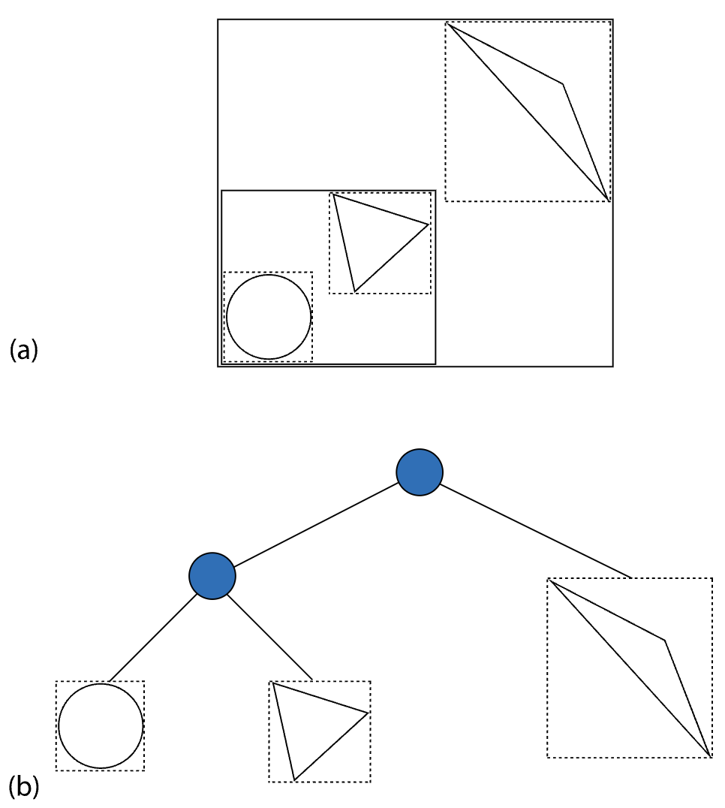

위 이미지는 단순한 BVH 를 보여준다. 기본체는 leaf 에 저장돼 있으며, 각 노드는 그 아래 노드에 있는 기본체의 bounding box 를 저장한다. 따라서 광선이 해당 tree 를 횡단할 때 노드의 bounding box 를 교차하지 않을 경우 하위 서브 트리는 탐색을 생략할 수 있다.

BVH 의 한가지 특성은 각 기본체는 모든 계층에서 한 번만 보인다는 것이다. 이 특성은 BVH 의 메모리 사양룡이 한정된다는 것을 암시한다. 이진 BVH 는 각 잎에 하나의 기본체를 저장하며, 전체 노드의 수는 n 이 기본체의 수일 때 2n-1 이며, n 잎 노드와 n-1 내부 노드가 존재한다.

 BVH 일반적으로 Kd tree 보다 트리 생성하는데 더 짧은 시간을 제공하지만, 교차 계산에 있어 kd tree 가 BVH 보다는 약간 더 빠르다. 하지만 BVH 는 kd tree 보다 수치적으로 더 안정적이다.

## BVH 생성

생성에는 세 가지 단계가 있다.
1. 먼저 기본체 에 대한 경계 정보가 계산되고, 트리 생성 동안 사용될 배열에 저장
2. splitMethod 에 선택된 알고리즘을 이용해 생성
3. 생성 과정에서 각 내부 노드가 자식에 대한 포인터를 갖고 있는데 마지막에는 포인터 없는 표현으로 변환된다.

 기본체를 나누어 BVH 를 생성하는 알고리즘에는 크게 4 가지가 있다.

```c++
<<BVHAccel Public Types>>= 
enum class SplitMethod { SAH, HLBVH, Middle, EqualCounts };
<<BVHAccel Local Declarations>>= 
struct BVHPrimitiveInfo {
    BVHPrimitiveInfo(size_t primitiveNumber, const Bounds3f &bounds)
        : primitiveNumber(primitiveNumber), bounds(bounds),
          centroid(.5f * bounds.pMin + .5f * bounds.pMax) { }
    size_t primitiveNumber;
    Bounds3f bounds;
    Point3f centroid;
};
<<BVHAccel Method Definitions>>= 
BVHAccel::BVHAccel(const std::vector<std::shared_ptr<Primitive>> &p,
         int maxPrimsInNode, SplitMethod splitMethod)
     : maxPrimsInNode(std::min(255, maxPrimsInNode)), primitives(p),
       splitMethod(splitMethod) {
    if (primitives.size() == 0)
        return;
    <<Build BVH from primitives>> 
       <<Initialize primitiveInfo array for primitives>> 
          std::vector<BVHPrimitiveInfo> primitiveInfo(primitives.size());
          for (size_t i = 0; i < primitives.size(); ++i)
              primitiveInfo[i] = { i, primitives[i]->WorldBound() };

       <<Build BVH tree for primitives using primitiveInfo>> 
          MemoryArena arena(1024 * 1024);
          int totalNodes = 0;
          std::vector<std::shared_ptr<Primitive>> orderedPrims;
          BVHBuildNode *root;
          if (splitMethod == SplitMethod::HLBVH)
              root = HLBVHBuild(arena, primitiveInfo, &totalNodes, orderedPrims);
          else
              root = recursiveBuild(arena, primitiveInfo, 0, primitives.size(),
                                    &totalNodes, orderedPrims);
          primitives.swap(orderedPrims);
          

       <<Compute representation of depth-first traversal of BVH tree>> 
          nodes = AllocAligned<LinearBVHNode>(totalNodes);
          int offset = 0;
          flattenBVHTree(root, &offset);
          

}
<<BVHAccel Private Data>>= 
const int maxPrimsInNode;
const SplitMethod splitMethod;
std::vector<std::shared_ptr<Primitive>> primitives;
```

1. 기본값인 SAH 는 '표면 면적 휴리스틱'에 기반을 둔 알고리즘을 사용
2. HLBVH 는 병렬화 가능하지만, SAH 만큼 효율적이진 않다.
3. 나머지 두 방식은 더 적은 계산을 하지만 상당히 비효율적이다.


### BVHBuildNode

```c++
<<BVHAccel Local Declarations>>+=  
struct BVHBuildNode {
    <<BVHBuildNode Public Methods>> 
       void InitLeaf(int first, int n, const Bounds3f &b) {
           firstPrimOffset = first;
           nPrimitives = n;
           bounds = b;
           children[0] = children[1] = nullptr;
       }
       void InitInterior(int axis, BVHBuildNode *c0, BVHBuildNode *c1) {
           children[0] = c0;
           children[1] = c1;
           bounds = Union(c0->bounds, c1->bounds);
           splitAxis = axis;
           nPrimitives = 0;
       }

    Bounds3f bounds;
    BVHBuildNode *children[2];
    int splitAxis, firstPrimOffset, nPrimitives;
};
```

BVH 생성 이후 반환되는 `BVHBuildNode`는 BVH 의 노드를 나타낸다. 이는 다음과 같은 특성이있다.
 - 상위 노드는 서브 트를 모두 포함하는 Bounding box 를 갖고 있다.
 - 두 자식을 나누는 좌표축도 저장한다.(횡단 아록리즘 성능 향상)
 - 어떤 기본체가 저장되어 있는지 `firstPrimOffset`, `nPrimitives`로 알 수 있다.
 - 잎 노드는 자식 노드가 `nullptr`이다.
 - Iterator 생성시 이미 자식 서브 트리에 대해 알고 있어야 한다.


### BVHAccel::recursiveBuild

```c++
<<BVHAccel Method Definitions>>+=  
BVHBuildNode *BVHAccel::recursiveBuild(MemoryArena &arena,
        std::vector<BVHPrimitiveInfo> &primitiveInfo, int start,
        int end, int *totalNodes,
        std::vector<std::shared_ptr<Primitive>> &orderedPrims) {
    BVHBuildNode *node = arena.Alloc<BVHBuildNode>();
    (*totalNodes)++;
    <<Compute bounds of all primitives in BVH node>> 
    Bounds3f bounds;
    for (int i = start; i < end; ++i)
        bounds = Union(bounds, primitiveInfo[i].bounds);

    int nPrimitives = end - start;
    if (nPrimitives == 1) {
        <<Create leaf BVHBuildNode>> 
        int firstPrimOffset = orderedPrims.size();
        for (int i = start; i < end; ++i) {
            int primNum = primitiveInfo[i].primitiveNumber;
            orderedPrims.push_back(primitives[primNum]);
        }
        node->InitLeaf(firstPrimOffset, nPrimitives, bounds);
        return node;

    } else {
        <<Compute bound of primitive centroids, choose split dimension dim>> 
        Bounds3f centroidBounds;
        for (int i = start; i < end; ++i)
            centroidBounds = Union(centroidBounds, primitiveInfo[i].centroid);
        int dim = centroidBounds.MaximumExtent();

        <<Partition primitives into two sets and build children>> 
        int mid = (start + end) / 2;
        // 모든 중심점이 같은 위치에 있는 경우
        if (centroidBounds.pMax[dim] == centroidBounds.pMin[dim]) {
            <<Create leaf BVHBuildNode>> 
            int firstPrimOffset = orderedPrims.size();
            for (int i = start; i < end; ++i) {
                int primNum = primitiveInfo[i].primitiveNumber;
                orderedPrims.push_back(primitives[primNum]);
            }
            node->InitLeaf(firstPrimOffset, nPrimitives, bounds);
            return node;

        } else {
            <<Partition primitives based on splitMethod>> 
            node->InitInterior(dim,
                               recursiveBuild(arena, primitiveInfo, start, mid,
                                              totalNodes, orderedPrims),
                               recursiveBuild(arena, primitiveInfo, mid, end,
                                              totalNodes, orderedPrims));
        }
    }
    return node;
}
```

 - 이 메서드는 `primitiveInfo[start]` 에서 `primitiveInfo[end-1]`까지 기본체의 부분집합을 나타내는 BVH 반환
 - 만일 잎 노드 생성 조건에 부합하면 잎 노드 생성후 반환
 - 그렇지 않을 경우 내부 노드 생성후 [start, mid) 와 [mid, end) 에 맞게 재정렬
 - `orderedPrims`배열은 초기에 비어 있고 잎 노드가 생성될 때 배열의 오프셋과 기본체 개수만 배열 끝네 저장


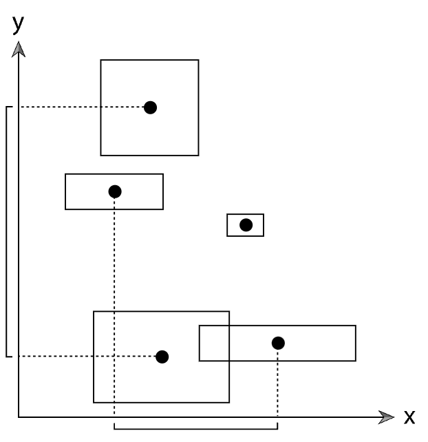

 내부 노드의 경우 두 자식 서브트리로 기본체 그룹을 나눠야 한다. n 개의 기본체에 대해서 일반적으로 2n - 2 가지가 있고 보통 하나의 좌표축을 기준으로 나누므로 총 6n가지의 분할 방법이 존재한다. 여기서는 전체 bounding box 에서 가장 큰 편차를 가진 축을 선택하도록 한다. 그리고 모든 중심점이 같은 위치에 있는 경우 잎 노드를 생성하기로 한다.

 `splitMethod`에 따라서 기본체를 분할하는 방법은 여러가지가 있지만 목적은 다음과 같다. **기본체 집합의 bounding box 가 너무 많이 겹치지 않게 한다.** 중대한 중첩이 있을 경우 트리 횡단 동안 서브 트리를 자주 횡단해야 하는 경우가 발생하기 때문에 겹치지 않게 잘 분리한 경우 계싼량이 효과적으로 줄어든다.

### Partition primitives through node's mid point

```c++
<<Partition primitives through node’s midpoint>>= 
Float pmid = (centroidBounds.pMin[dim] + centroidBounds.pMax[dim]) / 2;
BVHPrimitiveInfo *midPtr =
    std::partition(&primitiveInfo[start], &primitiveInfo[end-1]+1,
        [dim, pmid](const BVHPrimitiveInfo &pi) {
            return pi.centroid[dim] < pmid;
        });
mid = midPtr - &primitiveInfo[0];
if (mid != start && mid != end)
    break;
```

`midPoint` 를 이용해 두 서브트리를 생성하는 방법은 간단하다. `std::partition()` C++ 표준 라이브러리 함수를 이용하면 된다. 여기선 `midPoint`를 기준으로 위인지 아래인지에 따라 true, false 를 리턴하도록 하면 그 경계선의 요소를 포인터로 반환한다. 따라서 그 경계를 기준으로 재귀적으로 두 서브트리를 생성할 수 있다.

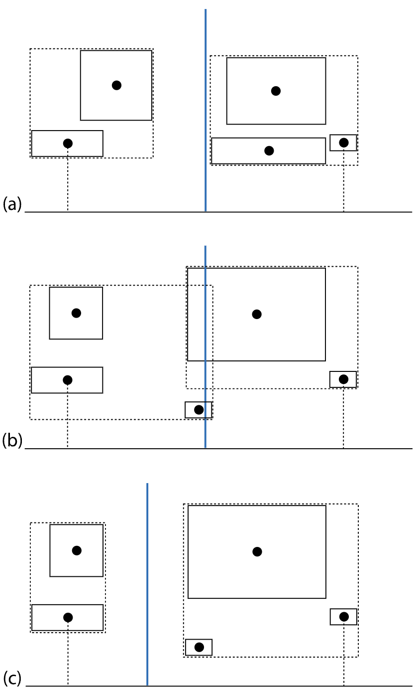

 하지만 위 사진으로 미루어 보아 축의 중간지점에 기반을 둔 기본체 분할시 (b) 와 같은 경우에 두 서브트리의 bounding box 가 겹치는 것을 볼 수 있다. 때문에 `midPoint`를 경계로 두 그룹을 나누는 것은 종종 적절하지 않다는 것을 알 수 있다.

### Partition primitives into equally-sized subsets

```c++
<<Partition primitives into equally sized subsets>>= 
mid = (start + end) / 2;
std::nth_element(&primitiveInfo[start], &primitiveInfo[mid], 
                 &primitiveInfo[end-1]+1,
    [dim](const BVHPrimitiveInfo &a, const BVHPrimitiveInfo &b) { 
        return a.centroid[dim] < b.centroid[dim];
    });
```

이 방식 역시 `std::nth_element()` C++ 표준 라이브러리 함수를 이용시 쉽게 구현이 가능하다. 이 순서 배치는 n 개의 요소에 대해 O(n)시간에 가능하며, 전체 배열을 정렬하는 O(n log n)보다 효율적이다. 하지만 이 경우에는 bounding box 크기를 고려하지 않기 때문에 광선 교차시 비 효율적일 수 있다.

## 표면 면적 휴리스틱(SAH)

레이 트레이싱 가속 구조 알고리즘은 대부분 다음과 같은 질문데 잘 기반을 두고 있다.
 - 어떤 수의 기본체 분할이 더 나은 Ray-Object intersection 을 위한 BVH 를 생성하는가?
 - 공간 세분 방식에서 어떤 가능한 공간을 나누는 위치들이 더 나은 가속 구조를 생성하는가?

SAH 모델은 **종합적인 광선 교차 테스트의 비용 =  노드 횡단 비용 + 기본체 분할에 대한 ray-object intersection 비용** 이라 가정하여 가장 최적의 해를 찾는다. SAH 의 비용 모델의 기반이 되는 개념은 단순하다. BVH, BSP 를 생성하는 어떤 지점에서도 현재 영역과 기하 구조에 대한 잎 노드를 생성할 수 있다.

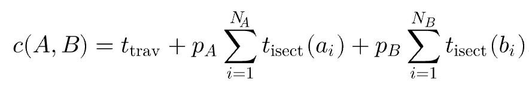

 - $t_{trav}$ 는 내부 노드를 횡단하고 어던 자식이 광선을 지나가는지 결정하는데 걸린 시간
 - $p_A$, $p_B$는 광선이 각 자식 노드를 지나가는 확률
 - $a_i$, $b_i$는 각 자식 노드의 기본체 색인, $N_A$, $N_B$는 자식 노드의 영역에 중첩되는 기본체의 수
 - pbrt 에선 단순 계산을 위해 $t_{isect}(i)$가 같다고 가정

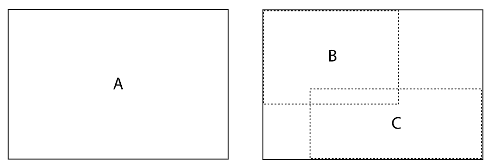

 - $p_A$, $p_B$는 기하학적확률에 의해 계산
 - 위 그림으로 미루어 보아 bounding box A 를 지나면서 bounding box B 를 지나는 확률은 $p(A|B) = s_A/s_B$ 와 같다.

```c++
<<Partition primitives using approximate SAH>>= 
if (nPrimitives <= 4) {
    <<Partition primitives into equally sized subsets>> 
    mid = (start + end) / 2;
    std::nth_element(&primitiveInfo[start], &primitiveInfo[mid], 
                     &primitiveInfo[end-1]+1,
        [dim](const BVHPrimitiveInfo &a, const BVHPrimitiveInfo &b) { 
            return a.centroid[dim] < b.centroid[dim];
        });

} else {
    <<Allocate BucketInfo for SAH partition buckets>> 
    constexpr int nBuckets = 12;
    struct BucketInfo {
        int count = 0;
        Bounds3f bounds;
    };
    BucketInfo buckets[nBuckets];

    <<Initialize BucketInfo for SAH partition buckets>> 
    for (int i = start; i < end; ++i) {
        int b = nBuckets * 
            centroidBounds.Offset(primitiveInfo[i].centroid)[dim];
        if (b == nBuckets) b = nBuckets - 1;
        buckets[b].count++;
        buckets[b].bounds = Union(buckets[b].bounds, primitiveInfo[i].bounds);
    }

    <<Compute costs for splitting after each bucket>> 
    Float cost[nBuckets - 1];
    for (int i = 0; i < nBuckets - 1; ++i) {
        Bounds3f b0, b1;
        int count0 = 0, count1 = 0;
        for (int j = 0; j <= i; ++j) {
            b0 = Union(b0, buckets[j].bounds);
            count0 += buckets[j].count;
        }
        for (int j = i+1; j < nBuckets; ++j) {
            b1 = Union(b1, buckets[j].bounds);
            count1 += buckets[j].count;
        }
        cost[i] = .125f + (count0 * b0.SurfaceArea() +
                           count1 * b1.SurfaceArea()) / bounds.SurfaceArea();
    }

    <<Find bucket to split at that minimizes SAH metric>> 
    Float minCost = cost[0];
    int minCostSplitBucket = 0;
    for (int i = 1; i < nBuckets - 1; ++i) {
        if (cost[i] < minCost) {
            minCost = cost[i];
            minCostSplitBucket = i;
        }
    }

    <<Either create leaf or split primitives at selected SAH bucket>> 
    Float leafCost = nPrimitives;
    if (nPrimitives > maxPrimsInNode || minCost < leafCost) {
        BVHPrimitiveInfo *pmid = std::partition(&primitiveInfo[start],
            &primitiveInfo[end-1]+1, 
            [=](const BVHPrimitiveInfo &pi) {
                int b = nBuckets * centroidBounds.Offset(pi.centroid)[dim];
                if (b == nBuckets) b = nBuckets - 1;
                return b <= minCostSplitBucket;
            });
        mid = pmid - &primitiveInfo[0];
    } else {
        <<Create leaf BVHBuildNode>> 
        int firstPrimOffset = orderedPrims.size();
        for (int i = start; i < end; ++i) {
            int primNum = primitiveInfo[i].primitiveNumber;
            orderedPrims.push_back(primitives[primNum]);
        }
        node->InitLeaf(firstPrimOffset, nPrimitives, bounds);
        return node;

    }

}
```
SAH 는 BVH 를 생성할 때 선택한 축에 대해 여러 후보 분할 중 SAH 비용 추산을 최소화하는 분할을 선택한다. 만일 적은 수의 기본체를 갖고 있는 경우 SAH 비용 계산은 의미가 없기에 `std::nth_element()`함수를 이용한다.

SAH 를 이용한 분할시 2n 가지의 분할에 대해 비용을 모두 계산하기 보다는 축을 따라 같은 크기의 범위를 갖는 bucket 으로 나눈뒤 버킷 경계에서의 분할을 고려한다. 이는 모든 분할으르 고려하는거솝다 효율적이면서 유사한 분할을 생성한다.

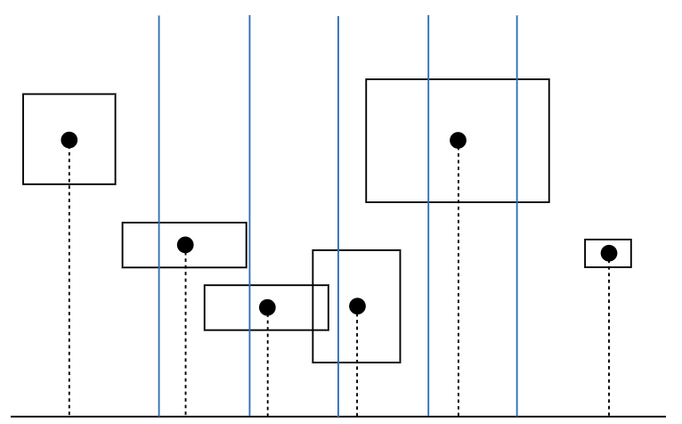

 - 각 기본체에서 중심점이 위치한 버킷을 결정
 - 각 버킷에서 기본체의 수와 모든 bounding box 계산
 - SAH 를 사용해 각 버킷의 경계로 분할시 비용 추산
 - 가장 최소 비용을 갖는 버킷 경계를 서브 트리의 경계로 선정
 - 만일 `minCost < leafCost` 이거나 `nPrimitives < maxPrimsInNode` 인 경우 partition 을 통해 버킷 경계로 트리 분할

## 선형 경계 입체 계층(LBVH)

SAH 를 이용해 BVH 생성시 두 가지 단점이 존재한다.
1. 모든 트리읟 단계에서 SAH 비용 계산시 기본체에 대한 많은 방복이 필요
2. 위에서 아래로의 BVH 생성은 병렬화가 어렵다. (하위 트리 생성시 병렬작업이 진행되지만, 그 전까지 상위 노드가 모두 생성되어야 가능)

LBVH 는 이런 문제를 해결하기 위해 만들어짐
 - 기본체에 대한 가벼운 수의 반복
 - 트리 생성 시간은 기본체에 수에 선형적
 - 알고리즘이 빠르게 개별 처리 가능한 클러스터로 기본체 분할 (병렬화 가능)
 - 핵심 개념은 BVH 생성을 정렬 문제로 변환! 이는 Morton code 에 기반을 둔다.

### 모톤 코드

모톤 코드는 n차원의 점을 명백한 순서가 있는 1D 선 위에 있는 근처의 점으로 연결한다. 기본체가 정렬된다면, 공간적으로 인접한 기본체의 클러스터는 정렬된 배열상에서 연속된 선분안에 있게 된다.

 - n차원 정수 좌표값에 대해서 2진수에서 떨어진 비트로 표현
 - 2D 좌표 (x, y) 라면 다음과 같이 모톤 코드 생성
 - ...$y_3$ $x_3$ $y_2$ $x_2$ $y_1$ $x_1$ $y_0$ $x_0$

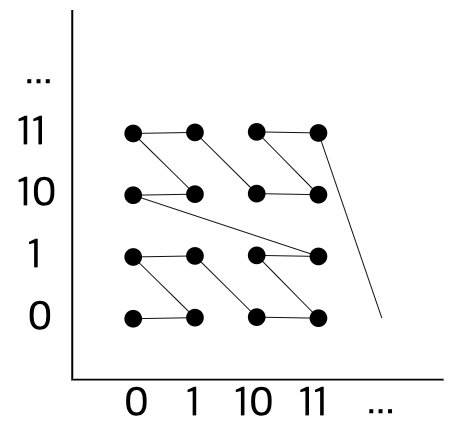

위 그림을 보면 인접한 좌표들의 점들이 모톤 곡선을 따라서 가까이 있는것을 알 수 있다.

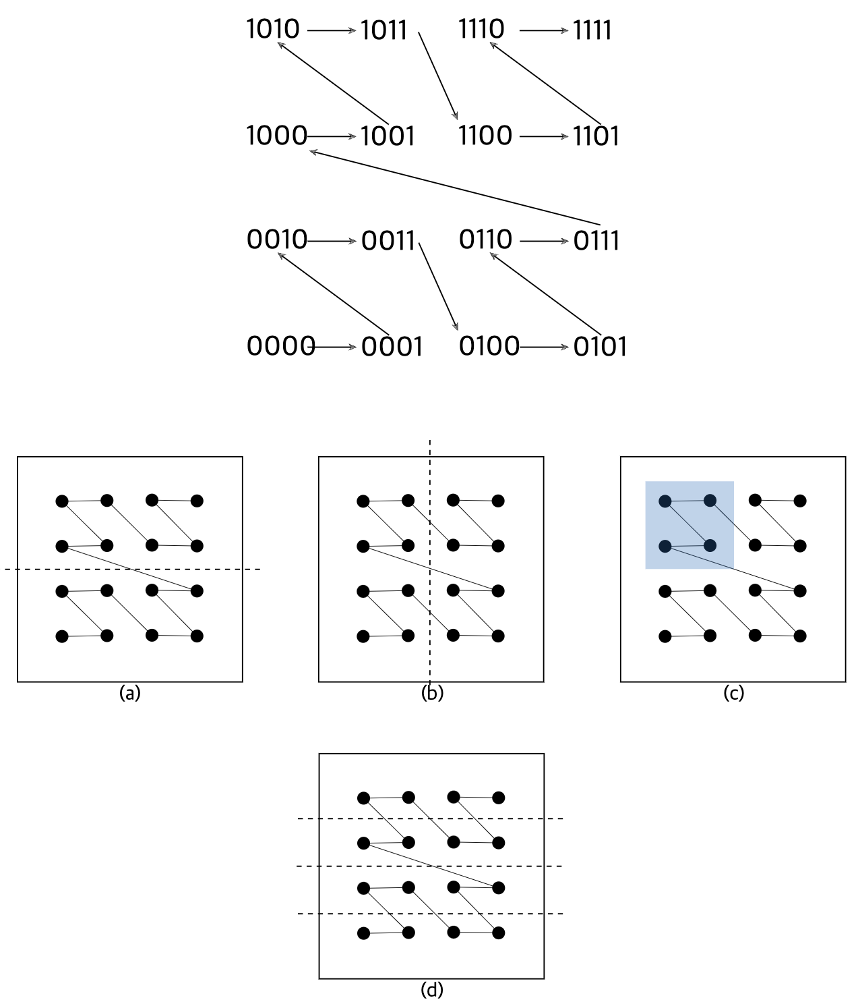

 - (a) 상위 비트$y_3$ 비트가 활성화 된 것으로 구분이 가능하다
 - (b) 상위 비트&x_3$ 비트가 활성화 된 것으로 구분이 가능하다
 - (c) 상위 비트$y_3$, $x_3$ 로 인접 공간끼리 클러스터링이 가능하다.
 - (d) $y_2$ 의 밗은 y 축을 4개의 영역으로 나눈다.

```c++
<<BVHAccel Method Definitions>>+=  
BVHBuildNode *BVHAccel::HLBVHBuild(MemoryArena &arena, 
        const std::vector<BVHPrimitiveInfo> &primitiveInfo,
        int *totalNodes,
        std::vector<std::shared_ptr<Primitive>> &orderedPrims) const {
    <<Compute bounding box of all primitive centroids>> 
       Bounds3f bounds;
       for (const BVHPrimitiveInfo &pi : primitiveInfo)
           bounds = Union(bounds, pi.centroid);

    <<Compute Morton indices of primitives>> 
       std::vector<MortonPrimitive> mortonPrims(primitiveInfo.size());
       ParallelFor(
           [&](int i) {
               <<Initialize mortonPrims[i] for ith primitive>> 
                  constexpr int mortonBits = 10;
                  constexpr int mortonScale = 1 << mortonBits;
                  mortonPrims[i].primitiveIndex = primitiveInfo[i].primitiveNumber;
                  Vector3f centroidOffset = bounds.Offset(primitiveInfo[i].centroid);
                  mortonPrims[i].mortonCode = EncodeMorton3(centroidOffset * mortonScale);

           }, primitiveInfo.size(), 512);

    <<Radix sort primitive Morton indices>> 
    <<Create LBVH treelets at bottom of BVH>> 
    <<Create and return SAH BVH from LBVH treelets>> 
}
```

여기선 하위 서브 트리들을 우선 morton code 를 이용해 클러스터링하여 병렬적으로 생성하고 생성한 서브트리들을 SAH 를 이용해 분할 하도록 한다.

우선 각 기본체의 중심점을 bounding box 로 묶은 뒤 10분할 하여 양자화 한다. 이는 간단한 계산이지만 수많은 분할이 필요하기 때문에 512 크기의 반복문을 `ParallelFor()`에 전달하도록 하자. 반복문 안에서는 primitive index, morton code, centroid offset 을 저장하고 있다.

Morton code 화 하는 작업은 여기에 명시하지 않는다. [PBR 책](https://www.pbr-book.org/3ed-2018/Primitives_and_Intersection_Acceleration/Bounding_Volume_Hierarchies) 확인, `LeftShift3()`함수 활용

```c++
<<BVHAccel Utility Functions>>+= 
static void RadixSort(std::vector<MortonPrimitive> *v) {
    std::vector<MortonPrimitive> tempVector(v->size());
    constexpr int bitsPerPass = 6;
    constexpr int nBits = 30;
    constexpr int nPasses = nBits / bitsPerPass;
    for (int pass = 0; pass < nPasses; ++pass) {
        <<Perform one pass of radix sort, sorting bitsPerPass bits>> 
        int lowBit = pass * bitsPerPass;
        <<Set in and out vector pointers for radix sort pass>> 
        std::vector<MortonPrimitive> &in  = (pass & 1) ? tempVector : *v;
        std::vector<MortonPrimitive> &out = (pass & 1) ? *v : tempVector;

        <<Count number of zero bits in array for current radix sort bit>> 
        constexpr int nBuckets = 1 << bitsPerPass;
        int bucketCount[nBuckets] = { 0 };
        constexpr int bitMask = (1 << bitsPerPass) - 1;
        for (const MortonPrimitive &mp : in) {
            int bucket = (mp.mortonCode >> lowBit) & bitMask;
            ++bucketCount[bucket];
        }

        <<Compute starting index in output array for each bucket>> 
        int outIndex[nBuckets];
        outIndex[0] = 0;
        for (int i = 1; i < nBuckets; ++i)
            outIndex[i] = outIndex[i - 1] + bucketCount[i - 1];

        <<Store sorted values in output array>> 
        for (const MortonPrimitive &mp : in) {
            int bucket = (mp.mortonCode >> lowBit) & bitMask;
            out[outIndex[bucket]++] = mp;
        }

    }
    <<Copy final result from tempVector, if needed>> 
    if (nPasses & 1)
        std::swap(*v, tempVector);
}
```

morton code 초기화 까지 완료 됐다면 기수 정렬을 통해 기본체들을 정렬하도록 하자. [기수정렬 예시](https://lktprogrammer.tistory.com/48)

 - 여기서는 30개 비트에 대해 정렬을 해야하는데, 6개의 비트로 쪼개서 기수정렬을 하도록 한다. 총 $2^6$개의 버켓
 - 최종 out 으로 정렬된 morton primitive 배열을 반환한다.

```c++
<<BVHAccel Method Definitions>>+=  
BVHBuildNode *BVHAccel::HLBVHBuild(MemoryArena &arena, 
        const std::vector<BVHPrimitiveInfo> &primitiveInfo,
        int *totalNodes,
        std::vector<std::shared_ptr<Primitive>> &orderedPrims) const {
    <<Compute bounding box of all primitive centroids>> 
    <<Compute Morton indices of primitives>> 
    <<Radix sort primitive Morton indices>> 
    <<Create LBVH treelets at bottom of BVH>> 
       <<Find intervals of primitives for each treelet>> 
        std::vector<LBVHTreelet> treeletsToBuild;
        for (int start = 0, end = 1; end <= (int)mortonPrims.size(); ++end) {
            uint32_t mask = 0b00111111111111000000000000000000;
            if (end == (int)mortonPrims.size() ||
                ((mortonPrims[start].mortonCode & mask) !=
                 (mortonPrims[end].mortonCode & mask))) {
                <<Add entry to treeletsToBuild for this treelet>> 
                   int nPrimitives = end - start;
                   int maxBVHNodes = 2 * nPrimitives - 1;
                   BVHBuildNode *nodes = arena.Alloc<BVHBuildNode>(maxBVHNodes, false);
                   treeletsToBuild.push_back({start, nPrimitives, nodes});
 
                start = end;
            }
        }

       <<Create LBVHs for treelets in parallel>> 
       std::atomic<int> atomicTotal(0), orderedPrimsOffset(0);
       orderedPrims.resize(primitives.size());
       ParallelFor(
           [&](int i) {
               <<Generate ith LBVH treelet>> 
                  int nodesCreated = 0;
                  const int firstBitIndex = 29 - 12;
                  LBVHTreelet &tr = treeletsToBuild[i];
                  tr.buildNodes = 
                      emitLBVH(tr.buildNodes, primitiveInfo, &mortonPrims[tr.startIndex],
                               tr.nPrimitives, &nodesCreated, orderedPrims,
                               &orderedPrimsOffset, firstBitIndex);
                  atomicTotal += nodesCreated;
 
           }, treeletsToBuild.size());
       *totalNodes = atomicTotal;

    <<Create and return SAH BVH from LBVH treelets>> 
}

<<BVHAccel Local Declarations>>+=  
struct LBVHTreelet {
   int startIndex, nPrimitives;
   BVHBuildNode *buildNodes;
};
```

기수 정렬을 통해 Morton primitive 배열을 정렬했다면 BVH 생성을 위해 클러스터링에 해당하는 서브 트리(treelet)를 만들어야 한다. 
 - 이것을 상위 12비트를 비교해서 같은 값을 갖는 오브젝트의 집합을 찾아서 구성할 수 있다.
 - 이는 각 차원에 대해 $2^4$ 방을 가진 격자, 즉 $2^{12}$정규 격자 안에 오브젝트를 담아두는 클러스터를 구성했다 볼 수 있다.
 - 하지만 대부분의 클러스터는 비어있다. 때문에 오브젝트가 있는 클러스터에만 BVHBuildNode 를 생성할 수 있도록 하자.

이제 각 클러스터를 각각 다시 분할하는 일을 이파리 노드가 생성될 때까지 재귀적으로 실행하도록 하자. 이 작업은 각 클러스터들 마다 독립적으로 실행할 수 있기 때문에 병렬로 일을 시키도록 한다.

```c++
<<BVHAccel Method Definitions>>+=  
BVHBuildNode *BVHAccel::emitLBVH(BVHBuildNode *&buildNodes,
        const std::vector<BVHPrimitiveInfo> &primitiveInfo,
        MortonPrimitive *mortonPrims, int nPrimitives, int *totalNodes,
        std::vector<std::shared_ptr<Primitive>> &orderedPrims,
        std::atomic<int> *orderedPrimsOffset, int bitIndex) const {
    if (bitIndex == -1 || nPrimitives < maxPrimsInNode) {
        <<Create and return leaf node of LBVH treelet>> 
        (*totalNodes)++;
        BVHBuildNode *node = buildNodes++;
        Bounds3f bounds;
        int firstPrimOffset = orderedPrimsOffset->fetch_add(nPrimitives);
        for (int i = 0; i < nPrimitives; ++i) {
            int primitiveIndex = mortonPrims[i].primitiveIndex;
            orderedPrims[firstPrimOffset + i] = primitives[primitiveIndex];
            bounds = Union(bounds, primitiveInfo[primitiveIndex].bounds);
        }
        node->InitLeaf(firstPrimOffset, nPrimitives, bounds);
        return node;

    } else {
        int mask = 1 << bitIndex;
        <<Advance to next subtree level if there’s no LBVH split for this bit>> 
        if ((mortonPrims[0].mortonCode & mask) ==
            (mortonPrims[nPrimitives - 1].mortonCode & mask))
            return emitLBVH(buildNodes, primitiveInfo, mortonPrims, nPrimitives,
                            totalNodes, orderedPrims, orderedPrimsOffset,
                            bitIndex - 1);

        <<Find LBVH split point for this dimension>> 
        int searchStart = 0, searchEnd = nPrimitives - 1;
        while (searchStart + 1 != searchEnd) {
            int mid = (searchStart + searchEnd) / 2;
            if ((mortonPrims[searchStart].mortonCode & mask) ==
                (mortonPrims[mid].mortonCode & mask))
                searchStart = mid;
            else
                searchEnd = mid;
        }
        int splitOffset = searchEnd;
           

        <<Create and return interior LBVH node>> 
        (*totalNodes)++;
        BVHBuildNode *node = buildNodes++;
        BVHBuildNode *lbvh[2] = {
            emitLBVH(buildNodes, primitiveInfo, mortonPrims, splitOffset,
                     totalNodes, orderedPrims, orderedPrimsOffset, bitIndex - 1),
            emitLBVH(buildNodes, primitiveInfo, &mortonPrims[splitOffset],
                     nPrimitives - splitOffset, totalNodes, orderedPrims,
                     orderedPrimsOffset, bitIndex - 1)
        };
        int axis = bitIndex % 3;
        node->InitInterior(axis, lbvh[0], lbvh[1]);
        return node;

    }
}
```

 - 앞서 상위 12개 비트를 비교해 클러스터를 만들었다면 이제부터는 차례로 1개의 비트를 비교하며 두 클러스터로 분할해 나가면 된다.
 - 만일 더이상 비교할 비트가 없다면 이파리 노드를 생성하자
 - 만약 모든 primitive 가 같은 분할면에 존재한다면 불필요하게 노드를 더 생성하지 않고 해당 면을 다시 분할하도록 재귀 함수를 호출하자
 - 그게 아니라면 bit 가 0에서 1로 바뀌는 부분을 찾아 해당 index를 기점으로 두 개의 그룹으로 나누고 다시 서브 트리를 생성하도록 한다.

```c++
<<Create and return SAH BVH from LBVH treelets>> 
    std::vector<BVHBuildNode *> finishedTreelets;
    for (LBVHTreelet &treelet : treeletsToBuild)
        finishedTreelets.push_back(treelet.buildNodes);
    return buildUpperSAH(arena, finishedTreelets, 0,
                         finishedTreelets.size(), totalNodes);
```

 - 4096개의 서브트리를 생성했다면 `buildUpperSAH`는 모든 서브트리의 ray-object intersection 비용을 추정하여 가장 값싼 분할을 찾아내도록 한다.
 - 서브트리의 개수가 아주 적기때문에 비용은 적게 든다.

## 횡단을 위한 간편한 BVH

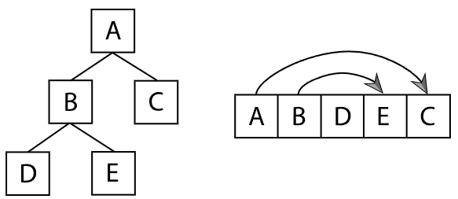

 - BVH 트리를 생성했다면 시스템 성능을 향상시키기 위해 캐싱이 잘 되도록 트리를 개편해야한다.
 - 트리를 깊이 우선 순서로 배치해 각 내부 노드의 첫 번째 자식이 다음에 올 수 있도록 한다.
 - 이 경우에 두 번째 자식의 offset 을 명시적으로 저장하여 위치를 알 수 있도록 한다.

```c++
<<BVHAccel Local Declarations>>+= 
struct LinearBVHNode {
    Bounds3f bounds;
    union {
        int primitivesOffset;    // leaf
        int secondChildOffset;   // interior
    };
    uint16_t nPrimitives;  // 0 -> interior node
    uint8_t axis;          // interior node: xyz
    uint8_t pad[1];        // ensure 32 byte total size
};
```

 - 위 구조체는 32바이트에 맞게 제작, 후속 노드가 캐시 라인에 걸치지 않도록 한다.
 - 생성 트리는 `flattenBVHTree()` 매서드를 통해 `LinearBVHNode` 표현으로 변환

```c++
<<BVHAccel Method Definitions>>+=  
int BVHAccel::flattenBVHTree(BVHBuildNode *node, int *offset) {
    LinearBVHNode *linearNode = &nodes[*offset];
    linearNode->bounds = node->bounds;
    int myOffset = (*offset)++;
    if (node->nPrimitives > 0) {
        linearNode->primitivesOffset = node->firstPrimOffset;
        linearNode->nPrimitives = node->nPrimitives;
    } else {
        <<Create interior flattened BVH node>> 
           linearNode->axis = node->splitAxis;
           linearNode->nPrimitives = 0;
           flattenBVHTree(node->children[0], offset);
           linearNode->secondChildOffset =
               flattenBVHTree(node->children[1], offset);

    }
    return myOffset;
}
```

 - [BVH tree 마지막 flatten 호출](#bvh-생성)
 - offset 은 `BVHAccel::nodes`배열의 현재 오프셋
 - 내부 노드는 자식 노드 호출 이전에 메모리 추가

## 횡단

```c++
<<BVHAccel Method Definitions>>+= 
bool BVHAccel::Intersect(const Ray &ray,
        SurfaceInteraction *isect) const {
    bool hit = false;
    Vector3f invDir(1 / ray.d.x, 1 / ray.d.y, 1 / ray.d.z);
    int dirIsNeg[3] = { invDir.x < 0, invDir.y < 0, invDir.z < 0 };
    <<Follow ray through BVH nodes to find primitive intersections>> 
    int toVisitOffset = 0, currentNodeIndex = 0;
    int nodesToVisit[64];
    while (true) {
        const LinearBVHNode *node = &nodes[currentNodeIndex];
        <<Check ray against BVH node>> 
        if (node->bounds.IntersectP(ray, invDir, dirIsNeg)) {
            if (node->nPrimitives > 0) {
                <<Intersect ray with primitives in leaf BVH node>> 
                for (int i = 0; i < node->nPrimitives; ++i)
                    if (primitives[node->primitivesOffset + i]->Intersect(ray, isect))
                        hit = true;
                if (toVisitOffset == 0) break;
                currentNodeIndex = nodesToVisit[--toVisitOffset];

            } else {
                <<Put far BVH node on nodesToVisit stack, advance to near node>> 
                if (dirIsNeg[node->axis]) {
                   nodesToVisit[toVisitOffset++] = currentNodeIndex + 1;
                   currentNodeIndex = node->secondChildOffset;
                } else {
                   nodesToVisit[toVisitOffset++] = node->secondChildOffset;
                   currentNodeIndex = currentNodeIndex + 1;
                }
            }
        } else {
            if (toVisitOffset == 0) break;
            currentNodeIndex = nodesToVisit[--toVisitOffset];
        }
    }
    return hit;
}
```

 - 반복문 시작마다 `currentNodeIndex`는 방문 노드에 대한 `nodes` 배열에 대한 오프셋 저장
 - 앞으로 방문해야할 노드는 `nodesToVist`에 저장. 스택처럼 동작한다
 - 각 노드의 bounding box 와 광선이 교차하는지 테스트, 만일 교차하지 않는다면 `nodesToVisit`에서 다음 방문 노드를 찾는다
 - 만일 잎 노드에서 교차한다면 `tMax` 갱신 이후 다음 노드를 방문한다.
 - 만일 내부 노드에서 교차한다면 광선이 가장 먼저 지나칠 수 있는 자식을 먼저 방문하도록 `nodesToVisit`에 다음 노드를 넣는다.

# kd-트리 가속기

```c++
<<KdTreeAccel Declarations>>= 
class KdTreeAccel : public Aggregate {
public:
    <<KdTreeAccel Public Methods>> 
    KdTreeAccel(const std::vector<std::shared_ptr<Primitive>> &p,
            int isectCost = 80, int traversalCost = 1, Float emptyBonus = 0.5,
            int maxPrims = 1, int maxDepth = -1);
    Bounds3f WorldBound() const { return bounds; }
    ~KdTreeAccel();
    bool Intersect(const Ray &ray, SurfaceInteraction *isect) const;
    bool IntersectP(const Ray &ray) const;

private:
    <<KdTreeAccel Private Methods>> 
    void buildTree(int nodeNum, const Bounds3f &bounds,    
        const std::vector<Bounds3f> &primBounds, int *primNums, int nprims, int depth,
        const std::unique_ptr<BoundEdge[]> edges[3], int *prims0, int *prims1, int badRefines = 0);

    <<KdTreeAccel Private Data>> 
    const int isectCost, traversalCost, maxPrims;
    const Float emptyBonus;
    std::vector<std::shared_ptr<Primitive>> primitives;
    std::vector<int> primitiveIndices;
    KdAccelNode *nodes;
    int nAllocedNodes, nextFreeNode;
    Bounds3f bounds;

};
```

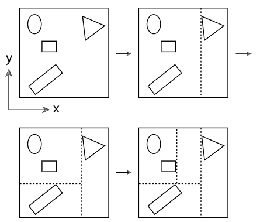

 BSP(Binary Space partitioning) 트리는 공간을 평면으로 세분한다. BSP는 주어진 bounding box 에서 상자안의 기본체 수가 한계치보다 많으면 한 면을 통해 반으로 가르게 된다. 만일 하나의 기본체가 양 공간에 걸쳐 있다면 양쪽 모두에 연결된다. BSP에는 kd-트리와 팔방 트리가 있는데 여기서는 kd-트리를 구현하도록 한다.

## 트리 표현

```c++
struct KdAccelNode {
    <<KdAccelNode Methods>> 
    void InitLeaf(int *primNums, int np, std::vector<int> *primitiveIndices) {
        flags = 3;
        nPrims |= (np << 2);
        <<Store primitive ids for leaf node>> 
        if (np == 0)
            onePrimitive = 0;
        else if (np == 1)
            onePrimitive = primNums[0];
        else {
            primitiveIndicesOffset = primitiveIndices->size();
            for (int i = 0; i < np; ++i)
                primitiveIndices->push_back(primNums[i]);
        }
    }
    void InitInterior(int axis, int ac, Float s) {
        split = s;
        flags = axis;
        aboveChild |= (ac << 2);
    }
    Float SplitPos() const { return split; }
    int nPrimitives() const { return nPrims >> 2; }
    int SplitAxis() const { return flags & 3; }
    bool IsLeaf() const { return (flags & 3) == 3; }
    int AboveChild() const { return aboveChild >> 2; }

    union {
        Float split;                  // Interior
        int onePrimitive;             // Leaf
        int primitiveIndicesOffset;   // Leaf
    };
    union {
        int flags;         // Both
        int nPrims;        // Leaf
        int aboveChild;    // Interior
    };
};
```

 - kd-트리는 이진 트리로 내부 노드는 3가지 정보를 제공한다.
 - 분할 축, 분할 위치, 자식
 - 잎 노드는 자신과 겹치는 기본체만 저장하면 된다.
 - kd-트리 노드는 64바이트 캐시 라인에 8개의 노드를 맞추기 위해 타이트하게 메모리를 구성한다.
 - 우선 `flags`의 하위 2비트를 통해 내부 노드가 분할하는 축의 정보 그리고 잎 노드인지 구분한다. (0, 1, 2 인경우 x, y, z 그리고 3 인 경우 잎)
 - `nPrims`의 상위 30비트는 얼마나 많은 기본체가 공간에 겹치고 있는지 저장한다.
 - `aboveChild` 는 두 번째 자식의 index 를 나타낸다. 첫 번째 자식은 부모 노드 바로 옆에 저장
 - `onePrimitive` 는 잎 노드와 겹치는 기본체가 하나 이하일 경우
 - `primitiveIndicesOffset`은 둘 이상일 경우 primitive offset 을 저장한다.

## 트리 생성

```c++
<<Build kd-tree for accelerator>>= 
nextFreeNode = nAllocedNodes = 0;
if (maxDepth <= 0)
    maxDepth = std::round(8 + 1.3f * Log2Int(primitives.size()));
<<Compute bounds for kd-tree construction>> 
std::vector<Bounds3f> primBounds;
for (const std::shared_ptr<Primitive> &prim : primitives) {
    Bounds3f b = prim->WorldBound();
    bounds = Union(bounds, b);
    primBounds.push_back(b);
}

<<Allocate working memory for kd-tree construction>> 
std::unique_ptr<BoundEdge[]> edges[3];
for (int i = 0; i < 3; ++i)
    edges[i].reset(new BoundEdge[2 * primitives.size()]);
std::unique_ptr<int[]> prims0(new int[primitives.size()]);
std::unique_ptr<int[]> prims1(new int[(maxDepth+1) * primitives.size()]);

<<Initialize primNums for kd-tree construction>> 
std::unique_ptr<int[]> primNums(new int[primitives.size()]);
for (size_t i = 0; i < primitives.size(); ++i)
    primNums[i] = i;

<<Start recursive construction of kd-tree>> 
buildTree(0, bounds, primBounds, primNums.get(), primitives.size(), 
          maxDepth, edges, prims0.get(), prims1.get());
```

 - kd-트리는 재귀적으로 탑 다운 방식 알고리즘을 이용해 생성
 - 만약 kd-트리의 최대 깊이가 정해져있지 않았을 경우 합리적틴 최대 깊이 $8+1.3log(N)$ 으로 판단
 - `nextFreeNode`는 다음에 가용 가능한 노드, `nAllocedNode` 는 할당된 전체 수를 저장
 - bounding box 를 미리 계산하여 `Bounds3f`를 반복적으로 생성하지 않도록 계산
 - 이후에 미리 메모리를 할당, primitive 번호를 초기화 한 이후 `buildTree` 를 호출한다.

```c++
<<KdTreeAccel Method Definitions>>+=  
void KdTreeAccel::buildTree(int nodeNum, const Bounds3f &nodeBounds,
        const std::vector<Bounds3f> &allPrimBounds, int *primNums,
        int nPrimitives, int depth,
        const std::unique_ptr<BoundEdge[]> edges[3], 
        int *prims0, int *prims1, int badRefines) {
    <<Get next free node from nodes array>> 
    if (nextFreeNode == nAllocedNodes) {
        int nNewAllocNodes = std::max(2 * nAllocedNodes, 512);
        KdAccelNode *n = AllocAligned<KdAccelNode>(nNewAllocNodes);
        if (nAllocedNodes > 0) {
            memcpy(n, nodes, nAllocedNodes * sizeof(KdAccelNode));
            FreeAligned(nodes);
        }
        nodes = n;
        nAllocedNodes = nNewAllocNodes;
    }
    ++nextFreeNode;

    <<Initialize leaf node if termination criteria met>> 
    if (nPrimitives <= maxPrims || depth == 0) {
        nodes[nodeNum].InitLeaf(primNums, nPrimitives, &primitiveIndices);
        return;
    }

    <<Initialize interior node and continue recursion>> 
}
```

 - 만일 할당된 노드가 사용되면 노드 메모리는 두 배 크기로 재 할당
 - 잎 노드는 충분히 작은 수의 기본체가 겹치거나 최대 깊이에 도달 했을 때 생성

```c++
<<Initialize interior node and continue recursion>>= 
<<Choose split axis position for interior node>> 
<<Create leaf if no good splits were found>> 
<<Classify primitives with respect to split>> 
<<Recursively initialize children nodes>> 
```

 - 이후 구현은 SAH을 사용해서 분할을 한다
 - 교차비용 $t_{usect}$ 와 횡단 비용 $t_{trav}$는 각각 80, 1로 설정
 - BVH와 차이점은 서로 겹치는 기본체가 없는 분할을 더 선호 한다
 - $t_{trav}+(1-b_e)(p_BN_Bt_{isect}+p_AN_At_{isect})$
 - 여기서 $b_e$는 두 영역중 하나가 완전히 비었을 경우에 0에서 1사이 값을 받고, 그 외에는 0을 받는다

### 분할 위치

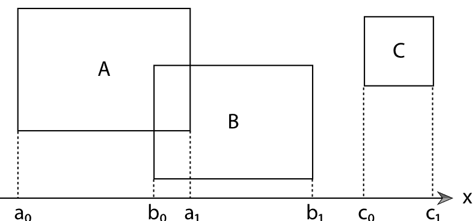

```c++
<<KdTreeAccel Local Declarations>>+=  
enum class EdgeType { Start, End };
<<KdTreeAccel Local Declarations>>+= 
struct BoundEdge {
    <<BoundEdge Public Methods>> 
    BoundEdge() { }
    BoundEdge(Float t, int primNum, bool starting)
        : t(t), primNum(primNum) {
        type = starting ? EdgeType::Start : EdgeType::End; 
    }

    Float t;
    int primNum;
    EdgeType type;
};
```

 - kd-트리 모델에서는 경계면 분할시 기본체 bounding box 의 한 면을 경계로 하는것이 효율적
 - 모든 축에 대해서 고려하도록 하자
 - 위 그림에서 $a_0$ 부터 $c_1$까지 각각의 경계면을 제외한 다른 경계면은 고려할 필요가 없다

```c++
<<Choose split axis position for interior node>> 
int bestAxis = -1, bestOffset = -1;
Float bestCost = Infinity;
Float oldCost = isectCost * Float(nPrimitives);
Float totalSA = nodeBounds.SurfaceArea();
Float invTotalSA = 1 / totalSA;
Vector3f d = nodeBounds.pMax - nodeBounds.pMin;
<<Choose which axis to split along>> 
int axis = nodeBounds.MaximumExtent();
int retries = 0;
retrySplit:
<<Initialize edges for axis>> 
for (int i = 0; i < nPrimitives; ++i) {
    int pn = primNums[i];
    const Bounds3f &bounds = allPrimBounds[pn];
    edges[axis][2 * i] =     BoundEdge(bounds.pMin[axis], pn, true);
    edges[axis][2 * i + 1] = BoundEdge(bounds.pMax[axis], pn, false);
}
<<Sort edges for axis>> 
std::sort(&edges[axis][0], &edges[axis][2*nPrimitives],
    [](const BoundEdge &e0, const BoundEdge &e1) -> bool {
        if (e0.t == e1.t)
            return (int)e0.type < (int)e1.type;
        else return e0.t < e1.t; 
    });
<<Compute cost of all splits for axis to find best>> 
int nBelow = 0, nAbove = nPrimitives;
for (int i = 0; i < 2 * nPrimitives; ++i) {
    if (edges[axis][i].type == EdgeType::End) --nAbove;
    Float edgeT = edges[axis][i].t;
    if (edgeT > nodeBounds.pMin[axis] && edgeT < nodeBounds.pMax[axis]) {
        <<Compute cost for split at ith edge>> 
        <<Compute child surface areas for split at edgeT>> 
        int otherAxis0 = (axis + 1) % 3, otherAxis1 = (axis + 2) % 3;
        Float belowSA = 2 * (d[otherAxis0] * d[otherAxis1] +
                             (edgeT - nodeBounds.pMin[axis]) * 
                             (d[otherAxis0] + d[otherAxis1]));
        Float aboveSA = 2 * (d[otherAxis0] * d[otherAxis1] +
                             (nodeBounds.pMax[axis] - edgeT) * 
                             (d[otherAxis0] + d[otherAxis1]));
        Float pBelow = belowSA * invTotalSA; 
        Float pAbove = aboveSA * invTotalSA;
        Float eb = (nAbove == 0 || nBelow == 0) ? emptyBonus : 0;
        Float cost = traversalCost + 
                     isectCost * (1 - eb) * (pBelow * nBelow + pAbove * nAbove);
        <<Update best split if this is lowest cost so far>> 
        if (cost < bestCost)  {
            bestCost = cost;
            bestAxis = axis;
            bestOffset = i;
        }
    }
    if (edges[axis][i].type == EdgeType::Start) ++nBelow;
}
```

 - 분할 위치 선정에 있어 현재 내부 노드의 bounding box 중 가장 긴 축을 기준으로 먼저 분할 비용 추정
 - 분할 위치를 기본체 `start`, `end` 를 구분지어 위치에 맞게 정렬
 - 정렬 한 경계면을 루프를 돌며 ray-object intersection 비용을 추정
 - 만일 edge type 이 `end`라면 위쪽 공간에서 기본체를 하나 제거, `start`라면 아래쪽 공간에 기본체 하나 추가 (겹치는 기본체 고려)
 - above bounding box 의 면적과 below bounding box 의 면적을 내부 노드 bounding box 면적으로 나누어 광선이 교차할 확률 추정
 - 분할 공간이 비어 있는지 확인
 - intersection, traversal 비용을 추정하여 가장 값싼 비용의 분할인지 체크

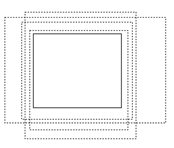
```c++
<<Create leaf if no good splits were found>> 
if (bestAxis == -1 && retries < 2) {
    ++retries;
    axis = (axis + 1) % 3;
    goto retrySplit;
}
if (bestCost > oldCost) ++badRefines;
if ((bestCost > 4 * oldCost && nPrimitives < 16) || 
    bestAxis == -1 || badRefines == 3) {
    nodes[nodeNum].InitLeaf(primNums, nPrimitives, &primitiveIndices);
    return; 
}
```

 - 만약 분할이 불가능하다면, 다른축에 대해 분할이 가능한지 체크하고 불가능하다면 잎 노드 생성
 - 혹은, 비용 추정한 결과가 그냥 잎 노드를 생성하는 경우보다 더 비싸다면 잎 노드 생성

```c++
<<Classify primitives with respect to split>> 
int n0 = 0, n1 = 0;
for (int i = 0; i < bestOffset; ++i)
    if (edges[bestAxis][i].type == EdgeType::Start)
        prims0[n0++] = edges[bestAxis][i].primNum;
for (int i = bestOffset + 1; i < 2 * nPrimitives; ++i)
    if (edges[bestAxis][i].type == EdgeType::End)
        prims1[n1++] = edges[bestAxis][i].primNum;
```

 - `bestOffset`을 이용해 above, below bounding box 에 포함되는 primitive들 갱신
 - `bestOffset`을 제외하는 이유? 분할에 사용된 기본체가 양쪽면에 위치하지 않기 때문에


```c++
<<Recursively initialize children nodes>> 
Float tSplit = edges[bestAxis][bestOffset].t;
Bounds3f bounds0 = nodeBounds, bounds1 = nodeBounds;
bounds0.pMax[bestAxis] = bounds1.pMin[bestAxis] = tSplit;
buildTree(nodeNum + 1, bounds0, allPrimBounds, prims0, n0,
          depth - 1, edges, prims0, prims1 + nPrimitives, badRefines);
int aboveChild = nextFreeNode;
nodes[nodeNum].InitInterior(bestAxis, aboveChild, tSplit);
buildTree(aboveChild, bounds1, allPrimBounds, prims1, n1, 
          depth - 1, edges, prims0, prims1 + nPrimitives, badRefines);
```

 - 이후 내부 노드의 `tSplit`갱신
 - 그리고 주어진 above, below bounding box 를 `buildTree`를 호출해 재귀적으로 분할
 - 중요한 점은 매개변수로 넘길 때 `prims1 + nPrimitives`를 넘긴다는 점
 - 이는 두 번째 자식 노드 생성시 `prims1`에 대한 메모리가 보존되어 있어야 하기 때문
 - 그런 이유로 초기 `prims1` 메모리 할당시 `(maxDepth+1)*primitives.size()` 만큼 할당한 이유다


## 횡단

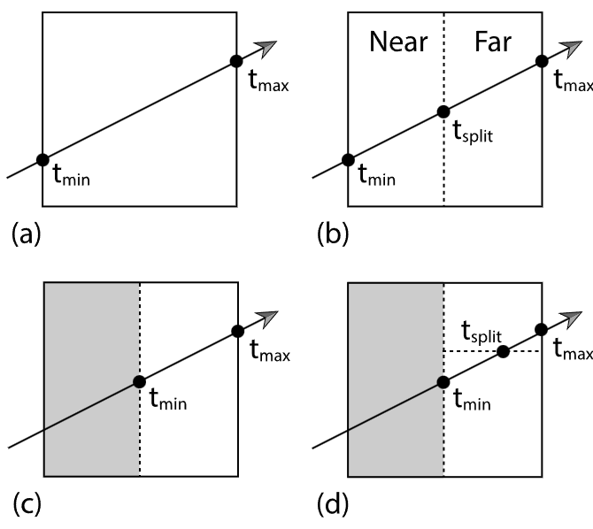

```c++
<<KdTreeAccel Declarations>>+= 
struct KdToDo {
    const KdAccelNode *node;
    Float tMin, tMax;
};

<<KdTreeAccel Method Definitions>>+= 
bool KdTreeAccel::Intersect(const Ray &ray,
        SurfaceInteraction *isect) const {
    <<Compute initial parametric range of ray inside kd-tree extent>> 
    Float tMin, tMax;
    if (!bounds.IntersectP(ray, &tMin, &tMax)) 
        return false;
       

    <<Prepare to traverse kd-tree for ray>> 
    Vector3f invDir(1 / ray.d.x, 1 / ray.d.y, 1 / ray.d.z);
    constexpr int maxTodo = 64;
    KdToDo todo[maxTodo];
    int todoPos = 0;

    <<Traverse kd-tree nodes in order for ray>> 
}
```

 - kd-트리 횡단시 내부 노드와 광선과의 충돌 테스트를 먼저 진행
 - 만일 충돌하지 않는다면 자식 노드들을 탐색하지 않고 false 반환
 - 만약 충돌한다면 광선과 가까운 쪽 자식 노드를 탐색
 - 그 결과로 충돌 기본체가 없거나 결과가 $t_{split}$ 보다 크다면 (d 와 같은 경우) 다음 자식 노드를 탐색한다.
 - 탐색시에는 `KdToDo` 배열에서 다음 탐색할 노드를 찾는다.

```c++
<<Traverse kd-tree nodes in order for ray>>= 
bool hit = false;
const KdAccelNode *node = &nodes[0];
while (node != nullptr) {
    <<Bail out if we found a hit closer than the current node>> 
    if (ray.tMax < tMin) break;

    if (!node->IsLeaf()) {
        <<Process kd-tree interior node>> 
        <<Compute parametric distance along ray to split plane>> 
        int axis = node->SplitAxis();
        Float tPlane = (node->SplitPos() - ray.o[axis]) * invDir[axis];

        <<Get node children pointers for ray>> 
        const KdAccelNode *firstChild, *secondChild;
        int belowFirst = (ray.o[axis] <  node->SplitPos()) ||
                         (ray.o[axis] == node->SplitPos() && ray.d[axis] <= 0);
        if (belowFirst) {
            firstChild = node + 1;
            secondChild = &nodes[node->AboveChild()];
        } else {
            firstChild = &nodes[node->AboveChild()];
            secondChild = node + 1;
        }

        <<Advance to next child node, possibly enqueue other child>> 
        if (tPlane > tMax || tPlane <= 0)
            node = firstChild;
        else if (tPlane < tMin)
            node = secondChild;
        else {
            <<Enqueue secondChild in todo list>> 
            todo[todoPos].node = secondChild;
            todo[todoPos].tMin = tPlane;
            todo[todoPos].tMax = tMax;
            ++todoPos;
            node = firstChild;
            tMax = tPlane;
        }
    } else {
        <<Check for intersections inside leaf node>>
    }
}
return hit;
```

 - 만일 이전 교차점이 현재 노드의 `tMin`보다 작다면 교체 테스트 하지 않는다.
 - 먼저 광선의 원점과 방향을 통해 첫 번째 자식을 먼저 탐색할지 판단할 수 있다.

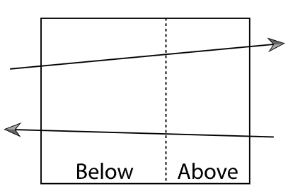

 - 자식 노드들의 탐색 순서를 정했다면 광선을 분할 면에 투영하여 탐색할 필요 없는 자식 노드를 제외시킨다.

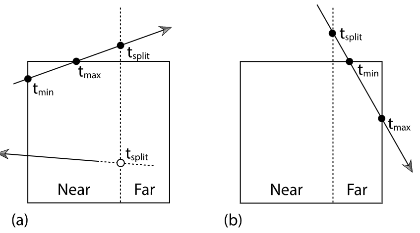

```c++
<<Check for intersections inside leaf node>>= 
int nPrimitives = node->nPrimitives();
if (nPrimitives == 1) {
    const std::shared_ptr<Primitive> &p = primitives[node->onePrimitive];
    <<Check one primitive inside leaf node>> 
    if (p->Intersect(ray, isect)) 
        hit = true;

} else {
    for (int i = 0; i < nPrimitives; ++i) {
        int index = primitiveIndices[node->primitiveIndicesOffset + i];
        const std::shared_ptr<Primitive> &p = primitives[index];
        <<Check one primitive inside leaf node>> 
        if (p->Intersect(ray, isect)) 
            hit = true;
    }
}
<<Grab next node to process from todo list>> 
if (todoPos > 0) {
    --todoPos;
    node = todo[todoPos].node;
    tMin = todo[todoPos].tMin;
    tMax = todo[todoPos].tMax;
}
else
    break;
```

 - 현재 노드가 잎이라면 기본체에 대해 교차 테스트를 실행한다.
 - 잎 노드에서 교차 테스트를 한 이후에는 다음으로 처리할 노드를 todo 배열에서 꺼내온다.