# 5. 색과 방사 분석
파장 별로 색을 정하는 방법과 pbrt 내 코드, 방사 분석 반사에 대해
 다루는 챕터.

# 5.1 분광 표현
어떤 물체에서 발광이나 반사가 발생했다고 하자.

1. 어떤 물체에 특정 파장의 빛이 들어왔다.
2. 파장 별로 물체에서 발광 내지 반사를 하는 함수가 있을 것이다.
3. 입력이 파장일 때, 출력이 빛의 양이 된다.

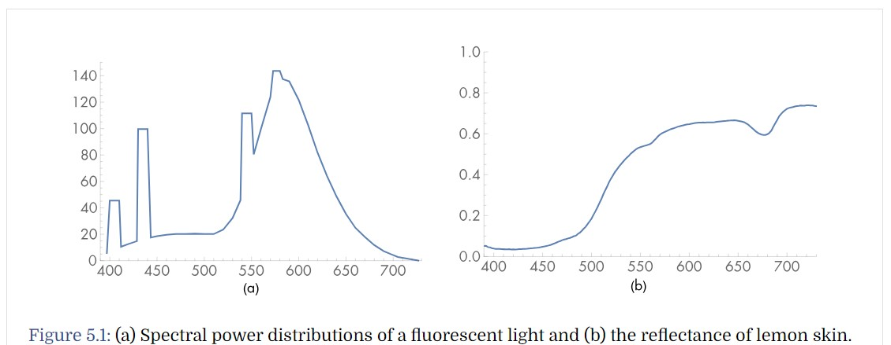

위 그림은 형광의 발광 분포, 레몬 껍질의 반사 분광 분포를 나타낸다.

특정 파장에 대해 빛이 발광/반사가 거의 일어나지 않게되기도 하고, 특정 파장에 대해 발광/반사량이 많기도 한 것을 확인할 수 있다.

이런 파장($\lambda$) 별로 발광량 / 반사율을 나타내는 분포를 분광 분포 (Spectral Power Distribution, SPD) 라고 한다.

실제 생활의 영역에서 이러한 분광분포는 연속적인 공간에서의 분포를 이룰 것이다.

따라서 이런 무한대의 영역을 훨씬 낮은 차원으로 대응시켜줄 방법이 필요한데, 이를 **기저함수** 라고 한다.

가장 기본적인 기저함수는 B($\lambda$)=1 일 것이다. 어떤 파장에 대해서든 1을 리턴하면 된다.

이 기저함수를 통해 표현된 어떤 다른 SPD는 물체를 고려해 어떤 특정한 계수 c를 곱해 나타나는 cB($\lambda$)=c 정도가 될 것이다.

간단하기는 한데, 정확하게 표현하긴 어렵다.

컴퓨터 그래픽에선 이런 기저함수를 찾는 과정에서 타협점을 찾아 두 가지 표현방법을 대표적으로 사용하고있다.

1. Sampled Spectrum
  이 방법은 파장의 영역을 구간별로 나누어 상수함수처럼 만들고, 그 안에서 표본집합을 표현하는 방식을 채택해 표현한다.

2. RGB Spectrum
  이 방법은 SPD를 파랑, 빨강, 초록의 혼합계수로 표현하는 방식이다.

## 5.1.1 Spectrum 형
pbrt에선 Spectrum 타입에 대해 컴파일러를 활용하여 선택을 할 수 있도록 만들었다.

선택이란 앞에서 말한 두 가지 표현 방식을 의미하며 코드는 간단하다.

```c
<<Global Forward Declarations>>=
typedef RGBSpectrum Spectrum;
// typedef SampledSpectrum Spectrum;
```

이렇게 하면 함수자체를 인라인화 시킬 수 있어서 Spectrum이라는 타입에 대해 가상메소드를 호출할 필요 등이 사라짐과 동시에 인스턴스 자체를 유지하고 사용하기 때문에 매번 동적으로 분광 표현 방식을 변경하는 방식보다 빠르다.

## 5.1.2 CoefficientSpectrum 구현

컴퓨터 연산이기 때문에 RGB 방식이나 SampledSpectrum 방식이나 모두 표본은 필요하다.

CoefficientSpectrum는 고정된 표본수를 가지고 기본적인 연산을 포함한 템플릿 클래스를 정의한다.

상세 내용은 아래를 보도록 하자.
```c++
<<Spectrum Declarations>>=
template <int nSpectrumSamples> class CoefficientSpectrum {
public:
    <<CoefficientSpectrum Public Methods>>
    // 파장 별 모든 value를 동일하게 초기화하는 생성자.
    CoefficientSpectrum(Float v = 0.f) {
      for (int i = 0; i < nSpectrumSamples; ++i)
        c[i] = v;
    }

    // 연산자 오버로딩 들
    CoefficientSpectrum &operator+=(const CoefficientSpectrum &s2) {
    for (int i = 0; i < nSpectrumSamples; ++i)
        c[i] += s2.c[i];
    return *this;
   }
   CoefficientSpectrum operator+(const CoefficientSpectrum &s2) const {
       CoefficientSpectrum ret = *this;
       for (int i = 0; i < nSpectrumSamples; ++i)
           ret.c[i] += s2.c[i];
       return ret;
   }

   // 반사가 아예 안되는 검정색 물체 등에서 사용되는 isblack함수
   bool IsBlack() const {
       for (int i = 0; i < nSpectrumSamples; ++i)
           if (c[i] != 0.) return false;
       return true;
   }

   // 재곱근이 된 값을 리턴하는 함수
   friend CoefficientSpectrum Sqrt(const CoefficientSpectrum &s) {
       CoefficientSpectrum ret;
       for (int i = 0; i < nSpectrumSamples; ++i)
           ret.c[i] = std::sqrt(s.c[i]);
       return ret;
   }

  // Clamp를 통해 값을 정리하는 함수
   CoefficientSpectrum Clamp(Float low = 0, Float high = Infinity) const {
       CoefficientSpectrum ret;
       for (int i = 0; i < nSpectrumSamples; ++i)
           ret.c[i] = ::Clamp(c[i], low, high);
       return ret;
   }

  // NaN 값이 있는 지 모두 확인하는 용도의 함수 (계산 과정 도중 0으로 나눴거나하는 등의 체크)
   bool HasNaNs() const {
       for (int i = 0; i < nSpectrumSamples; ++i)
           if (std::isnan(c[i])) return true;
       return false;
   }
    ...
    <<CoefficientSpectrum Public Data>>

    ...
protected:
    <<CoefficientSpectrum Protected Data>>
    Float c[nSpectrumSamples];
    ...
};
```

아래는 SPD에서 많이 사용되는 보간함수이다. 위에서 연산자 오버로딩을 모두 해두었기 때문에 가능하다.
```c++
inline Spectrum Lerp(Float t, const Spectrum &s1, const Spectrum &s2) {
    return (1 - t) * s1 + t * s2;
}
```

# 5.2 SampledSpectrum 클래스

앞서 말한 표본을 통해 분광을 표현하는 방식이다.

시작과 끝 파장을 정하고, 그 사이를 표본 수로 나누어 값들을 저장한다.

pbrt에선 namespace 안에 이 값이 정의되어있다.

```c++
namespace pbrt {

// Spectrum Utility Declarations
static const int sampledLambdaStart = 400; // (nm)
static const int sampledLambdaEnd = 700; // (nm)
static const int nSpectralSamples = 60;
...
```

즉 표본 60개에, 각 표본은 5nm 간격으로 사용된다.

400, 700인 이유는 인간 시각계가 가장 민감한 분광범위라고 한다.

## FromSampled 함수
FromSampled 메서드는 정해진 파장 lambda배열과 그 값에 해당하는 v의 배열을 표본으로써 받고 부분적으로 선형적인 함수로 SPD를 표현한다.

우리는 파장 영역과 샘플 갯수만 정했지, 실제 표본을 통해 데이터를 만들어놓진 않았기 때문에, 함수에 해당하는 데이터를 표본으로 받은 상태라고 보면 되고,
 이를 부분 선형함수로 바꿔주는게 본 함수의 역할이라 보면 되겠다.


```c++
static SampledSpectrum FromSampled(const Float *lambda,
                                   const Float *v, int n) {
    <<Sort samples if unordered, use sorted for returned spectrum>>
       if (!SpectrumSamplesSorted(lambda, v, n)) {
           std::vector<Float> slambda(&lambda[0], &lambda[n]);
           std::vector<Float> sv(&v[0], &v[n]);
           SortSpectrumSamples(&slambda[0], &sv[0], n);
           return FromSampled(&slambda[0], &sv[0], n);
       }

    SampledSpectrum r;
    for (int i = 0; i < nSpectralSamples; ++i) {
        <<Compute average value of given SPD over th sample’s range>>
           Float lambda0 = Lerp(Float(i) / Float(nSpectralSamples),
                                sampledLambdaStart, sampledLambdaEnd);
           Float lambda1 = Lerp(Float(i + 1) / Float(nSpectralSamples),
                                sampledLambdaStart, sampledLambdaEnd);
           r.c[i] = AverageSpectrumSamples(lambda, v, n, lambda0, lambda1);

    }
    return r;
}
```

큰 틀은 아래와 같다.

1. 값을 $\lambda$ 로 정렬한다.
  $\lambda$ 가 작을 수록 배열 상 먼저 와야만 한다.
2. SampledSpectrum 을 새로 만들어 각 파장별 coefficient 값을 정해 리턴할 수 있도록 샘플별로 계산해준다.

2번 부분을 조금 더 세부적으로 살펴보자.

```c++
for (int i = 0; i < nSpectralSamples; ++i) {
     <<Compute average value of given SPD over th sample’s range>>
        Float lambda0 = Lerp(Float(i) / Float(nSpectralSamples),
                             sampledLambdaStart, sampledLambdaEnd);
        Float lambda1 = Lerp(Float(i + 1) / Float(nSpectralSamples),
                             sampledLambdaStart, sampledLambdaEnd);
        r.c[i] = AverageSpectrumSamples(lambda, v, n, lambda0, lambda1);

 }
```

우리가 만들 SPD에 대한 파장 범위와 샘플할 갯수는 미리 알고있다.

우리가 만들 샘플 별로 lambda값의 시작~끝을 정해주고 (lambda0, 1) 이 값과 실제 표본데이터들을 보내어 연산한 결과를 리턴에 담아주게된다.

표본을 만드는 과정은, 기존 부분 선형함수의 데이터를 샘플 표본의 범위 별로 새로 적분하고,
적분된 데이터를 샘플 범위(가로길이)로 나누어 높이를 계산해 vals에 저장하는 방식이다.

### AverageSpectrumSamples 함수
```c++

Float AverageSpectrumSamples(const Float *lambda, const Float *vals, int n,
                             Float lambdaStart, Float lambdaEnd) {
    /* 1. 범위 체크 */
    for (int i = 0; i < n - 1; ++i) CHECK_GT(lambda[i + 1], lambda[i]);
    CHECK_LT(lambdaStart, lambdaEnd);
    if (lambdaEnd <= lambda[0]) return vals[0]; // 파장 범위를 오른쪽으로 벗어날 경우 가장 마지막 value만 사용
    if (lambdaStart >= lambda[n - 1]) return vals[n - 1]; // 파장 범위를 왼쪽으로 벗어날 경우 가장 처음 value만 사용
    if (n == 1) return vals[0]; // 1개면 걍 값도 1개

    /* 2. 양 끝 값보다 표본이 안쪽에만 존재할 경우 */
    /* 양 끝값을 포함한 추가 샘플을 결과에 누적해줌  */
    Float sum = 0;
    // Add contributions of constant segments before/after samples
    if (lambdaStart < lambda[0]) sum += vals[0] * (lambda[0] - lambdaStart);
    if (lambdaEnd > lambda[n - 1])
        sum += vals[n - 1] * (lambdaEnd - lambda[n - 1]);

    /* 범위 내에 들어오는 가장 첫 샘플을 초기값으로 한다. */
    // Advance to first relevant wavelength segment
    int i = 0;
    while (lambdaStart > lambda[i + 1]) ++i;
    CHECK_LT(i + 1, n);

    /* 람다배열과 value배열에 대한 부분선형함수 변환 작업 */
    /* i~ i+1 중 w가 위치한 지점의 비율을 두 vals데이터의 차이로 나누어 선형함수 처럼 쓴다. */
    auto interp = [lambda, vals](Float w, int i) {
        return Lerp((w - lambda[i]) / (lambda[i + 1] - lambda[i]), vals[i],
                    vals[i + 1]);
    };

    for (; i + 1 < n && lambdaEnd >= lambda[i]; ++i) {
        Float segLambdaStart = std::max(lambdaStart, lambda[i]);
        Float segLambdaEnd = std::min(lambdaEnd, lambda[i + 1]);
        /* 사다리꼴 값 누적 */
        sum += 0.5 *
               (interp(segLambdaStart, i) + interp(segLambdaEnd, i)) * //  i번째 표본
               (segLambdaEnd - segLambdaStart); // sample의 파장차
    }

    /* 우리가 만든 샘플의 범위로 값을 나눠준다.*/
    return sum / (lambdaEnd - lambdaStart);
}
```

참고 그림은 아래와 같다.

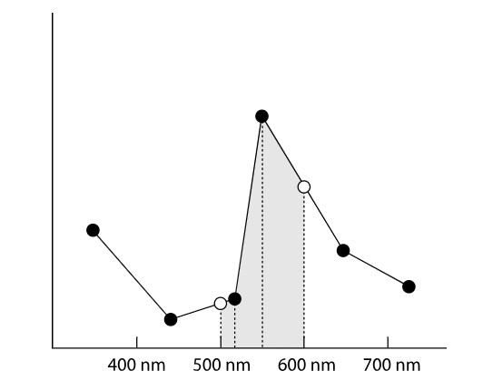

## 5.2.1 XYZ 색

XYZ는 표준 색 표현으로, 국제 조명 위원회 (CIE) 라는 곳에서 만든 표준이다.

RGB처럼 색 인지를 삼중 자극 이론을 통해 한다고 가정한다. (색깔 3개)

XYZ가 RGB를 의미하는건 아니고, XYZ의 특정한 계수만큼 곱해서 합치면 그 값이 R, G, B 혹은 마젠타 등등의 색이 된다.

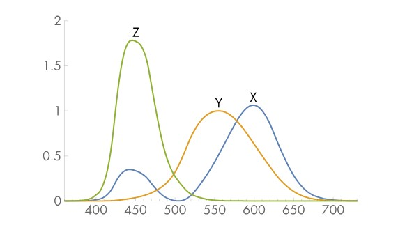

XYZ 값만 가지고 모두 표현하기엔 어려움이 있으므로, 이 값과 파장 별 SPD 값을 곱해서 사용하면 더욱 정확한 표현이 가능하다.

이를 위해 pbrt에선 CIE_X, CIE_Y, CIE_X 값을 미리 제공해준다. (360nm ~ 830nm)

```c++
const Float CIE_X[nCIESamples] = {
    // CIE X function values
    0.0001299000f,   0.0001458470f,   0.0001638021f,   0.0001840037f,
    0.0002066902f,   0.0002321000f,   0.0002607280f,   0.0002930750f,
    0.0003293880f,   0.0003699140f,   0.0004149000f,   0.0004641587f,
    0.0005189860f,   0.0005818540f,   0.0006552347f,   0.0007416000f,
    0.0008450296f,   0.0009645268f,   0.001094949f,    0.001231154f,
...
```

```nCIESamples``` 값은 우리가 표본 갯수로 정한 ```nSpectralSamples``` 값과 다름.

따라서 마찬가지의 방법으로 nSpectralSamples 갯수에 맞게 FromSample과 같은 작업 필요.

이 과정은 ```SampleSpectrum::Init()``` 에서 수행

```c++
// Compute XYZ matching functions for _SampledSpectrum_
for (int i = 0; i < nSpectralSamples; ++i) {
   Float wl0 = Lerp(Float(i) / Float(nSpectralSamples),
                    sampledLambdaStart, sampledLambdaEnd);
   Float wl1 = Lerp(Float(i + 1) / Float(nSpectralSamples),
                    sampledLambdaStart, sampledLambdaEnd);
   X.c[i] = AverageSpectrumSamples(CIE_lambda, CIE_X, nCIESamples, wl0,
                                   wl1);
   Y.c[i] = AverageSpectrumSamples(CIE_lambda, CIE_Y, nCIESamples, wl0,
                                   wl1);
   Z.c[i] = AverageSpectrumSamples(CIE_lambda, CIE_Z, nCIESamples, wl0,
                                   wl1);
}
```

wl0, wl1은 ```nSpectralSamples``` 로 나눈 400~700 사이 5nm 단위의 표본 위치들.

X, Y, Z는 FromSample과 마찬가지의 방법으로
1. 적분으로 합치고
2. 범위에 맞게 나눠짐.

의 과정을 거쳐 데이터가 저장됨.

이 값은 어떻게 사용될까?

pbrt의 Spectrum 구현은 SPD를 xyz로 변환하는 과정이 반드시 포함되어야 함.

이미지의 픽셀을 갱신한다고 할 때, 광선을 따라 빛을 표현하는 Sepctrum이 RGB값으로 변경되는 과정의 첫 단계로
 SPD를 XYZ계수로 변환해야 하기 때문.

xyz의 3 float를 계산하기 위해 샘플로 정한 모든 표본에서의 색깔 합이 필요한데, 이 때 사용되는게 리만적분이라고 한다.

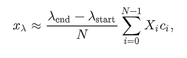

코드로 보면 단순하다.

```c++
void ToXYZ(Float xyz[3]) const {
     xyz[0] = xyz[1] = xyz[2] = 0.f;
     for (int i = 0; i < nSpectralSamples; ++i) {
         xyz[0] += X.c[i] * c[i];
         xyz[1] += Y.c[i] * c[i];
         xyz[2] += Z.c[i] * c[i];
     }
     Float scale = Float(sampledLambdaEnd - sampledLambdaStart) /
                   Float(CIE_Y_integral * nSpectralSamples);
     xyz[0] *= scale;
     xyz[1] *= scale;
     xyz[2] *= scale;
 }
```

여기서 사용되는 ```CIE_Y_integral``` 의 경우 휘도와 관계가 있음.

뒤에 나오겠지만 휘도는 빛의 밝기와 유사한 값이라 보면된다.

계산 식은 모든 셈플에 대해 리만적분을 수행하면 된다.


## 5.2.2 RGB 색.

LED/LCD 에서 픽셀에 색을 표시할 때 RGB에 해당하는 값들의 합으로 색을 나타낸다.

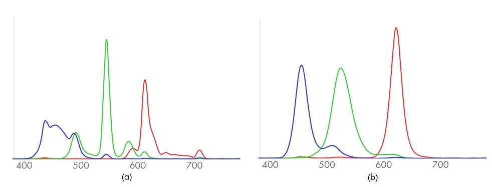

LED와 LCD에서 디스플레이가 발광하는 빨/초/파의 분포이다.

이 디스플레이에서 특정한 색 RGB (0.6, 0.3, 0.2)를 표시할 때 생성되는 SPD는 아래와 같다.

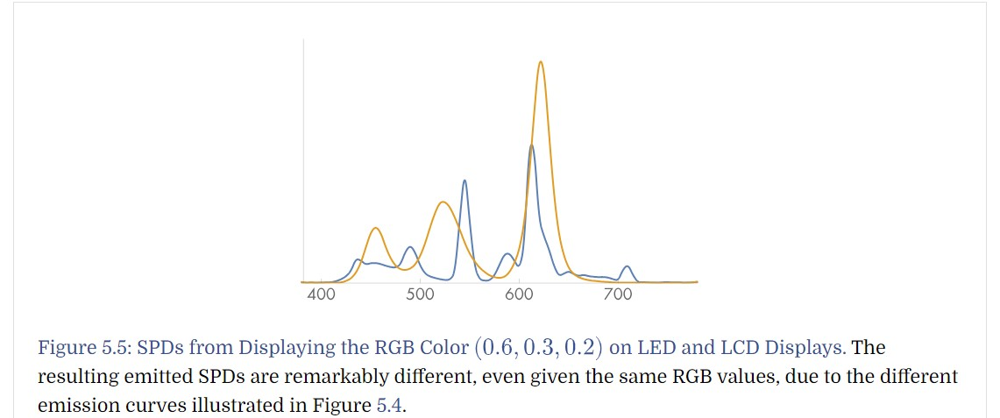

이전 챕터에서 최종적으로 xyz 3float으로 적분한 값을 계산해보았다.

이 데이터를 다시 RGB로 변환하려면 아래와 같은 과정을 거친다.

아래는 Red 의 예시이다.

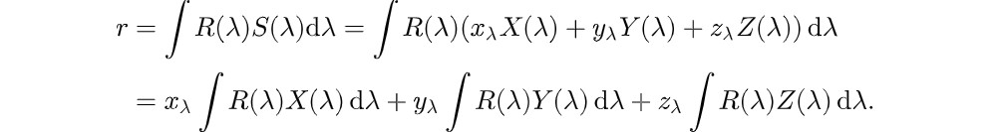

이걸 행렬식으로 나타내면 RGB에 대해 아래와 같이 나타낼 수 있다.

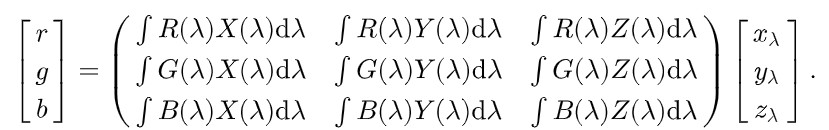

이 때 $\lambda$ 에 대한 R,G,B($\lambda$) 합이나, X,Y,Z($\lambda$) 는 어떤 변수에 의해 결정되는 값이 아니고

이미 제공되는 데이터로 모두 연산이 가능한 값이다.

따라서 이도 모두 상수화가 가능하고 코드상에선 계산을 훨씬 단순화 할 수 있다.

```c++
inline void XYZToRGB(const Float xyz[3], Float rgb[3]) {
    rgb[0] = 3.240479f * xyz[0] - 1.537150f * xyz[1] - 0.498535f * xyz[2];
    rgb[1] = -0.969256f * xyz[0] + 1.875991f * xyz[1] + 0.041556f * xyz[2];
    rgb[2] = 0.055648f * xyz[0] - 0.204043f * xyz[1] + 1.057311f * xyz[2];
}

inline void RGBToXYZ(const Float rgb[3], Float xyz[3]) {
    xyz[0] = 0.412453f * rgb[0] + 0.357580f * rgb[1] + 0.180423f * rgb[2];
    xyz[1] = 0.212671f * rgb[0] + 0.715160f * rgb[1] + 0.072169f * rgb[2];
    xyz[2] = 0.019334f * rgb[0] + 0.119193f * rgb[1] + 0.950227f * rgb[2];
}
```

여기까지 왔으면 표본을 통해 생성한 부분선형함수에서 RGB색을 아래와같이 쉽게 구해낼 수 있다.

```c++
void ToRGB(Float rgb[3]) const {
  Float xyz[3];
  ToXYZ(xyz);
  XYZToRGB(xyz, rgb);
}
```


RGB, XYZ간의 변환은 간단한데, 다시 SPD로 변경하는건 어렵다.

SPD + CIE_X 계수들 + 샘플링 갯수 ==> XYZ 로 변환이 된 것인데,
 변인이 많아 SPD 자체만 보면 1개가 아니라 여러 SPD에서도 충분히 동일한 XYZ를 만들 수 있기 때문.

또한 변환함수에게 요구되는 두 가지 기준이 있는데,

* 모든 RGB계수가 같은 값이라면, SPD는 상수여야 한다.
* SPD가 매끈해야한다. 실세계 물체들은 분광이 매끄럽기 때문이다.

두 번째 기준때문에 어려움.

앞선 그림처럼 RGB의 분포를 보면 불규칙하고 뾰족하므로, SPD를 역산한 결과도 매끄럽지 못함.

이런 이유때문에 한계가 있었는데, 스미츠라는 사람이 새로운 방법 제안

* R, G, B에 대해 개별적인 SPD를 계산한 뒤
* 이의 가중 합을 RGB계수에 대해 계산하고
* 다시 RGB로 변환하면 원래 RGB와 비슷했다.

라는 관찰에서 시작

스미츠는 개선을 위해 두 가지를 추가로 고려했는데,
* 상수 분광을 R, G, B 의 합으로 계산해 표현하는 것 보다 상수 SPD로 표현하는게 좋다 (무슨 뜻인질 모르겠다)
* 두 가지 이상의 원색 혼합 색을 사용해 SPD로 표현하는게 원색으로 계산한것 보다 낫다.

내용이 복잡해서 코드만 간단하게 보고 넘어가자.

* 반사인지 발광인지를 먼저 확인하고
* 반사 발광에 따른 혼합색 계수를 사용해 SPD를 사용한다.

```c++
SampledSpectrum SampledSpectrum::FromRGB(const Float rgb[3],
                                         SpectrumType type) {
    SampledSpectrum r;
    if (type == SpectrumType::Reflectance) {
        // Convert reflectance spectrum to RGB
        if (rgb[0] <= rgb[1] && rgb[0] <= rgb[2]) {
            // Compute reflectance _SampledSpectrum_ with _rgb[0]_ as minimum
            r += rgb[0] * rgbRefl2SpectWhite;
            if (rgb[1] <= rgb[2]) {
                r += (rgb[1] - rgb[0]) * rgbRefl2SpectCyan;
                r += (rgb[2] - rgb[1]) * rgbRefl2SpectBlue;
            } else {
                r += (rgb[2] - rgb[0]) * rgbRefl2SpectCyan;
                r += (rgb[1] - rgb[2]) * rgbRefl2SpectGreen;
            }
        } else if (rgb[1] <= rgb[0] && rgb[1] <= rgb[2]) {
            // Compute reflectance _SampledSpectrum_ with _rgb[1]_ as minimum
            r += rgb[1] * rgbRefl2SpectWhite;
            if (rgb[0] <= rgb[2]) {
                r += (rgb[0] - rgb[1]) * rgbRefl2SpectMagenta;
                r += (rgb[2] - rgb[0]) * rgbRefl2SpectBlue;
            } else {
                r += (rgb[2] - rgb[1]) * rgbRefl2SpectMagenta;
                r += (rgb[0] - rgb[2]) * rgbRefl2SpectRed;
            }
        } else {
            // Compute reflectance _SampledSpectrum_ with _rgb[2]_ as minimum
            r += rgb[2] * rgbRefl2SpectWhite;
            if (rgb[0] <= rgb[1]) {
                r += (rgb[0] - rgb[2]) * rgbRefl2SpectYellow;
                r += (rgb[1] - rgb[0]) * rgbRefl2SpectGreen;
            } else {
                r += (rgb[1] - rgb[2]) * rgbRefl2SpectYellow;
                r += (rgb[0] - rgb[1]) * rgbRefl2SpectRed;
            }
        }
        r *= .94;
    } else {
        // Convert illuminant spectrum to RGB
        if (rgb[0] <= rgb[1] && rgb[0] <= rgb[2]) {
            // Compute illuminant _SampledSpectrum_ with _rgb[0]_ as minimum
            r += rgb[0] * rgbIllum2SpectWhite;
            if (rgb[1] <= rgb[2]) {
                r += (rgb[1] - rgb[0]) * rgbIllum2SpectCyan;
                r += (rgb[2] - rgb[1]) * rgbIllum2SpectBlue;
            } else {
                r += (rgb[2] - rgb[0]) * rgbIllum2SpectCyan;
                r += (rgb[1] - rgb[2]) * rgbIllum2SpectGreen;
            }
        } else if (rgb[1] <= rgb[0] && rgb[1] <= rgb[2]) {
            // Compute illuminant _SampledSpectrum_ with _rgb[1]_ as minimum
            r += rgb[1] * rgbIllum2SpectWhite;
            if (rgb[0] <= rgb[2]) {
                r += (rgb[0] - rgb[1]) * rgbIllum2SpectMagenta;
                r += (rgb[2] - rgb[0]) * rgbIllum2SpectBlue;
            } else {
                r += (rgb[2] - rgb[1]) * rgbIllum2SpectMagenta;
                r += (rgb[0] - rgb[2]) * rgbIllum2SpectRed;
            }
        } else {
            // Compute illuminant _SampledSpectrum_ with _rgb[2]_ as minimum
            r += rgb[2] * rgbIllum2SpectWhite;
            if (rgb[0] <= rgb[1]) {
                r += (rgb[0] - rgb[2]) * rgbIllum2SpectYellow;
                r += (rgb[1] - rgb[0]) * rgbIllum2SpectGreen;
            } else {
                r += (rgb[1] - rgb[2]) * rgbIllum2SpectYellow;
                r += (rgb[0] - rgb[1]) * rgbIllum2SpectRed;
            }
        }
        r *= .86445f;
    }
    return r.Clamp();
}
```

# 5.3 RGBSpectrum 구현

앞에서 언급했듯이 RGB 하나가 SPD 하나에 대응될 수 없다.

RGBSpectrum은 SPD를 사용하는게 아니고 R, G, B각각에 대한 상수값이 각 색의 분포가 된다고 보면 된다.

```c++
RGBSpectrum(Float v = 0.f) : CoefficientSpectrum<3>(v) {}
static RGBSpectrum FromRGB(const Float rgb[3],
                           SpectrumType type = SpectrumType::Reflectance) {
    RGBSpectrum s;
    s.c[0] = rgb[0];
    s.c[1] = rgb[1];
    s.c[2] = rgb[2];
    DCHECK(!s.HasNaNs());
    return s;
}
void ToRGB(Float *rgb) const {
    rgb[0] = c[0];
    rgb[1] = c[1];
    rgb[2] = c[2];
}
```

다음은 무작위 SPD 데이터를 RGB로 저장하는 과정을 설명한다.

```c++
static RGBSpectrum FromSampled(const Float *lambda, const Float *v, int n) {
    // Sort samples if unordered, use sorted for returned spectrum
    if (!SpectrumSamplesSorted(lambda, v, n)) {
        std::vector<Float> slambda(&lambda[0], &lambda[n]);
        std::vector<Float> sv(&v[0], &v[n]);
        SortSpectrumSamples(&slambda[0], &sv[0], n);
        return FromSampled(&slambda[0], &sv[0], n);
    }
    Float xyz[3] = {0, 0, 0};
    for (int i = 0; i < nCIESamples; ++i) {
        // CIE의 표본 공간으로 제공받은 SPD 데이터를 보간한다.
        // 보간된 데이터는 xyz에 각각 누적되어 더해진다.
        Float val = InterpolateSpectrumSamples(lambda, v, n, CIE_lambda[i]);
        xyz[0] += val * CIE_X[i];
        xyz[1] += val * CIE_Y[i];
        xyz[2] += val * CIE_Z[i];
    }

    // 최종적으로 scale을 곱해 xyz를 계산한다.
    Float scale = Float(CIE_lambda[nCIESamples - 1] - CIE_lambda[0]) /
                  Float(CIE_Y_integral * nCIESamples);
    xyz[0] *= scale;
    xyz[1] *= scale;
    xyz[2] *= scale;
    return FromXYZ(xyz);
}
```

# 5.4 기본 방사 분석

여기부턴 코드는 거의 없음. 이론적인 내용이 대부분.

빛을 어느정도 추상화 해서 생각하기 위해 pbrt에서 사용하는 개념들을 정리하는 부분이라 보면 된다.

* pbrt에서 방사분석을 위한 기본 가정
  * 선형성: 광학 시스템에서 두 입력의 합쳐진 효과는 언제나 각각을 따로 더한 것과 같다.
  * 에너지 보존: 산란이 일어난다면, 시작할 때의 에너지가 보존되고 그 이상의 에너지를 갖진 않는다.
  * 편광 없음: 편광이 없고, 오로지 파장에 의한 분포만 고려한다
  * 형광, 인광 없음.
  * 안정된 상태: 조도 등이 시간에 의해 변하지 않음.

## 5.4.1 기본 양
렌더링에서 쓰이는 네 가지 수치가 있다.
* 유속
* 방사 조도/방사 발산도
* 강도
* 방사

용어에대해 정리를 하면 아래와 같다.

### 에너지
에너지는 줄(J)로 표현이 된다.

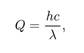

h는 플랑크상수, c는 빛의 속도, $\lambda$ 는 파장이다. Q는 에너지 (J) 이다.

### 유속
$\Phi$ 로 표현되는 유속은, 공간의 영역을 지나는 전체 에너지의 양이다.

초당 줄의 양이라 보면된다.

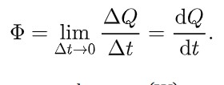

하나 예를 들면 아래와 같은 그림을 들어볼 수 있다.

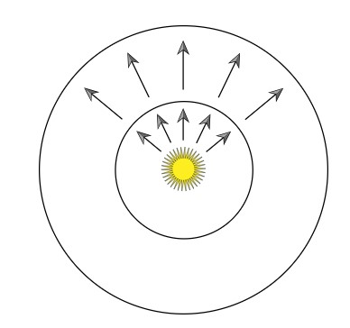

구를 보았을 때, 바깥 구와 안쪽 구 두 공간을 기준으로 보면, 유속은 똑같다고 할 수 있다.

단위 시간 당 안쪽, 바깥쪽 구를 지나는 에너지 량은 동일하기 때문이다.

따라서 단위 면적당 에너지의 양을 측정할 필요가 있고, 이게 방사 조도 및 방사 발산도라고 볼 수 있다.

### 방사 조도 / 방사 발산도

단위 면적이 정해졌을 때, 단위 면적으로 들어오는 빛의 양은 방사 조도 (E) 라 하고, 단위 면적에서 나가는 빛의 양은 방사 발산도 (M) 라고 한다.

위 점광원이 구 공간 안에 있는 예시를 이어보면, 방사 조도 측면에선 반지름이 커질수록 전체 조도가 낮아진다고 볼 수 있다.

이를 수식으로 나타내면 아래와 같다.

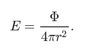

이를 특정한 점에 대해 조도 / 발산도를 정의한다면 아래와 같은 수식을 확인할 수 있겠다.

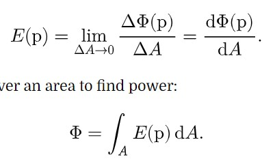

면적당 유속에 대해 면적을 0으로 극한을 취하면 계산이 가능하다.

이는 미분 영역이기 때문에 반대로 유속을 구하기 위해 모든 면적으로 적분을 계산하면 유속 계산도 가능하다.

또한 같은 양의 빛이더라도 표면 법선벡터와 빛의 방향간의 각도에 의해 단위 면적 내의 빛의 양이 줄어들 수 있다.

이는 램퍼드 법칙이라고 하며, 아래와 같은 수식이 되겠다.

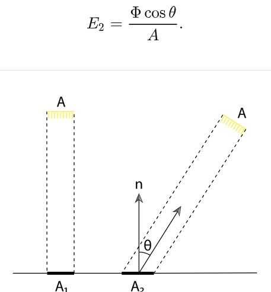

### 입체각과 강도

강도를 정의하기 위해선 입체각을 정의해야 한다.

입체각이란 3차원 상의 각도로, 구 상에서 정의가 된다.

2D와 라디안에서 각도는 원호에 매칭이된다. 아래 그림을 보도록 하자.

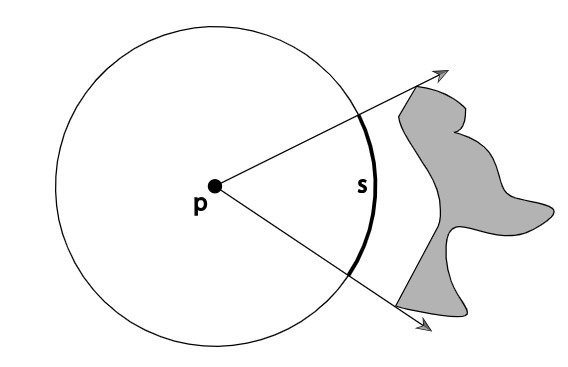

라디안의 정의는 반지름이 1인 원에서 원호가 1일 때 1 라디안이라고 정의했다.

입체각은 2D에서 정의한 내용이 3차원으로 넘어왔다 보면 된다.

원호(선) 이 면적으로 확장될 것이고 각도 또한 입체각으로 변경이 된다.

스테라디안이라는 기준이 있는데, 반지름 r에 대해 sphere cap이 $r^2$ 가 되는 입체각을 스테라디안이라고 한다.


이제 강도(Intensity)를 정의해보자

I는 전체 구에 대해선  $\Phi / (4 \pi)$ 로 정의가 된다.

점광원이 구 중심에 있다고 하고, 특정한 방향을 가리키는 벡터 w가 있다고 하면,

이 방향으로의 각도는 아래와 같이 나타낸다.

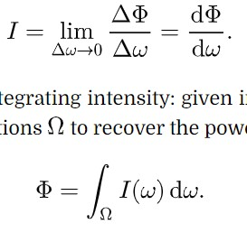

w의 변화량이 0으로 간다는 말은 해당 방향을 기준으로 입체각이 0으로 수렴한다는 의미라고 보면 된다.

마찬가지로 적분을 통해 유속을 역산할 수도 있다.


### 방사

방사 조도 / 발산도는 점p에 대해 면적당 광력을 구하지만 (스칼라값) 방향 분포를 구분하지는 않는다.

방사 발산은 여기에 방향데이터인 w를 더해 정의를 한다.

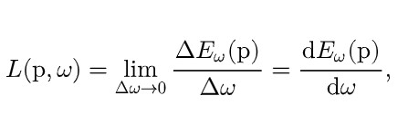

빛이 들어오는 방향에 대해 고려하지 않고 특정 방향으로 얼마나 빛이 들어오고 나가냐에 대한 함수이기 때문에 cos 값은 제거한다.

## 5.4.2 입사 / 출사 방사함수

방사함수 L은 연속적이지 않을 가능성이 있다.

거울을 생각하면 거울면에서의 방사함수와 거울 테두리의 방사함수가 다르기 때문에 특정 영역에선 불연속하다.

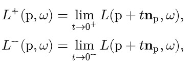

또한 표면으로 들어오는 빛에 대한 반사인지, 내가 발광을 하는건지 구분이 되어야 한다.

즉 입사와 출사가 구분이 되어야 한다.

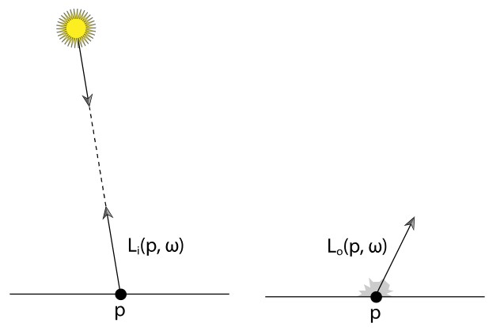

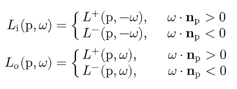

다만 입사와 출사는 방향만 다른 것이고, 매질 자체는 동일하므로 아래와 같은 식이 성립한다.

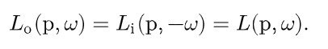

## 5.4.3 휘도와 측광

휘도는 분광 분포가 인간 관찰자에ㅔ 얼마나 밝게보이는지를 측정하는 지표이다.

휘도는 보통 Y로 표시되고, 방사 분포 L과 관련이 있으며 아래와 같이 계산된다.

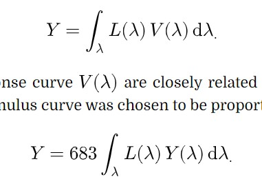

V는 분광 반응 곡선이란 것이고, 삼자극 곡선(XYZ)는 V에 비례하게 설정이 되어있다.

따라서 아래와 같이 계수를 빼고 계산이 가능하다.

이걸로 계산한 일반적인 조명들의 휘도는 아래와 같다.


# 5.5 방사 측정 적분

한 점에서의 방사 조도를 측정한다는 것은
* 해당 위치를 단위 표면으로 두고
* 보이는 모든 방향의 집합을 적분한다.

는 것과 같다.

이를 식으로 나타내면

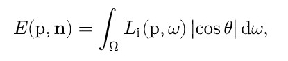

이고 그림으로 보면

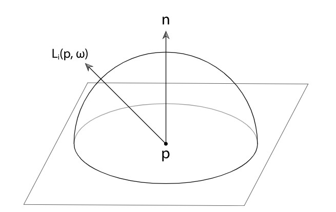

와 같이 나타낼 수 있다.

## 투영된 입체각에 대한 적분

위의 코사인 값은 방사의 정의에서 기인한다.

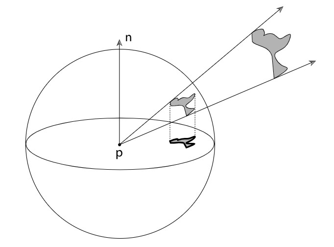

방사방향과 코사인의 곱은 표면 법선에 수직인 원반 평면에 투영된 방사방향의 투영으로 생각할 수 있다.

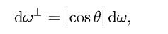

이제 특정 점에서 방사 측정을 적분한 값은 아래와 같이 변경이 가능하고,

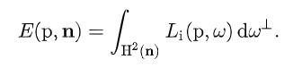

점 p를 확장하여 구 전체로 보게되면 아래와 같이 변경된다.

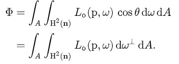

## 구 좌표에 대한 적분

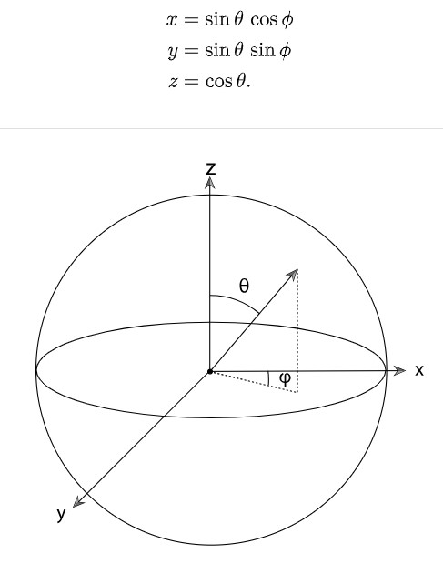

구좌표는 위와같이 표현된다.

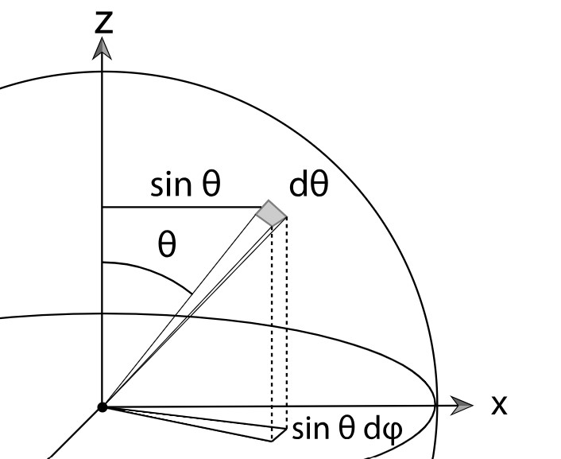

어차피 특정 점에 대해 입체각을 줄이는 것이므로, 면적을 사각형으로 보고, 이 면적을 0으로 수렴시켜도 결과는 같을 것이다.

따라서 w가 아닌 각에 대해 표현하면 아래와 같이 변환 가능하다

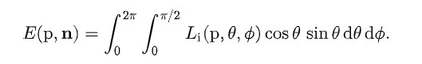

좌표와 각 간의 변환함수는 책 참고

## 면적에 대한 적분

남은 계산을 단순화 하기 위해선 방향에 대한 적분을 면적에 대한 적분으로 변환하는 것이다.

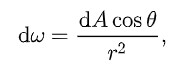

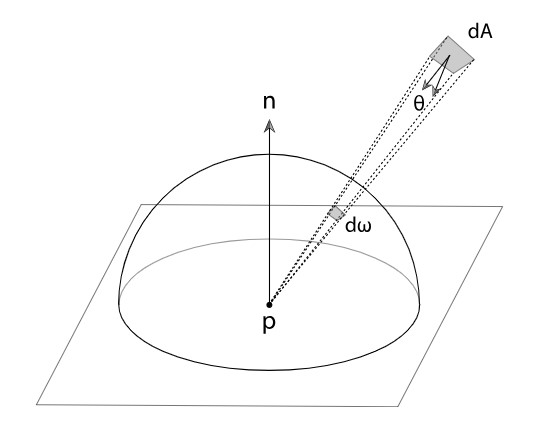

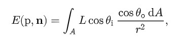

# 5.6 표면 반사

빛 반사는 두 가지 간략화가 사용됨

* BRDF
* BSSRDF

## BRDF
Li에 대해 Lo를 나타내는 단순한 표면 반사 간략화 함수

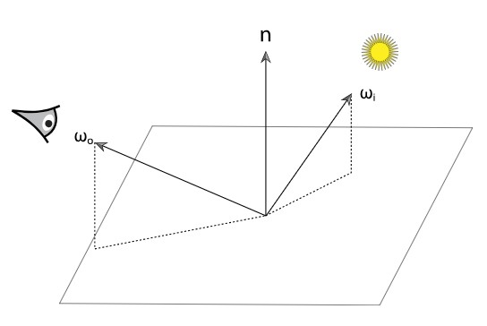

수식은 아래와 같다.

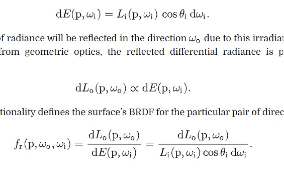

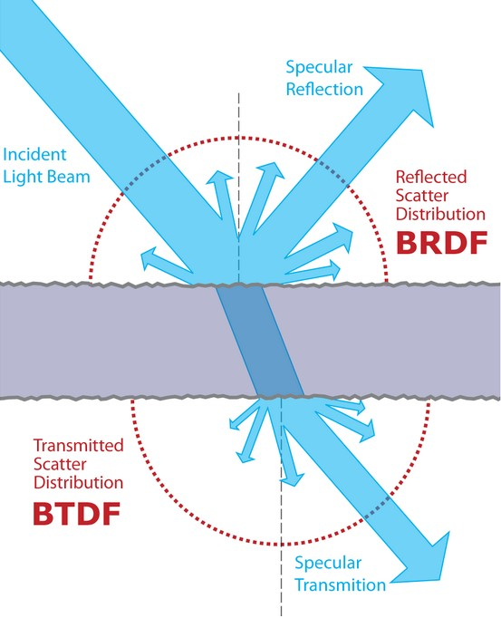

## BSSRDF
표면 반사가 아니라 내부에서 산란되는 영역까지 고려된 반사 함수

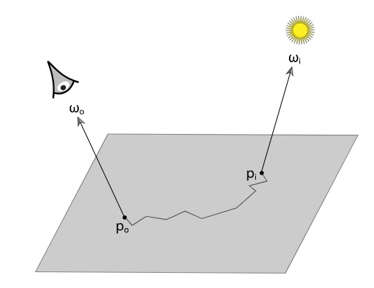

