
# 목차
### 6.1 카메라 모델


# 카메라 모델

실세계 카메라와 같이 이미지를 형성하기 위해 필요한 것들을 설명한다. 

## 6.1 카메라 모델

### Camera Class
```c++
<<Camera Declarations> =
class Camera {
public:
	<<Camera Interface>>
    Camera(const AnimatedTransform &CameraToWorld, Float shutterOpen, 
	    Float shutterClose, Film *film, const Medium *medium);
	virtual ~Camera();
	virtual Float GenerateRay(const CameraSample &sample, Ray *ray) const = 0;
	virtual Float GenerateRayDifferential(const CameraSample &sample, RayDifferential *rd) const;
	
	<<Camera Public Data>>
	AnimatedTransform CameraToWorld;
	const Float shutterOpen, shutterClose;
	Film *film;
	const Medium *medium;
}

<<Camera Declarations> +=
struct CameraSample {
    Point2f pFilm;
    Point2f pLens;
    Float time;
};
```
- 매개변수
	- `CameraToWorld` : 카메라 위치 변환 행렬
	- `shutterOpen / shutterClose` : 실세계 카메라에서 빛에 노출되는 시간을 조절하는 셔터, 이를 통해 모션 블러 등 특정 효과를 표현할 수 있음.
	- `film` : 마지막 이미지를 계산하기 위해 Film 클래스 인스턴스에 대한 포인트 ( 7.9장 )
	- `medium` : 카메라가 위치한 산란 매질을 표현하는 Medium 인스턴스에 대한 포인터 ( 11.3절 )
- 인터페이스
	- `GenerateRay` : 이미지 표본에 대한 광선을 계산 / `CameraSample` 구조체는 카메라로 광선을 설정하는 데 필요한 모든 표본 값을 가짐.
	- `GenerateRayDifferemtial` : `GenerateRay` 처럼 핵심 광선을 생성하지만, 또한 필름 면의 x, y 방향으로 한 픽셀씩 이동한 픽셀에 대응하는 광선을 계산 / 안티앨리어싱에 유용


```c++
Float Camera::GenerateRayDifferential(const CameraSample &sample, RayDifferential *rd) const 
{
    Float wt = GenerateRay(sample, rd);
    if (wt == 0) return 0;

    // Find camera ray after shifting a fraction of a pixel in the x direction
    Float wtx;
    for (Float eps : { .05, -.05 }) {
        CameraSample sshift = sample;
        sshift.pFilm.x += eps;
        Ray rx;
        wtx = GenerateRay(sshift, &rx);
        rd->rxOrigin = rd->o + (rx.o - rd->o) / eps;
        rd->rxDirection = rd->d + (rx.d - rd->d) / eps;
        if (wtx != 0)
            break;
    }
    if (wtx == 0)
        return 0;

    // Find camera ray after shifting a fraction of a pixel in the y direction
    // x 와 동일 
    
    rd->hasDifferentials = true;
    return wt;
}
```
- `GenerateRayDifferential` 에서 한 픽셀 너머의 광선을 찾는 것은 `GenerateRay()` 로 반환된 적절한 값을 `RayDifferential` 구조체에 복사

### 6.1.1 카메라 좌표 공간

- 물체 공간 ( Model / Object Space ) : 기하학적 기본체가 정의된 좌표계
- 월드 공간 ( World Space ) : 각 기본체가 각각의 물체 공간을 가질 때 장면의 모든 물체는 하나의 월드 공간에 연관되어 위치, 모든 다른 공간이 기반으로 정의되는 표준 프레임
- 카메라 공간 ( Camera Space ) : 특정 월드 공간에 위치한 카메라를 기준으로 정의되는 좌표계, z 축은 보는 방향에 대응하며, y 축은 위 방향에 대응
- 화면 공간 ( Screen Space ) : 화면 공간은 필름 면으로 정의, 화면 공간의 깊이 z 값은 0 ~ 1 까지의 값을 가지며, 각각 near, far plane 에 대응, z 값을 가지는 3D 좌표계
- 정규환된 장치 좌표 공간 ( NDC ) : 실제 렌더링되는 이미지에 대한 좌표계. 이 공간은 x, y 에서는 (0, 0) ~ (1, 1) 까지의 범위를 가짐, 깊이 값은 화면 공간과 같으며, 선형 변환으로 화면 공간에서 NDC 공간으로 변환
- 래스터 공간 ( Raster Space ) : NDC 공간과 거의 같지만, x, y 좌표가 (0, 0) ~ (resolution.x, resolution.y) 까지의 범위를 가짐.

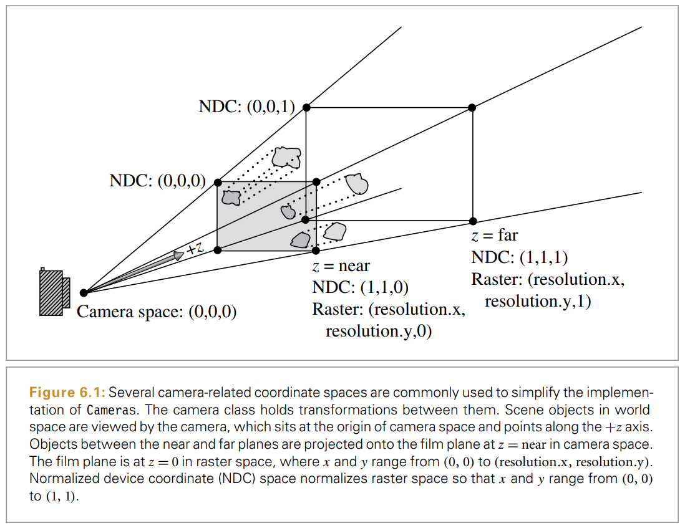

## 6.2 투영 카메라 모델

3D 컴퓨터 그래픽은 3D 의 장면을 2D 이미지로 어떻게 투영하는지다. 고전적인 방식은 4x4 투영 변환 행렬로 표현된다. 따라서 투영 행렬 카메라 클래스 `ProjectiveCamera` 를 만들고, 정사영 투영과 원근 투영을 구현한다.

```c++
<<Camera Declarations>> +=
class ProjectiveCamera : public Camera {
public :
	<<ProjectiveCamera Public Methods>>
	ProjectiveCamera(const AnimatedTransform &CameraToWorld,
					const Transform &CameraToScreen,
					const Bounds2f &screenWindow, 
					Float shutterOpen, Float shutterClose, 
					Float lensr, Float focald, Film *film,
					const Medium *medium)
		: Camera(CameraToWorld, shutterOpen, shutterClose, film, medium), 
		CameraToScreen(CameraToScreen) {
		<<Initialize depth of field parameters>>
		lensRadius = lensr;
		focalDistance = focald;

		<<Compute projective camera transformations>>
		// Compute projective camera screen transformations
		ScreenToRaster =
			Scale(film->fullResolution.x, film->fullResolution.y, 1) *
			Scale(1 / (screenWindow.pMax.x - screenWindow.pMin.x),
			1 / (screenWindow.pMin.y - screenWindow.pMax.y), 1) *
			Translate(Vector3f(-screenWindow.pMin.x, -screenWindow.pMax.y, 0));
		RasterToScreen = Inverse(ScreenToRaster);
		RasterToCamera = Inverse(CameraToScreen) * RasterToScreen;

protected :
	// ProjectiveCamera Protected Data
	Transform CameraToScreen, RasterToCamera;
	Transform ScreenToRaster, RasterToScreen;
	Float lensRadius, focalDistance;
}
```
- Camera 기반 클래스에 필요한 매개변수에 추가로 ProjectiveCamera는 투영 변환 행렬, 화면 공간 이미지 범위, 피사계 심도(DOF) 에 관련된 추가적인 매개변수를 받음.
- `lensRadius / focalDistance` : DOF 용 변수 초기화 후에 설명
- `ScreenToRaster` : 화면 공간의 한 점에서 시작해서 화면의 왼쪽 상단을 원점으로 변환한 후 화면 너비와 높이의 역수로 크기를 변환하면 0 ~ 1 사이의 x, y 좌표를 가진 점을 반환한다( NDC 좌표 ). 이후 래스터의 해상도로 크기 변환을 해 (0, 0) ~ 래스터 해상도까지의 전체 해상도를 덮는 좌표를 얻음. 이때 y 좌표가 이 변환으로 반전됨. 화면 좌표와 래스터 좌표에서의 y 의 값 방향이 반대이기 때문에


### 6.2.1 정사영 카메라

정사영 변환은 장면의 직사각형 영역을 받아 영역을 정의하는 상자의 앞면에 투영하는 것이다. 이는 아래 그림과 같다.

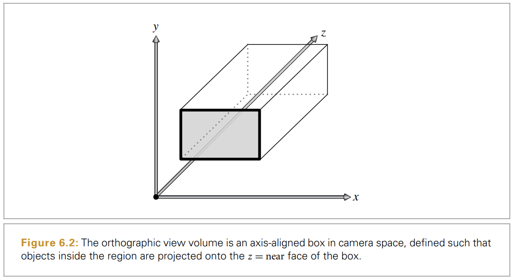

```c++
<<OrthographicCamera Declarations>> = 
class OrthographicCamera : public ProjectiveCamera {
public:
	// OrthographicCamera Public Methods
	OrthographicCamera(const AnimatedTransform &CameraToWorld,
		const Bounds2f &screenWindow, Float shutterOpen,
		Float shutterClose, Float lensRadius,
		Float focalDistance, Film *film, const Medium *medium)
	: ProjectiveCamera(CameraToWorld, Orthographic(0, 1), screenWindow,
						shutterOpen, shutterClose, lensRadius, focalDistance,
						film, medium) {
		// Compute differential changes in origin for orthographic camera rays
		dxCamera = RasterToCamera(Vector3f(1, 0, 0));
		dyCamera = RasterToCamera(Vector3f(0, 1, 0));
	}
	Float GenerateRay(const CameraSample &sample, Ray *) const;
	Float GenerateRayDifferential(const CameraSample &sample, RayDifferential *) const;

private:
	// OrthographicCamera Private Data
	Vector3f dxCamera, dyCamera;
};

Transform Orthographic(Float zNear, Float zFar) {
    return Scale(1, 1, 1 / (zFar - zNear)) * Translate(Vector3f(0, 0, -zNear));
}
```

- 정사영 시야 변환은 x, y 좌표를 변환하지 않고 유지하지만, near plane 의 z 값은 0, far plane 의 z 값은 1 로 변환한다. 이를 위해 z 축을 따라 near plane 이 z = 0 에 정렬되게 변환 후 far plane 이 z = 1 이 되게 크기 변환된다.
- `dxCamera / dyCamera` : 미분 광선의 방향들은 주광선과 같으며, 원점에서의 차이도 모든 광선에 대해 같음. 

#### GenerateRay

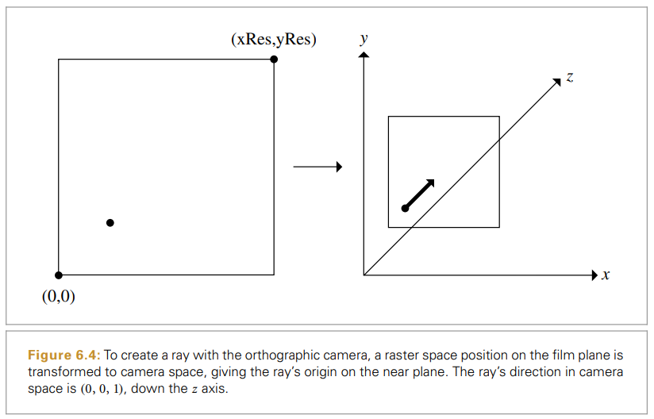

```c++
// OrthographicCamera Definitions
Float OrthographicCamera::GenerateRay(const CameraSample &sample, Ray *ray) const {
	// Compute raster and camera sample positions
	Point3f pFilm = Point3f(sample.pFilm.x, sample.pFilm.y, 0);
	Point3f pCamera = RasterToCamera(pFilm);
	*ray = Ray(pCamera, Vector3f(0, 0, 1));
	
	// Modify ray for depth of field
	if (lensRadius > 0) {
		...
	}
	ray->time = Lerp(sample.time, shutterOpen, shutterClose);
	ray->medium = medium;
	*ray = CameraToWorld(*ray);
	return 1;
}
```

- 래스터 공간 표본 지점은 카메라 공간의 점으로 변환되며, 이는 near plane 에 위치한 카메라 광선의 원점임.
- if 문 안은 depth of field 를 사용한다면 수행되는 부분이라 지금은 패스


```c++
Float OrthographicCamera::GenerateRayDifferential(const CameraSample &sample, RayDifferential *ray) const {
	// Compute raster and camera sample positions
	Point3f pFilm = Point3f(sample.pFilm.x, sample.pFilm.y, 0);
	Point3f pCamera = RasterToCamera(pFilm);
	*ray = RayDifferential(pCamera, Vector3f(0, 0, 1));

	// Modify ray for depth of field
	if (lensRadius > 0) {
		...
	}
	
	// Compute ray differentials for OrthographicCamera
	if (lensRadius > 0) {
		...
    } 
    else {
	    ray->rxOrigin = ray->o + dxCamera;
	    ray->ryOrigin = ray->o + dyCamera;
	    ray->rxDirection = ray->ryDirection = ray->d;
	}
	ray->time = Lerp(sample.time, shutterOpen, shutterClose);
	ray->hasDifferentials = true;
	ray->medium = medium;
	*ray = CameraToWorld(*ray);
	return 1;
}
```

- `GenerateRay` 와 동일하게 광선을 생성
- 미분 광선 원점의 경우 생성자에서 계산한 오프셋 dxCamera / dyCamera 를 사용하여 계산 후 월드 공간으로 변환


### 6.2.2 원근 카메라

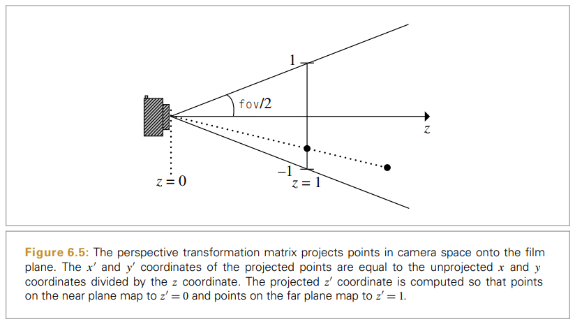

- 정사영 투영과 달리 원근 투영은 거리나 각도를 유지하지 않으며, 평행선은 평행함을 유지하지 않음.
- 그림과 같이 원근 투영 이후에 가까운 z면의 점들은 z = 0 , 먼 면의 점들은 z = 1 로 변환됨.
- 이때, z 범위를 결정하는 것이 중요한데 너무 크게 설정할 경우 수치 정밀도 오류가 발생할 수 있음.

#### 투명 변환의 단계 설명
1. 카메라 공간 점 $p$ 는 시야 면에 투영되고, 투영된 $x'$, $y'$ 좌표는 $x$, $y$ 를 $z$ 좌표 값으로 나눠서 얻는다. 투영된 $z$ 깊이는 가까운 면의 $z$ 값이 0 이고 먼 면의 $z$ 값이 1이 되도록 재조정된다. 
$$x' = x/z$$ $$y' = y/z$$ $$z' = \frac{f(z-n)}{z(f-n)}$$

$$\begin{bmatrix}
1 & 0 & 0 & 0 \\
0 & 1 & 0 & 0 \\
0 & 0 & \frac{f}{f-n} & -\frac{fn}{f-n} \\
0 & 0 & 1 & 0 \\
\end{bmatrix}$$

2. 시야각( fov ) 은 투영면의 ($x$, $y$) 값을 시야의 점이 투영된 좌표가 [-1, 1] 이 되도록 크기 조절하기 위한 것으로 간주. 밑변의 길이가 1 이므로, 높이의 길이는 tan(fov/2) 가 된다. 이 길이의 역수로 크기를 변환하면 시야를 [-1, 1] 의 범위로 변환 가능.

#### 원근 카메라 클래스

```c++
// PerspectiveCamera Declarations
class PerspectiveCamera : public ProjectiveCamera {
public:
	// PerspectiveCamera Public Methods
	PerspectiveCamera(const AnimatedTransform &CameraToWorld,
					const Bounds2f &screenWindow, Float shutterOpen,
					Float shutterClose, Float lensRadius, Float focalDistance,
					Float fov, Film *film, const Medium *medium);
	
	Float GenerateRay(const CameraSample &sample, Ray *) const;
	Float GenerateRayDifferential(const CameraSample &sample, RayDifferential *ray) const;

private:
	// PerspectiveCamera Private Data
	Vector3f dxCamera, dyCamera;
	Float A;
};

// PerspectiveCamera Method Definitions
PerspectiveCamera::PerspectiveCamera(const AnimatedTransform &CameraToWorld,
									const Bounds2f &screenWindow,
									Float shutterOpen, Float shutterClose,
									Float lensRadius, Float focalDistance,
									Float fov, Film *film, const Medium *medium)
	: ProjectiveCamera(CameraToWorld, Perspective(fov, 1e-2f, 1000.f),
					screenWindow, shutterOpen, shutterClose, lensRadius,
					focalDistance, film, medium) {
	// Compute differential changes in origin for perspective camera rays
	dxCamera = (RasterToCamera(Point3f(1, 0, 0)) - RasterToCamera(Point3f(0, 0, 0)));
	dyCamera = (RasterToCamera(Point3f(0, 1, 0)) - RasterToCamera(Point3f(0, 0, 0)));
	 
	// Compute image plane bounds at z=1 for PerspectiveCamera
	Point2i res = film->fullResolution;
	Point3f pMin = RasterToCamera(Point3f(0, 0, 0));
	Point3f pMax = RasterToCamera(Point3f(res.x, res.y, 0));
	pMin /= pMin.z;
	pMax /= pMax.z;
	A = std::abs((pMax.x - pMin.x) * (pMax.y - pMin.y));
}
```

- dxCamera / dyCamera : 픽셀 위치의 이동에 대한 카메라 공간에서 가까운 투영면의 위치 변화를 계산


### 6.2.3 얇은 렌즈 모델과 피사계 심도

렌즈 시스템을 가진 실제 카메라는 다음과 같다.
- 실제 카메라는 한정된 크기의 구경을 통해 빛을 필름 면에 집중한다. 
- 구경이 클수록 더 많은 빛이 필름에 도달 더 짧은 노출이 필요하다. 
- 하지만 렌즈는 오직 초점면에만 초점을 맞출 수 있으며, 장면에서는 이 면에서 더 멀어질수록 더 흐릿해진다.

실제 카메라처럼 광학 시스템을 모델링하기 위해 먼저 얇은 렌즈 근사부터 시작한다.
얇은 렌즈 근사에서 렌즈를 지나가는 평행 입사광선은 렌즈 뒤의 초점에 초점이 맞게 된다. 렌즈 뒤의 초점에 대한 거리 $f$ 는 렌즈의 초점 거리다.

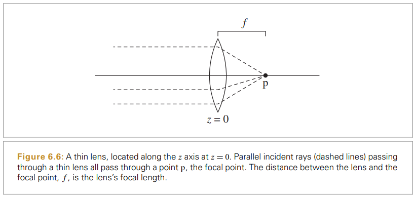

위 그림은 렌즈를 $z$ 축에 수직하게 $z = 0$ 에 놓고 장면은 $-z$ 로 향하게 한다. 렌즈의 장면 측의 거리는 변수 $z$ 로 표기하며, 렌즈의 필름 측 거리(양의 z)는 $z'$ 으로 표기한다.

렌즈까지의 거리와 렌즈에서 점의 이미지까지의 거리의 관계를 보여주는 가우스 렌즈 방정식은 다음과 같다.

$$\frac{1}{z'}-\frac{1}{z} = \frac{1}{f}$$
$$z = -\infty, z' =f$$

가우스 렌즈 방정식을 사용해서 렌즈와 필름 사이에서 초점면을 설정하는 특정 $z$ 초점 거리를 계산할 수 있다.
$$z'=\frac{fz}{f+z}$$


초점면에 위치하지 않는 점은 필름 면에서 단일 점이 아닌 원반으로 이미지화된다. 이 원반의 경계는 `착란원`이라고 부른다. 이 크기는 광선이 지나가는 구경의 직경과 초점 거리, 물체와 렌즈 사이의 거리에 영향을 받는다.
그림 6.8의 경우 피사계 심도 효과가 거의 없다. (a) 는 무한소의 구경을 통해 렌더링 되었기 때문이고, (b) 는 렌즈의 구경이 작기 때문이다. 그림 6.9의 경우 렌즈의 구경이 커지면서 초점 밖 영역의 착란원 크기가 커져 흐릿함이 생긴 것이다.

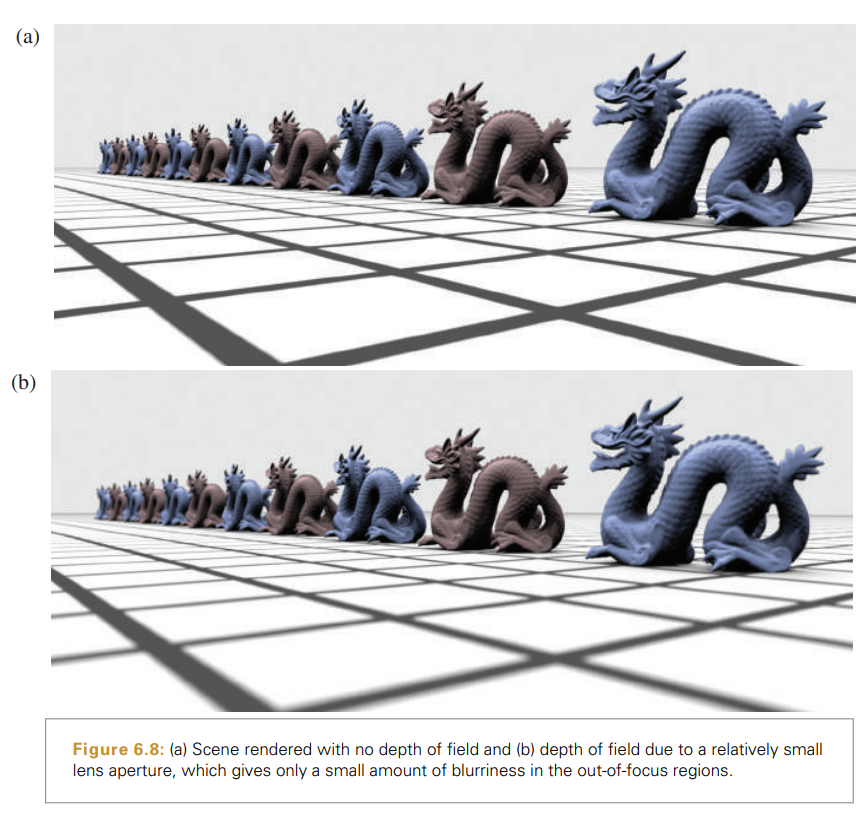

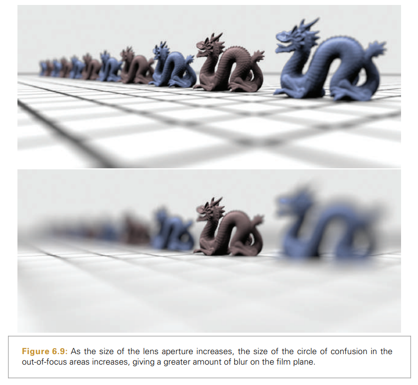

실제로 선명한 초점으로 나오기 위해 물체가 정확히 초점면에 있어야 할 필요는 없고, 픽셀보다 작기만 하면 된다. 물체가 초점이 맞게 보이는 렌즈로부터의 거리 범위를 `피사계 심도`라고 한다.

가우스 렌즈 방정식은 착란원의 크기를 계산할 수 있다. 주어진 초점 거리 $f$ 를 가진 렌즈가 거리 $z_f$ 에서 초점이 맞을 때 필름 면은 $z'_f$ 에 위치한다. 주어진 깊이 $z$ 에서 다른 점으로 가우스 렌즈 방정식은 렌즈가 초점이 맞는 거리 $z'$ 를 제공한다. 

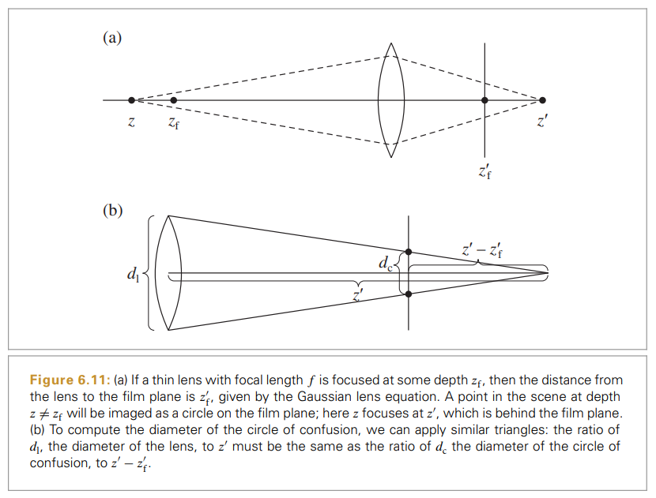


$$\frac{d_1}{z'} = \frac{d_c}{\vert z' - z'_f\vert}$$
$$d_c = \vert \frac{d_1(z'-z'_f)}{z'} \vert$$

$$d_c = \vert \frac{d_1f(z-z_f)}{z(f+z_f)} \vert$$

착락원의 직경은 렌즈의 직영에 비례한다. 렌즈 직경은 종종 렌즈의 $f-$ 수 $n$ 으로 표현되며, 이는 직경을 초점 거리의 비율로 표현해 $d_1 = f/n$ 이다.

얇은 렌즈를 레이트레이서에서 모델링하는 것은 명료하다. 필요한 것은 렌즈 위의 한 점을 선택해 해당 점에서 시작해 초점면 안의 물체가 필름에서 초점면에 있게 하는 광선을 찾는 것이다.

그러므로 렌즈 구경의 크기와 초점 거리 변수가 필요하다. 

```c++
<<Camera Declarations>> +=
class ProjectiveCamera : public Camera {
public :
	<<ProjectiveCamera Public Methods>>
	ProjectiveCamera(...) {}

protected :
	Float lensRadius, focalDistance;
}
```

```c++
	Vector3f dir = Normalize(Vector3f(pCamera.x, pCamera.y, pCamera.z));
	*ray = RayDifferential(Point3f(0, 0, 0), dir);
	 // Modify ray for depth of field
    if (lensRadius > 0) {
	    // Sample point on lens
	    Point2f pLens = lensRadius * ConcentricSampleDisk(sample.pLens);
	    // Compute point on plane of focus
	    Float ft = focalDistance / ray->d.z;
	    Point3f pFocus = (*ray)(ft);

		// Update ray for effect of lens
		ray->o = Point3f(pLens.x, pLens.y, 0);
		ray->d = Normalize(pFocus - ray->o);
    }
```


## 6.3 환경 카메라

장면에 있는 한 점 주변의 모든 방향의 광선을 추적해 한 점에서 보이는 모든 것을 2D 시점으로 제공하는 카메라 모델을 설명한다.
- 장면의 카메라 위치 주변의 구가 있다고 생각하고, 구 위의 점에 들어오는 모든 빛을 표현한다. 
- 구를 매개변수화하면 구의 각 점은 $( \theta, \phi )$ 로 정의퇴며, $\theta \in [0, \pi], \phi \in [0, 2\pi]$ 의 범위를 가진다. 

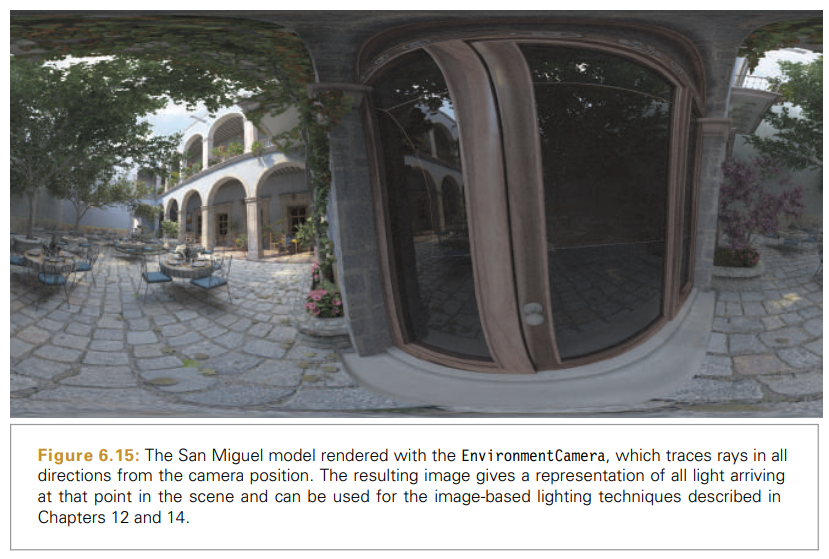

```c++
// EnvironmentCamera Method Definitions
Float EnvironmentCamera::GenerateRay(const CameraSample &sample, Ray *ray) const {
	// Compute environment camera ray direction
	Float theta = Pi * sample.pFilm.y / film->fullResolution.y;
	Float phi = 2 * Pi * sample.pFilm.x / film->fullResolution.x;
	Vector3f dir(std::sin(theta) * std::cos(phi), std::cos(theta),
				std::sin(theta) * std::sin(phi));
	*ray = Ray(Point3f(0, 0, 0), dir, Infinity,
				Lerp(sample.time, shutterOpen, shutterClose));
	ray->medium = medium;
	*ray = CameraToWorld(*ray);
	return 1;
}
```


## 6.4 사실적 카메라

얇은 렌즈 모델은 피사계 심도로 인한 흐릿함을 가진 이미지를 렌더링할 수 있지만, 실제 카메라 렌즈 시스템은 다중 렌즈로 되어있어 이에 비해 상당히 거친 간략화가 되어있다. 

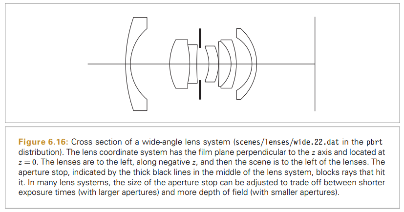

이러한 다중 렌즈 시스템을 통한 빛을 초점을 모사하는 RealisticCamera 구현을 다룬다. 

```c++
class RealisticCamera : public Camera {
public:
	// RealisticCamera Public Methods
	RealisticCamera(const AnimatedTransform &CameraToWorld, Float shutterOpen,
					Float shutterClose, Float apertureDiameter,
					Float focusDistance, bool simpleWeighting,
					::vector<Float> &lensData, Film *film,
					const Medium *medium);
	Float GenerateRay(const CameraSample &sample, Ray *) const;
	...
private:
	// RealisticCamera Private Data
	const bool simpleWeighting;
	...
};
```

### 6.4.1 렌즈 시스템 표현

렌즈 시스템은 일련의 렌즈 요소로 생성되며, 각 요소는 일반적으로 유리의 어떤 행태다. 생산하기 가장 쉬운 렌즈는 단면이 구인 렌즈며, 렌즈 시스템은 일반적으로 $z$ 로 표기하는 규약을 가진 광학축 주변에서 대칭이다. 
렌즈 시스템은 일반적으로 각 요소의 명시적인 표현을 갖기보다 개별 렌즈 요소 사이에서 일련의 접점으로 표현한다.

- 표의 마지막 항목은 가장 오른쪽의 접점을 정의하며, 이는 곡률 반경과 같은 반경을 가진 구의 일부
- 요소의 두께는 $z$ 를 따라 다음 요소의 오른쪽 과의 거리
- 굴절률은 접점의 오른쪽 매질
- 요소의 $z$ 축 위와 아래의 범위는 구경의 직경

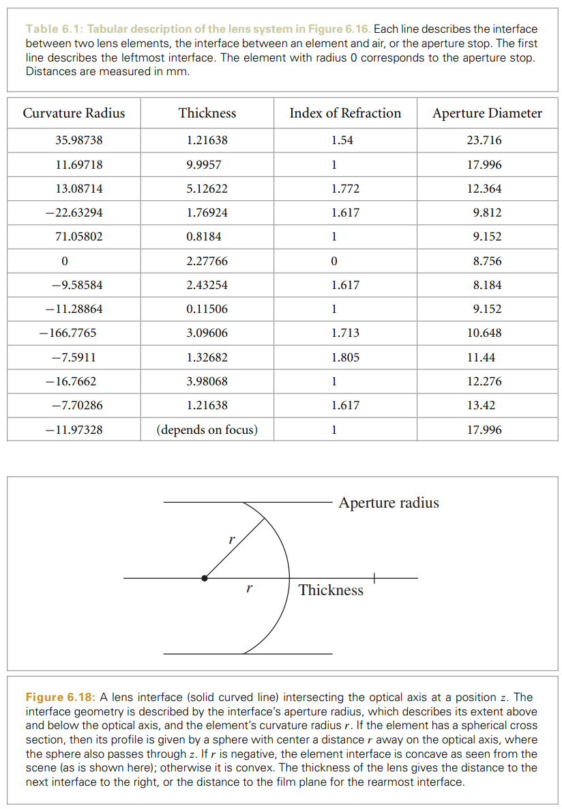

```c++
// RealisticCamera Private Declarations
struct LensElementInterface {
	Float curvatureRadius;
	Float thickness;
	Float eta;
	Float apertureRadius;
};

// RealisticCamera Private Data
std::vector<LensElementInterface> elementInterfaces;
std::vector<Bounds2f> exitPupilBounds;

// RealisticCamera Private Methods
Float LensRearZ() const { return elementInterfaces.back().thickness; }
Float LensFrontZ() const {
	Float zSum = 0;
	for (const LensElementInterface &element : elementInterfaces)
		zSum += element.thickness;
	return zSum;
}
Float RearElementRadius() const {
	return elementInterfaces.back().apertureRadius;
}
```


### 6.4.2 렌즈를 지나는 광선의 추적

```c++
bool RealisticCamera::TraceLensesFromFilm(const Ray &rCamera, Ray *rOut) const {
	Float elementZ = 0;
	// Transform rCamera from camera to lens system space
	static const Transform CameraToLens = Scale(1, 1, -1);
	Ray rLens = CameraToLens(rCamera);
	for (int i = elementInterfaces.size() - 1; i >= 0; --i) {
		const LensElementInterface &element = elementInterfaces[i];
		// Update ray from film accounting for interaction with element
		elementZ -= element.thickness;

		// Compute intersection of ray with lens element
		Float t;
		Normal3f n;
		bool isStop = (element.curvatureRadius == 0);
		if (isStop) {
			t = (elementZ - rLens.o.z) / rLens.d.z;
		} else {
			Float radius = element.curvatureRadius;
			Float zCenter = elementZ + element.curvatureRadius;
			if (!IntersectSphericalElement(radius, zCenter, rLens, &t, &n))
				return false;
		}

		// Test intersection point against element aperture
		Point3f pHit = rLens(t);
		Float r2 = pHit.x * pHit.x + pHit.y * pHit.y;
		if (r2 > element.apertureRadius * element.apertureRadius) return false;
		rLens.o = pHit;

		// Update ray path for element interface interaction
		if (!isStop) {
			Vector3f w;
			Float etaI = element.eta;
			Float etaT = (i > 0 && elementInterfaces[i - 1].eta != 0)
							? elementInterfaces[i - 1].eta
							: 1;
			if (!Refract(Normalize(-rLens.d), n, etaI / etaT, &w)) return false;
			rLens.d = w;
		}
	}
	// Transform _rLens_ from lens system space back to camera space
	if (rOut != nullptr) {
		static const Transform LensToCamera = Scale(1, 1, -1);
		*rOut = LensToCamera(rLens);
	}
	return true;
}
```

- 렌즈 시스템의 필름 면에서 시작하는 광선이 주어질 때  TraceLensesFromFilm() 은 각 요소와의 교차점을 차례로 계산한다.
- 렌즈 시스템을 지나면서 경로가 막히는 경우 광선을 종료하고 fasle 를 리턴한다.
- 그렇지 않을 경우 true 를 리턴하고, *rOut 를 카메라 공간에서 나가는 광선으로 초기화한다.
- 횡단하는 동안 elementZ 는 현재 렌즈 요소의 z 절편을 추적한다.

1. 광선이 필름에서 시작하기에 렌즈는 elementInterfaces 에 저장된 수선의 반대로 횡단 
2. 카메라 공간에서 +z 축의 아래로 바라보지만 렌즈는 -z 따라 있으므로 광선의 방향을 뒤집는다.
3. 광선을 따라 요소 접점과 교차하는 매개변수 t 를 계산한다. 
	- 구경 조리개에 대해서 광선-평면 테스트
	- 구형 접점에 대해서는 IntersectSphericalElement() 테스트 수행하여 교차점을 찾는다. Intersect() 와 유사
4. 요소와의 교차점이 이 반경 밖이면 광선은 실제로 렌즈 덮개와 교차하는 경우와 광선이 구경 조리개에 교차하는 경우 종료한다. 
5. 요소가 구경이면 광선의 경로는 변하지 않지만, 유리 렌즈 요소에 대해 광선의 방향은 접점에서 어떤 굴절률을 가진 매질에서 다른 굴절률을 가진 매질로 가면서 변화한다. 
6. 광선이 앞 렌즈 요소까지 성공적으로 가면 렌즈 공간에서 카메라 공간으로 변환하여 넘겨준다.


### 6.4.3 두꺼운 렌즈 근사

얇은 렌즈 근사는 렌즈 시스템이 광학축에 대해 두께가 0 을 가진다는 단순화 가정에 기반을 둔다. 여기서는 렌즈 시스템의 z 너비를 고려하려 좀 더 정확하게 계산한다.
두꺼운 렌즈 근사는 광학축에 대한 두 쌍의 거리인 초점과 주평면의 깊이로 렌즈 시스템을 표현한다. 이를 렌즈 시스템의 기본점( cardinal point ) 이다. 광학축에 평행한 광선을 이상적인 렌즈 시스템을 통해 추적할 때 모든 광선이 동일점에서 광학축과 교차하며, 이를 초점(focal point)라 한다.

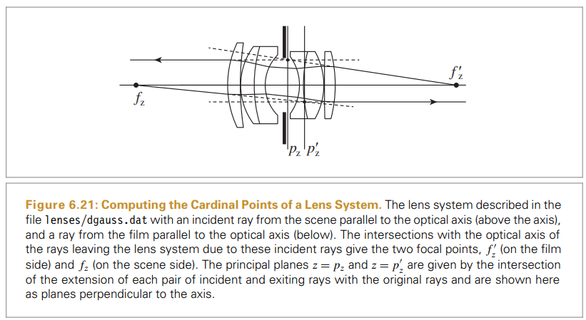

주평면은 광학축과 평행한 입사광선과 렌즈를 떠나는 광선을 둘이 교차할 때까지 확장하여 찾는다.
렌즈를 떠나는 주어진 광선에서 초점을 찾는 것은 우선 $t_f$ 값을 광선이 $x,y$ 요소가 0 인 곳을 찾는 것이다.
$$o_x+t_fd_x =0 => t_f = -o_x/d_x$$

비슷한 방식으로, 렌즈를 떠나는 광선이 원래 광선과 같은 $x$ 높이를 가지면 주평면에 대해서 $t_p$ 를 찾는 것은 다음과 같다.
$$o_x+t_pd_x = x => t_p = (x-o_x)/d_x$$

다음 메서드는 초점의 z 깊이와 주어진 광선에 대한 주평면을 계산한다.
```c++
void RealisticCamera::ComputeCardinalPoints(const Ray &rIn, const Ray &rOut, Float *pz, Float *fz) {
	Float tf = -rOut.o.x / rOut.d.x;
	*fz = -rOut(tf).z;
	Float tp = (rIn.o.x - rOut.o.x) / rOut.d.x;
	*pz = -rOut(tp).z;
}
```

다음의 메서드는 렌즈 시스템에서 기본점의 두 쌍을 계산한다.
```c++
void RealisticCamera::ComputeThickLensApproximation(Float pz[2], Float fz[2]) const {
	// Find height x from optical axis for parallel rays
	Float x = .001 * film->diagonal;

	// Compute cardinal points for film side of lens system
	Ray rScene(Point3f(x, 0, LensFrontZ() + 1), Vector3f(0, 0, -1));
	Ray rFilm;
	TraceLensesFromScene(rScene, &rFilm);
	ComputeCardinalPoints(rScene, rFilm, &pz[0], &fz[0]);

	// Compute cardinal points for scene side of lens system
	rFilm = Ray(Point3f(x, 0, LensRearZ() - 1), Vector3f(0, 0, 1));
	TraceLensesFromFilm(rFilm, &rScene);
	ComputeCardinalPoints(rFilm, rScene, &pz[1], &fz[1]);
}
```

1. 추적할 광선에 대한 x 축을 따라 높이를 선택한다. x = 0 보다는 크고 구경 조리개에 충돌하지 않을 정도로 선택한다. 여기서는 필름의 대각 범위에 대한 낮은 비율을 사용한다.
2. 필름 및 장면 측에서 각각의 두 기본점을 계산한다.


### 6.4.4 조점 조정

렌즈 시스템은 장면의 주어진 깊이에 초점이 맞게 하기 위해 시스템을 필름에 상대적으로 이동시켜 원하는 초점 거리 이미지가 필름 면 위의 점에 초점이 맞게 한다. 두꺼운 렌즈에 대해 가우스 렌즈 방정식은 장면 안의 z 에 있는 점에서의 거리와 z' 에서의 이 점이 초점에 대해 다음과 같은 관계를 가진다.

$$\frac{1}{z'-p'_z}-\frac{1}{z-p_z}=\frac{1}{f}$$

주평면의 $p_z, p'_z$ 의 위치를 알고 렌즈 $f$ 의 초점 거리를 알면서 광학축을 따른 일정 거리 $z$ 에서 초점을 맞추고 싶을 때 다음이 성립하도록 얼마나 이동할지에 대한 $\delta$ 를 결정해야 한다.

$$\frac{1}{z'-p'_z+\delta}-\frac{1}{z-p_z + \delta}=\frac{1}{f}$$
$$\delta = \frac{1}{2}(p_z-z_f+p'_z-\sqrt{(p_z-z_f-z')(z-z_f-4f-p'_z)})$$

```c++
Float RealisticCamera::FocusThickLens(Float focusDistance) {
	Float pz[2], fz[2];
	ComputeThickLensApproximation(pz, fz);

	Float f = fz[0] - pz[0];
	Float z = -focusDistance;
	Float c = (pz[1] - z - pz[0]) * (pz[1] - z - 4 * f - pz[0]);

	Float delta = 0.5f * (pz[1] - z + pz[0] - std::sqrt(c));
	return elementInterfaces.back().thickness + delta;
}
```


### 6.4.5 출사동

필름 면 위의 점에 대해 후방 렌즈 요소를 향하는 모든 광선이 성공적으로 렌즈 시스템을 빠져나가지 못한다. 일부는 구경 조리개에 막히거나 렌즈 시스템 마개에 교차한다. 렌즈 시스템을 통해 빛을 전송하는 후방 요소 위에 있는 점의 집합을 `출사동`이라 한다. 

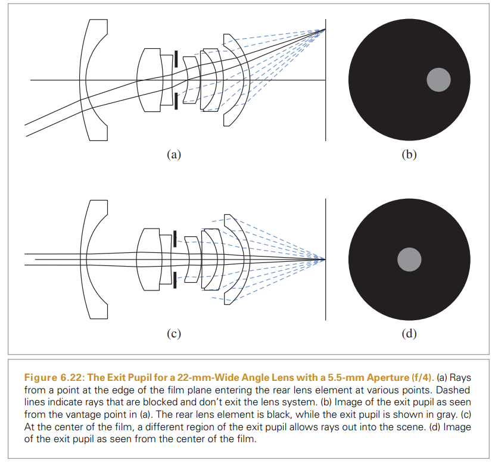

RealisticCamera 구현은 필름 면 위의 선분에 대해서만 출사동을 미리 계산한다. 렌즈 시스템이 광학축 주변으로 방사형으로 대칭적이면 출사동의 경계 역시 방사형으로 대칭적이며, 필름 면 위의 임의의 점도 이런 선분을 회전해서 찾을 수 있다.

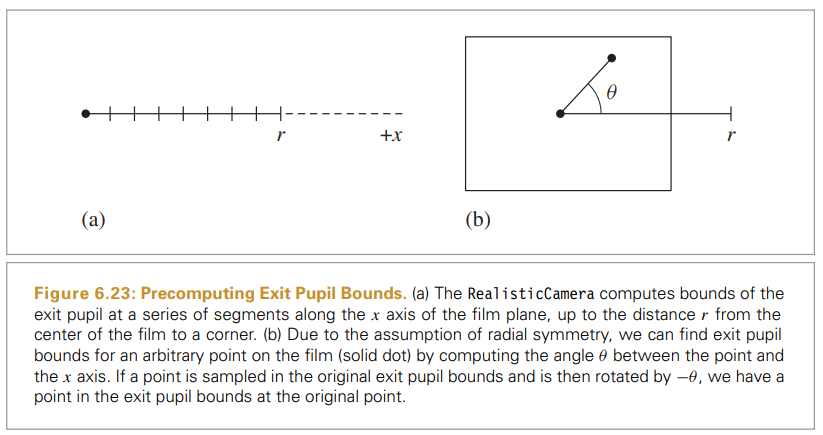

```c++
 // Compute exit pupil bounds at sampled points on the film
 int nSamples = 64;
 exitPupilBounds.resize(nSamples);
 ParallelFor([&](int i) {
	 Float r0 = (Float)i / nSamples * film->diagonal / 2;
	 Float r1 = (Float)(i + 1) / nSamples * film->diagonal / 2;
	 exitPupilBounds[i] = BoundExitPupil(r0, r1);
 }, nSamples);
```

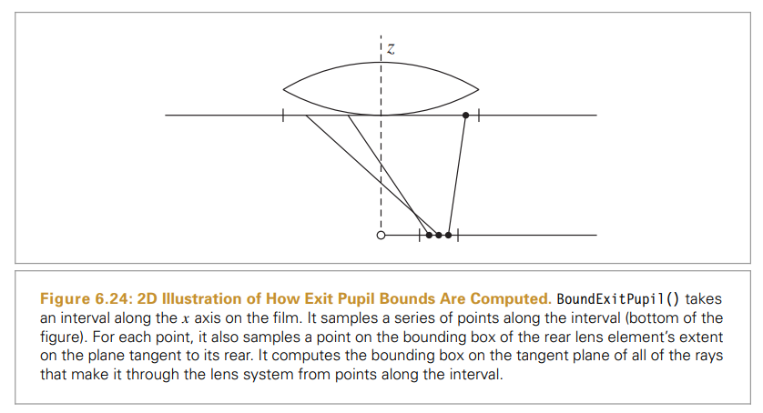

- BoundExitPupil 메서드는 필름 면에 있는 선분 위의 점에서 본 2D 경계 상자를 계산한다. 후방 렌즈 요소에 접하는 면 위에 있는 점들의 집합에서 렌즈 시스템을 통해 광선을 추적하는 것으로 경계 상자를 계산한다. 

```c++
Bounds2f RealisticCamera::BoundExitPupil(Float pFilmX0, Float pFilmX1) const {
	Bounds2f pupilBounds;
	// Sample a collection of points on the rear lens to find exit pupil
	const int nSamples = 1024 * 1024;
	int nExitingRays = 0;

	// Compute bounding box of projection of rear element on sampling plane
	Float rearRadius = RearElementRadius();
	Bounds2f projRearBounds(Point2f(-1.5f * rearRadius, -1.5f * rearRadius),
							Point2f(1.5f * rearRadius, 1.5f * rearRadius));
	for (int i = 0; i < nSamples; ++i) {
		// Find location of sample points on $x$ segment and rear lens element
		Point3f pFilm(Lerp((i + 0.5f) / nSamples, pFilmX0, pFilmX1), 0, 0);
		Float u[2] = {RadicalInverse(0, i), RadicalInverse(1, i)};
		Point3f pRear(Lerp(u[0], projRearBounds.pMin.x, projRearBounds.pMax.x),
					Lerp(u[1], projRearBounds.pMin.y, projRearBounds.pMax.y),
					LensRearZ());

		// Expand pupil bounds if ray makes it through the lens system
		if (Inside(Point2f(pRear.x, pRear.y), pupilBounds) ||
			TraceLensesFromFilm(Ray(pFilm, pRear - pFilm), nullptr)) {
			pupilBounds = Union(pupilBounds, Point2f(pRear.x, pRear.y));
			++nExitingRays;
		}
	}

	// Return entire element bounds if no rays made it through the lens system
	if (nExitingRays == 0) {
		return projRearBounds;
	}
	// Expand bounds to account for sample spacing
	pupilBounds = Expand(pupilBounds, 2 * projRearBounds.Diagonal().Length() / std::sqrt(nSamples));
	return pupilBounds;
}
```

- 구현에서는 출사동을 밀도 있게 ( 각 선분당 전체 1024^2 점에서 ) 표본화한다. 
- 필름 위의  x 의 표본점은 x 간격 말단점 사이를 선형 보간해 얻을 수 있다. RadicalInverse() 는 이후에 설명
- pFilm 에서 pRear 로의 광선을 생성할 수 있고, 또한 이 광선이 렌즈 시스템의 전방에서 나가는 것을 체크하면 출사동 안에 있는지 확인할 수 있다. 
- 표본 광선 중 모두 렌즈 시스템을 지나지 않을 수 있다. 이 경우 전체 후방 렌즈 요소를 지나는 경계를 리턴한다.
- 한 표본이 렌즈 시스템을 지나가 주변 표본 중 하나가 지나지 않을 경우 주변에 매우 가까운 다른 표본이 생성된다. 그러므로 이 불확실성을 고려하기 위해서 표본 간격이 확장된다.

위의 연산으로 경계를 계산해 저장하면 SampleExitPupil() 메서드는 필름 면 위의 주어진 점에 대한 출사동 위의 경계를 찾을 수 있다.

```c++
Point3f RealisticCamera::SampleExitPupil(const Point2f &pFilm, const Point2f &lensSample, 
										Float *sampleBoundsArea) const {
	// Find exit pupil bound for sample distance from film center
	Float rFilm = std::sqrt(pFilm.x * pFilm.x + pFilm.y * pFilm.y);
	int rIndex = rFilm / (film->diagonal / 2) * exitPupilBounds.size();
	rIndex = std::min((int)exitPupilBounds.size() - 1, rIndex);
	Bounds2f pupilBounds = exitPupilBounds[rIndex];
	if (sampleBoundsArea) *sampleBoundsArea = pupilBounds.Area();

	// Generate sample point inside exit pupil bound
	Point2f pLens = pupilBounds.Lerp(lensSample);
	// Return sample point rotated by angle of pFilm with +x axis
	Float sinTheta = (rFilm != 0) ? pFilm.y / rFilm : 0;
	Float cosTheta = (rFilm != 0) ? pFilm.x / rFilm : 1;
	return Point3f(cosTheta * pLens.x - sinTheta * pLens.y,
					sinTheta * pLens.x + cosTheta * pLens.y, LensRearZ());
}
```

- 


### 6.4.6 광선 생성

필름 면 위의 표본 위치를 계산하고 이 점에서 후방 렌즈 요소로의 광선을 생성 후, 렌즈 시스템을 통해 추적한다.

```c++
Float RealisticCamera::GenerateRay(const CameraSample &sample, Ray *ray) const {
	++totalRays;
	// Find point on film, pFilm, corresponding to sample.pFilm
	Point2f s(sample.pFilm.x / film->fullResolution.x,
				sample.pFilm.y / film->fullResolution.y);
	Point2f pFilm2 = film->GetPhysicalExtent().Lerp(s);
	Point3f pFilm(-pFilm2.x, pFilm2.y, 0);

	// Trace ray from _pFilm_ through lens system
	Float exitPupilBoundsArea;
	Point3f pRear = SampleExitPupil(Point2f(pFilm.x, pFilm.y), sample.pLens, &exitPupilBoundsArea);
	Ray rFilm(pFilm, pRear - pFilm, Infinity, Lerp(sample.time, shutterOpen, shutterClose));
	if (!TraceLensesFromFilm(rFilm, ray)) {
		++vignettedRays;
		return 0;
	}

    // Finish initialization of _RealisticCamera_ ray
    *ray = CameraToWorld(*ray);
    ray->d = Normalize(ray->d);
    ray->medium = medium;

    // Return weighting for RealisticCamera ray
    Float cosTheta = Normalize(rFilm.d).z;
    Float cos4Theta = (cosTheta * cosTheta) * (cosTheta * cosTheta);
    if (simpleWeighting)
        return cos4Theta * exitPupilBoundsArea / exitPupilBounds[0].Area();
    else
        return (shutterClose - shutterOpen) *
               (cos4Theta * exitPupilBoundsArea) / (LensRearZ() * LensRearZ());
}
```

- CameraSample::pFilm 값은 이미지의 픽셀 단위로 전체 해상도다. 여기서 센서의 물리적 모델로 작동하면 $[0, 1)^2$ 안의 표본으로 변환해 시작한다. 필름 위의 대응하는 점은 면적에 대해 이 표본점에 대한 선형 보간으로 찾는다.
- SampleExitPupil 은 후방 렌즈 요소에 대한 접면 위의 점을 제공하며, 이는 광선의 방향을 결정한다. 이 광선을 렌즈 시스템을 통해 추적할 수 있다.
- 렌즈 시스템을 광선이 성공적으로 빠져나가면 ray 를 셋팅해준다.
- 이후 몬테카를로 적분 후 값을 리턴한다. 이 부분은 13장에서 설명


### 6.4.7 카메라 측정 방정식

필름에 대한 출사동에서의 광선은 장면에서의 방사를 운반한다. 출사동을 떠나는 방사의 분포는 필름 위의 점에서 볼 수 있는 초점이 맞지 않는 흐릿함의 양에 영향을 준다. 

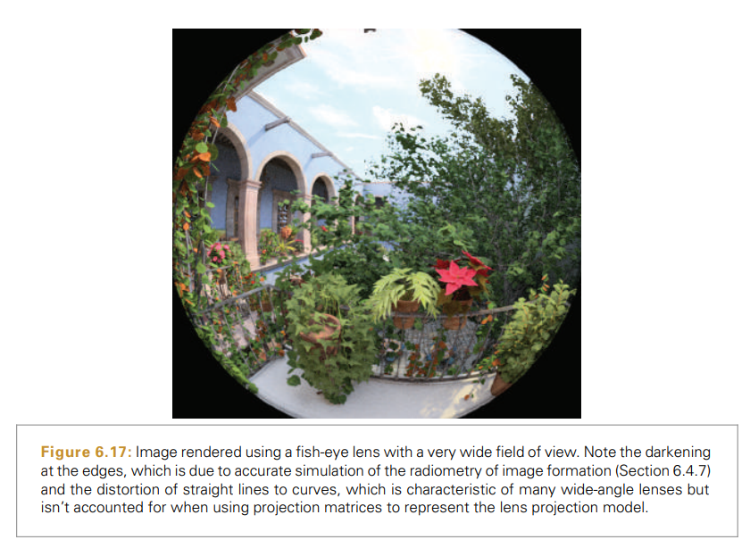
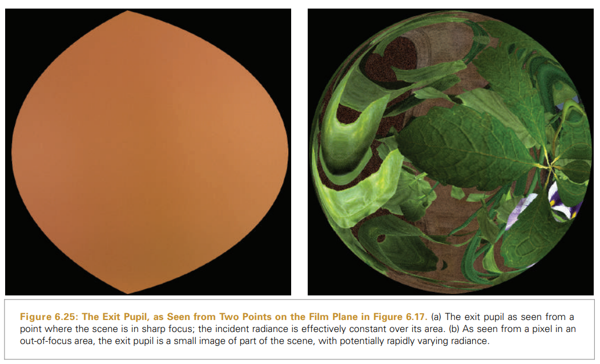

주어진 입사 방사 함수에서 필름 면에 있는 점에서의 방사 조도를 정의할 수 있다.


$$E(P,N) = \int\limits_\Omega L_i(p,\omega) \vert cos \theta \vert d\omega$$
$$d\omega = \frac{dA cos\theta}{r^2}$$

$$E(p)=\int\limits_{A_e}L_i(p,p')\frac{\vert cos\theta cos\theta'\vert}{\vert\vert p'-p \vert\vert ^2} dA_e$$


$$E(p)=\frac{1}{z^2}\int\limits_{A_e}L_i(p,p')\vert cos^4\theta\vert d A_e$$

셔타가 열린 시간에 대한 필름 위에서 방사 조도의 적분은 선속을 제공하며, 이는 단위 면적당 에너지에 대한 방사 분석 단위로서 $J/m^2$ 이다.

$$h(p)=\frac{1}{z^2}\int\limits_{t0}^{t1}\int\limits_{A_e} L_i(p,p',t')\vert cos^4\theta\vert d A_e dt'$$

필름 면 위에 도달하는 에너지의 양을 포착하는 점에서의 선속을 측정하는 것은 부분적으로 카메라 셔터가 열린 시간의 길이와 관련있다. 사진 필름은 작은 영역에 대한 방사 에너지를 측정한다. 센서 픽셀 영역 $A_p$ 에 대해 적분하면 다음과 같다 이는 픽셀에 도달하는 줄 값이다.

$$J=\frac{1}{z^2}\int\limits_{A_p}\int\limits_{t0}^{t1} \int\limits_{A_e} L_i(p,p',t')\vert cos^4\theta\vert d A_e dt'dA_p$$
