# 목차
#### 표본화 정리
#### 집합체이미지 표본 인터페이스
#### 층별 표본화
---


# 표본화 정리
 - 디지털 이미지의 픽셀은 실제 아날로그 세상과는 다르게 이산적
 - 픽셀위치의 정확한 표본을 추출하는 것 보다 다른 위치의 여러 표본을 얻어 최종 픽셀 값을 계산하는것이 효율적
 - 이렇게 여러 표본을 얻고 원 이미지와 가깝게 픽셀값을 계산하는 것이 7장의 목표
 - 여기서 근사화를 포함하고 있기에 앨리어싱이 생성
 - 보통 앨리어싱은 표본 추출과정에서 충분한 양의 표본을 추출하지 못해 발생


 - 1D 함수 $f(x)$에 대한 표본화 예시
 - 표본을 추출했다면 다시 연속 함수로 재구성 할 수 있다.
 - 푸리에 분석을 통해 원 함수와 재구성한 함수를 통해 얼마나 일치하는지 분석 가능하다.

## 주파수 영역과 푸리에 변환
[푸리에 변환](https://darkpgmr.tistory.com/171)
 - 푸리에 변환을 통해 대부분의 함수를 $sin$ $cos$ 함수의 선형 식으로 나타낼 수 있다
 - 이때 각 파동 함수는 특정 주파수 공간으로 표현이 가능
 - 이 주파수 공간은 함수의 고유 특성


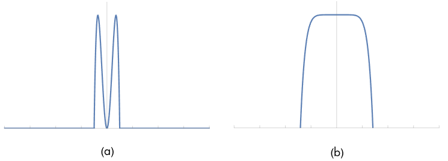

 - 위쪽 사진의 a와 b는 각각 저주파와 고주파의 함수 그래프
 - 아래쪽 사진의 a와 b는 이를 주파수 공간으로 표현했을 때 주파수 $w$에 대한 함수 공간 영역에서의 영향
 - 각 주파수 영역을 통해 함수 구분 가능

#### $F(w) = \int_{-\infty}^{\infty}f(x)e^{-i2\pi wx}dx$
 - 1차원 함수 $f(x)$의 푸리에 변환
 - 단숨함을 위해 여기서는 우함수만 고려, 이 경우 푸리에 변환은 허수항을 갖지 않는다

#### $f(x) = \int_{-\infty}^{\infty}F(w)e^{i2\pi wx}dw$
 - 푸리에 합성, 푸리에 역변환을 이용해 주파수 영역에서 다시 공간 영역으로 되돌릴 수 있다.
 - 새 함수 $F$는 주파수 $w$의 함수
 - 여기서 푸리에 변환 연산자를 $\mathcal{F}$ 로 표기
 - 이 연산자는 선형 연산자
 - $\mathcal{F}|f(x)| = \mathcal{F}(w)$, $\mathcal{F}|af(x)| = a\mathcal{F}$|f(x)|$, $\mathcal{F}|f(x) + g(x)| = \mathcal{F}|f(x)| + \mathcal{F}|g(x)|$
 

 - 표에 존재하는 많은 수는 $\int \delta(x)dx = 1$ 이며, 0이 아닌 모든 $x$에 대해서 $\delta(x) = 0$
 - 이런 함수들은 특별히 디렉 델타 분포에 기반하고 있다. 이 특성들은 다음과 같은 결과를 갖는다.
 - #### $\int f(x) \delta (x) dx = f(0)$

## 이상적인 표본화와 재구성

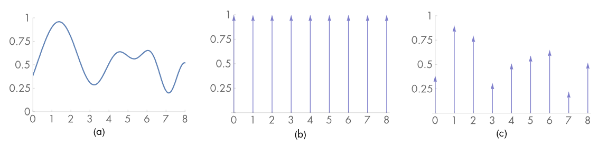
 - 표본화 과정은 균일한 간격의 표본위치의 집합을 선택하고 각 포지션의 함수 값을 계산
 - 위 사진은 표본화 과정의 예시이다.
 - 이때 사용한 함수는 균일 간격 델타 함수의 무한 합인 샤 함수


 - 여기서 T는 주기 혹은 표본화율


 - 곱 연산은 균일 간격 점에서 함수 합의 무한 수열을 생산


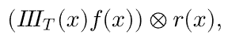

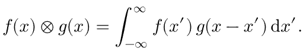


 - 재구성 필터함수 $r(x)$와 콘볼루션을 계산하여 재구성 함수 정의

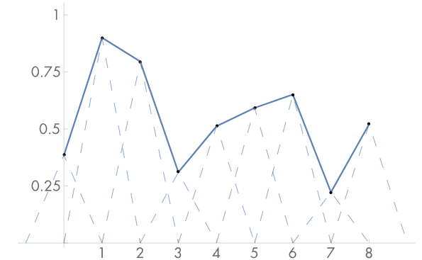
 - 재구성 필터 $f(x) = max(0, 1 - |x|)$를 사용한 예시
 - 표본을 얻은 함수를 주파수 영역에서 분석한다면 표본 위치의 값을 통해 정확히 복구 될 수 있는 조건을 알 수 있다.
 - 이를 통해 함수 $f(x)$가 대역 제한을 갖는다 가정할 수 있다.
 - 푸리에 변환의 중요한 특성은 두 함수의 곱의 푸리에 변환이 각각의 푸리에 변환의 콘볼루션으로 나타낼 수 있다는 점
 - $\mathcal{F}(f(x)g(x)) = F(w)\circledast g(x)$, $\mathcal{F}(f(x)\circledast g(x)) = F(w)G(w)$
 - 이를 통해 샤 함수와 원 함수 $f(x)$를 찾을 수 있는 공간 영역의 원본 표본화 단계는 주파수 공간의 다른 샤 함수와 $F(w)$의 콘볼루션으로 동일하게 표현 가능
 - 주기 $T$ 샤 함수의 푸리에 함수는 주기 $1/T$ 의 샤 함수다.
 - 이는 표본이 공간 영역에서 더 떨어져 있다면 주파수 영역에서 더 가깝다는 의미다. 즉, 표본의 개수가 적다면 주파수 영역에서 더 가깝다.


 - 이 함수에서 원 함수를 다시 재 구성 하려면 너비 T의 상자 함수를 함수로 곱하면 된다.


 - 곱하는 단계는 공간 영역에서 재구성 필터로 콘볼루션하는 것과 대응된다.
 - 즉, 일정 간격의 점에서 표본화를 통해 $f(x)$의 정확한 주파수 공간 표현을 정의할 수 있다.
 - 이때 함수가 대역 제한이라는 것 외에 다른 정보는 필요하지 않다.

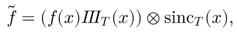


 - 상자 함수의 푸레이 역변환은 싱크 함수이다.
 - 싱크 함수는 무한대의 크기를 지녔기에 모든 표본값 $f(i)$가 공간 영역의 특정 값을 계산하기 위해 필요하다.
 - 한정된 크기의 필터가 원 함수를 완벽히 재구성할 수 없지만 실제 구현에서 선호된다.
 - 그래픽스에서 자주 사용되는 대체법은 상자 함수를 사용하는 것, x 주변에서 일정 영역의 표본 값을 평균하는 것이다.

이 모든것을 통합해서 요약하면 다음과 같다.
 - 푸리에 변환의 중요한 특성중에 두 함수의 곱의 푸리에 변환이 각각의 푸리에 변환의 콘볼루션으로 나타낼 수 있다.
 - 이를 통해 샤 함수를 곱하여 원 함수의 표본을 구할 수 있다.
 - 이후 싱크 함수를 이용하여 원 함수로의 재구성을 할 수 있다.

### 앨리어싱

이상적인 표본화와 재구성 방식의 현실적 문제는 신호가 대역 제한이라는 것이다. 대역 제한이 아닌 신호나 주파수 내용에 비해 충분히 높은 표본화 주기를 이용하지 않으면 원 함수와 다른 함수를 재구성한다. 성공적인 재구성의 핵심은 표본화된 스펙트럼을 적절한 크기의 상자 함수와 곱해서 원 스펙트럼을 복구하는 것이다. 만약 공간 영역에서 표본 사이의 공간이 증가 (충분한 표본을 추출하지 않는다면) 주파수 영역의 표본 간격이 감소한다. 즉 그림과 같게 된다.

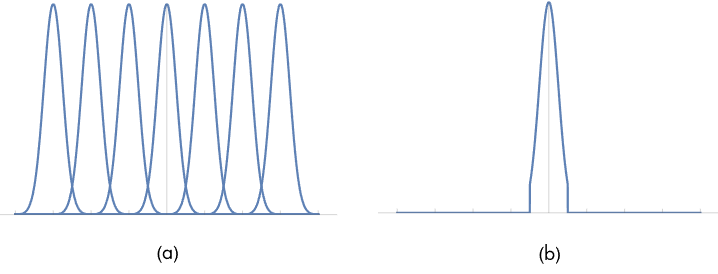

원본 신호의 고 주파수 세부 내용은 재구성된 신호의 더 낮은 주파수 영역으로 변한다. 이 새로운 저주파수 결함을 고주파수가 저주파수로 위장하기 때문에 앨리어싱이라고 부른다.

중첩된 스펙트럼에 대한 해결책은 복제들이 충분히 떨어져 중첩하지 않아 앨리어싱이 완전히 제거할 때까지 표본화율을 증가시키는 것이다. [나이키스트 이론](https://ralasun.github.io/signal%20analysis/2021/07/01/nyq/)에 따르면 균일한 표본점 $w_{s}$의 주파수가 신호 $w_{0}$의 최고 주파수의 두 배보다 높을 경우 원래 신호를 표본으로부터 완벽하게 재구성 할 수 있다고 한다.

하지만 그래픽스에서 대부분의 경우에 대역 제한이 있는 신호는 없다. 때문에 표본화율을 증가시키는 것 외의 다른 방법이 필요하다.


### 안티앨리어싱 기술

 - 표본 추출에 대한 결함을 프리앨리어싱, 재구성시에 발생하는 결함을 포스트앨리어싱 이라 한다.

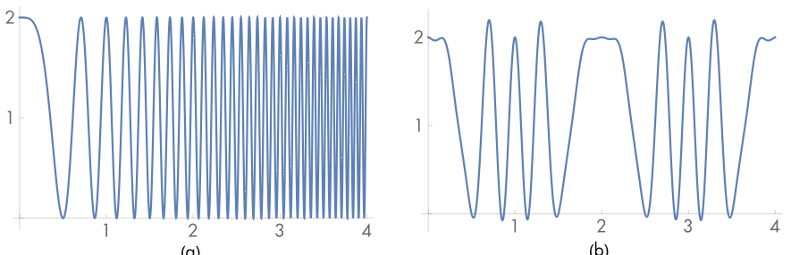

#### 비균일 표본화
 - 표본의 간격을 비균일하게 변화시켜 앨리어싱의 시각적 영향을 줄이는 것이 가능
 - 충분하지 않은 표본화율에 대해사 균일과 비균일 표본 추출은 모두 부정확한 재구성 신호를 생성
 - 하지만 비균일 표본화는 규칙적인 앨리어싱을 노이즈로 변환, 인간의 시각계를 덜 방해한다.

#### 적응적 표본화
 - 나이키스트 한계보다 높은 주파수를 가진 신호의 영역을 판별할 수 있다면 표본화율을 증가시키지 않고 이 영역에서만 추가적인 신호를 추출하는 것이다.
 - 초 표본화가 필요한 모든 곳을 찾기 어렵기에 실용적이진 않다.
 - 대표적으로 인접한 두영역을 비교하여 변화량이 큰 곳을 찾는 방식에 기반을 둔다.

#### 사전 필터링
 - 원 함수를 필터 처리해 사용하는 표본화율에서 정확히 잡아낼 수 없는 고주파수를 제거하는 방법
 - 함수 특정 정보를 제거함으로써 변화시키지만, 일반적으로 흐릿함이 앨리어싱에 비해 덜 불쾌

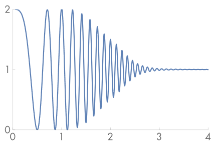

 - 나이키스트 한계를 넘은 주파수를 필터로 제거한 그래프. 대부분의 고주파수 세부는 제거된 것을 알 수 있다.

### 이미지 합성에 응용
이 개념들을 2D의 표본화와 렌더링된 장면 이미지 재구성 활용은 간단하다. 이미지를 이미지 위치에서 방사 값 L로의 함수로 생각할 수 있다.
이 때 레이트레이서로 어떤 (x, y)점을 선택해도 L을 알 수 있다. 그러나 사전 필터링이 불가능하다는 단점이 있다. 그러므로 이번 장에서 표본 추출기는 표본화율을 최종 이미지의 기본 픽셀 간격을 넘어서 증가시키면서(픽셀당 1개 이상의 표본) 비균일 표본 분포로 앨리어싱을 노이즈로 변화시킨다.

더불어 시간 t, 렌즈 위치와 관련된 (u, v) 추가적으로 더 많은 요소가 방사를 추정하기 위해 들어가게 되어서 더 고차원 이미지 함수를 얻게 된다. 이는 고품질 이미지를 생성하는데 더 도움이 된다.

### 렌더링에서 앨리어싱의 근원


기하 구조는 렌더링 이미지에서 앨리어싱을 유발하는 흔한 원인중 하나다. 투영 과정에서 발생하는 step function 이 주된 원인이다. 이는 깁스 현상이라 알려저 있는 [물결 결함](https://en.wikipedia.org/wiki/Ringing_artifacts)을 발생시킨다. 기하구조 외에도 그림자 영역 가장자리에서 발생하기도 한다.

다른 앨리어싱의 근원은 물체의 텍스처와 재질에서 나타난다. 텍스처 맵이 제대로 필터링 되지 않았을때나 반짝이는 표면의 많은 작은 하이라이트에서 음영 앨리어싱이 일어난다.

### 픽셀에 대한 이해
픽셀에 대한 두 가지 중요한 개념
 - 이미지를 구성하는 픽셀은 이미지 면에서 분리된 점들에서의 이미지 함수의 점 표본이다. (픽셀은 면이 아니라 하나의 점)
 - 최종 이미지의 픽셀은 픽셀 격자에서 비연속적 정수 (x, y) 좌표로 자연스럽게 정의 되지만 7장에서는 sampler 이미지 표본을 연속된 부동 소수점 (x, y) 위치로 생성한다. 이를 자연스럽게 하기 위해서 가까운 정수 좌표로 반올림 하자.
 - 이는 연속된 표본위치를 비연속 좌표계에서 생성하면 1/2 오프셋 만큼 어긋나는 오류가 발생한다.
 - 대신 연속적 좌표 c를 비연속적 좌표 d 르 잘라낸다. $d = \left\lfloor c \right\rfloor$
 - 그리고 비연속 좌표에서 연속으로 다음과 같이 변환한다. $c = d + 1/2$
 
 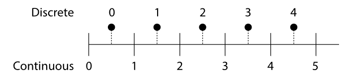

# 이미지 표본 인터페이스

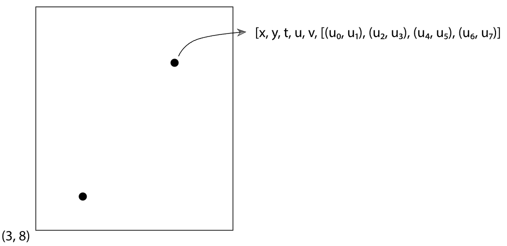

 - Sampler의 작업은 $[0, 1)^{n}$ 안의 n차운에서 일련의 표본을 생성하는 것으로 하나의 표준 벡터가 각 이미지 표본에 대해 생성되며 각 표본의 차원 n의 수가 빛 전송 알고리즘으로 전달된다.
 - 가능한 가장 단순한 sampler 의 구현은 단지 [0, 1) 안의 균일한 난수 값을 반환한느 것으로, 매번 표본 벡터의 추가적인 요소가 필요
 - 간단한 샘플링 방식의 비용은 싸지만, 고품질 이미지를 생성하기 위해선 더 많은 계산이 필요하다.
 - 하지만 더 복잡한 표본을 뽑아낸다면 실행시간은 비슷하지만 더 고품질의 이미지를 생성할 수 있다.
 - 표본벡터의 특징으로는 (x, y) 뿐만 아니라 시간(t), 카메라 렌즈(u, v)를 이용한 5차원 벡터이다.
 - 시스템상 더 많은 차원이 이용될 수 있다.

## 표본 패턴 평가: 불일치
 - 푸리에 분석은 제한 주파수에 대해 더 많은 균일 간격 표본보다 얼마나 개선되는지만 수량화 가능하다. 때문에 푸리에 분석만으로는 개선정도를 알기 쉽지 않다.
 - 이에 표본 위치에서 패턴의 질을 평가하기 위해 불일치 (n차원 표본 위치의 패턴 품질을 수치적으로 표현)를 도입했다.
 - n차원 공간 $[0, 1)^{n}$ 에서 점 집함의 질은 부분 영역들을 보고, 각 영역 안의 점들의 수를 세어 각 영역의 부피와 그 안에 있는 샘플 점들의 수를 비교함으로써 평가될 수 있다.
 - 일반적으로 일부 부피들은 전체 샘플의 점들을 일정 비율로 갖고 있어야 한다.
 - 그래서 실제 부피와 점들에 의해 추정된 부피 사이의 최대 차이(불일치)를 최소화 하는 패턴을 사용하려고 시도할 수 있다.

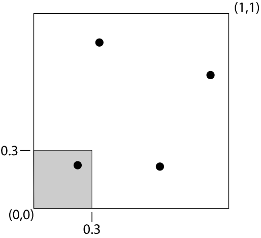
 - 점집합의 불일치를 계산하기 위해, $[0, 1)^{n}$의 부분집합인 모양 B의 계열을 선택
 - 주어진 표본점 P에 대해서 P의 B에 대한 불일치는 다음과 같다.


 - 즉, 모든 부피에 대해서 일정 비율과의 오차를 계산하여 가장 큰값을 갖는 것이 불일치가 된다.

 - 저불일치 측정에 따라 균일 시퀀스가 더 좋아 보일 수 있다. 하지만 2D에서 이미지 표본화에는 불규칙한 지터링 패턴이 균일한 패턴보다 앨리어싱 오류를 노이즈로 변환하기에 더 우월하다.
 - 하지만 더 높은 차원에서의 낮은 불일치 패턴은 1차원에서 보다 덜 균일하므로 (불규칙적이다) 실제로 샘플 패턴으로서 꽤 잘 작동한다.
 - 그리고 단순히 불일치만으로는 더 좋은 척도가 아니다. 각 부피로 나뉘어져 있는 표본들이 실제로는 인접한 표본일 수 있기 때문이다.

## 기본 Sampler 인터페이스

```c++
<<Sampler Declarations>>= 
class Sampler {
public:
    <<Sampler Interface>> 
       virtual ~Sampler();
       Sampler(int64_t samplesPerPixel);
       virtual void StartPixel(const Point2i &p);
       virtual Float Get1D() = 0;
       virtual Point2f Get2D() = 0;
       CameraSample GetCameraSample(const Point2i &pRaster);
       void Request1DArray(int n);
       void Request2DArray(int n);
       virtual int RoundCount(int n) const {
           return n;
       }
       const Float *Get1DArray(int n);
       const Point2f *Get2DArray(int n);
       virtual bool StartNextSample();
       virtual std::unique_ptr<Sampler> Clone(int seed) = 0;
       virtual bool SetSampleNumber(int64_t sampleNum);

    <<Sampler Public Data>> 
       const int64_t samplesPerPixel;

protected:
    <<Sampler Protected Data>> 
       Point2i currentPixel;
       int64_t currentPixelSampleIndex;
       std::vector<int> samples1DArraySizes, samples2DArraySizes;
       std::vector<std::vector<Float>> sampleArray1D;
       std::vector<std::vector<Point2f>> sampleArray2D;

private:
    <<Sampler Private Data>> 
       size_t array1DOffset, array2DOffset;

};

<<Sampler Method Definitions>>+=  
CameraSample Sampler::GetCameraSample(const Point2i &pRaster) {
    CameraSample cs;
    cs.pFilm = (Point2f)pRaster + Get2D();
    cs.time = Get1D();
    cs.pLens = Get2D();
    return cs;
}
```
 - 모든 sampler 는 생성자에 각 픽셀에 대해 생성할 표본수를 제공해야한다.
 - 렌더링 알고리즘이 주어진 픽셀 위에서 시작할 준비가 됐다면 StartPixel()의 호출로 시작된다. 이미지 안에서 픽셀의 좌표를 제공한다.
 - Get1D() 메서드는 현재 표본 벡터에서 다음 차원의 표본 값을 반환하며, Get2D()는 다음 두 차원에 대한 표본 값을 반환한다.
 - 편의를 위해 sampler 기본 클래스는 주어진 픽셀에 대한 CameraSample을 초기화 하는 메서드를 제공한다.
 - Request1DArray(), Request2DArray() 메서드는 렌더링이 시작하기 전에 각 차원의 배열에 대해 호출돼야 한다.
 - 렌더링 과정에서 Get1DArray(), Get2DArray()메서드는 기존에 요청된 표본에서 배열의 시작 포인터를 받아서 호출할 수 있다.
 - 하나의 표본 작업이 끝나면 적분기는 StartNextSample()을 호출한다. 이 호출은 sampler 가 표본 요소에 대한 이후 요청이 현재 픽셀에서 다음 표본의 첫 차원에서 시작하는 값을 반환해야 한다고 알려준다.
 - sampler 는 현재 표본에 대한 다양한 상태를 저장한다. 따라서 단일 sampler 를 여러 스레드에서 사용하는것은 위험하다. Clone() 메서드는 렌더링 스레드에서 사용하는 sampler 의 새 인스턴스를 생성한다.

## 표본기 구현
```c++
<<Sampler Method Definitions>>+=  
void Sampler::StartPixel(const Point2i &p) {
    currentPixel = p;
    currentPixelSampleIndex = 0;
    <<Reset array offsets for next pixel sample>> 
       array1DOffset = array2DOffset = 0;

}
```
 - StartPixel() 메서드 구현은 표본화되는 현재 픽셀의 좌표를 저장하고 현재 생성되는 픽셀 안의 표본수인 currentPixelSampleIndex 를 0으로 재설정한다.
```c++
<<Sampler Method Definitions>>+=  
bool Sampler::StartNextSample() {
    <<Reset array offsets for next pixel sample>> 
       array1DOffset = array2DOffset = 0;

    return ++currentPixelSampleIndex < samplesPerPixel;
}

<<Sampler Method Definitions>>+=  
bool Sampler::SetSampleNumber(int64_t sampleNum) {
    <<Reset array offsets for next pixel sample>> 
       array1DOffset = array2DOffset = 0;

    currentPixelSampleIndex = sampleNum;
    return currentPixelSampleIndex < samplesPerPixel;
}
```
 - StartNextSample() 과 SetSampleNumber() 에서는 currentPixelSampleIndex 를 적절히 갱신시킨다.
```c++
<<Sampler Method Definitions>>+=  
void Sampler::Request1DArray(int n) {
    samples1DArraySizes.push_back(n);
    sampleArray1D.push_back(std::vector<Float>(n * samplesPerPixel));
}
<<Sampler Method Definitions>>+=  
void Sampler::Request2DArray(int n) {
    samples2DArraySizes.push_back(n);
    sampleArray2D.push_back(std::vector<Point2f>(n * samplesPerPixel));
}
```
 - samples1DArraySizes 와 samples2DArraySizes에 표본 배열의 크기가 저장되며 전체 픽셀의 배열 표본에 대한 메모리는 sampleArray1D와 sampleArray2D에 할단된다.
```c++
<<Sampler Method Definitions>>+=  
const Float *Sampler::Get1DArray(int n) {
    if (array1DOffset == sampleArray1D.size())
        return nullptr;
    return &sampleArray1D[array1DOffset++][currentPixelSampleIndex * n];
}
<<Sampler Method Definitions>>+=  
const Point2f *Sampler::Get2DArray(int n) {
    if (array2DOffset == sampleArray2D.size())
        return nullptr;
    return &sampleArray2D[array2DOffset++][currentPixelSampleIndex * n];
}
```
 - 적절한 배열 포인터를 반환하는 것은 우선 현재 표본 벡터에서 얼마나 많이 소모했는지에 기반을 두고 적절한 배열을 선택하고, 그 후 현재 픽셀 표본 색인에 기반을 두고 이의 적절한 인스턴스를 반환하는 것이다.

## 픽셀 표본기
PixelSampler 클래스는 픽셀에 대한 모든 표본 벡터에 대한 차원의 표본 값을 한번에 생성하는 경우를 위해 일부 기능을 구현해두었다.
```c++
<<Sampler Declarations>>+=  
class PixelSampler : public Sampler {
public:
    <<PixelSampler Public Methods>> 
       PixelSampler(int64_t samplesPerPixel, int nSampledDimensions);
       bool StartNextSample();
       bool SetSampleNumber(int64_t);
       Float Get1D();
       Point2f Get2D();

protected:
    <<PixelSampler Protected Data>> 
       std::vector<std::vector<Float>> samples1D;
       std::vector<std::vector<Point2f>> samples2D;
       int current1DDimension = 0, current2DDimension = 0;
       RNG rng;

};
<<Sampler Method Definitions>>+=  
PixelSampler::PixelSampler(int64_t samplesPerPixel,
        int nSampledDimensions)
    : Sampler(samplesPerPixel) {
    for (int i = 0; i < nSampledDimensions; ++i) {
        samples1D.push_back(std::vector<Float>(samplesPerPixel));
        samples2D.push_back(std::vector<Point2f>(samplesPerPixel));
    }
}
```
 - 렌더링 알고리즘에 사용되는 표본 벡터의 차원수는 미리 알 수 없다.
 - 그러므로 PixelSampler 생성자는 sampler 가 계산할 비배열 표본 값에 대한 최대 차원의 수를 받는다.
 - 이 모든 요소의 차원이 소모되면 PixelSampler 는 추가적인 차원에 대해서 균일 난수 값만을 반환한다.
 - 그 후 StartPixel() 메서드에서 samples1D 와 samples2D 배열을 채운다.
```c++
<<Sampler Method Definitions>>+=  
bool PixelSampler::StartNextSample() {
    current1DDimension = current2DDimension = 0;
    return Sampler::StartNextSample();
}
<<Sampler Method Definitions>>+=  
bool PixelSampler::SetSampleNumber(int64_t sampleNum) {
    current1DDimension = current2DDimension = 0;
    return Sampler::SetSampleNumber(sampleNum);
}
```
 - current1DDimension 과 current2DDimension 은 현재 픽셀 표본에 대해 각각의 배열에 대한 오프셋을 저장한다.
 - 표본 시작시에 반드시 0으로 재설정돼야 한다.

```c++
<<Sampler Method Definitions>>+=  
Float PixelSampler::Get1D() {
    if (current1DDimension < samples1D.size())
        return samples1D[current1DDimension++][currentPixelSampleIndex];
    else
        return rng.UniformFloat();
}
```
 - Get1D() 의 구현은 모든 계싼된 차원이 소모될 때까지만 연속적인 차원에 대한 값을 반환한다. 이후에는 난수 반환

## 전역 표본기
 - 픽셀 표본기는 픽셀당 표본을 생성했다면 전역 표본기는 픽셀 전체에서 표본을 생성한다.
 - 따라서 연석된 표본들은 각각 다른 픽셀을 방문한다.
 - 따라서 전역 표본기는 sampler 인터페이스가 각 표본에 대해 렌더링 되는 픽셀을 설정할 수 있게 정의해야 한다.
 - 이러한 구조는 필름을 작은 이미지 조각으로 쪼개 멀티스레딩 렌더링하도록 적용 가능하며, 각 스레드가 픽셀을 최종 이미지에 효율적으로 합쳐질 수 있는 지역 영역에서 계산하게 된다.

```c++
<<Sampler Declarations>>+= 
class GlobalSampler : public Sampler {
public:
    <<GlobalSampler Public Methods>> 
       bool StartNextSample();
       void StartPixel(const Point2i &);
       bool SetSampleNumber(int64_t sampleNum);
       Float Get1D();
       Point2f Get2D();
       GlobalSampler(int64_t samplesPerPixel) : Sampler(samplesPerPixel) { }
       virtual int64_t GetIndexForSample(int64_t sampleNum) const = 0;
       virtual Float SampleDimension(int64_t index, int dimension) const = 0;

private:
    <<GlobalSampler Private Data>> 
       int dimension;
       int64_t intervalSampleIndex;
       static const int arrayStartDim = 5;
       int arrayEndDim;

};
<<GlobalSampler Public Methods>>= 
GlobalSampler(int64_t samplesPerPixel) : Sampler(samplesPerPixel) { }
```
 - GlobalSampler 는 하위 클래스가 대신 구현해야 할 3가지 새로운 순수 가상 메서드를 제공한다.
 - GetIndexForSample()은 현재 픽셀에서의 역매핑을 처리하여 주어진 표본 색인을 표본 벡터의 전체적 집합에 대한 전역 색인으로 변경한다.
 - SampleDimension() 은 시퀀스 안의 index 번째 표본 벡터에서 주어진 차원의 표본 값을 반환한다.
```c++
<<Sampler Method Definitions>>+=  
void GlobalSampler::StartPixel(const Point2i &p) {
    Sampler::StartPixel(p);
    dimension = 0;
    intervalSampleIndex = GetIndexForSample(0);
    <<Compute arrayEndDim for dimensions used for array samples>> 
       arrayEndDim = arrayStartDim +
                     sampleArray1D.size() + 2 * sampleArray2D.size();

    <<Compute 1D array samples for GlobalSampler>> 
       for (size_t i = 0; i < samples1DArraySizes.size(); ++i) {
           int nSamples = samples1DArraySizes[i] * samplesPerPixel;
           for (int j = 0; j < nSamples; ++j) {
               int64_t index = GetIndexForSample(j);
               sampleArray1D[i][j] =
                   SampleDimension(index, arrayStartDim + i);
           }
       }

    <<Compute 2D array samples for GlobalSampler>> 
       int dim = arrayStartDim + samples1DArraySizes.size();
       for (size_t i = 0; i < samples2DArraySizes.size(); ++i) {
           int nSamples = samples2DArraySizes[i] * samplesPerPixel;
           for (int j = 0; j < nSamples; ++j) {
               int64_t idx = GetIndexForSample(j);
               sampleArray2D[i][j].x = SampleDimension(idx, dim);
               sampleArray2D[i][j].y = SampleDimension(idx, dim+1);
           }
           dim += 2;
       }
       Assert(dim == arrayEndDim);
}
```
 - 픽셀에 대한 표본을 생성해야 할 시간에 표본의 차원을 재설정하고 픽셀의 첫 표본 색인을 찾을 필요가 있다.
 - 모든 표본에 대해 표본 배열에 대한 값은 모두 다음에 생성된다.
 - dimension 멤버 변수는 표본 구현이 표본 값을 생성하라고 물어볼 다음 차원을 추적한다.
 - intervalSampleIndex는 현재 픽셀 안의 현재 표본 $s_{i}$에 대응하는 표본의 색인을 저장한다.
 - arrayEndDim 을 생성자 실행시 계산하는 것이 불가능한데, 이는 아직 요청되지 않았기 때문이다. 따라서 StartPixel()에서 계산한다.
 - 표본 생성시 sample 개수만큼 루프를 돌며 GetIndexForSample 을 통해 표본 인덱스를 찾고, SampleDimension 을 통해 표본 값을 찾는다.
```c++
<<Sampler Method Definitions>>+=  
bool GlobalSampler::StartNextSample() {
    dimension = 0;
    intervalSampleIndex = GetIndexForSample(currentPixelSampleIndex + 1);
    return Sampler::StartNextSample();
}
<<Sampler Method Definitions>>+=  
bool GlobalSampler::SetSampleNumber(int64_t sampleNum) {
    dimension = 0;
    intervalSampleIndex = GetIndexForSample(sampleNum);
    return Sampler::SetSampleNumber(sampleNum);
}
```
 - 픽셀 표본이 변경될 때 dimension 변수를 재설정하고 intervalSamplerIndex 값을 다시 계산해야 한다.
```c++
<<Sampler Method Definitions>>+=  
Float GlobalSampler::Get1D() {
    if (dimension >= arrayStartDim && dimension < arrayEndDim)
        dimension = arrayEndDim;
    return SampleDimension(intervalSampleIndex, dimension++);
}
2D samples follow analogously.

<<Sampler Method Definitions>>+= 
Point2f GlobalSampler::Get2D() {
    if (dimension + 1 >= arrayStartDim && dimension < arrayEndDim)
        dimension = arrayEndDim;
    Point2f p(SampleDimension(intervalSampleIndex, dimension),
              SampleDimension(intervalSampleIndex, dimension + 1));
    dimension += 2;
    return p;
}
```

# 층별 표본화

 - 픽셀 영역을 사각형의 영역으로 세분해 각 영역에 하나의 표본을 생성했을 때 이 영역은 보통 계층이라 부른다. (StartifiedSampler)
 - 계층화의 핵심은 표본화 영역을 겹치지 않는 영역으로 나눈후 각 영역에서 하나의 표변을 가져오는 것
 - 이 때, 표본간의 거리가 멀어 중요한 특징을 놓치기 쉽다.
 - 계층이 작을수록 표본을 더 많이 얻게 되므로 이는 더 높은 표본화율이라 말할 수 있다.
 - 층별 표본기는 계층의 중심점을 지터링, 즉 무작위로 움직여 표본을 배치한다. 앨리어싱을 노이즈로 전환

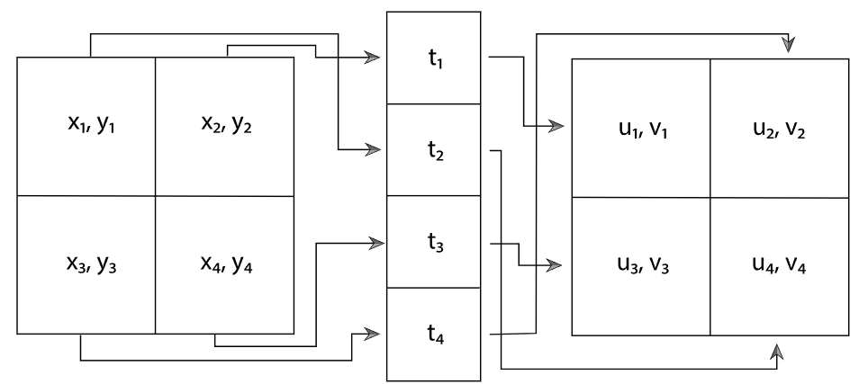
 - 보통 n차원의 이미지를 4개의 계층으로 각각 나눈다면 픽셀별 표본 숫자는 보통 $4^{n}$이 될 것이다.
 - 이는 비용이 너무 많이 드는데, 대안으로 울비에 대해사 계층화 패턴을 계산하고 각 차원의 집합으로 임의로 표본을 연결할 수 있다.
 - 여기선 padding 이라고 한다.

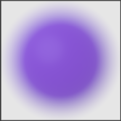
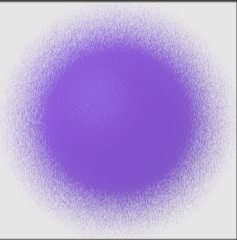
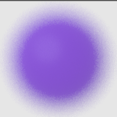
 - 각각 고화질의 원, 무작위 표본으로 생성한 이미지, 동일 수의 표본을 계층화한 결과다.

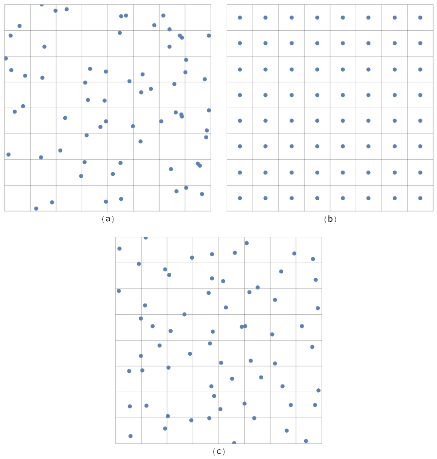
 - a는 무작위 패턴으로 많은 영역이 제대로 표본화 되지 않는다.
 - b는 균일한 층별 패턴으로 비어 있는 영역이 없지만 앨리어싱을 막을 수 없다.
 - c는 층별 지터링 패턴으로 앨리어싱을 노이즈로 변화시키면서 계층화의 장점도 유지한다.


```c++
<<StratifiedSampler Declarations>>= 
class StratifiedSampler : public PixelSampler {
public:
    <<StratifiedSampler Public Methods>> 
       StratifiedSampler(int xPixelSamples, int yPixelSamples,
               bool jitterSamples, int nSampledDimensions)
           : PixelSampler(xPixelSamples * yPixelSamples, nSampledDimensions),
             xPixelSamples(xPixelSamples), yPixelSamples(yPixelSamples),
             jitterSamples(jitterSamples) { }
       void StartPixel(const Point2i &);
       std::unique_ptr<Sampler> Clone(int seed);

private:
    <<StratifiedSampler Private Data>> 
       const int xPixelSamples, yPixelSamples;
       const bool jitterSamples;

};

<<StratifiedSampler Method Definitions>>= 
void StratifiedSampler::StartPixel(const Point2i &p) {
    <<Generate single stratified samples for the pixel>> 
       for (size_t i = 0; i < samples1D.size(); ++i) {
           StratifiedSample1D(&samples1D[i][0], xPixelSamples * yPixelSamples,
                              rng, jitterSamples);
           Shuffle(&samples1D[i][0], xPixelSamples * yPixelSamples, 1, rng);
       }
       for (size_t i = 0; i < samples2D.size(); ++i) {
           StratifiedSample2D(&samples2D[i][0], xPixelSamples, yPixelSamples,
                              rng, jitterSamples);
           Shuffle(&samples2D[i][0], xPixelSamples * yPixelSamples, 1, rng);
       }

    <<Generate arrays of stratified samples for the pixel>> 
       for (size_t i = 0; i < samples1DArraySizes.size(); ++i)
           for (int64_t j = 0; j < samplesPerPixel; ++j) {
               int count = samples1DArraySizes[i];
               StratifiedSample1D(&sampleArray1D[i][j * count], count, rng,
                                  jitterSamples);
               Shuffle(&sampleArray1D[i][j * count], count, 1, rng);
           }
       for (size_t i = 0; i < samples2DArraySizes.size(); ++i)
           for (int64_t j = 0; j < samplesPerPixel; ++j) {
               int count = samples2DArraySizes[i];
               LatinHypercube(&sampleArray2D[i][j * count].x, count, 2, rng);
           }

    PixelSampler::StartPixel(p);
}
```
 - PixelSampler 하위 클래스처럼 nSampledDimensions 만큼의 1D 2D 표본과 요청된 배열에 대한 표본을 생성해야 한다.
 - 표본이 생성된 이후에 이를 무작위로 섞는다. (padding 방식) 여기서 섞지 않는다면 표본 차원의 값은 이미지에서 오류로 이어질 수 있다.

```c++
<<Sampling Function Definitions>>+=  
void StratifiedSample1D(Float *samp, int nSamples, RNG &rng,
        bool jitter) {
    Float invNSamples = (Float)1 / nSamples;
    for (int i = 0; i < nSamples; ++i) {
        Float delta = jitter ? rng.UniformFloat() : 0.5f;
        samp[i] = std::min((i + delta) * invNSamples, OneMinusEpsilon);
    }
}

<<Sampling Inline Functions>>= 
template <typename T>
void Shuffle(T *samp, int count, int nDimensions, RNG &rng) {
    for (int i = 0; i < count; ++i) {
        int other = i + rng.UniformUInt32(count - i);
        for (int j = 0; j < nDimensions; ++j)
            std::swap(samp[nDimensions * i + j],
                      samp[nDimensions * other + j]);
    }
}
```
 - 1D, 2D 계층화 표본 루틴은 유사하다. $[0, 1)$ 범위의 표본을 생성한다.
 - Shuffle() 함수는 임의로 count 의 nDimensions 차원을 가진 표본 값의 배열 순서를 변경한다.

표본의 배열은 딜레마를 제시한다. 만약 적분기가 $n^{2}$개의 2D표본 값을 각 픽셀당 요청한다면 표본기는 2개의 목표를 만족시켜야 한다.
1. 배열 안의 각 표본이 2D에서 잘 분포돼야 한다.
2. 각 표본이 주변 이미지 표본에 대한 표본값과 너무 유사하지 않아야한다. 그리고 표본이 전체 공간을 잘 포착해야 한다.

여기서 StartifiedSampler 는 첫 번째만 처리한다.

두번째 딜레마는 각 픽셀에 대해 호출자가 임의의 수의 표본을 요청할 수 있다는 점이다. 만약 n개를 요청할 경우 nx1 혹은 1xn 으로 계층화 할 수 있지만 이는 계층화 패턴이 1차원으로 제한된다. 이를 해결하기 위해 라틴 하이퍼 큐브 표본화 (LHS)를 사용한다.

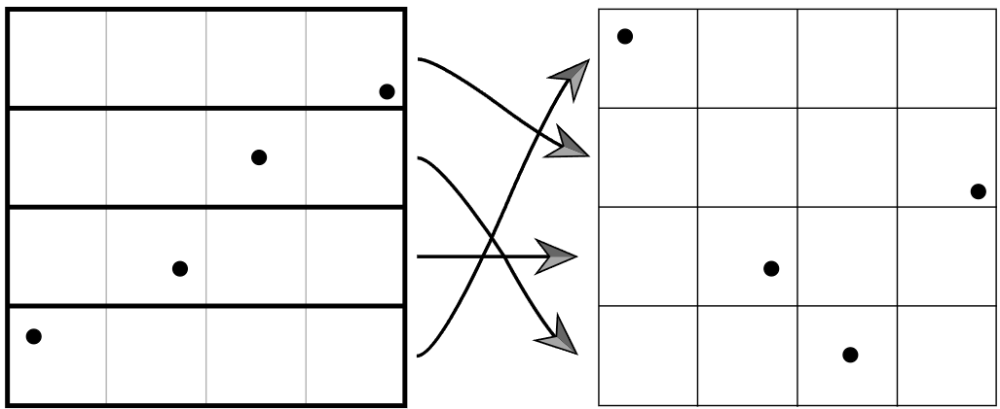
 - LHS는 각 차원의 축을 n 영역으로 나누고 대각선에 하나씩 지터링된 표본을 생성한다.
 - 이 표본은 각 차원에 임의로 재배치 되며 좋은 분포의 패턴을 생성한다.
 - LHS의 장점은 표본 차원의 어느 한 축으로 투영했을 때도 뭉침을 최소화 한다는 것이다.

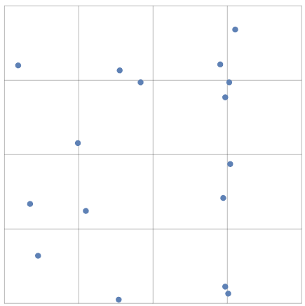
 - $n^{2}$ 개의 표본을 생성하더라도 뭉칠경우 각 축의 같은 점에 투영될 수 있다.
 - 하지만 개수의 특성상 n이 커지게 되면 많은 영역이 표본이 없게 될 것이다.

```c++
<<Sampling Function Definitions>>+=  
void LatinHypercube(Float *samples, int nSamples, int nDim, RNG &rng) {
    <<Generate LHS samples along diagonal>> 
       Float invNSamples = (Float)1 / nSamples;
       for (int i = 0; i < nSamples; ++i)
           for (int j = 0; j < nDim; ++j) {
               Float sj = (i + (rng.UniformFloat())) * invNSamples;
               samples[nDim * i + j] = std::min(sj, OneMinusEpsilon);
           }

    <<Permute LHS samples in each dimension>> 
       for (int i = 0; i < nDim; ++i) {
           for (int j = 0; j < nSamples; ++j) {
               int other = j + rng.UniformUInt32(nSamples - j);
               std::swap(samples[nDim * j + i], samples[nDim * other + i]);
           }
       }

}
```
 - samples 배열에서 요소의 수는 nSamples * nDims 이다.

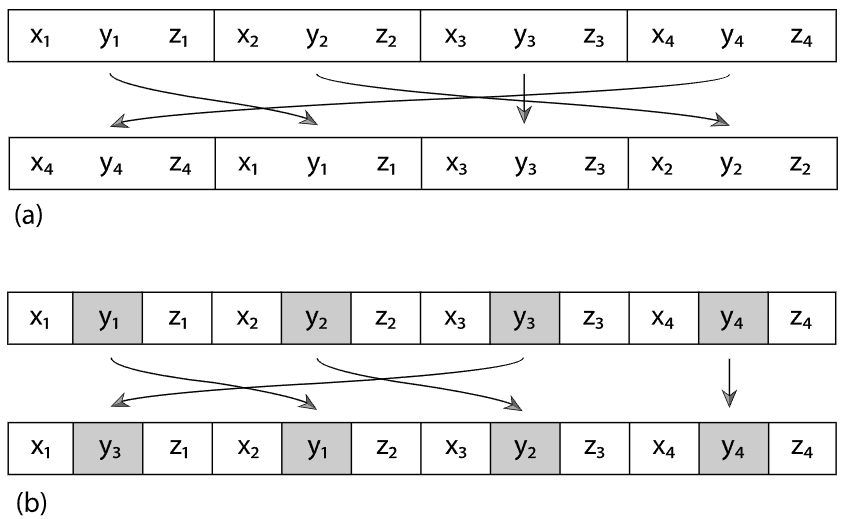
 - 여기서 재 배치 방법은 전체 표본을 재배치 하는 것이 아니라, b 방식처럼 한 번에 nDim 개의 각 차원별로 재배치를 한다.

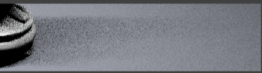
