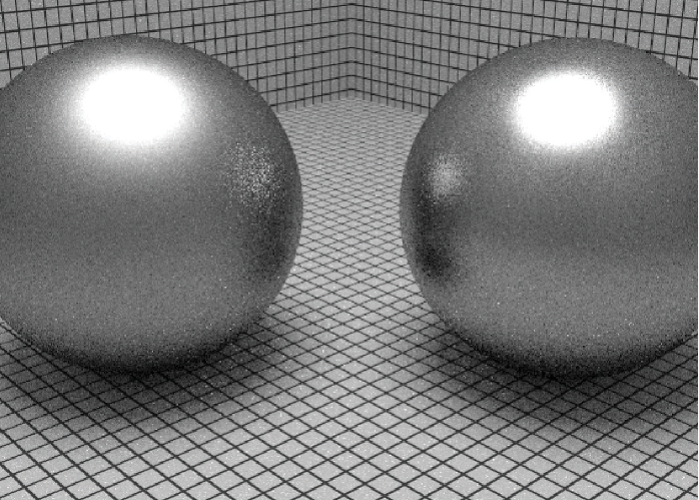
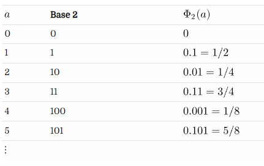
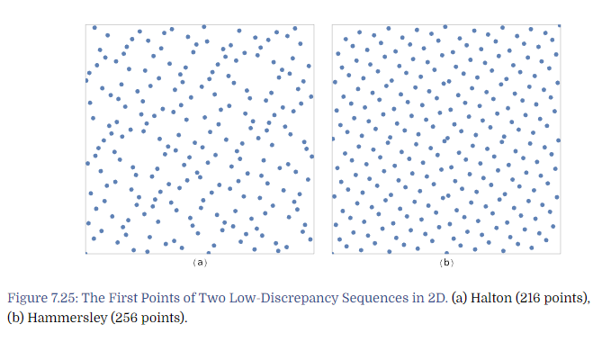
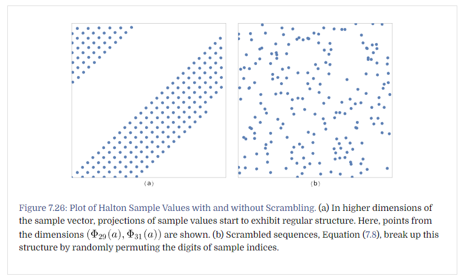
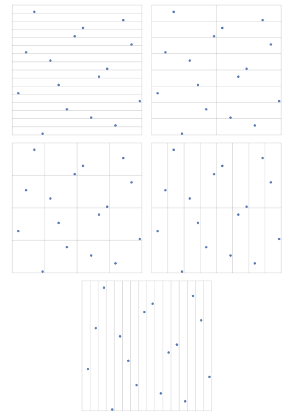
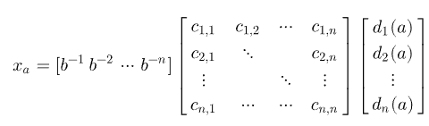
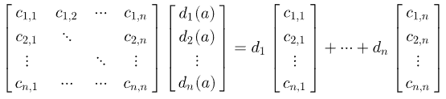
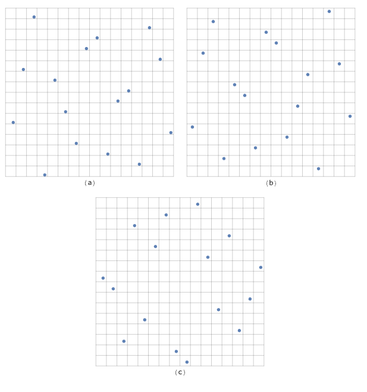
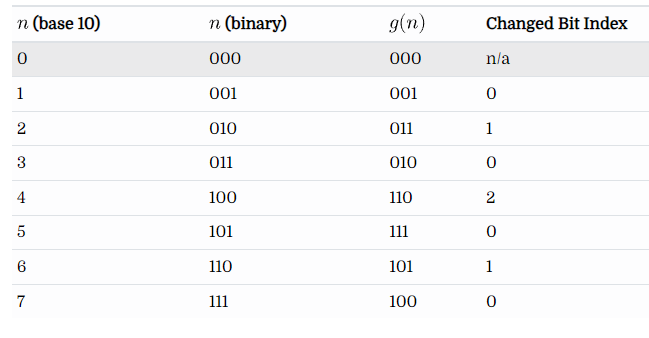

# 핼톤 표본기

기존 표본기들은 인접한 계층의 표본들이 가장자리에서 가까워져 질적 저하가 난다.

앞선 그림 7.14를 확인하면 알 수 있다. 아래는 더 좋은 예로 나왔던 지터링 패턴인데, 인접한 계층에서 어색함을 볼 수 있음.



핼톤 표본기는 저불일치 점집함을 생성하는 알고리즘.

## 해머슬리 / 핼톤 시퀀스?
두 저불일치 점집합이다.

둘 다 근역이라 불리는 생성에 기반한다.


### 근역이란?
$\sum_{i=1}^{m}d_i(a)b^{i-1}$

위와 같이 표현되는 형태를 근역이라고 하는 것 같은데,

어떤 숫자를 b진수 형태로 변형하는 것이라고 보면 된다.

여기서 $d_{i}(a)$ 는 0과 $b-1$ 사이의 값이다.

또한 근역함수 $\Phi_b$ 가 나오는데, 이를 표현하면 아래와 같다.

$\Phi_b(a)=0.d_1(a)d_2(a)...d_m(a)$

대충 정리하면 어떤 양의 정수 a를 0.xxx 의 시퀀스로 나타낸다는 것이고, 각 x는 b가 10진수면 $0-9$ 사이의 값이고, 2진수면 $0-1$ 사이 값이다.

가장 간단하게 2진수에 대해서만 생성한 근역함수가 ```반 데르 코르풋``` 시퀀스.
$x_a=\Phi_2(a)$

$x_a=\Phi_2(a)$ 에 대해서만 표로보면 아래와 같다.



불일치 값을 계산하는 함수가 나오는데, 왜 아래의 식이 나오는지 이해하기가 어려워.. 이전 챕터의 불일치 의미를 짚어보기만 하겠다.
불일치는 N개 표본 중 b영역내 들어온 비율(갯수로 센) 실제 영역과 전체영역의 비율 차이를 의미한다.

Big-O이기 때문에 n값이 커지는게 무의미하다는걸 알 수 있다. 차원이 커져도 큰 차이가 없음을 의미하는 것으로 보인다.

* $x_a=\Phi_2(a)$ 인 반 데르 코르풋 시퀀스의 불일치
  * $D^{*}_N(P)=O(logN/N)$


* 차원이 n개(혹은 무한) 인 핼톤 시퀀스의 불일치
  * $D^{*}_N(P)=O({(logN)^n}/N)$


위 논리에 따라서 핼톤 시퀀스의 불일치가 안정적임을 알 수있다고 하자. 핼톤 시퀀스는 아래와 같이 정의된다.

* $x_a=(\Phi_2(a), \Phi_3(a), \Phi_5(a)..., \Phi_{p_n}(a))$
  *총 n개의 소수를 사용해 시퀀스를 사용한다.

표본이 고정이면 해머슬리 점집합을 사용할 수 있다. 이는 아래와 같이 정의된다고 한다.

* $x_a=(a/N, \Phi_{b_1}(a), \Phi_{b_2}(a), ..., \Phi_{b_n}(a))$
  * 위와 크게 다르진 않고, b도 소수를 사용한다고 한다.

이렇게 해서 두 시퀀스에 대해 2차원 픽셀에 생성되는 초기 256개의 점을 보면 아래와 같다.



이제 근역함수를 살펴보면 아래와 같다.

```c++
# baseIndex = 소수 기반
# a는 시퀀스 계산에 사용되는 값.
<<Low Discrepancy Function Definitions>>=
Float RadicalInverse(int baseIndex, uint64_t a) {
    switch (baseIndex) {
        case 0:
            <<Compute base-2 radical inverse>>
        case 1: return RadicalInverseSpecialized<3>(a);
        case 2: return RadicalInverseSpecialized<5>(a);
        case 3: return RadicalInverseSpecialized<7>(a);
        <<Remainder of cases for RadicalInverse()>>
    }
}
```

case문이 엄청나게 쓰이는걸 알 수 있는데, 이는 컴파일러 최적화 때문이라 보면 된다. 템플릿을 써서 함수 내에 상수처리 부분들을 모두 컴파일타임에 계산한다.

case 0인 경우는 base-2인 경우로, CPU에서 2진수 연산이 빠르다는 사실을 이용한다.

$a=\sum_{i=1}^{m}d_i(a)2^{i-1}$ 의 수식에서, 위 표의 시퀀스의 비트 반전과, 0.xx 형태로 자릿수를 모두 소숫점으로 빼는 연산 즉, 비트 이동을 한다는 사실을 이용하면

1. 뒤집고
2. 비트 이동

을 해야한다. 따라서 위 식을 아래와 같이 바꿔 시퀀스를 반대로 변경하고

$\sum_{i=1}^{m}d_i(a)2^{64-i}$

또 $2^64$로 나누어 비트 이동을 시키면

$\sum_{i=1}^{m}d_i(a)2^{-i}$

가 된다.

정수를 효율적으로 뒤집는건 아래의 두 식으로 연산하면 된다.

```c++
<<Low Discrepancy Inline Functions>>=
inline uint32_t ReverseBits32(uint32_t n) {
    n = (n << 16) | (n >> 16);
    n = ((n & 0x00ff00ff) << 8) | ((n & 0xff00ff00) >> 8);
    n = ((n & 0x0f0f0f0f) << 4) | ((n & 0xf0f0f0f0) >> 4);
    n = ((n & 0x33333333) << 2) | ((n & 0xcccccccc) >> 2);
    n = ((n & 0x55555555) << 1) | ((n & 0xaaaaaaaa) >> 1);
    return n;
}
<<Low Discrepancy Inline Functions>>+=
inline uint64_t ReverseBits64(uint64_t n) {
    uint64_t n0 = ReverseBits32((uint32_t)n);
    uint64_t n1 = ReverseBits32((uint32_t)(n >> 32));
    return (n0 << 32) | n1;
}
```

큰 범위부터 반반씩 나누어 뒤집기를 한다고 보면 된다.

$123456=>456123=>654321$ 이런 느낌이다.

비트를 뒤집었으면 $2^{-64}$ 를 곱하면 되는데, 이는 부동소수점 곱하기로 처리한다. (나누기는 느리기 때문)

```c++
<Compute base-2 radical inverse>>=
return ReverseBits64(a) * 0x1p-64;
```

여기까진 base0인 경우의 근역함수를 위해 사용되는 부분이고, 일반적인 base들에 대해선 (두 번째 이후의 시퀀스값들) 아래와 같이 처리된다.

$v_n=b^{n-1}d_1+b^{n-2}d_2+...+d_n$

결국 $[0,1)$ 의 값을 구하는 것이기 때문에 $b^i$ 는 자릿수를 의미하고 $d_i$는 해당 자릿수에 들어갈 값이라 보면 된다.

또한 이 식에는 이 식은 결국 비트 뒤집기가 포함되어야 한다. 그리고 마지막에 $1/b^{n}$을 곱해서 비트 이동을 시켜버리면 된다.

```c++
<<Low Discrepancy Static Functions>>=
template <int base>
static Float RadicalInverseSpecialized(uint64_t a) {
    const Float invBase = (Float)1 / (Float)base;
    uint64_t reversedDigits = 0;
    Float invBaseN = 1;
    while (a) {
        uint64_t next  = a / base;
        uint64_t digit = a - next * base;
        reversedDigits = reversedDigits * base + digit;
        invBaseN *= invBase;
        a = next;
    }
    return std::min(reversedDigits * invBaseN, OneMinusEpsilon);
}
```

주목해 볼만한건 $base$가 템플릿인 점인데, 위에서도 언급했다시피, 함수가 컴파일타임에 생성이 될 때 $base$에 입력되있는 상수들이 모두 들어가 생성될 것이다.

따라서 $invBase$값도 컴파일 타임에 계산되고, 입력으로 들어온 $a$에 대해 $a/base$를 할 때, 상수나누기에 대한 컴파일러 최적화가 일어난다. (곱으로 바꾸던지 하는?)

이로 인해 성능향상을 크게 도모할 수 있고,

$invBaseN$ 값에 대해서도 곱하기로 계속 누적하고 있다가 마지막에 한 번에 계산하는걸 알 수 있다.

reversedDigits 값은 base를 계속 나누어 몫을 구해 이 값을 누적한다고 보면 된다. 비트 뒤집기에 해당한다.

```c++
<<Low Discrepancy Inline Functions>>+=
template <int base> inline uint64_t
InverseRadicalInverse(uint64_t inverse, int nDigits) {
    uint64_t index = 0;
    for (int i = 0; i < nDigits; ++i) {
        uint64_t digit = inverse % base;
        inverse /= base;
        index = index * base + digit;
    }
    return index;
}
```

위 함수는 근역함수의 역을 구하는 함수인데, 이 값이 사용되는 부분은 휘젓기에 사용된다.

높은 차원으로 갈수록? 핼톤 표본값이 균일한 분포를 이룬다고 한다. 이 때문에 휘젓기를 하여 적당히 소수시퀀스를 재배치해 표본을 구한다.



소수 시퀀스에 대한 생성함수는 아래와 같다.
i번째에서 랜덤 소수를 생성해 p를 재배열 하는걸 볼 수 잇다.

```c++
<<Low Discrepancy Function Definitions>>+=
std::vector<uint16_t> ComputeRadicalInversePermutations(RNG &rng) {
    std::vector<uint16_t> perms;
    <<Allocate space in perms for radical inverse permutations>>
    uint16_t *p = &perms[0];
    for (int i = 0; i < PrimeTableSize; ++i) {
        <<Generate random permutation for th prime base>>
        p += Primes[i];
    }
    return perms;
}
```

Allocate 부분은 아래와 같다.
```c++
<<Allocate space in perms for radical inverse permutations>>=
int permArraySize = 0;
for (int i = 0; i < PrimeTableSize; ++i)
    permArraySize += Primes[i];
perms.resize(permArraySize);
```

소수 초기화 부분은 아래와 같고, Primes는 아래와 같이 저장된다 보면 된다.
```c++
<<Low Discrepancy Declarations>>=
static constexpr int PrimeTableSize = 1000;
extern const int Primes[PrimeTableSize];
<<Low Discrepancy Data Definitions>>=
const int Primes[PrimeTableSize] = {
    2, 3, 5, 7, 11,
    <<Subsequent prime numbers>>
};
```

재배치는 아래와 같다.
```c++
<<Generate random permutation for th prime base>>=
for (int j = 0; j < Primes[i]; ++j)
    p[j] = j;
Shuffle(p, Primes[i], 1, rng);
```

변경된 permutation에 대한 근역함수는 아래와 같다.

```c++
<<Low Discrepancy Function Definitions>>+=
Float ScrambledRadicalInverse(int baseIndex, uint64_t a,
        const uint16_t *perm) {
    switch (baseIndex) {
        case 0: return ScrambledRadicalInverseSpecialized<2>(perm, a);
        case 1: return ScrambledRadicalInverseSpecialized<3>(perm, a);
        case 2: return ScrambledRadicalInverseSpecialized<5>(perm, a);
        case 3: return ScrambledRadicalInverseSpecialized<7>(perm, a);
        <<Remainder of cases for ScrambledRadicalInverse()>>
    }
}
```

# (0,2) 표본기



그림을 먼저 보면, $(1/16, 1)$ 상자, $(1/8, 1/2)$ 상자, $(1/4, 1/4)$ 상자.. 모두에서 균일하게 한개의 점이 있는 것을 볼 수 있다.

이런 결과를 만들어내는 표본기라고 보면 된다.

이전 핼톤 표본기의 문제는 컴퓨터가 2진연산에 강하다는 사실을 앎에도, 2진 연산이 아닌 다른 연산까지 사용해 표본을 추출한다는 문제가 있었다.
 (base가 2가 아닌 경우 점점 연산이 복잡해지므로)

(0,2) 표본기는 모두 2진 연산으로 처리되는 생성 행렬을 사용해 구한다.

$a$는 $b$진수의 n개의 숫자를 가진 숫자라고 생각하자.
 $x_a$는 이전과 마찬가지로 $a$에 대한 시퀀스같은 값이라 생각하고
 생성행렬 $C$가 있다 할 때 아래와 같이 표현이 가능하다.



생성행렬 $C$가 단위 행렬이면, $b$진수의 정규 근역이 된다고 한다.

$C$ 는 $0$ 또는 $1$의 값을 가진 행렬이라 가정하고, 실제 코드에선 $base=2$ 로, $n=32$로 생각한다.

그러면 위 식에서 $C[d_{i}(a)]^T$ 를 생각해보면 아래와 같다.



$d_i$ 로 묶이는 이유는 풀어보면 대강 나온다.

즉 $C[d_{i}(a)]^T$ 의 곱셈은 단순히 $d_{i}(a)$가 $1$인 곳의 $C$의 $i$ 열을 XOR하는 것과 같다.

$d_{i}$는 2진수 이기 때문에 0또는 1일 것이기 때문.

이는 연산으로 나타내면 굉장히 간단하고, $n=32$이기 때문에 단순한 int연산으로 구현 가능하다.

```c++
<<Low Discrepancy Inline Functions>>+=
inline uint32_t MultiplyGenerator(const uint32_t *C, uint32_t a) {
    uint32_t v = 0;
    for (int i = 0; a != 0; ++i, a >>= 1)
        if (a & 1)
            v ^= C[i];
    return v;
}
```

$v=C[d_{i}(a)]^T$ 로 표현가능하다는걸 위 함수로 알았기 때문에 아까 봤던 $x_a$에 대해 아래와 같은 표현이 가능할 것이다.


위 식은 비트 반전 및 비트 이동이 모두 이루어진 결과이고, uint32_t임을 고려하면,

$v=v_1+2v_2+2^{2}v_3+...+2^{31}v_{32}=\sum_{i=1}^{32}2^{i-1}v_i$

라는걸 알 수 있고, 이제 비트 반전까지 하면

$v^{`}=\sum_{i=1}^{32}2^{32-i}v_i$
가 된다고 알 수 있다.

결국 생성행렬을 만드는게 (0,1) 생성기의 고민거리가 될 것이다.

여기엔 Kollig-Keller의 방식을 사용한다고 한다.

단위 정사각형 $[0, 1)^2$ 를 반복적으로 나누고 섞는 과정을 반복한다.

$[0, 1) => [0,0.5), [0.5, 1)$ 의 방식으로 구간을 계속 쪼갠다. 2차원의 경우 정사각형 단위로 계속 쪼개질 것이다.

또한 임의로 나누어진 두 값을 교환한다.



(a)는 (0,2) 시퀀스 기반 표본 패턴이 되고, (b)와 (c)는 위 방식으로 임의로 휘저은 변형이 된다.

```c++
<<Low Discrepancy Inline Functions>>+=
inline Float SampleGeneratorMatrix(const uint32_t *C, uint32_t a,
        uint32_t scramble = 0) {
    return (MultiplyGenerator(C, a) ^ scramble) * 0x1p-32f;
}
```
위는 기반 행렬 C에 대해 a를 대입하여 v를 생성하고 xor연산을 통해 최종 int값을 계산한다. 이후엔 비트 이동을 수행시켜준다.

또한 $v$는 결국 0과 1이 열거된 순서일텐데, 이는 그레이코드와 유사하다.

n에 대한 그레이코드 생성코드는 아래와 같다.

```c++
<<Low Discrepancy Inline Functions>>+=
inline uint32_t GrayCode(uint32_t n) {
    return (n >> 1) ^ n;
}
```

그레이코드와 실제 n값에 대한 2진 값을 표로 보면 아래와 같다.



정확하겐 이해못했는데, 변경해야 하는 비트 수가 정해져 있는 것 같다. 따라서 매번 ```MultiplyGenerator(C, a)``` 로 행렬을 계산하지 말고
XOR 연산을 누적하여 $C$의 한 열에 대해 계산해 나가며 값을 누적해 계산한다는 의미로 보인다.

이를 통해 행렬 곱을 XOR연산 n번으로 줄일 수 있어서 다소 효율적이라는 의미
